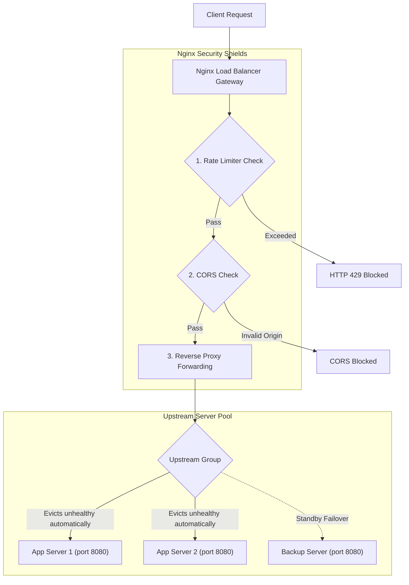

# Project: Secure Load-Balanced Web API Gateway

**Breadcrumbs:** [[Index|🏠 Index]] > Projects > Systems Design > **Secure Load-Balanced Web API Gateway**

---

## 🎯 Project Overview
This project demonstrates how to construct a secure, horizontally scaled web API infrastructure using Nginx as a reverse proxy and load balancer. It implements traffic routing algorithms, passive health checks, rate limiting, CORS safeguards, and SQL injection prevention techniques.

---

## 🏛️ Target Architecture
The incoming client requests are processed through multiple layers of security shields (Rate Limiter, WAF, and CORS origin checkers) implemented in Nginx before being routed to a healthy upstream backend server group.



---

## 🛠️ Step-by-Step Implementation & Configuration

### 1. Nginx Load Balancer and Gateway Configuration (`nginx.conf`)
Configure this file under `/etc/nginx/nginx.conf` on the gateway server. It establishes upstream server definitions, load balancing algorithms, and reverse-proxy failover headers.

```nginx
events {
    worker_connections 1024;
}

http {
    # ==========================================
    # A. Rate Limiter Zones
    # ==========================================
    # Key: $binary_remote_addr (uses binary IP, consumes 64 bytes per state)
    # Zone: Name 'api_limit' with 10MB memory (holds ~160,000 states)
    # Rate: 10 requests per second (r/s)
    limit_req_zone $binary_remote_addr zone=api_limit:10m rate=10r/s;

    # ==========================================
    # B. Upstream server pools (demonstrating algorithms)
    # ==========================================
    
    # 1. Weighted Round Robin (backend1 gets 3x more traffic)
    upstream app_servers_weighted {
        server backend1.example.com:8080 weight=3;
        server backend2.example.com:8080 weight=1;
    }

    # 2. Least Connections (routes to the server with the fewest active TCP connections)
    upstream app_servers_least_conn {
        least_conn;
        server backend1.example.com:8080;
        server backend2.example.com:8080;
    }

    # 3. IP Hash (routes based on client IP hash; guarantees session persistence)
    upstream app_servers_ip_hash {
        ip_hash;
        server backend1.example.com:8080;
        server backend2.example.com:8080;
    }

    # 4. Failover Upstream (uses passive health check parameters)
    upstream app_servers_failover {
        # max_fails: number of unsuccessful communication attempts before marked unhealthy
        # fail_timeout: time the server remains evicted (10s)
        # max_conns: limits active connections to prevent resource exhaustion
        server backend1.example.com:8080 max_fails=3 fail_timeout=10s max_conns=200;
        server backend2.example.com:8080 max_fails=3 fail_timeout=10s max_conns=200;
        
        # backup: receives traffic only when all other primary servers are down
        server backup-backend.example.com:8080 backup;
    }

    # ==========================================
    # C. Server Gateway Block
    # ==========================================
    server {
        listen 80;
        server_name api.example.com;

        location /v1/ {
            # 1. Apply Rate Limiting
            # burst=20: allows a sudden burst of up to 20 requests beyond the limit
            # nodelay: processes burst immediately, but rejects any additional excess traffic
            limit_req zone=api_limit burst=20 nodelay;
            limit_req_status 429;

            # 2. Handle CORS preflight OPTIONS requests
            if ($request_method = 'OPTIONS') {
                add_header 'Access-Control-Allow-Origin' 'https://www.example.com' always;
                add_header 'Access-Control-Allow-Methods' 'GET, POST, PUT, PATCH, DELETE, OPTIONS' always;
                add_header 'Access-Control-Allow-Headers' 'Accept,Authorization,Cache-Control,Content-Type,DNT,If-Modified-Since,Keep-Alive,User-Agent,X-Requested-With' always;
                add_header 'Access-Control-Max-Age' 1728000;
                add_header 'Content-Type' 'text/plain; charset=utf-8';
                add_header 'Content-Length' 0;
                return 204;
            }

            # 3. Inject standard CORS headers
            add_header 'Access-Control-Allow-Origin' 'https://www.example.com' always;
            add_header 'Access-Control-Allow-Methods' 'GET, POST, PUT, PATCH, DELETE, OPTIONS' always;
            add_header 'Access-Control-Allow-Headers' 'Accept,Authorization,Cache-Control,Content-Type,DNT,If-Modified-Since,Keep-Alive,User-Agent,X-Requested-With' always;
            add_header 'Access-Control-Expose-Headers' 'Content-Length,Content-Range' always;

            # 4. Standard proxy headers to forward client IP information downstream
            proxy_set_header Host $host;
            proxy_set_header X-Real-IP $remote_addr;
            proxy_set_header X-Forwarded-For $proxy_add_x_forwarded_for;
            proxy_set_header X-Forwarded-Proto $scheme;

            # Proxy incoming requests to the upstream failover group
            proxy_pass http://app_servers_failover;

            # 5. Passive Health Checks / Timeouts for proxy failover
            proxy_connect_timeout 5s;       # timeout to establish connection
            proxy_send_timeout 10s;         # timeout to write payload
            proxy_read_timeout 10s;         # timeout to read payload

            # Reroutes request to next server in the pool upon failures
            proxy_next_upstream error timeout invalid_header http_500 http_502 http_503 http_504;
            proxy_next_upstream_tries 3;    # maximum number of attempts
            proxy_next_upstream_timeout 15s; # overall time limit for failovers
        }
    }
}
```

### 2. Secure Backend Database Querying (Python Implementation)
Use prepared/parameterized statements inside backend API handlers to ensure user input cannot trigger SQL injection attacks.

```python
import psycopg2

def get_user_data(conn, user_input_username):
    cursor = conn.cursor()
    # SAFE: SQL template is pre-compiled. User parameters are passed separately.
    # The database driver treats the value strictly as a literal text string,
    # rendering any injected characters like ' OR '1'='1 inert.
    query = "SELECT id, username, email FROM users WHERE username = %s"
    cursor.execute(query, (user_input_username,))
    return cursor.fetchall()
```

---

## 🔍 Verification & Diagnostics

### 1. Verification of Caching and CDN Headers
Execute these requests to verify CDN caches, age counters, and validation tokens:

```bash
# Analyze response headers of a static asset
curl -v -o /dev/null https://api.example.com/v1/static/logo.png

# Extract specific caching validation headers
curl -s -I https://api.example.com/v1/static/logo.png | grep -Ei "cache-control|etag|age|x-cache|cf-cache-status"

# Test Cache Revalidation (If-None-Match ETag check)
curl -I -H 'If-None-Match: "5d9c28e67a0a0"' https://api.example.com/v1/static/logo.png
```

### 2. Verify RESTful HTTP Methods
Query the API endpoint using standard HTTP verbs, custom headers, and JSON request bodies:

```bash
# GET Request
curl -X GET "https://api.example.com/v1/users?limit=5" \
     -H "Accept: application/json" \
     -H "Authorization: Bearer MY_JWT_TOKEN"

# POST Request
curl -X POST "https://api.example.com/v1/users" \
     -H "Content-Type: application/json" \
     -H "Authorization: Bearer MY_JWT_TOKEN" \
     -d '{"name": "Alex Rivera", "email": "alex.rivera@example.com"}'

# PATCH Request
curl -X PATCH "https://api.example.com/v1/users/42" \
     -H "Content-Type: application/json" \
     -H "Authorization: Bearer MY_JWT_TOKEN" \
     -d '{"role": "admin"}'

# DELETE Request
curl -X DELETE "https://api.example.com/v1/users/42" \
     -H "Authorization: Bearer MY_JWT_TOKEN"
```

### 3. Verify GraphQL Endpoints
Send GraphQL queries and variable payloads in a single POST request:

```bash
curl -X POST "https://api.example.com/graphql" \
     -H "Content-Type: application/json" \
     -H "Authorization: Bearer MY_JWT_TOKEN" \
     -d '{
       "query": "query GetUserOrders($id: ID!, $limit: Int!) { user(id: $id) { name email orders(limit: $limit) { orderId total } } }",
       "variables": { "id": "42", "limit": 3 }
     }'
```

---

## 💡 Key Architectural Takeaways
- **Eviction vs. Rescheduling:** In load balancing, when a backend server fails its health checks, it is evicted from the routing pool. This differs from Kubernetes pod eviction, where pods are terminated and rescheduled on healthy nodes.
- **State Isolation:** Decoupling session storage (moving it to Redis key-value clusters) makes application servers stateless, allowing immediate horizontal scaling and server termination.
- **Shielding:** Deploying rate limiting and CORS checks at the gateway (Nginx) level minimizes resource consumption on application servers, preventing traffic spikes from exhausting application memory pools.
