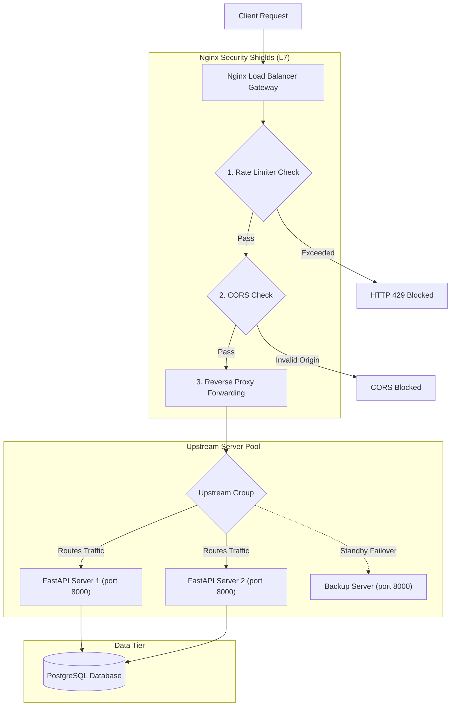

# Project: Secure Load-Balanced Web API

**Breadcrumbs:** [[Main Notes/0-Index|🏠 Index]] > Projects > Systems Design > **Secure Load-Balanced Web API**

---

## 🎯 Project Overview
This project demonstrates how to construct a secure, horizontally scaled web API infrastructure. It leverages Nginx as a reverse proxy and load balancer to distribute traffic across a cluster of FastAPI application instances connected to a PostgreSQL database. 

The implementation covers:
1. **Traffic Routing & Availability:** Configuring load balancing algorithms (Round Robin, Least Connections, IP Hash) and passive health-check failover paths.
2. **Security Controls:** Implementing API rate limiting, CORS origin protection, JWT-based stateless authentication, and SQL injection prevention via parameterized queries.
3. **Diagnostics:** Verification playbooks to test endpoint connectivity, authentication blocks, cache control, and rate-limiting limits.

---

## 🏛️ Target Architecture
The incoming client requests are processed through multiple layers of security shields (Rate Limiter, CORS origin checkers, and SSL verification) implemented in Nginx before being routed to the healthy upstream FastAPI backend cluster.



---

## 🛠️ Step-by-Step Implementation & Configuration

### 1. Nginx Load Balancer and Gateway Configuration (`nginx.conf`)
Configure this file under `/etc/nginx/nginx.conf` on the gateway server. It establishes upstream server definitions, load balancing algorithms, and reverse-proxy failover headers.

```nginx
events {
    worker_connections 1024;
}

http {
    # ==========================================
    # A. Rate Limiter Zones
    # ==========================================
    # Key: $binary_remote_addr (uses binary IP, consumes 64 bytes per state)
    # Zone: Name 'api_limit' with 10MB memory (holds ~160,000 states)
    # Rate: 10 requests per second (r/s)
    limit_req_zone $binary_remote_addr zone=api_limit:10m rate=10r/s;

    # ==========================================
    # B. Upstream server pools (demonstrating algorithms)
    # ==========================================
    
    # 1. Standard Cluster (Round Robin with passive health check failovers)
    upstream api_cluster {
        server api-service-1:8000 max_fails=3 fail_timeout=10s;
        server api-service-2:8000 max_fails=3 fail_timeout=10s;
        server backup-service:8000 backup;
    }

    # 2. Weighted Round Robin (backend1 gets 3x more traffic)
    upstream app_servers_weighted {
        server backend1.example.com:8080 weight=3;
        server backend2.example.com:8080 weight=1;
    }

    # 3. Least Connections (routes to the server with the fewest active TCP connections)
    upstream app_servers_least_conn {
        least_conn;
        server backend1.example.com:8080;
        server backend2.example.com:8080;
    }

    # 4. IP Hash (routes based on client IP hash; guarantees session persistence)
    upstream app_servers_ip_hash {
        ip_hash;
        server backend1.example.com:8080;
        server backend2.example.com:8080;
    }

    # ==========================================
    # C. Server Gateway Block
    # ==========================================
    server {
        listen 80;
        listen [::]:80;
        server_name api.demo.local;
        # Force HTTPS redirect
        return 301 https://$host$request_uri;
    }

    server {
        listen 443 ssl default_server;
        listen [::]:443 ssl default_server;
        server_name api.demo.local;

        # SSL Certificates
        ssl_certificate /etc/ssl/certs/api.demo.local.crt;
        ssl_certificate_key /etc/ssl/private/api.demo.local.key;
        ssl_protocols TLSv1.2 TLSv1.3;
        ssl_ciphers HIGH:!aNULL:!MD5;

        location / {
            # 1. Apply Rate Limiting
            # burst=20: allows a sudden burst of up to 20 requests beyond the limit
            # nodelay: processes burst immediately, but rejects any additional excess traffic
            limit_req zone=api_limit burst=20 nodelay;
            limit_req_status 429;

            # 2. Handle CORS preflight OPTIONS requests
            if ($request_method = 'OPTIONS') {
                add_header 'Access-Control-Allow-Origin' 'https://www.example.com' always;
                add_header 'Access-Control-Allow-Methods' 'GET, POST, PUT, PATCH, DELETE, OPTIONS' always;
                add_header 'Access-Control-Allow-Headers' 'Accept,Authorization,Cache-Control,Content-Type,DNT,If-Modified-Since,Keep-Alive,User-Agent,X-Requested-With' always;
                add_header 'Access-Control-Max-Age' 1728000;
                add_header 'Content-Type' 'text/plain; charset=utf-8';
                add_header 'Content-Length' 0;
                return 204;
            }

            # 3. Inject standard CORS headers
            add_header 'Access-Control-Allow-Origin' 'https://www.example.com' always;
            add_header 'Access-Control-Allow-Methods' 'GET, POST, PUT, PATCH, DELETE, OPTIONS' always;
            add_header 'Access-Control-Allow-Headers' 'Accept,Authorization,Cache-Control,Content-Type,DNT,If-Modified-Since,Keep-Alive,User-Agent,X-Requested-With' always;
            add_header 'Access-Control-Expose-Headers' 'Content-Length,Content-Range' always;

            # 4. Standard proxy headers to forward client IP information downstream
            proxy_set_header Host $host;
            proxy_set_header X-Real-IP $remote_addr;
            proxy_set_header X-Forwarded-For $proxy_add_x_forwarded_for;
            proxy_set_header X-Forwarded-Proto $scheme;

            # Proxy incoming requests to the api_cluster
            proxy_pass http://api_cluster;

            # 5. Passive Health Checks / Timeouts for proxy failover
            proxy_connect_timeout 5s;       # timeout to establish connection
            proxy_send_timeout 10s;         # timeout to write payload
            proxy_read_timeout 10s;         # timeout to read payload

            # Reroutes request to next server in the pool upon failures
            proxy_next_upstream error timeout invalid_header http_500 http_502 http_503 http_504;
            proxy_next_upstream_tries 3;    # maximum number of attempts
            proxy_next_upstream_timeout 15s; # overall time limit for failovers
        }
    }
}
```

### 2. Secure API Web Server (Python - FastAPI)
Save this script as `main.py` in the FastAPI application directory. It demonstrates stateless JWT authentication validation, endpoint rate limiting, and database queries parameterized to block SQL injection.

```python
# ==============================================================================
# SECURE API WEB SERVER (FastAPI implementation)
# File: main.py
# Purpose: Production-grade, security-hardened FastAPI server with JWT Auth,
#          input sanitization, sliding window rate limiting, CORS configuration,
#          and parameterized SQL database operations.
# ==============================================================================

import time
import os
import re
import hashlib
import secrets
from datetime import datetime, timedelta, timezone
from collections import defaultdict
from typing import List

from fastapi import FastAPI, Depends, HTTPException, status, Header, Request
from fastapi.security import OAuth2PasswordBearer, OAuth2PasswordRequestForm
from fastapi.middleware.cors import CORSMiddleware
from jose import jwt, JWTError
from pydantic import BaseModel, Field, field_validator
import psycopg2
from psycopg2 import OperationalError

app = FastAPI(
    title="Secure Load-Balanced Web API",
    description="High-security FastAPI backend serving product information with input validation and rate limiting.",
    version="1.0.0"
)

# ==============================================================================
# 1. SECURITY CONFIGURATIONS & CRYPTOGRAPHY
# ==============================================================================

# In production, load the secret key from a secure environment variable or KMS.
# DO NOT hardcode secret keys in production environments.
SECRET_KEY = os.getenv("JWT_SECRET_KEY", "super-secret-key-for-verification")
ALGORITHM = "HS256"
ACCESS_TOKEN_EXPIRE_MINUTES = 30

# Dummy user configuration for token retrieval verification (trade credentials for JWT)
# Raw credentials: username='admin', password='securepassword'
# password_hash is SHA-256 hash of 'securepassword'
MOCK_USER = {
    "username": "admin",
    "password_hash": "3c9909afec25354d551dae21590bb26e38d53f2173b8d3dc3eee4c4dd2544a40"
}

# ==============================================================================
# 2. CORS MIDDLEWARE POLICY
# ==============================================================================
# Configure strict Cross-Origin Resource Sharing (CORS) rules.
# Wildcards ("*") are forbidden when credentials are allowed, preventing cross-origin data exposure.
ALLOWED_ORIGINS = [
    "https://demo.local",
    "https://www.example.com",
]

app.add_middleware(
    CORSMiddleware,
    allow_origins=ALLOWED_ORIGINS,
    allow_credentials=True,             # Required to support cookies or Authorization headers
    allow_methods=["GET", "POST", "OPTIONS"],  # Explicitly restrict permitted HTTP methods
    allow_headers=[
        "Content-Type", 
        "Authorization", 
        "X-Real-IP", 
        "X-Forwarded-For"
    ],                                  # Explicitly restrict permitted request headers
    expose_headers=["Content-Length", "Content-Range"],  # Limit response headers visible to the client browser
    max_age=1728000,                    # Cache preflight requests for 20 days (in seconds) to reduce load
)

# ==============================================================================
# 3. DATABASE CONNECTION INTERFACE
# ==============================================================================
DB_HOST = os.getenv("DB_HOST", "database-server")
DB_NAME = os.getenv("DB_NAME", "system_design_db")
DB_USER = os.getenv("DB_USER", "postgres")
DB_PASSWORD = os.getenv("DB_PASSWORD", "securepassword")

def get_db_connection():
    """
    Establishes and returns a database connection.
    Implements error catching to prevent internal database paths or credential leaks in exceptions.
    """
    try:
        conn = psycopg2.connect(
            host=DB_HOST,
            database=DB_NAME,
            user=DB_USER,
            password=DB_PASSWORD,
            connect_timeout=5  # Prevent infinite hangs by timing out after 5 seconds
        )
        return conn
    except OperationalError as e:
        # Secure failure: Log details internally, raise clean HTTP 503 to client without credentials/paths
        raise HTTPException(
            status_code=status.HTTP_503_SERVICE_UNAVAILABLE,
            detail="Database service is currently unavailable. Please try again later."
        )

# ==============================================================================
# 4. INPUT VALIDATION AND SANITIZATION SCHEMA (Pydantic)
# ==============================================================================
class ProductRequest(BaseModel):
    """
    Pydantic model representing input validation and sanitization for creating/updating products.
    Restricts string lengths and applies strict field value constraints to prevent Buffer Overflow
    or input payload inflation attacks.
    """
    name: str = Field(..., min_length=1, max_length=255, description="Product name must be between 1 and 255 characters.")
    price: float = Field(..., gt=0.0, description="Product price must be strictly greater than 0.0.")
    description: str = Field("", max_length=1000, description="Optional product description (max 1000 characters).")
    stock_quantity: int = Field(0, ge=0, description="Stock quantity must be a non-negative integer.")

    @field_validator("name", "description")
    @classmethod
    def sanitize_strings(cls, value: str) -> str:
        """
        Input Sanitizer: Detects and strips HTML/XML tags from string inputs.
        Protects the application from stored Cross-Site Scripting (XSS) vulnerability.
        """
        if not value:
            return value
        # Strips out HTML/XML elements (e.g., <script> tags) using a regex pattern
        sanitized = re.sub(r"<[^>]*>", "", value)
        return sanitized.strip()

# ==============================================================================
# 5. IN-MEMORY RATE LIMITER (SLIDING WINDOW LOG)
# ==============================================================================
# Keyed by client IP, storing request timestamps (epoch floats).
rate_limit_records = defaultdict(list)
RATE_LIMIT_WINDOW_SEC = 10
RATE_LIMIT_MAX = 5

async def rate_limiter(request: Request):
    """
    In-Memory Sliding Window Rate Limiter.
    Identifies clients by the 'X-Real-IP' header injected by the Nginx reverse proxy.
    Falls back to request.client.host if Nginx is bypassed during testing.
    """
    client_ip = request.headers.get("x-real-ip") or (request.client.host if request.client else "unknown")
    current_time = time.time()
    
    # Retrieve request logs for this client IP
    timestamps = rate_limit_records[client_ip]
    
    # Prune records older than the sliding window threshold
    timestamps = [t for t in timestamps if current_time - t < RATE_LIMIT_WINDOW_SEC]
    
    # Evaluate limit compliance
    if len(timestamps) >= RATE_LIMIT_MAX:
        # Exceeded limit: Deny request, returning standard Retry-After header
        raise HTTPException(
            status_code=status.HTTP_429_TOO_MANY_REQUESTS,
            detail="Rate limit exceeded. Too many requests. Please try again later.",
            headers={"Retry-After": str(RATE_LIMIT_WINDOW_SEC)}
        )
    
    # Append the current request timestamp
    timestamps.append(current_time)
    rate_limit_records[client_ip] = timestamps

# ==============================================================================
# 6. TOKEN-BASED JWT AUTHENTICATION
# ==============================================================================
oauth2_scheme = OAuth2PasswordBearer(tokenUrl="login")

def create_access_token(data: dict, expires_delta: timedelta = None) -> str:
    """
    Generates a cryptographically signed HMAC-SHA256 JWT Token.
    Sets standard claims like 'exp' (expiration) to limit token lifetime.
    """
    to_encode = data.copy()
    if expires_delta:
        expire = datetime.now(timezone.utc) + expires_delta
    else:
        expire = datetime.now(timezone.utc) + timedelta(minutes=ACCESS_TOKEN_EXPIRE_MINUTES)
    to_encode.update({"exp": expire})
    encoded_jwt = jwt.encode(to_encode, SECRET_KEY, algorithm=ALGORITHM)
    return encoded_jwt

def get_current_user(token: str = Depends(oauth2_scheme)) -> str:
    """
    Authenticates requests by decoding the JWT Bearer Token.
    Validates algorithm, signature, and expiration times.
    """
    try:
        payload = jwt.decode(token, SECRET_KEY, algorithms=[ALGORITHM])
        username: str = payload.get("sub")
        if username is None:
            raise HTTPException(
                status_code=status.HTTP_401_UNAUTHORIZED,
                detail="Invalid token: Subject (sub) claim is missing.",
                headers={"WWW-Authenticate": "Bearer"},
            )
        return username
    except JWTError:
        # Expired signature, wrong key, or general decoding failure
        raise HTTPException(
            status_code=status.HTTP_401_UNAUTHORIZED,
            detail="Invalid token: Token has expired or signature verification failed.",
            headers={"WWW-Authenticate": "Bearer"},
        )

# ==============================================================================
# 7. API ENDPOINTS & SECURE PARAMETERIZED QUERIES
# ==============================================================================

@app.get("/healthz", status_code=status.HTTP_200_OK)
def health_check():
    """
    Health check endpoint utilized by load-balancers/gateways.
    Does not require authentication or rate-limiting block, ensuring fast availability responses.
    """
    return {"status": "healthy"}

@app.post("/login", status_code=status.HTTP_200_OK)
def login(form_data: OAuth2PasswordRequestForm = Depends()):
    """
    Dummy OAuth2 Login endpoint.
    Exchanges valid credentials for a signed JWT access token.
    Uses constant-time comparison to protect against credentials timing attacks.
    """
    username = form_data.username
    password = form_data.password
    
    # Retrieve mock hash and compute input password hash
    input_hash = hashlib.sha256(password.encode()).hexdigest()
    
    # Secure, constant-time comparison of hashes to mitigate timing attacks
    if username != MOCK_USER["username"] or not secrets.compare_digest(input_hash, MOCK_USER["password_hash"]):
        raise HTTPException(
            status_code=status.HTTP_401_UNAUTHORIZED,
            detail="Incorrect username or password",
            headers={"WWW-Authenticate": "Bearer"},
        )
    
    # Issue secure signed JWT
    access_token_expires = timedelta(minutes=ACCESS_TOKEN_EXPIRE_MINUTES)
    access_token = create_access_token(
        data={"sub": username}, expires_delta=access_token_expires
    )
    return {"access_token": access_token, "token_type": "bearer"}

@app.get("/products/{product_id}", status_code=status.HTTP_200_OK, dependencies=[Depends(rate_limiter)])
def get_product(product_id: int, current_user: str = Depends(get_current_user)):
    """
    Retrieves a single product details by ID.
    Implements Parameterized Queries (psycopg2 placeholder bindings) to completely mitigate SQL Injection.
    """
    conn = get_db_connection()
    try:
        with conn.cursor() as cur:
            # SAFE: Variables are passed separate from query strings.
            # psycopg2 binds `%s` by preparing/encoding values strictly as literals.
            cur.execute("SELECT id, name, price, description, stock_quantity FROM products WHERE id = %s", (product_id,))
            product = cur.fetchone()
            
            if not product:
                raise HTTPException(
                    status_code=status.HTTP_404_NOT_FOUND, 
                    detail="Product not found"
                )
            
            return {
                "id": product[0],
                "name": product[1],
                "price": float(product[2]),
                "description": product[3],
                "stock_quantity": product[4]
            }
    finally:
        conn.close()

@app.post("/products", status_code=status.HTTP_201_CREATED, dependencies=[Depends(rate_limiter)])
def create_product(product: ProductRequest, current_user: str = Depends(get_current_user)):
    """
    Inserts a new product into the database.
    Inputs are validated and sanitized via Pydantic model schemas.
    Implements Parameterized Queries to prevent query syntax breakout.
    """
    conn = get_db_connection()
    try:
        with conn.cursor() as cur:
            # SAFE: DB driver binds parameters securely via tuple arguments
            cur.execute(
                "INSERT INTO products (name, price, description, stock_quantity) VALUES (%s, %s, %s, %s) RETURNING id",
                (product.name, product.price, product.description, product.stock_quantity)
            )
            product_id = cur.fetchone()[0]
            conn.commit()
            
            return {
                "id": product_id,
                "name": product.name,
                "price": product.price,
                "description": product.description,
                "stock_quantity": product.stock_quantity,
                "message": "Product created successfully"
            }
    except Exception as e:
        conn.rollback()
        raise HTTPException(
            status_code=status.HTTP_500_INTERNAL_SERVER_ERROR,
            detail="Failed to persist product record. Database transaction aborted."
        )
    finally:
        conn.close()

# ==============================================================================
# SECURITY CONSIDERATIONS FOR TOKEN STORAGE: COOKIES VS. HEADERS
# ==============================================================================
# While this application uses Bearer tokens in the 'Authorization' header (standard for APIs), 
# storing authentication tokens in Browser Cookies requires specific flags to protect against attacks:
#
# 1. HttpOnly Flag:
#    - Mitigation: Prevents client-side scripts (JavaScript) from accessing the cookie.
#    - Security Value: Effectively neutralizes Cross-Site Scripting (XSS) attacks trying to steal session tokens.
#
# 2. Secure Flag:
#    - Mitigation: Restricts cookie transmission only to encrypted (HTTPS) connections.
#    - Security Value: Prevents Man-in-the-Middle (MitM) eavesdropping attacks over unencrypted channels.
#
# 3. SameSite Flag:
#    - Settings: SameSite=Strict or SameSite=Lax.
#    - Mitigation: Restricts the browser from sending cookies along with cross-site requests.
#    - Security Value: Safeguards the application against Cross-Site Request Forgery (CSRF) attacks.
# ==============================================================================
```

### 3. Database Migration Script (SQL)
This SQL script initializes the table schema and builds indices for query optimization.

```sql
-- =========================================================================
-- SQL MIGRATION SCRIPT
-- =========================================================================
-- Target Database: PostgreSQL 12+
-- Purpose: Atomically initialize schema, constraints, and optimization indexes.
-- =========================================================================

BEGIN;

-- Create function to auto-update 'updated_at' column on row modification.
-- Using PL/pgSQL language to modify the field before it is committed to disk.
CREATE OR REPLACE FUNCTION update_updated_at_column()
RETURNS TRIGGER AS $$
BEGIN
    NEW.updated_at = CURRENT_TIMESTAMP;
    RETURN NEW;
END;
$$ LANGUAGE plpgsql;

-- Create the products table.
-- DATA TYPE CHOICES:
-- 1. BIGSERIAL: Creates an auto-incrementing 8-byte integer (up to ~9.22 * 10^18 values),
--    preventing integer overflow issues common with standard 4-byte SERIAL in high-throughput systems.
--    UUIDs are also excellent for distributed systems, but BIGSERIAL is selected here for maximum
--    sequential indexing performance and smaller storage footprint (8 bytes vs 16 bytes for UUID).
-- 2. VARCHAR(255): Used to enforce reasonable boundaries on input lengths for product names
--    while remaining space-efficient.
-- 3. TEXT: Used for description to support long-form text without imposing arbitrary caps,
--    as PostgreSQL stores variable-length strings efficiently.
-- 4. DECIMAL(10, 2): Used instead of FLOAT or REAL for the price column. PostgreSQL's DECIMAL/NUMERIC
--    type stores exact numeric values, preventing IEEE 754 floating-point rounding errors which are
--    unacceptable for financial transactions.
-- 5. INTEGER: 4-byte integer for stock_quantity, sufficient to hold up to 2.14 billion units.
-- 6. TIMESTAMP WITH TIME ZONE (timestamptz): Ensures all timestamps are stored in UTC with timezone-awareness,
--    preventing timezone mismatch issues across different servers or regions.
CREATE TABLE IF NOT EXISTS products (
    id BIGSERIAL PRIMARY KEY,
    name VARCHAR(255) NOT NULL,
    description TEXT,
    price DECIMAL(10, 2) NOT NULL,
    stock_quantity INTEGER NOT NULL DEFAULT 0,
    created_at TIMESTAMP WITH TIME ZONE DEFAULT CURRENT_TIMESTAMP NOT NULL,
    updated_at TIMESTAMP WITH TIME ZONE DEFAULT CURRENT_TIMESTAMP NOT NULL,

    -- Business Constraints to ensure data integrity at the storage layer:
    CONSTRAINT check_price_non_negative CHECK (price >= 0.00),
    CONSTRAINT check_stock_non_negative CHECK (stock_quantity >= 0)
);

-- Optimize queries searching or filtering products by name (e.g. autocomplete, search bars).
-- INDEX TYPE: B-Tree (PostgreSQL default)
-- B-Tree indexes are balanced search trees optimized for comparison operators (<, <=, =, >=, >)
-- and sorting. This index reduces the search time complexity from a full table scan O(N) 
-- to a highly efficient O(log N) lookup.
CREATE INDEX IF NOT EXISTS idx_products_name ON products (name);

-- Trigger to execute update_updated_at_column() prior to any UPDATE statement.
-- This ensures 'updated_at' is maintained by the database engine, avoiding dependency
-- on application code to track record modification times.
CREATE TRIGGER trigger_update_products_timestamp
BEFORE UPDATE ON products
FOR EACH ROW
EXECUTE FUNCTION update_updated_at_column();

COMMIT;
```

#### 🗄️ Database Architectural & Operational Best Practices

##### 1. Indexing Strategies
*   **B-Tree Indexes**: B-Tree is the default index type in PostgreSQL. It organizes data in a balanced tree structure, making lookup, range query, and sorting operations highly efficient ($O(\log N)$ complexity). In our schema, `idx_products_name` speeds up searches by name (e.g., `WHERE name = '...'` or prefix searches like `WHERE name LIKE 'Prefix%'`).
*   **Read vs. Write Performance Trade-offs**: While indexes dramatically accelerate `SELECT` queries (reads), they introduce write overhead on `INSERT`, `UPDATE`, and `DELETE` queries. Every write requires the database engine to traverse and modify the B-tree structure to keep it synchronized with the physical heap. Therefore, indexes should be created selectively, focusing only on fields heavily used in filtering or sorting.
*   **Index Maintenance**: Over time, indexes accumulate bloat due to MVCC (Multi-Version Concurrency Control) updates and deletes. Regular maintenance tasks such as `REINDEX` or running `VACUUM` (specifically tuning autovacuum settings) are essential to reclaim space and maintain optimal lookup performance.

##### 2. Connection Pooling
*   **Client-Side vs. Server-Side Pooling**:
    *   *Client-Side Pooling* (e.g., connection pools managed inside SQLAlchemy/Tortoise ORM in FastAPI) maintains a set of open, reusable database connections within the application processes, saving the overhead of establishing a new TCP handshake and PostgreSQL backend process for every request.
    *   *Server-Side Pooling* (e.g., PgBouncer) acts as a proxy between many client instances and the database engine. This is critical in containerized, multi-node, or serverless deployments where total client connections would otherwise exceed PostgreSQL's limits.
*   **Why Pool Sizes Are Limited**: A single PostgreSQL connection maps directly to a dedicated operating system process. If the database receives too many connections, context switching between these processes causes CPU thrashing, degrading throughput.
*   **Preventing CPU Thrashing**: Limiting connection pool size ensures the CPU spends its cycles running queries to completion rather than switching between competing backend processes, ensuring stable latencies and high throughput.

##### 3. Clustered Replicas & High Availability (HA)
*   **Primary-Replica Replication**: Relies on streaming write-ahead logs (WAL) from a single read-write primary node to one or more read-only replica nodes. This can be synchronous (guaranteeing zero data loss at the cost of write latency) or asynchronous (low latency but with minor data lag).
*   **Read-Write Splitting**: The FastAPI application sends write operations (`INSERT`, `UPDATE`, `DELETE`) to the primary database node and routes read operations (`SELECT`) to replica nodes, scaling horizontal throughput.
*   **High Availability**: Automated failover managers (e.g., Patroni with etcd) continuously monitor node health. If the primary node fails, a replica is automatically promoted to primary, and internal routing tables are updated to minimize downtime.

##### 4. Prepared SQL Statements
*   **SQL Injection (SQLi) Prevention**: Prepared statements separate query logic from variable parameters. By compiling the query template first and binding parameters later, the database engine prevents malicious input (e.g., `' OR '1'='1`) from altering the query's AST (Abstract Syntax Tree).
*   **Execution Plan Caching**: When a query is prepared, PostgreSQL parses, plans, and optimizes it once, caching the resulting plan. Subsequent executions reuse this plan, saving CPU cycles on parsing and optimization, which is highly beneficial for frequently run OLTP queries.

---

## 🔍 Verification & Diagnostics

### 1. End-to-End API and Load Balancer Verification
Execute the following commands from a client terminal to verify endpoint connectivity, rate limits, and authentication controls.

```bash
# ==============================================================================
# END-TO-END API AND LOAD BALANCER VERIFICATION PLAYBOOK
# ==============================================================================
# This playbook tests all security gateway shields and application-level controls.
# 
# Key Parameters:
#   -k: Ignores self-signed SSL/TLS certificate warnings (ideal for localhost/demo.local).
#   -H "Host: api.demo.local": Configures Nginx virtual host matching for routing.
#   -i: Includes the response HTTP headers in the output to audit security controls.
# ==============================================================================

# --- Check 1: Health Check Endpoint (Verify Service Availability) ---
# Purpose: Ensures the server and load balancer are online. Authentication is bypassed.
# Expected Status: 200 OK
# Content Type: application/json
echo "=== [1/6] Testing Health Check Endpoint ==="
curl -k -i \
  -H "Host: api.demo.local" \
  https://localhost/healthz
echo -e "\n--------------------------------------------\n"

# --- Check 2: Access Protected Resource Without Token (Verify Authentication Wall) ---
# Purpose: Ensures unauthenticated clients are blocked from sensitive endpoints.
# Expected Status: 401 Unauthorized
# Expected Headers: WWW-Authenticate: Bearer
echo "=== [2/6] Accessing Protected Endpoint Without Token ==="
curl -k -i \
  -H "Host: api.demo.local" \
  https://localhost/products/1
echo -e "\n--------------------------------------------\n"

# --- Check 3: Retrieve JWT Token via Login (Exchange Credentials) ---
# Purpose: Logs in as the dummy administrative user using form data.
# Expected Status: 200 OK
# Expected Payload: JSON containing "access_token" and "token_type": "bearer"
echo "=== [3/6] Retrieving Valid JWT Access Token ==="
TOKEN_RESPONSE=$(curl -k -s \
  -H "Host: api.demo.local" \
  -d "username=admin&password=securepassword" \
  https://localhost/login)

echo "Response payload: $TOKEN_RESPONSE"
TOKEN=$(echo "$TOKEN_RESPONSE" | jq -r '.access_token')
echo "Extracted JWT: ${TOKEN:0:15}...[truncated]"
echo -e "\n--------------------------------------------\n"

# --- Check 4: Access Protected GET Endpoint with Bearer Token (Query Product) ---
# Purpose: Verifies valid JWT token grants access to authenticated resources.
# Expected Status: 200 OK (if product exists, otherwise 404 but authenticated)
echo "=== [4/6] Querying Product with Bearer Token ==="
curl -k -i \
  -H "Host: api.demo.local" \
  -H "Authorization: Bearer $TOKEN" \
  https://localhost/products/1
echo -e "\n--------------------------------------------\n"

# --- Check 5: Create a Product via POST with Bearer Token & JSON Body (Write Data) ---
# Purpose: Verifies input sanitization and POST payload parsing.
# Payload Features: Strips HTML script tags automatically to block stored XSS.
# Expected Status: 201 Created
# Expected Payload: Echoed sanitized product data with generated DB id.
echo "=== [5/6] Creating New Product (Input Sanitization & Parameterized Write) ==="
curl -k -i \
  -X POST \
  -H "Host: api.demo.local" \
  -H "Authorization: Bearer $TOKEN" \
  -H "Content-Type: application/json" \
  -d '{"name": "Sanitized <script>alert(1)</script> Product", "price": 49.99, "description": "<p>Vulnerability Free Description</p>", "stock_quantity": 120}' \
  https://localhost/products
echo -e "\n--------------------------------------------\n"

# --- Check 6: Test Rate Limiter (Loop and Exceed Max Requests) ---
# Purpose: Fires concurrent queries to verify IP-based sliding window rate limiting.
# Expected Status: First 5 requests succeed (200/404 OK), subsequent requests return 429 Too Many Requests.
# Expected Response Headers (for 429): Retry-After header with wait window.
echo "=== [6/6] Testing In-Memory Rate Limiter (5 requests/10s limit) ==="
for i in {1..8}; do
  echo ">>> Attempt #$i:"
  curl -k -s -i \
    -H "Host: api.demo.local" \
    -H "Authorization: Bearer $TOKEN" \
    -H "X-Real-IP: 192.168.1.150" \
    https://localhost/products/1 | grep -E "HTTP/|Retry-After|x-real-ip|detail"
  sleep 0.1
done
echo -e "\n==================== Playbook Complete ====================\n"
```

### 2. Verification of Caching and CDN Headers
Execute these requests to verify CDN caches, age counters, and validation tokens:

```bash
# Analyze response headers of a static asset
curl -v -o /dev/null https://api.demo.local/static/logo.png

# Extract specific caching validation headers
curl -s -I https://api.demo.local/static/logo.png | grep -Ei "cache-control|etag|age|x-cache|cf-cache-status"

# Test Cache Revalidation (If-None-Match ETag check)
curl -I -H 'If-None-Match: "5d9c28e67a0a0"' https://api.demo.local/static/logo.png
```

### 3. Verify RESTful HTTP Methods
Query the API endpoint using standard HTTP verbs, custom headers, and JSON request bodies:

```bash
# GET Request
curl -X GET "https://api.demo.local/v1/users?limit=5" \
     -H "Accept: application/json" \
     -H "Authorization: Bearer $TOKEN"

# POST Request
curl -X POST "https://api.demo.local/v1/users" \
     -H "Content-Type: application/json" \
     -H "Authorization: Bearer $TOKEN" \
     -d '{"name": "Alex Rivera", "email": "alex.rivera@example.com"}'

# PATCH Request
curl -X PATCH "https://api.demo.local/v1/users/42" \
     -H "Content-Type: application/json" \
     -H "Authorization: Bearer $TOKEN" \
     -d '{"role": "admin"}'

# DELETE Request
curl -X DELETE "https://api.demo.local/v1/users/42" \
     -H "Authorization: Bearer $TOKEN"
```

### 4. Verify GraphQL Endpoints
Send GraphQL queries and variable payloads in a single POST request:

```bash
curl -X POST "https://api.demo.local/graphql" \
     -H "Content-Type: application/json" \
     -H "Authorization: Bearer $TOKEN" \
     -d '{
       "query": "query GetUserOrders($id: ID!, $limit: Int!) { user(id: $id) { name email orders(limit: $limit) { orderId total } } }",
       "variables": { "id": "42", "limit": 3 }
     }'
```

---

## 💡 Key Architectural Takeaways
- **Eviction vs. Rescheduling:** In load balancing, when a backend server fails its health checks, it is evicted from the routing pool. This differs from Kubernetes pod eviction, where pods are terminated and rescheduled on healthy nodes.
- **State Isolation:** Decoupling session storage (moving it to Redis key-value clusters) makes application servers stateless, allowing immediate horizontal scaling and server termination.
- **Shielding:** Deploying rate limiting and CORS checks at the gateway (Nginx) level minimizes resource consumption on application servers, preventing traffic spikes from exhausting application memory pools.
- **Security Control:** Parameterized database queries separate query template compilation from variable binding, rendering any SQL-injection inputs inert by design.
