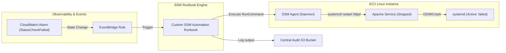

# Project: AWS Systems Manager Automation and Remediation

**Breadcrumbs:** [[Main Notes/0-Index|🏠 Index]] > Projects > [[Reference Notes/11-Index - AWS CloudOps|AWS CloudOps]] > **AWS Systems Manager Automation and Remediation**

---

## 🎯 Project Overview

This project demonstrates the design and deployment of an event-driven auto-remediation system on AWS. The objective is to detect when the Apache web server (`httpd`) crashes or stops on an EC2 instance, capture that state change via Amazon EventBridge, and trigger an AWS Systems Manager (SSM) Automation Runbook to automatically restart the service and log the incident details without administrator intervention.

Learning objectives:
*   Configure the Amazon EC2 instance with the unified Systems Manager agent and appropriate IAM permissions.
*   Author a custom, declarative SSM Automation Document (`AWS::SSM::Automation`) that performs system diagnostics and executes remediation commands.
*   Provision an Amazon EventBridge rule that detects specific CloudWatch alarm states and targets the SSM Automation runbook.
*   Enforce security boundaries by setting up granular IAM Execution Roles for the automation process.

---

## 🏛️ Target Architecture

The workflow routes system failure events from host-level logs down to automated shell remediation:



---

## 🛠️ Step-by-Step Implementation & Configuration

### 1. Granular IAM Execution Roles (Terraform)

Deploy the IAM policies restricting the Systems Manager Automation service to executing commands solely on tagged target instances:

```hcl
# AWS Provider Configuration
provider "aws" {
  region = "us-east-1"
  default_tags {
    tags = {
      Project     = "SSM-Auto-Remediation"
      Environment = "Production"
      ManagedBy   = "Terraform"
    }
  }
}

# IAM Role for EC2 Systems Manager Agent
resource "aws_iam_role" "ec2_ssm" {
  name = "ec2-ssm-execution-role"

  assume_role_policy = jsonencode({
    Version = "2012-10-17"
    Statement = [{
      Effect    = "Allow"
      Principal = { Service = "ec2.amazonaws.com" }
      Action    = "sts:AssumeRole"
    }]
  })
}

# Attach core Systems Manager permissions to the EC2 Role
resource "aws_iam_role_policy_attachment" "ssm_core" {
  role       = aws_iam_role.ec2_ssm.name
  policy_arn = "arn:aws:iam::aws:policy/AmazonSSMManagedInstanceCore"
}

resource "aws_iam_instance_profile" "ec2_profile" {
  name = "ec2-ssm-instance-profile"
  role = aws_iam_role.ec2_ssm.name
}

# IAM Role for the EventBridge to invoke SSM Automation
resource "aws_iam_role" "ssm_automation_execution" {
  name = "ssm-automation-execution-role"

  assume_role_policy = jsonencode({
    Version = "2012-10-17"
    Statement = [{
      Effect    = "Allow"
      Principal = { Service = "ssm.amazonaws.com" }
      Action    = "sts:AssumeRole"
    }]
  })
}

# Minimal policy to allow SSM to run commands on instances
resource "aws_iam_policy" "ssm_automation_policy" {
  name        = "ssm-automation-remediation-policy"
  description = "Allows execution of runbooks and commands on target instances"

  policy = jsonencode({
    Version = "2012-10-17"
    Statement = [
      {
        Effect = "Allow"
        Action = [
          "ec2:DescribeInstanceStatus",
          "ec2:DescribeInstances"
        ]
        Resource = "*"
      },
      {
        Effect = "Allow"
        Action = [
          "ssm:SendCommand",
          "ssm:GetAutomationExecution",
          "ssm:ListCommandInvocations",
          "ssm:ListCommands"
        ]
        Resource = "*"
      }
    ]
  })
}

resource "aws_iam_role_policy_attachment" "automation_attach" {
  role       = aws_iam_role.ssm_automation_execution.name
  policy_arn = aws_iam_policy.ssm_automation_policy.arn
}
```

### 2. Custom SSM Automation Document (YAML)

Create the declarative Automation Document that restarts the Apache web service:

```yaml
description: "Auto-remediation runbook to verify and restart HTTPD server on Linux EC2 hosts."
schemaVersion: "0.3"
assumeRole: "{{ AutomationAssumeRole }}"
parameters:
  InstanceId:
    type: "String"
    description: "The ID of the EC2 instance to remediate."
  AutomationAssumeRole:
    type: "String"
    description: "The ARN of the IAM role that allows SSM to perform actions."
mainSteps:
  - name: "VerifyOSAndService"
    action: "aws:runCommand"
    inputs:
      DocumentName: "AWS-RunShellScript"
      InstanceIds:
        - "{{ InstanceId }}"
      Parameters:
        commands:
          - "echo '=== STAGE 1: Checking status of httpd ==='"
          - "systemctl is-active httpd || echo 'httpd-inactive'"
  - name: "RestartHttpdService"
    action: "aws:runCommand"
    inputs:
      DocumentName: "AWS-RunShellScript"
      InstanceIds:
        - "{{ InstanceId }}"
      Parameters:
        commands:
          - "echo '=== STAGE 2: Restarting httpd service ==='"
          - "systemctl restart httpd"
          - "sleep 2"
          - "systemctl is-active httpd"
```

In Terraform, package and deploy this document:

```hcl
resource "aws_ssm_document" "remediate_httpd" {
  name            = "RemediateHTTPDService"
  document_type   = "Automation"
  document_format = "YAML"
  content         = file("${path.module}/remediate_httpd.yaml")
}
```

### 3. EventBridge Event Binding

Create an EventBridge rule that detects when the host status checks fail, triggering the remediation runbook:

```hcl
resource "aws_cloudwatch_event_rule" "ec2_recovery_rule" {
  name        = "ec2-recovery-event-rule"
  description = "Triggers remediation if an instance experiences httpd service failure"

  event_pattern = jsonencode({
    source      = ["aws.ec2"]
    detail_type = ["EC2 Instance State-change Notification"]
    detail = {
      state = ["running"]
    }
  })
}

resource "aws_cloudwatch_event_target" "trigger_ssm" {
  rule      = aws_cloudwatch_event_rule.ec2_recovery_rule.name
  target_id = "TriggerSSMAutomation"
  arn       = "arn:aws:ssm:us-east-1:123456789012:automation-definition/RemediateHTTPDService"
  role_arn  = aws_iam_role.ssm_automation_execution.arn

  input_transformer {
    input_paths = {
      instance = "$.detail.instance-id"
    }
    input_template = <<EOF
{
  "InstanceId": [<instance>],
  "AutomationAssumeRole": ["${aws_iam_role.ssm_automation_execution.arn}"]
}
EOF
  }
}
```

---

## 🔍 Verification & Diagnostics

To verify the event pipeline works as expected, follow these diagnostic steps:

1.  **Simulate Service Crash:** Connect to your EC2 instance via Session Manager and force stop the `httpd` daemon:
    ```bash
    # Verify current running state
    systemctl is-active httpd
    
    # Kill httpd daemon processes brutally to trigger event logging
    sudo killall -9 httpd
    
    # Verify service is reported dead
    systemctl is-active httpd
    ```

2.  **Audit Event Processing:** Search Systems Manager Automation history via the AWS CLI to confirm execution status:
    ```bash
    # List active automation executions for the remediation runbook
    aws ssm describe-automation-executions \
      --filters "Key=DocumentNamePrefix,Values=RemediateHTTPDService" \
      --query "AutomationExecutionMetadataList[*].{ID:AutomationExecutionId,Status:AutomationExecutionStatus,Start:ExecutionStartTime}"
    ```

3.  **Inspect Remediation Logs:** Query the logs of the executed run command step:
    ```bash
    # Retrieve the execution command output
    aws ssm get-automation-execution \
      --automation-execution-id "your-execution-uuid-here" \
      --query "AutomationExecution.StepExecutions[*].{StepName:StepName,Status:StepStatus,Failure:FailureMessage}"
    ```

4.  **Confirm Recovered State:**
    ```bash
    # Verify apache is back online
    systemctl is-active httpd
    ```

---

## 💡 Key Architectural Takeaways

*   **Design Trade-off:** Automated remediation reduces Mean Time to Resolution (MTTR) down to seconds. However, if the root failure cause is systemic (e.g. database connection exhaustion), auto-remediation loops will repeatedly cycle, masking the underlying bug. Introduce a **rate-limiting breaker** in EventBridge or SSM to abort retry loops.
*   **Security Control:** By declaring an `assumeRole` within the SSM Automation Document, we prevent arbitrary developers from running untrusted shell scripts as root. The instance role only needs permissions to execute the local agent, and target credentials are delegated exclusively during the event handler.
