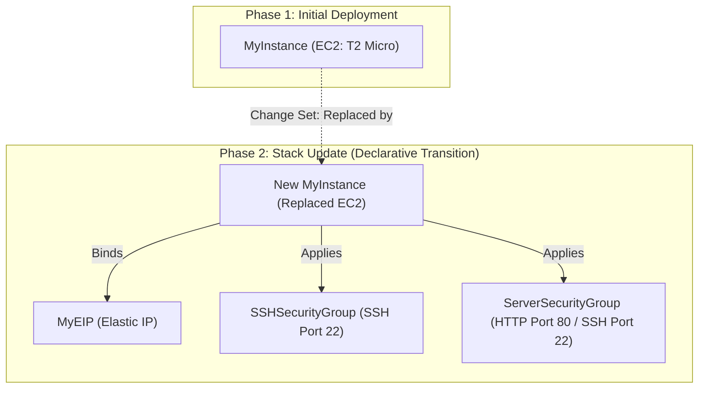

# Project: CloudFormation Stack Updates and Change Sets

**Breadcrumbs:** [[Main Notes/0-Index|🏠 Index]] > Projects > **CloudFormation Stack Updates and Change Sets**

---

## 🎯 Project Overview

This project implements a declarative infrastructure pipeline using **AWS CloudFormation**. We demonstrate how to declare AWS resources as code, provision a stack, update the stack using parameters and change sets, and analyze resource replacement behaviors. By moving from a simple EC2 definition to a more complex network integration (with multiple Security Groups and an Elastic IP), we inspect how CloudFormation manages resource dependencies, schedules updates, executes cleanups, and tears down stacks.

### Learning Objectives:
*   Write and deploy a basic declarative YAML CloudFormation template to spin up a single EC2 instance.
*   Extend the template to implement parameterization, Elastic IP (EIP) binding, and multiple Security Group rules.
*   Generate and preview a CloudFormation **Change Set** to analyze resource modification and replacement behavior (`Replacement: True`).
*   Verify stack execution, inspect resource tagging inheritance, and perform a full clean teardown.

---

## 🏛️ Target Architecture

The infrastructure lifecycle progresses from a standalone EC2 compute instance to a secure, elastic IP-backed server instance:



---

## 🛠️ Step-by-Step Implementation & Configuration

### 1. Initial Deployment Template (`0-just-EC2.yaml`)
Create a simple template declaring a single EC2 instance in a specific Availability Zone using a standard region-scoped AMI:

```yaml
AWSTemplateFormatVersion: '2010-09-09'
Description: 'Phase 1: Deploy a single Amazon EC2 instance.'

Resources:
  MyInstance:
    Type: AWS::EC2::Instance
    Properties:
      AvailabilityZone: us-east-1a
      ImageId: ami-0c55b159cbfafe1f0 # Region-specific Amazon Linux 2 AMI for us-east-1
      InstanceType: t2.micro
```

#### Deploying Stack via AWS CLI:
To launch the initial stack named `demo-cloudformation`:
```bash
aws cloudformation create-stack \
  --stack-name demo-cloudformation \
  --template-body file://0-just-EC2.yaml \
  --tags Key=CFDemo,Value=InitialDeployment
```

---

### 2. Comprehensive Upgrade Template (`1-ec2-with-sg-eip.yaml`)
Create an updated template declaring parameters, an Elastic IP, and security groups. Security groups are referenced in the EC2 instance properties, creating an implicit dependency that tells CloudFormation to create security groups before launching the instance.

```yaml
AWSTemplateFormatVersion: '2010-09-09'
Description: 'Phase 2: Add Elastic IP and security groups to the EC2 instance.'

Parameters:
  SecurityGroupDescription:
    Type: String
    Description: Description for the web server security group
    Default: 'Demo web server security group'

Resources:
  MyInstance:
    Type: AWS::EC2::Instance
    Properties:
      AvailabilityZone: us-east-1a
      ImageId: ami-0c55b159cbfafe1f0
      InstanceType: t2.micro
      SecurityGroups:
        - !Ref SSHSecurityGroup
        - !Ref ServerSecurityGroup

  MyEIP:
    Type: AWS::EC2::EIP
    Properties:
      InstanceId: !Ref MyInstance

  SSHSecurityGroup:
    Type: AWS::EC2::SecurityGroup
    Properties:
      GroupDescription: Enable SSH access via port 22
      SecurityGroupIngress:
        - IpProtocol: tcp
          FromPort: 22
          ToPort: 22
          CidrIp: 0.0.0.0/0

  ServerSecurityGroup:
    Type: AWS::EC2::SecurityGroup
    Properties:
      GroupDescription: !Ref SecurityGroupDescription
      SecurityGroupIngress:
        - IpProtocol: tcp
          FromPort: 80
          ToPort: 80
          CidrIp: 0.0.0.0/0
        - IpProtocol: tcp
          FromPort: 22
          ToPort: 22
          CidrIp: 1.2.3.4/32 # Restrict SSH to a specific IP address
```

---

### 3. Deploying the Update using Change Sets
To prevent unexpected downtime or data loss, generate a Change Set to inspect how AWS intends to apply the template changes.

#### Creating the Change Set via AWS CLI:
```bash
aws cloudformation create-change-set \
  --stack-name demo-cloudformation \
  --change-set-name upgrade-set-1 \
  --template-body file://1-ec2-with-sg-eip.yaml \
  --parameters ParameterKey=SecurityGroupDescription,ParameterValue="Demo HTTP and SSH Group"
```

#### Viewing the Change Set:
```bash
aws cloudformation describe-change-set \
  --stack-name demo-cloudformation \
  --change-set-name upgrade-set-1
```
*Expected Output Details:*
*   `SSHSecurityGroup`: Action: `Add`
*   `ServerSecurityGroup`: Action: `Add`
*   `MyEIP`: Action: `Add`
*   `MyInstance`: Action: `Modify`, **`Replacement: True`** (Because binding security groups in non-default VPC properties triggers replacement for legacy-declared instances).

#### Executing the Change Set:
```bash
aws cloudformation execute-change-set \
  --stack-name demo-cloudformation \
  --change-set-name upgrade-set-1
```

---

## 🔍 Verification & Diagnostics

Monitor events and verify the running infrastructure to ensure proper deployment:

### 1. Tail Stack Events
To watch the order of creation, modification, and cleanups in real-time:
```bash
aws cloudformation describe-stack-events --stack-name demo-cloudformation
```
Observe that:
1.  `SSHSecurityGroup` and `ServerSecurityGroup` are created first.
2.  A new `MyInstance` is launched.
3.  `MyEIP` is created and associated with the new instance.
4.  The old `MyInstance` is terminated (Clean Up).

### 2. Verify Elastic IP and Security Groups Attachment
Query the active instance properties to verify that the Elastic IP and Security Groups were successfully bound to the EC2 instance:
```bash
# Get the physical ID of the instance in the stack
INSTANCE_ID=$(aws cloudformation describe-stack-resource \
  --stack-name demo-cloudformation \
  --logical-resource-id MyInstance \
  --query "StackResourceDetail.PhysicalResourceId" --output text)

# Describe instance network settings
aws ec2 describe-instances \
  --instance-ids $INSTANCE_ID \
  --query "Reservations[0].Instances[0].[PublicIpAddress, SecurityGroups]"
```

### 3. Verify Inherited Stack Tags
All resources created via CloudFormation inherit the tags applied to the stack. Verify tag inheritance on the EIP:
```bash
EIP_ALLOC_ID=$(aws cloudformation describe-stack-resource \
  --stack-name demo-cloudformation \
  --logical-resource-id MyEIP \
  --query "StackResourceDetail.PhysicalResourceId" --output text)

aws ec2 describe-addresses \
  --allocation-ids $EIP_ALLOC_ID \
  --query "Addresses[0].Tags"
```
You will find:
*   `aws:cloudformation:stack-name`: `demo-cloudformation`
*   `aws:cloudformation:logical-id`: `MyEIP`
*   `CFDemo`: `InitialDeployment` (carried forward from the stack tags)

---

## 💡 Key Architectural Takeaways

- **Resource Replacement Trade-offs:** Some parameter changes (like changing the AZ or modifying properties that require a fresh resource) force CloudFormation to recreate the resource instead of updating it in-place. If an EC2 instance is replaced, any local ephemeral data will be lost. To prevent data loss during replacement updates, use **DeletionPolicies** (`Retain` or `Snapshot`) and decouple storage volumes (EBS) or database targets from the instance template lifecycle.
- **Implicit Dependency Resolution:** CloudFormation parses template references (like `!Ref SSHSecurityGroup` inside the EC2 properties) to automatically map resource dependencies. It builds a directed acyclic graph (DAG) to determine the exact order of creation (Security Groups → EC2 Instance → Elastic IP Association) and destruction (EIP → EC2 Instance → Security Groups).
- **Stack-Level Tagging Compliance:** Stack tags are automatically propagated to all supported resources created within the template. This makes CloudFormation an excellent enforcement tool for corporate cost-allocation, access control (ABAC), and system auditing.
