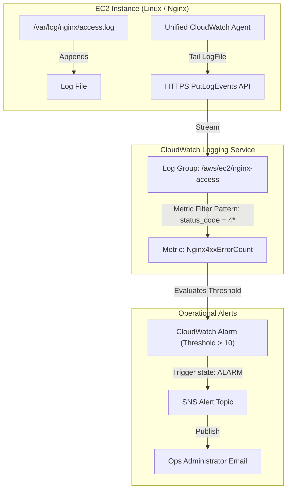

# Project: CloudWatch Log Streaming and Metric Filtering

**Breadcrumbs:** [[Main Notes/0-Index|🏠 Index]] > Projects > [[Reference Notes/11-Index - AWS CloudOps|AWS CloudOps]] > **CloudWatch Log Streaming and Metric Filtering**

---

## 🎯 Project Overview

This project implements host-level observability for web servers by configuring the Unified CloudWatch Agent on EC2 instances to stream application-level access logs to Amazon CloudWatch Logs. We then define custom metric filters to parse Nginx web logs in real-time, incrementing a count whenever HTTP 4xx or 5xx server status codes are observed, and binding these metrics to CloudWatch Alarms that notify administrators via SNS.

Learning objectives:
*   Configure the unified CloudWatch Agent configuration schema to collect logs and system metrics (RAM, Swap, Disk space).
*   Provision AWS resources (EC2, VPC, Log Groups, Metric Filters, Alarms, SNS) using Terraform (HCL).
*   Implement log parsing regex to convert unstructured log streams into actionable, numeric time-series metrics.
*   Validate metrics and alarms using simulated HTTP traffic loads.

---

## 🏛️ Target Architecture

The logging pipeline routes metrics from Linux host filesystem streams directly to real-time notification alerts:



---

## 🛠️ Step-by-Step Implementation & Configuration

### 1. CloudWatch Agent JSON Configuration

Store the agent configuration in AWS Systems Manager Parameter Store under the key `/cloudops/cwagent-config`. This permits the agent to fetch its parameters dynamically during bootstrap:

```json
{
  "agent": {
    "metrics_collection_interval": 30,
    "run_as_user": "cwagent"
  },
  "metrics": {
    "metrics_collected": {
      "mem": {
        "measurement": [
          "mem_used_percent",
          "mem_active",
          "mem_available"
        ]
      },
      "disk": {
        "measurement": [
          "used_percent"
        ],
        "resources": [
          "/"
        ]
      }
    }
  },
  "logs": {
    "logs_collected": {
      "files": {
        "collect_list": [
          {
            "file_path": "/var/log/nginx/access.log",
            "log_group_name": "/aws/ec2/nginx-access",
            "log_stream_name": "{instance_id}-nginx-access",
            "retention_in_days": 7
          }
        ]
      }
    }
  }
}
```

### 2. Infrastructure Setup (Terraform)

The following Terraform configuration creates the required infrastructure:

```hcl
# AWS Provider Configuration
provider "aws" {
  region = "us-east-1"
}

# Parameter Store entry holding CloudWatch Agent config JSON
resource "aws_ssm_parameter" "cw_agent_config" {
  name        = "/cloudops/cwagent-config"
  type        = "String"
  value       = file("${path.module}/amazon-cloudwatch-agent.json")
  description = "Unified CloudWatch Agent configuration schema"
}

# IAM Role permitting EC2 to write to CloudWatch and read from SSM Parameter Store
resource "aws_iam_role" "ec2_observability" {
  name = "ec2-observability-execution-role"

  assume_role_policy = jsonencode({
    Version = "2012-10-17"
    Statement = [{
      Effect    = "Allow"
      Principal = { Service = "ec2.amazonaws.com" }
      Action    = "sts:AssumeRole"
    }]
  })
}

# Attach standard CloudWatch Server Policy
resource "aws_iam_role_policy_attachment" "cw_agent_policy" {
  role       = aws_iam_role.ec2_observability.name
  policy_arn = "arn:aws:iam::aws:policy/CloudWatchAgentServerPolicy"
}

# Attach policy to read configuration from SSM
resource "aws_iam_role_policy_attachment" "ssm_read_policy" {
  role       = aws_iam_role.ec2_observability.name
  policy_arn = "arn:aws:iam::aws:policy/AmazonSSMReadOnlyAccess"
}

resource "aws_iam_instance_profile" "ec2_profile" {
  name = "ec2-observability-profile"
  role = aws_iam_role.ec2_observability.name
}

# CloudWatch Log Group for Nginx Logs
resource "aws_cloudwatch_log_group" "nginx_log_group" {
  name              = "/aws/ec2/nginx-access"
  retention_in_days = 7
}

# Nginx Log Metric Filter targeting HTTP 4xx Client Errors
# Combined Log format fields: host ident auth timestamp request status bytes referer agent
resource "aws_cloudwatch_log_metric_filter" "nginx_4xx_filter" {
  name           = "Nginx4xxFilter"
  pattern        = "[ip, id, user, timestamp, request, status_code = 4*, size]"
  log_group_name = aws_cloudwatch_log_group.nginx_log_group.name

  metric_transformation {
    name      = "HTTP4xxCount"
    namespace = "NginxObservability"
    value     = "1"
  }
}

# CloudWatch Alarm for 4xx Threshold
resource "aws_cloudwatch_metric_alarm" "high_4xx_alarm" {
  alarm_name          = "high-nginx-4xx-error-count"
  comparison_operator = "GreaterThanThreshold"
  evaluation_periods  = 1
  metric_name         = "HTTP4xxCount"
  namespace           = "NginxObservability"
  period              = 60
  statistic           = "Sum"
  threshold           = 10
  alarm_description   = "Trigger alert if HTTP 4xx counts exceed 10 in 1 minute"
  alarm_actions       = [aws_sns_topic.alerts.arn]
}

# SNS Notification Topic
resource "aws_sns_topic" "alerts" {
  name = "ops-alerts-topic"
}
```

### 3. Instance Bootstrap User Data Script

Provide this bootstrap script to install Nginx and start the agent on boot:

```bash
#!/bin/bash
# Install and configure Nginx
yum update -y
amazon-linux-extras install nginx1 -y
systemctl enable nginx
systemctl start nginx

# Install Unified CloudWatch Agent
yum install amazon-cloudwatch-agent -y

# Start CloudWatch Agent fetching configuration file from Parameter Store
/opt/aws/amazon-cloudwatch-agent/bin/amazon-cloudwatch-agent-ctl \
  -a fetch-config \
  -m ec2 \
  -c ssm:/cloudops/cwagent-config \
  -s
```

---

## 🔍 Verification & Diagnostics

Verify that log streaming is functioning and filters are triggering alerts:

1.  **Generate Simulated Web Traffic & Errors:** Connect to the instance public interface and run a loop to generate HTTP 404 Client Errors:
    ```bash
    # Run a curl loop hitting missing endpoints to generate 404 Status Codes
    for i in {1..20}; do
      curl -I http://localhost/missing-page-${i}
      sleep 0.5
    done
    ```

2.  **Verify Log Appending on Host:**
    ```bash
    # Tail nginx access logs to verify entries are formatted correctly
    tail -n 5 /var/log/nginx/access.log
    ```

3.  **Confirm Log Stream in CloudWatch Logs:** Query AWS CLI to retrieve log streams:
    ```bash
    # Check if the instance stream is populated
    aws logs describe-log-streams \
      --log-group-name "/aws/ec2/nginx-access" \
      --query "logStreams[*].logStreamName"
    ```

4.  **Confirm Metric Increment:**
    ```bash
    # Retrieve metric data values for custom HTTP4xxCount metric
    aws cloudwatch get-metric-data \
      --metric-data-queries '[{"Id":"m1","MetricStat":{"Metric":{"Namespace":"NginxObservability","MetricName":"HTTP4xxCount"},"Period":60,"Stat":"Sum"}}]' \
      --start-time $(date -u -d '5 minutes ago' +%FT%TZ) \
      --end-time $(date -u +%FT%TZ)
    ```

5.  **Check Alarm Status:**
    ```bash
    # Query current state of the alarm
    aws cloudwatch describe-alarms \
      --alarm-names "high-nginx-4xx-error-count" \
      --query "MetricAlarms[*].StateValue"
    ```

---

## 💡 Key Architectural Takeaways

*   **Design Trade-off:** Streaming logs to CloudWatch logs incurs storage and ingestion costs ($0.50 per GB ingested in us-east-1). To optimize cost without losing observability, configure the unified CloudWatch Agent to compress logs locally before transmission and use log retention policies (e.g., auto-expire logs after 7 days).
*   **Security Control:** The IAM role requires `CloudWatchAgentServerPolicy`, which grants permissions to write logs and metrics. By restricting the `ssm:GetParameter` permission specifically to `/cloudops/*` configuration parameters, we prevent the EC2 instance from accessing other sensitive parameters (e.g. database credentials) stored in SSM.
