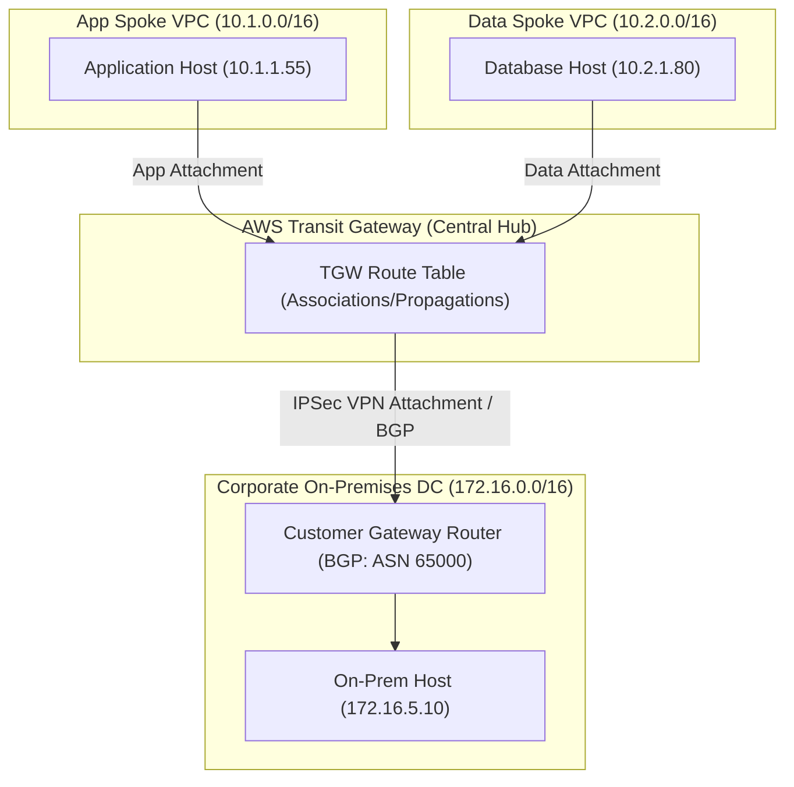

# Project: Hybrid VPC Peering and Transit Gateway Troubleshooting

**Breadcrumbs:** [[Main Notes/0-Index|🏠 Index]] > Projects > [[Reference Notes/11-Index - AWS CloudOps|AWS CloudOps]] > **Hybrid VPC Peering and Transit Gateway Troubleshooting**

---

## 🎯 Project Overview

This project implements a centralized hub-and-spoke networking topology connecting multiple AWS VPCs and a simulated corporate on-premises datacenter using AWS Transit Gateway. The primary objective is to configure cross-subnet routing, set up route tables and propagates dynamic route entries, and analyze typical hybrid networking failure loops: missing propagation paths, asymmetric routing paths caused by overlapping CIDRs, and BGP peering session status halts.

Learning objectives:
*   Configure Transit Gateway route domains using HCL.
*   Establish attachments for cloud application spoke VPCs and dynamic customer gateway connections.
*   Diagnose and resolve common routing loops and path blockages using standard Linux network commands.
*   Perform routing audits using Transit Gateway Route Tables and VPC Flow Logs.

---

## 🏛️ Target Architecture

The Transit Gateway acts as the central cloud router interconnecting isolated subnets and the customer datacenter:



---

## 🛠️ Step-by-Step Implementation & Configuration

### 1. Transit Gateway Hub Setup (Terraform)

Establish the Transit Gateway router and isolate spoke traffic from datacenter traffic via separate routing domains:

```hcl
# AWS Provider Configuration
provider "aws" {
  region = "us-east-1"
}

# 1. Central Transit Gateway
resource "aws_ec2_transit_gateway" "central_router" {
  description                     = "Central Hub Router"
  default_route_table_association = "disable"
  default_route_table_propagation = "disable"
  amazon_side_asn                 = 64512
  tags = {
    Name = "central-tgw"
  }
}

# 2. Spoke VPC: Application (10.1.0.0/16)
resource "aws_vpc" "app_vpc" {
  cidr_block = "10.1.0.0/16"
  tags       = { Name = "app-spoke-vpc" }
}

resource "aws_subnet" "app_subnet" {
  vpc_id            = aws_vpc.app_vpc.id
  cidr_block        = "10.1.1.0/24"
  availability_zone = "us-east-1a"
}

# 3. Spoke VPC: Data (10.2.0.0/16)
resource "aws_vpc" "data_vpc" {
  cidr_block = "10.2.0.0/16"
  tags       = { Name = "data-spoke-vpc" }
}

resource "aws_subnet" "data_subnet" {
  vpc_id            = aws_vpc.data_vpc.id
  cidr_block        = "10.2.1.0/24"
  availability_zone = "us-east-1a"
}

# 4. Connect VPCs to Transit Gateway
resource "aws_ec2_transit_gateway_vpc_attachment" "app_attachment" {
  subnet_ids         = [aws_subnet.app_subnet.id]
  transit_gateway_id = aws_ec2_transit_gateway.central_router.id
  vpc_id             = aws_vpc.app_vpc.id
  tags               = { Name = "app-tgw-attachment" }
}

resource "aws_ec2_transit_gateway_vpc_attachment" "data_attachment" {
  subnet_ids         = [aws_subnet.data_subnet.id]
  transit_gateway_id = aws_ec2_transit_gateway.central_router.id
  vpc_id             = aws_vpc.data_vpc.id
  tags               = { Name = "data-tgw-attachment" }
}
```

### 2. Route Table Association and Propagation

Define Transit Gateway Route Tables and wire association/propagation mappings. Traffic from spoke VPCs must propagate routes to the central table, but static boundaries should govern data access:

```hcl
# Create Route Table for Spoke VPCs
resource "aws_ec2_transit_gateway_route_table" "spoke_tgw_rt" {
  transit_gateway_id = aws_ec2_transit_gateway.central_router.id
  tags               = { Name = "spokes-tgw-route-table" }
}

# Associate App Spoke VPC with the Route Table
resource "aws_ec2_transit_gateway_route_table_association" "app_assoc" {
  transit_gateway_attachment_id = aws_ec2_transit_gateway_vpc_attachment.app_attachment.id
  transit_gateway_route_table_id = aws_ec2_transit_gateway_route_table.spoke_tgw_rt.id
}

# Propagate App VPC routes into the Route Table
resource "aws_ec2_transit_gateway_route_table_propagation" "app_prop" {
  transit_gateway_attachment_id = aws_ec2_transit_gateway_vpc_attachment.app_attachment.id
  transit_gateway_route_table_id = aws_ec2_transit_gateway_route_table.spoke_tgw_rt.id
}

# Associate & Propagate Data Spoke VPC
resource "aws_ec2_transit_gateway_route_table_association" "data_assoc" {
  transit_gateway_attachment_id = aws_ec2_transit_gateway_vpc_attachment.data_attachment.id
  transit_gateway_route_table_id = aws_ec2_transit_gateway_route_table.spoke_tgw_rt.id
}

resource "aws_ec2_transit_gateway_route_table_propagation" "data_prop" {
  transit_gateway_attachment_id = aws_ec2_transit_gateway_vpc_attachment.data_attachment.id
  transit_gateway_route_table_id = aws_ec2_transit_gateway_route_table.spoke_tgw_rt.id
}
```

### 3. VPC Routing Rules (Local Route Tables)

Ensure local VPC subnet route tables contain a default mapping routing all cross-VPC traffic to the Transit Gateway:

```hcl
# App VPC Route Table
resource "aws_route_table" "app_rt" {
  vpc_id = aws_vpc.app_vpc.id
  tags   = { Name = "app-vpc-local-rt" }
}

# Point traffic targeted at the Data VPC (10.2.0.0/16) and Datacenter (172.16.0.0/16) to TGW
resource "aws_route" "app_to_tgw" {
  route_table_id         = aws_route_table.app_rt.id
  destination_cidr_block = "10.0.0.0/8" # Summarized block to cover all spokes
  transit_gateway_id     = aws_ec2_transit_gateway.central_router.id
}

# Bind route table to App subnet
resource "aws_route_table_association" "app_subnet_assoc" {
  subnet_id      = aws_subnet.app_subnet.id
  route_table_id = aws_route_table.app_rt.id
}
```

---

## 🔍 Verification & Diagnostics

### Failure Scenario 1: Blackhole Route (Missing Propagation)
*   **Symptom:** Host `10.1.1.55` (App) tries to query `10.2.1.80` (Data) but gets ICMP connection timeouts:
    ```bash
    ping 10.2.1.80
    # Output: PING 10.2.1.80 (10.2.1.80) 56(84) bytes of data.
    # From 10.1.1.1 icmp_seq=1 Destination Net Unreachable
    ```
*   **Inspection Command:** Query the Transit Gateway route table configuration via the CLI:
    ```bash
    aws ec2 search-transit-gateway-routes \
      --transit-gateway-route-table-id "tgw-rtb-0123456789abcdef0" \
      --filters "Name=route-search.active,Values=true" \
      --query "Routes[*].{CIDR:DestinationCidrBlock,Type:Type,State:State}"
    ```
*   **Resolution:** Verify if `aws_ec2_transit_gateway_route_table_propagation` was declared for the Data VPC attachment. If omitted, the Transit Gateway central router will drop the packet immediately because it contains no entry for destination `10.2.1.0/24`.

---

### Failure Scenario 2: Overlapping CIDR Blocks
*   **Symptom:** An administrator configures a new subnet in Spoke B with CIDR `10.1.1.0/24` (identical to Spoke A). Hosts in the Datacenter attempt to access Spoke A hosts but are intermittently routed to Spoke B instead.
*   **Diagnostic Steps:** Verify routes using Route Analyzer:
    ```bash
    aws ec2 get-transit-gateway-route-table-propagations \
      --transit-gateway-route-table-id "tgw-rtb-0123456789abcdef0" \
      --query "TransitGatewayRouteTablePropagations[*].{Attachment:TransitGatewayAttachmentId,Resource:ResourceId}"
    ```
*   **Resolution:** Redesign subnets. AWS Transit Gateway routes traffic using longest-prefix match. If two routes match exactly (`10.1.1.0/24`), it will use ECMP (Equal-Cost Multi-Path) if enabled, distributing packets across both attachments, leading to asymmetric paths and dropped TCP handshakes.

---

### Failure Scenario 3: BGP ASN Mismatch on Dynamic VPN
*   **Symptom:** The VPN status shows `UP` but the routing state reports `ACTIVE` (trying to connect) rather than `ESTABLISHED` (routing active).
*   **CGW Diagnostic command (Cisco/VyOS style):**
    ```bash
    # Show status of BGP neighbor session
    show ip bgp summary
    # Output:
    # Neighbor        V         AS MsgRcvd MsgSent   TblVer  InQ OutQ  Up/Down  State/PfxRcd
    # 169.254.10.1    4      64512       0       0        0    0    0  never    Active
    ```
*   **Analysis:** An BGP peer session will hang in `Active` if it cannot negotiate the TCP connection. This happens if the ASN configured on the CGW (e.g. 65000) does not match the ASN declared in the AWS Customer Gateway representation.
*   **Resolution:** Re-create the Customer Gateway resource using the matching BGP ASN.

---

## 💡 Key Architectural Takeaways

*   **Design Trade-off:** Interconnecting subnets via Transit Gateway simplifies route table management and scales up to 5000 VPCs. However, Transit Gateway charges an attachment fee per hour alongside data processing charges ($0.02 per GB in us-east-1). For low-throughput, simple connections, **VPC Peering** is more cost-effective as it is free.
*   **Security Control:** By default, TGW propagation allows any VPC to talk to any other VPC. To secure production environments, disable `default_route_table_propagation` and define explicit, isolated Transit Gateway route tables (e.g. separating Production, Staging, and Shared Services domains).
