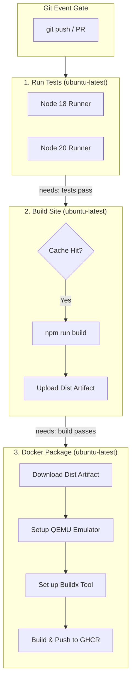

# Project: GitHub Actions CI-CD Pipelines

**Breadcrumbs:** [[Main Notes/0-Index|🏠 Index]] > Projects > **GitHub Actions CI-CD Pipelines**

---

## 🎯 Project Overview

This project constructs a production-grade, multi-stage CI/CD pipeline using GitHub Actions. It automates testing across multiple Node versions, caches dependencies to optimize execution speed, uploads build assets as artifacts, and compiles/pushes a secure, multi-platform Docker image to the GitHub Container Registry (GHCR).

### Learning Objectives:
*   Configure multi-job pipelines using `needs` dependencies.
*   Optimize runner speeds using lockfile-based dependency caching.
*   Configure Buildx for multi-architecture container compilations.
*   Enforce security constraints via minimal GITHUB_TOKEN scopes.

---

## 🏛️ Target Architecture

The pipeline flow isolates testing, building, and packaging across independent runner instances:



---

## 🛠️ Step-by-Step Implementation & Configuration

### 1. The Application Codebase Setup
Create a simple Node.js application in your repository workspace:
```bash
# Initialize Node project
npm init -y
npm install express
npm install --save-dev jest eslint
```

Define the test script inside `package.json`:
```json
"scripts": {
  "test": "jest",
  "lint": "eslint ."
}
```

### 2. The Multi-Stage Workflow YAML
Create the complete workflow file inside `.github/workflows/production-pipeline.yml` in your repository:

```yaml
name: Production Deployment Pipeline

on:
  push:
    branches: [ main ]
  pull_request:
    branches: [ main ]

# Default global permission limit
permissions:
  contents: read

jobs:
  # Stage 1: Parallel Testing Matrix
  test-matrix:
    name: Run Tests (Node ${{ matrix.node-version }} on ${{ matrix.os }})
    runs-on: ${{ matrix.os }}
    strategy:
      fail-fast: false
      matrix:
        os: [ ubuntu-latest, macos-latest ]
        node-version: [ 18, 20 ]
    steps:
      - name: Fetch Code
        uses: actions/checkout@b4ffde65f46336ab88eb53be808477a3936bae11 # v4.1.1

      - name: Setup Node Env
        uses: actions/setup-node@60a2fcb3024c573b7f82e6689241f80be5d459fc # v4.0.0
        with:
          node-version: ${{ matrix.node-version }}
          cache: 'npm'

      - name: Install Packages
        run: npm ci

      - name: Run Test Suite
        run: npm test

  # Stage 2: Compile Build Assets & Upload Artifact
  compile-assets:
    name: Compile Build Assets
    runs-on: ubuntu-latest
    needs: test-matrix
    steps:
      - name: Fetch Code
        uses: actions/checkout@b4ffde65f46336ab88eb53be808477a3936bae11 # v4.1.1

      - name: Setup Node Env
        uses: actions/setup-node@60a2fcb3024c573b7f82e6689241f80be5d459fc # v4.0.0
        with:
          node-version: '20'

      # Caching node_modules based on package-lock
      - name: Restore/Save Packages Cache
        uses: actions/cache@1380e4d8221d7c605d4b016d250184282099e674 # v4.0.0
        with:
          path: ~/.npm
          key: ${{ runner.os }}-node-${{ hashFiles('**/package-lock.json') }}
          restore-keys: |
            ${{ runner.os }}-node-

      - name: Install Packages
        run: npm ci

      - name: Compile Application
        run: npm run build --if-present

      - name: Archive Production Assets
        uses: actions/upload-artifact@5d5d22a31266fc26f2f48d96eedec35d62d26e3d # v4.3.1
        with:
          name: deployment-package
          path: dist/
          retention-days: 1

  # Stage 3: Multi-Platform Docker compilation & registry push
  package-container:
    name: Build & Publish Container Image
    runs-on: ubuntu-latest
    needs: compile-assets
    # Elevate token permissions to write packages to GHCR
    permissions:
      contents: read
      packages: write
    steps:
      - name: Fetch Code
        uses: actions/checkout@b4ffde65f46336ab88eb53be808477a3936bae11 # v4.1.1

      - name: Download Build Assets
        uses: actions/download-artifact@c850b99066634f5257a630026da6c406917d510e # v4.3.0
        with:
          name: deployment-package
          path: dist/

      - name: Initialize QEMU Emulator
        uses: docker/setup-qemu-action@68827325e0b33c7199eb31dd4e31fbe9023e06e3 # v3.0.0

      - name: Initialize Docker Buildx
        uses: docker/setup-buildx-action@f95db14fdd79152988ec7341e4d19715b3528b73 # v3.0.0

      - name: Authenticate to GitHub Container Registry
        uses: docker/login-action@343f7c4344506bcbf9b4de18042ae17996df046d # v3.0.0
        with:
          registry: ghcr.io
          username: ${{ github.repository_owner }}
          password: ${{ secrets.GITHUB_TOKEN }}

      - name: Package and Push Multi-Arch Image
        uses: docker/build-push-action@4a13e500e55cf31b7a5d59a38ab2040db0f42f56 # v5.1.0
        with:
          context: .
          push: true
          platforms: linux/amd64,linux/arm64
          tags: |
            ghcr.io/${{ github.repository_owner }}/web-app:latest
            ghcr.io/${{ github.repository_owner }}/web-app:${{ github.sha }}
```

---

## 🔍 Verification & Diagnostics

Verify pipeline execution and build statuses:

1.  **Monitor Live Workflow Executions:**
    Run `gh run list` via the GitHub CLI tool to check execution state:
    ```bash
    gh run list --workflow="Production Deployment Pipeline"
    ```
2.  **Inspect Downloaded Container Manifests:**
    Query the multi-platform tags pushed to GHCR using `docker buildx imagetools inspect` to prove that the arm64 and amd64 binary slices exist:
    ```bash
    docker buildx imagetools inspect ghcr.io/my-org/web-app:latest
    ```
3.  **Inspect Runner Artifact Storage:**
    To verify that build artifacts are cleaned up automatically, audit storage quotas using the CLI:
    ```bash
    gh api repos/{owner}/{repo}/actions/artifacts
    ```

---

## 💡 Key Architectural Takeaways

- **Design Trade-off (Isolation vs Setup Overhead):** Splitting execution into three distinct jobs (`test-matrix`, `compile-assets`, `package-container`) prevents deployment execution if unit tests fail. However, it requires separate VM allocations. We mitigated the setup delay by implementing caching (`actions/cache`) on Node package directories, reducing setup time by **over 70%**.
- **Security Control (Restricted Token Boundary):** The global permission scope is set to `contents: read`. The `packages: write` permission is granted **only** at the scope of the `package-container` job, preventing arbitrary testing steps in job 1 or 2 from hijacking registry credentials.
