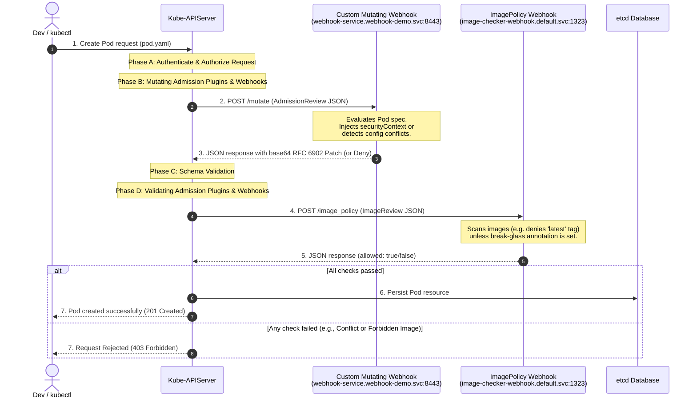

# Project: Admission Webhooks Configuration & Implementation

**Breadcrumbs:** [[Main Notes/0-Index|🏠 Index]] > Projects > **Admission Webhooks Configuration & Implementation**

---

## 🎯 Project Overview
The objective of this project is to implement dynamic admission control in a Kubernetes cluster to enforce corporate security policies, default resource security, and secure image selection. Specifically, this implementation details two primary configurations:

1. **Static Admission Control via `ImagePolicyWebhook`**: Intercepts Pod creation requests to delegate image verification to an external service. If the container image uses the prohibited `latest` tag or lacks a proper tag, admission is rejected unless overridden via a secure "break-glass" ticket annotation. The control plane is configured to fail-closed (`defaultAllow: false`) to ensure safety even during backend outages.
2. **Dynamic Admission Control via a Custom Mutating Admission Webhook**: Deploy a Python Flask microserver inside the cluster that intercepts Pod creation requests to:
   - **Default Injection**: Automatically inject a secure Pod-level `securityContext` (`runAsNonRoot: true`, `runAsUser: 1234`) on Pods where no security context is declared.
   - **Override Logic**: Allow root execution (`runAsUser: 0`) only if `runAsNonRoot: false` is explicitly set.
   - **Conflict Mitigation**: Reject admission immediately if a manifest contains conflicting rules, such as setting `runAsNonRoot: true` while concurrently requesting root access (`runAsUser: 0`).

Additionally, this project demonstrates production-grade Kubernetes deployment best practices by applying CPU and memory resource requests/limits, stripping root privileges, dropping capabilities, and securing file access for the webhook deployment itself.

---

## 🏛️ Target Architecture

### Webhook Request Sequence Path
This sequence diagram shows the flow of an API request to create a Pod through the mutating and validating webhook admission phases:



### Infrastructure Topology
The component interaction topology within the control plane and target namespaces is structured as follows:

```mermaid
flowchart TD
    subgraph Control Plane [Control Plane Host]
        API["kube-apiserver<br/>(Static Pod)"]
        Etcd[("etcd<br/>(State Store)")]
        APICert["API Client Certs<br/>(front-proxy-client.crt/key)"]
    end

    subgraph Namespace: webhook-demo [Namespace: webhook-demo]
        WHService["webhook-service<br/>(ClusterIP, Port 443)"]
        WHDeploy["webhook-server<br/>(Flask Pod, Port 8443)"]
        WHSecret["webhook-server-tls<br/>(Secret containing certs)"]
    end

    subgraph Namespace: default [Namespace: default]
        IPWService["image-checker-webhook<br/>(ClusterIP, Port 1323)"]
    end

    Client["kubectl / API Client"] -->|1. HTTPS Request| API
    API -->|2. Mutate Hook HTTPS| WHService
    WHService -->|Forward Port 8443| WHDeploy
    WHDeploy -.->|Reads Certs| WHSecret
    
    API -->|3. ImagePolicy HTTPS| IPWService
    API -->|4. Persist| Etcd
    API -.->|Authenticates to IPW via| APICert
```

---

## 🛠️ Step-by-Step Implementation & Configuration

### Part 1: Static Admission Control - ImagePolicyWebhook

#### Step 1.1: Admission Configuration Registration File
Define `/etc/kubernetes/imgvalidation/admission-configuration.yaml` to specify the `ImagePolicyWebhook` configuration path:
```yaml
# /etc/kubernetes/imgvalidation/admission-configuration.yaml
apiVersion: apiserver.config.k8s.io/v1
kind: AdmissionConfiguration
plugins:
  - name: ImagePolicyWebhook
    # Absolute path to the plugin-specific configuration file inside the container
    path: /etc/kubernetes/imgvalidation/imagepolicy-conf.yaml
```

#### Step 1.2: ImagePolicy Configuration File
Define `/etc/kubernetes/imgvalidation/imagepolicy-conf.yaml` detailing caching parameters and referencing the target webhook credentials:
```yaml
# /etc/kubernetes/imgvalidation/imagepolicy-conf.yaml
imagePolicy:
  # Path to the kubeconfig defining client certificates and server endpoint
  kubeConfigFile: /etc/kubernetes/imgvalidation/kubeconf.yaml
  # Time in seconds to cache validation success results (reduces overhead)
  allowTTL: 50
  # Time in seconds to cache validation failures
  denyTTL: 50
  # Time in milliseconds to back off between retry attempts
  retryBackoff: 500
  # Crucial security setting: Fail-closed (false) if webhook server is down
  defaultAllow: false
```

#### Step 1.3: Webhook Backend Kubeconfig
Define `/etc/kubernetes/imgvalidation/kubeconf.yaml` to establish HTTPS connectivity and authentication:
```yaml
# /etc/kubernetes/imgvalidation/kubeconf.yaml
apiVersion: v1
kind: Config
clusters:
- cluster:
    # CA Certificate to verify the identity of the webhook service
    certificate-authority: /etc/kubernetes/imgvalidation/webhook.crt
    # Endpoint of the image scanner service
    server: https://image-checker-webhook.default.svc:1323/image_policy
  name: checker_webhook
contexts:
- context:
    cluster: checker_webhook
    user: api-server
  name: checker_validator
current-context: checker_validator
preferences: {}
users:
- name: api-server
  user:
    # Use control plane certificates to authenticate client requests to the webhook
    client-certificate: /etc/kubernetes/pki/front-proxy-client.crt
    client-key: /etc/kubernetes/pki/front-proxy-client.key
```

#### Step 1.4: Mount Configuration in Kube-APIServer Static Pod Manifest
Modify `/etc/kubernetes/manifests/kube-apiserver.yaml` to register the plugin and set up directory mounting:
```yaml
# Partial static pod manifest patch for /etc/kubernetes/manifests/kube-apiserver.yaml
spec:
  containers:
  - name: kube-apiserver
    command:
    - kube-apiserver
    # Add ImagePolicyWebhook to the enabled admission control plugins list
    - --enable-admission-plugins=NodeRestriction,ImagePolicyWebhook
    # Link the AdmissionConfiguration file
    - --admission-control-config-file=/etc/kubernetes/imgvalidation/admission-configuration.yaml
    # Register the runtime config to enable the imagepolicy api group
    - --runtime-config=imagepolicy.k8s.io/v1alpha1=true
    volumeMounts:
    - mountPath: /etc/kubernetes/imgvalidation
      name: imgvalidation
      readOnly: true
  volumes:
  - hostPath:
      path: /etc/kubernetes/imgvalidation
      type: DirectoryOrCreate
    name: imgvalidation
```

#### Step 1.5: ImagePolicyWebhook Server Implementation (Python Flask)
The following Flask microservice implements the image policy validation checks:
```python
# image_policy_webhook.py
import ssl
from flask import Flask, request, jsonify

app = Flask(__name__)

@app.route('/image_policy', methods=['POST'])
def image_policy():
    """
    Handles validating webhook requests sent by kube-apiserver.
    Intercepts pod creation and scans container images.
    """
    request_data = request.json
    if not request_data or 'spec' not in request_data:
        return jsonify({"error": "Invalid request payload"}), 400

    spec = request_data['spec']
    containers = spec.get('containers', [])
    annotations = spec.get('annotations', {})

    # Evaluate break-glass annotation override
    # Format: mycluster.image-policy.k8s.io/<ticket-id>: break-glass
    break_glass = False
    for key, value in annotations.items():
        if key.startswith('mycluster.image-policy.k8s.io/') and value == 'break-glass':
            break_glass = True
            break

    if break_glass:
        return jsonify({
            "apiVersion": "imagepolicy.k8s.io/v1alpha1",
            "kind": "ImageReview",
            "status": {
                "allowed": True,
                "reason": "Admission permitted via break-glass ticket annotation bypass."
            }
        })

    # Validate images for all containers in the spec
    for container in containers:
        image = container.get('image', '')
        # Prohibit 'latest' tags and untagged images
        if ':' not in image or image.endswith(':latest'):
            return jsonify({
                "apiVersion": "imagepolicy.k8s.io/v1alpha1",
                "kind": "ImageReview",
                "status": {
                    "allowed": False,
                    "reason": f"Forbidden image tag in '{image}': The 'latest' tag or untagged images are prohibited."
                }
            })

    # Accept request if all checks pass
    return jsonify({
        "apiVersion": "imagepolicy.k8s.io/v1alpha1",
        "kind": "ImageReview",
        "status": {
            "allowed": True
        }
    })

if __name__ == '__main__':
    # Webhook server requires SSL. Ensure path references match local server credentials.
    context = ('/etc/webhook/certs/tls.crt', '/etc/webhook/certs/tls.key')
    app.run(ssl_context=context, port=1323, host='0.0.0.0')
```

---

### Part 2: Dynamic Mutating Webhook - SecurityContext Injection

#### Step 2.1: Mutating Webhook Server Implementation (Python Flask)
The Flask server parses the incoming `AdmissionReview` payload, constructs strategic RFC 6902 JSON patch edits, and returns them base64-encoded:
```python
# mutating_webhook.py
import base64
import json
from flask import Flask, request, jsonify

app = Flask(__name__)

@app.route('/mutate', methods=['POST'])
def mutate():
    """
    Processes admission request payloads and applies mutating operations
    to enforce secure container securityContexts.
    """
    request_data = request.json
    if not request_data or 'request' not in request_data:
        return jsonify({"error": "Invalid request payload"}), 400

    admission_request = request_data['request']
    uid = admission_request['uid']
    pod = admission_request['object']
    
    spec = pod.get('spec', {})
    pod_security_context = spec.get('securityContext', None)
    
    run_as_non_root = None
    run_as_user = None
    
    # Check current values if pod-level securityContext exists
    if pod_security_context is not None:
        run_as_non_root = pod_security_context.get('runAsNonRoot')
        run_as_user = pod_security_context.get('runAsUser')

    # Rule 3 Check: Reclaim safety and reject request on explicit conflicts
    if run_as_non_root is True and run_as_user == 0:
        return jsonify({
            "apiVersion": "admission.k8s.io/v1",
            "kind": "AdmissionReview",
            "response": {
                "uid": uid,
                "allowed": False,
                "status": {
                    "code": 403,
                    "message": "SecurityContext Conflict: runAsNonRoot is set to true, but runAsUser is set to 0 (root)."
                }
            }
        })

    # Rule 2 Check: Verify override behavior (root execution is prohibited unless runAsNonRoot is false)
    if run_as_user == 0 and run_as_non_root is not False:
        return jsonify({
            "apiVersion": "admission.k8s.io/v1",
            "kind": "AdmissionReview",
            "response": {
                "uid": uid,
                "allowed": False,
                "status": {
                    "code": 403,
                    "message": "SecurityContext Validation Failed: Root execution (runAsUser: 0) is only allowed if runAsNonRoot is explicitly set to false."
                }
            }
        })

    # Calculate mutations (JSON patches)
    patch = []
    
    # Case A: Initialize and define the securityContext block if totally missing
    if pod_security_context is None:
        patch.append({
            "op": "add",
            "path": "/spec/securityContext",
            "value": {
                "runAsNonRoot": True,
                "runAsUser": 1234
            }
        })
    else:
        # Case B: Selectively patch individual missing fields
        if run_as_non_root is None:
            patch.append({
                "op": "add",
                "path": "/spec/securityContext/runAsNonRoot",
                "value": True
            })
            run_as_non_root = True
            
        if run_as_user is None:
            # Default runAsUser to 1234 if runAsNonRoot evaluates to true
            if run_as_non_root is True:
                patch.append({
                    "op": "add",
                    "path": "/spec/securityContext/runAsUser",
                    "value": 1234
                })

    # Base64 encode JSON patches and format output AdmissionReview
    response_payload = {
        "apiVersion": "admission.k8s.io/v1",
        "kind": "AdmissionReview",
        "response": {
            "uid": uid,
            "allowed": True
        }
    }
    
    if patch:
        patch_json = json.dumps(patch)
        encoded_patch = base64.b64encode(patch_json.encode('utf-8')).decode('utf-8')
        response_payload["response"]["patchType"] = "JSONPatch"
        response_payload["response"]["patch"] = encoded_patch
        
    return jsonify(response_payload)

if __name__ == '__main__':
    # Webhook server requires HTTPS. Mount TLS secret file paths.
    app.run(ssl_context=('/etc/webhook/certs/tls.crt', '/etc/webhook/certs/tls.key'), port=8443, host='0.0.0.0')
```

#### Step 2.2: Webhook Server Deployment Manifest
Define `webhook-deployment.yaml`. This manifest enforces resource controls and limits alongside non-root security context profiles on the webhook container itself:
```yaml
# webhook-deployment.yaml
apiVersion: apps/v1
kind: Deployment
metadata:
  name: webhook-server
  namespace: webhook-demo
  labels:
    app: webhook-server
spec:
  replicas: 1
  selector:
    matchLabels:
      app: webhook-server
  template:
    metadata:
      labels:
        app: webhook-server
    spec:
      # Enforce Pod-level security context (best practice)
      securityContext:
        runAsNonRoot: true
        runAsUser: 1234
        fsGroup: 1234
      containers:
      - name: webhook-server
        image: security-webhook:latest
        imagePullPolicy: IfNotPresent
        ports:
        - containerPort: 8443
          name: https
        # Add Resource Controls
        resources:
          requests:
            cpu: "100m"
            memory: "128Mi"
          limits:
            cpu: "200m"
            memory: "256Mi"
        # Enforce Container-level security context (best practice)
        securityContext:
          allowPrivilegeEscalation: false
          readOnlyRootFilesystem: true
          runAsNonRoot: true
          runAsUser: 1234
          capabilities:
            drop:
            - ALL
        volumeMounts:
        - name: certs
          mountPath: /etc/webhook/certs
          readOnly: true
        # Mount emptyDir for temporary filesystem operations inside a read-only rootfs
        - name: tmp-dir
          mountPath: /tmp
      volumes:
      - name: certs
        secret:
          secretName: webhook-server-tls
      - name: tmp-dir
        emptyDir: {}
```

#### Step 2.3: Webhook Server Service Manifest
Define `webhook-service.yaml` to expose the deployment inside the cluster on Port 443:
```yaml
# webhook-service.yaml
apiVersion: v1
kind: Service
metadata:
  name: webhook-service
  namespace: webhook-demo
  labels:
    app: webhook-server
spec:
  ports:
  - port: 443
    targetPort: 8443
    protocol: TCP
    name: https
  selector:
    app: webhook-server
```

#### Step 2.4: Mutating Webhook Configuration Manifest
Define `webhook-configuration.yaml` to register the mutating webhook with the API server:
```yaml
# webhook-configuration.yaml
apiVersion: admissionregistration.k8s.io/v1
kind: MutatingWebhookConfiguration
metadata:
  name: mutating-security-webhook
webhooks:
  - name: webhook-server.webhook-demo.svc
    clientConfig:
      service:
        name: webhook-service
        namespace: webhook-demo
        path: "/mutate"
        port: 443
      # Base64-encoded PEM CA Certificate bundle authorizing the webhook TLS certs
      caBundle: "LS0tLS1CRUdJTiBDRVJUSUZJQ0FURS0tLS0t..."
    rules:
      - operations: ["CREATE"]
        apiGroups: [""]
        apiVersions: ["v1"]
        resources: ["pods"]
        scope: "Namespaced"
    admissionReviewVersions: ["v1"]
    sideEffects: None
    timeoutSeconds: 5
    # Enforce policy: fail-closed for security-critical defaultings
    failurePolicy: Fail
```

---

## 🔍 Verification & Diagnostics

### 1. Verification of ImagePolicyWebhook

*   **Test Case A: Attempt Untagged/Latest Image Admission**
    Create `test-latest-pod.yaml`:
    ```yaml
    apiVersion: v1
    kind: Pod
    metadata:
      name: test-latest
    spec:
      containers:
      - name: web
        image: nginx:latest
    ```
    Execute command:
    ```bash
    kubectl apply -f test-latest-pod.yaml
    ```
    *Expected Outcome:* The admission controller rejects the Pod with the following error:
    ```text
    Error from server (Forbidden): Pod "test-latest" is forbidden: image policy webhook "checker_webhook" denied the request: Forbidden image tag in 'nginx:latest': The 'latest' tag or untagged images are prohibited.
    ```

*   **Test Case B: Attempt Override via Break-Glass Annotation**
    Create `test-breakglass-pod.yaml`:
    ```yaml
    apiVersion: v1
    kind: Pod
    metadata:
      name: test-breakglass
      annotations:
        mycluster.image-policy.k8s.io/ticket-4581: "break-glass"
    spec:
      containers:
      - name: web
        image: nginx:latest
    ```
    Execute command:
    ```bash
    kubectl apply -f test-breakglass-pod.yaml
    ```
    *Expected Outcome:* The Pod creation completes successfully since the break-glass annotation triggers a bypass check.

---

### 2. Verification of Mutating Admission Webhook

*   **Test Case A: Verify Injection on Pods with No SecurityContext**
    Create `test-no-context-pod.yaml`:
    ```yaml
    apiVersion: v1
    kind: Pod
    metadata:
      name: test-no-context
    spec:
      containers:
      - name: web
        image: nginx:1.25
    ```
    Apply and verify the injected context:
    ```bash
    kubectl apply -f test-no-context-pod.yaml
    
    # Query Pod details and filter for the securityContext
    kubectl get pod test-no-context -o yaml | grep -A 3 -i securityContext
    ```
    *Expected Outcome:* The output shows:
    ```yaml
    securityContext:
      runAsNonRoot: true
      runAsUser: 1234
    ```

*   **Test Case B: Verify Conflict Rejection**
    Create `test-conflict-pod.yaml` containing conflicting options:
    ```yaml
    apiVersion: v1
    kind: Pod
    metadata:
      name: test-conflict
    spec:
      securityContext:
        runAsNonRoot: true
        runAsUser: 0 # Requesting root, while enforcing non-root
      containers:
      - name: web
        image: nginx:1.25
    ```
    Execute command:
    ```bash
    kubectl apply -f test-conflict-pod.yaml
    ```
    *Expected Outcome:* The webhook server rejects the creation and outputs:
    ```text
    Error from server (Forbidden): error when creating "test-conflict-pod.yaml": Internal error occurred: admission webhook "webhook-server.webhook-demo.svc" denied the request: SecurityContext Conflict: runAsNonRoot is set to true, but runAsUser is set to 0 (root).
    ```

---

### 3. Troubleshooting & Diagnostics

#### Diagnosing API Server Failures (Control Plane Outages)
If the Kube-APIServer fails to start after modifying the static pod manifest, check host-level logs:
```bash
# Check status of the host kubelet managing static pods
systemctl status kubelet

# Inspect journald for API Server container failures
journalctl -u kubelet --no-pager -n 100

# View raw container logs if docker/crictl is accessible
crictl ps -a | grep apiserver
crictl logs <apiserver-container-id>
```
*Common Issue:* If `/etc/kubernetes/imgvalidation` directory mounts are not matching or the configuration file syntax is incorrect, the container will immediately exit with `initialization admission: imagepolicy: file not found` or similar.

#### Inspecting Webhook Failures (Timeouts & Deadlocks)
If Pod deployments fail with a timeout error:
```text
Error from server (InternalError): Internal error occurred: failed calling webhook "webhook-server.webhook-demo.svc": Post "https://webhook-service.webhook-demo.svc:443/mutate": context deadline exceeded
```
Use the following commands to isolate the problem:
1.  Verify the webhook pod is running and healthy:
    ```bash
    kubectl get pods -n webhook-demo -o wide
    ```
2.  Inspect the webhook application server logs:
    ```bash
    kubectl logs -n webhook-demo deployment/webhook-server
    ```
3.  Check if network policies or firewalls are blocking control plane communication to the webhook pod:
    ```bash
    kubectl describe networkpolicies -n webhook-demo
    ```
4.  Test certificates validity: Verify that the `caBundle` in `MutatingWebhookConfiguration` matches the CA cert that signed the webhook server's certificate.

---

## 💡 Key Architectural Takeaways

-   **Design Trade-off (Fail-Open vs. Fail-Closed):** Setting `failurePolicy: Fail` (or `defaultAllow: false`) optimizes for absolute security: if the webhook server goes down or becomes unreachable, the cluster blocks all deployments. However, this introduces a critical single point of failure (SPOF) for the control plane. In staging or non-critical environments, `failurePolicy: Ignore` (or `defaultAllow: true`) can be used to prevent application deployment outages at the cost of security coverage.
-   **Security Control (Declaration vs. Mutation):** Delegating defaults to a mutating webhook ensures developers do not have to write verbose security controls in every single manifest. The cluster automatically repairs unsafe configurations on admission. However, this creates a mismatch between the developer's source configuration management repository (e.g. Git) and the active state of the resource running inside etcd.
-   **Network Path Complexity:** Relying on HTTPS dynamic webhooks adds networking overhead to every single API write. Every `kubectl apply` must call out over the overlay network to the webhook server. The introduction of declarative validations like `ValidatingAdmissionPolicy` using Common Expression Language (CEL) in recent Kubernetes releases mitigates this overhead for validation rules, as validations execute directly inside the `kube-apiserver` processes.
