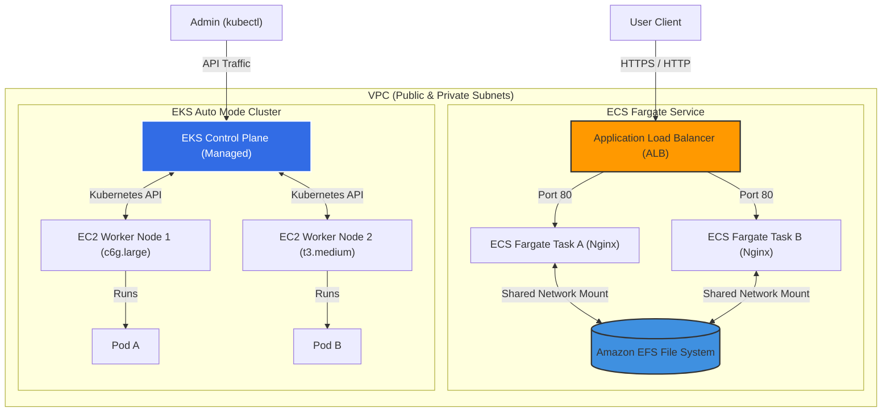

# Project: ECS and EKS Cluster Deployments

**Breadcrumbs:** [[Main Notes/0-Index|🏠 Index]] > Projects > **ECS and EKS Cluster Deployments**

---

## 🎯 Project Overview
This project details the step-by-step implementation, configuration, and verification of container orchestration architectures on AWS. It covers:
1. **AWS ECS Cluster & Service:** Provisioning an Elastic Container Service cluster using both AWS Fargate (serverless) and self-managed EC2 launch types, complete with an Application Load Balancer (ALB) and security groups.
2. **AWS EKS Cluster:** Deploying a managed Kubernetes cluster using EKS Auto Mode (managed node provisioning), configuring Node IAM Roles, cluster security groups, and verifying node scaling.

---

## 🏛️ Target Architecture

### ECS & EKS Deployments Topology


---

## 🛠️ Step-by-Step Implementation & Configuration

### 1. ECS Task & Service Configuration (Fargate)

#### A. Task Definition Schema (`nginx-fargate-task.json`)
The task definition dictates the CPU/Memory footprint, container image source, port mappings, and logging drivers.
```json
{
  "family": "nginxdemos-hello",
  "networkMode": "awsvpc",
  "containerDefinitions": [
    {
      "name": "nginxdemos-hello",
      "image": "nginxdemoshello/hello:latest",
      "essential": true,
      "portMappings": [
        {
          "containerPort": 80,
          "hostPort": 80,
          "protocol": "tcp"
        }
      ],
      "logConfiguration": {
        "logDriver": "awslogs",
        "options": {
          "awslogs-group": "/ecs/nginxdemos-hello",
          "awslogs-region": "us-east-1",
          "awslogs-stream-prefix": "ecs"
        }
      }
    }
  ],
  "requiresCompatibilities": [
    "FARGATE"
  ],
  "cpu": "256",
  "memory": "512"
}
```

#### B. CLI Deployment Commands
1. Register the task definition:
```bash
aws ecs register-task-definition --cli-input-json file://nginx-fargate-task.json
```
2. Create the ECS Cluster:
```bash
aws ecs create-cluster --cluster-name DemoCluster
```
3. Create the Target Group and Application Load Balancer to distribute traffic:
```bash
# Create target group
aws elbv2 create-target-group \
    --name nginxdemosTG \
    --protocol HTTP \
    --port 80 \
    --vpc-id vpc-0123456789abcdef0 \
    --target-type ip

# Create ALB
aws elbv2 create-load-balancer \
    --name DemoALBForECS \
    --subnets subnet-0123456789abcdef0 subnet-0987654321fedcba0 \
    --security-groups sg-0123456789abcdef0

# Create ALB Listener to forward traffic
aws elbv2 create-listener \
    --load-balancer-arn arn:aws:elasticloadbalancing:us-east-1:123456789012:loadbalancer/app/DemoALBForECS/f2f7dc8e1b3e839e \
    --protocol HTTP \
    --port 80 \
    --default-actions Type=forward,TargetGroupArn=arn:aws:elasticloadbalancing:us-east-1:123456789012:targetgroup/nginxdemosTG/73e2d6bc24d8a067
```
4. Deploy the ECS Service on Fargate:
```bash
aws ecs create-service \
    --cluster DemoCluster \
    --service-name NginxService \
    --task-definition nginxdemos-hello:1 \
    --desired-count 3 \
    --launch-type FARGATE \
    --network-configuration "awsvpcConfiguration={subnets=[subnet-0123456789abcdef0,subnet-0987654321fedcba0],securityGroups=[sg-0123456789abcdef0],assignPublicIp=ENABLED}" \
    --load-balancers "targetGroupArn=arn:aws:elasticloadbalancing:us-east-1:123456789012:targetgroup/nginxdemosTG/73e2d6bc24d8a067,containerName=nginxdemos-hello,containerPort=80"
```

---

### 2. EKS Cluster Configuration (Auto Mode)

EKS Auto Mode automatically provisions node capacity (via built-in Karpenter) when pods cannot fit.

#### A. Node Trust Policy (`node-trust-policy.json`)
Allows EC2 instances to communicate with the EKS Control Plane.
```json
{
  "Version": "2012-10-17",
  "Statement": [
    {
      "Effect": "Allow",
      "Principal": {
        "Service": "ec2.amazonaws.com"
      },
      "Action": "sts:AssumeRole"
    }
  ]
}
```

#### B. CLI EKS Provisioning & Node Registration
1. Create the Node IAM Role and attach EKS Auto Mode policies:
```bash
aws iam create-role --role-name AmazonEKSAutoNodeRole --assume-role-policy-document file://node-trust-policy.json

# Attach necessary managed policies
aws iam attach-role-policy --role-name AmazonEKSAutoNodeRole --policy-arn arn:aws:iam::aws:policy/AmazonEKSWorkerNodePolicy
aws iam attach-role-policy --role-name AmazonEKSAutoNodeRole --policy-arn arn:aws:iam::aws:policy/AmazonEKS_CNI_Policy
aws iam attach-role-policy --role-name AmazonEKSAutoNodeRole --policy-arn arn:aws:iam::aws:policy/AmazonEC2ContainerRegistryReadOnly
```
2. Deploy the EKS Cluster with Auto Mode active:
```bash
aws eks create-cluster \
    --name DemoEKSCluster \
    --role-arn arn:aws:iam::123456789012:role/EKSClusterRole \
    --resources-vpc-config subnetIds=subnet-0123456789abcdef0,subnet-0987654321fedcba0,securityGroupIds=sg-0123456789abcdef0 \
    --kubernetes-network-config ipFamily=ipv4 \
    --access-config authenticationMode=API_AND_CONFIG_MAP
```

---

## 🔍 Verification & Diagnostics

### 1. ECS Deployment Verification
*   **List Tasks:** Verify the running state and IP configurations of the tasks in the cluster.
    ```bash
    aws ecs list-tasks --cluster DemoCluster
    ```
*   **Query Target Health:** Confirm that the tasks are successfully registered in the target group and reporting healthy.
    ```bash
    aws elbv2 describe-target-health --target-group-arn arn:aws:elasticloadbalancing:us-east-1:123456789012:targetgroup/nginxdemosTG/73e2d6bc24d8a067
    ```
*   **Test ALB Endpoints:** Query the ALB DNS endpoint to verify the dynamic round-robin routing between tasks.
    ```bash
    curl http://DemoALBForECS-1234567890.us-east-1.elb.amazonaws.com
    ```

### 2. EKS Auto Mode Node Scaling Validation
*   **Inspect Worker Nodes:** Verify what nodes have been registered dynamically by EKS Auto Mode:
    ```bash
    kubectl get nodes -o wide
    ```
*   **Trigger Dynamic Scaling:** Deploy a workload requiring heavy resource allocation to trigger Karpenter node provisioning:
    ```bash
    kubectl create deployment scale-test --image=nginx --replicas=20
    kubectl set resources deployment scale-test --limits=cpu=1,memory=2Gi --requests=cpu=500m,memory=1Gi
    ```
*   **Track Node Provisioning Event Logs:** Watch EKS Auto Mode allocate a new instance (e.g. `c6g.large`) dynamically:
    ```bash
    kubectl get events --watch | grep -i node
    ```

---

## 💡 Key Architectural Takeaways
*   **Design Trade-off (Fargate vs. EC2 Launch Type):** Fargate removes all node patching, OS scaling, and VM maintenance overhead. However, Fargate has higher raw hourly costs per vCPU/RAM compared to highly utilized EC2 clusters. For unpredictable, bursty container workloads, Fargate is optimal; for predictable, steady-state high-throughput workloads, EC2 with Capacity Providers yields better economics.
*   **Security Control (ECS Task Role vs. Task Execution Role):** ECS enforces a clear boundary between runtime permissions (Task Role) and infrastructure setup permissions (Task Execution Role). Task Execution Roles pull private images from ECR and fetch configurations from Secrets Manager before the container boots; the Task Role dictates what resources (like S3 or DynamoDB) the container program can access at runtime.
*   **Scaling Resolution (ECS Capacity Provider):** Using Capacity Providers paired with Auto Scaling Groups prevents the "cluster deadlock" problem. The Capacity Provider evaluates pending task requirements and scales the underlying EC2 node count when tasks are in a `PENDING` state due to resource exhaustion.
