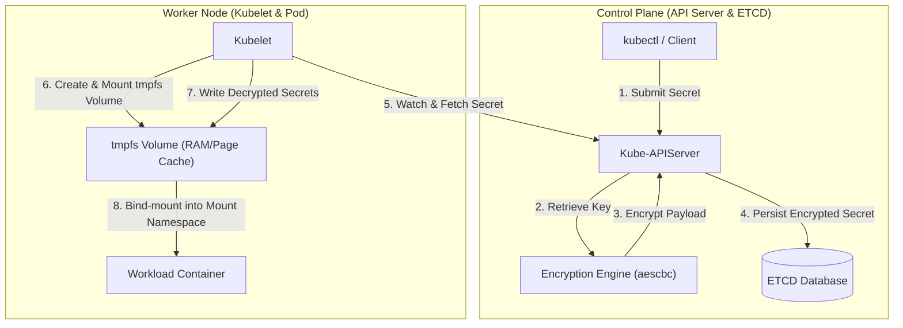

# Project: Kubernetes Secrets Management & ETCD Encryption at Rest

**Breadcrumbs:** [[Main Notes/0-Index|🏠 Index]] > Projects > **Kubernetes Secrets Management & ETCD Encryption at Rest**

---

## 🎯 Project Overview
The objective of this project is to implement a comprehensive security posture for sensitive data within a Kubernetes cluster. This is achieved by combining three distinct vectors of secret security:
1. **Workload Ingestion Security:** Deploying pods with secure `securityContext` settings and mounting credentials using memory-backed `tmpfs` volumes.
2. **Ephemeral Service Identification:** Implementing `ServiceAccount` token projection to issue short-lived, audience-bound, and auto-rotated JWT tokens via the `TokenRequest` API instead of legacy static tokens.
3. **Datastore Encryption at Rest:** Configuring the `kube-apiserver` to encrypt secret payloads before persistence in the `etcd` backing store using a symmetric `aescbc` cipher.

By completing this playbook, workloads obtain secure configurations conforming to strict hardening guides (e.g., CIS Kubernetes Benchmark), and raw credentials in the datastore are protected against data leakage and host-compromise attacks.

---

## 🏛️ Target Architecture

The following diagram illustrates:
1. **The Write Path (Encryption):** A client submits a Secret. The `kube-apiserver` intercepts it, generates/reads the key from the static `aescbc` provider config, encrypts the payload, and writes the ciphertext prefixed with `k8s:enc:aescbc:v1:` to `etcd`.
2. **The Run Path (Decrypted Mount):** Kubelet schedules the Pod, retrieves the Secret from the API, mounts a node-local memory-backed `tmpfs` volume, writes the decrypted values, and bind-mounts it into the container namespace.



---

## 🛠️ Step-by-Step Implementation & Configuration

### 1. Declaring Namespaces and Secrets
First, we establish a secure namespace partition `secure-secrets`. We then declare the Opaque, Basic-Auth, SSH-Auth, and TLS secrets.

#### Namespace Definition
```yaml
apiVersion: v1
kind: Namespace
metadata:
  name: secure-secrets
```

#### Opaque Secret Manifest
```yaml
apiVersion: v1
kind: Secret
metadata:
  name: db-credentials
  namespace: secure-secrets
  labels:
    app: secure-app
type: Opaque
data:
  username: ZGJhZG1pbg== # base64 for "dbadmin"
  password: cEBzc3dvcmQxMjM= # base64 for "p@ssword123"
```

#### Basic Authentication Secret Manifest
```yaml
apiVersion: v1
kind: Secret
metadata:
  name: basic-auth-secret
  namespace: secure-secrets
  labels:
    app: secure-app
type: kubernetes.io/basic-auth
stringData:
  username: admin
  password: t0p-Secret
```

#### SSH Authentication Secret Manifest
```yaml
apiVersion: v1
kind: Secret
metadata:
  name: ssh-auth-secret
  namespace: secure-secrets
  labels:
    app: secure-app
type: kubernetes.io/ssh-auth
data:
  ssh-privatekey: |
    UG91cmluZzYlRW1vdGljb24lU2N1YmE= # Dummy base64 private key
```

#### TLS Secret Manifest
```yaml
apiVersion: v1
kind: Secret
metadata:
  name: tls-secret
  namespace: secure-secrets
  labels:
    app: secure-app
type: kubernetes.io/tls
data:
  tls.crt: "LS0tLS1CRUdJTiBDRVJUSUZJQ0FURS0tLS0tCgpMUzB0TFUxQ1JVZEpUa0ZVU1V4RldVNWZVM1V0TFV0dExVdHRMVXR0TFV0dExVdHRMVXR0TFV0dExVdHQKLS0tLS1FTkQgQ0VSVElGSUNBVEUtLS0tLQo="
  tls.key: "LS0tLS1CRUdJTiBQUklWQVRFIEtFWS0tLS0tCgpMUzB0TFUxQ1JVZEpUa0ZVU1V4RldVNWZVM1V0TFV0dExVdHRMVXR0TFV0dExVdHRMVXR0TFV0dExVdHQKLS0tLS1FTkQgUFJJVkFURSBLRVktLS0tLQo="
```

### 2. ServiceAccount & Workload Deployment
We deploy the workload, binding it to a non-root `securityContext`, establishing resource constraints, mounting the secrets with strict read-only permissions, and implementing **ServiceAccount Token Projection**.

```yaml
apiVersion: v1
kind: ServiceAccount
metadata:
  name: secure-sa
  namespace: secure-secrets
  labels:
    app: secure-app
---
apiVersion: v1
kind: Pod
metadata:
  name: secure-secrets-pod
  namespace: secure-secrets
  labels:
    app: secure-app
spec:
  securityContext:
    runAsNonRoot: true
    runAsUser: 1234
    fsGroup: 1234
  serviceAccountName: secure-sa
  containers:
  - name: secure-app-container
    image: alpine:3.18
    command: ["/bin/sh", "-c", "sleep 3600"]
    resources:
      requests:
        cpu: "100m"
        memory: "128Mi"
      limits:
        cpu: "200m"
        memory: "256Mi"
    securityContext:
      allowPrivilegeEscalation: false
      readOnlyRootFilesystem: true
      capabilities:
        drop:
        - ALL
    volumeMounts:
    - name: db-creds-volume
      mountPath: /etc/secrets/db
      readOnly: true
    - name: basic-auth-volume
      mountPath: /etc/secrets/auth
      readOnly: true
    - name: ssh-key-volume
      mountPath: /etc/secrets/ssh
      readOnly: true
    - name: tls-volume
      mountPath: /etc/secrets/tls
      readOnly: true
    - name: sa-token-projected-volume
      mountPath: /var/run/secrets/projected/serviceaccount
      readOnly: true
  volumes:
  - name: db-creds-volume
    secret:
      secretName: db-credentials
      defaultMode: 0400 # Read-only, owner-only permission
  - name: basic-auth-volume
    secret:
      secretName: basic-auth-secret
      defaultMode: 0400
  - name: ssh-key-volume
    secret:
      secretName: ssh-auth-secret
      defaultMode: 0400
  - name: tls-volume
    secret:
      secretName: tls-secret
      defaultMode: 0400
  - name: sa-token-projected-volume
    projected:
      sources:
      - serviceAccountToken:
          audience: api # Token is bound only to the API audience
          expirationSeconds: 3600 # 1-hour expiration
          path: token
```

---

### 3. Enabling ETCD Encryption at Rest

#### Step A: Generate a Secure Key
Generate a secure random 32-byte key encoded in Base64:
```bash
head -c 32 /dev/urandom | base64
```
*Example Output:* `gKzP0rL4w9eQ3fR8yT5uV2x4z6A8b0c2d4e6f8g9h1k=`

#### Step B: Create the EncryptionConfiguration File
On the control plane node, create the configuration file at `/etc/kubernetes/encryption/config.yaml`.

```yaml
apiVersion: apiserver.config.k8s.io/v1
kind: EncryptionConfiguration
resources:
  - resources:
      - secrets
    providers:
      - aescbc:
          keys:
            - name: key1
              secret: gKzP0rL4w9eQ3fR8yT5uV2x4z6A8b0c2d4e6f8g9h1k= # Paste your output here
      - identity: {} # Fallback provider to read existing unencrypted secrets
```
> [!IMPORTANT]
> The order of the providers is critical. The API Server encrypts writes using the **first** provider in the list. It decrypts reads using any of the listed providers. Keep `identity: {}` at the end during migrations.

#### Step C: Modify the Kube-APIServer Static Pod Definition
Edit `/etc/kubernetes/manifests/kube-apiserver.yaml` to include the `--encryption-provider-config` flag and map the host directory into the container's volume mounts.

```diff
--- /etc/kubernetes/manifests/kube-apiserver.yaml.orig
+++ /etc/kubernetes/manifests/kube-apiserver.yaml
@@ -15,6 +15,7 @@
     - --allow-privileged=true
     - --authorization-mode=Node,RBAC
     - --client-ca-file=/etc/kubernetes/pki/ca.crt
+    - --encryption-provider-config=/etc/kubernetes/encryption/config.yaml
     - --enable-admission-plugins=NodeRestriction
     - --enable-bootstrap-token-auth=true
     - --etcd-cafile=/etc/kubernetes/pki/etcd/ca.crt
@@ -75,6 +76,10 @@
     volumeMounts:
     - mountPath: /etc/ssl/certs
       name: ssl-certs
       readOnly: true
+    - mountPath: /etc/kubernetes/encryption
+      name: encryption-config
+      readOnly: true
     - mountPath: /etc/pki
       name: etc-pki
       readOnly: true
@@ -124,6 +129,11 @@
   volumes:
   - hostPath:
       path: /etc/ssl/certs
       type: DirectoryOrCreate
     name: ssl-certs
+  - hostPath:
+      path: /etc/kubernetes/encryption
+      type: DirectoryOrCreate
+    name: encryption-config
   - hostPath:
       path: /etc/pki
       type: DirectoryOrCreate
```

Save the file. The Kubelet will detect the modification and automatically restart the API server static pod.

#### Step D: Force Re-encryption of Existing Secrets
Enabling encryption only encrypts *new* write events. To encrypt all pre-existing Secrets in the cluster, force an in-place update using the following command:

```bash
kubectl get secrets -A -o json | kubectl replace -f -
```

---

## 🔍 Verification & Diagnostics

### 1. Verifying ETCD Encryption at Rest
Verify that secrets are written to ETCD as encrypted blobs rather than plaintext JSON.

#### Step A: SSH into the Control Plane Node
```bash
ssh admin@control-plane-node-ip
```

#### Step B: Query raw secret content directly from ETCD
Establish environmental parameters and query ETCD using `etcdctl`:
```bash
export ETCDCTL_API=3
export ETCD_CERTS="/etc/kubernetes/pki/etcd"

# Create a validation secret
kubectl create secret generic validation-secret \
  --from-literal=testkey=securepayload123 \
  -n secure-secrets

# Retrieve the key directly from the database
sudo etcdctl \
  --endpoints=https://127.0.0.1:2379 \
  --cacert=$ETCD_CERTS/ca.crt \
  --cert=$ETCD_CERTS/server.crt \
  --key=$ETCD_CERTS/server.key \
  get /registry/secrets/secure-secrets/validation-secret --print-value-only
```

*Expected Output:*
```
k8s:enc:aescbc:v1:key1:▒tF4\l...
```
The presence of the `k8s:enc:aescbc:v1:key1:` header confirms the payload is encrypted using the designated key and provider.

*Cleanup command:*
```bash
kubectl delete secret validation-secret -n secure-secrets
```

---

### 2. Verifying `tmpfs` Memory Mounts inside Pods
Verify that secrets do not persist to physical disk sectors, and instead reside only in volatile memory namespaces.

#### Method A: From inside the Container Namespace
```bash
kubectl exec -it secure-secrets-pod -n secure-secrets -- mount | grep tmpfs
```
*Expected Output:*
```
tmpfs on /etc/secrets/db type tmpfs (ro,relatime,size=10240k)
tmpfs on /etc/secrets/auth type tmpfs (ro,relatime,size=10240k)
tmpfs on /etc/secrets/ssh type tmpfs (ro,relatime,size=10240k)
tmpfs on /etc/secrets/tls type tmpfs (ro,relatime,size=10240k)
tmpfs on /var/run/secrets/projected/serviceaccount type tmpfs (ro,relatime,size=10240k)
```

#### Method B: From the Worker Node Host Namespace
Locate the mount directory for the specific container:
```bash
# Obtain the UID of the target pod
POD_UID=$(kubectl get pod secure-secrets-pod -n secure-secrets -o jsonpath='{.metadata.uid}')

# SSH to the worker node hosting the pod and check mounted systems
ssh admin@worker-node-ip "mount | grep $POD_UID | grep tmpfs"
```
*Expected Output:*
```
tmpfs on /var/lib/kubelet/pods/<pod-uid>/volumes/kubernetes.io~secret/db-creds-volume type tmpfs (rw,relatime,size=10240k)
tmpfs on /var/lib/kubelet/pods/<pod-uid>/volumes/kubernetes.io~secret/basic-auth-volume type tmpfs (rw,relatime,size=10240k)
```

---

## 💡 Key Architectural Takeaways

- **Design Trade-off: Provider Selection & Complexity**
  Symmetric static encryption (`aescbc`) offers high performance and absolute local independence without third-party network bottlenecks. However, key storage relies entirely on file security of `/etc/kubernetes/encryption/config.yaml`. KMS Envelope Encryption solves the key storage problem by moving keys into an HSM but introduces latency, gRPC socket failure modes, and external cloud dependencies.
- **Security Control: Memory-Backed Isolation**
  Mounting secrets via `tmpfs` keeps keys in page cache (RAM) on the worker node. When a pod is deleted, the filesystem is unmounted, instantly destroying the keys from memory. This acts as a robust anti-forensic security boundary, preventing residual write traces on local NVMe/SSD nodes.
- **Security Control: ServiceAccount Token Projection**
  Projected ServiceAccount tokens improve cluster security by swapping long-lived, non-restrictive credentials with short-lived (customizable TTL), audience-bound JWT files. The Kubelet background manager atomically replaces the local mount file using Linux `rename()`, ensuring no read corruption occurs during live credential updates.
- **Operational Precedence: Sequential Provider Fallbacks**
  Kube-APIServer handles decryption based on the order defined in the config array. To execute a zero-downtime transition, `identity: {}` (or the old key) must remain in the configuration list below the active encryption provider. Moving providers out of order will result in immediate API Server decryption failures.
