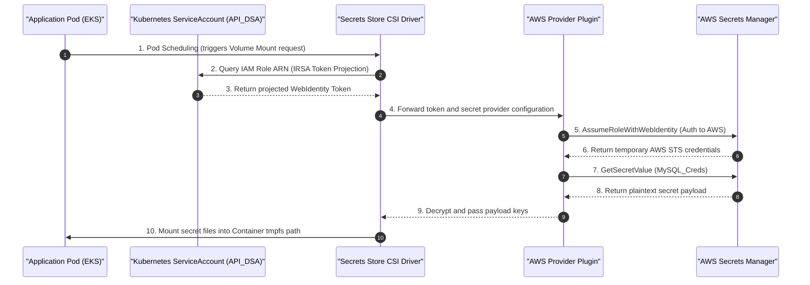

# Project: AWS Secrets Manager Integration via Secrets Store CSI Driver

**Breadcrumbs:** [[Main Notes/0-Index|🏠 Index]] > Projects > **AWS Secrets Manager Integration via Secrets Store CSI Driver**

---

## 🎯 Project Overview
This project provides a complete step-by-step playbook to integrate an Amazon EKS cluster with AWS Secrets Manager using the **Secrets Store CSI Driver** and the **AWS Secrets Manager Provider**. 

By completing this PoC:
1. Credentials are managed centrally in AWS Secrets Manager.
2. The EKS workloads retrieve these secrets dynamically at runtime.
3. Secrets are mounted as files into container namespaces using memory-backed `tmpfs` mounts, bypassing native Kubernetes `Secret` API structures entirely.
4. Auto-rotation is configured to poll AWS for updates and hot-reload credentials dynamically in containers.

---

## 🏛️ Target Architecture



---

## 🛠️ Step-by-Step Implementation & Configuration

### 1. Generating Credentials in AWS Secrets Manager

#### The Answer:
Create a secret named `MySQL_Creds` in region `us-east-1` with key-value data:
```bash
aws secretsmanager create-secret --name MySQL_Creds \
  --description "Database credentials for Secure Web API" \
  --secret-string '{"username":"dbadmin","password":"supersecretpassword123"}' \
  --region us-east-1
```

#### The Assumptions:
* You have installed the AWS CLI locally and authenticated with administrator permissions.
* The target EKS cluster is deployed in the same region (`us-east-1`).

#### The Rationale (Why):
Centrally storing configuration data in AWS Secrets Manager shifts access control and rotation enforcement to AWS security hardware (HSMs), protecting secrets from control plane host exploits.

#### The Failure Loop (What if not):
If the secret name or regional key path contains typos, the CSI driver will fail to locate the secret, returning a `GetSecretValue` NotFound exception, and preventing the application pod from mounting the volume.

---

### 2. Installing CSI Driver and AWS Provider Plugin via Helm

#### The Answer:
Deploy the Secrets Store CSI Driver Helm release in the `kube-system` namespace, enabling rotation, and install the AWS Provider daemon:
```bash
# 1. Add Helm Repository and Update
helm repo add secrets-store-csi-driver https://kubernetes-sigs.github.io/secrets-store-csi-driver/charts
helm repo update

# 2. Deploy CSI Driver with Auto-Rotation enabled
helm install csi-secrets-store secrets-store-csi-driver/secrets-store-csi-driver \
  --namespace kube-system \
  --set enableSecretRotation=true \
  --set rotationPollInterval=120s

# 3. Apply AWS Provider Plugin DaemonSet
kubectl apply -f https://raw.githubusercontent.com/aws/secrets-store-csi-driver-provider-aws/main/deployment/aws-provider-installer.yaml
```

#### The Assumptions:
* Helm CLI is installed on your client terminal.
* Your current kubectl context points to EKS with administrator cluster privileges.

#### The Rationale (Why):
* `--set enableSecretRotation=true` activates a reconciliation loop that polls external providers every `rotationPollInterval` to apply updates dynamically to mounted files.
* The AWS Provider daemon runs as a DaemonSet to intercept local CSI plugin mount requests and interact with EKS IAM endpoints.

#### The Failure Loop (What if not):
Omitting `enableSecretRotation=true` means updates in AWS Secrets Manager will not propagate to the containers until the Pod is deleted and rescheduled.

---

### 3. Setting Up EKS IAM Role for Service Accounts (IRSA)

#### The Answer:
Define a trust policy allowing EKS projected service account tokens to assume an IAM Role, attach read-only Secrets Manager permissions, and deploy the annotated ServiceAccount.

##### A. IAM Policy Definition (`csi-policy.json`)
```json
{
    "Version": "2012-10-17",
    "Statement": [
        {
            "Sid": "AllowCSIReadSecrets",
            "Effect": "Allow",
            "Action": [
                "secretsmanager:GetSecretValue",
                "secretsmanager:DescribeSecret"
            ],
            "Resource": "*"
        }
    ]
}
```
Create the policy:
```bash
aws iam create-policy --policy-name CSI_EKS_SecretsManager_Policy --policy-document file://csi-policy.json
```

##### B. Associate EKS OIDC Provider and Create ServiceAccount
Use `eksctl` to automatically create the IAM role, bind the OIDC trust authority, attach the policy, and generate the annotated Kubernetes ServiceAccount:
```bash
eksctl create iamserviceaccount \
  --name API_DSA \
  --namespace default \
  --cluster eks-demo-1 \
  --region us-east-1 \
  --attach-policy-arn arn:aws:iam::<YOUR_AWS_ACCOUNT_ID>:policy/CSI_EKS_SecretsManager_Policy \
  --approve \
  --override-existing-serviceaccounts
```

##### C. Expected Annotation in ServiceAccount
```yaml
apiVersion: v1
kind: ServiceAccount
metadata:
  name: API_DSA
  namespace: default
  annotations:
    eks.amazonaws.com/role-arn: arn:aws:iam::<YOUR_AWS_ACCOUNT_ID>:role/eksctl-eks-demo-1-addon-iamserviceaccount-default-API-DSA-Role
```

#### The Assumptions:
* EKS Cluster `eks-demo-1` has an active OpenID Connect (OIDC) issuer URL enabled.
* You replace `<YOUR_AWS_ACCOUNT_ID>` with your exact AWS Account ID.

#### The Rationale (Why):
EKS IRSA utilizes OpenID Connect validation. The API Server projects a temporary token bound to the ServiceAccount. The AWS Provider plugin exchanges this token with AWS STS for temporary IAM permissions, removing the need to bake static access keys into Pod environment variables.

#### The Failure Loop (What if not):
If the OIDC trust policy or SA annotation is incorrect, the Pod will fail to initialize. The container events will list `MountVolume.SetUp failed` with the error `WebIdentityErr: failed to retrieve credentials`.

---

### 4. Creating the SecretProviderClass Custom Resource

#### The Answer:
Create the `SecretProviderClass` referencing the `aws` provider and cataloging the target secret mappings.

```yaml
apiVersion: secrets-store.csi.x-k8s.io/v1
kind: SecretProviderClass
metadata:
  name: database-aws-secrets
  namespace: default
spec:
  provider: aws
  parameters:
    objects: |
      - objectName: "MySQL_Creds"
        objectType: "secretsmanager"
```
Apply the manifest:
```bash
kubectl apply -f secretproviderclass.yaml
```

#### The Assumptions:
* The SecretProviderClass is deployed in the same namespace as the application pods (`default`).

#### The Rationale (Why):
The `SecretProviderClass` CRD links the generic CSI volume logic to the AWS-specific API keys and configuration targets.

#### The Failure Loop (What if not):
If the `SecretProviderClass` uses the wrong provider string or incorrect mapping keys (e.g. `objectType` mismatch), applying it may succeed, but Pods referencing it will fail to start and stay in a persistent `CreateContainerConfigError` state.

---

### 5. Deploying the Application Workload

#### The Answer:
Configure the Deployment manifest to declare a CSI volume pointing to `database-aws-secrets`, mount it, and bind the Pod to the `API_DSA` ServiceAccount.

```yaml
apiVersion: apps/v1
kind: Deployment
metadata:
  name: secure-api-app
  namespace: default
  labels:
    app: secure-api
spec:
  replicas: 2
  selector:
    matchLabels:
      app: secure-api
  template:
    metadata:
      labels:
        app: secure-api
    spec:
      serviceAccountName: API_DSA   # IRSA bound service account
      containers:
      - name: api-web-server
        image: nginx:alpine
        volumeMounts:
        - name: secret-volume
          mountPath: /var/secrets
          readOnly: true
        resources:
          requests:
            cpu: "100m"
            memory: "128Mi"
          limits:
            cpu: "200m"
            memory: "256Mi"
      volumes:
      - name: secret-volume
        csi:
          driver: secrets-store.csi.k8s.io
          readOnly: true
          volumeAttributes:
            secretProviderClass: "database-aws-secrets"
```
Apply the deployment:
```bash
kubectl apply -f deployment.yaml
```

#### The Assumptions:
* The Pod volume is marked `readOnly: true` to prevent container processes from altering key paths on the host node.

#### The Failure Loop (What if not):
If the Pod is not bound to `serviceAccountName: API_DSA`, the fallback default ServiceAccount will be used. Because the default account has no AWS IAM annotations, AWS STS will reject the token, and the volume setup will fail:
```
Warning  FailedMount  3s  kubelet  MountVolume.SetUp failed for volume "secret-volume" : rpc error: code = Unknown desc = failed to mount secrets: WebIdentityErr: failed to retrieve credentials
```

---

## 🔍 Verification & Diagnostics

### 1. Verifying Mounted Secret Content
Verify that the CSI driver successfully mounted the volume and translated the Secrets Manager JSON payload into a local file:
```bash
# Get active Pod name
POD_NAME=$(kubectl get pods -l app=secure-api -o jsonpath='{.items[0].metadata.name}')

# Exec into container and verify file structure in /var/secrets
kubectl exec -it $POD_NAME -- ls /var/secrets
# Expected Output: MySQL_Creds

# Cat the secret content
kubectl exec -it $POD_NAME -- cat /var/secrets/MySQL_Creds
# Expected Output: {"username":"dbadmin","password":"supersecretpassword123"}
```

---

### 2. Verifying Auto-Rotation and Application Hot-Reload
Ensure the CSI driver periodically pulls updates and that the container accesses the rotated keys.

#### Step A: Modify the Secret in AWS
```bash
aws secretsmanager put-secret-value --secret-id MySQL_Creds \
  --secret-string '{"username":"dbadmin","password":"newrotatedpassword456"}' \
  --region us-east-1
```

#### Step B: Monitor the Container Volume File
Wait 120 seconds (the `rotationPollInterval` set during Helm installation). Query the container file:
```bash
kubectl exec -it $POD_NAME -- cat /var/secrets/MySQL_Creds
```
*Expected Output:*
```json
{"username":"dbadmin","password":"newrotatedpassword456"}
```
The CSI driver has successfully overwritten the memory mount with the rotated secret.

> [!IMPORTANT]
> **Application Hot-Reload Rationale:** Even though the CSI driver updates the file system dynamically, running application processes that load config files into memory once at startup will **not** detect the change. To support hot-reloads, applications must either implement a filesystem watcher (e.g. `fsnotify` in Go) to reload the config upon write events or read the credentials directly from the file path for every new transaction.

---

## 💡 Key Architectural Takeaways

* **Attack Surface Minimization vs. Code Complexity:**
  Mounting secrets via CSI driver avoids persisting secrets as Kubernetes `Secret` objects in etcd. This isolates credentials from simple RBAC dump commands (`kubectl get secrets -A`). However, applications must be designed to read files from a directory rather than parsing environment variables.
* **Identity and Access Management Boundary:**
  By leveraging EKS IRSA (ServiceAccount OIDC annotations), token verification is handled directly by AWS STS. This restricts credential retrieval permissions to specific containers within specific namespaces, ensuring granular access controls that conform to CIS policies.
* **Volume Life Binding:**
  CSI mounts are bound to the Pod lifecycle. The files reside inside a local `tmpfs` RAM disk managed by Kubelet. Upon container termination, the volume is unmounted and the page cache is instantly wiped, leaving no cryptographic remains on worker node SSDs.
