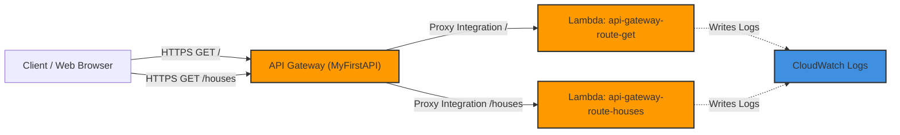

# Project: Serverless REST API with Lambda and API Gateway

**Breadcrumbs:** [[Main Notes/0-Index|🏠 Index]] > Projects > **Serverless REST API with Lambda and API Gateway**

---

## 🎯 Project Overview
This project demonstrates bootstrapping a fully serverless, highly scalable REST API on AWS. It builds:
1. **AWS Lambda backend functions:** Written in Python, implementing CORS-compliant headers and logging events to CloudWatch.
2. **API Gateway REST endpoints:** Exposing paths `/` and `/houses` with GET methods mapped to different Lambda functions via Lambda Proxy integration.
3. **Throttling Verification:** Testing concurrency behaviors by configuring reserved concurrency limits.

---

## 🏛️ Target Architecture

### Serverless API Topology


---

## 🛠️ Step-by-Step Implementation & Configuration

### 1. Lambda Functions Implementation

#### A. Root Handler Code (`api-gateway-route-get/lambda_function.py`)
Parses the incoming EventBridge/API Gateway payload, prints the event structure, and returns a JSON body.
```python
import json

def lambda_handler(event, context):
    # Print the incoming event JSON payload for debugging in CloudWatch
    print("Received event: " + json.dumps(event, indent=2))
    
    return {
        'statusCode': 200,
        'headers': {
            'Content-Type': 'application/json',
            'Access-Control-Allow-Origin': '*'  # Enable CORS
        },
        'body': json.dumps({
            'message': 'hello from Lambda'
        })
    }
```

#### B. Houses Handler Code (`api-gateway-route-houses/lambda_function.py`)
```python
import json

def lambda_handler(event, context):
    print("Received event: " + json.dumps(event, indent=2))
    
    return {
        'statusCode': 200,
        'headers': {
            'Content-Type': 'application/json',
            'Access-Control-Allow-Origin': '*'
        },
        'body': json.dumps({
            'message': 'hello from my pretty house'
        })
    }
```

---

### 2. Deploying Infrastructure via AWS CLI

#### A. Setup IAM Execution Role (`lambda-trust-policy.json`)
Create a trust policy allowing the Lambda service to execute and assume the role:
```json
{
  "Version": "2012-10-17",
  "Statement": [
    {
      "Effect": "Allow",
      "Principal": {
        "Service": "lambda.amazonaws.com"
      },
      "Action": "sts:AssumeRole"
    }
  ]
}
```
Create the IAM Role and attach the basic execution policy to write logs to CloudWatch:
```bash
aws iam create-role --role-name LambdaExecutionRole --assume-role-policy-document file://lambda-trust-policy.json
aws iam attach-role-policy --role-name LambdaExecutionRole --policy-arn arn:aws:iam::aws:policy/service-role/AWSLambdaBasicExecutionRole
```

#### B. Create Lambda Functions
Zip the python code files and create the functions:
```bash
# Package functions
zip -j get-route.zip api-gateway-route-get/lambda_function.py
zip -j houses-route.zip api-gateway-route-houses/lambda_function.py

# Create root route function
aws lambda create-function \
    --function-name api-gateway-route-get \
    --runtime python3.11 \
    --role arn:aws:iam::123456789012:role/LambdaExecutionRole \
    --handler lambda_function.lambda_handler \
    --zip-file fileb://get-route.zip

# Create houses route function
aws lambda create-function \
    --function-name api-gateway-route-houses \
    --runtime python3.11 \
    --role arn:aws:iam::123456789012:role/LambdaExecutionRole \
    --handler lambda_function.lambda_handler \
    --zip-file fileb://houses-route.zip
```

#### C. Provision REST API via API Gateway
1. Create the API REST entity:
```bash
aws apigateway create-rest-api --name MyFirstAPI --endpoint-configuration types=REGIONAL
# Note the returned API ID (e.g. a1b2c3d4e5)
```
2. Retrieve the root path `/` resource ID:
```bash
aws apigateway get-resources --rest-api-id a1b2c3d4e5
# Note the root Resource ID (e.g. root-resource-id)
```
3. Create the GET method for `/` route and link it via Proxy integration:
```bash
# Define method
aws apigateway put-method \
    --rest-api-id a1b2c3d4e5 \
    --resource-id root-resource-id \
    --http-method GET \
    --authorization-type NONE

# Integrate GET with Lambda via proxy integration
aws apigateway put-integration \
    --rest-api-id a1b2c3d4e5 \
    --resource-id root-resource-id \
    --http-method GET \
    --type AWS_PROXY \
    --integration-http-method POST \
    --uri arn:aws:apigateway:us-east-1:lambda:path/2015-03-31/functions/arn:aws:lambda:us-east-1:123456789012:function:api-gateway-route-get/invocations
```
4. Create the `/houses` resource, method, and Lambda integration:
```bash
# Create resource
aws apigateway create-resource \
    --rest-api-id a1b2c3d4e5 \
    --parent-id root-resource-id \
    --path-part houses
# Note the returned Resource ID (e.g. houses-resource-id)

# Create method
aws apigateway put-method \
    --rest-api-id a1b2c3d4e5 \
    --resource-id houses-resource-id \
    --http-method GET \
    --authorization-type NONE

# Integrate with houses Lambda
aws apigateway put-integration \
    --rest-api-id a1b2c3d4e5 \
    --resource-id houses-resource-id \
    --http-method GET \
    --type AWS_PROXY \
    --integration-http-method POST \
    --uri arn:aws:apigateway:us-east-1:lambda:path/2015-03-31/functions/arn:aws:lambda:us-east-1:123456789012:function:api-gateway-route-houses/invocations
```
5. Grant API Gateway permission to invoke the Lambda functions:
```bash
# Grant permission for GET /
aws lambda add-permission \
    --function-name api-gateway-route-get \
    --statement-id apigateway-get \
    --action lambda:InvokeFunction \
    --principal apigateway.amazonaws.com \
    --source-arn "arn:aws:execute-api:us-east-1:123456789012:a1b2c3d4e5/*/GET/"

# Grant permission for GET /houses
aws lambda add-permission \
    --function-name api-gateway-route-houses \
    --statement-id apigateway-get-houses \
    --action lambda:InvokeFunction \
    --principal apigateway.amazonaws.com \
    --source-arn "arn:aws:execute-api:us-east-1:123456789012:a1b2c3d4e5/*/GET/houses"
```
6. Deploy the API to a Dev stage:
```bash
aws apigateway create-deployment --rest-api-id a1b2c3d4e5 --stage-name dev
```

---

## 🔍 Verification & Diagnostics

### 1. Test the REST Endpoints
Query the API Gateway stage endpoints directly via web browser or command-line client:
```bash
# Query root path
curl https://a1b2c3d4e5.execute-api.us-east-1.amazonaws.com/dev/
# Expected: {"message": "hello from Lambda"}

# Query houses path
curl https://a1b2c3d4e5.execute-api.us-east-1.amazonaws.com/dev/houses
# Expected: {"message": "hello from my pretty house"}
```

### 2. Verify Throttling Rules
1. Set the reserved concurrency of the root function to `0` (which effectively disables it and forces throttling):
```bash
aws lambda put-function-concurrency \
    --function-name api-gateway-route-get \
    --reserved-concurrent-executions 0
```
2. Trigger the endpoint to verify the `429 Too Many Requests` status return code:
```bash
curl -i https://a1b2c3d4e5.execute-api.us-east-1.amazonaws.com/dev/
# Expected: HTTP/1.1 429 Too Many Requests (Rate Exceeded)
```
3. Restore the concurrency to enable normal operations:
```bash
aws lambda delete-function-concurrency --function-name api-gateway-route-get
```

---

## 💡 Key Architectural Takeaways
*   **Design Trade-off (Proxy Integration):** Utilizing **Lambda Proxy Integration** passes the entire raw request object (headers, query strings, context) directly to the Lambda function, deferring all routing and request translation logic to the application code. This reduces API Gateway configurations but increases container coupling to the specific JSON event schema.
*   **Security Control (Resource-Based Permissions):** API Gateway relies on resource-based trust statements inside the target Lambda functions to execute. Without explicit `lambda:InvokeFunction` permissions scoped to the API Gateway ARN and methods, the API Gateway returns `500 Internal Server Error`.
*   **Throttling Isolation:** Setting **Reserved Concurrency** on critical functions protects them from being starved of executions by other high-traffic functions in the same region. Concurrency is pool-based at the regional account level.
