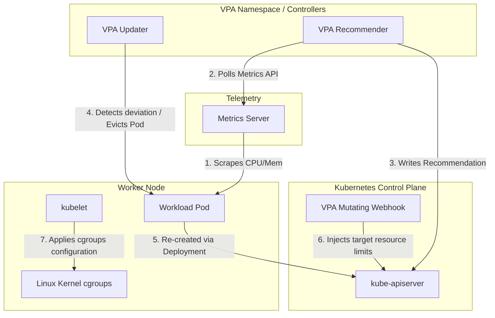

# Project: Vertical Pod Autoscaler & In-Place Resizing Playbook

**Breadcrumbs:** [[Main Notes/0-Index|🏠 Index]] > Projects > **Vertical Pod Autoscaler & In-Place Resizing Playbook**

---

## 🎯 Project Overview
This project guides you through installing the **Vertical Pod Autoscaler (VPA)**, deploying a CPU-intensive workload to verify VPA auto-scaling behavior (evict-and-recreate lifecycle), and practicing **Manual In-Place Pod Vertical Scaling** without container restarts using the `InPlacePodVerticalScaling` feature gate configuration.

---

## 🏛️ Target Architecture



---

## 🛠️ Step-by-Step Implementation & Configuration

### 1. Setting Up VPA Controllers in the Cluster

#### The Answer:
Clone the official Kubernetes autoscaler repository and run the installation script:
```bash
# 1. Clone the autoscaler repository
git clone https://github.com/kubernetes/autoscaler.git

# 2. Navigate to the vertical-pod-autoscaler directory
cd autoscaler/vertical-pod-autoscaler/

# 3. Execute the setup script to install CRDs and deploy components
./hack/vpa-up.sh

# 4. Verify that VPA pods are running in the kube-system namespace
kubectl get pods -n kube-system | grep vpa
```

*Expected Output:*
```text
vpa-admission-controller-7546bd595b-abcde   1/1     Running   0          1m
vpa-recommender-689dbb858f-abcde            1/1     Running   0          1m
vpa-updater-56bfcf57fc-abcde                1/1     Running   0          1m
```

#### The Assumptions:
*   A running Kubernetes cluster (v1.25+) with **Metrics Server** installed and operational (`kubectl top nodes` returns metric values).
*   `openssl` v1.1.1+ is installed locally on the client host running the script (needed by `vpa-up.sh` to generate self-signed TLS certificates for the Mutating Admission Webhook).

#### The Rationale (Why):
VPA is not compiled into the default `kube-controller-manager` binary. It runs as three decoupled processes. The recommender calculates targets, the updater terminates lagging pods, and the admission controller operates as a webhook to inject new limits before Scheduling decision-making.

#### The Failure Loop (What if not):
*   **No Metrics Server:** Recommender logs `Metrics API not available` and VPA target recommendations remain empty.
*   **Missing Openssl:** Webhook certificate generation fails during `vpa-up.sh`, preventing the admission webhook from authenticating with the API server. New pod creations might freeze if webhook failure policy is set to block.

---

### 2. Deploying a CPU-Intense Workload and VPA in Auto Mode

#### The Answer:
Apply a hamster deployment that constantly calculates md5sums, and a VPA resource tracking it.

##### A. Hamster Deployment Manifest (`hamster-deployment.yaml`)
```yaml
apiVersion: apps/v1
kind: Deployment
metadata:
  name: hamster
  namespace: default
spec:
  replicas: 2
  selector:
    matchLabels:
      app: hamster
  template:
    metadata:
      labels:
        app: hamster
    spec:
      containers:
      - name: hamster
        image: registry.k8s.io/ubuntu-slim:0.14
        command: ["/bin/sh", "-c", "while true; do md5sum /dev/urandom; sleep 0.1; done"]
        resources:
          requests:
            cpu: 100m
            memory: 50Mi
```

##### B. Hamster VPA Manifest (`hamster-vpa.yaml`)
```yaml
apiVersion: autoscaling.k8s.io/v1
kind: VerticalPodAutoscaler
metadata:
  name: hamster-vpa
  namespace: default
spec:
  targetRef:
    apiVersion: apps/v1
    kind: Deployment
    name: hamster
  updatePolicy:
    updateMode: Auto
  resourcePolicy:
    containerPolicies:
      - containerName: 'hamster'
        minAllowed:
          cpu: 100m
          memory: 50Mi
        maxAllowed:
          cpu: 1
          memory: 500Mi
        controlledResources: ["cpu", "memory"]
```

Apply both manifests:
```bash
kubectl apply -f hamster-deployment.yaml
kubectl apply -f hamster-vpa.yaml
```

#### The Rationale (Why):
`updateMode: Auto` grants the updater permission to evict pods whose actual usage differs from their declared requests. When the Deployment controller replaces the evicted pod, the VPA admission controller mutates the incoming spec using recommendations.

#### The Failure Loop (What if not):
If a Pod Disruption Budget (PDB) is configured with `maxUnavailable: 0` or there is only 1 replica, the Updater will fail to evict the pod to protect application availability, stalling the VPA vertical scaling process.

---

### 3. Manual In-Place Pod Resizing Playbook

#### The Answer:
Define a pod with explicit `resizePolicy` controls and patch its resources imperatively.

##### A. In-Place Resizing Pod Manifest (`inplace-pod.yaml`)
```yaml
apiVersion: v1
kind: Pod
metadata:
  name: inplace-pod
  namespace: default
spec:
  containers:
  - name: app
    image: nginx:alpine
    resources:
      limits:
        cpu: "500m"
        memory: "256Mi"
      requests:
        cpu: "250m"
        memory: "128Mi"
    resizePolicy:
    - resourceName: cpu
      restartPolicy: RestartNotRequired
    - resourceName: memory
      restartPolicy: RestartNotRequired
```
Apply the Pod:
```bash
kubectl apply -f inplace-pod.yaml
```

##### B. Dynamic Patch Modification
Resize requests and limits in-place using `kubectl patch`:
```bash
kubectl patch pod inplace-pod --patch '{"spec":{"containers":[{"name":"app","resources":{"requests":{"cpu":"400m","memory":"192Mi"},"limits":{"cpu":"800m","memory":"384Mi"}}}]}}'
```

#### The Assumptions:
*   The Kubernetes control plane and worker nodes must run:
    *   v1.35+ for Container-level resizing (Stable, enabled by default).
    *   v1.36+ for Pod-level resizing (Beta, enabled by default).
    *   Older versions (v1.27 to v1.34) require the `InPlacePodVerticalScaling` feature gate explicitly enabled.
*   Workload is running on Linux hosts (Windows OS containers do not support dynamic cgroups updates).

#### The Rationale (Why):
By setting `restartPolicy: RestartNotRequired` for CPU and Memory, kubelet writes values directly into Linux kernel cgroups control paths (`cpu.shares`, `memory.limit_in_bytes`) inside `/sys/fs/cgroup/` without triggering a CRI container restart.

#### The Failure Loop (What if not):
If you reduce the memory limit below the container's active resident set size (RSS), the resizing process blocks. Kubelet leaves the status as `Proposed` and the resize action remains `InProgress` indefinitely until the process frees memory or limits are increased again.

---

## 🔍 Verification & Diagnostics

### 1. Verifying VPA Scaling recommendations
Wait 2 minutes and check the status of VPA recommendations:
```bash
kubectl describe vpa hamster-vpa
```

*Expected status block:*
```text
  Recommendation:
    Container Recommendations:
      Container Name:  hamster
      Lower Bound:
        Cpu:     450m
        Memory:  26214400
      Target:
        Cpu:     587m
        Memory:  26214400
      Upper Bound:
        Cpu:     950m
        Memory:  26214400
```
Verify that the updater evicted the hamster pods:
```bash
kubectl get pods -w
```
Expected output shows the hamster pods terminating and starting with the mutated CPU target (e.g. `587m`).

---

### 2. Verifying In-Place Resizing Status
Query the container statuses to verify the allocation states:
```bash
# Query the resources allocated by kubelet
kubectl get pod inplace-pod -o jsonpath='{.status.containerStatuses[0].resourcesAllocated}'
# Expected: {"cpu":"400m","memory":"192Mi"}

# Query the actual active resources enforced by the container runtime
kubectl get pod inplace-pod -o jsonpath='{.status.containerStatuses[0].resources}'
# Expected: {"limits":{"cpu":"800m","memory":"384Mi"},"requests":{"cpu":"400m","memory":"192Mi"}}
```

---

## 💡 Key Architectural Takeaways

*   **Eviction vs. Dynamic Scaling Trade-off:**
    Standard VPA setup requires Pod recreation, which causes restarts. Dynamic resizing with `InPlacePodVerticalScaling` makes scaling zero-downtime, but it is limited by host cgroups limits and OS constraints.
*   **Resource Floors and Safety Nets:**
    In-place memory scaling down can trigger instant `OOMKilled` termination if the target limit is set lower than what the container process actually consumes. Careful monitoring of memory usage is mandatory prior to down-sizing.
