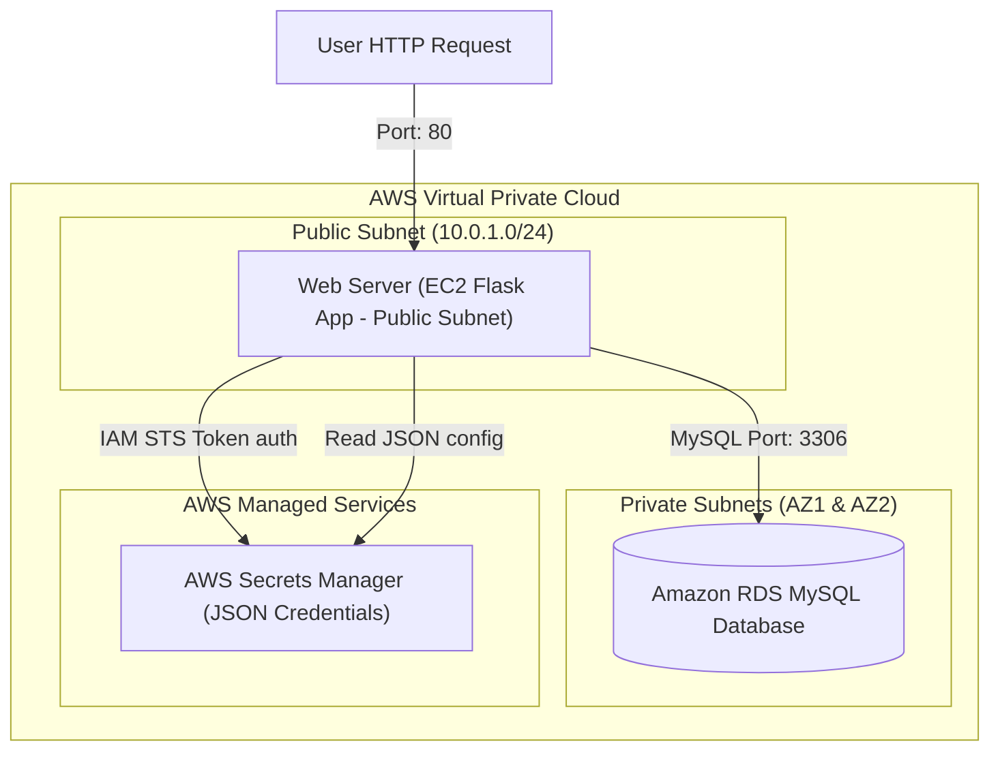

# Project: 2-Tier Architecture Setup with RDS and Secret Manager

**Breadcrumbs:** [[Main Notes/0-Index|🏠 Index]] > Projects > **2-Tier Architecture Setup with RDS and Secret Manager**

---

## 🎯 Project Overview

This project implements a secure, modular **2-Tier Web Application Architecture** on AWS using Terraform. It provisions an EC2 instance hosting a Python Flask application in a public subnet, and an Amazon RDS MySQL instance deployed across private subnets. 

To eliminate hardcoded database credentials, the playbook generates a secure database password dynamically and stores it inside **AWS Secrets Manager**. The EC2 Flask application retrieves the database configuration at runtime using an IAM Instance Profile role, ensuring data-at-rest credentials governance.

### Learning Objectives:
*   Structure modular infrastructure configurations with input/output contracts.
*   Enforce security group chaining: Database ingress limited strictly to Web Server ports.
*   Generate dynamic database credentials using Terraform random generators.
*   Secure database configuration records using AWS Secrets Manager.
*   Authorize resource access policies via IAM Instance Profile roles.

---

## 🏛️ Target Architecture



---

## 🛠️ Step-by-Step Implementation & Configuration

This project is organized into child modules to enforce clean API boundaries:
*   `modules/secret/`: Generates passwords and registers Secrets Manager payloads.
*   `modules/vpc/`: Builds subnets and routes.
*   `modules/security_group/`: Configures firewall mappings.
*   `modules/database/`: Boots the RDS MySQL instance.
*   `modules/web/`: Sets up the EC2 Flask server and its IAM role policies.

### 1. Dynamic Credentials Module (`modules/secret/main.tf`)
Generates a random password and stores credentials in a Secrets Manager JSON structure.
```hcl
resource "random_password" "db_password" {
  length           = 16
  special          = true
  override_special = "!#$%&*()-_=+[]{}<>:?"
}

resource "random_id" "secret_suffix" {
  byte_length = 4
}

resource "aws_secretsmanager_secret" "db_secret" {
  name        = "${var.project_name}-${var.environment}-db-secret-${random_id.secret_suffix.hex}"
  description = "Database credentials for the 2-tier Flask application"
  tags        = { Environment = var.environment }
}

resource "aws_secretsmanager_secret_version" "db_secret_val" {
  secret_id = aws_secretsmanager_secret.db_secret.id
  secret_string = jsonencode({
    username = var.db_username
    password = random_password.db_password.result
    engine   = "mysql"
    port     = 3306
  })
}

output "secret_arn" {
  value = aws_secretsmanager_secret.db_secret.arn
}

output "db_password" {
  value     = random_password.db_password.result
  sensitive = true
}
```

### 2. Networking Layer (`modules/vpc/main.tf`)
Provisions a public subnet for the web tier and two private subnets across different Availability Zones to fulfill RDS subnet group requirements.
```hcl
resource "aws_vpc" "main" {
  cidr_block           = "10.0.0.0/16"
  enable_dns_hostnames = true
  tags                 = { Name = "${var.project_name}-vpc" }
}

resource "aws_subnet" "public" {
  vpc_id                  = aws_vpc.main.id
  cidr_block              = "10.0.1.0/24"
  availability_zone       = var.az_list[0]
  map_public_ip_on_launch = true
  tags                    = { Name = "${var.project_name}-public-subnet" }
}

resource "aws_subnet" "private_1" {
  vpc_id            = aws_vpc.main.id
  cidr_block        = "10.0.10.0/24"
  availability_zone = var.az_list[0]
  tags              = { Name = "${var.project_name}-private-subnet-1" }
}

resource "aws_subnet" "private_2" {
  vpc_id            = aws_vpc.main.id
  cidr_block        = "10.0.11.0/24"
  availability_zone = var.az_list[1]
  tags              = { Name = "${var.project_name}-private-subnet-2" }
}

resource "aws_internet_gateway" "gw" {
  vpc_id = aws_vpc.main.id
}

resource "aws_route_table" "public_rt" {
  vpc_id = aws_vpc.main.id
  route {
    cidr_block = "0.0.0.0/0"
    gateway_id = aws_internet_gateway.gw.id
  }
}

resource "aws_route_table_association" "pub_assoc" {
  subnet_id      = aws_subnet.public.id
  route_table_id = aws_route_table.public_rt.id
}
```

### 3. Security Group Layer (`modules/security_group/main.tf`)
Establishes firewall mappings restricting database port access to web server traffic origins.
```hcl
resource "aws_security_group" "web_sg" {
  name        = "${var.project_name}-web-sg"
  vpc_id      = var.vpc_id
  description = "Allows incoming HTTP traffic"

  ingress {
    from_port   = 80
    to_port     = 80
    protocol    = "tcp"
    cidr_blocks = ["0.0.0.0/0"]
  }

  ingress {
    from_port   = 22
    to_port     = 22
    protocol    = "tcp"
    cidr_blocks = ["0.0.0.0/0"] # Update to your IP in production
  }

  egress {
    from_port   = 0
    to_port     = 0
    protocol    = "-1"
    cidr_blocks = ["0.0.0.0/0"]
  }
}

resource "aws_security_group" "db_sg" {
  name        = "${var.project_name}-db-sg"
  vpc_id      = var.vpc_id
  description = "Allows database traffic from web tier only"

  ingress {
    from_port       = 3306
    to_port         = 3306
    protocol        = "tcp"
    security_groups = [aws_security_group.web_sg.id]
  }

  egress {
    from_port   = 0
    to_port     = 0
    protocol    = "-1"
    cidr_blocks = ["0.0.0.0/0"]
  }
}
```

### 4. Database Layer (`modules/database/main.tf`)
Deploys the MySQL database instance into the private subnets.
```hcl
resource "aws_db_subnet_group" "db_subnets" {
  name       = "${var.project_name}-db-subnet-group"
  subnet_ids = [var.private_subnet_1_id, var.private_subnet_2_id]
}

resource "aws_db_instance" "mysql" {
  allocated_storage      = 20
  engine                 = "mysql"
  engine_version         = "8.0"
  instance_class         = "db.t3.micro"
  db_name                = var.db_name
  username               = var.db_username
  password               = var.db_password
  db_subnet_group_name   = aws_db_subnet_group.db_subnets.name
  vpc_security_group_ids = [var.db_security_group_id]
  skip_final_snapshot    = true
}

output "db_endpoint" {
  value = aws_db_instance.mysql.endpoint
}
```

### 5. Compute & IAM Integration (`modules/web/main.tf`)
Deploys the EC2 instance, sets up an IAM role policy to permit reading credentials from Secrets Manager, and injects a script to fetch the secret and bootstrap the Flask application.
```hcl
# IAM Role for Web EC2
resource "aws_iam_role" "web_role" {
  name = "${var.project_name}-web-role"

  assume_role_policy = jsonencode({
    Version = "2012-10-17"
    Statement = [{
      Action    = "sts:AssumeRole"
      Effect    = "Allow"
      Principal = { Service = "ec2.amazonaws.com" }
    }]
  })
}

# Attach policy to read Secrets Manager payload
resource "aws_iam_policy" "sm_policy" {
  name        = "${var.project_name}-sm-policy"
  description = "Allows reading the database secret"
  policy = jsonencode({
    Version = "2012-10-17"
    Statement = [{
      Action   = ["secretsmanager:GetSecretValue"]
      Effect   = "Allow"
      Resource = var.secret_arn
    }]
  })
}

resource "aws_iam_role_policy_attachment" "role_attach" {
  role       = aws_iam_role.web_role.name
  policy_arn = aws_iam_policy.sm_policy.arn
}

resource "aws_iam_instance_profile" "web_profile" {
  name = "${var.project_name}-instance-profile"
  role = aws_iam_role.web_role.name
}

# Web Server EC2
resource "aws_instance" "web" {
  ami                  = var.ami_id
  instance_type        = "t3.micro"
  subnet_id            = var.public_subnet_id
  security_groups      = [var.web_security_group_id]
  iam_instance_profile = aws_iam_instance_profile.web_profile.name

  # Userdata scripts configuration
  user_data = <<-EOF
              #!/bin/bash
              apt-get update -y
              apt-get install -y python3-pip python3-dev libmysqlclient-dev
              pip3 install flask mysqlclient boto3

              # Fetch database config from Secrets Manager
              cat <<'INNER_EOF' > /home/ubuntu/app.py
              import flask
              import boto3
              import json
              import MySQLdb

              app = flask.Flask(__name__)

              def get_db_credentials():
                  client = boto3.client('secretsmanager', region_name='${var.aws_region}')
                  response = client.get_secret_value(SecretId='${var.secret_arn}')
                  return json.loads(response['SecretString'])

              @app.route('/')
              def index():
                  try:
                      creds = get_db_credentials()
                      db = MySQLdb.connect(
                          host="${var.db_host}",
                          user=creds['username'],
                          passwd=creds['password'],
                          db="${var.db_name}"
                      )
                      cursor = db.cursor()
                      cursor.execute("SELECT VERSION()")
                      version = cursor.fetchone()
                      return f"<h1>Connected! MySQL Database Version: {version[0]}</h1>"
                  except Exception as e:
                      return f"<h1>Database Connection Failed: {str(e)}</h1>"

              if __name__ == '__main__':
                  app.run(host='0.0.0.0', port=80)
              INNER_EOF

              python3 /home/ubuntu/app.py &
              EOF

  tags = { Name = "${var.project_name}-web-server" }
}
```

---

## 🔬 Verification & Testing
1.  **Initialize Workspaces:**
    ```bash
    terraform init
    ```
2.  **Verify Execution Plans:**
    ```bash
    terraform plan
    ```
3.  **Provision Resources:**
    ```bash
    terraform apply -auto-approve
    ```
4.  **Validate Web Endpoint Connection:**
    Query the public IP address of the newly provisioned EC2 instance:
    ```bash
    curl http://[ec2-public-ip-address]
    ```
    *Expected Output:*
    `<h1>Connected! MySQL Database Version: 8.0.XX</h1>`
