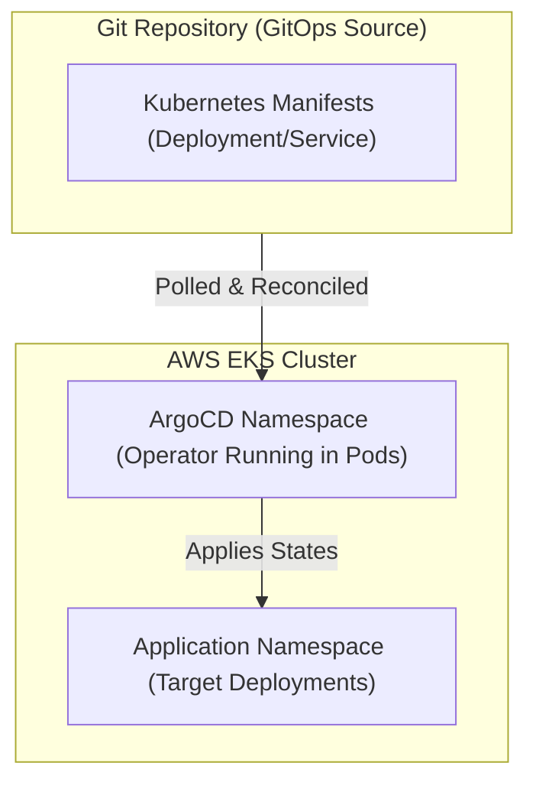

# Project: EKS GitOps and ArgoCD

**Breadcrumbs:** [[Main Notes/0-Index|🏠 Index]] > Projects > **EKS GitOps and ArgoCD**

---

## 🎯 Project Overview

This project implements a complete GitOps deployment pipeline on AWS EKS using Terraform. It provisions an EKS cluster, managed Node Groups, configuration hooks, and bootstraps the ArgoCD deployment engine inside the cluster using Terraform's Helm Provider, linking it to a target application deployment repository.

### Learning Objectives:
*   Configure the Terraform Helm and Kubernetes providers bound to EKS states.
*   Deploy ArgoCD declaratively via Helm charts.
*   Establish GitOps application synchronization schemas.
*   Secure EKS endpoints using private networking configurations.

---

## 🏛️ Target Architecture



---

## 🛠️ Step-by-Step Implementation & Configuration

### 1. EKS Infrastructure Provisioning (`eks.tf`)
Configure the EKS cluster and managed node groups:
```hcl
# EKS Cluster definition
resource "aws_eks_cluster" "eks" {
  name     = "gitops-eks-cluster"
  role_arn = aws_iam_role.eks_master_role.arn

  vpc_config {
    subnet_ids              = var.private_subnet_ids
    endpoint_private_access = true
    endpoint_public_access  = true # Set false for hardened private-only
  }
}

# Managed Node Group definition
resource "aws_eks_node_group" "nodes" {
  cluster_name    = aws_eks_cluster.eks.name
  node_group_name = "managed-node-group"
  node_role_arn   = aws_iam_role.eks_node_role.arn
  subnet_ids      = var.private_subnet_ids

  scaling_config {
    desired_size = 2
    max_size     = 3
    min_size     = 1
  }

  instance_types = ["t3.medium"] # Minimum size for EKS worker nodes

  update_config {
    max_unavailable = 1
  }
}
```

### 2. Helm and Kubernetes Provider Bindings (`providers.tf`)
Configure the Helm and Kubernetes providers to use dynamic tokens generated by EKS at runtime, preventing expired certificate connection crashes:
```hcl
# Retrieve authentication credentials from active EKS cluster
data "aws_eks_cluster_auth" "cluster" {
  name = aws_eks_cluster.eks.name
}

provider "kubernetes" {
  host                   = aws_eks_cluster.eks.endpoint
  cluster_ca_certificate = base64decode(aws_eks_cluster.eks.certificate_authority[0].data)
  token                  = data.aws_eks_cluster_auth.cluster.token
}

provider "helm" {
  kubernetes {
    host                   = aws_eks_cluster.eks.endpoint
    cluster_ca_certificate = base64decode(aws_eks_cluster.eks.certificate_authority[0].data)
    token                  = data.aws_eks_cluster_auth.cluster.token
  }
}
```

### 3. ArgoCD Bootstrap (`argocd.tf`)
Deploy the ArgoCD Helm chart and configure the declarative Application sync spec:
```hcl
# Create argo namespace
resource "kubernetes_namespace" "argocd" {
  metadata { name = "argocd" }
}

# Deploy ArgoCD via Helm Provider
resource "helm_release" "argocd" {
  name       = "argocd"
  repository = "https://argoproj.github.io/argo-helm"
  chart      = "argo-cd"
  version    = "5.46.7"
  namespace  = kubernetes_namespace.argocd.metadata[0].name

  set {
    name  = "server.service.type"
    value = "ClusterIP"
  }
}

# Declarative ArgoCD Application Specification (Manifest synchronization)
resource "kubernetes_manifest" "gitops_app" {
  manifest = {
    apiVersion = "argoproj.io/v1alpha1"
    kind       = "Application"
    metadata = {
      name      = "production-web-app"
      namespace = "argocd"
    }
    spec = {
      project = "default"
      source = {
        repoURL        = "https://github.com/my-org/gitops-manifests.git"
        targetRevision = "HEAD"
        path           = "deployments"
      }
      destination = {
        server    = "https://kubernetes.default.svc"
        namespace = "web-apps"
      }
      syncPolicy = {
        automated = {
          prune    = true # Auto-delete orphaned resources
          selfHeal = true # Overwrite manual cluster changes
        }
      }
    }
  }

  depends_on = [helm_release.argocd]
}
```

---

## 🔍 Verification & Diagnostics

Verify ArgoCD deployment and GitOps synchronization:

1.  **Extract the ArgoCD Admin password:**
    Retrieve the decrypted autogenerated password secret from the cluster:
    ```bash
    kubectl -n argocd get secret argocd-initial-admin-secret -o jsonpath="{.data.password}" | base64 -d
    ```
2.  **Verify GitOps Sync status:**
    Check that ArgoCD has mapped the Git repository and synced all resources:
    ```bash
    kubectl -n argocd get application production-web-app -o yaml
    ```
    Confirm that the status returns `Synced` and the health status is `Healthy`.
3.  **Test Self-Healing (Remediation):**
    Manually delete an application deployment pod inside the cluster:
    ```bash
    kubectl -n web-apps delete deployment web-deployment
    ```
    Observe the pods immediately. ArgoCD must detect the change within seconds and recreate the deployment resources to match the Git state, proving that manual configurations are overridden by GitOps.

---

## 💡 Key Architectural Takeaways

- **Design Trade-off (Dynamic Tokens vs Static Kubeconfigs):** Binding the Kubernetes provider configuration to dynamic `data.aws_eks_cluster_auth.cluster.token` values ensures that Terraform fetches a fresh 15-minute token during plan execution. This prevents plan failures caused by expired static credentials stored on developer host machines.
- **Security Control (GitOps Isolation):** ArgoCD uses pull-based synchronization. EKS does not require inbound internet routes to pull updates from GitHub. The ArgoCD agent inside the cluster initiates outbound HTTPS requests to query Git repositories, keeping cluster API endpoints hidden.
