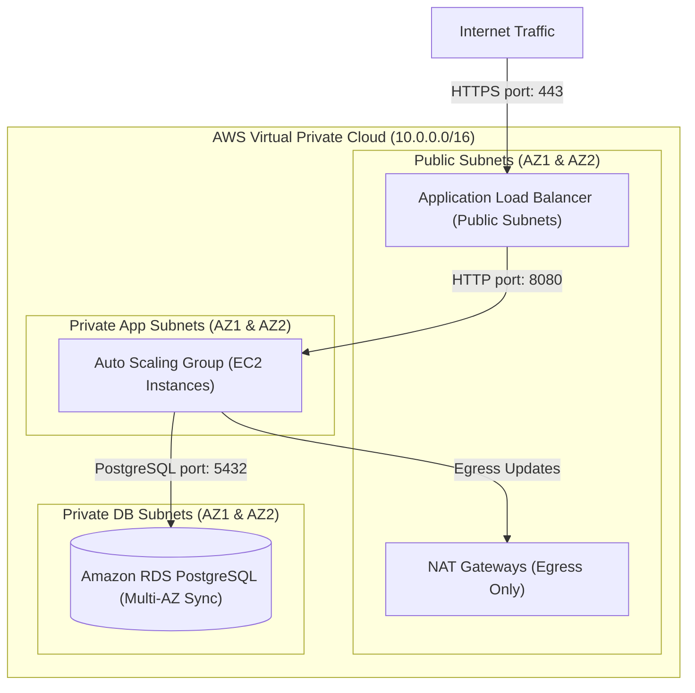

# Project: HA 3-Tier Architecture on AWS

**Breadcrumbs:** [[Main Notes/0-Index|🏠 Index]] > Projects > **HA 3-Tier Architecture on AWS**

---

## 🎯 Project Overview

This project implements a highly available, secure 3-tier web application architecture on AWS using Terraform. It provisions a custom VPC spanning two Availability Zones, public Application Load Balancers (ALBs), private Application subnets running EC2 Auto Scaling Groups (ASGs), and isolated private Database subnets hosting a Multi-AZ Amazon RDS PostgreSQL instance.

### Learning Objectives:
*   Deconstruct network boundaries using public, private, and database subnets.
*   Configure secure traffic pathing using Security Group chaining.
*   Establish Auto Scaling policy rules mapped to CPU utilization.
*   Deploy Multi-AZ relational databases with automatic failover support.

---

## 🏛️ Target Architecture



---

## 🛠️ Step-by-Step Implementation & Configuration

### 1. Network Layer (`network.tf`)
Configure the VPC, Subnets, Internet Gateway, and NAT Gateway:
```hcl
# Create VPC
resource "aws_vpc" "main" {
  cidr_block           = "10.0.0.0/16"
  enable_dns_hostnames = true
  enable_dns_support   = true
  tags                 = { Name = "production-vpc" }
}

# Subnets layout
variable "az_list" {
  type    = list(string)
  default = ["us-east-1a", "us-east-1b"]
}

# Public Subnets (For ALBs and NATs)
resource "aws_subnet" "public" {
  count                   = 2
  vpc_id                  = aws_vpc.main.id
  cidr_block              = "10.0.${count.index}.0/24"
  availability_zone       = var.az_list[count.index]
  map_public_ip_on_launch = true
  tags                    = { Name = "public-subnet-${count.index}" }
}

# Private Application Subnets (For EC2 Compute)
resource "aws_subnet" "private_app" {
  count             = 2
  vpc_id            = aws_vpc.main.id
  cidr_block        = "10.0.${count.index + 10}.0/24"
  availability_zone = var.az_list[count.index]
  tags              = { Name = "private-app-subnet-${count.index}" }
}

# Private Database Subnets (For RDS)
resource "aws_subnet" "private_db" {
  count             = 2
  vpc_id            = aws_vpc.main.id
  cidr_block        = "10.0.${count.index + 20}.0/24"
  availability_zone = var.az_list[count.index]
  tags              = { Name = "private-db-subnet-${count.index}" }
}

# Internet Gateway
resource "aws_internet_gateway" "gw" {
  vpc_id = aws_vpc.main.id
  tags   = { Name = "vpc-igw" }
}

# Elastic IPs for NAT
resource "aws_eip" "nat" {
  count      = 2
  domain     = "vpc"
  depends_on = [aws_internet_gateway.gw]
}

# NAT Gateways in Public Subnets
resource "aws_nat_gateway" "nat" {
  count         = 2
  allocation_id = aws_eip.nat[count.index].id
  subnet_id     = aws_subnet.public[count.index].id
  tags          = { Name = "nat-gw-${count.index}" }
}
```

### 2. Compute Layer and Auto Scaling (`compute.tf`)
Define Launch Templates and Auto Scaling Group profiles:
```hcl
# Security Group for Load Balancer
resource "aws_security_group" "alb_sg" {
  name        = "alb-security-group"
  vpc_id      = aws_vpc.main.id

  ingress {
    from_port   = 80
    to_port     = 80
    protocol    = "tcp"
    cidr_blocks = ["0.0.0.0/0"]
  }

  egress {
    from_port   = 0
    to_port     = 0
    protocol    = "-1"
    cidr_blocks = ["0.0.0.0/0"]
  }
}

# Security Group for EC2 instances (Traffic must originate from ALB)
resource "aws_security_group" "app_sg" {
  name        = "app-security-group"
  vpc_id      = aws_vpc.main.id

  ingress {
    from_port       = 8080
    to_port         = 8080
    protocol        = "tcp"
    security_groups = [aws_security_group.alb_sg.id] # Security Group Chaining
  }

  egress {
    from_port   = 0
    to_port     = 0
    protocol    = "-1"
    cidr_blocks = ["0.0.0.0/0"]
  }
}

# Launch Template for EC2 instances
resource "aws_launch_template" "app_template" {
  name_prefix   = "app-template-"
  image_id      = "ami-0c7217cdde317cfec" # Ubuntu Jammy 22.04 in us-east-1
  instance_type = "t3.micro"

  network_interfaces {
    associate_public_ip_address = false
    security_groups             = [aws_security_group.app_sg.id]
  }

  user_data = base64encode(<<-EOF
              #!/bin/bash
              echo "Hello World from 3-tier App" > index.html
              python3 -m http.server 8080 &
              EOF
  )

  lifecycle {
    create_before_destroy = true
  }
}

# Auto Scaling Group
resource "aws_autoscaling_group" "app_asg" {
  name_prefix         = "app-asg-"
  desired_capacity    = 2
  max_size            = 4
  min_size            = 2
  vpc_zone_identifier = aws_subnet.private_app[*].id

  launch_template {
    id      = aws_launch_template.app_template.id
    version = "$Latest"
  }

  target_group_arns = [aws_lb_target_group.app_tg.arn]

  tag {
    key                 = "Name"
    value               = "app-instance"
    propagate_at_launch = true
  }
}
```

### 3. Database Layer (`database.tf`)
Provision the Multi-AZ RDS Postgres Database:
```hcl
# Security Group for Database (Traffic must originate from private app tier)
resource "aws_security_group" "db_sg" {
  name        = "db-security-group"
  vpc_id      = aws_vpc.main.id

  ingress {
    from_port       = 5432
    to_port         = 5432
    protocol        = "tcp"
    security_groups = [aws_security_group.app_sg.id] # Chained to app SG
  }

  egress {
    from_port   = 0
    to_port     = 0
    protocol    = "-1"
    cidr_blocks = ["0.0.0.0/0"]
  }
}

# RDS Subnet Group
resource "aws_db_subnet_group" "db_group" {
  name       = "main-db-subnet-group"
  subnet_ids = aws_subnet.private_db[*].id
}

# RDS Multi-AZ Instance
resource "aws_db_instance" "postgres" {
  identifier             = "production-db"
  allocated_storage      = 20
  engine                 = "postgres"
  engine_version         = "15.4"
  instance_class         = "db.t3.micro"
  db_name                = "appdb"
  username               = "dbadmin"
  password               = var.db_password # Injected via variables
  db_subnet_group_name   = aws_db_subnet_group.db_group.name
  vpc_security_group_ids = [aws_security_group.db_sg.id]
  multi_az               = true # Enables Multi-AZ standby replica
  skip_final_snapshot    = true
}
```

---

## 🔍 Verification & Diagnostics

Verify application routing, autoscaling limits, and database failover:

1.  **Verify HTTP Web App access:**
    Execute curl against the Application Load Balancer DNS output to verify load balancing is active:
    ```bash
    curl http://${aws_lb.web_alb.dns_name}
    ```
2.  **Verify Security Group Chaining rules:**
    Attempt to spin up a debug instance in a public subnet and curl the database subnet IP directly on port 5432. The connection must fail (timeout), proving that only instances containing the `app-security-group` can query the database.
3.  **Validate RDS Multi-AZ Failover:**
    Trigger a manual reboot with failover via the AWS CLI to test standby recovery:
    ```bash
    aws rds reboot-db-instance --db-instance-identifier production-db --force-failover
    ```
    Verify that application connections resume automatically within under 60 seconds.

---

## 💡 Key Architectural Takeaways

- **Design Trade-off (Cost vs High Availability):** Setting `multi_az = true` on the RDS instance doubles the database run cost since a synchronous standby replica is constantly maintained in a separate AZ. However, this is mandatory for production to achieve a recovery time objective (RTO) of under a minute in the event of an AZ outage.
- **Security Control (Security Group Chaining):** Direct network ingress routes from the public load balancer to the database tier are blocked. Instead, port authorization is chained: `Public Client` $\rightarrow$ `ALB (port 80)` $\rightarrow$ `App (port 8080)` $\rightarrow$ `Database (port 5432)`.
