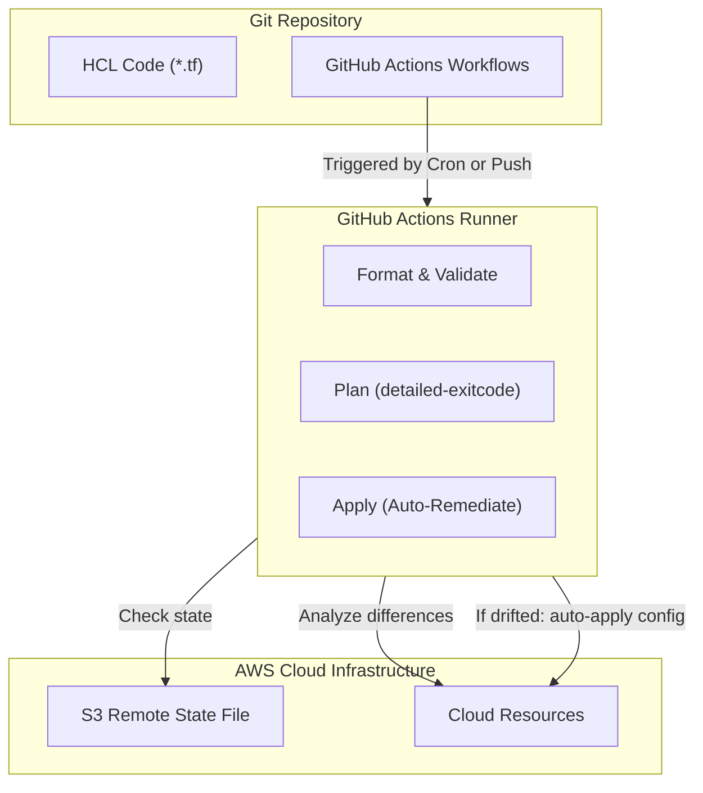

# Project: Terraform Automation and Drift Remediation

**Breadcrumbs:** [[Main Notes/0-Index|🏠 Index]] > Projects > **Terraform Automation and Drift Remediation**

---

## 🎯 Project Overview

This project implements an automated continuous validation and drift remediation loop using GitHub Actions. It automates testing and planning on pull requests, executes applications on merges to main, and configures a scheduled cron workflow that detects manual changes made directly to cloud resources via the AWS Console (bypassing Terraform) and auto-applies configuration changes to restore Git compliance.

### Learning Objectives:
*   Build automated CI/CD workflows for Terraform syntax, styling, and plan verification.
*   Enforce security constraints using OIDC credentials assumption.
*   Configure scheduled drift detection runs using plan exit codes.
*   Automate drift remediation using stored target execution plans.

---

## 🏛️ Target Architecture



---

## 🛠️ Step-by-Step Implementation & Configuration

### 1. Main CI/CD Workflow (`.github/workflows/terraform-ci-cd.yml`)
Configure the pipeline that runs on pull requests and pushes to `main`:
```yaml
name: Terraform CI-CD Core

on:
  push:
    branches: [ main ]
  pull_request:
    branches: [ main ]

permissions:
  id-token: write # Required for OIDC AWS access
  contents: read
  pull-requests: write # Required to comment plans on PRs

jobs:
  validate-and-plan:
    runs-on: ubuntu-latest
    steps:
      - name: Checkout Code
        uses: actions/checkout@v4

      - name: Setup Terraform
        uses: hashicorp/setup-terraform@v3
        with:
          terraform_version: "1.5.7"

      - name: Format Check
        run: terraform fmt -check

      - name: AWS OIDC Authenticate
        uses: aws-actions/configure-aws-credentials@v4
        with:
          role-to-assume: arn:aws:iam::123456789012:role/github-actions-terraform-role
          aws-region: us-east-1

      - name: Initialize
        run: terraform init

      - name: Validate
        run: terraform validate

      - name: Run Plan
        id: plan
        if: github.event_name == 'pull_request'
        run: terraform plan -no-color

      # Post plan output as a comment on the PR
      - name: Comment Plan on PR
        uses: actions/github-script@v7
        if: github.event_name == 'pull_request'
        with:
          script: |
            const output = `#### Terraform Plan Status: Pass
            Plan output posted to build console logs.`;
            github.rest.issues.createComment({
              issue_number: context.issue.number,
              owner: context.repo.owner,
              repo: context.repo.repo,
              body: output
            })

      - name: Deploy Changes
        if: github.ref == 'refs/heads/main' && github.event_name == 'push'
        run: terraform apply -auto-approve
```

### 2. Scheduled Drift Audit & Remediation Workflow (`.github/workflows/drift-remediation.yml`)
Configure the hourly scheduled cron workflow to detect and resolve drift:
```yaml
name: Automated Drift Remediation

on:
  schedule:
    - cron: '0 * * * *' # Executes hourly at minute 0
  workflow_dispatch: # Allows manual trigger

permissions:
  id-token: write
  contents: read

jobs:
  drift-remediation:
    runs-on: ubuntu-latest
    steps:
      - name: Checkout Code
        uses: actions/checkout@v4

      - name: Setup Terraform
        uses: hashicorp/setup-terraform@v3
        with:
          terraform_version: "1.5.7"

      - name: AWS OIDC Authenticate
        uses: aws-actions/configure-aws-credentials@v4
        with:
          role-to-assume: arn:aws:iam::123456789012:role/github-actions-terraform-role
          aws-region: us-east-1

      - name: Initialize Workspace
        run: terraform init

      # Exit Codes: 0 = No changes, 1 = Error, 2 = Drift (changes detected)
      - name: Detect Infrastructure Drift
        id: plan_drift
        run: |
          terraform plan -detailed-exitcode -no-color -out=drift.tfplan || exit_code=$?
          echo "exit_code=$exit_code" >> "$GITHUB_OUTPUT"
        continue-on-error: true

      # Remediation step runs only if plan exit code is 2 (drift detected)
      - name: Apply Remediation Plan
        if: steps.plan_drift.outputs.exit_code == '2'
        run: |
          echo "Drift detected. Restoring configuration to Git source of truth..."
          terraform apply -auto-approve drift.tfplan
```

---

## 🔍 Verification & Diagnostics

Verify drift detection and automatic remediation:

1.  **Simulate Infrastructure Drift:**
    Locate a security group rule managed by your Terraform configuration and manually delete it using the AWS Console or AWS CLI:
    ```bash
    aws ec2 revoke-security-group-ingress --group-id sg-123456 --protocol tcp --port 80 --cidr 0.0.0.0/0
    ```
2.  **Trigger the Drift Remediation Workflow:**
    Manually trigger the drift remediation workflow via the GitHub UI or using the GitHub CLI:
    ```bash
    gh workflow run "Automated Drift Remediation"
    ```
3.  **Inspect Run Diagnostics:**
    Check the workflow execution logs. The "Detect Infrastructure Drift" step should return exit code `2`, and the "Apply Remediation Plan" step should run, recreating the missing ingress rule and restoring compliance.

---

## 💡 Key Architectural Takeaways

- **Design Trade-off (Security vs Automation Risk):** Setting up automated drift remediation (`terraform apply -auto-approve`) ensures high configuration integrity. However, if a developer is debugging a production incident and applies a temporary security group rule, the hourly cron will overwrite it. We mitigate this by configuring notifications (Slack hooks) to alert the team before auto-applying changes.
- **Verification Control (Detailed Exit Code):** Standard `terraform plan` returns an exit code of `0` regardless of whether changes are found. The `-detailed-exitcode` flag instructs Terraform to return `2` on changes, enabling simple shell scripting to decide if remediation is needed.
