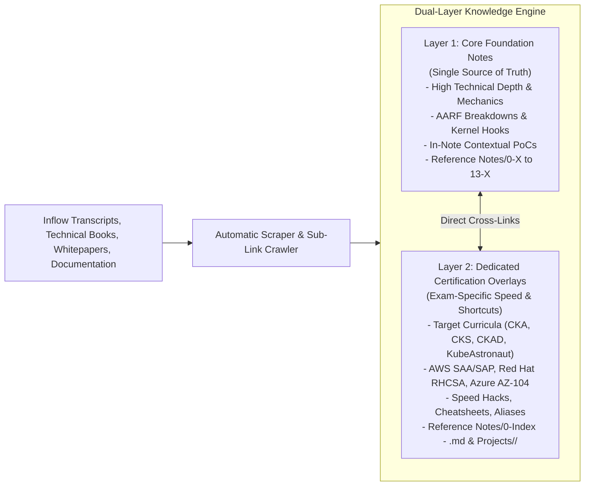

# 🧠 Second Brain & Digital Garden: Universal Systems Engineering & Cloud Architecture Knowledge Base

Welcome to your central **Second Brain & Digital Garden**, an authoritative, production-grade knowledge base covering universal systems engineering, cloud architecture, container orchestration, operating system internals, networking, Infrastructure as Code (IaC), CI/CD automation, and distributed systems.

This vault serves as a consolidated single source of truth across all technical disciplines. Rather than treating technologies in isolation, it models how systems intersect in real-world production environments—from low-level Linux kernel cgroups and network namespaces up through Kubernetes control planes, cloud hyperscalers (AWS & Azure), and declarative GitOps pipelines.

---

## 🗺️ Universal Systems Engineering Architecture Map

The architecture map below illustrates how core engineering layers interlock across the entire knowledge base:

```mermaid
flowchart TD
    %% OS & Kernel Foundation
    subgraph KERNEL ["1. Linux OS & Kernel Foundation"]
        LinuxKernel["Linux Kernel (CFS/EEVDF Scheduler, VFS, Memory Management)"]
        cgroups["cgroups v1/v2 (CPU, Memory, Block I/O Accounting & Limits)"]
        namespaces["Namespaces (pid, net, mnt, ipc, uts, user)"]
        OSNet["Kernel Networking (iptables, IPVS, Netfilter, eBPF)"]
        Systemd["systemd (Unit Lifecycles, cgroup slices, journald)"]
        LinuxKernel --- cgroups
        LinuxKernel --- namespaces
        LinuxKernel --- OSNet
        LinuxKernel --- Systemd
    end

    %% Network & Transport Layer
    subgraph NETWORKING ["2. Networking & Routing Fabric"]
        BGP["BGP Routing (AS Peering, Route Reflectors, Path Attributes)"]
        DNS["DNS & CoreDNS (Resolution Trees, Search Paths, Split-Horizon)"]
        OSI["OSI Stack (L2 Data Link, L3 IP, L4 TCP/UDP, L7 HTTP/gRPC)"]
        SecurityNet["Network Security (Calico CNI, Cilium eBPF, NetworkPolicies)"]
        OSNet --- SecurityNet
        BGP --- OSI
    end

    %% Container Runtime Engine
    subgraph RUNTIME ["3. Containerization & Runtime Engine"]
        OCI["OCI Specification (Image & Runtime Specs)"]
        CRI["Container Runtime Interface (containerd, CRI-O)"]
        Shim["containerd-shim (Process Supervision, TTY Allocation)"]
        Runc["runc (Low-Level OCI Container Spawner)"]
        Pause["pause container (Namespace Anchor for Pod Sandboxes)"]
        OCI --- CRI --> Shim --> Runc --> Pause
        cgroups -.-> Runc
        namespaces -.-> Pause
    end

    %% Kubernetes & Cloud Native
    subgraph K8S ["4. Cloud-Native & Kubernetes Orchestration"]
        APIServer["kube-apiserver (REST API Engine, Admission Webhooks, AuthN/AuthZ)"]
        etcd[("etcd (Distributed Raft KV Store, Linearizable Reads)")]
        Scheduler["kube-scheduler (Filtering/Scoring, Topology Spreading, Affinity)"]
        ControllerManager["kube-controller-manager (Reconciliation Loops, Leader Leases)"]
        Kubelet["kubelet (Node Agent, Pod Lifecycle, Probe Auditing, GC)"]
        KubeProxy["kube-proxy (Service ClusterIP, iptables/IPVS Syncer)"]
        CSI["CSI Storage (PV, PVC, StorageClasses, Dynamic Provisioning)"]

        APIServer <--> etcd
        Scheduler --> APIServer
        ControllerManager --> APIServer
        Kubelet <--> APIServer
        KubeProxy --> APIServer
        Kubelet --> CRI
        KubeProxy --- OSNet
    end

    %% Cloud Hyperscalers
    subgraph CLOUD ["5. Cloud Hyperscalers (AWS & Azure)"]
        subgraph AWS ["AWS Architecture"]
            AWSIAM["AWS IAM & STS (Roles, Policies, IRSA Trust)"]
            AWSNet["VPC Networking (Subnets, IGW, NAT GW, TGW, Route Tables)"]
            AWSCompute["Compute & Containers (EC2, EKS, Auto Scaling Groups)"]
            AWSStorage["Storage Systems (S3 Strong Consistency, EBS, EFS)"]
            AWSOps["CloudOps (SSM Automation, CloudWatch, Organizations)"]
        end
        subgraph AZURE ["Microsoft Azure"]
            EntraID["Microsoft Entra ID (RBAC, PIM, Conditional Access)"]
            AzureNet["VNets (Peering, NSGs, Route Tables, Private Endpoints)"]
            AzureCompute["Compute & AKS (Managed Clusters, Node Pools)"]
            AzureStorage["Azure Storage (Blob, Data Lake, Managed Disks)"]
        end
        APIServer -.-> AWSIAM
        APIServer -.-> EntraID
        CSI -.-> AWSStorage
        CSI -.-> AzureStorage
    end

    %% IaC & GitOps Automation
    subgraph IAC ["6. Infrastructure as Code & Automation"]
        Terraform["Terraform (HCL, State Backend Locking, Modular Stacks)"]
        GitOps["GitOps & Declarative Management (Helm Charts, Kustomize)"]
        CICD["CI/CD Pipelines (GitHub Actions OIDC, Jenkins Distributed Agents)"]
        Terraform --> AWS
        Terraform --> AZURE
        GitOps --> APIServer
        CICD --> GitOps
    end

    %% Distributed Systems & Reliability
    subgraph RELIABILITY ["7. Distributed Systems Design & Reliability"]
        DistSys["Systems Scaling (Load Balancing, Sharding, Consistent Hashing)"]
        Caching["Caching & Performance (Redis, CDNs, Memory Caches)"]
        SecurityGov["Security & Runtime Defense (Falco, CIS Hardening, Seccomp, AppArmor)"]
        DistSys --- Caching
        SecurityGov -.-> K8S
        SecurityGov -.-> KERNEL
    end

    classDef kernelNode fill:#2d3748,stroke:#cbd5e0,stroke-width:1px,color:#fff;
    classDef netNode fill:#1a365d,stroke:#90cdf4,stroke-width:1px,color:#fff;
    classDef runtimeNode fill:#744210,stroke:#fbd38d,stroke-width:1px,color:#fff;
    classDef k8sNode fill:#1e40af,stroke:#93c5fd,stroke-width:1px,color:#fff;
    classDef cloudNode fill:#065f46,stroke:#a7f3d0,stroke-width:1px,color:#fff;
    classDef iacNode fill:#4c1d95,stroke:#c4b5fd,stroke-width:1px,color:#fff;
    classDef relNode fill:#831843,stroke:#fbcfe8,stroke-width:1px,color:#fff;

    class LinuxKernel,cgroups,namespaces,OSNet,Systemd kernelNode;
    class BGP,DNS,OSI,SecurityNet netNode;
    class OCI,CRI,Shim,Runc,Pause runtimeNode;
    class APIServer,etcd,Scheduler,ControllerManager,Kubelet,KubeProxy,CSI k8sNode;
    class AWSIAM,AWSNet,AWSCompute,AWSStorage,AWSOps,EntraID,AzureNet,AzureCompute,AzureStorage cloudNode;
    class Terraform,GitOps,CICD iacNode;
    class DistSys,Caching,SecurityGov relNode;
```



---

## 🏛️ The Dual-Layer Knowledge Engine

Every engineering topic in this vault is maintained according to the **Dual-Layer Knowledge Engine**:



### 1. **Layer 1: Core Foundation Notes (The Single Source of Truth)**
* **Location:** `Reference Notes/<Domain_Prefix>/` (e.g. `0-X` Kubernetes, `8-X` Linux, `3-X` AWS, `1-X` Systems Design).
* **Continuous Volume & Technical Depth:** When new technical materials, books, or documentation dumps are ingested, the core notes are enriched **FIRST**. Newly discovered kernel parameters, API fields, YAML configurations, failure modes, and architectural trade-offs are appended directly into these notes.
* **Contextual Proof of Concepts (PoCs):** Hands-on configurations, declarative manifests, verification commands, and failure-loop simulations are embedded **directly within the explanation context** of each reference note.
* **Result:** The Core Notes continuously expand in diagnostic volume, permanence, and depth without redundant duplicate files.

### 2. **Layer 2: Dedicated Certification Overlays & Exam Tracks**
* **Location:** `Reference Notes/0-Index - <CERT>.md` and dedicated study workspaces (e.g. `Projects/CKA/`, `Projects/CKS/`).
* **Concentrated Exam Synthesis:** Focuses purely on exam speed, template generation flags (`--dry-run=client -o yaml`), VIM keystroke optimizations, shell aliases (`alias k=kubectl`), and rapid scenario checklists.
* **Direct Back-Links:** The exam overlays synthesize exam requirements **with direct links back to the enriched Core Foundation Notes**, ensuring comprehensive theoretical grounding alongside fast practical execution.

---

## 📚 Master Map of Content (MOC) Matrix

The vault spans **14 core engineering domains** plus multi-disciplinary projects, indexed in the central [Reference Notes MOC](Reference%20Notes/--Index--.md):

| Domain | Domain Name | Core Focus & Engineering Coverage | Certification & Track Overlays |
| :---: | :--- | :--- | :--- |
| `0-X` | [Kubernetes & Cloud-Native](Reference%20Notes/0-Index%20-%20Kubernetes.md) | Control plane internals, API mechanics, kubelet/CRI, storage (CSI), networking (CNI), admission controllers, workload lifecycles, and cluster security hardening. | [[0-Index - CKA\|CKA]], [[0-Index - CKAD\|CKAD]], [[0-Index - CKS\|CKS]] $\rightarrow$ **KubeAstronaut** |
| `1-X` | [Systems Design & Architecture](Reference%20Notes/0-Index%20-%20Systems%20Design.md) | Distributed systems scalability, load balancer topologies, database sharding/partitioning, consistent hashing, caching strategies, and API gateways. | Distributed Systems Engineering |
| `2-X` | [Docker & Container Runtimes](Reference%20Notes/2-Index%20-%20Docker.md) | Container runtime mechanics, OCI specifications, multi-stage Dockerfiles, volume storage, bridge networking, and Docker Compose orchestration. | DCA (Docker Certified Associate) |
| `3-X` | [AWS Cloud Architecture](Reference%20Notes/3-Index%20-%20AWS.md) | Global AWS infrastructure, IAM secure identity, KMS keys, compute (EC2), storage (S3 strong consistency, EBS, EFS), VPC subnet routing, and Auto Scaling. | AWS SAA-C03, AWS SAP-C02 |
| `4-X` | [BGP Routing & Protocols](Reference%20Notes/4-Index%20-%20BGP%20Routing.md) | Border Gateway Protocol (BGP) routing engine, path vector characteristics, external/internal peering (eBGP/iBGP), and Route Reflector client topologies. | Advanced Networking & Datacenter Fabrics |
| `5-X` | [Jenkins CI/CD Automation](Reference%20Notes/5-Index%20-%20Jenkins.md) | Controller-Agent distributed compilation, Declarative Pipeline syntax stages, webhook triggers, cron schedules, environment parameters, and test reporting. | CI/CD Pipeline Engineering |
| `6-X` | [Web Fundamentals & UI](Reference%20Notes/6-Index%20-%20Web%20Fundamentals.md) | HTML5 semantic hierarchies, element nesting constraints, CSS box model spacing (margins/padding), relative units, and inheritance resets. | Web Standards & Frontend Engineering |
| `7-X` | [Python Programming](Reference%20Notes/7-Index%20-%20Python.md) | Python syntax, data structures, OOP statements, pyenv version management, virtual environments, exception handling, and Flask API services. | Python Software Engineering |
| `8-X` | [Linux OS & Kernel Internals](Reference%20Notes/8-Index%20-%20Linux%20and%20OS.md) | Kernel internals, virtual file system (VFS), process schedulers (CFS/EEVDF), systemd unit management, Keepalived HA clustering, and system diagnostics. | Red Hat RHCSA / RHCE |
| `9-X` | [GitHub Actions Automation](Reference%20Notes/9-Index%20-%20GitHub%20Actions.md) | Event-driven workflow execution, parallel matrix strategies, artifact management, package caching, dynamic GITHUB_TOKEN permissions, and passwordless OIDC trust. | GitHub Actions CI/CD |
| `10-X` | [Terraform on AWS & IaC](Reference%20Notes/10-Index%20-%20Terraform%20on%20AWS.md) | Infrastructure as Code, S3/DynamoDB state locking, variables and type constraints, custom reusable modules, managed EKS provisioning, and drift remediation. | HashiCorp Terraform Associate |
| `11-X` | [AWS CloudOps & Reliability](Reference%20Notes/11-Index%20-%20AWS%20CloudOps.md) | Unified CloudWatch metrics, Systems Manager (SSM) automation, compute/storage optimization, Route 53 DNS failover, AWS Organizations governance, and hybrid networking. | AWS SysOps Administrator |
| `12-X` | [CNCF Cloud-Native References](Reference%20Notes/12-Index%20-%20CNCF%20References.md) | Cloud-native architectural digests, container orchestration pattern studies, cluster disaster recovery workflows, and etcd/volume storage designs. | Cloud-Native Computing Foundation (CNCF) |
| `13-X` | [Microsoft Azure Architecture](Reference%20Notes/13-Index%20-%20Azure.md) | Enterprise Azure architecture, ARM control plane, Microsoft Entra ID, Virtual Networks (VNets), Network Security Groups (NSGs), and unified Storage Accounts. | Azure AZ-900, AZ-104, AZ-305 |
| `MISC` | [Miscellaneous Projects](Reference%20Notes/--Index--.md#miscellaneous-projects-misc) | Multi-disciplinary projects combining multiple administrative fields: self-hosted Gitea GitOps on RHEL 8, Git internals, Linux sysadmin troubleshooting, and OpenStack private cloud. | Practical Systems Administration |

---

## 📂 Vault Structure & Directory Philosophy

This vault is organized into clean functional tiers:

```
BrainDump/
├── Reference Notes/       # Layer 1: Authoritative Core Notes with Embedded PoCs
│   ├── --Index--.md       # Central Master MOC across all 14 domains
│   ├── 0-X-Y_...          # Kubernetes Core Reference Modules
│   ├── 1-X_...            # Systems Design Reference Modules
│   ├── 2-X_...            # Docker Reference Modules
│   ├── 3-X_...            # AWS Cloud Reference Modules
│   ├── ...                # (Domains 4-X through 13-X and MISC)
│   ├── 0-Index - CKA.md   # Layer 2: CKA Certification Track MOC
│   ├── 0-Index - CKS.md   # Layer 2: CKS Certification Track MOC
│   └── 0-Index - CKAD.md  # Layer 2: CKAD Certification Track MOC
├── Main Notes/            # Atomic Concept Summaries & Deeper Dives
│   ├── 0-Index.md         # Dataview index of all landing and deeper notes
│   ├── <concept>.md       # Landing note (Purpose, Functionality, Architecture, Trade-offs)
│   └── <concept> - <subtopic>.md  # Atomic Deeper-dive note
├── Digital Garden/        # Connective Architectural Patterns
│   ├── 0-Index.md         # Pattern MOC
│   └── Pattern - <name>.md# Cross-domain synthesis (e.g. K8s + AWS IRSA + Linux cgroups)
├── Projects/              # Collaborative Project Workspace & Exam Practice
│   ├── CKA/               # CKA Exam checklists, speed hacks, and lab exercises
│   ├── CKS/               # CKS Exam hardening playbook and security shortcuts
│   └── [Domain]/          # Collaborative project playbooks co-authored WITH the user
├── inflow/                # Ingestion staging area for raw notes, transcripts, and docs
├── System/                # Agent definitions, skills, and templates
│   ├── Agents/            # Specialized subagent profiles (researcher, auditor, diagrammer, etc.)
│   ├── Skills/            # Operational skill instructions
│   └── Templates/         # Markdown templates (landing, deeper, pattern, reference, project)
├── Agent.md               # Main Agent Profile & Operating System Rules
├── instructions.md        # Universal Ingestion & Restructuring Skill
├── workflow.md            # Ingestion & Note Enrichment Workflow
└── backlog.md             # Persistent transaction log of vault modifications
```

### 🤝 Collaborative Project Workspace Philosophy
* **No Unsolicited File Dumps:** The agent never automatically generates standalone project files inside `Projects/`. Proof of Concepts (PoCs) are embedded directly within the explanation context of `Reference Notes/`.
* **Co-Authored Engineering:** The `Projects/` directory is reserved for manual user organization and collaborative projects built *together with the user* on demand. When requested, we collaboratively design the architecture, write production-grade manifests, and verify configurations step-by-step.

---

## 🔬 Deep-Intuition Documentation Style (The AARF Framework)

To ensure vault knowledge possesses maximum diagnostic depth, technical notes apply the **AARF** framework:
1. **The Answer:** The exact command, configuration snippet, or declarative manifest.
2. **The Assumptions:** The host/cluster state, version requirements, namespace scope, or network pre-conditions.
3. **The Rationale (Why):** The underlying system-level architecture explanation (how the OS kernel, cloud API, or container runtime operates under the hood).
4. **The Failure Loop (What if not):** The exact error message, kernel panic, pod CrashLoop state, HTTP 5xx code, or security vulnerability that manifests if misconfigured or omitted.
5. **The Alternative Case (When to use 'if not'):** Real-world scenarios where the opposing configuration is the desired production pattern.
6. **The Evolutionary Bridge:** When historical content is present, explicitly detailing the evolutionary bridge from legacy mechanics (e.g. traditional UNIX buffer caches, fork-exec, or eventual consistency) to modern implementations (Linux page caches, namespaces/cgroups, and strong consistency).

---

## ⚙️ Ingestion & Maintenance Pipeline

To ingest new technical materials or audit the vault:
* **Ingest a Document / Transcript:** Place the raw file in `inflow/` and run `@ingest inflow/<filename>.md`. The pipeline automatically scrapes external documentation URLs, resolves sub-links, translates Arabic transcripts to English technical terminology, updates Core Notes, embeds contextual PoCs, maps concepts, and syncs Git.
* **Integrity Audit:** Use `@review` to execute the automated verification script:
  ```powershell
  python "Reference Notes/scripts/review_vault.py"
  ```
  The script validates 100% link integrity, verifies frontmatter schemas, and guarantees all scraped documentation URLs are cited.
