# Kubernetes Consolidated Brain Map & Study Index

Welcome to your consolidated Kubernetes study repository for the CKA (Certified Kubernetes Administrator) exam. This repository is structured into modular notes, each backed by practical, hands-on Proof of Concepts (PoCs) using a local `kind` (Kubernetes in Docker) environment.

---

## 🗺️ The Kubernetes Brain Map (Architectural Relationships)

The diagram below represents how all the components and concepts covered in the modules interact with one another.

```mermaid
graph TD
    %% Clients and API Interactions
    User["User / Admin (kubectl)"] -->|HTTP REST / HTTPS| APIServer["kube-apiserver (REST API Engine)"]
    subgraph "API Mechanics"
        APIServer --- Groups["API Groups & Versions (Core v1, Named apps/v1, etc.)"]
        APIServer --- OpenAPI["OpenAPI Spec (kubectl explain validation)"]
        APIServer --- Watch["Watch Mechanism (HTTP chunked event stream -w)"]
        APIServer --- MixedProxy["Mixed Version Proxy (Handles Version Skew during upgrades)"]
        APIServer --- EphemeralSub["/ephemeralcontainers Subresource"]
    end

    %% Control Plane Core
    subgraph "Control Plane (Master Nodes)"
        APIServer <-->|Only direct accessor| etcd[("etcd (Distributed KV Store / Raft consensus)")]
        Scheduler["kube-scheduler (Matchmaker)"] -->|Watches pending pods, writes assignment| APIServer
        ControllerManager["kube-controller-manager (Enforcer)"] -->|Watches state, reconciles loops| APIServer
        CCM["cloud-controller-manager (Cloud Bridge)"] -->|Manages cloud routes, nodes, loadbalancers| APIServer
    end

    %% Worker Nodes
    subgraph "Worker Nodes"
        kubelet["kubelet (Node Captain)"] -->|Registers node, reports status| APIServer
        kubelet -->|Lease heartbeat pings| Lease["Lease Objects (kube-node-lease namespace)"]
        kubelet -->|Manages containers| CRI["Container Runtime Interface (containerd / CRI-O)"]
        
        subgraph "CRI Engine Internals"
            CRI -->|gRPC Dual Services| CRIDual["ImageService & RuntimeService"]
            CRI -->|Launches shim| Shim["containerd-shim (Monitors App process)"]
            CRI -->|Invokes low-level| Runc["runc / OCI executor"]
            Runc -->|Creates Sandbox| Pause["pause container (Holds Net & IPC namespaces)"]
            Pause -->|Enforces limits| cgroups["cgroups (limits) & namespaces (walls)"]
        end

        kubeproxy["kube-proxy (Network Router)"] -->|Watches Services/Endpoints| APIServer
        kubeproxy -->|Configures OS network rules| OSNet["Linux Kernel (iptables / IPVS)"]
    end

    %% High Availability and Leases
    Lease -.->|NodeController watches Leases| ControllerManager
    ControllerManager --- HA["HA Leader Election (kube-scheduler & kube-controller-manager Leases)"]

    %% Self Healing & Lifecycles
    subgraph "Lifecycle, Isolation & Workloads"
        kubelet --- Probes["Probes (Liveness, Readiness, Startup)"]
        kubelet --- NodeGC["Kubelet Garbage Collection (Image thresholds 85%/80%, Container logs)"]
        APIServer --- CascadingGC["Control Plane GC (metadata.ownerReferences, Cascading deletions)"]
        
        kubelet --- Hooks["Lifecycle Hooks (PostStart & PreStop)"]
        kubelet --- Inits["Init Containers (Sequential execution)"]
        kubelet -.->|restartPolicy: Always| Sidecars["Native Sidecar Containers (v1.29+)"]
        EphemeralSub -->|kubectl debug injection| EContainers["Ephemeral Containers (Target PID Namespace)"]
        
        Scheduler -->|Accounts for overhead| RC["RuntimeClass (gVisor / Kata VM Isolation)"]
        RC -->|Applies topology| Scheduler
    end

    classDef controlPlane fill:#326ce5,stroke:#fff,stroke-width:2px,color:#fff;
    classDef worker fill:#4285f4,stroke:#fff,stroke-width:1px,color:#fff;
    classDef api fill:#00c4b4,stroke:#fff,stroke-width:1px,color:#fff;
    class APIServer,etcd,Scheduler,ControllerManager,CCM,HA controlPlane;
    class kubelet,kubeproxy,CRI,CRIDual,Shim,Runc,Pause,cgroups,OSNet,Lease worker;
    class Groups,OpenAPI,Watch,MixedProxy,EphemeralSub api;
```

---

## 📚 Study Modules

Use the links below to navigate to the specific study modules:

1. **[01_kube_api_and_kubectl.md](01_kube_api_and_kubectl.md)**
   * *Topics:* API Server REST endpoints, API Groups, Versioning lifecycles, OpenAPI Schemas, `kubectl explain` navigation, the Watch (`-w`) mechanism, `kubectl` syntax formula, dry-run tricks, and output formatting.
   * *PoC:* Executing HTTP raw API queries, generating YAML templates, and monitoring live pod lifecycle events.

2. **[02_cluster_architecture_and_components.md](02_cluster_architecture_and_components.md)**
   * *Topics:* Master vs. Worker node division, detailed review of Control Plane processes (`etcd`, `apiserver`, `scheduler`, `controller-manager`), High Availability (HA) split-brain prevention, Leader Election, Cloud Controller Manager (CCM), and Mixed Version Proxy.
   * *PoC:* Launching a multi-node local cluster, dissecting static pod manifests, and exploring leader election leases.

3. **[03_node_mechanics_and_resource_limits.md](03_node_mechanics_and_resource_limits.md)**
   * *Topics:* Node registration pathways, Node Conditions (`Ready`, `Pressure` types), heartbeats & Lease objects, QoS Classes (`BestEffort`, `Burstable`, `Guaranteed`), `cgroups` (cgroups v1 vs. v2), and container runtime Cgroup drivers (`systemd` vs. `cgroupfs`).
   * *PoC:* Inspecting node lease objects, creating and verifying pods for each QoS class, and simulating OOM limits.

4. **[04_workload_lifecycle_and_healing.md](04_workload_lifecycle_and_healing.md)**
   * *Topics:* The 4 pillars of self-healing (Restart, Replace, Replicate, Reschedule), Liveness/Readiness/Startup Probes, Garbage Collection (Cascading deletions, owner references, Kubelet container/image cleanups).
   * *PoC:* Debugging crashing pods with liveness probes, isolating traffic with readiness probes, and running foreground/background/orphan cascading deletions.

5. **[05_containers_runtimes_and_lifecycle.md](05_containers_runtimes_and_lifecycle.md)**
   * *Topics:* OCI image layers and immutability, high-level (CRI) vs. low-level (OCI/`runc`) container runtimes, `containerd-shim` mechanics, Pod sandboxes (`pause` containers), `RuntimeClass` isolation topologies, advanced scheduling and resource overhead, `PostStart`/`PreStop` lifecycle hooks, sequential `initContainers`, native `Sidecar` containers, and `ephemeralContainers` debugging workflows.
   * *PoC:* Deploying custom container environments with disabled service links, debugging lifecycle hooks via log redirection, validating sequential init and native sidecar boot order, and injecting ephemeral debugging containers via `kubectl debug` process-targeting.

---

## 📥 Ingestion & Backlog

* **Inflow Directory:** Put any raw notes, lecture transcripts, and documentation dumps into the [inflow/](inflow/) folder.
* **Update Backlog:** Follow all changes and updates in the [backlog.md](backlog.md) file.

---

## 🛠️ Global Kind Cluster Setup

To test these notes, you will need a multi-node cluster. The configuration file and instructions are detailed at the start of **[02_cluster_architecture_and_components.md](02_cluster_architecture_and_components.md)**.

---

## 📝 Integration Guidelines
For details on how to append new study topics or course materials to this repository, please review the **[instructions.md](instructions.md)** guide.
