# Kubernetes Consolidated Brain Map & Study Index

Welcome to your consolidated Kubernetes study repository for the CKA (Certified Kubernetes Administrator) exam. This repository is structured into modular notes, each backed by practical, hands-on Proof of Concepts (PoCs) using a local `kind` (Kubernetes in Docker) environment.

---

## 🗺️ The Kubernetes Brain Map (Architectural Relationships)

The diagram below represents how all the components and concepts covered in the modules interact with one another.

```mermaid
graph TD
    %% Clients and API Interactions
    User["User / Admin (kubectl)"] -->|HTTP REST / HTTPS| APIServer["kube-apiserver (REST API Engine)"]
    subgraph "API Mechanics"
        APIServer --- Groups["API Groups & Versions (Core v1, Named apps/v1, etc.)"]
        APIServer --- OpenAPI["OpenAPI Spec (kubectl explain validation)"]
        APIServer --- Watch["Watch Mechanism (HTTP chunked event stream -w)"]
        APIServer --- MixedProxy["Mixed Version Proxy (Handles Version Skew during upgrades)"]
        APIServer --- EphemeralSub["/ephemeralcontainers Subresource"]
    end

    %% Control Plane Core
    subgraph "Control Plane (Master Nodes)"
        APIServer <-->|Only direct accessor| etcd[("etcd (Distributed KV Store / Raft consensus)")]
        Scheduler["kube-scheduler (Matchmaker)"] -->|Watches pending pods, writes assignment| APIServer
        ControllerManager["kube-controller-manager (Enforcer)"] -->|Watches state, reconciles loops| APIServer
        CCM["cloud-controller-manager (Cloud Bridge)"] -->|Manages cloud routes, nodes, loadbalancers| APIServer
    end

    %% Worker Nodes
    subgraph "Worker Nodes"
        kubelet["kubelet (Node Captain)"] -->|Registers node, reports status| APIServer
        kubelet -->|Lease heartbeat pings| Lease["Lease Objects (kube-node-lease namespace)"]
        kubelet -->|Manages containers| CRI["Container Runtime Interface (containerd / CRI-O)"]
        
        subgraph "CRI Engine Internals"
            CRI -->|gRPC Dual Services| CRIDual["ImageService & RuntimeService"]
            CRI -->|Launches shim| Shim["containerd-shim (Monitors App process)"]
            CRI -->|Invokes low-level| Runc["runc / OCI executor"]
            Runc -->|Creates Sandbox| Pause["pause container (Holds Net & IPC namespaces)"]
            Pause -->|Enforces limits| cgroups["cgroups (limits) & namespaces (walls)"]
        end

        kubeproxy["kube-proxy (Network Router)"] -->|Watches Services/Endpoints| APIServer
        kubeproxy -->|Configures OS network rules| OSNet["Linux Kernel (iptables / IPVS)"]
    end

    %% High Availability and Leases
    Lease -.->|NodeController watches Leases| ControllerManager
    ControllerManager --- HA["HA Leader Election (kube-scheduler & kube-controller-manager Leases)"]

    %% Self Healing & Lifecycles
    subgraph "Lifecycle, Isolation & Workloads"
        kubelet --- Probes["Probes (Liveness, Readiness, Startup)"]
        kubelet --- NodeGC["Kubelet Garbage Collection (Image thresholds 85%/80%, Container logs)"]
        APIServer --- CascadingGC["Control Plane GC (metadata.ownerReferences, Cascading deletions)"]
        
        kubelet --- Hooks["Lifecycle Hooks (PostStart & PreStop)"]
        kubelet --- Inits["Init Containers (Sequential execution)"]
        kubelet -.->|restartPolicy: Always| Sidecars["Native Sidecar Containers (v1.29+)"]
        EphemeralSub -->|kubectl debug injection| EContainers["Ephemeral Containers (Target PID Namespace)"]
        
        Scheduler -->|Accounts for overhead| RC["RuntimeClass (gVisor / Kata VM Isolation)"]
        RC -->|Applies topology| Scheduler
    end

    classDef controlPlane fill:#326ce5,stroke:#fff,stroke-width:2px,color:#fff;
    classDef worker fill:#4285f4,stroke:#fff,stroke-width:1px,color:#fff;
    classDef api fill:#00c4b4,stroke:#fff,stroke-width:1px,color:#fff;
    class APIServer,etcd,Scheduler,ControllerManager,CCM,HA controlPlane;
    class kubelet,kubeproxy,CRI,CRIDual,Shim,Runc,Pause,cgroups,OSNet,Lease worker;
    class Groups,OpenAPI,Watch,MixedProxy,EphemeralSub api;
```

---

## 📂 The Two-Tier Knowledge Vault

To balance high-verbosity reference materials (detailed configurations, commands, and hands-on PoCs) with clear, atomic conceptual associations, this vault is structured into two main directories:

### 1. 🧠 [Main Notes](Main%20Notes/) (Atomic Concepts)
This directory contains direct, focused, and atomic notes on each Kubernetes component and concept. Every concept has a landing note linked to a deeper-dive note:
* **[kube-apiserver](Main%20Notes/kube-apiserver.md)** (Deeper: **[kube-apiserver-deeper](Main%20Notes/kube-apiserver-deeper.md)**)
* **[etcd](Main%20Notes/etcd.md)** (Deeper: **[etcd-deeper](Main%20Notes/etcd-deeper.md)**)
* **[kube-scheduler](Main%20Notes/kube-scheduler.md)** (Deeper: **[kube-scheduler-deeper](Main%20Notes/kube-scheduler-deeper.md)**)
* **[kube-controller-manager](Main%20Notes/kube-controller-manager.md)** (Deeper: **[kube-controller-manager-deeper](Main%20Notes/kube-controller-manager-deeper.md)**)
* **[cloud-controller-manager](Main%20Notes/cloud-controller-manager.md)** (Deeper: **[cloud-controller-manager-deeper](Main%20Notes/cloud-controller-manager-deeper.md)**)
* **[kubelet](Main%20Notes/kubelet.md)** (Deeper: **[kubelet-deeper](Main%20Notes/kubelet-deeper.md)**)
* **[kube-proxy](Main%20Notes/kube-proxy.md)** (Deeper: **[kube-proxy-deeper](Main%20Notes/kube-proxy-deeper.md)**)
* **[container-runtime](Main%20Notes/container-runtime.md)** (Deeper: **[container-runtime-deeper](Main%20Notes/container-runtime-deeper.md)**)
* **[kubectl](Main%20Notes/kubectl.md)** (Deeper: **[kubectl-deeper](Main%20Notes/kubectl-deeper.md)**)
* **[pod](Main%20Notes/pod.md)** (Deeper: **[pod-deeper](Main%20Notes/pod-deeper.md)**)
* **[node](Main%20Notes/node.md)** (Deeper: **[node-deeper](Main%20Notes/node-deeper.md)**)

---

### 📚 [Reference Notes](Reference%20Notes/) (Study Modules & PoCs)
This directory houses the comprehensive study modules filled with technical depth, command configurations, alerts, and detailed hands-on Proof of Concept (PoC) workflows:

1. **[01_kube_api_and_kubectl.md](Reference%20Notes/01_kube_api_and_kubectl.md)**
   * *Topics:* REST endpoints, API Groups, Versioning, OpenAPI Schemas, `kubectl explain`, Watch (`-w`), JSONPath/Custom Columns.
   * *PoC:* Raw HTTP API queries, YAML templates, watch logs.

2. **[02_cluster_architecture_and_components.md](Reference%20Notes/02_cluster_architecture_and_components.md)**
   * *Topics:* Master vs. Worker split, Control Plane processes, High Availability (HA) split-brain, Leader Election, CCM, Mixed Version Proxy.
   * *PoC:* Multi-node kind setups, Static Pod manifests, leader lease analysis.

3. **[03_node_mechanics_and_resource_limits.md](Reference%20Notes/03_node_mechanics_and_resource_limits.md)**
   * *Topics:* Node registration, Lease heartbeats, QoS Classes (`BestEffort`, `Burstable`, `Guaranteed`), Cgroup drivers.
   * *PoC:* Lease inspections, QoS configuration, OOM limit testing.

4. **[04_workload_lifecycle_and_healing.md](Reference%20Notes/04_workload_lifecycle_and_healing.md)**
   * *Topics:* Self-healing pillars, Probes (Liveness/Readiness/Startup), Garbage Collection (Cascading deletions, owner references).
   * *PoC:* Debugging crashing pods, isolating network traffic, testing foreground/background GC.

5. **[05_containers_runtimes_and_lifecycle.md](Reference%20Notes/05_containers_runtimes_and_lifecycle.md)**
   * *Topics:* OCI layers, containerd-shim, Pause containers, `RuntimeClass` isolation, hooks, init containers, sidecars, ephemeral containers.
   * *PoC:* Custom lifecycle hook redirection, sidecar boot orders, injecting ephemeral debugging containers.

---

## 📥 Ingestion & Backlog

* **Inflow Directory:** Put any raw notes, lecture transcripts, and documentation dumps into the [inflow/](inflow/) folder.
* **Update Backlog:** Follow all changes and updates in the [backlog.md](backlog.md) file.

---

## 🛠️ Global Kind Cluster Setup

To test these notes, you will need a multi-node cluster. The configuration file and instructions are detailed at the start of **[02_cluster_architecture_and_components.md](Reference%20Notes/02_cluster_architecture_and_components.md)**.

---

## 📝 Integration Guidelines
For details on how to append new study topics or course materials to this repository, please review the **[instructions.md](instructions.md)** guide.

