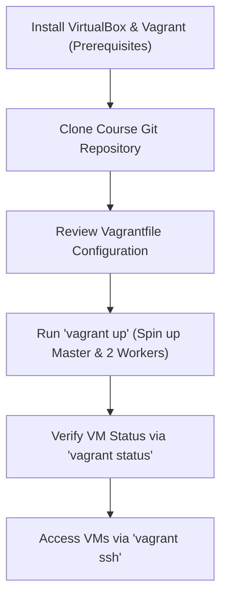

# Lecture: Vagrant VM Provisioning for Kubeadm

This reference note documents the VM provisioning setup workflow using VirtualBox and Vagrant to prepare a local environment for bootstrapping a Kubernetes cluster.

---

## 🗺️ Cognitive Map: How to Think About VM Provisioning



---

## 1. Tool Stack & Roles

This environment setup uses two key pieces of software:
1.  **VirtualBox (Hypervisor):** The virtualization hypervisor responsible for executing the guest virtual machines.
2.  **Vagrant (Infrastructure as Code / Automation):** An automation wrapper that provisions, configures, and manages virtual machines using a simple declarative configuration file (`Vagrantfile`). This guarantees consistent machine parameters (IPs, CPU, memory, networking) across development environments.

---

## 2. Infrastructure Specification & Network Topology

The `Vagrantfile` configures three virtual machines running on an isolated host-only network:

*   **Subnet:** `192.168.56.0/24`
*   **Virtual Machines:**
    *   `kubemaster` (Control Plane): IP `192.168.56.11`
    *   `kubenode01` (Worker Node 1): IP `192.168.56.21`
    *   `kubenode02` (Worker Node 2): IP `192.168.56.22`
*   **Base OS Image:** `ubuntu/bionic64` (Ubuntu 18.04 LTS)

---

## 3. Operational Command Reference

Run these commands inside the directory containing the cloned repository and its `Vagrantfile`:

### A. Check Status of VMs
Verify the state of the machines defined in the local `Vagrantfile`:
```bash
vagrant status
```
*Expected Output (before provisioning):*
```plaintext
Current machine states:
kubemaster               not created (virtualbox)
kubenode01               not created (virtualbox)
kubenode02               not created (virtualbox)
```

### B. Provision and Spin Up the VMs
Start and configure all defined virtual machines:
```bash
vagrant up
```
*   **Mechanics:** Vagrant downloads the base Ubuntu box image (if not cached locally) and provisions all three instances sequentially (`kubemaster` $\rightarrow$ `kubenode01` $\rightarrow$ `kubenode02`).

### C. Connect to a Provisioned Node
Establish a secure shell (SSH) session into a target node:
```bash
vagrant ssh <vm-name>
```
*Example:*
```bash
# Connect to the Control Plane master
vagrant ssh kubemaster

# Connect to Worker Node 1
vagrant ssh kubenode01
```

### D. Logout and Shutdown
*   To exit the VM shell back to your host terminal:
    ```bash
    logout  # or exit
    ```
*   To temporarily suspend or halt the VMs to free host system resources:
    ```bash
    vagrant halt
    ```
*   To destroy the VMs and wipe the disks entirely:
    ```bash
    vagrant destroy -f
    ```
