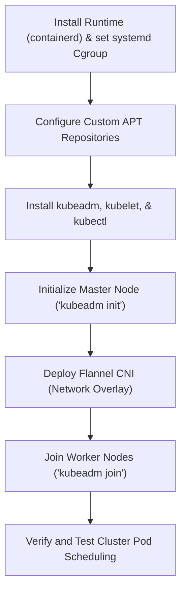

# Lecture: Bootstrapping a Cluster with Kubeadm

This reference note documents the step-by-step procedure of bootstrapping a multi-node Kubernetes cluster using `kubeadm` with `containerd` and the `Flannel` CNI.

---

## 🗺️ Cognitive Map: How to Think About Cluster Bootstrapping



---

## 1. Step-by-Step Installation and Bootstrapping Walkthrough

This demo is executed on three virtual machines: `kubemaster` (`192.168.56.11`), `kubenode01` (`192.168.56.21`), and `kubenode02` (`192.168.56.22`).

### Step 1: Install Container Runtime (containerd)
Execute on **all nodes** to run containerized system workloads.
```bash
sudo apt-get update
sudo apt-get install -y containerd
```

#### Configure Cgroup Driver Integration
Kubernetes and the container runtime must use the same Control Group (cgroup) driver to manage CPU and memory allocation thresholds. On Linux nodes using systemd as the init system, both components must use the `systemd` cgroup driver to avoid process sync conflicts.
1.  Generate containerd's default configuration and write it:
    ```bash
    sudo mkdir -p /etc/containerd
    containerd config default | sudo tee /etc/containerd/config.toml
    ```
2.  Enable the Systemd Cgroup driver:
    ```bash
    # Set SystemdCgroup = true under plugins."io.containerd.grpc.v1.cri".containerd.runtimes.runc.options
    sudo sed -i 's/SystemdCgroup = false/SystemdCgroup = true/g' /etc/containerd/config.toml
    ```
3.  Restart containerd:
    ```bash
    sudo systemctl restart containerd
    ```

---

### Step 2: Install Kubernetes Packages (v1.31)
Execute on **all nodes** to install control and management daemons.

1.  **Download public keys & configure repository sources:**
    ```bash
    # Download keyring
    sudo mkdir -p -m 755 /etc/apt/keyrings
    curl -fsSL https://pkgs.k8s.io/core:/stable:/v1.31/deb/Release.key | sudo gpg --dearmor -o /etc/apt/keyrings/kubernetes-apt-keyring.gpg

    # Add Kubernetes repository (version-locked to 1.31)
    echo 'deb [signed-by=/etc/apt/keyrings/kubernetes-apt-keyring.gpg] https://pkgs.k8s.io/core:/stable:/v1.31/deb/ /' | sudo tee /etc/apt/sources.list.d/kubernetes.list
    ```
2.  **Update packages and install binaries:**
    ```bash
    sudo apt-get update
    sudo apt-get install -y kubelet kubeadm kubectl
    
    # Optional: Prevent automatic updates of packages
    sudo apt-mark hold kubelet kubeadm kubectl
    ```

---

### Step 3: Initialize the Control Plane
Execute **only** on the control plane node (`kubemaster`):
```bash
sudo kubeadm init \
  --apiserver-advertise-address=192.168.56.11 \
  --pod-network-cidr=10.244.0.0/16 \
  --upload-certs
```
*   **`--apiserver-advertise-address`:** Enforces binding the API Server to the host-only IP (`192.168.56.11`) instead of the default NAT interface configured by Vagrant.
*   **`--pod-network-cidr`:** Defines the subnet allocated to Pod IP addresses. `10.244.0.0/16` is required by the Flannel CNI.

#### Configure Kubectl Access (Kubeconfig)
Set up administrative credentials for your local shell:
```bash
mkdir -p $HOME/.kube
sudo cp -i /etc/kubernetes/admin.conf $HOME/.kube/config
sudo chown $(id -u):$(id -g) $HOME/.kube/config
```

---

### Step 4: Deploy Pod Network Add-on (CNI)
Initially, the control plane node registers in a `NotReady` status. This is normal because DNS and Pod-to-Pod routing cannot resolve without a Container Network Interface (CNI) overlay.

Deploy the **Flannel CNI** plugin on the control plane:
```bash
kubectl apply -f https://raw.githubusercontent.com/flannel-io/flannel/master/Documentation/kube-flannel.yml
```
*   Flannel runs as a cluster-wide **DaemonSet** (`kube-flannel-ds` in the `kube-flannel` namespace), deploying a routing agent pod onto every node joining the cluster. Once Flannel starts, the master node status shifts to `Ready`.

---

### Step 5: Join Worker Nodes
The `kubeadm init` command outputs a token-based join command. Run this command on your worker nodes (`kubenode01` and `kubenode02`) as `sudo`:
```bash
sudo kubeadm join 192.168.56.11:6443 \
  --token <token> \
  --discovery-token-ca-cert-hash sha256:<hash>
```

Verify that all nodes join successfully from the master node:
```bash
kubectl get nodes
```
*Expected Output:*
```plaintext
NAME         STATUS   ROLES           AGE    VERSION
kubemaster   Ready    control-plane   5m     v1.31.1
kubenode01   Ready    <none>          2m     v1.31.1
kubenode02   Ready    <none>          2m     v1.31.1
```

---

### Step 6: Cluster Verification Test
Verify the operational cluster scheduler by running a transient Nginx pod:
```bash
# Start Pod
kubectl run web --image=nginx

# Monitor status until it enters Running
kubectl get pods -w

# Cleanup Pod
kubectl delete pod web
```
