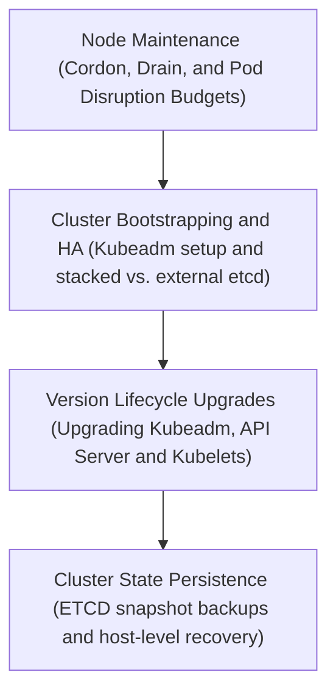
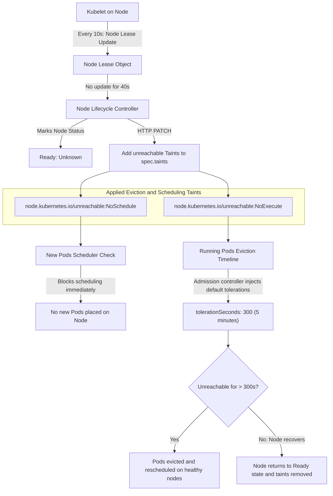

# Cluster Maintenance, Upgrades, ETCD Management, HA Design, and Bootstrapping

This module provides an exhaustive, production-grade technical reference for Kubernetes cluster maintenance, version upgrades, ETCD database backups and restores, High-Availability (HA) cluster designs, and bootstrapping clusters via `kubeadm`.

---

## 🗺️ Cognitive Map: How to Think About the Flow of Knowledge

To build a strong intuition for Kubernetes cluster administration, think of the topics as progressing from localized node operations to cluster construction, rolling software upgrades, and database-level disaster recovery:



1. **Step 1: Node Maintenance (Section 1):** We start with localized operations. We master routing workloads off target hosts using `cordon` (marking unschedulable) and `drain` (evicting pods), while enforcing application availability limits via Pod Disruption Budgets (PDBs).
2. **Step 2: Cluster Bootstrapping & HA (Sections 2 & 3):** We scale out to cluster topology. We learn how to bootstrap Control Planes and Worker Nodes via `kubeadm`, configure load balancers, and construct Stacked vs. External `etcd` high-availability control planes.
3. **Step 3: Version Lifecycle Upgrades (Section 4):** We execute lifecycle upgrades. We evaluate component version skew rules, upgrade the `kubeadm` package, apply upgrade plans to the API Server and Controller Manager, and perform node-by-node Kubelet upgrades.
4. **Step 4: Cluster State Persistence (Section 5):** Finally, we drop down to the database layer. We write `etcdctl` backup commands using client-side certificates and execute host-level restorations (modifying static pod manifests to swap database directories).

By following this flow, you progress from **Local Pod Eviction (Maintenance) → Control Plane Topologies (Bootstrapping) → Software Rolling Upgrades (Lifecycle) → Physical Database Restoration (ETCD Backup/Restore)**.

---


## 1. Node Maintenance Mechanics (Drain, Cordon, Uncordon)

Safely taking nodes out of service for OS maintenance (such as kernel updates, RAM/CPU upgrades, or OS patching) is a fundamental administrative task. Kubernetes provides built-in mechanisms to evict workloads gracefully without causing application downtime.

### 1.1 Cordon vs. Drain vs. Pod Deletion
*   **Cordoning (`kubectl cordon`)**: Marks the node as unschedulable. It adds the `node.kubernetes.io/unschedulable:NoSchedule` taint to the node. Existing pods running on the node remain unaffected.
*   **Draining (`kubectl drain`)**: First cordons the node to prevent new pods from arriving, then evicts all currently running pods.
*   **Pod Eviction vs. Pod Deletion**:
    *   **Eviction (API-initiated)**: Uses the Eviction API to respect **Pod Disruption Budgets (PDBs)**, gracefully terminating container processes with `SIGTERM` followed by `SIGKILL` after the grace period. Recreations are scheduled on other available nodes by controllers.
    *   **Deletion**: Bypasses PDBs and forcibly kills pods. If a bare pod is deleted, it is gone forever.
*   **Default Node Eviction Timeout**: If a node becomes unreachable or unhealthy for more than 5 minutes (default `pod-eviction-timeout` in `kube-controller-manager`), the control plane automatically marks its pods as `Terminating` or `Unknown` and schedules replacements elsewhere.

### 1.2 Pod Disruption Budgets (PDBs)
PDBs limit the number of pods of a replicated application that are down simultaneously from voluntary disruptions (like node draining).

#### PDB YAML Configuration Template
```yaml
apiVersion: policy/v1
kind: PodDisruptionBudget
metadata:
  name: frontend-pdb
  namespace: default
spec:
  # Specify either minAvailable or maxUnavailable (do not specify both)
  maxUnavailable: 1
  selector:
    matchLabels:
      app: web-frontend
```

### 1.3 Command Syntax and Flags
```bash
# Mark a node as unschedulable without evicting pods
kubectl cordon worker-node-1

# Safely drain a node of all workloads
kubectl drain worker-node-1 --ignore-daemonsets --force --delete-emptydir-data

# Restore schedulability to the node
kubectl uncordon worker-node-1
```

#### Explanation of Critical Drain Flags:
> [!IMPORTANT]
> Failure to specify these flags will cause the `kubectl drain` command to fail if any matching pods are detected on the node:
> *   `--ignore-daemonsets`: DaemonSets run pods on every node (or a subset). Draining cannot reschedule them elsewhere. This flag allows the drain to proceed, simply terminating (or ignoring) DaemonSet pods on the target node.
> *   `--force`: Forces eviction of "bare pods" (pods not managed by a Deployment, ReplicaSet, DaemonSet, Job, or StatefulSet). **WARNING:** These pods are permanently deleted and will *not* be rescheduled on other nodes.
> *   `--delete-emptydir-data` (formerly `--delete-local-data`): Overrides safety checks when pods use local `emptyDir` volumes. Draining will delete local volume data, which is lost when the pod is terminated.

### 1.4 Post-Maintenance Scheduling Behavior
When a node is uncordoned via `kubectl uncordon`, the workloads that were evicted during the drain **do not automatically shift back** to it. The Kubernetes scheduler is reactive: it only schedules new pods or pods that are recreated/scaled. To redistribute workloads, you must perform a rolling restart of your deployments or deploy an agent like the Kubernetes Descheduler.

### 1.5 Node Heartbeat, Eviction Taints, and Concurrency



When a node experiences hardware failure or loses network connectivity, the control plane automatically taints and manages the node through the Node Lifecycle Controller.

#### A. Heartbeat Loss and Node Lease Expiry
1. **Heartbeat updates**: The `kubelet` service on each worker node maintains a lightweight `Lease` object in the `kube-node-lease` namespace, updating it every 10 seconds.
2. **Lease Expiry**: If the Kubelet fails to update its Lease for **40 seconds** (the default `node-lease-duration-seconds` interval), the Node Lifecycle Controller marks the node's condition as `Ready: Unknown`.

#### B. Automatic Eviction Taints
Upon detecting a heartbeat loss or unhealthy condition, the Node Lifecycle Controller appends both of the following taints to the Node's `spec.taints` array:
*   `node.kubernetes.io/unreachable:NoSchedule` (or `not-ready:NoSchedule`)
*   `node.kubernetes.io/unreachable:NoExecute` (or `not-ready:NoExecute`)

**Why are both taints applied?**
*   **`NoSchedule`** is read by the `kube-scheduler` to immediately prevent any *new* pods from being scheduled on the failing host.
*   **`NoExecute`** triggers the eviction of *existing running* pods on the node.

#### C. Running Workload Eviction (Default Tolerations)
Even though the `NoExecute` taint is applied, running pods are not immediately evicted. This is because the API admission control automatically injects default tolerations with a 5-minute delay:
```yaml
tolerations:
- key: "node.kubernetes.io/unreachable"
  operator: "Exists"
  effect: "NoExecute"
  tolerationSeconds: 300
- key: "node.kubernetes.io/not-ready"
  operator: "Exists"
  effect: "NoExecute"
  tolerationSeconds: 300
```
This 5-minute (`300s`) buffer prevents **eviction storms** during temporary network hiccups or brief server reboots.

#### D. Fine-Grained Policies: Unreachable vs. NotReady

The control plane distinguishes between these two states to help administrators optimize cluster resilience and failover speeds:

1. **`node.kubernetes.io/not-ready` (The Kubelet is "Sick"):**
   * **Mechanics:** The `kubelet` daemon is actively communicating with the API server, but explicitly reporting that its host environment is compromised.
   * **Status Condition:** Node status condition is set to `Ready: False`.
   * **Root Causes:** The container runtime (e.g., `containerd`) has crashed, the CNI (network plugin) is failing, or the host node has run out of vital resources (e.g., `DiskPressure`, `PIDPressure`).
   * **Analogy:** A worker calling their manager on the phone to report, *"I am sick and cannot perform work today."*

2. **`node.kubernetes.io/unreachable` (The Kubelet is "Ghosting"):**
   * **Mechanics:** The `kube-apiserver` receives absolutely no telemetry from the worker node.
   * **Status Condition:** Node status condition is set to `Ready: Unknown`.
   * **Root Causes:** Physical host power loss, VM termination, or severe network partitions isolating the node completely from the control plane.
   * **Analogy:** A worker who stops answering the phone entirely. The manager cannot tell if they are still working blindly, got disconnected, or are permanently offline.

**Customizing Eviction Policies (CKA Exam Strategy):**
* **Stateless Microservices:** Stateless pods can be scheduled instantly elsewhere. You can override the default `300s` delay by specifying a short toleration (e.g., `tolerationSeconds: 10`) to trigger rapid failover.
* **Heavy Stateful Databases:** A massive database pod that takes 15 minutes to sync state should not be evicted prematurely. You can configure a long toleration (e.g., `tolerationSeconds: 1800` / 30 minutes) to allow time for host rebooting and prevent data desynchronization (split-brain scenarios).

#### E. API Concurrency: Why the Controller Uses `PATCH`
When adding taints to a node, the Node Lifecycle Controller executes an HTTP `PATCH` request rather than a `PUT` request:
*   **PUT (Overwrite)** requires sending the complete node representation. If the Kubelet updates its resource metrics (like CPU/RAM usage) in the split-second between the controller's read and write, the `PUT` request will fail due to a version conflict (`resourceVersion` mismatch).
*   **PATCH (Strategic Merge)** modifies only the `spec.taints` field. The API Server applies this update atomically in `etcd`, resolving updates without conflicts even under high concurrency.

---

## 2. Kubernetes Software Versioning & Skew Policies

Kubernetes components follow Semantic Versioning (`vMajor.Minor.Patch`). Upgrading a cluster requires strict compliance with version skew policies.

```
       [ kube-apiserver ] (Version X)
        /       |       \
       /        |        \
  [ -1 Skew ] [ -1 Skew ] [ -2/3 Skew ]
     /          |           \
Scheduler  Controller Mgr  kubelet & kube-proxy
```

### 2.1 Component Skew Rules
Relative to the version of the `kube-apiserver` (represented as **$X$**):

| Component | Maximum Version Skew Allowed | Example (if API Server is `v1.28`) |
| :--- | :--- | :--- |
| **kube-apiserver** | Base Reference ($X$) | `v1.28` |
| **kube-controller-manager** | Must not be newer than apiserver; up to **1 minor version older** ($X$ to $X-1$) | `v1.28` or `v1.27` |
| **kube-scheduler** | Must not be newer than apiserver; up to **1 minor version older** ($X$ to $X-1$) | `v1.28` or `v1.27` |
| **kubelet** | Must not be newer than apiserver; up to **2 minor versions older** ($X$ to $X-2$). <br> *Note:* From `v1.28+`, this was extended to **3 minor versions older** ($X$ to $X-3$). | `v1.28`, `v1.27`, `v1.26` (or `v1.25` on v1.28+) |
| **kube-proxy** | Must match kubelet version skew rules ($X$ to $X-2$, or $X-3$ in v1.28+). | `v1.28`, `v1.27`, `v1.26` |
| **kubectl** | Can be **1 minor version newer or older** than the apiserver ($X+1$ to $X-1$). | `v1.29`, `v1.28`, or `v1.27` |

### 2.2 Version Support Policy
The Kubernetes project officially supports the **latest 3 minor versions**. Security patches and critical bug fixes are backported to these three releases.

### 2.3 Upgrade Order Rules
> [!WARNING]
> Skipping minor versions during upgrades is unsupported (e.g., upgrading directly from `v1.26` to `v1.28` is forbidden). You must upgrade sequentially: `v1.26` -> `v1.27` -> `v1.28`.

Always upgrade components in the following chronological order:
1.  **Primary Control Plane Node**:
    *   Upgrade `kubeadm` package.
    *   Apply cluster upgrade plan via `kubeadm upgrade apply`.
    *   Upgrade `kubelet` and `kubectl` packages on the node.
2.  **Additional Control Plane Nodes (HA setup)**:
    *   Upgrade `kubeadm` package.
    *   Apply local upgrade configuration via `kubeadm upgrade node`.
    *   Upgrade `kubelet` and `kubectl` packages.
3.  **Worker Nodes**:
    *   Drain worker node.
    *   Upgrade `kubeadm` package.
    *   Apply upgrade config via `kubeadm upgrade node`.
    *   Upgrade `kubelet` and `kubectl` packages.
    *   Uncordon worker node.

---

## 3. Step-by-Step Cluster Upgrade Playbooks (kubeadm)

This playbook demonstrates upgrading a cluster from version **`v1.27.0`** to **`v1.28.2`** on Debian/Ubuntu systems.

### 3.1 Control Plane Node Upgrade

#### Step 1: Upgrade Kubeadm Package
```bash
# Unhold kubeadm package
sudo apt-mark unhold kubeadm

# Update apt repositories and install targeted version
sudo apt-get update && sudo apt-get install -y --allow-change-held-packages kubeadm=1.28.2-00

# Hold the package back
sudo apt-mark hold kubeadm

# Verify version
kubeadm version
```

#### Step 2: Plan and Apply the Upgrade
```bash
# Verify the upgrade path is valid
sudo kubeadm upgrade plan

# Apply the upgrade (this downloads container images and modifies static pod manifests)
sudo kubeadm upgrade apply v1.28.2 -y
```

#### Step 3: Upgrade Kubelet & Kubectl on Control Plane Node
```bash
# Drain the control plane node to prepare for kubelet upgrade
kubectl drain controlplane --ignore-daemonsets

# Unhold packages
sudo apt-mark unhold kubelet kubectl

# Install targeted version
sudo apt-get update && sudo apt-get install -y --allow-change-held-packages kubelet=1.28.2-00 kubectl=1.28.2-00

# Re-hold packages
sudo apt-mark hold kubelet kubectl

# Restart the systemd services
sudo systemctl daemon-reload
sudo systemctl restart kubelet

# Uncordon the control plane node
kubectl uncordon controlplane
```

---

### 3.2 Worker Node Upgrade

#### Step 1: Drain the Worker Node (Execute from Control Plane Node)
```bash
kubectl drain node-1 --ignore-daemonsets --force --delete-emptydir-data
```

#### Step 2: Upgrade Kubeadm on Worker Node (SSH to node-1)
```bash
sudo apt-mark unhold kubeadm
sudo apt-get update && sudo apt-get install -y --allow-change-held-packages kubeadm=1.28.2-00
sudo apt-mark hold kubeadm
```

#### Step 3: Upgrade Worker Configuration
```bash
# This localizes the upgrade config from the API server ConfigMap
sudo kubeadm upgrade node
```

#### Step 4: Upgrade Kubelet & Kubectl on Worker Node
```bash
sudo apt-mark unhold kubelet kubectl
sudo apt-get update && sudo apt-get install -y --allow-change-held-packages kubelet=1.28.2-00 kubectl=1.28.2-00
sudo apt-mark hold kubelet kubectl

# Reload configuration and restart service
sudo systemctl daemon-reload
sudo systemctl restart kubelet
```

#### Step 5: Uncordon the Node (Execute from Control Plane Node)
```bash
kubectl uncordon node-1
```

---

## 4. ETCD Backup & Restore (Stacked & External Topologies)

ETCD is the distributed key-value datastore containing the state of the entire Kubernetes cluster. Securing backups of this component is critical before making any major configuration or version changes.

### 4.1 ETCD API v2 vs. v3 Client Management
The CLI tool `etcdctl` is used to interact with the database. The environment variable `ETCDCTL_API` determines which version of the API `etcdctl` uses. While older systems or default client installations may use API v2, modern Kubernetes clusters utilize API v3. 

#### Configuring the API Version:
You can switch the active API version for `etcdctl` using one of two methods:
1.  **Prepend the Environment Variable:** Specify the variable on a per-command basis:
    ```bash
    ETCDCTL_API=3 etcdctl version
    ```
2.  **Export for the Shell Session:** Set the variable persistently for your current terminal session:
    ```bash
    export ETCDCTL_API=3
    etcdctl version
    ```

#### CLI Command Comparison:
| Operation | API v2 Command (`ETCDCTL_API=2`) | API v3 Command (`ETCDCTL_API=3`) | Notes |
| :--- | :--- | :--- | :--- |
| **Check Client Version** | `etcdctl --version` (Option flag) | `etcdctl version` (Subcommand) | v3 prints client and API server versions if connected. |
| **Write/Store Key** | `etcdctl set key1 value1` | `etcdctl put key1 value1` | v2 uses `set`; v3 uses `put` and returns `OK`. |
| **Read/Retrieve Key** | `etcdctl get key1` | `etcdctl get key1` | v3 output prints both the key name and the value on separate lines. |
| **Query Key Prefix** | `etcdctl ls` (Lists directory content) | `etcdctl get / --prefix --keys-only` | v3 lacks directories; it uses a flat key-value namespace with prefixes. |
| **Delete Key** | `etcdctl rm key1` | `etcdctl del key1` | v2 uses `rm`; v3 uses `del`. |
| **Create Directory** | `etcdctl mkdir dir1` | *N/A* | Not supported in v3 due to flat keyspace model. |
| **Watch Key Changes** | `etcdctl watch key1` | `etcdctl watch key1` | In v3, watching keys provides detailed transaction events. |

---

### 4.2 Extracting ETCD Details
On `kubeadm` clusters, ETCD is running as a static pod. You can retrieve endpoint paths and certificate locations by inspecting `/etc/kubernetes/manifests/etcd.yaml` or running:
```bash
kubectl describe pod -n kube-system etcd-controlplane
```
Look for command arguments like:
*   `--listen-client-urls` (typically `https://127.0.0.1:2379`)
*   `--trusted-ca-file` (typically `/etc/kubernetes/pki/etcd/ca.crt`)
*   `--cert-file` (typically `/etc/kubernetes/pki/etcd/server.crt`)
*   `--key-file` (typically `/etc/kubernetes/pki/etcd/server.key`)

---

### 4.3 Snapshot Backup Procedure
To create a backup snapshot, run the `etcdctl snapshot save` command. 

> [!TIP]
> **CKA Exam Tip:** Always specify the `ETCDCTL_API=3` environment variable. The older v2 API is the default for etcdctl, but Kubernetes uses the v3 API.

```bash
ETCDCTL_API=3 etcdctl \
  --endpoints=https://127.0.0.1:2379 \
  --cacert=/etc/kubernetes/pki/etcd/ca.crt \
  --cert=/etc/kubernetes/pki/etcd/server.crt \
  --key=/etc/kubernetes/pki/etcd/server.key \
  snapshot save /opt/backup/etcd-snapshot.db
```

#### Verification of Snapshot File:
```bash
ETCDCTL_API=3 etcdctl --write-out=table snapshot status /opt/backup/etcd-snapshot.db
```

---

### 4.3 Restore Playbook: Stacked ETCD Topology
In a stacked topology, ETCD runs as a static pod on the control plane node. The restoration process requires stopping the local agent to prevent database writes and scheduling conflicts during restore.

#### Step 1: Stop the Kubelet Service
Stop the local kubelet service to halt static pod container lifecycles (this stops the api-server and etcd pods):
```bash
sudo systemctl stop kubelet
```

#### Step 2: Restore the Database Snapshot to a New Directory
Restore the backup db to `/var/lib/etcd-restored`. Always restore to a new directory to prevent corrupting any existing active data:
```bash
sudo ETCDCTL_API=3 etcdctl snapshot restore /opt/backup/etcd-snapshot.db \
  --data-dir=/var/lib/etcd-restored
```

#### Step 3: Assign Proper Permissions/Ownership
Ensure the restored directory has root permissions (the user under which the etcd static pod container processes run):
```bash
sudo chown -R root:root /var/lib/etcd-restored
```

#### Step 4: Modify the Static Pod Manifest Volumes
Edit the static pod manifest `/etc/kubernetes/manifests/etcd.yaml`. Locate the volume named `etcd-data` and change the `hostPath.path` to target `/var/lib/etcd-restored`:
```yaml
# Inside /etc/kubernetes/manifests/etcd.yaml
spec:
  volumes:
  - hostPath:
      path: /etc/kubernetes/pki/etcd
      type: DirectoryOrCreate
    name: etcd-certs
  - hostPath:
      path: /var/lib/etcd-restored   # <-- Update this from /var/lib/etcd
      type: DirectoryOrCreate
    name: etcd-data
```

#### Step 5: Restart the Kubelet Service
Start the kubelet service. The kubelet will reload the updated static pod manifests and start the ETCD and API Server pods utilizing the restored data directory:
```bash
sudo systemctl start kubelet
```

#### Step 6: Verify Control Plane Recovery
Wait a few moments for the static pods to initialize, then verify cluster status:
```bash
kubectl get nodes
kubectl get pods -n kube-system
```

---

### 4.4 Restore Playbook: External ETCD Topology
In an external topology, ETCD is running on dedicated host VMs as a systemd service.

#### Step 1: Transport and Stop Service
Copy the backup snapshot to the ETCD host, SSH in, and stop the service:
```bash
# SSH to external ETCD host
ssh etcd-server

# Stop ETCD systemd service
sudo systemctl stop etcd
```

#### Step 2: Restore Snapshot to New Directory
```bash
ETCDCTL_API=3 etcdctl snapshot restore /tmp/etcd-snapshot.db \
  --data-dir /var/lib/etcd-data-new
```

#### Step 3: Configure Permissions
```bash
# Assign ownership to the etcd system user/group
sudo chown -R etcd:etcd /var/lib/etcd-data-new
```

#### Step 4: Modify Systemd Unit File Configuration
Edit the systemd service file (typically `/etc/systemd/system/etcd.service`):
```bash
sudo vi /etc/systemd/system/etcd.service
```
Locate the `--data-dir` argument and update it:
```ini
ExecStart=/usr/local/bin/etcd \
  --data-dir=/var/lib/etcd-data-new \
  ...
```

#### Step 5: Reload Daemons and Restart Service
```bash
sudo systemctl daemon-reload
sudo systemctl restart etcd.service
sudo systemctl status etcd.service
```

---

## 5. High-Availability Control Plane & ETCD Cluster Design

To remove single points of failure in production Kubernetes environments, control plane components and the ETCD database must be architected for High-Availability (HA).

```
   [ kubectl / clients ]
             │
      [ Load Balancer ] (Port 6443)
      ╱      │      ╲
     ╱       │       ╲
 [ CP 1 ] [ CP 2 ] [ CP 3 ]  (kube-apiserver: Active-Active)
     │       │       │
 [ ETCD1] [ ETCD2] [ ETCD3]  (Stacked Topology: Raft Quorum)
```

### 5.1 Control Plane Redundancy
An HA control plane requires at least 3 control plane nodes:
*   **kube-apiserver (Active-Active)**: Replicas run concurrently. A load balancer (e.g. HAProxy, NGINX, Keepalived, or AWS NLB) is configured in front of them to route traffic to active nodes on port `6443`.
*   **kube-scheduler & kube-controller-manager (Active-Passive)**: Running multiple instances modifying state simultaneously causes race conditions. They use **leader election** leases. All replicas run, but only one is elected active leader. The remaining standby replicas poll the leader lease and take over immediately if the leader dies.

---

### 5.2 ETCD Topologies: Stacked vs. External

#### Topology A: Stacked ETCD
Each control plane node runs a local instance of ETCD inside a static pod. The local `kube-apiserver` communicates directly with its local ETCD instance via `127.0.0.1:2379`.

```mermaid
graph TD
    subgraph Node1 ["Control Plane Node 1"]
        API1["kube-apiserver"]
        ETCD1[("etcd (Member 1)")]
    end
    subgraph Node2 ["Control Plane Node 2"]
        API2["kube-apiserver"]
        ETCD2[("etcd (Member 2)")]
    end
    subgraph Node3 ["Control Plane Node 3"]
        API3["kube-apiserver"]
        ETCD3[("etcd (Member 3)")]
    end
    LB["Load Balancer"] --> API1
    LB --> API2
    LB --> API3
    API1 <--> ETCD1
    API2 <--> ETCD2
    API3 <--> ETCD3
    ETCD1 <.Raft Consensus.--> ETCD2
    ETCD2 <.Raft Consensus.--> ETCD3
    ETCD3 <.Raft Consensus.--> ETCD1
```

*   **Pros**: Simple to set up using `kubeadm`; requires fewer virtual machines; low administrative overhead.
*   **Cons**: Resource coupling. If a control plane node runs out of CPU or memory, the database performance degraded. Losing a node reduces both API server capacity and ETCD database quorum simultaneously.

#### Topology B: External ETCD
ETCD is decoupled from control plane nodes and run on dedicated, isolated servers.

```mermaid
graph TD
    subgraph CP ["Control Plane Nodes"]
        API1["kube-apiserver-1"]
        API2["kube-apiserver-2"]
        API3["kube-apiserver-3"]
    end
    subgraph ETCD ["External ETCD Cluster"]
        ETCD1[("etcd-1 (Member 1)")]
        ETCD2[("etcd-2 (Member 2)")]
        ETCD3[("etcd-3 (Member 3)")]
    end
    LB["Load Balancer"] --> API1
    LB --> API2
    LB --> API3
    API1 --> ETCD1
    API1 --> ETCD2
    API1 --> ETCD3
    API2 --> ETCD1
    API2 --> ETCD2
    API2 --> ETCD3
    API3 --> ETCD1
    API3 --> ETCD2
    API3 --> ETCD3
    ETCD1 <.Raft Consensus.--> ETCD2
    ETCD2 <.Raft Consensus.--> ETCD3
    ETCD3 <.Raft Consensus.--> ETCD1
```

*   **Pros**: Separation of concerns. Control plane nodes can scale up/down or fail without impacting database membership. Reduced risk of resource contention.
*   **Cons**: Requires double the virtual machines; complex network provisioning and TLS certificate distribution.

---

### 5.3 Raft Consensus and Quorum Math
ETCD utilizes the Raft consensus protocol to maintain consistency. To commit a transaction, a strict majority (quorum) of ETCD members must agree.

*   **Quorum Formula**: $Q = \lfloor N/2 \rfloor + 1$ (where $N$ is the total number of members in the cluster).
*   **Fault Tolerance Formula**: $F = N - Q = N - (\lfloor N/2 \rfloor + 1)$.

#### Membership Fault Tolerance Table:
| Cluster Size ($N$) | Quorum ($Q$) | Max Failures Tolerated ($F$) |
| :---: | :---: | :---: |
| 1 | 1 | 0 |
| 2 | 2 | 0 |
| 3 | 2 | 1 |
| 4 | 3 | 1 |
| 5 | 3 | 2 |
| 6 | 4 | 2 |

#### Why Odd Member Count is Required:
Adding an even number of nodes provides no extra fault tolerance. For example, a 3-node cluster and a 4-node cluster can both tolerate only 1 node failure. However, a 4-node cluster has higher network latency (requires one more vote for consensus) and a higher statistical probability of failure.

---

## 6. Bootstrapping a Cluster from Scratch with Kubeadm

This section covers setting up a new multi-node cluster using `kubeadm` with `containerd` container runtime.

### 6.1 Node System Preparation
Perform these commands on **all nodes** (control plane and workers).

#### 1. Disable Swap
Kubernetes requires swap to be disabled to guarantee resource isolation and limit memory scheduling errors.
```bash
sudo swapoff -a
sudo sed -i '/ swap / s/^\(.*\)$/#\1/g' /etc/fstab
```

#### 2. Load Required Kernel Modules
```bash
cat <<EOF | sudo tee /etc/modules-load.d/k8s.conf
overlay
br_netfilter
EOF

sudo modprobe overlay
sudo modprobe br_netfilter
```

#### 3. Enable Bridged Traffic Sysctl Settings
```bash
cat <<EOF | sudo tee /etc/sysctl.d/k8s.conf
net.bridge.bridge-nf-call-iptables  = 1
net.bridge.bridge-nf-call-ip6tables = 1
net.ipv4.ip_forward                 = 1
EOF

sudo sysctl --system
```

---

### 6.2 Container Runtime (containerd) Installation and Configuration
Install and configure `containerd` on **all nodes**.

#### 1. Install containerd
```bash
sudo apt-get update
sudo apt-get install -y containerd
```

#### 2. Configure containerd to use Systemd Cgroup Driver
Create the default configuration directory and configure cgroup integration.
```bash
sudo mkdir -p /etc/containerd
containerd config default | sudo tee /etc/containerd/config.toml

# Update config.toml to set SystemdCgroup to true
sudo sed -i 's/SystemdCgroup = false/SystemdCgroup = true/g' /etc/containerd/config.toml

# Restart the service to apply changes
sudo systemctl restart containerd
```

---

### 6.3 Installing Kubernetes Binaries
Execute on **all nodes** to install Kubeadm, Kubelet, and Kubectl (example version `v1.28.2`).

```bash
sudo apt-get update
sudo apt-get install -y apt-transport-https ca-certificates curl

# Create directory for apt keyring
sudo mkdir -p -m 755 /etc/apt/keyrings

# Download Kubernetes apt keyring
curl -fsSL https://pkgs.k8s.io/core:/stable:/v1.28/deb/Release.key | sudo gpg --dearmor -o /etc/apt/keyrings/kubernetes-apt-keyring.gpg

# Add Kubernetes repository sources list
echo 'deb [signed-by=/etc/apt/keyrings/kubernetes-apt-keyring.gpg] https://pkgs.k8s.io/core:/stable:/v1.28/deb/ /' | sudo tee /etc/apt/sources.list.d/kubernetes.list

# Update package listings and install
sudo apt-get update
sudo apt-get install -y kubelet=1.28.2-1.1 kubeadm=1.28.2-1.1 kubectl=1.28.2-1.1

# Lock package versions to prevent unintended upgrades
sudo apt-mark hold kubelet kubeadm kubectl
```

---

### 6.4 Kubeadm Init Configuration File Template
Instead of flags, we can pass a structured configuration file to `kubeadm init`. Here is a production-ready template:

```yaml
apiVersion: kubeadm.k8s.io/v1beta3
kind: ClusterConfiguration
kubernetesVersion: v1.28.2
controlPlaneEndpoint: "192.168.56.11:6443"
networking:
  serviceSubnet: "10.96.0.0/12"
  podSubnet: "10.244.0.0/16"
  dnsDomain: "cluster.local"
apiServer:
  extraArgs:
    authorization-mode: "Node,RBAC"
  certSANs:
    - "192.168.56.11"
    - "kubemaster"
    - "kubernetes"
---
apiVersion: kubelet.config.k8s.io/v1beta1
kind: KubeletConfiguration
cgroupDriver: systemd
serverTLSBootstrap: true
```

---

### 6.5 Initializing the Cluster (Control Plane)
Run this command only on the **primary control plane node**:

```bash
sudo kubeadm init \
  --apiserver-advertise-address=192.168.56.11 \
  --apiserver-cert-extra-sans=controlplane \
  --pod-network-cidr=10.244.0.0/16
```

#### Set up Kubectl Access (Kubeconfig):
```bash
mkdir -p $HOME/.kube
sudo cp -i /etc/kubernetes/admin.conf $HOME/.kube/config
sudo chown $(id -u):$(id -g) $HOME/.kube/config
```

---

### 6.6 Deploying Pod Networking (CNI Plugin)
Without a CNI plugin, nodes will show `NotReady` and pods cannot route traffic. Apply the Flannel overlay network CNI:

```bash
kubectl apply -f https://github.com/flannel-io/flannel/releases/latest/download/kube-flannel.yml
```

Verify that nodes switch to `Ready` status:
```bash
kubectl get nodes -w
```

---

### 6.7 Joining Worker Nodes
Generate a fresh bootstrap token and join command from the control plane node:
```bash
kubeadm token create --print-join-command
```

SSH into each **worker node** and run the returned command as root:
```bash
sudo kubeadm join 192.168.56.11:6443 --token <token-string> \
  --discovery-token-ca-cert-hash sha256:<hash-string>
```

---

## 7. Hands-on Diagnostic Command Cheat Sheet

Use this cheat sheet to quickly troubleshoot maintenance, upgrade, and ETCD issues.

### 7.1 Node Maintenance & Taints
```bash
# Check scheduling status and taints of all nodes
kubectl get nodes -o custom-columns=NAME:.metadata.name,STATUS:.status.conditions[-1].type,SCHEDULABLE:.spec.unschedulable,TAINTS:.spec.taints

# View taints on a specific node
kubectl describe node controlplane | grep -i taints
```

### 7.2 Component Upgrade Plan & Local Info
```bash
# Show upgrade options and details
sudo kubeadm upgrade plan

# View local client and api server version skews
kubectl version --short
```

### 7.3 ETCD Troubleshooting
```bash
# Run client verification within the static pod namespace
kubectl exec -n kube-system etcd-controlplane -- sh -c \
  "ETCDCTL_API=3 etcdctl --cacert=/etc/kubernetes/pki/etcd/ca.crt --cert=/etc/kubernetes/pki/etcd/server.crt --key=/etc/kubernetes/pki/etcd/server.key endpoint health"

# List all keys present inside the ETCD database (Registry paths)
kubectl exec -n kube-system etcd-controlplane -- sh -c \
  "ETCDCTL_API=3 etcdctl --cacert=/etc/kubernetes/pki/etcd/ca.crt --cert=/etc/kubernetes/pki/etcd/server.crt --key=/etc/kubernetes/pki/etcd/server.key get / --prefix --keys-only"
```

---

## 🛠️ Practical Proof of Concept (PoC): ETCD Backup & Node Maintenance Lab

### Target Scenario
We will perform a complete backup of the ETCD database on a live control plane, verify the integrity of the snapshot file, and execute a node drain procedure to simulate host maintenance while protecting running workloads.

### Step-by-Step Guided Steps

1. **Perform an ETCD Snapshot Backup**:
   - Access the control plane node (or run via `kubectl exec` if running inside a containerized setup like `kind`):
     ```bash
     # Locate static pod etcd configuration details:
     kubectl get pod etcd-controlplane -n kube-system -o yaml
     ```
   - Execute the backup command, feeding the TLS keys and CA certificate paths:
     ```bash
     sudo ETCDCTL_API=3 etcdctl \
       --endpoints=https://127.0.0.1:2379 \
       --cacert=/etc/kubernetes/pki/etcd/ca.crt \
       --cert=/etc/kubernetes/pki/etcd/server.crt \
       --key=/etc/kubernetes/pki/etcd/server.key \
       snapshot save /tmp/etcd-backup.db
     ```
     You should see output similar to: `Snapshot saved at /tmp/etcd-backup.db`.

2. **Verify Snapshot Integrity**:
   - Run the status check to inspect status variables and hash integrity:
     ```bash
     sudo ETCDCTL_API=3 etcdctl --write-out=table snapshot status /tmp/etcd-backup.db
     ```
     Ensure the table outputs valid rows showing a non-zero `Revision` number, proving the snapshot contains database objects and is not corrupted.

3. **Execute Node Maintenance (Drain)**:
   - Identify the worker node name:
     ```bash
     kubectl get nodes
     ```
   - Deploy a mock application deployment:
     ```yaml
     cat <<EOF > test-app.yaml
     apiVersion: apps/v1
     kind: Deployment
     metadata:
       name: test-app
     spec:
       replicas: 3
       selector:
         matchLabels:
           app: test-app
       template:
         metadata:
           labels:
             app: test-app
         spec:
           containers:
           - name: nginx
             image: nginx:alpine
     EOF
     kubectl apply -f test-app.yaml
     ```
   - Drain the node (e.g. `node01` or `cka-controlplane-worker`) to trigger rescheduling:
     ```bash
     # Force drain ignoring DaemonSets and local storage:
     kubectl drain cka-controlplane-worker --ignore-daemonsets --delete-emptydir-data --force
     ```
     Observe that the scheduler terminates the pods running on that node and recreates them on other available nodes.
   - Verify the scheduling status:
     ```bash
     kubectl get nodes
     ```
     The drained node should show `Ready,SchedulingDisabled`.

4. **Restore Node Schedulability (Uncordon)**:
   - Once maintenance is complete, re-enable scheduling on the node:
     ```bash
     kubectl uncordon cka-controlplane-worker
     ```
   - Verify status returns to `Ready`:
     ```bash
     kubectl get nodes
     ```

5. **Clean Up**:
   ```bash
   kubectl delete -f test-app.yaml
   rm -f test-app.yaml /tmp/etcd-backup.db
   ```
