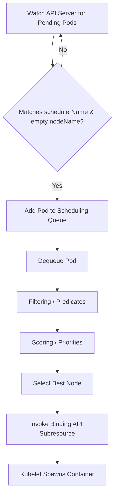

# Module 0-13-1: Pod Scheduling Predicates, Node Placement & Affinity

**Breadcrumbs:** [[0-Index - Kubernetes|🏠 Kubernetes Reference MOC]] > **Module 0-13-1**

---

## 1. Advanced Scheduling & Node Placement

The default Kubernetes scheduler (`kube-scheduler`) handles automatic pod placement. However, Kubernetes provides multiple mechanisms to bypass, influence, or completely replace the default scheduling logic.

### A. Manual Scheduling (Bypassing the Scheduler)
When a pod is created without a scheduler running, or when you need to bypass the scheduler entirely (e.g., during troubleshooting or for static administrative placement), you can manually schedule a Pod.

#### Method 1: Direct Node Binding via `spec.nodeName`
By setting the `spec.nodeName` field in the Pod specification, you bypass the scheduler's filtering and ranking phases. The Pod is directly assigned to the target node.
* **Mechanism:** The Kubelet on the specified node watches for pods with its node name, pulls the image, and starts the container. If the node is offline or does not exist, the Pod will remain unscheduled or fail.
* **Properties:**
  * `nodeName` is typically empty by default.
  * Setting it overrides any scheduling constraints, taints, or affinities.
  * It cannot be updated after Pod creation (it is immutable in a running Pod).

**Manifest Example:**
```yaml
apiVersion: v1
kind: Pod
metadata:
  name: manual-nginx
  labels:
    app: web
spec:
  nodeName: worker-1 # Bypasses the scheduler and binds directly to worker-1
  containers:
  - name: nginx
    image: nginx:alpine
    ports:
    - containerPort: 80
```

#### Method 2: Programmatic Binding via the Binding API Subresource
If a Pod is already created and stuck in a `Pending` state (e.g., because no scheduler is running), you cannot edit `spec.nodeName` directly. Instead, you must create a `Binding` object and submit it to the Pod's binding subresource via the Kubernetes API.
* **Endpoint:** `POST /api/v1/namespaces/{namespace}/pods/{pod-name}/binding`
* **Manifest Example (`binding.yaml`):**
  ```yaml
  apiVersion: v1
  kind: Binding
  metadata:
    name: pending-nginx # Must match the name of the pending pod
  target:
    apiVersion: v1
    kind: Node
    name: worker-1 # Node where the pod should be scheduled
  ```
* **Imperative Application (via `kubectl` raw POST):**
  Since the standard `kubectl` CLI doesn't have an imperative command like `kubectl bind`, you can submit the binding using `kubectl` via the raw API endpoint:
  ```bash
  kubectl post --raw "/api/v1/namespaces/default/pods/pending-nginx/binding" -f - <<EOF
  {
    "apiVersion": "v1",
    "kind": "Binding",
    "metadata": { "name": "pending-nginx" },
    "target": { "apiVersion": "v1", "kind": "Node", "name": "worker-1" }
  }
  EOF
  ```
  Alternatively, you can save the manifest to `binding.yaml` and create it using `kubectl create`:
  ```bash
  kubectl create -f binding.yaml
  ```
  *Note:* You cannot use `kubectl apply` or `kubectl replace` here because a Pod's binding is a one-time, write-once POST operation. Once a Pod is bound to a node, its `spec.nodeName` is permanently set.

---

### B. Labels and Selectors
Labels and Selectors are the core grouping and loose-coupling mechanism in Kubernetes. Unlike traditional systems that group resources via hardcoded hierarchical paths or arrays of IDs, Kubernetes uses labels (metadata attached to objects) and selectors (queries used to filter those labels) to create dynamic, flexible relationships between resources.

#### 1. Labels vs. Annotations (Purposes)
* **Labels:** Attaching identifying metadata used to group, filter, and select objects. Selectors query labels to route traffic, scale replicas, or match scheduling constraints.
* **Annotations:** Attaching non-identifying metadata (such as build info, client tool configurations, or API contract details). Unlike labels, annotations cannot be used by selectors to query or filter objects; they are intended for external tools, controllers, or API clients to store metadata.

#### 2. Labels on Pods vs Nodes
* **Pod Labels:** Key-value pairs attached to Pods at metadata level. They do not affect container execution but are used by controllers and Services to track, scale, and route traffic to Pods.
* **Node Labels:** Attached to worker nodes to define physical or logical node characteristics (e.g., zone, rack, disk speed, hardware accelerator like GPUs).
  * *Default labels* are added automatically by Kubelet/cloud-provider:
    ```bash
    kubernetes.io/hostname: "worker-node-1"
    topology.kubernetes.io/zone: "us-east-1a"
    kubernetes.io/arch: "amd64"
    kubernetes.io/os: "linux"
    ```
  * *Custom labels* can be added manually to nodes to represent custom environments:
    ```bash
    kubectl label nodes worker-1 storage-type=ssd hardware=gpu
    ```
  * To remove or override a label:
    ```bash
    # Remove a label (suffix with a minus sign)
    kubectl label nodes worker-1 storage-type-
    # Override an existing label (use --overwrite)
    kubectl label nodes worker-1 hardware=tpu --overwrite
    ```

#### 3. Usage of Selectors in Kubernetes Components
Selectors allow resources to dynamically find and bind to each other. Here is how different components use selectors:

```
    [ Service: app=web ]
            |
            | (Label Selector Query)
            v
   +-------------------------------------------------+
   |                                                 |
   v                                                 v
[ Pod A: app=web, tier=frontend ]   [ Pod B: app=web, tier=backend ]
```

* **Services (`spec.selector`):** A Service uses an equality-based selector to match Pod labels. It continuously queries the API server for Pods matching its selector, compiles their IP addresses into an `EndpointSlice`, and load-balances incoming traffic to them.
* **Deployments & ReplicaSets (`spec.selector`):** Deployments use selectors to determine which Pods they own. When the ReplicaSet controller sees fewer Pods matching its selector than the desired `replicas` count, it creates new Pods. If it sees more, it deletes the excess Pods.
* **NetworkPolicies (`spec.podSelector` / `spec.ingress.from.podSelector`):** NetworkPolicies use selectors to target a group of Pods and apply firewall rules, allowing traffic only from source Pods matching specific selectors.

#### 4. Selectors Syntax & Matching Logic
Kubernetes supports two levels of selector complexity:
1. **Equality-Based Selectors:**
   * Matches keys and values exactly. Used in services, replication controllers, and `nodeSelector`.
   * Operators:  = , == , !=
   * *Example Service Manifest:*
     ```yaml
     apiVersion: v1
     kind: Service
     metadata:
       name: web-service
     spec:
       selector:
         app: nginx
         env: prod  # Both must match (AND logic)
       ports:
       - port: 80
         targetPort: 8080
     ```
2. **Set-Based Selectors:**
   * Allows filtering keys according to a set of values, enabling complex queries. Used in Deployments, ReplicaSets, DaemonSets, NetworkPolicies, and Node/Pod Affinity.
   * Operators:
     * `In`: The label's value must match one of the specified values.
     * `NotIn`: The label's value must not match any of the specified values.
     * `Exists`: The key must exist on the resource, regardless of its value (the values array must be empty).
     * `DoesNotExist`: The key must not exist on the resource (the values array must be empty).
     * `Gt` (Greater than) / `Lt` (Less than): Used for numeric values (parsed as integers).

*Example syntax in a ReplicaSet (`matchExpressions`):*
```yaml
selector:
  matchLabels:
    app: webapp
  matchExpressions:
    - {key: tier, operator: In, values: [frontend, api]}
    - {key: environment, operator: NotIn, values: [dev]}
```

#### 💡 CKA Battle-Test FAQ: Selector Syntax & Behaviors

* **Q: Do we write = , == ,  or  != in YAML vs CLI?**
  * **In YAML Manifests:** Usually **no**. You express selectors as key-value pairs (e.g. `app: web`) or structured match expressions, and Kubernetes implicitly handles the equality checks.
  * **In CLI Commands (kubectl):** **Yes, you do write them.** When using the `-l` or `--selector` flag in kubectl commands, you must use these operators:
    ```bash
    # Equal checks
    kubectl get pods -l env=production
    # Not-equal checks
    kubectl get pods -l tier!=frontend
    ```
* **Q: What is the difference between = and == ?**
  * **None.** In Kubernetes CLI commands, both = and  ==  mean exact equality.
    ```bash
    kubectl get pods -l env=production
    # is exactly the same as:
    kubectl get pods -l env==production
    ```
* **Q: Do multiple labels in a selector map act as AND or OR?**
  * **AND logic.** If you list multiple labels in a selector map (or comma-separated in the CLI), they must **all** match for the Pod to be selected.
    ```yaml
    selector:
      app: web
      env: prod # Both 'app=web' AND 'env=prod' labels must be present
    ```
* **Q: What is a Set-Based Selector and why use it over Equality-Based?**
  * Equality-based selectors can only match a single exact value. If you want a resource (like a Service or Deployment) to select Pods matching a list of multiple values (e.g., matching env `production` OR `staging`, but not `development`), equality-based selectors cannot do this.
  * Set-based selectors allow SQL-like `IN` or `NOT IN` queries:    Breaking it down:
	`key: env`: Targets the specific metadata label key named `env`.
	`operator: In`: Specifies that the label's value must match any item in the `values` list.    - `values: [production, staging]`: The acceptable values for the key. Resources with labels like `env=production` or `env=staging` will be matched, while `env=dev` would be ignored. 
    ```yaml
    selector:
      matchExpressions:
        - {key: env, operator: In, values: [production, staging]}
    ```

---

### C. Taints and Tolerations (Repelling Workloads)
While node affinity attracts Pods to a set of nodes, **Taints and Tolerations** allow nodes to **repel** a set of Pods. They ensure that unauthorized Pods are not scheduled on dedicated or sensitive nodes (e.g., control plane nodes).

#### 1. Node Taints
A taint is applied to a node and consists of a `key`, a `value` (optional), and a `taint-effect`.
* **Command Syntax:**
  ```bash
  kubectl taint nodes <node-name> <key>=<value>:<taint-effect>
  ```
* **To remove a taint:** Append a hyphen `-` to the end of the effect:
  ```bash
  kubectl taint nodes <node-name> <key>=<value>:<taint-effect>-
  ```
* **Example:**
  ```bash
  kubectl taint nodes worker-1 dedicated=special-user:NoSchedule
  ```
* **Default Control Plane Taints:**
  By default, Kubernetes cluster bootstrappers (like `kubeadm`) automatically taint control plane/master nodes to prevent application workloads from scheduling on them. The default taints used are:
  * `node-role.kubernetes.io/master:NoSchedule` (legacy)
  * `node-role.kubernetes.io/control-plane:NoSchedule` (modern)
  To allow application pods to run on the control plane (e.g. in a single-node cluster), you can remove this taint using:
  ```bash
  kubectl taint nodes controlplane node-role.kubernetes.io/control-plane:NoSchedule-
  # or for legacy nodes:
  kubectl taint nodes controlplane node-role.kubernetes.io/master:NoSchedule-
  ```

#### 2. Taint Effects
There are three taint effects that govern how the scheduler treats Pods that do not tolerate the taint:
1. **`NoSchedule` (Hard Constraint):**
   * If a Pod does not have a matching toleration, it **cannot** be scheduled onto the node.
   * Existing running Pods on the node that lack the toleration are **unaffected**.
2. **`PreferNoSchedule` (Soft Constraint):**
   * The scheduler will try to avoid placing the Pod on the tainted node, but if no other resource-rich nodes are available, it will schedule the Pod there as a last resort.
3. **`NoExecute` (Eviction Trigger):**
   * If a taint with `NoExecute` is applied to a node, any running Pods on that node that do not tolerate this taint are **immediately evicted**.
   * If a Pod *does* tolerate the taint, it can remain running. However, if the toleration includes a `tolerationSeconds` parameter, the Pod will remain on the node for that specified time before being evicted:
     ```yaml
     tolerations:
     - key: "node.kubernetes.io/unreachable"
       operator: "Exists"
       effect: "NoExecute"
       tolerationSeconds: 300 # Stays for 5 minutes after node becomes unreachable, then evicts
     ```

> [!WARNING]
> **Toleration Seconds Restriction:** The `tolerationSeconds` parameter is **strictly ignored** for `NoSchedule` and `PreferNoSchedule` effects. Because these effects only control scheduling placement and do not trigger evictions, setting a time delay has no functional purpose. The API server will accept the field, but the scheduler will completely ignore it.

#### 3. Pod Tolerations
Tolerations are defined in the Pod's `spec.tolerations` field. To allow a Pod to be scheduled on a tainted node, the toleration must match the taint's key, value, and effect.
* **Operator `Equal`:** Requires both the key and value to match.
  ```yaml
  tolerations:
  - key: "dedicated"
    operator: "Equal"
    value: "special-user"
    effect: "NoSchedule"
  ```
* **Operator `Exists`:** Matches any value for the key. The `value` field must be omitted.
  ```yaml
  tolerations:
  - key: "dedicated"
    operator: "Exists"
    effect: "NoSchedule"
  ```
* **Empty Key with `Exists` Operator:** Matches all keys, values, and taints (useful for diagnostic pods).
  ```yaml
  tolerations:
  - operator: "Exists"
  ```
* **Omitted Effect (Wildcard):** If the `effect` field is omitted from a toleration block, it matches **all effects** (`NoSchedule`, `PreferNoSchedule`, and `NoExecute`) for that key:
  ```yaml
  tolerations:
  - key: "node.kubernetes.io/unreachable"
    operator: "Exists"
    tolerationSeconds: 300 # Matches unreachable taints for NoSchedule and NoExecute
  ```
* **Multi-Taint Scheduling Evaluation (Additive Rules):**
  * A single Node can have **multiple taints** concurrently in its `spec.taints` list (for example, both `NoSchedule` and `NoExecute` for the same failure key).
  * To be scheduled on the Node, a new Pod must tolerate **all taints** on the node. Lacking a toleration for even one taint (such as tolerating only `NoExecute` but not `NoSchedule`) will prevent the scheduler from placing the Pod there.
  * For already running Pods, a lack of a `NoSchedule` toleration does **not** trigger eviction (since `NoSchedule` only evaluates new placements). The running Pod only needs to tolerate the `NoExecute` taint to remain active on the node.


#### 4. Real-World Implementation Scenarios & Examples

##### Scenario 1: Dedicating GPU Nodes (NoSchedule)
* **Goal:** Dedicate GPU-enabled nodes exclusively to machine learning workloads, preventing regular workloads from running on expensive GPU resources.
* **Taint Command:**
  ```bash
  kubectl taint nodes worker-gpu hardware=gpu:NoSchedule
  ```
* **Regular Pod Manifest (No Toleration - Will fail to schedule on `worker-gpu`):**
  ```yaml
  apiVersion: v1
  kind: Pod
  metadata:
    name: regular-app
  spec:
    containers:
    - name: nginx
      image: nginx:alpine
  ```
* **ML Workload Manifest (With Toleration - Can run on `worker-gpu`):**
  ```yaml
  apiVersion: v1
  kind: Pod
  metadata:
    name: ml-app
  spec:
    containers:
    - name: tensor-model
      image: tensorflow/tensorflow:latest-gpu
    tolerations:
    - key: "hardware"
      operator: "Equal"
      value: "gpu"
      effect: "NoSchedule"
  ```

##### Scenario 2: Evacuating / Draining Nodes for Maintenance (NoExecute with Grace Period)
* **Goal:** Evacuate a node for emergency maintenance. Any pods running on it that do not have a toleration are immediately terminated and rescheduled. Critical system logging pods should stay for exactly 10 minutes to grab remaining logs before being evicted.
* **Taint Command:**
  ```bash
  kubectl taint nodes worker-1 maintenance=true:NoExecute
  ```
* **Critical Logging Pod Manifest (Allows 10-minute grace period):**
  ```yaml
  apiVersion: v1
  kind: Pod
  metadata:
    name: log-collector
  spec:
    containers:
    - name: fluentd
      image: fluentd:latest
    tolerations:
    - key: "maintenance"
      operator: "Equal"
      value: "true"
      effect: "NoExecute"
      tolerationSeconds: 600 # Pod remains on the node for 10 minutes before eviction
  ```

##### Scenario 3: Preferential Co-location (PreferNoSchedule)
* **Goal:** We have a node that has high resource consumption (overloaded node). We want to discourage the scheduler from placing pods on this node, but we allow it as a fallback if the cluster runs out of capacity.
* **Taint Command:**
  ```bash
  kubectl taint nodes worker-3 resource-state=high-load:PreferNoSchedule
  ```
* **Standard Pod:** No toleration is strictly required because it is a `PreferNoSchedule` taint. The scheduler ranks `worker-3` lower than other nodes, but it will place pods there if no other nodes are available.
* **Critical Pod (Ignores high-load warning to schedule normally on any node, including `worker-3`):**
  ```yaml
  apiVersion: v1
  kind: Pod
  metadata:
    name: critical-api
  spec:
    containers:
    - name: api-server
      image: my-api:latest
    tolerations:
    - key: "resource-state"
      operator: "Equal"
      value: "high-load"
      effect: "PreferNoSchedule"
  ```

##### Scenario 4: Diagnostic / Administrative Agent (Wildcard Toleration)
* **Goal:** Run a diagnostic container (e.g., node exporter, custom monitoring script) on *every* single node in the cluster, including the control plane node and dedicated database/GPU nodes.
* **Wildcard Toleration Manifest:**
  ```yaml
  apiVersion: v1
  kind: Pod
  metadata:
    name: cluster-diagnostics
  spec:
    containers:
    - name: node-exporter
      image: prom/node-exporter:latest
    tolerations:
    # This wildcard matches any taint key, value, or effect
    - operator: "Exists"
  ```

> [!NOTE]
> **Taints and Tolerations do not guarantee placement.**
> They only repel non-tolerating pods. A tolerating pod is *allowed* to run on the tainted node but is not *forced* to do so; it might still be scheduled on any other untainted node.

---

### D. Node Selectors (Simple Node Affinity)
`nodeSelector` is the simplest form of node selection constraint in Kubernetes. It is defined as a map of key-value pairs inside `spec.nodeSelector` in the Pod manifest.

* **Mechanism:** The scheduler matches the Pod's `nodeSelector` against the labels of all worker nodes in the cluster. For a node to be considered a valid candidate for the Pod, it **must contain all** of the key-value pairs specified in the Pod's `nodeSelector` (AND logic).
* **Limitations:**
  * Supports only exact equality matching.
  * Cannot evaluate set-based operations (e.g., placing a Pod on a node in zone `us-east-1a` OR `us-east-1b`).
  * Cannot define soft preferences (e.g., "prefer node with SSD, but schedule on HDD if SSD is full").

#### 🛠️ Step-by-Step Production Walkthrough: Targeting SSD Storage Nodes

##### Scenario:
You are deploying a high-performance database Pod (e.g., Elasticsearch) that requires fast SSD storage. You want to ensure it only schedules on worker nodes labeled with high-speed SSDs.

##### Step 1: Label the Target Worker Node
First, tag the specific worker node (`worker-node-1`) with a custom label indicating it has SSD storage:
```bash
# Add the custom label
kubectl label nodes worker-node-1 storage-type=ssd

# Verify the label is applied
kubectl get nodes worker-node-1 --show-labels
```

##### Step 2: Define the Pod Manifest with `nodeSelector`
In the Pod manifest, specify the `nodeSelector` targeting the label `storage-type: ssd`:
```yaml
apiVersion: v1
kind: Pod
metadata:
  name: database-pod
  labels:
    app: elasticsearch
spec:
  containers:
  - name: db-container
    image: elasticsearch:8.11.1
    ports:
    - containerPort: 9200
  nodeSelector:
    storage-type: ssd  # Matches the label we added to worker-node-1
```

##### Step 3: Scheduling Evaluation & Verification
When this Pod is submitted:
1. The `kube-scheduler` filters all nodes in the cluster.
2. Nodes that do not have the label `storage-type=ssd` are filtered out.
3. The scheduler assigns the Pod to `worker-node-1` because its labels match the selector.

To verify the Pod has scheduled successfully on the correct node:
```bash
# Check the NODE column in the output
kubectl get pod database-pod -o wide
```

##### 🔴 Failure Scenario: Unmatched Selectors
If you specify a selector that **matches****** no nodes in the cluster (e.g. `storage-type: nvme` when no nodes have this label):
1. The scheduler filters out all nodes.
2. The Pod remains in the **`Pending`** state.
3. Inspecting the events will show a `FailedScheduling` warning:
   ```bash
   kubectl describe pod database-pod
   
   # Event Output:
   # Warning  FailedScheduling  12s  default-scheduler  0/3 nodes are available: 3      node(s) didn't match Pod's node selector.
   ```

---

### E. Node Affinity (Advanced Placement Logic)
Node Affinity provides a rich set of constraints that extends the capabilities of `nodeSelector` by using set-based matching expressions and soft preferences.

#### 1. Rules: Required vs. Preferred
Node Affinity has two main types of rules (plus a planned third type):
1. **`requiredDuringSchedulingIgnoredDuringExecution` (Hard Affinity):**
   * The scheduler **must** find a node that matches the affinity rules. If no node matches, the Pod remains `Pending`.
2. **`preferredDuringSchedulingIgnoredDuringExecution` (Soft Affinity):**
   * The scheduler tries to find a node that matches the rules. If it cannot, it will schedule the Pod on a non-matching node.
   * You can assign a `weight` (from 1 to 100) to each preferred rule. The scheduler calculates scores for each node by adding weights of satisfied affinity terms. The node with the highest score is selected.
3. **`requiredDuringSchedulingRequiredDuringExecution` (Planned/Future Hard Execution Affinity):**
   * If a node's labels change at runtime such that the node no longer matches the Pod's affinity requirements, the Pod is immediately evicted (terminated) from the node.

> [!NOTE]
> **What does "IgnoredDuringExecution" mean?**
> If the labels of a node change while a Pod is running, or if the affinity rule changes, the running Pod **will not** be evicted from the node under currently available types (since execution status is ignored). It will continue to execute undisturbed. Only scheduling decisions are affected. Once `requiredDuringSchedulingRequiredDuringExecution` is supported, execution will no longer be ignored for that type.

#### 2. Match Expressions and Operator Logic
Node affinity uses `nodeSelectorTerms` and `matchExpressions`.
The operator field supports:
* `In`: Node label value must match one of the listed values.
* `NotIn`: Node label value must not match any of the listed values (useful for anti-affinity).
* `Exists`: A label with the specified key must exist on the node (the `values` array must be empty).
* `DoesNotExist`: A label with the specified key must not exist on the node (the `values` array must be empty).
* `Gt` / `Lt`: Node label value must be a number greater/less than the specified value (parsed as an integer).

**E2E Node Affinity Manifest Example:**
```yaml
apiVersion: v1
kind: Pod
metadata:
  name: affinity-pod
spec:
  affinity:
    nodeAffinity:
      requiredDuringSchedulingIgnoredDuringExecution:
        nodeSelectorTerms:
        - matchExpressions:
          - key: topology.kubernetes.io/zone
            operator: In
            values:
            - us-east-1a
            - us-east-1b
      preferredDuringSchedulingIgnoredDuringExecution:
      - weight: 80
        preference:
          matchExpressions:
          - key: disktype
            operator: In
            values:
            - ssd
      - weight: 20
        preference:
          matchExpressions:
          - key: size
            operator: Exists
  containers:
  - name: app
    image: my-app:v1
```

##### How Both Rules are Evaluated Together (Required & Preferred):
In this E2E example, **both blocks are used simultaneously**, but they are processed during different phases of the scheduling cycle:

1. **Filtering Phase (Predicates - `requiredDuringScheduling...`):**
   * The scheduler evaluates all nodes in the cluster and filters out any node that does not reside in zone `us-east-1a` or `us-east-1b`.
   * **Result:** If a node does not have the label `topology.kubernetes.io/zone: us-east-1a` or `topology.kubernetes.io/zone: us-east-1b`, it is **immediately disqualified** and cannot run the Pod, regardless of its disktype or size.

2. **Scoring Phase (Priorities - `preferredDuringScheduling...`):**
   * For the nodes that passed the filtering phase (i.e., those in the correct zones), the scheduler calculates a score to rank them.
   * **Result:** The scheduler checks the preferred rules:
     * If a zone-compliant node has the label `disktype: ssd`, it receives **+80** points.
     * If it has the label `size` (any value), it receives **+20** points.
     * The node with the highest cumulative score is selected to run the Pod. (If there is a tie, other scoring criteria like image locality are evaluated).

---

#### 3. Label Subset Match Evaluation (Node with 3 labels vs. Pod Selector)

When a worker node has multiple labels (e.g., 3 labels) and a Pod matches only some of them, the scheduling outcome depends on whether you are using `nodeSelector`, `requiredDuringScheduling...` (Hard Affinity), or `preferredDuringScheduling...` (Soft Affinity).

##### Scenario Setup:
* **Target Node (`worker-1`) Labels:**
  * `env: production`
  * `disktype: ssd`
  * `gpu: nvidia`
  * `cores: "8"`  # Numeric value stored as a string

---

##### Case A: Under `nodeSelector` (Simple Match)
* **Rule 1:** If the Pod asks for a **single** label:
  ```yaml
  nodeSelector:
    disktype: ssd # Matches Node
  ```
  * **Result:** **SUCCESS (Schedules).** The scheduler ignores the node's extra labels (`env` and `gpu`). As long as the requested label matches, it is allowed.
* **Rule 2:** If the Pod asks for **multiple** labels (Logical AND):
  ```yaml
  nodeSelector:
    disktype: ssd   # Matches Node
    region: us-east # Lacking on Node
  ```
  * **Result:** **FAILURE (Pending).** Multiple key-value pairs are evaluated as a logical `AND`. Since the node lacks `region: us-east`, it is disqualified.

---

##### Case B: Under `requiredDuringSchedulingIgnoredDuringExecution` (Hard Affinity)
* **Rule 1: Multiple Expressions within a Single Term (Logical AND)**
  ```yaml
  nodeSelectorTerms:
  - matchExpressions:
    - {key: env, operator: In, values: [production]}  # Matches Node
    - {key: disktype, operator: In, values: [nvme]}   # Lacking on Node
  ```
  * **Result:** **FAILURE (Pending).** All expressions inside a single list item are evaluated as logical `AND`. The node must have both.
* **Rule 2: Multiple Terms within `nodeSelectorTerms` (Logical OR)**
  ```yaml
  nodeSelectorTerms:
  - matchExpressions:
    - {key: env, operator: In, values: [production]}  # Term 1 (Matches Node)
  - matchExpressions:
    - {key: disktype, operator: In, values: [nvme]}   # Term 2 (Lacking)
  ```
  * **Result:** **SUCCESS (Schedules).** Multiple terms are evaluated as logical `OR`. Since Term 1 is fully satisfied by the node, the node is accepted.

---

##### Case C: Under `preferredDuringSchedulingIgnoredDuringExecution` (Soft Affinity)
* **Evaluation:**
  ```yaml
  preferredDuringSchedulingIgnoredDuringExecution:
  - weight: 80
    preference:
      matchExpressions:
      - {key: env, operator: In, values: [production]}  # Matches Node (+80)
  - weight: 20
    preference:
      matchExpressions:
      - {key: disktype, operator: In, values: [nvme]}   # Lacking (+0)
  ```
  * **Result:** **SUCCESS (Schedules).** Soft affinity does not block scheduling. Instead, it scores the node. The node scores `80 + 0 = 80`. If it is the highest-scoring available node, the Pod will run there.

---

##### Case D: Set-Based Operators Evaluation (`NotIn`, `Exists`, `DoesNotExist`, `Gt`, `Lt`)

Using the same `worker-1` labels, let's evaluate each set-based operator in `requiredDuringSchedulingIgnoredDuringExecution`:

###### 1. `NotIn` Operator (Exclusion)
* **Rule Example:**
  ```yaml
  - {key: env, operator: NotIn, values: [staging, development]}
  ```
  * **Result:** **SUCCESS (Schedules).**
  * **Mechanical Breakdown:**
    * `key: env`: Targets the `env` label key on `worker-1` (value is `production`).
    * `operator: NotIn`: Evaluates whether the node's value is **not** present in the `values` array.
    * `values: [staging, development]`: Since `production` is not in this list, the expression evaluates to `true` (success).

###### 2. `Exists` Operator (Presence Check)
* **Rule Example:**
  ```yaml
  - {key: gpu, operator: Exists}
  ```
  * **Result:** **SUCCESS (Schedules).**
  * **Mechanical Breakdown:**
    * `key: gpu`: Looks for the presence of the key `gpu` on the node.
    * `operator: Exists`: Verifies if the key exists, regardless of what value it holds. The `values` list must be omitted or left empty.
    * **Evaluation:** Since `worker-1` has the label `gpu: nvidia`, the check succeeds.

###### 3. `DoesNotExist` Operator (Absence Check)
* **Rule Example:**
  ```yaml
  - {key: local-storage, operator: DoesNotExist}
  ```
  * **Result:** **SUCCESS (Schedules).**
  * **Mechanical Breakdown:**
    * `key: local-storage`: Searches for the key `local-storage` on the node.
    * `operator: DoesNotExist`: Verifies that this key is **not** defined.
    * **Evaluation:** Since `worker-1` does not have a `local-storage` label, the check succeeds. (If the node had `local-storage: none`, this check would fail).

###### 4. `Gt` Operator (Greater Than - Numeric)
* **Rule Example:**
  ```yaml
  - {key: cores, operator: Gt, values: ["4"]}
  ```
  * **Result:** **SUCCESS (Schedules).**
  * **Mechanical Breakdown:**
    * `key: cores`: Targets the `cores` label on `worker-1` (value is `"8"`).
    * `operator: Gt`: Parses both the node's label value and the `values` list item as integers, performing a greater-than comparison (`8 > 4`).
    * `values: ["4"]`: The single threshold value (must be represented as a string list in YAML, but is parsed numerically).
    * **Evaluation:** Since `8` is greater than `4`, the check succeeds.

###### 5. `Lt` Operator (Less Than - Numeric)
* **Rule Example:**
  ```yaml
  - {key: cores, operator: Lt, values: ["4"]}
  ```
  * **Result:** **FAILURE (Pending).**
  * **Mechanical Breakdown:**
    * `key: cores`: Targets the `cores` label on `worker-1` (value is `"8"`).
    * `operator: Lt`: Performs a numeric less-than check (`8 < 4`).
    * `values: ["4"]`: The threshold value.
    * **Evaluation:** Since `8` is not less than `4`, the check fails, and the node is disqualified.

---

### F. Taints/Tolerations vs. Node Affinity combination scenarios (repel vs attract)
A common requirement in production is dedicating a set of nodes to a specific department, customer, or workload type (e.g., GPU-enabled nodes for Machine Learning).

| Mechanism                       | Behavior                                                   | Result on Target Nodes                              | Result on General Nodes                                        | Exclusivity                               |
| :------------------------------ | :--------------------------------------------------------- | :-------------------------------------------------- | :------------------------------------------------------------- | :---------------------------------------- |
| **Taints & Tolerations Only**   | Node repels pods without tolerations                       | Dedicated nodes only host our target workload pods. | Target workload pods can still run on standard worker nodes.   | ❌ Partial (Node is exclusive, Pod is not) |
| **Node Affinity Only**          | Pod is attracted to target nodes                           | Dedicated nodes can still host other general pods.  | Target workload pods are forced onto dedicated nodes.          | ❌ Partial (Pod is exclusive, Node is not) |
| **Combined (Taint + Affinity)** | Node repels general pods; Pod is attracted to target nodes | Dedicated nodes **only** host target workload pods. | Target workload pods are **never** scheduled on general nodes. | 🌟 **100% Exclusive**                     |

#### Understanding Exclusivity (Node vs. Pod perspective):

To achieve true isolation in production, we must evaluate exclusivity from both directions:

1. **Node Exclusivity (The Node's perspective):**
   * **Definition:** Ensuring that standard, non-target workload Pods (e.g., standard nginx, frontend apps) cannot schedule onto our dedicated node and consume resources.
   * **Enforced by:** **Taints & Tolerations**. The Taint acts as a "No Trespassing" sign that repels any Pod that doesn't have the matching Toleration.

2. **Pod Exclusivity (The Pod's perspective):**
   * **Definition:** Ensuring that our special target workload Pods (e.g., GPU-dependent ML jobs) are forced to schedule *only* on the dedicated nodes, and are not placed on general worker nodes (where they might crash due to lack of GPU drivers).
   * **Enforced by:** **Node Affinity**. The affinity acts as a magnet that attracts and locks the Pod to the labeled node.

---

#### Step-by-Step Scenario: Dedicating GPU Nodes to ML Workloads
1. **Label the GPU Nodes:**
   ```bash
   kubectl label nodes node-gpu-1 hardware=gpu
   ```
2. **Taint the GPU Nodes (repels all other pods):**
   ```bash
   kubectl taint nodes node-gpu-1 hardware=gpu:NoSchedule
   ```
3. **Configure the ML Pod (Attract + Tolerate):**
   ```yaml
   apiVersion: v1
   kind: Pod
   metadata:
     name: ml-training-pod
   spec:
     tolerations:
     - key: "hardware"
       operator: "Equal"
       value: "gpu"
       effect: "NoSchedule"
     affinity:
       nodeAffinity:
         requiredDuringSchedulingIgnoredDuringExecution:
           nodeSelectorTerms:
           - matchExpressions:
             - key: hardware
               operator: In
               values:
               - gpu
     containers:
     - name: cuda-container
       image: nvidia/cuda:11.0-base
   ```

---

### G. Multiple Custom Schedulers
Kubernetes allows running multiple custom schedulers simultaneously alongside the default scheduler. You can write your own scheduler or configure another instance of the default `kube-scheduler` with custom parameters.

#### 1. Custom Scheduler Reconciliation Loop
A custom scheduler runs as a controller that continually reconciles the state of unscheduled pods. The core logic operates as an event-driven loop executing the following steps:



1. **Informer / Watch Phase:** The scheduler subscribes to API server events to watch for Pod additions or updates. It filters for Pods in a `Pending` state where `spec.nodeName` is empty and `spec.schedulerName` matches the custom scheduler's identifier.
2. **Queueing Phase:** Valid Pods are sorted and pushed into a scheduling queue (e.g. prioritized by scheduling PriorityClass).
3. **Filtering (Predicates):** The scheduler evaluates all cluster nodes to filter out nodes that cannot run the Pod. It checks resource capacity (CPU/RAM), node port availability, node taints, node selectors, and node affinity rules.
4. **Scoring (Priorities):** For all nodes that passed the filtering phase, the scheduler runs scoring algorithms to rank them. Scoring can favor nodes that already have required container images (image locality), spread Pods across topologies (anti-affinity), or fit resources optimally.
5. **Selection:** The node with the highest cumulative score is selected.
6. **Binding Phase:** The scheduler calls the Pod's `/binding` API subresource. This is an atomic operation that sets the `spec.nodeName` of the Pod, which signals the Kubelet on the target node to start pulling images and executing the container.

#### 2. Custom Scheduler Configuration (`KubeSchedulerConfiguration`)
Custom schedulers are configured using a configuration file instead of legacy command-line flags.
* **Example configuration (`my-scheduler-config.yaml`):**
  ```yaml
  apiVersion: kubescheduler.config.k8s.io/v1
  kind: KubeSchedulerConfiguration
  leaderElection:
    leaderElect: true
    resourceName: my-custom-scheduler
    resourceNamespace: kube-system
  profiles:
    - schedulerName: my-custom-scheduler
  ```
  > [!IMPORTANT]
  > **Reconciliation Loop & Leader Election Leases in HA Mode:**
  >
  > 1. **Reconciliation Loop:** Both the default `kube-scheduler` and any custom scheduler utilize a **Reconciliation Loop** (control loop) by default. The loop constantly monitors the API server for unscheduled pods and takes actions to bind them to nodes, reconciling the actual state with the desired state.
  >
  > 2. **Leader Election & Leases:** When running multiple instances of a scheduler for High Availability (HA) (to avoid a single point of failure), you only want **one** instance actively making scheduling decisions at any given time. If two instances scheduled the same Pod simultaneously, it would cause scheduling conflicts. 
  >    * Kubernetes uses a **Lease** object (a distributed lock in `kube-system`) to nominate a "Leader" instance. Only the leader schedules pods; the standby instances wait.
  >    * **The unique lease resource name (`resourceName`):** Each scheduler deployment must acquire its own distinct lock. The default scheduler uses a lease named `kube-scheduler`. If your custom scheduler configuration also uses `kube-scheduler`, they will fight for the same lock, continuously evicting each other.
  >
  > **Example of Lock Conflict vs. Correct Separation:**
  >
  > * **Incorrect Configuration (Collision):**
  >   ```yaml
  >   # My Custom Scheduler Config
  >   leaderElection:
  >     leaderElect: true
  >     resourceName: kube-scheduler # COLLISION! Fights with the default scheduler lock
  >   ```
  > * **Correct Configuration (Isolated):**
  >   ```yaml
  >   # My Custom Scheduler Config
  >   leaderElection:
  >     leaderElect: true
  >     resourceName: my-custom-scheduler-lease # Isolated lease lock
  >   ```
  >   * **How to verify the lease exists in the cluster:**
  >     ```bash
  >     # View active leases in the kube-system namespace
  >     kubectl get leases -n kube-system
  >     
  >     # Expected Output:
  >     # NAME                         HOLDER                                  AGE
  >     # kube-scheduler               controlplane-1                          10d
  >     # my-custom-scheduler-lease    custom-scheduler-deployment-abc-123     12h
  >     ```

#### 3. Installation Options
You can deploy a custom scheduler either as a static Pod (on control plane hosts) or as a Deployment inside the cluster.

##### Option A: Static Pod Manifest
On control plane nodes, you can place a manifest in `/etc/kubernetes/manifests/my-custom-scheduler.yaml`:
```yaml
apiVersion: v1
kind: Pod
metadata:
  name: my-custom-scheduler
  namespace: kube-system
spec:
  hostNetwork: true
  containers:
  - name: scheduler
    image: registry.k8s.io/kube-scheduler:v1.30.0 # Match cluster version
    command:
    - kube-scheduler
    - --config=/etc/kubernetes/scheduler/my-scheduler-config.yaml
    - --v=2
    volumeMounts:
    - name: config-volume
      mountPath: /etc/kubernetes/scheduler
  volumes:
  - name: config-volume
    hostPath:
      path: /etc/kubernetes/scheduler
```

##### Option B: Standard Kubernetes Deployment (using ConfigMap for config)
1. **Create the ConfigMap holding the scheduler configuration:**
   ```bash
   kubectl create configmap my-scheduler-config --from-file=my-scheduler-config.yaml -n kube-system
   ```
2. **Configure RBAC Permissions for the Scheduler:**
   Create a manifest `my-scheduler-rbac.yaml` to grant the custom scheduler's ServiceAccount permissions equivalent to the default scheduler (such as accessing Pods and creating Bindings):
   ```yaml
   apiVersion: v1
   kind: ServiceAccount
   metadata:
     name: my-custom-scheduler-sa
     namespace: kube-system
   ---
   apiVersion: rbac.authorization.k8s.io/v1
   kind: ClusterRoleBinding
   metadata:
     name: my-custom-scheduler-as-kube-scheduler
   subjects:
   - kind: ServiceAccount
     name: my-custom-scheduler-sa
     namespace: kube-system
   roleRef:
     kind: ClusterRole
     name: system:kube-scheduler
     apiGroup: rbac.authorization.k8s.io
   ---
   apiVersion: rbac.authorization.k8s.io/v1
   kind: ClusterRoleBinding
   metadata:
     name: my-custom-scheduler-as-volume-scheduler
   subjects:
   - kind: ServiceAccount
     name: my-custom-scheduler-sa
     namespace: kube-system
   roleRef:
     kind: ClusterRole
     name: system:volume-scheduler
     apiGroup: rbac.authorization.k8s.io
   ---
   apiVersion: rbac.authorization.k8s.io/v1
   kind: RoleBinding
   metadata:
     name: my-custom-scheduler-extension-apiserver-authentication-reader
     namespace: kube-system
   subjects:
   - kind: ServiceAccount
     name: my-custom-scheduler-sa
     namespace: kube-system
   roleRef:
     kind: Role
     name: extension-apiserver-authentication-reader
     apiGroup: rbac.authorization.k8s.io
   ```
   Apply it:
   ```bash
   kubectl apply -f my-scheduler-rbac.yaml
   ```
3. **Deploy the Scheduler:**
   Create a manifest `my-scheduler-deployment.yaml`:
   ```yaml
   apiVersion: apps/v1
   kind: Deployment
   metadata:
     name: my-custom-scheduler
     namespace: kube-system
   spec:
     replicas: 1
     selector:
       matchLabels:
         app: my-custom-scheduler
     template:
       metadata:
         labels:
           app: my-custom-scheduler
       spec:
         serviceAccountName: my-custom-scheduler-sa
         containers:
         - name: scheduler
           image: registry.k8s.io/kube-scheduler:v1.30.0
           command:
           - kube-scheduler
           - --config=/etc/kubernetes/scheduler/my-scheduler-config.yaml
           - --v=2
           volumeMounts:
           - name: config-volume
             mountPath: /etc/kubernetes/scheduler
         volumes:
         - name: config-volume
           configMap:
             name: my-scheduler-config
   ```
   Apply it:
   ```bash
   kubectl apply -f my-scheduler-deployment.yaml
   ```

#### 4. Assigning Schedulers to Pods
To request that a Pod be scheduled by your custom scheduler rather than the default one, define the `spec.schedulerName` field in the Pod manifest:
```yaml
apiVersion: v1
kind: Pod
metadata:
  name: custom-nginx
spec:
  schedulerName: my-custom-scheduler # Instructs custom-scheduler to handle it
  containers:
  - name: nginx
    image: nginx:alpine
```
*Note: If `schedulerName` is omitted, it defaults to `default-scheduler`.*

#### 5. Monitoring and Logs
* **Events:** You can verify that your custom scheduler placed the pod by checking Events:
  ```bash
  kubectl get events -n default --sort-by='.metadata.creationTimestamp'
  ```
  Look for:
  `Successfully assigned default/custom-nginx to worker-1 by my-custom-scheduler`
* **Logs:** Review the logs of the scheduler pod to debug filtering and ranking logic:
  ```bash
  kubectl logs -n kube-system -l app=my-custom-scheduler
  ```

#### 6. Custom Scheduler Binding API Walkthrough (Python & Bash)

When writing a custom scheduler, instead of patching `spec.nodeName` directly (which is immutable on the Pod resource), you must use the Pod's `/binding` subresource. This subresource is a specialized endpoint that atomically assigns a Pod to a Node.

Below are two implementations demonstrating how to watch the API, select a node, and invoke the `/binding` subresource.

##### Python Implementation
This implementation uses the official Kubernetes Python Client library. It monitors the cluster for pending pods assigned to `my-custom-scheduler`, performs basic node filtering, and posts the binding object.

```python
import time
import random
from kubernetes import client, config, watch

def run_custom_scheduler():
    # Load kubeconfig for local testing or incluster config when running inside a Pod
    try:
        config.load_incluster_config()
    except config.ConfigException:
        config.load_kube_config()

    v1 = client.CoreV1Api()
    scheduler_name = "my-custom-scheduler"
    print(f"Starting custom scheduler loop for '{scheduler_name}'...")

    # Watch for Pod events across all namespaces
    w = watch.Watch()
    for event in w.stream(v1.list_pod_for_all_namespaces):
        pod = event['object']
        
        # We only care about Pending pods matching our scheduler name that do not have a node assigned
        if (pod.status.phase == "Pending" and 
            pod.spec.scheduler_name == scheduler_name and 
            not pod.spec.node_name):
            
            print(f"Detected Pod requiring scheduling: {pod.metadata.namespace}/{pod.metadata.name}")
            
            try:
                # 1. Gather all nodes in the cluster
                nodes = v1.list_node().items
                eligible_nodes = []
                
                for node in nodes:
                    # Filter out nodes that are not Ready
                    is_ready = any(c.type == 'Ready' and c.status == 'True' for c in node.status.conditions)
                    
                    # Filter out nodes with incompatible NoSchedule taints
                    has_unsatisfied_taint = False
                    if node.spec.taints:
                        for taint in node.spec.taints:
                            if taint.effect == 'NoSchedule':
                                tolerated = False
                                if pod.spec.tolerations:
                                    for tol in pod.spec.tolerations:
                                        if (tol.key == taint.key and 
                                            (tol.operator == 'Exists' or tol.value == taint.value)):
                                            tolerated = True
                                            break
                                if not tolerated:
                                    has_unsatisfied_taint = True
                                    break
                                    
                    if is_ready and not has_unsatisfied_taint:
                        eligible_nodes.append(node.metadata.name)
                
                if not eligible_nodes:
                    print(f"Warning: No eligible nodes available for {pod.metadata.name}")
                    continue
                
                # 2. Select a target node (Random allocation for simplicity)
                target_node = random.choice(eligible_nodes)
                print(f"Selected target node '{target_node}' for Pod '{pod.metadata.name}'")
                
                # 3. Create the Binding payload
                binding = client.V1Binding(
                    api_version="v1",
                    kind="Binding",
                    metadata=client.V1ObjectMeta(
                        name=pod.metadata.name,
                        namespace=pod.metadata.namespace
                    ),
                    target=client.V1ObjectReference(
                        api_version="v1",
                        kind="Node",
                        name=target_node
                    )
                )
                
                # 4. Invoke the POST binding API endpoint
                v1.create_namespaced_pod_binding(
                    name=pod.metadata.name,
                    namespace=pod.metadata.namespace,
                    body=binding
                )
                print(f"Successfully bound pod {pod.metadata.name} to {target_node}")
                
            except client.exceptions.ApiException as e:
                print(f"API Exception during scheduling: {e}")
            except Exception as e:
                print(f"Unexpected error: {e}")

if __name__ == "__main__":
    run_custom_scheduler()
```

##### Bash Implementation
This shell script uses `kubectl` to watch for Pods and executes a raw `curl` POST command against the API server's `/binding` endpoint using the pod's service account credentials.

```bash
#!/bin/bash
set -euo pipefail

SCHEDULER_NAME="my-custom-scheduler"
APISERVER="https://kubernetes.default.svc"
SERVICEACCOUNT="/var/run/secrets/kubernetes.io/serviceaccount"
TOKEN=$(cat "${SERVICEACCOUNT}/token")
CACERT="${SERVICEACCOUNT}/ca.crt"

echo "Monitoring Kubernetes API for Pods with schedulerName=${SCHEDULER_NAME}..."

# Watch loop for pods in all namespaces matching the schedulerName
kubectl get pods -A -w -o json | jq --unbuffered -c '. | select(.status.phase == "Pending" and .spec.schedulerName == "'"${SCHEDULER_NAME}"'" and .spec.nodeName == null)' | while read -r pod; do
  NAMESPACE=$(echo "$pod" | jq -r '.metadata.namespace')
  POD_NAME=$(echo "$pod" | jq -r '.metadata.name')
  
  echo "Discovered pending pod: ${NAMESPACE}/${POD_NAME}"
  
  # Select a node that is Ready (filtering out untolerated NoSchedule taints is simplified here)
  TARGET_NODE=$(kubectl get nodes -o json | jq -r '.items[] | select(.status.conditions[] | select(.type=="Ready" and .status=="True")) | .metadata.name' | head -n 1)
  
  if [ -z "${TARGET_NODE}" ]; then
    echo "Error: No Ready nodes found to bind Pod ${POD_NAME}"
    continue
  fi
  
  echo "Binding Pod ${POD_NAME} to Node ${TARGET_NODE} via API subresource..."
  
  # Invoke POST /api/v1/namespaces/{namespace}/pods/{pod-name}/binding
  STATUS_CODE=$(curl -s -o /dev/null -w "%{http_code}" -X POST \
    --cacert "${CACERT}" \
    -H "Authorization: Bearer ${TOKEN}" \
    -H "Content-Type: application/json" \
    -d '{
      "apiVersion": "v1",
      "kind": "Binding",
      "metadata": {
        "name": "'"${POD_NAME}"'"
      },
      "target": {
        "apiVersion": "v1",
        "kind": "Node",
        "name": "'"${TARGET_NODE}"'"
      }
    }' \
    "${APISERVER}/api/v1/namespaces/${NAMESPACE}/pods/${POD_NAME}/binding")
    
  if [ "$STATUS_CODE" -eq 201 ]; then
    echo "Success: Bound ${POD_NAME} to ${TARGET_NODE} (HTTP 201)"
  else
    echo "Failed: API Server returned HTTP status ${STATUS_CODE}"
  fi
done
```

---

### H. DaemonSets (Node-Level Scheduling)
A **DaemonSet** (`apps/v1`) ensures that a single copy of a specific Pod runs on all (or selected) nodes in the cluster.
* **Scheduling Mechanics Evolution:**
  * **Legacy Scheduling (Prior to v1.12):** The DaemonSet controller bypassed the `kube-scheduler` entirely by setting the `spec.nodeName` field directly on the Pod at creation time.
  * **Modern Scheduling (v1.12+):** DaemonSets are **scheduler-driven**. The DaemonSet controller automatically adds Node Affinity rules (`requiredDuringSchedulingIgnoredDuringExecution`) to the Pod specification, and the default scheduler places the Pods onto their target nodes. This ensures DaemonSets respect scheduler features (like scheduling queue sorting, scheduling gates, and priority).
* **Taints and Tolerations:** The DaemonSet controller automatically appends necessary tolerations to the Pod template to ensure that DaemonSet Pods (e.g. CNI plugins or log collectors) can schedule on tainted nodes (such as the default control plane node, or cordoned/unschedulable nodes).

---

### I. Static Pods
**Static Pods** are managed directly by the Kubelet daemon on a specific node without the supervision or intervention of the control plane (API Server, Controller Manager, Scheduler).
* **Kubelet Configuration Pathways:**
  * **Manifest Path Flag:** Pass the `--pod-manifest-path` option to the Kubelet binary.
  * **Config File Option (Common):** Pass `--config=/var/lib/kubelet/config.yaml` to the Kubelet, and specify `staticPodPath: /etc/kubernetes/manifests` inside the configuration file.
* **Checking and Troubleshooting Static Pods:**
  * **When API Server is Offline:** Since `kubectl` queries the API Server, running `kubectl get pods` will fail. You must access the host node and query the container runtime socket directly:
    ```bash
    crictl ps
    # or for older Docker-based runtimes:
    docker ps
    ```
  * **Mirror Pods & Naming Conventions:** When a node joins a cluster, the Kubelet creates a read-only **Mirror Pod** in the API Server for visibility. 
    * Mirror Pod names follow the naming convention `<pod-name>-<node-name>` (e.g. `static-busybox-controlplane`).
    * You cannot edit or delete a static pod via the API server (`kubectl delete pod` will delete the mirror pod representation, but the Kubelet will recreate it immediately). To delete the static pod, you must delete its manifest file from the node's static pod directory.

---
