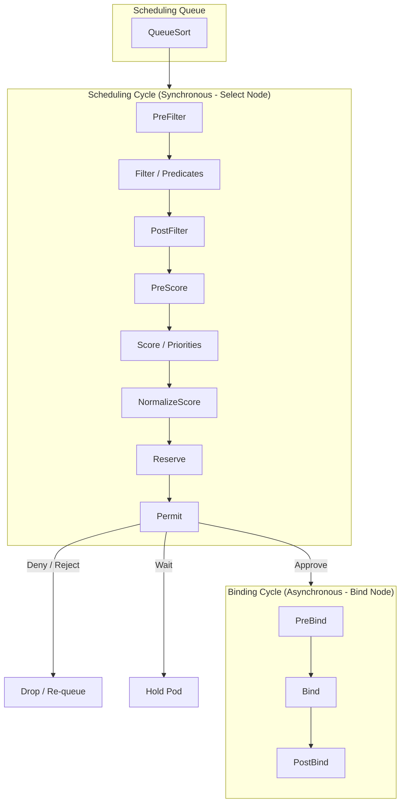
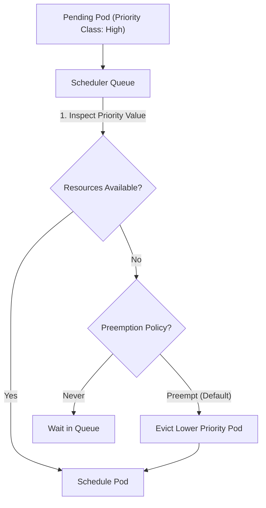

# Module 0-13-2: Advanced Scheduling, Topology Spread & Eviction Mechanics

**Breadcrumbs:** [[0-Index - Kubernetes|🏠 Kubernetes Reference MOC]] > **Module 0-13-2**

---

## 5. Advanced Scheduling & Eviction Control

As cluster architectures scale, the `kube-scheduler` and node agents require more advanced placement constraints, performance tuning, and eviction triggers.

### 5.1 Topology Spread Constraints
**Topology Spread Constraints** allow you to distribute Pods across different failure domains (zones, nodes, or regions) to achieve high availability. Unlike node anti-affinity (which is binary: yes or no), spread constraints allow you to define a tolerated imbalance or skew.

*   **`maxSkew`:** The maximum difference in the number of Pods between any two topology domains. It must be a positive integer.
*   **`topologyKey`:** The node label that identifies the failure domain (e.g. `topology.kubernetes.io/zone`, `kubernetes.io/hostname`).
*   **`whenUnsatisfiable`:** Dictates what to do if the constraint cannot be met:
    *   `DoNotSchedule`: (Hard constraint) The Pod remains `Pending` if the skew cannot be satisfied.
    *   `ScheduleAnyway`: (Soft constraint) The scheduler still schedules the Pod but prioritizes minimizing the skew.
*   **`labelSelector`:** Identifies which Pods are counted in the spread calculation.

```yaml
# Example Topology Spread Constraint
apiVersion: apps/v1
kind: Deployment
metadata:
  name: app-frontend
spec:
  replicas: 4
  selector:
    matchLabels:
      app: web
  template:
    metadata:
      labels:
        app: web
    spec:
      topologySpreadConstraints:
      - maxSkew: 1
        topologyKey: topology.kubernetes.io/zone
        whenUnsatisfiable: DoNotSchedule
        labelSelector:
          matchLabels:
            app: web
```

---

### 5.2 Pod Scheduling Readiness (Scheduling Gates)
Introduced to prevent the scheduler from wasting processing cycles on Pods that are blocked by external dependencies (e.g., quota checks, security scans, data migrations).
*   **`spec.schedulingGates`:** An array of gate names. If present, the Pod is marked as "parked" and is not considered for scheduling.
*   **Removal:** A controller or operator removes the gate by patching the Pod spec to clear the gate name. Once the array is empty, the Pod enters the active scheduling queue.

```yaml
apiVersion: v1
kind: Pod
metadata:
  name: gated-pod
spec:
  schedulingGates:
  - name: example.com/quota-check
  containers:
  - name: app
    image: nginx
```
*To release the gate:*
```bash
kubectl patch pod gated-pod --type='json' -p='[{"op": "remove", "path": "/spec/schedulingGates"}]'
```

---

### 5.3 The Scheduling Framework & Extension Points
The **Scheduling Framework** is a pluggable architecture within the `kube-scheduler` that permits custom plugins to extend the scheduler's logic without rebuilding the binary.

The scheduling process is split into two distinct cycles:
1.  **Scheduling Cycle (Synchronous):** Evaluates nodes and selects the best one for the Pod (running sequentially for one Pod at a time).
2.  **Binding Cycle (Asynchronous):** Applies the binding to the API server (can run concurrently for multiple Pods).



#### Key Extension Points & Hooks:
*   **`QueueSort`:** Sorts Pods in the active scheduling queue.
*   **`PreFilter` & `Filter`:** Evaluates node constraints (replaces the legacy "Predicates" check).
*   **`PreScore` & `Score`:** Scores nodes to rank them (replaces the legacy "Priority" functions).
*   **`Reserve`:** Reserves the node resources on the scheduler's local memory cache before writing the binding to the API server.
*   **`Permit`:** Can approve, deny, or delay (wait) the scheduling decision (useful for batch/gang scheduling).
*   **`Bind`:** Invokes the API to write the `Binding` resource.

##### 🔒 Systems Rationale: The Reserve/Unreserve Cache Lock and Double-Booking Mitigation

To maintain high scheduling throughput (hundreds of pods per second), Kubernetes separates finding a node from writing the binding:
1. **Scheduling Cycle (Synchronous & Fast):** Runs sequentially inside the scheduler's local memory to pick the best node.
2. **Binding Cycle (Asynchronous & Slow):** Sends a network request to the API server to persist the placement (`etcd` write).

###### The Race Condition (Double-Booking Problem):
Without a reservation stage, the scheduler would start evaluating the next pod in the queue before the API server finished writing the binding of the previous pod. If a node has 2 CPUs free, and two concurrent pods each request 2 CPUs, querying the API server sequentially would result in both pods seeing the node as "available" (since the first binding hasn't been written to `etcd` yet). This leads to **double-booking (resource overcommitment)**.

###### The Reserve Cache Lock Solution:
To prevent this, the `Reserve` phase acts as an **optimistic local cache lock**:
*   As soon as a node is chosen, the scheduler immediately subtracts the pod's resource requests from that node's capacity in the scheduler's **local memory cache** (`SchedulerCache`).
*   Subsequent pods evaluated milliseconds later read this updated local cache, seeing the node's resources as already occupied, thus routing safely elsewhere.
*   **Rollback (`Unreserve`):** If the asynchronous Binding cycle subsequently fails (e.g. network timeout or API rejection), the scheduler triggers `Unreserve` to add the resources back to the node in the local cache, keeping the memory state aligned with the cluster's reality.

---

### 5.4 Pod Priority and Preemption

When resources are scarce, Kubernetes can terminate or evict lower-priority workloads to make room for higher-priority critical services. This is controlled by cluster-scoped **PriorityClass** resources.

#### 1. Priority Ranges & Defaults
*   **Object Scope:** PriorityClasses are non-namespaced (cluster-scoped) resources. Once defined, they can be referenced by any Pod across any namespace.
*   **User Application Range:** Defined using a 32-bit integer from `-2,000,000,000` to `1,000,000,000`. Larger numbers indicate higher priority.
*   **System Critical Range:** Integers from `2,000,000,001` to `2,000,000,000` (or up to `2,000,001,000`) are reserved for system-critical components (such as `kube-apiserver` or `kubelet` daemons) to prevent them from being preempted by user applications.
*   **System Classes:** By default, Kubernetes includes:
    *   `system-node-critical` (Value: `2000001000`)
    *   `system-cluster-critical` (Value: `2000000000`)
*   **Default Pod Priority:** Pods without an explicit `priorityClassName` are assigned a default priority value of `0`. You can change this behavior by marking a single PriorityClass with `globalDefault: true`. Only one PriorityClass in the cluster can be the global default.

#### 2. Define a PriorityClass
```yaml
apiVersion: scheduling.k8s.io/v1
kind: PriorityClass
metadata:
  name: high-priority-db
value: 1000000                  # Numeric priority value
globalDefault: false            # If true, sets this as default for all pods without priorityClassName
preemptionPolicy: PreemptLowerPriority # PreemptLowerPriority (default) or Never
description: "Used for core database pods."
```

#### 3. Pod Specification Mapping
Reference the PriorityClass name inside the Pod spec:
```yaml
apiVersion: v1
kind: Pod
metadata:
  name: critical-db-pod
spec:
  priorityClassName: high-priority-db
  containers:
  - name: mysql
    image: mysql
```

#### 4. Preemption Policies
The scheduling behavior of a pending pod when resources are fully consumed is dictated by its `preemptionPolicy`:
*   **`PreemptLowerPriority` (Default):** The scheduler enters the preemption phase, identifies a node where evicting lower-priority pods will free up enough resources, evicts those lower-priority pods (sending them `SIGTERM`), and schedules the higher-priority pod.
*   **`Never` (Non-Preempting):** The pod behaves as non-preempting. It will **never** trigger the eviction or termination of lower-priority workloads. Instead, it remains in the scheduling queue, waiting for resources to free up naturally. However, once resources do free up, it is still prioritized for scheduling over other lower-priority pods also waiting in the queue.

#### 5. CLI Management
```bash
# List all priority classes in the cluster
kubectl get priorityclasses
# or
kubectl get pc

# Imperatively create a basic PriorityClass
kubectl create priorityclass high-priority --value=1000 --description="high priority"

# Imperatively create a default PriorityClass (global default)
kubectl create priorityclass default-priority --value=1000 --global-default=true --description="default priority"

# Imperatively create a non-preempting PriorityClass
kubectl create priorityclass non-preempting --value=1000 --preemption-policy="Never" --description="non-preempting priority"

# Dry-run generate PriorityClass YAML
kubectl create priorityclass fast-lane --value=500000 --dry-run=client -o yaml
```

#### 6. Detailed Pod Preemption Flow


1.  A high-priority Pod is created but cannot find a node with enough resources.
2.  The scheduler enters the **Preemption** phase.
3.  It scans nodes to find a node where evicting lower-priority Pods will free up enough CPU/memory.
4.  The lower-priority Pods are sent a `SIGTERM` signal and set to `Terminating` status.
5.  Once the space is cleared, the high-priority Pod is scheduled on the node.

#### 7. Admission Controller Mutation & The Preemption Paradox

##### A. Admission Controller Mutation Timeline
*   **Governance Guardrails:** Users/developers cannot manually hardcode numeric `spec.priority` integers or `spec.preemptionPolicy` rules directly in their Pod specifications. Trying to bypass the `PriorityClass` and save a raw priority number triggers an API-level `Forbidden` rejection.
*   **Separation of Concerns:** The Cluster Admin controls the Priority values (via cluster-scoped `PriorityClass` resources), while users reference them by name (`priorityClassName`).
*   **API Mutation Pipeline:** The **Priority Admission Controller** intercepts the request *before* the pod is stored in `etcd`:
    1. **Interception:** Pauses the Pod creation request.
    2. **Lookup:** Queries `etcd` for a matching `PriorityClass`.
    3. **Extraction & Injection:** Retrieves the integer `value` and `preemptionPolicy` from the class, and stamps them directly into the Pod's in-memory specification (`spec.priority` and `spec.preemptionPolicy`).
    4. **Persistence:** The mutated Pod is saved to `etcd` in a `Pending` state.
*   **Execution Order:** This mutation happens *before* scheduling. The `kube-scheduler` only watches the database for pods with an empty `spec.nodeName` and acts on the mutated fields post-persistence.

##### B. Resolving the Preemption Paradox (Priority vs. Affinity Conflict)
What happens when a high-priority Pod has a strict Node Affinity rule (`requiredDuringSchedulingIgnoredDuringExecution`), but the only matching node is fully occupied by pods of an *even higher* priority?
*   **Scheduler Resolution:** The Pod remains `Pending` indefinitely.
*   **Architectural Precedence:**
    1. **Affinity is Absolute:** The scheduler is mathematically prohibited from scheduling the pod on any node that violates its strict Node Affinity.
    2. **Priority Hierarchy is Absolute:** The scheduler will **never** evict a higher-priority pod to accommodate a lower-priority pod.
*   **Diagnostics:** The scheduler hits a logical impasse, raises a `FailedScheduling` event, and logs the condition in the Pod events (visible via `kubectl describe pod`).

---

### 5.5 Pod Overhead & Dynamic Resource Allocation (DRA)

#### 1. Pod Overhead:
Account for the resource usage of the container runtime sandbox itself (e.g. Kata containers or gVisor virtual machines).
*   Configured inside the `RuntimeClass` resource using `spec.overhead`.
*   The scheduler factors this overhead *in addition* to container requests when placing the Pod.
```yaml
apiVersion: node.k8s.io/v1
kind: RuntimeClass
metadata:
  name: kata-vm
handler: kata-containers
overhead:
  podFixed:
    cpu: "250m"
    memory: "500Mi"
```

#### 2. Dynamic Resource Allocation (DRA):
Designed as the modern, attribute-based successor to Device Plugins (GPUs, FPGAs).
*   Instead of requesting counts (e.g., `nvidia.com/gpu: 1`), Pods reference a `ResourceClaim`.
*   The scheduler coordinates with resource drivers via `ResourceSlice` resources to allocate specific devices with complex parameters (e.g. partition sharing, GPU memory limits).

---

### 5.6 Pod Eviction Mechanics (Node-Pressure vs API Eviction)
Workloads are evicted (terminated prematurely) from nodes under two separate scenarios:

| Feature | Node-Pressure Eviction (Kubelet-driven) | API-initiated Eviction (API-driven) |
| :--- | :--- | :--- |
| **Trigger** | Node runs out of memory, disk, or inodes (system threshold reached). | User or controller requests eviction (e.g., `kubectl drain`). |
| **Enforced By** | Node `kubelet` directly[16]. | API Server coordinating with `kubelet`[14]. |
| **PDBs** | Bypasses Pod Disruption Budgets (unconditional eviction). | Respects Pod Disruption Budgets (blocks if budget is violated)[17]. |
| **Object Status** | Pod phase is set to `Failed` (remains in API). | Pod object is cleanly deleted from the cluster[15]. |
| **Diagnostics** | Check Kubelet journal logs: `journalctl -u kubelet` | Check event logs: `kubectl get events` |

---

### 5.7 Node-Pressure Eviction Signals & Thresholds
The kubelet actively monitors node resources and triggers eviction to reclaim space:
*   **Eviction Signals:**
    *   `memory.available`: Calculated as `node.status.capacity[memory] - node.stats.memory.workingSet`.
    *   `nodefs.available` / `nodefs.inodesFree`: Available space and inodes on the node's root filesystem (holding pod logs, local volumes).
    *   `imagefs.available` / `imagefs.inodesFree`: Available space and inodes on the container runtime's image storage filesystem.
    *   `containerfs.available` / `containerfs.inodesFree`: Available space and inodes on the container runtime's writeable layers filesystem.
    *   `pid.available`: Available process IDs on the node (`node.stats.rlimit.maxpid - node.stats.rlimit.curproc`).
*   **Hard vs Soft Eviction Thresholds:**
    *   **Hard Eviction (`--eviction-hard`):** Kubelet terminates pods immediately with a `0s` grace period. PDBs and `terminationGracePeriodSeconds` are ignored. Typical defaults: `memory.available < 100Mi`, `nodefs.available < 10%`, `imagefs.available < 15%`.
    *   **Soft Eviction (`--eviction-soft`):** Evicts pods after the threshold is met for a duration specified by `--eviction-soft-grace-period`. Respects `--eviction-max-pod-grace-period` for container termination.
*   **Static Pod Eviction:** Kubelet can evict static pods. It will attempt to recreate them, but if node-pressure remains high and the static pod's priority is lower than other pending pods in the API server, it may fail to schedule.

---

### 5.8 Scheduler Performance Tuning & Bin-Packing (MostAllocated vs RequestedToCapacityRatio)
The `NodeResourcesFit` score plugin supports bin-packing strategies to maximize node resource utilization:
1.  **`MostAllocated` Strategy:** Favors nodes with higher allocation ratios to pack resources tightly.
    ```yaml
    apiVersion: kubescheduler.config.k8s.io/v1
    kind: KubeSchedulerConfiguration
    profiles:
    - pluginConfig:
      - name: NodeResourcesFit
        args:
          scoringStrategy:
            type: MostAllocated
            resources:
            - name: cpu
              weight: 1
            - name: memory
              weight: 1
            - name: intel.com/foo
              weight: 3
    ```
2.  **`RequestedToCapacityRatio` Strategy:** Scores nodes using a custom request-to-capacity function mapped through a shape curve:
    ```yaml
    apiVersion: kubescheduler.config.k8s.io/v1
    kind: KubeSchedulerConfiguration
    profiles:
    - pluginConfig:
      - name: NodeResourcesFit
        args:
          scoringStrategy:
            type: RequestedToCapacityRatio
            resources:
            - name: intel.com/foo
              weight: 3
            requestedToCapacityRatio:
              shape:
              - utilization: 0
                score: 0
              - utilization: 100
                score: 10
    ```
3.  **`percentageOfNodesToScore` Optimization:** Controls the percentage of nodes the scheduler evaluates before picking a candidate (e.g. down to `5%` in 5000+ node clusters) to reduce scheduling latency.

---

### 5.9 PodGroup / Co-scheduling & Topology-Aware Workload Scheduling (TAS)
1.  **PodGroup Scheduling (v1.35+ Alpha):** Resolves resource deadlocks for batch/ML jobs by evaluating a group of Pods atomically. If all pods in the group cannot be scheduled together (respecting `minCount` gang scheduling limits), none are bound.
2.  **Topology-Aware Workload Scheduling (TAS) (v1.36+ Alpha):** A placement scheduling algorithm that groups nodes by topology keys (e.g. `topology.kubernetes.io/zone`) to ensure all Pods in a `PodGroup` are colocated in the same zone.
    *   **`TopologyPlacement` Plugin:** Generates candidate placements grouped by topology keys.
    *   **`NodeResourcesFit` Plugin:** Scores placements using a `MostAllocated` strategy.
    *   **`PodGroupPodsCount` Plugin:** Scores placements based on the total schedulable pods within the placement.

---

### 5.10 Node Declared Features (KEP-5328)
*   **Purpose:** Prevents pods requiring new feature-gated capabilities from being placed on nodes running older kubelet versions that do not support those features (version skew mitigation).
*   **Mechanism:** At boot, Kubelet reports active features in `Node.status.declaredFeatures`.
*   **Enforcement:** The `NodeDeclaredFeatures` scheduler plugin filters out nodes lacking matching feature support during the `Filter` stage, and the `NodeDeclaredFeatureValidator` admission controller rejects updates violating this support.

---

---

## 🔗 Related Modules
* [Module 02: Cluster Architecture & Control Plane Components](0-2-1_control_plane_and_core_daemons.md) - Deep dive into Kube-Scheduler's placement algorithms and static pods config.
* [Module 07: Kubernetes Workloads & Controllers](0-6-1_pod_lifecycle_probes_and_containers.md) - Comprehensive specifications of ReplicaSets, Deployments, DaemonSets, and Static Pods.
* [Module 08: Security and Network Policies](0-7-1_rbac_service_accounts_and_certificates.md) - Covers ServiceAccounts, securityContexts, and detailed TLS configurations.
* [Module 12: Troubleshooting and Diagnostics](0-11_troubleshooting_and_diagnostics.md) - Operational playbooks for resolving node and control plane failures.

### 📖 Sources & Ingested Transcripts
- CKA Course Transcript Segment: `inflow/cka_split/06_scheduling_and_placements.txt`
