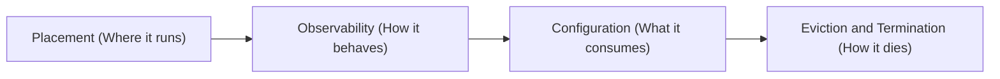
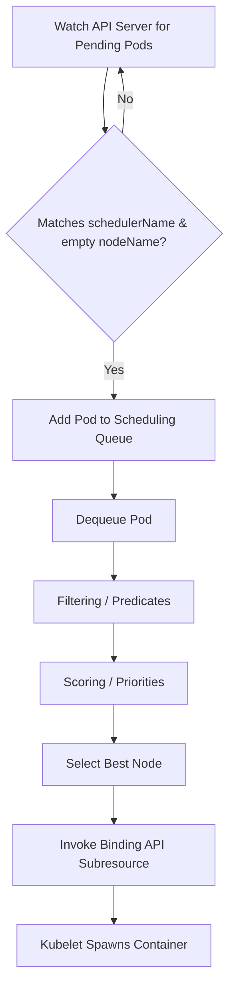
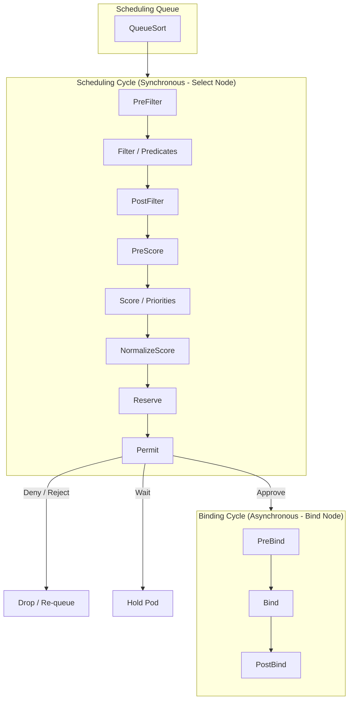
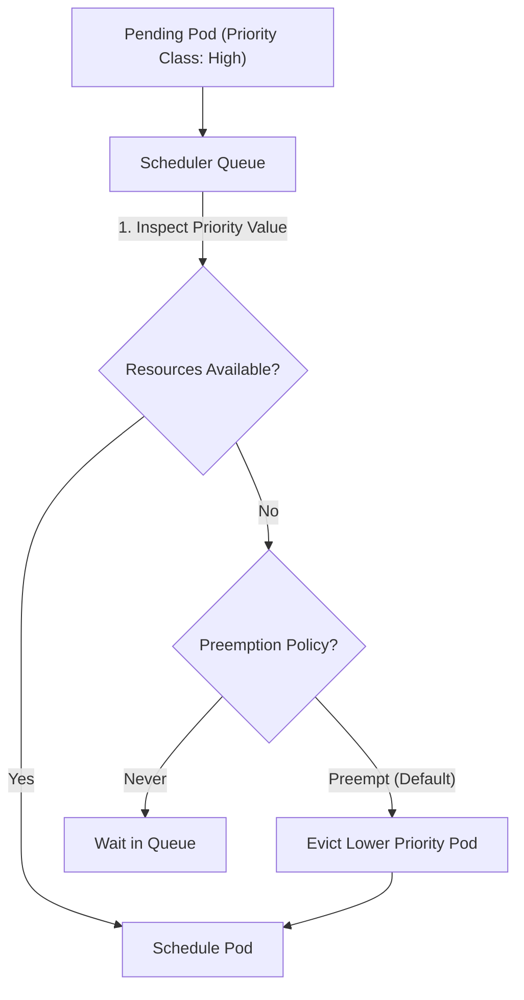

# Module 0-13: Scheduling, Logging, and Lifecycle Management

This module covers advanced scheduling and node placement policies, cluster-wide and application-level logging and monitoring mechanics, and the Kubernetes application lifecycle including container command overriding, environment injection, ConfigMaps, and Secrets.

---

## 🗺️ Cognitive Map: How to Think About the Flow of Knowledge

To build a strong intuition for this module, think of the topics as a chronological journey of a containerized application in production:



1. **Step 1: Placement (Section 1):** We start by deciding *where* to place the Pod in the cluster. This is the job of the scheduler, using rules like Node Affinity, Taints, and Tolerations, or custom scheduling loops.
2. **Step 2: Observability (Section 2):** Once the Pod is placed on a node and starts running, we must observe it. We use the Metrics Server and logging frameworks to monitor CPU, memory, and stdout/stderr streams.
3. **Step 3: Configuration (Section 3):** To fine-tune our running Pod, we inject external configuration (ConfigMaps, Secrets, environment variables, command arguments) and hook into its startup and lifecycle phases.
4. **Step 4: Eviction & Termination (Section 5):** Finally, we manage the end of the Pod's lifecycle. When a node runs out of resources (using the metrics from Step 2) or during a cluster upgrade, we trigger evictions, respect Pod Disruption Budgets, and execute graceful shutdowns (using lifecycle hooks from Step 3).

By structuring the module this way, you follow the Pod from **Birth (Scheduling) → Life (Observability & Configuration) → Death (Eviction & Termination)**.

---

## 1. Advanced Scheduling & Node Placement

The default Kubernetes scheduler (`kube-scheduler`) handles automatic pod placement. However, Kubernetes provides multiple mechanisms to bypass, influence, or completely replace the default scheduling logic.

### A. Manual Scheduling (Bypassing the Scheduler)
When a pod is created without a scheduler running, or when you need to bypass the scheduler entirely (e.g., during troubleshooting or for static administrative placement), you can manually schedule a Pod.

#### Method 1: Direct Node Binding via `spec.nodeName`
By setting the `spec.nodeName` field in the Pod specification, you bypass the scheduler's filtering and ranking phases. The Pod is directly assigned to the target node.
* **Mechanism:** The Kubelet on the specified node watches for pods with its node name, pulls the image, and starts the container. If the node is offline or does not exist, the Pod will remain unscheduled or fail.
* **Properties:**
  * `nodeName` is typically empty by default.
  * Setting it overrides any scheduling constraints, taints, or affinities.
  * It cannot be updated after Pod creation (it is immutable in a running Pod).

**Manifest Example:**
```yaml
apiVersion: v1
kind: Pod
metadata:
  name: manual-nginx
  labels:
    app: web
spec:
  nodeName: worker-1 # Bypasses the scheduler and binds directly to worker-1
  containers:
  - name: nginx
    image: nginx:alpine
    ports:
    - containerPort: 80
```

#### Method 2: Programmatic Binding via the Binding API Subresource
If a Pod is already created and stuck in a `Pending` state (e.g., because no scheduler is running), you cannot edit `spec.nodeName` directly. Instead, you must create a `Binding` object and submit it to the Pod's binding subresource via the Kubernetes API.
* **Endpoint:** `POST /api/v1/namespaces/{namespace}/pods/{pod-name}/binding`
* **Manifest Example (`binding.yaml`):**
  ```yaml
  apiVersion: v1
  kind: Binding
  metadata:
    name: pending-nginx # Must match the name of the pending pod
  target:
    apiVersion: v1
    kind: Node
    name: worker-1 # Node where the pod should be scheduled
  ```
* **Imperative Application (via `kubectl` raw POST):**
  Since the standard `kubectl` CLI doesn't have an imperative command like `kubectl bind`, you can submit the binding using `kubectl` via the raw API endpoint:
  ```bash
  kubectl post --raw "/api/v1/namespaces/default/pods/pending-nginx/binding" -f - <<EOF
  {
    "apiVersion": "v1",
    "kind": "Binding",
    "metadata": { "name": "pending-nginx" },
    "target": { "apiVersion": "v1", "kind": "Node", "name": "worker-1" }
  }
  EOF
  ```
  Alternatively, you can save the manifest to `binding.yaml` and create it using `kubectl create`:
  ```bash
  kubectl create -f binding.yaml
  ```
  *Note:* You cannot use `kubectl apply` or `kubectl replace` here because a Pod's binding is a one-time, write-once POST operation. Once a Pod is bound to a node, its `spec.nodeName` is permanently set.

---

### B. Labels and Selectors
Labels and Selectors are the core grouping and loose-coupling mechanism in Kubernetes. Unlike traditional systems that group resources via hardcoded hierarchical paths or arrays of IDs, Kubernetes uses labels (metadata attached to objects) and selectors (queries used to filter those labels) to create dynamic, flexible relationships between resources.

#### 1. Labels on Pods vs Nodes
* **Pod Labels:** Key-value pairs attached to Pods at metadata level. They do not affect container execution but are used by controllers and Services to track, scale, and route traffic to Pods.
* **Node Labels:** Attached to worker nodes to define physical or logical node characteristics (e.g., zone, rack, disk speed, hardware accelerator like GPUs).
  * *Default labels* are added automatically by Kubelet/cloud-provider:
    ```bash
    kubernetes.io/hostname: "worker-node-1"
    topology.kubernetes.io/zone: "us-east-1a"
    kubernetes.io/arch: "amd64"
    kubernetes.io/os: "linux"
    ```
  * *Custom labels* can be added manually to nodes to represent custom environments:
    ```bash
    kubectl label nodes worker-1 storage-type=ssd hardware=gpu
    ```
  * To remove or override a label:
    ```bash
    # Remove a label (suffix with a minus sign)
    kubectl label nodes worker-1 storage-type-
    # Override an existing label (use --overwrite)
    kubectl label nodes worker-1 hardware=tpu --overwrite
    ```

#### 2. Usage of Selectors in Kubernetes Components
Selectors allow resources to dynamically find and bind to each other. Here is how different components use selectors:

```
    [ Service: app=web ]
            |
            | (Label Selector Query)
            v
   +-------------------------------------------------+
   |                                                 |
   v                                                 v
[ Pod A: app=web, tier=frontend ]   [ Pod B: app=web, tier=backend ]
```

* **Services (`spec.selector`):** A Service uses an equality-based selector to match Pod labels. It continuously queries the API server for Pods matching its selector, compiles their IP addresses into an `EndpointSlice`, and load-balances incoming traffic to them.
* **Deployments & ReplicaSets (`spec.selector`):** Deployments use selectors to determine which Pods they own. When the ReplicaSet controller sees fewer Pods matching its selector than the desired `replicas` count, it creates new Pods. If it sees more, it deletes the excess Pods.
* **NetworkPolicies (`spec.podSelector` / `spec.ingress.from.podSelector`):** NetworkPolicies use selectors to target a group of Pods and apply firewall rules, allowing traffic only from source Pods matching specific selectors.

#### 3. Selectors Syntax & Matching Logic
Kubernetes supports two levels of selector complexity:
1. **Equality-Based Selectors:**
   * Matches keys and values exactly. Used in services, replication controllers, and `nodeSelector`.
   * Operators:  = , == , !=
   * *Example Service Manifest:*
     ```yaml
     apiVersion: v1
     kind: Service
     metadata:
       name: web-service
     spec:
       selector:
         app: nginx
         env: prod  # Both must match (AND logic)
       ports:
       - port: 80
         targetPort: 8080
     ```
2. **Set-Based Selectors:**
   * Allows filtering keys according to a set of values, enabling complex queries. Used in Deployments, ReplicaSets, DaemonSets, NetworkPolicies, and Node/Pod Affinity.
   * Operators:
     * `In`: The label's value must match one of the specified values.
     * `NotIn`: The label's value must not match any of the specified values.
     * `Exists`: The key must exist on the resource, regardless of its value (the values array must be empty).
     * `DoesNotExist`: The key must not exist on the resource (the values array must be empty).
     * `Gt` (Greater than) / `Lt` (Less than): Used for numeric values (parsed as integers).

*Example syntax in a ReplicaSet (`matchExpressions`):*
```yaml
selector:
  matchLabels:
    app: webapp
  matchExpressions:
    - {key: tier, operator: In, values: [frontend, api]}
    - {key: environment, operator: NotIn, values: [dev]}
```

#### 💡 CKA Battle-Test FAQ: Selector Syntax & Behaviors

* **Q: Do we write = , == ,  or  != in YAML vs CLI?**
  * **In YAML Manifests:** Usually **no**. You express selectors as key-value pairs (e.g. `app: web`) or structured match expressions, and Kubernetes implicitly handles the equality checks.
  * **In CLI Commands (kubectl):** **Yes, you do write them.** When using the `-l` or `--selector` flag in kubectl commands, you must use these operators:
    ```bash
    # Equal checks
    kubectl get pods -l env=production
    # Not-equal checks
    kubectl get pods -l tier!=frontend
    ```
* **Q: What is the difference between = and == ?**
  * **None.** In Kubernetes CLI commands, both = and  ==  mean exact equality.
    ```bash
    kubectl get pods -l env=production
    # is exactly the same as:
    kubectl get pods -l env==production
    ```
* **Q: Do multiple labels in a selector map act as AND or OR?**
  * **AND logic.** If you list multiple labels in a selector map (or comma-separated in the CLI), they must **all** match for the Pod to be selected.
    ```yaml
    selector:
      app: web
      env: prod # Both 'app=web' AND 'env=prod' labels must be present
    ```
* **Q: What is a Set-Based Selector and why use it over Equality-Based?**
  * Equality-based selectors can only match a single exact value. If you want a resource (like a Service or Deployment) to select Pods matching a list of multiple values (e.g., matching env `production` OR `staging`, but not `development`), equality-based selectors cannot do this.
  * Set-based selectors allow SQL-like `IN` or `NOT IN` queries:    Breaking it down:
	`key: env`: Targets the specific metadata label key named `env`.
	`operator: In`: Specifies that the label's value must match any item in the `values` list.    - `values: [production, staging]`: The acceptable values for the key. Resources with labels like `env=production` or `env=staging` will be matched, while `env=dev` would be ignored. 
    ```yaml
    selector:
      matchExpressions:
        - {key: env, operator: In, values: [production, staging]}
    ```

---

### C. Taints and Tolerations (Repelling Workloads)
While node affinity attracts Pods to a set of nodes, **Taints and Tolerations** allow nodes to **repel** a set of Pods. They ensure that unauthorized Pods are not scheduled on dedicated or sensitive nodes (e.g., control plane nodes).

#### 1. Node Taints
A taint is applied to a node and consists of a `key`, a `value` (optional), and a `taint-effect`.
* **Command Syntax:**
  ```bash
  kubectl taint nodes <node-name> <key>=<value>:<taint-effect>
  ```
* **To remove a taint:** Append a hyphen `-` to the end of the effect:
  ```bash
  kubectl taint nodes <node-name> <key>=<value>:<taint-effect>-
  ```
* **Example:**
  ```bash
  kubectl taint nodes worker-1 dedicated=special-user:NoSchedule
  ```

#### 2. Taint Effects
There are three taint effects that govern how the scheduler treats Pods that do not tolerate the taint:
1. **`NoSchedule` (Hard Constraint):**
   * If a Pod does not have a matching toleration, it **cannot** be scheduled onto the node.
   * Existing running Pods on the node that lack the toleration are **unaffected**.
2. **`PreferNoSchedule` (Soft Constraint):**
   * The scheduler will try to avoid placing the Pod on the tainted node, but if no other resource-rich nodes are available, it will schedule the Pod there as a last resort.
3. **`NoExecute` (Eviction Trigger):**
   * If a taint with `NoExecute` is applied to a node, any running Pods on that node that do not tolerate this taint are **immediately evicted**.
   * If a Pod *does* tolerate the taint, it can remain running. However, if the toleration includes a `tolerationSeconds` parameter, the Pod will remain on the node for that specified time before being evicted:
     ```yaml
     tolerations:
     - key: "node.kubernetes.io/unreachable"
       operator: "Exists"
       effect: "NoExecute"
       tolerationSeconds: 300 # Stays for 5 minutes after node becomes unreachable, then evicts
     ```

> [!WARNING]
> **Toleration Seconds Restriction:** The `tolerationSeconds` parameter is **strictly ignored** for `NoSchedule` and `PreferNoSchedule` effects. Because these effects only control scheduling placement and do not trigger evictions, setting a time delay has no functional purpose. The API server will accept the field, but the scheduler will completely ignore it.

#### 3. Pod Tolerations
Tolerations are defined in the Pod's `spec.tolerations` field. To allow a Pod to be scheduled on a tainted node, the toleration must match the taint's key, value, and effect.
* **Operator `Equal`:** Requires both the key and value to match.
  ```yaml
  tolerations:
  - key: "dedicated"
    operator: "Equal"
    value: "special-user"
    effect: "NoSchedule"
  ```
* **Operator `Exists`:** Matches any value for the key. The `value` field must be omitted.
  ```yaml
  tolerations:
  - key: "dedicated"
    operator: "Exists"
    effect: "NoSchedule"
  ```
* **Empty Key with `Exists` Operator:** Matches all keys, values, and taints (useful for diagnostic pods).
  ```yaml
  tolerations:
  - operator: "Exists"
  ```
* **Omitted Effect (Wildcard):** If the `effect` field is omitted from a toleration block, it matches **all effects** (`NoSchedule`, `PreferNoSchedule`, and `NoExecute`) for that key:
  ```yaml
  tolerations:
  - key: "node.kubernetes.io/unreachable"
    operator: "Exists"
    tolerationSeconds: 300 # Matches unreachable taints for NoSchedule and NoExecute
  ```
* **Multi-Taint Scheduling Evaluation (Additive Rules):**
  * A single Node can have **multiple taints** concurrently in its `spec.taints` list (for example, both `NoSchedule` and `NoExecute` for the same failure key).
  * To be scheduled on the Node, a new Pod must tolerate **all taints** on the node. Lacking a toleration for even one taint (such as tolerating only `NoExecute` but not `NoSchedule`) will prevent the scheduler from placing the Pod there.
  * For already running Pods, a lack of a `NoSchedule` toleration does **not** trigger eviction (since `NoSchedule` only evaluates new placements). The running Pod only needs to tolerate the `NoExecute` taint to remain active on the node.


#### 4. Real-World Implementation Scenarios & Examples

##### Scenario 1: Dedicating GPU Nodes (NoSchedule)
* **Goal:** Dedicate GPU-enabled nodes exclusively to machine learning workloads, preventing regular workloads from running on expensive GPU resources.
* **Taint Command:**
  ```bash
  kubectl taint nodes worker-gpu hardware=gpu:NoSchedule
  ```
* **Regular Pod Manifest (No Toleration - Will fail to schedule on `worker-gpu`):**
  ```yaml
  apiVersion: v1
  kind: Pod
  metadata:
    name: regular-app
  spec:
    containers:
    - name: nginx
      image: nginx:alpine
  ```
* **ML Workload Manifest (With Toleration - Can run on `worker-gpu`):**
  ```yaml
  apiVersion: v1
  kind: Pod
  metadata:
    name: ml-app
  spec:
    containers:
    - name: tensor-model
      image: tensorflow/tensorflow:latest-gpu
    tolerations:
    - key: "hardware"
      operator: "Equal"
      value: "gpu"
      effect: "NoSchedule"
  ```

##### Scenario 2: Evacuating / Draining Nodes for Maintenance (NoExecute with Grace Period)
* **Goal:** Evacuate a node for emergency maintenance. Any pods running on it that do not have a toleration are immediately terminated and rescheduled. Critical system logging pods should stay for exactly 10 minutes to grab remaining logs before being evicted.
* **Taint Command:**
  ```bash
  kubectl taint nodes worker-1 maintenance=true:NoExecute
  ```
* **Critical Logging Pod Manifest (Allows 10-minute grace period):**
  ```yaml
  apiVersion: v1
  kind: Pod
  metadata:
    name: log-collector
  spec:
    containers:
    - name: fluentd
      image: fluentd:latest
    tolerations:
    - key: "maintenance"
      operator: "Equal"
      value: "true"
      effect: "NoExecute"
      tolerationSeconds: 600 # Pod remains on the node for 10 minutes before eviction
  ```

##### Scenario 3: Preferential Co-location (PreferNoSchedule)
* **Goal:** We have a node that has high resource consumption (overloaded node). We want to discourage the scheduler from placing pods on this node, but we allow it as a fallback if the cluster runs out of capacity.
* **Taint Command:**
  ```bash
  kubectl taint nodes worker-3 resource-state=high-load:PreferNoSchedule
  ```
* **Standard Pod:** No toleration is strictly required because it is a `PreferNoSchedule` taint. The scheduler ranks `worker-3` lower than other nodes, but it will place pods there if no other nodes are available.
* **Critical Pod (Ignores high-load warning to schedule normally on any node, including `worker-3`):**
  ```yaml
  apiVersion: v1
  kind: Pod
  metadata:
    name: critical-api
  spec:
    containers:
    - name: api-server
      image: my-api:latest
    tolerations:
    - key: "resource-state"
      operator: "Equal"
      value: "high-load"
      effect: "PreferNoSchedule"
  ```

##### Scenario 4: Diagnostic / Administrative Agent (Wildcard Toleration)
* **Goal:** Run a diagnostic container (e.g., node exporter, custom monitoring script) on *every* single node in the cluster, including the control plane node and dedicated database/GPU nodes.
* **Wildcard Toleration Manifest:**
  ```yaml
  apiVersion: v1
  kind: Pod
  metadata:
    name: cluster-diagnostics
  spec:
    containers:
    - name: node-exporter
      image: prom/node-exporter:latest
    tolerations:
    # This wildcard matches any taint key, value, or effect
    - operator: "Exists"
  ```

> [!NOTE]
> **Taints and Tolerations do not guarantee placement.**
> They only repel non-tolerating pods. A tolerating pod is *allowed* to run on the tainted node but is not *forced* to do so; it might still be scheduled on any other untainted node.

---

### D. Node Selectors (Simple Node Affinity)
`nodeSelector` is the simplest form of node selection constraint in Kubernetes. It is defined as a map of key-value pairs inside `spec.nodeSelector` in the Pod manifest.

* **Mechanism:** The scheduler matches the Pod's `nodeSelector` against the labels of all worker nodes in the cluster. For a node to be considered a valid candidate for the Pod, it **must contain all** of the key-value pairs specified in the Pod's `nodeSelector` (AND logic).
* **Limitations:**
  * Supports only exact equality matching.
  * Cannot evaluate set-based operations (e.g., placing a Pod on a node in zone `us-east-1a` OR `us-east-1b`).
  * Cannot define soft preferences (e.g., "prefer node with SSD, but schedule on HDD if SSD is full").

#### 🛠️ Step-by-Step Production Walkthrough: Targeting SSD Storage Nodes

##### Scenario:
You are deploying a high-performance database Pod (e.g., Elasticsearch) that requires fast SSD storage. You want to ensure it only schedules on worker nodes labeled with high-speed SSDs.

##### Step 1: Label the Target Worker Node
First, tag the specific worker node (`worker-node-1`) with a custom label indicating it has SSD storage:
```bash
# Add the custom label
kubectl label nodes worker-node-1 storage-type=ssd

# Verify the label is applied
kubectl get nodes worker-node-1 --show-labels
```

##### Step 2: Define the Pod Manifest with `nodeSelector`
In the Pod manifest, specify the `nodeSelector` targeting the label `storage-type: ssd`:
```yaml
apiVersion: v1
kind: Pod
metadata:
  name: database-pod
  labels:
    app: elasticsearch
spec:
  containers:
  - name: db-container
    image: elasticsearch:8.11.1
    ports:
    - containerPort: 9200
  nodeSelector:
    storage-type: ssd  # Matches the label we added to worker-node-1
```

##### Step 3: Scheduling Evaluation & Verification
When this Pod is submitted:
1. The `kube-scheduler` filters all nodes in the cluster.
2. Nodes that do not have the label `storage-type=ssd` are filtered out.
3. The scheduler assigns the Pod to `worker-node-1` because its labels match the selector.

To verify the Pod has scheduled successfully on the correct node:
```bash
# Check the NODE column in the output
kubectl get pod database-pod -o wide
```

##### 🔴 Failure Scenario: Unmatched Selectors
If you specify a selector that **matches****** no nodes in the cluster (e.g. `storage-type: nvme` when no nodes have this label):
1. The scheduler filters out all nodes.
2. The Pod remains in the **`Pending`** state.
3. Inspecting the events will show a `FailedScheduling` warning:
   ```bash
   kubectl describe pod database-pod
   
   # Event Output:
   # Warning  FailedScheduling  12s  default-scheduler  0/3 nodes are available: 3      node(s) didn't match Pod's node selector.
   ```

---

### E. Node Affinity (Advanced Placement Logic)
Node Affinity provides a rich set of constraints that extends the capabilities of `nodeSelector` by using set-based matching expressions and soft preferences.

#### 1. Rules: Required vs. Preferred
Node Affinity has two main types of rules:
1. **`requiredDuringSchedulingIgnoredDuringExecution` (Hard Affinity):**
   * The scheduler **must** find a node that matches the affinity rules. If no node matches, the Pod remains `Pending`.
2. **`preferredDuringSchedulingIgnoredDuringExecution` (Soft Affinity):**
   * The scheduler tries to find a node that matches the rules. If it cannot, it will schedule the Pod on a non-matching node.
   * You can assign a `weight` (from 1 to 100) to each preferred rule. The scheduler calculates scores for each node by adding weights of satisfied affinity terms. The node with the highest score is selected.

> [!NOTE]
> **What does "IgnoredDuringExecution" mean?**
> If the labels of a node change while a Pod is running, or if the affinity rule changes, the running Pod **will not** be evicted from the node. It will continue to execute undisturbed. Only scheduling decisions are affected.

#### 2. Match Expressions and Operator Logic
Node affinity uses `nodeSelectorTerms` and `matchExpressions`.
The operator field supports:
* `In`: Node label value must match one of the listed values.
* `NotIn`: Node label value must not match any of the listed values (useful for anti-affinity).
* `Exists`: A label with the specified key must exist on the node (the `values` array must be empty).
* `DoesNotExist`: A label with the specified key must not exist on the node (the `values` array must be empty).
* `Gt` / `Lt`: Node label value must be a number greater/less than the specified value (parsed as an integer).

**E2E Node Affinity Manifest Example:**
```yaml
apiVersion: v1
kind: Pod
metadata:
  name: affinity-pod
spec:
  affinity:
    nodeAffinity:
      requiredDuringSchedulingIgnoredDuringExecution:
        nodeSelectorTerms:
        - matchExpressions:
          - key: topology.kubernetes.io/zone
            operator: In
            values:
            - us-east-1a
            - us-east-1b
      preferredDuringSchedulingIgnoredDuringExecution:
      - weight: 80
        preference:
          matchExpressions:
          - key: disktype
            operator: In
            values:
            - ssd
      - weight: 20
        preference:
          matchExpressions:
          - key: size
            operator: Exists
  containers:
  - name: app
    image: my-app:v1
```

##### How Both Rules are Evaluated Together (Required & Preferred):
In this E2E example, **both blocks are used simultaneously**, but they are processed during different phases of the scheduling cycle:

1. **Filtering Phase (Predicates - `requiredDuringScheduling...`):**
   * The scheduler evaluates all nodes in the cluster and filters out any node that does not reside in zone `us-east-1a` or `us-east-1b`.
   * **Result:** If a node does not have the label `topology.kubernetes.io/zone: us-east-1a` or `topology.kubernetes.io/zone: us-east-1b`, it is **immediately disqualified** and cannot run the Pod, regardless of its disktype or size.

2. **Scoring Phase (Priorities - `preferredDuringScheduling...`):**
   * For the nodes that passed the filtering phase (i.e., those in the correct zones), the scheduler calculates a score to rank them.
   * **Result:** The scheduler checks the preferred rules:
     * If a zone-compliant node has the label `disktype: ssd`, it receives **+80** points.
     * If it has the label `size` (any value), it receives **+20** points.
     * The node with the highest cumulative score is selected to run the Pod. (If there is a tie, other scoring criteria like image locality are evaluated).

---

#### 3. Label Subset Match Evaluation (Node with 3 labels vs. Pod Selector)

When a worker node has multiple labels (e.g., 3 labels) and a Pod matches only some of them, the scheduling outcome depends on whether you are using `nodeSelector`, `requiredDuringScheduling...` (Hard Affinity), or `preferredDuringScheduling...` (Soft Affinity).

##### Scenario Setup:
* **Target Node (`worker-1`) Labels:**
  * `env: production`
  * `disktype: ssd`
  * `gpu: nvidia`
  * `cores: "8"`  # Numeric value stored as a string

---

##### Case A: Under `nodeSelector` (Simple Match)
* **Rule 1:** If the Pod asks for a **single** label:
  ```yaml
  nodeSelector:
    disktype: ssd # Matches Node
  ```
  * **Result:** **SUCCESS (Schedules).** The scheduler ignores the node's extra labels (`env` and `gpu`). As long as the requested label matches, it is allowed.
* **Rule 2:** If the Pod asks for **multiple** labels (Logical AND):
  ```yaml
  nodeSelector:
    disktype: ssd   # Matches Node
    region: us-east # Lacking on Node
  ```
  * **Result:** **FAILURE (Pending).** Multiple key-value pairs are evaluated as a logical `AND`. Since the node lacks `region: us-east`, it is disqualified.

---

##### Case B: Under `requiredDuringSchedulingIgnoredDuringExecution` (Hard Affinity)
* **Rule 1: Multiple Expressions within a Single Term (Logical AND)**
  ```yaml
  nodeSelectorTerms:
  - matchExpressions:
    - {key: env, operator: In, values: [production]}  # Matches Node
    - {key: disktype, operator: In, values: [nvme]}   # Lacking on Node
  ```
  * **Result:** **FAILURE (Pending).** All expressions inside a single list item are evaluated as logical `AND`. The node must have both.
* **Rule 2: Multiple Terms within `nodeSelectorTerms` (Logical OR)**
  ```yaml
  nodeSelectorTerms:
  - matchExpressions:
    - {key: env, operator: In, values: [production]}  # Term 1 (Matches Node)
  - matchExpressions:
    - {key: disktype, operator: In, values: [nvme]}   # Term 2 (Lacking)
  ```
  * **Result:** **SUCCESS (Schedules).** Multiple terms are evaluated as logical `OR`. Since Term 1 is fully satisfied by the node, the node is accepted.

---

##### Case C: Under `preferredDuringSchedulingIgnoredDuringExecution` (Soft Affinity)
* **Evaluation:**
  ```yaml
  preferredDuringSchedulingIgnoredDuringExecution:
  - weight: 80
    preference:
      matchExpressions:
      - {key: env, operator: In, values: [production]}  # Matches Node (+80)
  - weight: 20
    preference:
      matchExpressions:
      - {key: disktype, operator: In, values: [nvme]}   # Lacking (+0)
  ```
  * **Result:** **SUCCESS (Schedules).** Soft affinity does not block scheduling. Instead, it scores the node. The node scores `80 + 0 = 80`. If it is the highest-scoring available node, the Pod will run there.

---

##### Case D: Set-Based Operators Evaluation (`NotIn`, `Exists`, `DoesNotExist`, `Gt`, `Lt`)

Using the same `worker-1` labels, let's evaluate each set-based operator in `requiredDuringSchedulingIgnoredDuringExecution`:

###### 1. `NotIn` Operator (Exclusion)
* **Rule Example:**
  ```yaml
  - {key: env, operator: NotIn, values: [staging, development]}
  ```
  * **Result:** **SUCCESS (Schedules).**
  * **Mechanical Breakdown:**
    * `key: env`: Targets the `env` label key on `worker-1` (value is `production`).
    * `operator: NotIn`: Evaluates whether the node's value is **not** present in the `values` array.
    * `values: [staging, development]`: Since `production` is not in this list, the expression evaluates to `true` (success).

###### 2. `Exists` Operator (Presence Check)
* **Rule Example:**
  ```yaml
  - {key: gpu, operator: Exists}
  ```
  * **Result:** **SUCCESS (Schedules).**
  * **Mechanical Breakdown:**
    * `key: gpu`: Looks for the presence of the key `gpu` on the node.
    * `operator: Exists`: Verifies if the key exists, regardless of what value it holds. The `values` list must be omitted or left empty.
    * **Evaluation:** Since `worker-1` has the label `gpu: nvidia`, the check succeeds.

###### 3. `DoesNotExist` Operator (Absence Check)
* **Rule Example:**
  ```yaml
  - {key: local-storage, operator: DoesNotExist}
  ```
  * **Result:** **SUCCESS (Schedules).**
  * **Mechanical Breakdown:**
    * `key: local-storage`: Searches for the key `local-storage` on the node.
    * `operator: DoesNotExist`: Verifies that this key is **not** defined.
    * **Evaluation:** Since `worker-1` does not have a `local-storage` label, the check succeeds. (If the node had `local-storage: none`, this check would fail).

###### 4. `Gt` Operator (Greater Than - Numeric)
* **Rule Example:**
  ```yaml
  - {key: cores, operator: Gt, values: ["4"]}
  ```
  * **Result:** **SUCCESS (Schedules).**
  * **Mechanical Breakdown:**
    * `key: cores`: Targets the `cores` label on `worker-1` (value is `"8"`).
    * `operator: Gt`: Parses both the node's label value and the `values` list item as integers, performing a greater-than comparison (`8 > 4`).
    * `values: ["4"]`: The single threshold value (must be represented as a string list in YAML, but is parsed numerically).
    * **Evaluation:** Since `8` is greater than `4`, the check succeeds.

###### 5. `Lt` Operator (Less Than - Numeric)
* **Rule Example:**
  ```yaml
  - {key: cores, operator: Lt, values: ["4"]}
  ```
  * **Result:** **FAILURE (Pending).**
  * **Mechanical Breakdown:**
    * `key: cores`: Targets the `cores` label on `worker-1` (value is `"8"`).
    * `operator: Lt`: Performs a numeric less-than check (`8 < 4`).
    * `values: ["4"]`: The threshold value.
    * **Evaluation:** Since `8` is not less than `4`, the check fails, and the node is disqualified.

---

### F. Taints/Tolerations vs. Node Affinity combination scenarios (repel vs attract)
A common requirement in production is dedicating a set of nodes to a specific department, customer, or workload type (e.g., GPU-enabled nodes for Machine Learning).

| Mechanism                       | Behavior                                                   | Result on Target Nodes                              | Result on General Nodes                                        | Exclusivity                               |
| :------------------------------ | :--------------------------------------------------------- | :-------------------------------------------------- | :------------------------------------------------------------- | :---------------------------------------- |
| **Taints & Tolerations Only**   | Node repels pods without tolerations                       | Dedicated nodes only host our target workload pods. | Target workload pods can still run on standard worker nodes.   | ❌ Partial (Node is exclusive, Pod is not) |
| **Node Affinity Only**          | Pod is attracted to target nodes                           | Dedicated nodes can still host other general pods.  | Target workload pods are forced onto dedicated nodes.          | ❌ Partial (Pod is exclusive, Node is not) |
| **Combined (Taint + Affinity)** | Node repels general pods; Pod is attracted to target nodes | Dedicated nodes **only** host target workload pods. | Target workload pods are **never** scheduled on general nodes. | 🌟 **100% Exclusive**                     |

#### Understanding Exclusivity (Node vs. Pod perspective):

To achieve true isolation in production, we must evaluate exclusivity from both directions:

1. **Node Exclusivity (The Node's perspective):**
   * **Definition:** Ensuring that standard, non-target workload Pods (e.g., standard nginx, frontend apps) cannot schedule onto our dedicated node and consume resources.
   * **Enforced by:** **Taints & Tolerations**. The Taint acts as a "No Trespassing" sign that repels any Pod that doesn't have the matching Toleration.

2. **Pod Exclusivity (The Pod's perspective):**
   * **Definition:** Ensuring that our special target workload Pods (e.g., GPU-dependent ML jobs) are forced to schedule *only* on the dedicated nodes, and are not placed on general worker nodes (where they might crash due to lack of GPU drivers).
   * **Enforced by:** **Node Affinity**. The affinity acts as a magnet that attracts and locks the Pod to the labeled node.

---

#### Step-by-Step Scenario: Dedicating GPU Nodes to ML Workloads
1. **Label the GPU Nodes:**
   ```bash
   kubectl label nodes node-gpu-1 hardware=gpu
   ```
2. **Taint the GPU Nodes (repels all other pods):**
   ```bash
   kubectl taint nodes node-gpu-1 hardware=gpu:NoSchedule
   ```
3. **Configure the ML Pod (Attract + Tolerate):**
   ```yaml
   apiVersion: v1
   kind: Pod
   metadata:
     name: ml-training-pod
   spec:
     tolerations:
     - key: "hardware"
       operator: "Equal"
       value: "gpu"
       effect: "NoSchedule"
     affinity:
       nodeAffinity:
         requiredDuringSchedulingIgnoredDuringExecution:
           nodeSelectorTerms:
           - matchExpressions:
             - key: hardware
               operator: In
               values:
               - gpu
     containers:
     - name: cuda-container
       image: nvidia/cuda:11.0-base
   ```

---

### G. Multiple Custom Schedulers
Kubernetes allows running multiple custom schedulers simultaneously alongside the default scheduler. You can write your own scheduler or configure another instance of the default `kube-scheduler` with custom parameters.

#### 1. Custom Scheduler Reconciliation Loop
A custom scheduler runs as a controller that continually reconciles the state of unscheduled pods. The core logic operates as an event-driven loop executing the following steps:



1. **Informer / Watch Phase:** The scheduler subscribes to API server events to watch for Pod additions or updates. It filters for Pods in a `Pending` state where `spec.nodeName` is empty and `spec.schedulerName` matches the custom scheduler's identifier.
2. **Queueing Phase:** Valid Pods are sorted and pushed into a scheduling queue (e.g. prioritized by scheduling PriorityClass).
3. **Filtering (Predicates):** The scheduler evaluates all cluster nodes to filter out nodes that cannot run the Pod. It checks resource capacity (CPU/RAM), node port availability, node taints, node selectors, and node affinity rules.
4. **Scoring (Priorities):** For all nodes that passed the filtering phase, the scheduler runs scoring algorithms to rank them. Scoring can favor nodes that already have required container images (image locality), spread Pods across topologies (anti-affinity), or fit resources optimally.
5. **Selection:** The node with the highest cumulative score is selected.
6. **Binding Phase:** The scheduler calls the Pod's `/binding` API subresource. This is an atomic operation that sets the `spec.nodeName` of the Pod, which signals the Kubelet on the target node to start pulling images and executing the container.

#### 2. Custom Scheduler Configuration (`KubeSchedulerConfiguration`)
Custom schedulers are configured using a configuration file instead of legacy command-line flags.
* **Example configuration (`my-scheduler-config.yaml`):**
  ```yaml
  apiVersion: kubescheduler.config.k8s.io/v1
  kind: KubeSchedulerConfiguration
  leaderElection:
    leaderElect: true
    resourceName: my-custom-scheduler
    resourceNamespace: kube-system
  profiles:
    - schedulerName: my-custom-scheduler
  ```
  > [!IMPORTANT]
  > **Reconciliation Loop & Leader Election Leases in HA Mode:**
  >
  > 1. **Reconciliation Loop:** Both the default `kube-scheduler` and any custom scheduler utilize a **Reconciliation Loop** (control loop) by default. The loop constantly monitors the API server for unscheduled pods and takes actions to bind them to nodes, reconciling the actual state with the desired state.
  >
  > 2. **Leader Election & Leases:** When running multiple instances of a scheduler for High Availability (HA) (to avoid a single point of failure), you only want **one** instance actively making scheduling decisions at any given time. If two instances scheduled the same Pod simultaneously, it would cause scheduling conflicts. 
  >    * Kubernetes uses a **Lease** object (a distributed lock in `kube-system`) to nominate a "Leader" instance. Only the leader schedules pods; the standby instances wait.
  >    * **The unique lease resource name (`resourceName`):** Each scheduler deployment must acquire its own distinct lock. The default scheduler uses a lease named `kube-scheduler`. If your custom scheduler configuration also uses `kube-scheduler`, they will fight for the same lock, continuously evicting each other.
  >
  > **Example of Lock Conflict vs. Correct Separation:**
  >
  > * **Incorrect Configuration (Collision):**
  >   ```yaml
  >   # My Custom Scheduler Config
  >   leaderElection:
  >     leaderElect: true
  >     resourceName: kube-scheduler # COLLISION! Fights with the default scheduler lock
  >   ```
  > * **Correct Configuration (Isolated):**
  >   ```yaml
  >   # My Custom Scheduler Config
  >   leaderElection:
  >     leaderElect: true
  >     resourceName: my-custom-scheduler-lease # Isolated lease lock
  >   ```
  >   * **How to verify the lease exists in the cluster:**
  >     ```bash
  >     # View active leases in the kube-system namespace
  >     kubectl get leases -n kube-system
  >     
  >     # Expected Output:
  >     # NAME                         HOLDER                                  AGE
  >     # kube-scheduler               controlplane-1                          10d
  >     # my-custom-scheduler-lease    custom-scheduler-deployment-abc-123     12h
  >     ```

#### 3. Installation Options
You can deploy a custom scheduler either as a static Pod (on control plane hosts) or as a Deployment inside the cluster.

##### Option A: Static Pod Manifest
On control plane nodes, you can place a manifest in `/etc/kubernetes/manifests/my-custom-scheduler.yaml`:
```yaml
apiVersion: v1
kind: Pod
metadata:
  name: my-custom-scheduler
  namespace: kube-system
spec:
  hostNetwork: true
  containers:
  - name: scheduler
    image: registry.k8s.io/kube-scheduler:v1.30.0 # Match cluster version
    command:
    - kube-scheduler
    - --config=/etc/kubernetes/scheduler/my-scheduler-config.yaml
    - --v=2
    volumeMounts:
    - name: config-volume
      mountPath: /etc/kubernetes/scheduler
  volumes:
  - name: config-volume
    hostPath:
      path: /etc/kubernetes/scheduler
```

##### Option B: Standard Kubernetes Deployment (using ConfigMap for config)
1. **Create the ConfigMap holding the scheduler configuration:**
   ```bash
   kubectl create configmap my-scheduler-config --from-file=my-scheduler-config.yaml -n kube-system
   ```
2. **Deploy the Scheduler:**
   ```yaml
   apiVersion: apps/v1
   kind: Deployment
   metadata:
     name: my-custom-scheduler
     namespace: kube-system
   spec:
     replicas: 1
     selector:
       matchLabels:
         app: my-custom-scheduler
     template:
       metadata:
         labels:
           app: my-custom-scheduler
       spec:
         serviceAccountName: my-custom-scheduler-sa # Requires ClusterRole permissions for scheduling
         containers:
         - name: scheduler
           image: registry.k8s.io/kube-scheduler:v1.30.0
           command:
           - kube-scheduler
           - --config=/etc/kubernetes/scheduler/my-scheduler-config.yaml
           - --v=2
           volumeMounts:
           - name: config-volume
             mountPath: /etc/kubernetes/scheduler
         volumes:
         - name: config-volume
           configMap:
             name: my-scheduler-config
   ```

#### 4. Assigning Schedulers to Pods
To request that a Pod be scheduled by your custom scheduler rather than the default one, define the `spec.schedulerName` field in the Pod manifest:
```yaml
apiVersion: v1
kind: Pod
metadata:
  name: custom-nginx
spec:
  schedulerName: my-custom-scheduler # Instructs custom-scheduler to handle it
  containers:
  - name: nginx
    image: nginx:alpine
```
*Note: If `schedulerName` is omitted, it defaults to `default-scheduler`.*

#### 5. Monitoring and Logs
* **Events:** You can verify that your custom scheduler placed the pod by checking Events:
  ```bash
  kubectl get events -n default --sort-by='.metadata.creationTimestamp'
  ```
  Look for:
  `Successfully assigned default/custom-nginx to worker-1 by my-custom-scheduler`
* **Logs:** Review the logs of the scheduler pod to debug filtering and ranking logic:
  ```bash
  kubectl logs -n kube-system -l app=my-custom-scheduler
  ```

#### 6. Custom Scheduler Binding API Walkthrough (Python & Bash)

When writing a custom scheduler, instead of patching `spec.nodeName` directly (which is immutable on the Pod resource), you must use the Pod's `/binding` subresource. This subresource is a specialized endpoint that atomically assigns a Pod to a Node.

Below are two implementations demonstrating how to watch the API, select a node, and invoke the `/binding` subresource.

##### Python Implementation
This implementation uses the official Kubernetes Python Client library. It monitors the cluster for pending pods assigned to `my-custom-scheduler`, performs basic node filtering, and posts the binding object.

```python
import time
import random
from kubernetes import client, config, watch

def run_custom_scheduler():
    # Load kubeconfig for local testing or incluster config when running inside a Pod
    try:
        config.load_incluster_config()
    except config.ConfigException:
        config.load_kube_config()

    v1 = client.CoreV1Api()
    scheduler_name = "my-custom-scheduler"
    print(f"Starting custom scheduler loop for '{scheduler_name}'...")

    # Watch for Pod events across all namespaces
    w = watch.Watch()
    for event in w.stream(v1.list_pod_for_all_namespaces):
        pod = event['object']
        
        # We only care about Pending pods matching our scheduler name that do not have a node assigned
        if (pod.status.phase == "Pending" and 
            pod.spec.scheduler_name == scheduler_name and 
            not pod.spec.node_name):
            
            print(f"Detected Pod requiring scheduling: {pod.metadata.namespace}/{pod.metadata.name}")
            
            try:
                # 1. Gather all nodes in the cluster
                nodes = v1.list_node().items
                eligible_nodes = []
                
                for node in nodes:
                    # Filter out nodes that are not Ready
                    is_ready = any(c.type == 'Ready' and c.status == 'True' for c in node.status.conditions)
                    
                    # Filter out nodes with incompatible NoSchedule taints
                    has_unsatisfied_taint = False
                    if node.spec.taints:
                        for taint in node.spec.taints:
                            if taint.effect == 'NoSchedule':
                                tolerated = False
                                if pod.spec.tolerations:
                                    for tol in pod.spec.tolerations:
                                        if (tol.key == taint.key and 
                                            (tol.operator == 'Exists' or tol.value == taint.value)):
                                            tolerated = True
                                            break
                                if not tolerated:
                                    has_unsatisfied_taint = True
                                    break
                                    
                    if is_ready and not has_unsatisfied_taint:
                        eligible_nodes.append(node.metadata.name)
                
                if not eligible_nodes:
                    print(f"Warning: No eligible nodes available for {pod.metadata.name}")
                    continue
                
                # 2. Select a target node (Random allocation for simplicity)
                target_node = random.choice(eligible_nodes)
                print(f"Selected target node '{target_node}' for Pod '{pod.metadata.name}'")
                
                # 3. Create the Binding payload
                binding = client.V1Binding(
                    api_version="v1",
                    kind="Binding",
                    metadata=client.V1ObjectMeta(
                        name=pod.metadata.name,
                        namespace=pod.metadata.namespace
                    ),
                    target=client.V1ObjectReference(
                        api_version="v1",
                        kind="Node",
                        name=target_node
                    )
                )
                
                # 4. Invoke the POST binding API endpoint
                v1.create_namespaced_pod_binding(
                    name=pod.metadata.name,
                    namespace=pod.metadata.namespace,
                    body=binding
                )
                print(f"Successfully bound pod {pod.metadata.name} to {target_node}")
                
            except client.exceptions.ApiException as e:
                print(f"API Exception during scheduling: {e}")
            except Exception as e:
                print(f"Unexpected error: {e}")

if __name__ == "__main__":
    run_custom_scheduler()
```

##### Bash Implementation
This shell script uses `kubectl` to watch for Pods and executes a raw `curl` POST command against the API server's `/binding` endpoint using the pod's service account credentials.

```bash
#!/bin/bash
set -euo pipefail

SCHEDULER_NAME="my-custom-scheduler"
APISERVER="https://kubernetes.default.svc"
SERVICEACCOUNT="/var/run/secrets/kubernetes.io/serviceaccount"
TOKEN=$(cat "${SERVICEACCOUNT}/token")
CACERT="${SERVICEACCOUNT}/ca.crt"

echo "Monitoring Kubernetes API for Pods with schedulerName=${SCHEDULER_NAME}..."

# Watch loop for pods in all namespaces matching the schedulerName
kubectl get pods -A -w -o json | jq --unbuffered -c '. | select(.status.phase == "Pending" and .spec.schedulerName == "'"${SCHEDULER_NAME}"'" and .spec.nodeName == null)' | while read -r pod; do
  NAMESPACE=$(echo "$pod" | jq -r '.metadata.namespace')
  POD_NAME=$(echo "$pod" | jq -r '.metadata.name')
  
  echo "Discovered pending pod: ${NAMESPACE}/${POD_NAME}"
  
  # Select a node that is Ready (filtering out untolerated NoSchedule taints is simplified here)
  TARGET_NODE=$(kubectl get nodes -o json | jq -r '.items[] | select(.status.conditions[] | select(.type=="Ready" and .status=="True")) | .metadata.name' | head -n 1)
  
  if [ -z "${TARGET_NODE}" ]; then
    echo "Error: No Ready nodes found to bind Pod ${POD_NAME}"
    continue
  fi
  
  echo "Binding Pod ${POD_NAME} to Node ${TARGET_NODE} via API subresource..."
  
  # Invoke POST /api/v1/namespaces/{namespace}/pods/{pod-name}/binding
  STATUS_CODE=$(curl -s -o /dev/null -w "%{http_code}" -X POST \
    --cacert "${CACERT}" \
    -H "Authorization: Bearer ${TOKEN}" \
    -H "Content-Type: application/json" \
    -d '{
      "apiVersion": "v1",
      "kind": "Binding",
      "metadata": {
        "name": "'"${POD_NAME}"'"
      },
      "target": {
        "apiVersion": "v1",
        "kind": "Node",
        "name": "'"${TARGET_NODE}"'"
      }
    }' \
    "${APISERVER}/api/v1/namespaces/${NAMESPACE}/pods/${POD_NAME}/binding")
    
  if [ "$STATUS_CODE" -eq 201 ]; then
    echo "Success: Bound ${POD_NAME} to ${TARGET_NODE} (HTTP 201)"
  else
    echo "Failed: API Server returned HTTP status ${STATUS_CODE}"
  fi
done
```

---

## 2. Logging & Monitoring

Monitoring and logging are essential for troubleshooting application states, observing cluster performance, and configuring auto-scaling.

### A. Metrics Server
The Kubernetes Metrics Server is a cluster-wide aggregator of resource usage data. It collects CPU and memory usage from Kubelets and exposes them via the metrics API (`metrics.k8s.io`).

```
[ kubectl top / HPA ] 
         |
         v (metrics.k8s.io API)
[ Metrics Server ]
         |
         v (Kubelet Summary API: /stats/summary)
[ Kubelet (on Nodes) ]
         |
         v
[ cAdvisor (collects from CRI & cgroups) ]
```

#### 1. Architecture & Summary API
* **In-Memory Storage:** The Metrics Server does not write metrics to disk; it stores them in-memory. It is not a replacement for long-term monitoring systems like Prometheus.
* **Kubelet Summary API:** The Kubelet on each node runs an embedded metrics collector called **cAdvisor** (Container Advisor). cAdvisor reads resource consumption directly from cgroups on the Linux host. The Kubelet exposes this data via `/stats/summary`.
* The Metrics Server queries this endpoint on each node, aggregates the data, and presents it to the API server.

#### 2. Installation & configuration (Labs / Insecure TLS)
To install the Metrics Server, download the official components manifest:
```bash
wget https://github.com/kubernetes-sigs/metrics-server/releases/latest/download/components.yaml
```
In many self-signed or local clusters (like kind or kubeadm), the Metrics Server fails to start because it cannot verify the TLS certificates of the Kubelets.
* **Fix:** Edit the Metrics Server deployment and append the `--kubelet-insecure-tls` flag to the container arguments:
```yaml
spec:
  template:
    spec:
      containers:
      - name: metrics-server
        args:
        - --cert-dir=/tmp
        - --secure-port=10250
        - --kubelet-preferred-address-types=InternalIP,ExternalIP,Hostname
        - --kubelet-use-node-status-port
        - --metric-resolution=15s
        - --kubelet-insecure-tls # Add this flag to bypass TLS verification
```

#### 3. Command Usage
Once the Metrics Server is running, you can inspect resource usage:
* **Node performance:**
  ```bash
  kubectl top node
  ```
* **Pod performance:**
  * Standard namespace: `kubectl top pod`
  * Specified namespace: `kubectl top pod -n kube-system`
  * All namespaces: `kubectl top pod -A`
  * Filtered by label: `kubectl top pod -l app=nginx`
  * Include container breakdown: `kubectl top pod --containers`

---

### B. Application Logs
Kubernetes manages logs generated by processes running inside containerized applications.

#### 1. Mechanics
By default, standard output (stdout) and standard error (stderr) streams inside a container are intercepted by the container runtime (CRI), formatted, and written as JSON/plaintext files under `/var/log/pods/` on the worker node.
`kubectl logs` reads these files via the Kubelet API.

#### 2. Logs Queries
* **Single Container Pod:**
  ```bash
  kubectl logs <pod-name>
  ```
* **Multi-Container Pod:**
  If you do not specify a container name, the command will error. You must use `-c` or `--container`:
  ```bash
  kubectl logs <pod-name> -c <container-name>
  ```
* **Stream Logs (Follow):**
  ```bash
  kubectl logs -f <pod-name>
  ```
* **Query Crash Logs (`--previous`):**
  If a container has crashed and restarted, `kubectl logs <pod-name>` will only show logs from the *currently running* container instance. To debug why it crashed, retrieve logs from the *terminated* instance using `--previous` (or `-p`):
  ```bash
  kubectl logs <pod-name> --previous
  ```
* **Time-bound Logs:**
  * Show logs since last 10 minutes: `kubectl logs <pod-name> --since=10m`
  * Show logs since a specific RFC3339 timestamp: `kubectl logs <pod-name> --since-time=2026-06-05T12:00:00Z`
  * Show only the last 50 lines: `kubectl logs <pod-name> --tail=50`
  * Append timestamps to logs: `kubectl logs <pod-name> --timestamps`

---

## 3. Application Lifecycle Management

Managing the lifecycle of applications involves configuring how they boot, pass configurations, and handle secrets.

### A. Commands and Arguments
When defining a Pod, you can specify a container command and arguments. This configuration interacts directly with the `ENTRYPOINT` and `CMD` instructions defined in the Dockerfile of the container image.

#### 1. Docker vs. Kubernetes Direct Map

| Dockerfile Instruction | Kubernetes YAML Field | Purpose |
| :--- | :--- | :--- |
| **`ENTRYPOINT`** | **`command`** | The main executable process to run when the container starts. |
| **`CMD`** | **`args`** | Default arguments passed to the executable process. |

#### 2. Overriding Rules

| Manifest Configured | Resulting Behavior |
| :--- | :--- |
| **Neither `command` nor `args` defined** | The container runs the `ENTRYPOINT` and `CMD` defined in the Dockerfile. |
| **Only `command` defined** | The image's `ENTRYPOINT` and `CMD` are **completely overridden**. The container runs the new `command` without arguments (unless defined in the executable path). |
| **Only `args` defined** | The image's `CMD` is overridden. The new `args` are passed to the image's `ENTRYPOINT`. |
| **Both `command` and `args` defined** | Both the image's `ENTRYPOINT` and `CMD` are overridden. The container runs the new `command` with the new `args`. |

#### 3. Syntax Formats
* **Shell Format vs Exec Format in Dockerfile:**
  * Shell format: `ENTRYPOINT sleep 10` (runs as `/bin/sh -c "sleep 10"`, PID 1 is the shell itself, not the sleep process).
  * Exec format: `ENTRYPOINT ["sleep", "10"]` (runs directly, sleep is PID 1, allows proper signal propagation like SIGTERM).
* **Kubernetes Manifest formats:**
  * Standard YAML list:
    ```yaml
    command:
    - "/bin/sh"
    - "-c"
    - "sleep 10"
    ```
  * Inline JSON list:
    ```yaml
    command: ["/bin/sh", "-c", "sleep 10"]
    ```

---

### B. Environment Variables
Kubernetes allows injecting environment variables into containers.

#### 1. Direct Configuration
Define values inline:
```yaml
spec:
  containers:
  - name: my-app
    image: alpine
    env:
    - name: DB_PORT
      value: "3306"
```

#### 2. Bulk Injection (`envFrom`)
Inject all key-value pairs from a ConfigMap or Secret in bulk. The keys automatically become the environment variable names.
```yaml
envFrom:
- configMapRef:
    name: app-config
- secretRef:
    name: app-secret
```

#### 3. Targeted Reference (`valueFrom`)
Inject specific values from external resources or cluster metadata.
* **ConfigMap Key Reference:**
  ```yaml
  env:
  - name: APP_COLOR
    valueFrom:
      configMapKeyRef:
        name: app-config
        key: theme-color
  ```
* **Secret Key Reference:**
  ```yaml
  env:
  - name: DB_PASS
    valueFrom:
      secretKeyRef:
        name: db-credentials
        key: password
  ```
* **Downward API Field Reference (Metadata):**
  Inject Pod names, IPs, namespaces, or node names into the container.
  ```yaml
  env:
  - name: MY_POD_NAME
    valueFrom:
      fieldRef:
        fieldPath: metadata.name
  - name: MY_POD_IP
    valueFrom:
      fieldRef:
        fieldPath: status.podIP
  ```
* **Container Resource Reference:**
  Inject resource request/limit constraints.
  ```yaml
  env:
  - name: CPU_LIMIT
    valueFrom:
      resourceFieldRef:
        containerName: app-container
        resource: limits.cpu
  ```

---

### C. ConfigMaps
ConfigMaps store non-confidential configuration data in key-value pairs.

#### 1. Creation Methods
* **Imperative Creation:**
  * From Literals:
    ```bash
    kubectl create configmap app-config --from-literal=COLOR=blue --from-literal=MODE=prod
    ```
  * From a File (the filename becomes the key, the file content becomes the value):
    ```bash
    kubectl create configmap app-config --from-file=app.properties
    ```
  * From a Directory of Files:
    ```bash
    kubectl create configmap app-config --from-file=config-dir/
    ```
  * From an Environment File:
    ```bash
    kubectl create configmap app-config --from-env-file=.env
    ```
* **Declarative Creation:**
  ```yaml
  apiVersion: v1
  kind: ConfigMap
  metadata:
    name: app-config
  data:
    COLOR: blue
    MODE: prod
  ```

#### 2. Injection: Environment Variables vs. Volume Mounts
ConfigMaps can be injected into Pods as environment variables (via `envFrom` / `valueFrom`) or mounted as a volume.

##### Mounting ConfigMap as a Volume:
Every key in the ConfigMap data represents a file name, and the value is the file content.
```yaml
apiVersion: v1
kind: Pod
metadata:
  name: config-volume-pod
spec:
  containers:
  - name: app
    image: nginx
    volumeMounts:
    - name: config-vol
      mountPath: /etc/config
  volumes:
  - name: config-vol
    configMap:
      name: app-config
```
Inside the container, `/etc/config/COLOR` contains the text `blue`, and `/etc/config/MODE` contains the text `prod`.

#### 3. Update Behavior and Sync Mechanisms
What happens when a ConfigMap is modified in the cluster while a Pod is running?

* **Environment Variables Injection:**
  * Environment variables are **static**.
  * When the ConfigMap is updated, the environment variables inside the running container **do not change**.
  * The Pod must be deleted and recreated (e.g. via rolling update of its deployment) to pick up the changes.
* **ConfigMap Volume Mounts:**
  * Volume mounts are **dynamic**.
  * When the ConfigMap is updated, the Kubelet periodically syncs the volume files to reflect the new ConfigMap contents. The sync time depends on the Kubelet sync interval + the cache TTL (defaulting to 1-2 minutes).

##### The Kubelet Atomic Directory Update Mechanism
To ensure that containerized applications do not read half-written or corrupted configuration files during a sync, Kubelet updates the mounted files **atomically** using a symlink swap mechanism. 

When a ConfigMap is mounted into a Pod, Kubelet organizes the files inside the mount directory (`/etc/config` in our example) using multiple layers of symlinks:
1. **Timestamped Directories:** Kubelet creates a new subdirectory with a timestamp (e.g., `..2026_06_05_10_00_00_123456789/`) and writes the actual data files there.
2. **The `..data` Symlink:** Kubelet creates a symlink named `..data` that points to the active timestamped directory.
3. **User-Facing Symlinks:** Every key file in the mount directory (e.g., `COLOR`, `MODE`) is created as a symlink pointing to the key inside the `..data` symlink (e.g., `COLOR` -> `..data/COLOR`).

###### Directory Tree Layout:
```
/etc/config
├── ..2026_06_05_10_00_00_123456789/   <-- Original data directory
│   ├── COLOR ("red")
│   └── MODE ("dev")
├── ..data -> ..2026_06_05_10_00_00_123456789/   <-- Symlink to current data
├── COLOR -> ..data/COLOR
└── MODE -> ..data/MODE
```

###### The Sync Swap Event:
When the ConfigMap is updated (e.g., `COLOR` changes to `blue`):
1. Kubelet creates a new timestamped directory: `..2026_06_05_10_05_00_987654321/` and writes the new file contents there.
2. Kubelet atomically updates the `..data` symlink to point to the new directory:
   `..data -> ..2026_06_05_10_05_00_987654321/`
3. The old timestamped directory `..2026_06_05_10_00_00_123456789/` is garbage collected and deleted.
4. Because the user-facing files point to `..data/COLOR`, they resolve to the new file instantly and atomically.

##### inotify Sync Mechanics inside Containers
The Linux kernel's `inotify` subsystem provides APIs for monitoring file system events. 
* **Watching Individual Files:** If an application sets an `inotify` watch on the mounted key file itself (e.g., `/etc/config/COLOR`), it **will not receive any events** when the ConfigMap is updated. This is because `/etc/config/COLOR` is a static symlink whose inode and content never change; only its target resolves differently once `..data` changes.
* **Watching the Parent Directory:** To detect ConfigMap changes, application configuration reloaders must watch the **parent directory** (`/etc/config`) or the `..data` symlink itself. When the atomic swap occurs, the directory's directory-entry changes, triggering `IN_MODIFY` or `IN_DELETE`/`IN_CREATE` on `..data`. The reloader catches this directory event and triggers a config refresh.

> [!WARNING]
> **The `subPath` Inode Binding Gotcha:**
> If you mount a ConfigMap key using `volumeMounts.subPath` to mount a single file (e.g., mounting `COLOR` to `/app/settings.conf`), **dynamic updates are disabled**.
> 
> * **Why this happens:** When container engines (Docker/CRI-O) mount a file via `subPath`, they perform a bind-mount directly targeting the resolved file's inode at container start time (which is the inode of `..2026_06_05_10_00_00_123456789/COLOR`).
> * **The Result:** When Kubelet updates the ConfigMap, it swaps the `..data` symlink to point to the new directory. However, the container's mount table remains hard-bound to the old inode inside the deleted/old directory. The file inside the container will never receive updates. To pick up the new configuration, the Pod must be restarted.

---

### D. Secrets
Secrets store sensitive data such as passwords, tokens, or private keys, reducing the risk of exposure.

#### 1. Secret Types
1. **`Opaque` (Default generic):** Used for arbitrary user-defined key-value sensitive data.
2. **`kubernetes.io/dockerconfigjson`:** Used to store credentials for private Docker registries.
   * Creation command:
     ```bash
     kubectl create secret docker-registry my-registry-secret \
       --docker-server=https://index.docker.io/v1/ \
       --docker-username=user \
       --docker-password=pass \
       --docker-email=user@domain.com
     ```
   * Usage in Pods: Reference under `spec.imagePullSecrets`.
3. **`kubernetes.io/tls`:** Used to store TLS private keys and certificates.
   * Creation command:
     ```bash
     kubectl create secret tls my-tls-secret --cert=path/to/tls.crt --key=path/to/tls.key
     ```
4. **`kubernetes.io/service-account-token`:** Used by the system to store ServiceAccount tokens.

#### 2. Base64 Encoding and Decoding
Unlike ConfigMaps, which store plain text, Secret manifests require data in the `data` section to be Base64-encoded.
* **Encoding Data:**
  ```bash
  echo -n "admin123" | base64
  # Output: YWRtaW4xMjM=
  ```
  > [!IMPORTANT]
  > **Avoid Trailing Newlines:**
  > Always use `echo -n` or `printf` when base64 encoding strings. Standard `echo` appends a newline character `\n` to the output, causing authentication failures when the application decodes the secret.
* **Decoding Data:**
  ```bash
  echo -n "YWRtaW4xMjM=" | base64 --decode
  # Output: admin123
  ```
* **Declarative YAML Example:**
  ```yaml
  apiVersion: v1
  kind: Secret
  metadata:
    name: db-credentials
  type: Opaque
  data:
    username: dXNlcg==
    password: YWRtaW4xMjM=
  ```
* **`stringData` Option (Plaintext Input):**
  If you do not want to base64 encode strings manually during creation, write them in the `stringData` field. The API server will automatically encode the values and store them in the `data` field:
  ```yaml
  apiVersion: v1
  kind: Secret
  metadata:
    name: db-credentials
  type: Opaque
  stringData:
    username: user
    password: admin123
  ```

#### 3. Injection Methods (Env vs. Volume Mounts)
Secrets can be injected in two ways:
* **Environment Variables:** Using `envFrom.secretRef` or `valueFrom.secretKeyRef`.
* **Volume Mounts:**
  ```yaml
  volumes:
  - name: secret-vol
    secret:
      secretName: db-credentials
  ```
  * Inside the container, each key becomes a file containing the decrypted secret value.
  * **Memory-backed Storage (`tmpfs`):** The Kubelet mounts the secret volume using `tmpfs` (an in-memory filesystem). The secret data is never written to node disk storage.
  * When the Pod is deleted, the Kubelet immediately removes the local in-memory files.

#### 4. Security Best Practices
* **Never Commit Secrets:** Do not commit Secret manifests (especially those containing base64 data) to public or private git repositories.
* **Node-level Protection:** The API server only sends a Secret to a node if a Pod scheduled on that node explicitly requests it.
* **RBAC Enforcement:** Restrict get/list/watch operations on Secret resources using RBAC Roles.
* **Encryption at Rest:** By default, secrets are stored in etcd as unencrypted base64 strings. Any user with root access to the master host or etcd can read them. Enable **etcd Encryption at Rest** to encrypt secret resources.

##### ETCD Encryption at Rest: Providers & Envelope Encryption
Kubernetes supports several encryption providers to secure secrets in the backing `etcd` store. These are categorized into **Static Providers** and **KMS Envelope Encryption**.

###### 1. Static Providers
Static providers use keys stored in a configuration file on the control plane node's local disk.
* **`identity`:** The default provider. No encryption. It writes the secret directly to etcd as a plaintext JSON/Protobuf structure (base64 is a transport encoding, not encryption).
* **`aescbc`:** Recommended symmetric provider. Uses AES-CBC with PKCS#7 padding and a 32-byte user-provided key. Provides strong, industry-standard cryptographic protection.
* **`secretbox`:** Uses XSalsa20 and Poly1305 for symmetric encryption. A modern alternative to AES, but less widely adopted in enterprise compliance audits than AES-CBC.
* **Security Limitation:** Because the raw encryption key is stored on the control plane node in `/etc/kubernetes/encryption/config.yaml`, anyone who gains root access to the control plane can steal the key and decrypt all secrets. Rotating keys requires editing files manually and restarting the API Server.

###### 2. KMS Envelope Encryption (KMS v1 and KMS v2)
KMS envelope encryption delegates key management to an external Key Management Service (e.g., HashiCorp Vault, AWS KMS, Google Cloud KMS, Azure Key Vault) via a local gRPC plugin.
* **How it works (Envelope Encryption):**
  1. The API Server generates a unique, short-lived **Data Encryption Key (DEK)** locally for each Secret write.
  2. The API Server encrypts the Secret payload using the DEK.
  3. The API Server sends the DEK to the KMS provider via gRPC over a UNIX domain socket.
  4. The KMS encrypts the DEK using its master **Key Encryption Key (KEK)** and returns the encrypted DEK.
  5. The API Server writes the encrypted Secret payload and the encrypted DEK together into `etcd`.
  6. On read, the API Server extracts the encrypted DEK, asks the KMS to decrypt it, and uses the returned plaintext DEK to decrypt the Secret.
* **Advantages:** The master KEK never leaves the external KMS HSMs. Access to the key can be audited, revoked instantly, and rotated automatically without restarting Kubernetes components. KMS v2 adds performance optimizations like local DEK caching.

##### Enabling ETCD Encryption at Rest:
1. **Create an `EncryptionConfiguration` file:**
   Create this file on the control plane node at `/etc/kubernetes/encryption/config.yaml`:
   ```yaml
   apiVersion: apiserver.config.k8s.io/v1
   kind: EncryptionConfiguration
   resources:
     - resources:
         - secrets
       providers:
         - aescbc:
             keys:
               - name: key1
                 secret: <base64 encoded 32-byte key> # Generate using: head -c 32 /dev/urandom | base64
         - identity: {} # Fallback to read existing unencrypted secrets
   ```
   > [!WARNING]
   > The order of the providers is critical. The API Server encrypts writes using the **first** provider in the list. It decrypts reads using any of the listed providers. Keep `identity: {}` at the end during migrations.
2. **Configure kube-apiserver Flags:**
   Pass the config file to the `kube-apiserver` by adding the flag:
   ```bash
   --encryption-provider-config=/etc/kubernetes/encryption/config.yaml
   ```
3. **Mount Paths into the Control Plane Static Pod:**
   Ensure the directory `/etc/kubernetes/encryption` is mapped as a hostPath volume inside the API server static pod manifest (`/etc/kubernetes/manifests/kube-apiserver.yaml`).
4. **Encrypt Existing Secrets:**
   Enabling encryption only encrypts *new* secrets. Already existing secrets remain plaintext in etcd. Force encryption on all existing secrets by replacing them:
   ```bash
   kubectl get secrets -A -o json | kubectl replace -f -
   ```

##### Diagnostic Run Sheet: Verifying ETCD Encryption

Use this step-by-step diagnostic run sheet to verify that encryption at rest is correctly configured and that secrets are stored in encrypted format inside `etcd`.

###### Step 1: SSH into the Control Plane Node
Log into the node running the API Server and etcd:
```bash
ssh admin@control-plane-node-ip
```

###### Step 2: Locate etcd Credentials and Endpoints
On a standard `kubeadm`-provisioned cluster, `etcd` runs as a static Pod. The client certificates, keys, and CA certificates are stored in `/etc/kubernetes/pki/etcd/`. We will configure `etcdctl` environment variables so it can authenticate to `etcd`:
```bash
export ETCDCTL_API=3
export ETCD_CERTS="/etc/kubernetes/pki/etcd"
```

###### Step 3: Create a Test Secret
Create a secret to test the write path:
```bash
kubectl create secret generic test-encrypt-secret \
  --from-literal=super-secret-key=super-secret-value \
  -n default
```

###### Step 4: Query Raw Secret Content directly from ETCD
Use `etcdctl` to bypass the API Server and read the raw binary data stored at the key `/registry/secrets/default/test-encrypt-secret`:
```bash
sudo etcdctl \
  --endpoints=https://127.0.0.1:2379 \
  --cacert=$ETCD_CERTS/ca.crt \
  --cert=$ETCD_CERTS/server.crt \
  --key=$ETCD_CERTS/server.key \
  get /registry/secrets/default/test-encrypt-secret --print-value-only
```
*(Note: If you are running `etcd` inside a container or under root, you can prefix the command with `docker exec` or `crictl exec`, or execute it on the host as shown above using the static pod's host-bound certificates).*

###### Step 5: Verify the Encryption Prefix
* **If Encryption is Successful (`aescbc`):**
  The output must start with the encryption provider prefix: `k8s:enc:aescbc:v1:key1:`, followed by binary/garbage output (the ciphertext):
  ```
  k8s:enc:aescbc:v1:key1:▒▒▒h▒▒1▒...
  ```
  The presence of the header `k8s:enc:aescbc:v1:` confirms that the secret is encrypted at rest.
* **If Encryption is NOT Successful (Plaintext / Identity):**
  The output will be legible text containing the serialization metadata and cleartext fields:
  ```
  k8s.io/api/core/v1.Secret...test-encrypt-secret...super-secret-key...super-secret-value...
  ```

###### Step 6: Cleanup the Test Secret
```bash
kubectl delete secret test-encrypt-secret -n default
```

---

## 🛠️ Practical Proof of Concept (PoC)

In this PoC, we will create a dedicated scheduling scenario (Taint + Node Affinity), verify Metrics Server operations, and observe the lifecycle difference between ConfigMaps injected as Environment Variables versus Volume Mounts.

### Step-by-Step Guided Steps

#### Phase 1: Exclusively Dedicated Scheduling
1. **Label and Taint a Node:**
   Identify a worker node (e.g. `worker-1`) and configure it for exclusive ML workloads:
   ```bash
   kubectl label nodes worker-1 department=ml
   kubectl taint nodes worker-1 department=ml:NoSchedule
   ```
2. **Deploy a Standard Pod (Without Tolerations):**
   ```bash
   kubectl run test-general-pod --image=nginx --dry-run=client -o yaml | kubectl apply -f -
   ```
   *Observation:* Describe the node or check scheduling. The general pod will never land on `worker-1` because it is tainted.
3. **Deploy the Dedicated Pod (With Affinity and Tolerations):**
   Create a manifest `ml-app.yaml`:
   ```yaml
   apiVersion: v1
   kind: Pod
   metadata:
     name: ml-app
   spec:
     tolerations:
     - key: "department"
       operator: "Equal"
       value: "ml"
       effect: "NoSchedule"
     affinity:
       nodeAffinity:
         requiredDuringSchedulingIgnoredDuringExecution:
           nodeSelectorTerms:
           - matchExpressions:
             - key: department
               operator: In
               values:
               - ml
     containers:
     - name: application
       image: alpine
       command: ["sleep", "3600"]
   ```
   Apply it:
   ```bash
   kubectl apply -f ml-app.yaml
   ```
   Verify it was scheduled on `worker-1`:
   ```bash
   kubectl get pod ml-app -o wide
   ```

#### Phase 2: Metrics Server Auditing
1. **Confirm Metrics Server is Running:**
   ```bash
   kubectl get deploy metrics-server -n kube-system
   ```
2. **Audit CPU and Memory Performance:**
   ```bash
   kubectl top node
   kubectl top pod -A
   ```

#### Phase 3: ConfigMap Update Behavior (Env vs. Volume Mount)
1. **Create the ConfigMap:**
   ```bash
   kubectl create configmap lifecycle-config --from-literal=COLOR=red --from-literal=MODE=dev
   ```
2. **Deploy the Test Pod mounting it via environment AND volume:**
   Create `config-test-pod.yaml`:
   ```yaml
   apiVersion: v1
   kind: Pod
   metadata:
     name: config-test-pod
   spec:
     containers:
     - name: reader
       image: alpine
       command: ["sleep", "3600"]
       env:
       - name: ENV_COLOR
         valueFrom:
           configMapKeyRef:
             name: lifecycle-config
             key: COLOR
       volumeMounts:
       - name: config-volume
         mountPath: /etc/config
     volumes:
     - name: config-volume
       configMap:
         name: lifecycle-config
   ```
   Apply it:
   ```bash
   kubectl apply -f config-test-pod.yaml
   ```
3. **Inspect Initial Values:**
   * Check environment variable:
     ```bash
     kubectl exec config-test-pod -- env | grep ENV_COLOR
     # Output: ENV_COLOR=red
     ```
   * Check volume file:
     ```bash
     kubectl exec config-test-pod -- cat /etc/config/COLOR
     # Output: red
     ```
4. **Update the ConfigMap:**
   Edit the ConfigMap and change `COLOR` to `blue`:
   ```bash
   kubectl patch configmap lifecycle-config -p '{"data":{"COLOR":"blue"}}'
   ```
5. **Observe Update Behavior:**
   * Instantly verify the environment variable:
     ```bash
     kubectl exec config-test-pod -- env | grep ENV_COLOR
     # Output: ENV_COLOR=red (Did NOT update)
     ```
   * Wait 1-2 minutes for Kubelet sync, then check the volume:
     ```bash
     kubectl exec config-test-pod -- cat /etc/config/COLOR
     # Output: blue (Successfully updated!)
     ```
6. **Clean up Resources:**
   ```bash
   kubectl delete pod ml-app test-general-pod config-test-pod
   kubectl delete configmap lifecycle-config
   kubectl taint nodes worker-1 department-
   kubectl label nodes worker-1 department-
   ```


### Phase 4: Automated Scheduling & Lifecycle Verification Script
For a fully automated validation of Kubernetes scheduling logic (Labels, Selectors, Affinities, Taints, Tolerations) and lifecycle configuration synchronization (ConfigMap/Secret volume mounts and env var injection), use the verification script located at:
`Reference Notes/scripts/verify_scheduling_lifecycle_poc.sh`

#### Script Functionality Summary:
1. **Dynamic Node Identification:** Detects a control-plane or worker node to target for label/taint operations, extracting and preserving pre-existing node taints to ensure compatibility.
2. **Node Labeling & Affinity Validation:** Applies `zone=frontend-secure` to the node, then deploys and verifies Pods targeting that label via `nodeSelector` and `nodeAffinity` respectively.
3. **Taints & Tolerations Validation:** Taints the node with `tier=backend:NoSchedule`, verifies that a Pod without a toleration remains `Pending`, and confirms that a Pod with a matching toleration schedules successfully.
4. **ConfigMap & Secret Sync Validation:** Configures a ConfigMap and Secret, mounts both as volumes, and injects keys into environment variables, verifying that all resource references are fully resolved inside the running container.
5. **Diagnostics & Cleanup:** Automatically collects verification Pod logs, audits `metrics-server` statistics if present, and tears down all created resources (using an EXIT trap to ensure cleanup even on failures).

#### How to Run:
```bash
# Make the script executable
chmod +x "Reference Notes/scripts/verify_scheduling_lifecycle_poc.sh"

# Execute the script (specify namespace option if desired)
./"Reference Notes/scripts/verify_scheduling_lifecycle_poc.sh" -n default
```

---

---

## 5. Advanced Scheduling & Eviction Control

As cluster architectures scale, the `kube-scheduler` and node agents require more advanced placement constraints, performance tuning, and eviction triggers.

### 5.1 Topology Spread Constraints
**Topology Spread Constraints** allow you to distribute Pods across different failure domains (zones, nodes, or regions) to achieve high availability. Unlike node anti-affinity (which is binary: yes or no), spread constraints allow you to define a tolerated imbalance or skew.

*   **`maxSkew`:** The maximum difference in the number of Pods between any two topology domains. It must be a positive integer.
*   **`topologyKey`:** The node label that identifies the failure domain (e.g. `topology.kubernetes.io/zone`, `kubernetes.io/hostname`).
*   **`whenUnsatisfiable`:** Dictates what to do if the constraint cannot be met:
    *   `DoNotSchedule`: (Hard constraint) The Pod remains `Pending` if the skew cannot be satisfied.
    *   `ScheduleAnyway`: (Soft constraint) The scheduler still schedules the Pod but prioritizes minimizing the skew.
*   **`labelSelector`:** Identifies which Pods are counted in the spread calculation.

```yaml
# Example Topology Spread Constraint
apiVersion: apps/v1
kind: Deployment
metadata:
  name: app-frontend
spec:
  replicas: 4
  selector:
    matchLabels:
      app: web
  template:
    metadata:
      labels:
        app: web
    spec:
      topologySpreadConstraints:
      - maxSkew: 1
        topologyKey: topology.kubernetes.io/zone
        whenUnsatisfiable: DoNotSchedule
        labelSelector:
          matchLabels:
            app: web
```

---

### 5.2 Pod Scheduling Readiness (Scheduling Gates)
Introduced to prevent the scheduler from wasting processing cycles on Pods that are blocked by external dependencies (e.g., quota checks, security scans, data migrations).
*   **`spec.schedulingGates`:** An array of gate names. If present, the Pod is marked as "parked" and is not considered for scheduling.
*   **Removal:** A controller or operator removes the gate by patching the Pod spec to clear the gate name. Once the array is empty, the Pod enters the active scheduling queue.

```yaml
apiVersion: v1
kind: Pod
metadata:
  name: gated-pod
spec:
  schedulingGates:
  - name: example.com/quota-check
  containers:
  - name: app
    image: nginx
```
*To release the gate:*
```bash
kubectl patch pod gated-pod --type='json' -p='[{"op": "remove", "path": "/spec/schedulingGates"}]'
```

---

### 5.3 The Scheduling Framework & Extension Points
The **Scheduling Framework** is a pluggable architecture within the `kube-scheduler` that permits custom plugins to extend the scheduler's logic without rebuilding the binary.

The scheduling process is split into two distinct cycles:
1.  **Scheduling Cycle (Synchronous):** Evaluates nodes and selects the best one for the Pod (running sequentially for one Pod at a time).
2.  **Binding Cycle (Asynchronous):** Applies the binding to the API server (can run concurrently for multiple Pods).



#### Key Extension Points & Hooks:
*   **`QueueSort`:** Sorts Pods in the active scheduling queue.
*   **`PreFilter` & `Filter`:** Evaluates node constraints (replaces the legacy "Predicates" check).
*   **`PreScore` & `Score`:** Scores nodes to rank them (replaces the legacy "Priority" functions).
*   **`Reserve`:** Reserves the node resources on local cache before writing to the API.
*   **`Permit`:** Can approve, deny, or delay (wait) the scheduling decision (useful for batch/gang scheduling).
*   **`Bind`:** Invokes the API to write the `Binding` resource.

---

### 5.4 Pod Priority and Preemption

When resources are scarce, Kubernetes can terminate or evict lower-priority workloads to make room for higher-priority critical services. This is controlled by cluster-scoped **PriorityClass** resources.

#### 1. Priority Ranges & Defaults
*   **Object Scope:** PriorityClasses are non-namespaced (cluster-scoped) resources. Once defined, they can be referenced by any Pod across any namespace.
*   **User Application Range:** Defined using a 32-bit integer from `-2,000,000,000` to `1,000,000,000`. Larger numbers indicate higher priority.
*   **System Critical Range:** Integers from `2,000,000,001` to `2,000,000,000` (or up to `2,000,001,000`) are reserved for system-critical components (such as `kube-apiserver` or `kubelet` daemons) to prevent them from being preempted by user applications.
*   **System Classes:** By default, Kubernetes includes:
    *   `system-node-critical` (Value: `2000001000`)
    *   `system-cluster-critical` (Value: `2000000000`)
*   **Default Pod Priority:** Pods without an explicit `priorityClassName` are assigned a default priority value of `0`. You can change this behavior by marking a single PriorityClass with `globalDefault: true`. Only one PriorityClass in the cluster can be the global default.

#### 2. Define a PriorityClass
```yaml
apiVersion: scheduling.k8s.io/v1
kind: PriorityClass
metadata:
  name: high-priority-db
value: 1000000                  # Numeric priority value
globalDefault: false            # If true, sets this as default for all pods without priorityClassName
preemptionPolicy: PreemptLowerPriority # PreemptLowerPriority (default) or Never
description: "Used for core database pods."
```

#### 3. Pod Specification Mapping
Reference the PriorityClass name inside the Pod spec:
```yaml
apiVersion: v1
kind: Pod
metadata:
  name: critical-db-pod
spec:
  priorityClassName: high-priority-db
  containers:
  - name: mysql
    image: mysql
```

#### 4. Preemption Policies
The scheduling behavior of a pending pod when resources are fully consumed is dictated by its `preemptionPolicy`:
*   **`PreemptLowerPriority` (Default):** The scheduler enters the preemption phase, identifies a node where evicting lower-priority pods will free up enough resources, evicts those lower-priority pods (sending them `SIGTERM`), and schedules the higher-priority pod.
*   **`Never` (Non-Preempting):** The pod behaves as non-preempting. It will **never** trigger the eviction or termination of lower-priority workloads. Instead, it remains in the scheduling queue, waiting for resources to free up naturally. However, once resources do free up, it is still prioritized for scheduling over other lower-priority pods also waiting in the queue.

#### 5. CLI Management
```bash
# List all priority classes in the cluster
kubectl get priorityclasses
# or
kubectl get pc

# Imperatively create a basic PriorityClass
kubectl create priorityclass high-priority --value=1000 --description="high priority"

# Imperatively create a default PriorityClass (global default)
kubectl create priorityclass default-priority --value=1000 --global-default=true --description="default priority"

# Imperatively create a non-preempting PriorityClass
kubectl create priorityclass non-preempting --value=1000 --preemption-policy="Never" --description="non-preempting priority"

# Dry-run generate PriorityClass YAML
kubectl create priorityclass fast-lane --value=500000 --dry-run=client -o yaml
```

#### 6. Detailed Pod Preemption Flow


1.  A high-priority Pod is created but cannot find a node with enough resources.
2.  The scheduler enters the **Preemption** phase.
3.  It scans nodes to find a node where evicting lower-priority Pods will free up enough CPU/memory.
4.  The lower-priority Pods are sent a `SIGTERM` signal and set to `Terminating` status.
5.  Once the space is cleared, the high-priority Pod is scheduled on the node.

#### 7. Admission Controller Mutation & The Preemption Paradox

##### A. Admission Controller Mutation Timeline
*   **Governance Guardrails:** Users/developers cannot manually hardcode numeric `spec.priority` integers or `spec.preemptionPolicy` rules directly in their Pod specifications. Trying to bypass the `PriorityClass` and save a raw priority number triggers an API-level `Forbidden` rejection.
*   **Separation of Concerns:** The Cluster Admin controls the Priority values (via cluster-scoped `PriorityClass` resources), while users reference them by name (`priorityClassName`).
*   **API Mutation Pipeline:** The **Priority Admission Controller** intercepts the request *before* the pod is stored in `etcd`:
    1. **Interception:** Pauses the Pod creation request.
    2. **Lookup:** Queries `etcd` for a matching `PriorityClass`.
    3. **Extraction & Injection:** Retrieves the integer `value` and `preemptionPolicy` from the class, and stamps them directly into the Pod's in-memory specification (`spec.priority` and `spec.preemptionPolicy`).
    4. **Persistence:** The mutated Pod is saved to `etcd` in a `Pending` state.
*   **Execution Order:** This mutation happens *before* scheduling. The `kube-scheduler` only watches the database for pods with an empty `spec.nodeName` and acts on the mutated fields post-persistence.

##### B. Resolving the Preemption Paradox (Priority vs. Affinity Conflict)
What happens when a high-priority Pod has a strict Node Affinity rule (`requiredDuringSchedulingIgnoredDuringExecution`), but the only matching node is fully occupied by pods of an *even higher* priority?
*   **Scheduler Resolution:** The Pod remains `Pending` indefinitely.
*   **Architectural Precedence:**
    1. **Affinity is Absolute:** The scheduler is mathematically prohibited from scheduling the pod on any node that violates its strict Node Affinity.
    2. **Priority Hierarchy is Absolute:** The scheduler will **never** evict a higher-priority pod to accommodate a lower-priority pod.
*   **Diagnostics:** The scheduler hits a logical impasse, raises a `FailedScheduling` event, and logs the condition in the Pod events (visible via `kubectl describe pod`).

---

### 5.5 Pod Overhead & Dynamic Resource Allocation (DRA)

#### 1. Pod Overhead:
Account for the resource usage of the container runtime sandbox itself (e.g. Kata containers or gVisor virtual machines).
*   Configured inside the `RuntimeClass` resource using `spec.overhead`.
*   The scheduler factors this overhead *in addition* to container requests when placing the Pod.
```yaml
apiVersion: node.k8s.io/v1
kind: RuntimeClass
metadata:
  name: kata-vm
handler: kata-containers
overhead:
  podFixed:
    cpu: "250m"
    memory: "500Mi"
```

#### 2. Dynamic Resource Allocation (DRA):
Designed as the modern, attribute-based successor to Device Plugins (GPUs, FPGAs).
*   Instead of requesting counts (e.g., `nvidia.com/gpu: 1`), Pods reference a `ResourceClaim`.
*   The scheduler coordinates with resource drivers via `ResourceSlice` resources to allocate specific devices with complex parameters (e.g. partition sharing, GPU memory limits).

---

### 5.6 Pod Eviction Mechanics (Node-Pressure vs API Eviction)
Workloads are evicted (terminated prematurely) from nodes under two separate scenarios:

| Feature | Node-Pressure Eviction (Kubelet-driven) | API-initiated Eviction (API-driven) |
| :--- | :--- | :--- |
| **Trigger** | Node runs out of memory, disk, or inodes (system threshold reached). | User or controller requests eviction (e.g., `kubectl drain`). |
| **Enforced By** | Node `kubelet` directly[16]. | API Server coordinating with `kubelet`[14]. |
| **PDBs** | Bypasses Pod Disruption Budgets (unconditional eviction). | Respects Pod Disruption Budgets (blocks if budget is violated)[17]. |
| **Object Status** | Pod phase is set to `Failed` (remains in API). | Pod object is cleanly deleted from the cluster[15]. |
| **Diagnostics** | Check Kubelet journal logs: `journalctl -u kubelet` | Check event logs: `kubectl get events` |

---

### 5.7 Node-Pressure Eviction Signals & Thresholds
The kubelet actively monitors node resources and triggers eviction to reclaim space:
*   **Eviction Signals:**
    *   `memory.available`: Calculated as `node.status.capacity[memory] - node.stats.memory.workingSet`.
    *   `nodefs.available` / `nodefs.inodesFree`: Available space and inodes on the node's root filesystem (holding pod logs, local volumes).
    *   `imagefs.available` / `imagefs.inodesFree`: Available space and inodes on the container runtime's image storage filesystem.
    *   `containerfs.available` / `containerfs.inodesFree`: Available space and inodes on the container runtime's writeable layers filesystem.
    *   `pid.available`: Available process IDs on the node (`node.stats.rlimit.maxpid - node.stats.rlimit.curproc`).
*   **Hard vs Soft Eviction Thresholds:**
    *   **Hard Eviction (`--eviction-hard`):** Kubelet terminates pods immediately with a `0s` grace period. PDBs and `terminationGracePeriodSeconds` are ignored. Typical defaults: `memory.available < 100Mi`, `nodefs.available < 10%`, `imagefs.available < 15%`.
    *   **Soft Eviction (`--eviction-soft`):** Evicts pods after the threshold is met for a duration specified by `--eviction-soft-grace-period`. Respects `--eviction-max-pod-grace-period` for container termination.
*   **Static Pod Eviction:** Kubelet can evict static pods. It will attempt to recreate them, but if node-pressure remains high and the static pod's priority is lower than other pending pods in the API server, it may fail to schedule.

---

### 5.8 Scheduler Performance Tuning & Bin-Packing (MostAllocated vs RequestedToCapacityRatio)
The `NodeResourcesFit` score plugin supports bin-packing strategies to maximize node resource utilization:
1.  **`MostAllocated` Strategy:** Favors nodes with higher allocation ratios to pack resources tightly.
    ```yaml
    apiVersion: kubescheduler.config.k8s.io/v1
    kind: KubeSchedulerConfiguration
    profiles:
    - pluginConfig:
      - name: NodeResourcesFit
        args:
          scoringStrategy:
            type: MostAllocated
            resources:
            - name: cpu
              weight: 1
            - name: memory
              weight: 1
            - name: intel.com/foo
              weight: 3
    ```
2.  **`RequestedToCapacityRatio` Strategy:** Scores nodes using a custom request-to-capacity function mapped through a shape curve:
    ```yaml
    apiVersion: kubescheduler.config.k8s.io/v1
    kind: KubeSchedulerConfiguration
    profiles:
    - pluginConfig:
      - name: NodeResourcesFit
        args:
          scoringStrategy:
            type: RequestedToCapacityRatio
            resources:
            - name: intel.com/foo
              weight: 3
            requestedToCapacityRatio:
              shape:
              - utilization: 0
                score: 0
              - utilization: 100
                score: 10
    ```
3.  **`percentageOfNodesToScore` Optimization:** Controls the percentage of nodes the scheduler evaluates before picking a candidate (e.g. down to `5%` in 5000+ node clusters) to reduce scheduling latency.

---

### 5.9 PodGroup / Co-scheduling & Topology-Aware Workload Scheduling (TAS)
1.  **PodGroup Scheduling (v1.35+ Alpha):** Resolves resource deadlocks for batch/ML jobs by evaluating a group of Pods atomically. If all pods in the group cannot be scheduled together (respecting `minCount` gang scheduling limits), none are bound.
2.  **Topology-Aware Workload Scheduling (TAS) (v1.36+ Alpha):** A placement scheduling algorithm that groups nodes by topology keys (e.g. `topology.kubernetes.io/zone`) to ensure all Pods in a `PodGroup` are colocated in the same zone.
    *   **`TopologyPlacement` Plugin:** Generates candidate placements grouped by topology keys.
    *   **`NodeResourcesFit` Plugin:** Scores placements using a `MostAllocated` strategy.
    *   **`PodGroupPodsCount` Plugin:** Scores placements based on the total schedulable pods within the placement.

---

### 5.10 Node Declared Features (KEP-5328)
*   **Purpose:** Prevents pods requiring new feature-gated capabilities from being placed on nodes running older kubelet versions that do not support those features (version skew mitigation).
*   **Mechanism:** At boot, Kubelet reports active features in `Node.status.declaredFeatures`.
*   **Enforcement:** The `NodeDeclaredFeatures` scheduler plugin filters out nodes lacking matching feature support during the `Filter` stage, and the `NodeDeclaredFeatureValidator` admission controller rejects updates violating this support.

---

---

## 🔗 Related Modules
* [Module 02: Cluster Architecture & Control Plane Components](0-2_cluster_architecture_and_components.md) - Deep dive into Kube-Scheduler's placement algorithms and static pods config.
* [Module 07: Kubernetes Workloads & Controllers](0-6_kubernetes_workloads_and_controllers.md) - Comprehensive specifications of ReplicaSets, Deployments, DaemonSets, and Static Pods.
* [Module 08: Security and Network Policies](0-7_security_and_network_policies.md) - Covers ServiceAccounts, securityContexts, and detailed TLS configurations.
* [Module 12: Troubleshooting and Diagnostics](0-11_troubleshooting_and_diagnostics.md) - Operational playbooks for resolving node and control plane failures.

