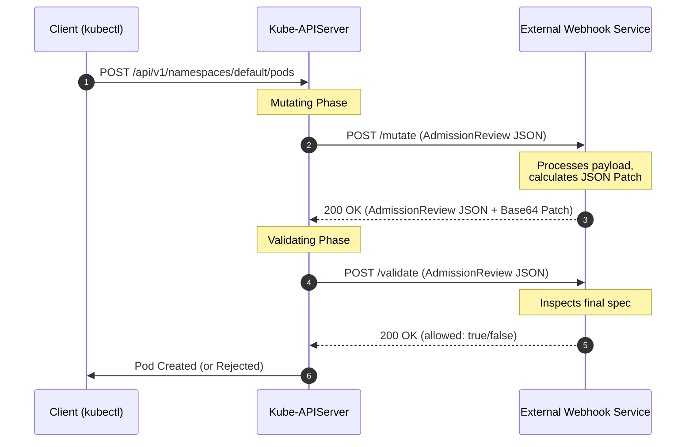

# Module 0-16: Kubernetes Admission Controllers & Webhooks

This module covers the Kubernetes admission control lifecycle, the distinction between mutating and validating phases, built-in admission plugins, dynamic webhook architectures, and custom webhook server implementations (Python Flask). It features a complete hands-on lab for configuring the `ImagePolicyWebhook` using the Deep-Intuition (AARF) framework.

---

## 🗺️ Cognitive Map: The Admission Request Lifecycle

To understand how Kubernetes secures and defaults resources, trace how an API request moves from authentication to final persistence in `etcd`:

```mermaid
flowchart LR
    Request["kubectl / API Request"] --> Auth["1. Authentication & Authorization"]
    Auth --> Mutating["2. Mutating Admission Plugins"]
    Mutating --> WebhookM["3. Mutating Webhooks (External)"]
    WebhookM --> ValidationSchema["4. OpenAPI Schema Validation"]
    ValidationSchema --> Validating["5. Validating Admission Plugins"]
    Validating --> WebhookV["6. Validating Webhooks (External)"]
    WebhookV --> Etcd[("etcd (Persistence)")]
    
    style Mutating fill:#f9f,stroke:#333,stroke-width:2px
    style WebhookM fill:#f9f,stroke:#333,stroke-width:2px
    style Validating fill:#bbf,stroke:#333,stroke-width:2px
    style WebhookV fill:#bbf,stroke:#333,stroke-width:2px
```



1. **Step 1: Authenticate and Authorize:** The API server verifies *who* you are (Authentication) and *if* you have permission to perform the verb on the resource (Authorization via RBAC). Read-only requests (`get`, `list`, `watch`) bypass admission control entirely.
2. **Step 2: Mutate (Modify):** The request enters the **Mutating Phase**. Built-in plugins (like `DefaultStorageClass`) and external Mutating Webhooks execute sequentially. They can modify the incoming spec (e.g., injecting sidecars, applying default resources, or adding labels).
3. **Step 3: Re-evaluation Loop:** If a mutating webhook alters the object, the API server restarts the mutating phase for all webhooks to ensure that changes do not violate previously executed default rules.
4. **Step 4: Schema Validation:** The API server validates the modified object structure against its OpenAPI v3 schemas.
5. **Step 5: Validate (Verify):** The request enters the **Validating Phase**. Built-in plugins (like `LimitRanger`, `NamespaceLifecycle`) and external Validating Webhooks run in parallel. They inspect the final object state and return a binary `allowed: true/false` decision. If any plugin rejects the request, the entire transaction fails immediately.

---

## 1. Built-in Admission Plugins

Kubernetes compiles several admission controllers directly into the `kube-apiserver` binary. Administrators enable or disable these plugins at startup.

### A. Configuration Flags
To enable additional plugins beyond the default set, use the `--enable-admission-plugins` flag on the `kube-apiserver`:
```bash
kube-apiserver --enable-admission-plugins=NamespaceLifecycle,LimitRanger,NodeRestriction,PodSecurity ...
```
To disable default plugins, use the `--disable-admission-plugins` flag:
```bash
kube-apiserver --disable-admission-plugins=PodNodeSelector,AlwaysDeny ...
```

### B. Core Default Plugins (v1.36)
* **`NamespaceLifecycle`:** Prevents object creation in terminating namespaces and blocks the deletion of system-reserved namespaces (`default`, `kube-system`, `kube-public`).
* **`NodeRestriction`:** Limits kubelets to only modifying their own `Node` and `Pod` objects, preventing a compromised node from altering other nodes' labels or scheduling constraints.
* **`LimitRanger`:** Enforces default resource requests and limits specified in `LimitRange` objects within namespaces.
* **`PodSecurity`:** Replaces the deprecated `PodSecurityPolicy` (PSP) to enforce Pod Security Standards (Privileged, Baseline, Restricted) via namespace labels.
* **`ServiceAccount`:** Automatically creates default ServiceAccount tokens, projects them into pods, and configures API credentials.

---

## 2. Dynamic Admission Webhooks

For custom validations and mutations (e.g., requiring all pods to have billing labels, blocking containers from running as root, or enforcing image registries), Kubernetes supports **Dynamic Admission Control** via external HTTPS webhooks.



### A. Webhook Configurations
Dynamic webhooks are configured using `MutatingWebhookConfiguration` or `ValidatingWebhookConfiguration` resources:

```yaml
apiVersion: admissionregistration.k8s.io/v1
kind: ValidatingWebhookConfiguration
metadata:
  name: security-policy-webhook
webhooks:
  - name: validate.security.example.com
    rules:
      - apiGroups: [""]
        apiVersions: ["v1"]
        operations: ["CREATE", "UPDATE"]
        resources: ["pods"]
        scope: "Namespaced"
    clientConfig:
      service:
        name: webhook-service
        namespace: security-system
        path: "/validate"
        port: 443
      caBundle: "LS0tLS1CRUdJTiBDRVJUSUZJQ0FURS0tLS0t..." # Base64 encoded PEM CA cert
    admissionReviewVersions: ["v1"]
    sideEffects: None
    timeoutSeconds: 5
    failurePolicy: Fail # Fail or Ignore
```

> [!WARNING]
> **`failurePolicy: Fail` vs `Ignore`**
> * `Fail` (Recommended for Security): If the webhook server is unreachable, the API request is rejected. This prevents security bypasses but can block cluster deployments if the webhook is down.
> * `Ignore` (Recommended for Non-Critical): If the webhook is unreachable, the request is allowed. Use this for logging, metrics, or optional defaulting.

---

## 3. Webhook Server Implementation (Python Flask)

An external webhook server must communicate over HTTPS, accept POST requests with an `AdmissionReview` payload, and return an `AdmissionReview` response.

### A. Mutating Webhook & JSON Patching
Mutations are returned as a list of RFC 6902 JSON Patch operations. The patch array is base64-encoded and returned in the `response.patch` field.

```python
import base64
from flask import Flask, request, jsonify

app = Flask(__name__)

@app.route('/mutate', methods=['POST'])
def mutate():
    admission_review = request.json
    uid = admission_review['request']['uid']
    pod = admission_review['request']['object']
    
    # Example logic: Inject a label indicating the user who created the pod
    username = admission_review['request']['userInfo']['username']
    
    patch = [
        {
            "op": "add",
            "path": "/metadata/labels/created-by",
            "value": username
        }
    ]
    
    # Base64 encode the patch operations
    patch_string = jsonify(patch).data
    encoded_patch = base64.b64encode(patch_string).decode('utf-8')
    
    return jsonify({
        "apiVersion": "admission.k8s.io/v1",
        "kind": "AdmissionReview",
        "response": {
            "uid": uid,
            "allowed": True,
            "patchType": "JSONPatch",
            "patch": encoded_patch
        }
    })

if __name__ == '__main__':
    # Webhook MUST run over HTTPS (requires TLS certs)
    app.run(ssl_context=('/etc/webhook/certs/tls.crt', '/etc/webhook/certs/tls.key'), port=8443, host='0.0.0.0')
```

---

## 4. Hands-on Lab: Configuring ImagePolicyWebhook

This section outlines the setup, deployment, and configuration of an `ImagePolicyWebhook` which delegates container image checks to an external vulnerability scanner.

### 🏛️ Deep-Intuition (AARF) Protocol

#### 1. The Answer (Core Configuration)

To configure `ImagePolicyWebhook` on the control plane:

##### Step A: Create the Admission Configuration File
Create `/etc/kubernetes/imgvalidation/admission-configuration.yaml` to register the plugin and specify the settings path:
```yaml
apiVersion: apiserver.config.k8s.io/v1
kind: AdmissionConfiguration
plugins:
  - name: ImagePolicyWebhook
    path: /etc/kubernetes/imgvalidation/imagepolicy-conf.yaml
```

##### Step B: Create the ImagePolicy Configuration File
Create `/etc/kubernetes/imgvalidation/imagepolicy-conf.yaml` to specify caching behavior and refer to the backend kubeconfig:
```yaml
imagePolicy:
  kubeConfigFile: /etc/kubernetes/imgvalidation/kubeconf.yaml
  allowTTL: 50
  denyTTL: 50
  retryBackoff: 500
  defaultAllow: false # Fails closed if scanner is down
```

##### Step C: Create the Backend Webhook Kubeconfig
Create `/etc/kubernetes/imgvalidation/kubeconf.yaml` to authenticate and direct traffic to the scanner:
```yaml
apiVersion: v1
kind: Config
clusters:
- cluster:
    certificate-authority: /etc/kubernetes/imgvalidation/webhook.crt
    server: https://image-checker-webhook.default.svc:1323/image_policy
  name: checker_webhook
contexts:
- context:
    cluster: checker_webhook
    user: api-server
  name: checker_validator
current-context: checker_validator
preferences: {}
users:
- name: api-server
  user:
    client-certificate: /etc/kubernetes/pki/front-proxy-client.crt
    client-key: /etc/kubernetes/pki/front-proxy-client.key
```

##### Step D: Mount Configuration in Kube-APIServer Static Pod Manifest
Modify `/etc/kubernetes/manifests/kube-apiserver.yaml` to mount the configurations and enable the plugin:
```yaml
spec:
  containers:
  - name: kube-apiserver
    command:
    - kube-apiserver
    - --enable-admission-plugins=NodeRestriction,ImagePolicyWebhook # Enable webhook
    - --admission-control-config-file=/etc/kubernetes/imgvalidation/admission-configuration.yaml # Set config path
    volumeMounts:
    - mountPath: /etc/kubernetes/imgvalidation
      name: imgvalidation
      readOnly: true
  volumes:
  - hostPath:
      path: /etc/kubernetes/imgvalidation
      type: DirectoryOrCreate
    name: imgvalidation
```

---

#### 2. The Assumptions (Context & Prerequisites)
* **TLS Authentication:** The communication channel between the API server and the image scanner must be secured using TLS. The API server client certificate (`front-proxy-client.crt`) and key (`front-proxy-client.key`) are used here to authenticate to the webhook service.
* **Volume Mounts:** Since the API server runs as a static pod, files stored on the control plane host (like `/etc/kubernetes/imgvalidation`) must be explicitly mounted into the container. Failing to do so causes the API server container to crash loop because it cannot locate the files.

---

#### 3. The Rationale (Why)
Relational databases or local filesystems cannot easily evaluate container vulnerabilities. The `ImagePolicyWebhook` allows the API server to delegate dynamic checks to external systems (e.g. Aqua, Trivy, Clair) at scheduling time. This ensures that pods containing high-risk CVEs are blocked *before* they are assigned to run on nodes.

---

#### 4. The Failure Loop (What if not)

##### Symptom A: API Server Crash Loop (Missing/Invalid Mounts)
If the paths inside the static pod manifest or the config files are misaligned, the API server container will fail to start.
* **Kernel log / docker container logs:**
  ```text
  Error: failed to initialize admission: imagepolicy: file "/etc/kubernetes/imgvalidation/imagepolicy-conf.yaml" does not exist
  ```

##### Symptom B: Pod Rejection (Webhook Endpoint Down or Unreachable)
If `defaultAllow` is set to `false`, any pod creation request will fail if the scanner goes offline:
```text
Error from server (Forbidden): Pod "nginx-deployment" is forbidden: image policy webhook "checker_webhook" denied the request: Failed to contact webhook
```

---

#### 5. Alternative Case (When to use 'if not')
* **`defaultAllow: true`:** Useful during staging migrations. If the scanner goes down, the cluster remains functional. However, this creates a security gap as malicious images could bypass validation during outages.
* **Policy Engines (Kyverno/Gatekeeper):** Rather than setting up complex config files and mounting directories on control plane hosts, administrators can deploy custom resource policies in the cluster using Kyverno or OPA Gatekeeper to inspect pod container image registries. Kyverno is much easier to manage as a soft-layer extension.
