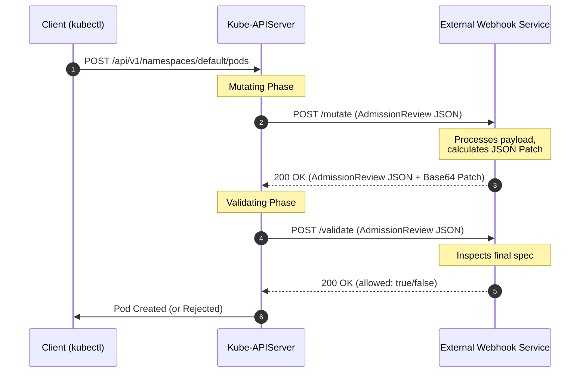
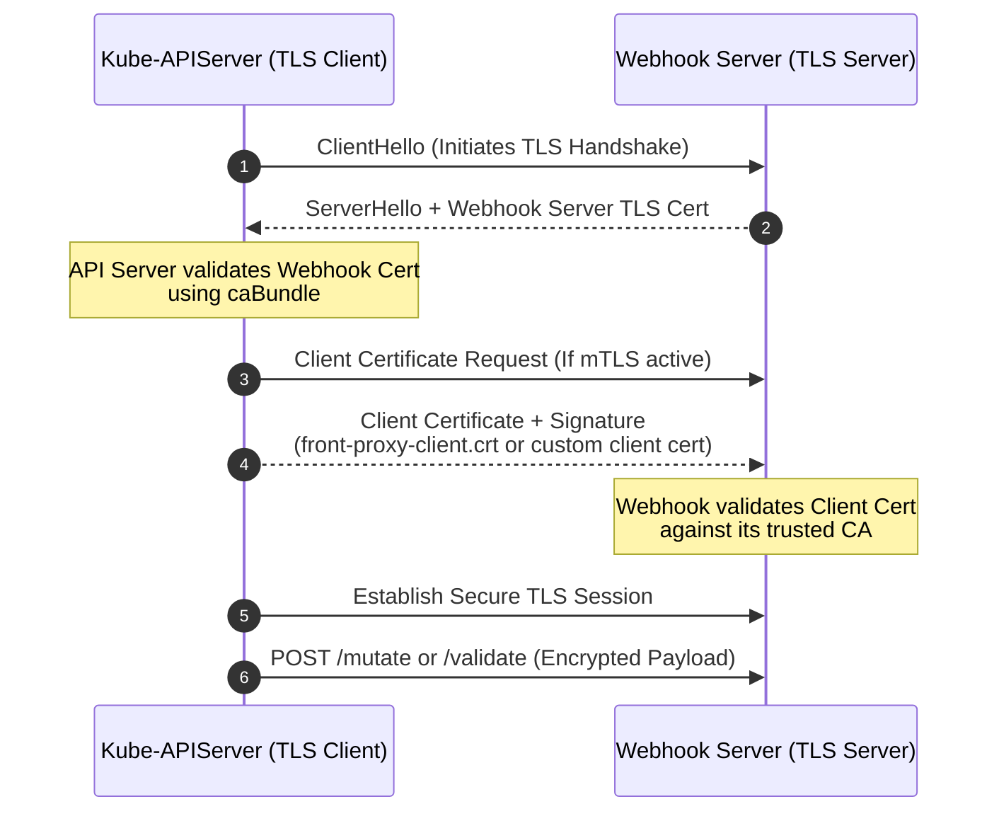

# Module 0-16: Kubernetes Admission Controllers & Webhooks

This module covers the Kubernetes admission control lifecycle, the distinction between mutating and validating phases, built-in admission plugins, dynamic webhook architectures, and custom webhook server implementations (Python Flask). It features a complete hands-on lab for configuring the `ImagePolicyWebhook` using the Deep-Intuition (AARF) framework.

---

## 🗺️ Cognitive Map: The Admission Request Lifecycle

To understand how Kubernetes secures and defaults resources, trace how an API request moves from authentication to final persistence in `etcd`:

```mermaid
flowchart LR
    Request["kubectl / API Request"] --> Auth["1. Authentication & Authorization"]
    Auth --> Mutating["2. Mutating Admission Plugins"]
    Mutating --> WebhookM["3. Mutating Webhooks (External)"]
    WebhookM --> ValidationSchema["4. OpenAPI Schema Validation"]
    ValidationSchema --> Validating["5. Validating Admission Plugins"]
    Validating --> WebhookV["6. Validating Webhooks (External)"]
    WebhookV --> Etcd[("etcd (Persistence)")]
    
    style Mutating fill:#f9f,stroke:#333,stroke-width:2px
    style WebhookM fill:#f9f,stroke:#333,stroke-width:2px
    style Validating fill:#bbf,stroke:#333,stroke-width:2px
    style WebhookV fill:#bbf,stroke:#333,stroke-width:2px
```



1. **Step 1: Authenticate and Authorize:** The API server verifies *who* you are (Authentication) and *if* you have permission to perform the verb on the resource (Authorization via RBAC). Read-only requests (`get`, `list`, `watch`) bypass admission control entirely.
2. **Step 2: Mutate (Modify):** The request enters the **Mutating Phase**. Built-in plugins (like `DefaultStorageClass`) and external Mutating Webhooks execute sequentially. They can modify the incoming spec (e.g., injecting sidecars, applying default resources, or adding labels).
3. **Step 3: Re-evaluation Loop:** If a mutating webhook alters the object, the API server restarts the mutating phase for all webhooks to ensure that changes do not violate previously executed default rules.
4. **Step 4: Schema Validation:** The API server validates the modified object structure against its OpenAPI v3 schemas.
5. **Step 5: Validate (Verify):** The request enters the **Validating Phase**. Built-in plugins (like `LimitRanger`, `NamespaceLifecycle`) and external Validating Webhooks run in parallel. They inspect the final object state and return a binary `allowed: true/false` decision. If any plugin rejects the request, the entire transaction fails immediately.

---

## 1. Built-in Admission Plugins

Kubernetes compiles several admission controllers directly into the `kube-apiserver` binary. Administrators enable or disable these plugins at startup.

### A. Configuration Flags
To enable additional plugins beyond the default set, use the `--enable-admission-plugins` flag on the `kube-apiserver`:
```bash
kube-apiserver --enable-admission-plugins=NamespaceLifecycle,LimitRanger,NodeRestriction,PodSecurity ...
```
To disable default plugins, use the `--disable-admission-plugins` flag:
```bash
kube-apiserver --disable-admission-plugins=PodNodeSelector,AlwaysDeny ...
```

### B. Core Default Plugins (v1.36)
* **`NamespaceLifecycle`:** Prevents object creation in terminating namespaces and blocks the deletion of system-reserved namespaces (`default`, `kube-system`, `kube-public`).
* **`NodeRestriction`:** Limits kubelets to only modifying their own `Node` and `Pod` objects, preventing a compromised node from altering other nodes' labels or scheduling constraints.
* **`LimitRanger`:** Enforces default resource requests and limits specified in `LimitRange` objects within namespaces.
* **`PodSecurity`:** Replaces the deprecated `PodSecurityPolicy` (PSP) to enforce Pod Security Standards (Privileged, Baseline, Restricted) via namespace labels.
* **`ServiceAccount`:** Automatically creates default ServiceAccount tokens, projects them into pods, and configures API credentials.

### C. Comprehensive Built-in Plugins Reference (v1.36)

Below is a catalog of all 35 built-in admission plugins available in Kubernetes v1.36.

#### 1. AlwaysAdmit
* **Type:** Validating
* **Feature State:** `Kubernetes v1.13 [deprecated]`
* **Default Status:** Disabled by default
* **Description:** Allows all pods into the cluster. Its behavior is identical to having no admission controller enabled at all. Deprecated because it has no practical utility.

#### 2. AlwaysDeny
* **Type:** Validating
* **Feature State:** `Kubernetes v1.13 [deprecated]`
* **Default Status:** Disabled by default
* **Description:** Rejects all requests. AlwaysDeny is deprecated as it has no practical utility.

#### 3. AlwaysPullImages
* **Type:** Mutating and Validating
* **Default Status:** Disabled by default
* **Description:** Modifies every new Pod to force its image pull policy to `Always`. This is highly useful in multi-tenant clusters to guarantee that users' private images can only be used by those who possess valid credentials to pull them. Without this plugin, once an image is pulled to a node, any pod scheduled on that node could run it by referencing its name, bypassing authorization checks. Enabling this plugin ensures that images are pulled on every pod deployment, requiring valid pull credentials.

#### 4. CertificateApproval
* **Type:** Validating
* **Default Status:** Enabled by default
* **Description:** Monitors requests to approve `CertificateSigningRequest` (CSR) resources and performs authorization checks to ensure the approver has explicit permissions to approve certificate requests with the requested `spec.signerName`.

#### 5. CertificateSigning
* **Type:** Validating
* **Default Status:** Enabled by default
* **Description:** Monitors updates to the `status.certificate` field of `CertificateSigningRequest` (CSR) resources and performs authorization checks to ensure the signer has explicit permissions to sign certificates for the requested `spec.signerName`.

#### 6. CertificateSubjectRestriction
* **Type:** Validating
* **Default Status:** Enabled by default
* **Description:** Monitors the creation of `CertificateSigningRequest` (CSR) resources requesting the `kubernetes.io/kube-apiserver-client` signer. It rejects any request that specifies a group (or organization attribute) of `system:masters`.

#### 7. DefaultIngressClass
* **Type:** Mutating
* **Default Status:** Enabled by default
* **Description:** Monitors the creation of `Ingress` objects that do not request a specific ingress class and automatically assigns the default ingress class. It does nothing if no default ingress class is configured. If more than one ingress class is configured as default, it rejects the `Ingress` creation request with an error (requiring administrators to mark exactly one ingress class as default using the annotation `ingressclass.kubernetes.io/is-default-class`). This controller ignores resource updates; it only evaluates them on creation.

#### 8. DefaultStorageClass
* **Type:** Mutating
* **Default Status:** Enabled by default
* **Description:** Monitors the creation of `PersistentVolumeClaim` (PVC) resources that do not request a specific storage class and automatically assigns the default storage class. It does nothing if no default `StorageClass` is configured. If multiple default storage classes exist, a PVC without a `storageClassName` will receive the most recently created default `StorageClass`. PVCs requesting a specific static volume remain pending if the static volume's storage class does not match the default storage class applied to the PVC. This controller ignores resource updates; it only evaluates them on creation.

#### 9. DefaultTolerationSeconds
* **Type:** Mutating
* **Default Status:** Enabled by default
* **Description:** Configures default forgiveness tolerations (5 minutes or 300 seconds) for taints `notready:NoExecute` and `unreachable:NoExecute` on pods that do not already have tolerations for `node.kubernetes.io/not-ready:NoExecute` or `node.kubernetes.io/unreachable:NoExecute`. This behavior is controlled by the API server flags `--default-not-ready-toleration-seconds` and `--default-unreachable-toleration-seconds`.

#### 10. DenyServiceExternalIPs
* **Type:** Validating
* **Default Status:** Disabled by default
* **Description:** Rejects all net-new usages of the `Service` field `externalIPs`. Since the `externalIPs` feature allows traffic interception, it poses a high security risk if not controlled. Once enabled, users cannot create new Services using `externalIPs` or add new values to `externalIPs` on existing Service objects. Existing uses remain unaffected, and users can still remove values from existing Services.

#### 11. EventRateLimit
* **Type:** Validating
* **Feature State:** `Kubernetes v1.13 [alpha]`
* **Default Status:** Disabled by default
* **Description:** Mitigates API server performance degradation caused by event flooding. Admins must enable the plugin and refer to a configuration file using the API server command-line flag `--admission-control-config-file`.
* **Configuration Format:**
  Specify the plugin configuration within `AdmissionConfiguration`:
  ```yaml
  apiVersion: apiserver.config.k8s.io/v1
  kind: AdmissionConfiguration
  plugins:
    - name: EventRateLimit
      path: eventconfig.yaml
  ```
  The rates are defined in `eventconfig.yaml`. There are four configurable rate limit types:
  * `Server`: All event requests share a single global rate-limiting bucket.
  * `Namespace`: Dedicated bucket per namespace.
  * `User`: Dedicated bucket per user.
  * `SourceAndObject`: Dedicated bucket per unique combination of event source and involved object.

  Example `eventconfig.yaml` content:
  ```yaml
  apiVersion: eventratelimit.admission.k8s.io/v1alpha1
  kind: Configuration
  limits:
    - type: Namespace
      qps: 50
      burst: 100
      cacheSize: 2000
    - type: User
      qps: 10
      burst: 50
  ```

#### 12. ExtendedResourceToleration
* **Type:** Mutating
* **Default Status:** Disabled by default
* **Description:** Eases the deployment of pods to dedicated nodes configured with extended resources (e.g., GPUs or FPGAs). Administrators typically taint these nodes with the name of the extended resource. When this plugin is enabled, it automatically adds the corresponding tolerations to pods that request the extended resource, removing the requirement for developers to manually specify them.

#### 13. ImagePolicyWebhook
* **Type:** Validating
* **Default Status:** Disabled by default
* **Description:** Intercepts pod creation requests to delegate image verification decisions to an external webhook backend service.
* **Configuration Format:**
  The plugin configuration points to a YAML or JSON configuration file via `--admission-control-config-file`:
  ```yaml
  apiVersion: apiserver.config.k8s.io/v1
  kind: AdmissionConfiguration
  plugins:
    - name: ImagePolicyWebhook
      path: imagepolicyconfig.yaml
  ```
  Alternatively, inline the configuration:
  ```yaml
  apiVersion: apiserver.config.k8s.io/v1
  kind: AdmissionConfiguration
  plugins:
    - name: ImagePolicyWebhook
      configuration:
        imagePolicy:
          kubeConfigFile: <path-to-kubeconfig-file>
          allowTTL: 50
          denyTTL: 50
          retryBackoff: 500
          defaultAllow: true
  ```
  The referenced `imagepolicyconfig.yaml` has the following format:
  ```yaml
  imagePolicy:
    kubeConfigFile: /path/to/kubeconfig/for/backend
    # Time in seconds to cache approval decisions
    allowTTL: 50
    # Time in seconds to cache denial decisions
    denyTTL: 50
    # Time in milliseconds to wait between retries
    retryBackoff: 500
    # True to allow request if the backend webhook fails (fails open)
    defaultAllow: true
  ```
  The `kubeConfigFile` is a standard kubeconfig format referencing the remote backend. The server must communicate over HTTPS (TLS):
  ```yaml
  # clusters refers to the remote service.
  clusters:
    - name: name-of-remote-imagepolicy-service
      cluster:
        certificate-authority: /path/to/ca.pem    # CA for verifying the remote service.
        server: https://images.example.com/policy # URL of remote service to query. Must use 'https'.

  # users refers to the API server's webhook configuration.
  users:
    - name: name-of-api-server
      user:
        client-certificate: /path/to/cert.pem # cert for the webhook admission controller to use
        client-key: /path/to/key.pem          # key matching the cert
  ```
* **Request and Response Payload Format:**
  When evaluating a pod, the API server sends a POST request with a JSON serialized `imagepolicy.k8s.io/v1alpha1` `ImageReview` object. This requires the API server to enable the `imagepolicy.k8s.io/v1alpha1` API extensions group via `--runtime-config=imagepolicy.k8s.io/v1alpha1=true`.
  
  Example JSON Request Payload:
  ```json
  {
    "apiVersion": "imagepolicy.k8s.io/v1alpha1",
    "kind": "ImageReview",
    "spec": {
      "containers": [
        {
          "image": "myrepo/myimage:v1"
        },
        {
          "image": "myrepo/myimage@sha256:beb6bd6a68f114c1dc2ea4b28db81bdf91de202a9014972bec5e4d9171d90ed"
        }
      ],
      "annotations": {
        "mycluster.image-policy.k8s.io/ticket-1234": "break-glass"
      },
      "namespace": "mynamespace"
    }
  }
  ```
  
  Example JSON Response Payload (Allowed):
  ```json
  {
    "apiVersion": "imagepolicy.k8s.io/v1alpha1",
    "kind": "ImageReview",
    "status": {
      "allowed": true
    }
  }
  ```
  
  Example JSON Response Payload (Denied):
  ```json
  {
    "apiVersion": "imagepolicy.k8s.io/v1alpha1",
    "kind": "ImageReview",
    "status": {
      "allowed": false,
      "reason": "image currently blacklisted"
    }
  }
  ```
* **Annotation Format:**
  All annotations matching `*.image-policy.k8s.io/*` on a Pod are included in the request payload. These can be used to pass dynamic context, such as a ticket number or break-glass request:
  ```yaml
  apiVersion: v1
  kind: Pod
  metadata:
    name: emergency-pod
    annotations:
      mycluster.image-policy.k8s.io/ticket-1234: "break-glass"
  ...
  ```

#### 14. LimitPodHardAntiAffinityTopology
* **Type:** Validating
* **Default Status:** Disabled by default
* **Description:** Rejects any pod that defines an `AntiAffinity` topology key other than `kubernetes.io/hostname` inside the `requiredDuringSchedulingIgnoredDuringExecution` scheduling rules.

#### 15. LimitRanger
* **Type:** Mutating and Validating
* **Default Status:** Enabled by default
* **Description:** Monitors incoming requests and ensures they satisfy the limits and default resources configured in the namespace's `LimitRange` objects. If enabled, it also applies default resource requests (e.g., configuring a 0.1 CPU request for pods in the `default` namespace that omit CPU requests).

#### 16. MutatingAdmissionWebhook
* **Type:** Mutating
* **Default Status:** Enabled by default
* **Description:** Invokes matching mutating webhooks in serial. Webhooks can modify the request spec. If any webhook has side effects, it must implement a reconciliation loop because later admission webhooks or validating plugins may still reject the request. If this plugin is disabled, you must also disable the `MutatingWebhookConfiguration` object in the `admissionregistration.k8s.io/v1` API group via the API server's `--runtime-config` flag.
  * **Cautions:**
    * Mutating webhook actions can confuse users since returned object definitions can differ from what they submitted.
    * Control loops might break if webhooks overwrite fields set in the original request. Avoid modifying fields that were explicitly set.
    * Future API server control loop updates could break webhooks that currently function well.

#### 17. NamespaceAutoProvision
* **Type:** Mutating
* **Default Status:** Disabled by default
* **Description:** Monitors incoming resource requests and checks whether the target namespace exists. If the namespace is not found, the controller automatically creates it. This is useful for environments that want to allow frictionless namespace creation.

#### 18. NamespaceExists
* **Type:** Validating
* **Default Status:** Disabled by default
* **Description:** Checks all requests on namespaced resources (except `Namespace` itself) and rejects requests if the referenced namespace does not exist. Typically replaced by the more comprehensive `NamespaceLifecycle` plugin.

#### 19. NamespaceLifecycle
* **Type:** Validating
* **Default Status:** Enabled by default
* **Description:** Enforces that no new objects can be created in a namespace that is currently terminating. It also rejects requests pointing to non-existent namespaces and prevents the deletion of three system-reserved namespaces: `default`, `kube-system`, and `kube-public`.

#### 20. NodeDeclaredFeatureValidator
* **Type:** Validating
* **Feature State:** `Kubernetes v1.36 [beta]`
* **Default Status:** Enabled by default (requires the `NodeDeclaredFeatures` feature gate to be enabled)
* **Description:** Inspects writes to bound Pods to verify that requested features are compatible with the Node where the Pod is running. It checks the `.status.declaredFeatures` field of the Node; if the Pod update demands a feature not declared by the node, the update is rejected to prevent subsequent runtime failures.

#### 21. NodeRestriction
* **Type:** Validating
* **Default Status:** Disabled by default in the bare `kube-apiserver` binary (but typically enabled by default in cluster bootstrappers like `kubeadm`)
* **Description:** Limits the `Node` and `Pod` objects that a kubelet can modify. kubelets must use credentials in the `system:nodes` group with username format `system:node:<nodeName>`. These kubelets are restricted to modifying only their own `Node` object and `Pod` objects bound to their node. They cannot remove or update taints from their `Node` object.
* **Label Restrictions:**
  * **Forbidden Labels:** Kubelets are blocked from modifying:
    * Labels prefixed with `node-restriction.kubernetes.io/` (reserved for administrative workload isolation).
    * Labels prefixed with `node-role.kubernetes.io/` (preventing nodes from self-assigning cluster roles like control-plane).
  * **Allowed Labels:** Kubelets can modify:
    * `kubernetes.io/hostname`
    * `kubernetes.io/arch`
    * `kubernetes.io/os`
    * `beta.kubernetes.io/instance-type`
    * `node.kubernetes.io/instance-type`
    * `failure-domain.beta.kubernetes.io/region` (deprecated)
    * `failure-domain.beta.kubernetes.io/zone` (deprecated)
    * `topology.kubernetes.io/region`
    * `topology.kubernetes.io/zone`
    * `kubelet.kubernetes.io/` prefixed labels
    * `node.kubernetes.io/` prefixed labels
  * **Reserved Labels:** All other labels under `kubernetes.io` or `k8s.io` prefixes are reserved for future features.
* **Audience Restriction:** If the `ServiceAccountNodeAudienceRestriction` feature gate is enabled, it limits the audiences for which a kubelet can request service account tokens via `TokenRequest` to those referenced by pods on that node or granted through RBAC.

#### 22. OwnerReferencesPermissionEnforcement
* **Type:** Validating
* **Default Status:** Disabled by default
* **Description:** Secures the `metadata.ownerReferences` field so that only users with `delete` permissions on the resource can modify it. It also secures `metadata.ownerReferences[x].blockOwnerDeletion` so that only users with `update` permissions on the `finalizers` subresource of the referenced owner object can alter it.

#### 23. PersistentVolumeClaimResize
* **Type:** Validating
* **Feature State:** `Kubernetes v1.24 [stable]`
* **Default Status:** Enabled by default
* **Description:** Restricts volume expansion requests. PVC resizing is blocked by default unless the underlying `StorageClass` explicitly sets `allowVolumeExpansion: true`.
  
  Example `StorageClass` enabling volume expansion:
  ```yaml
  apiVersion: storage.k8s.io/v1
  kind: StorageClass
  metadata:
    name: gp3-expandable
  provisioner: ebs.csi.aws.com
  allowVolumeExpansion: true
  ```

#### 24. PodNodeSelector
* **Type:** Validating
* **Feature State:** `Kubernetes v1.5 [alpha]`
* **Default Status:** Disabled by default
* **Description:** Defaults and limits the node selectors that can be used on pods in a namespace by reading namespace annotations and a global configuration.
* **Configuration Format:**
  Configure the plugin settings path via `--admission-control-config-file`:
  ```yaml
  apiVersion: apiserver.config.k8s.io/v1
  kind: AdmissionConfiguration
  plugins:
  - name: PodNodeSelector
    path: podnodeselector.yaml
  ```
  The mapping is defined in `podnodeselector.yaml`:
  ```yaml
  podNodeSelectorPluginConfig:
    clusterDefaultNodeSelector: "tier=frontend"
    namespace-a: "tier=backend"
    namespace-b: "tier=database"
  ```
* **Annotation Format:**
  Assign namespace selectors using the annotation `scheduler.alpha.kubernetes.io/node-selector`:
  ```yaml
  apiVersion: v1
  kind: Namespace
  metadata:
    name: namespace-c
    annotations:
      scheduler.alpha.kubernetes.io/node-selector: "tier=pci-compliant"
  ```
* **Internal Behavior:**
  1. Reads the namespace's `scheduler.alpha.kubernetes.io/node-selector` annotation value.
  2. If absent, falls back to the `clusterDefaultNodeSelector` defined in the plugin configuration.
  3. Rejects pods whose node selector conflicts with the namespace's node selector.
  4. Rejects pods whose node selector conflicts with namespace-specific allowed selectors configured in the plugin config.

#### 25. PodSecurity
* **Type:** Validating
* **Feature State:** `Kubernetes v1.25 [stable]`
* **Default Status:** Enabled by default
* **Description:** Checks pods against the requested security context and the Pod Security Standards (Privileged, Baseline, Restricted) configured on the namespace. Replaced the deprecated `PodSecurityPolicy` (PSP).

#### 26. PodTolerationRestriction
* **Type:** Mutating and Validating
* **Feature State:** `Kubernetes v1.7 [alpha]`
* **Default Status:** Disabled by default
* **Description:** Enforces and manages conflicts between pod tolerations and namespace-assigned tolerations. It rejects pods with conflicting tolerations. Otherwise, it merges the namespace's default tolerations into the pod, then validates the merged set against the allowed toleration whitelist of the namespace. If the namespace lacks annotations, it defaults to cluster-level defaults/whitelists.
* **Annotation Format:**
  Uses annotations `scheduler.alpha.kubernetes.io/defaultTolerations` and `scheduler.alpha.kubernetes.io/tolerationsWhitelist`:
  ```yaml
  apiVersion: v1
  kind: Namespace
  metadata:
    name: exclusive-apps
    annotations:
      scheduler.alpha.kubernetes.io/defaultTolerations: '[{"operator": "Exists", "effect": "NoSchedule", "key": "dedicated-node"}]'
      scheduler.alpha.kubernetes.io/tolerationsWhitelist: '[{"operator": "Exists", "effect": "NoSchedule", "key": "dedicated-node"}]'
  ```

#### 27. PodTopologyLabels
* **Type:** Mutating
* **Feature State:** `Kubernetes v1.35 [beta]`
* **Default Status:** Enabled by default (requires the `PodTopologyLabelsAdmission` feature gate to be enabled)
* **Description:** Modifies the `pods/binding` subresources for all pods bound to a Node, appending the node's topology labels (`topology.kubernetes.io/region` and `topology.kubernetes.io/zone`) to the pod. This exposes node topology data directly as pod labels, allowing it to be read via the Downward API.

#### 28. Priority
* **Type:** Mutating and Validating
* **Default Status:** Enabled by default
* **Description:** Resolves the `priorityClassName` field on pods and populates the corresponding integer priority value. Rejects the request if the referenced PriorityClass does not exist.

#### 29. ResourceQuota
* **Type:** Validating
* **Default Status:** Enabled by default
* **Description:** Monitors incoming requests to verify that they do not exceed resource limits defined in `ResourceQuota` objects within the target namespace. Must be enabled if resource quotas are utilized.

#### 30. RuntimeClass
* **Type:** Mutating and Validating
* **Default Status:** Enabled by default
* **Description:** Checks incoming pods selecting a RuntimeClass with configured Pod overhead. Rejects requests that have overhead pre-configured. If overhead is not set, it injects `.spec.overhead` into the pod as defined in the associated RuntimeClass.

#### 31. ServiceAccount
* **Type:** Mutating and Validating
* **Default Status:** Enabled by default
* **Description:** Implements automation for ServiceAccounts. It automates token generation, mounts credentials/tokens as projected volumes inside pods, and configures standard API client settings.

#### 32. StorageObjectInUseProtection
* **Type:** Mutating
* **Default Status:** Enabled by default
* **Description:** Protects active storage resources by attaching finalizers (`kubernetes.io/pvc-protection` or `kubernetes.io/pv-protection`) to newly created PVCs or PVs. This ensures storage resources are not deleted while bound to active pods.

#### 33. TaintNodesByCondition
* **Type:** Mutating
* **Default Status:** Enabled by default
* **Description:** Automatically applies `NotReady` and `NoSchedule` taints to newly created Nodes. This prevents pods from being scheduled on new nodes before their conditions have been reported and updated by control loop agents.

#### 34. ValidatingAdmissionPolicy
* **Type:** Validating
* **Default Status:** Enabled by default
* **Description:** Implements CEL (Common Expression Language) validations for incoming requests directly in the API server, without requiring external HTTP callouts. Enabled when the `validatingadmissionpolicy` feature gate is active.

#### 35. ValidatingAdmissionWebhook
* **Type:** Validating
* **Default Status:** Enabled by default
* **Description:** Calls matching validating webhooks in parallel. Rejects the API request if any webhook denies the request. Runs in the validation phase and cannot mutate objects. Webhooks with side effects must implement a reconciliation system. Disabling this plugin requires disabling the `ValidatingWebhookConfiguration` API resource.

---

## 2. Dynamic Admission Webhooks

For custom validations and mutations (e.g., requiring all pods to have billing labels, blocking containers from running as root, or enforcing image registries), Kubernetes supports **Dynamic Admission Control** via external HTTPS webhooks.



### A. Webhook Configurations
Dynamic webhooks are configured using `MutatingWebhookConfiguration` or `ValidatingWebhookConfiguration` resources:

```yaml
apiVersion: admissionregistration.k8s.io/v1
kind: ValidatingWebhookConfiguration
metadata:
  name: security-policy-webhook
webhooks:
  - name: validate.security.example.com
    rules:
      - apiGroups: [""]
        apiVersions: ["v1"]
        operations: ["CREATE", "UPDATE"]
        resources: ["pods"]
        scope: "Namespaced"
    clientConfig:
      service:
        name: webhook-service
        namespace: security-system
        path: "/validate"
        port: 443
      caBundle: "LS0tLS1CRUdJTiBDRVJUSUZJQ0FURS0tLS0t..." # Base64 encoded PEM CA cert
    admissionReviewVersions: ["v1"]
    sideEffects: None
    timeoutSeconds: 5
    failurePolicy: Fail # Fail or Ignore
```

> [!WARNING]
> **`failurePolicy: Fail` vs `Ignore`**
> * `Fail` (Recommended for Security): If the webhook server is unreachable, the API request is rejected. This prevents security bypasses but can block cluster deployments if the webhook is down.
> * `Ignore` (Recommended for Non-Critical): If the webhook is unreachable, the request is allowed. Use this for logging, metrics, or optional defaulting.

### B. TLS Handshake, Verification & Client Authentication Mechanics

When the `kube-apiserver` communicates with an external webhook (validating or mutating), it must run over HTTPS (TLS). This ensures encryption in transit and provides a mechanism to verify the identity of both the API server and the webhook server.



#### 1. Webhook Server Verification: The Role of `caBundle`
* **Purpose:** The `caBundle` is a PEM-encoded, base64-encoded certificate bundle (typically the Root or Intermediate Certificate Authority) stored inside the `MutatingWebhookConfiguration` or `ValidatingWebhookConfiguration` under `webhooks[].clientConfig.caBundle`.
* **Execution Behavior:** During the TLS handshake, the webhook server presents its server certificate to the `kube-apiserver`. The `kube-apiserver` verifies that:
  1. The webhook's certificate is cryptographically signed by one of the CAs present in the `caBundle`.
  2. The webhook's server hostname (or IP address) matches the Common Name (CN) or one of the Subject Alternative Names (SANs) declared in the webhook's certificate.
* **Failure Mode:** If the `caBundle` is missing, incorrect, or expired, the TLS handshake fails immediately. The API server terminates the connection and either rejects or ignores the request based on the configured `failurePolicy`.

#### 2. API Server Authentication: The Roles of `client-certificate` and `client-key`
* **Purpose:** To ensure that the webhook server is only processing requests sent by a legitimate `kube-apiserver` (and not a rogue actor on the network), the webhook server can enforce **Mutual TLS (mTLS)** by requesting a client certificate during the TLS handshake.
* **Configuration & Execution:**
  * **Static Webhooks (e.g., `ImagePolicyWebhook`):** These use a dedicated `kubeconfig` file (referenced via `--admission-control-config-file` -> `kubeConfigFile`). In this kubeconfig, the `users[].user` section defines the `client-certificate` and `client-key` paths on the control plane node:
    ```yaml
    users:
    - name: api-server
      user:
        client-certificate: /etc/kubernetes/pki/front-proxy-client.crt
        client-key: /etc/kubernetes/pki/front-proxy-client.key
    ```
    During the handshake, the `kube-apiserver` uses the `client-key` to sign the handshake details and sends the `client-certificate` to the webhook server. The webhook server verifies this certificate against its local trusted client CA bundle.
  * **Dynamic Webhooks (configured via CRDs):** The `kube-apiserver` automatically authenticates itself using its default client credentials. Administrators can configure these credentials via the API server flags `--proxy-client-cert-file` and `--proxy-client-key-file` (often utilizing the `front-proxy-client` certs). Alternatively, dynamic webhooks can use authentication tokens or headers if the webhook configuration uses `clientConfig.url` instead of `clientConfig.service`, but client-cert auth remains the standard for secure, zero-trust clusters.

---

## 3. Webhook Server Implementation (Python Flask)

An external webhook server must communicate over HTTPS, accept POST requests with an `AdmissionReview` payload, and return an `AdmissionReview` response.

### A. Mutating Webhook & JSON Patching
Mutations are returned as a list of RFC 6902 JSON Patch operations. The patch array is base64-encoded and returned in the `response.patch` field.

```python
import base64
from flask import Flask, request, jsonify

app = Flask(__name__)

@app.route('/mutate', methods=['POST'])
def mutate():
    admission_review = request.json
    uid = admission_review['request']['uid']
    pod = admission_review['request']['object']
    
    # Example logic: Inject a label indicating the user who created the pod
    username = admission_review['request']['userInfo']['username']
    
    patch = [
        {
            "op": "add",
            "path": "/metadata/labels/created-by",
            "value": username
        }
    ]
    
    # Base64 encode the patch operations
    patch_string = jsonify(patch).data
    encoded_patch = base64.b64encode(patch_string).decode('utf-8')
    
    return jsonify({
        "apiVersion": "admission.k8s.io/v1",
        "kind": "AdmissionReview",
        "response": {
            "uid": uid,
            "allowed": True,
            "patchType": "JSONPatch",
            "patch": encoded_patch
        }
    })

if __name__ == '__main__':
    # Webhook MUST run over HTTPS (requires TLS certs)
    app.run(ssl_context=('/etc/webhook/certs/tls.crt', '/etc/webhook/certs/tls.key'), port=8443, host='0.0.0.0')
```

### B. RFC 6902 JSON Patch Specification & Mechanics

When a mutating webhook makes modifications to the incoming object, it does not send the modified object back in its entirety. Instead, it computes and returns a base64-encoded array of **RFC 6902 JSON Patch** operations in the `response.patch` field. The API server then applies this list of mutations in order.

#### 1. Core Fields: `op`, `path`, and `value`
Every operation in a JSON Patch is an object containing:
* **`op` (Operation):** The action to perform. The most common operations in webhooks are:
  * `"add"`: Creates a new property or inserts a value into an array/object.
  * `"remove"`: Deletes a property or array element.
  * `"replace"`: Replaces the value of an existing property.
* **`path` (JSON Pointer):** An RFC 6901 pointer to the location in the JSON document where the operation should occur. Slash characters `/` separate keys and array indices (e.g. `/spec/containers/0/image`).
* **`value`:** The content to be added or replaced. Required for `add` and `replace` operations; omitted for `remove` operations.

#### 2. Key Insertions & Dictionary Modifications
Inserting keys into objects (like metadata labels or annotations) depends heavily on whether the parent object already exists in the manifest:

* **Case 1: Parent Object Exists:**
  If the `metadata.labels` dictionary is already defined in the pod request, inserting a new label is straightforward:
  ```json
  {
    "op": "add",
    "path": "/metadata/labels/billing-id",
    "value": "dept-45"
  }
  ```
* **Case 2: Parent Object Does NOT Exist (Null/Missing):**
  If the developer submitted a manifest *without* a `labels` block under `metadata`, attempting to patch `/metadata/labels/billing-id` directly will fail with an API server error. The parent path `/metadata/labels` must exist first.
  To resolve this, you must initialize the dictionary:
  ```json
  [
    {
      "op": "add",
      "path": "/metadata/labels",
      "value": {
        "billing-id": "dept-45"
      }
    }
  ]
  ```
  Or first check and add the empty object if missing:
  ```json
  [
    {
      "op": "add",
      "path": "/metadata/labels",
      "value": {}
    },
    {
      "op": "add",
      "path": "/metadata/labels/billing-id",
      "value": "dept-45"
    }
  ]
  ```

#### 3. Array Modifications (Containers, Volumes, Tolerations)
Modifying arrays (which represent lists in JSON, such as container specs) requires understanding how JSON Pointer addresses indices:

* **Appending to the End of a List (`/-`):**
  To inject a sidecar container or a common toleration at the end of the existing list, use the `-` character as the index. The API server appends the value to the end of the array:
  ```json
  {
    "op": "add",
    "path": "/spec/containers/-",
    "value": {
      "name": "logging-sidecar",
      "image": "fluentd:v1.16"
    }
  }
  ```
* **Prepending or Inserting at a Specific Index:**
  Specifying a numeric index shifts all subsequent elements to the right. To insert a container at the front (index 0):
  ```json
  {
    "op": "add",
    "path": "/spec/containers/0",
    "value": {
      "name": "init-debugger",
      "image": "busybox:latest",
      "command": ["sleep", "3600"]
    }
  }
  ```
  *(Note: The container previously at index 0 moves to index 1, and so on.)*
* **Replacing an Element or Field inside an Element:**
  To change the image of the first container (index 0) without replacing the entire container object:
  ```json
  {
    "op": "replace",
    "path": "/spec/containers/0/image",
    "value": "nginx:1.25.3-alpine"
  }
  ```
* **Removing an Element:**
  To delete a specific element (e.g. removing the second container at index 1):
  ```json
  {
    "op": "remove",
    "path": "/spec/containers/1"
  }
  ```
  *(Note: Subsequent elements shift left to fill the vacancy, e.g. index 2 becomes index 1.)*

-## 4. Hands-on Lab: Configuring ImagePolicyWebhook

This lab covers the setup, deployment, and configuration of an `ImagePolicyWebhook` which delegates container image checks to an external vulnerability scanner.

*See complete implementation and configuration steps in [[Project - Admission Webhooks#imagepolicywebhook-setup|Project - Admission Webhooks.md > ImagePolicyWebhook Setup]].*

---

## 5. Hands-on Lab: Deploying a Custom Mutating Admission Webhook

This lab covers the end-to-end setup and validation of a custom mutating admission webhook that enforces secure security contexts on newly created pods.

*See complete implementation and configuration steps in [[Project - Admission Webhooks#custom-mutating-webhook|Project - Admission Webhooks.md > Custom Mutating Webhook]].*

---User: 1234

---

## 6. Declarative Validation: Common Expression Language (CEL)

With the graduation of `ValidatingAdmissionPolicy` to stable and its inclusion as a default plugin in Kubernetes v1.36, cluster administrators can enforce fine-grained, policy-driven validations directly within the control plane, eliminating the need to write, host, and maintain external HTTPS webhook servers.

### A. How CEL Evaluates Resource Specs
The `kube-apiserver` compiles and executes CEL expressions in-process, which guarantees low latency, high throughput, and zero network-related points of failure.

CEL expressions evaluate to a boolean (`true` to allow, `false` to deny) using variables exposed by the API server from the active request context:

#### 1. Available Variables
* **`self` or `object`:** The state of the incoming resource being evaluated (e.g. `self.spec.replicas`).
* **`oldObject`:** The state of the resource prior to this request (null for `CREATE` operations). This is highly useful for validating immutable fields (e.g., `self.spec.storageClassName == oldObject.spec.storageClassName`).
* **`request`:** Metadata containing request details (e.g. `request.operation`, `request.userInfo.username`, `request.namespace`).
* **`params`:** An optional custom resource referenced via `paramKind` to inject dynamic configuration variables into the policy.

#### 2. Common CEL Syntax Patterns & Examples

* **Field Range & Value Constraints:**
  Ensure the replica count on a deployment is between 1 and 5:
  ```cel
  self.spec.replicas >= 1 && self.spec.replicas <= 5
  ```

* **Label/Map Existence & Values:**
  Ensure that if metadata labels exist, an `owner` label must be present:
  ```cel
  has(self.metadata.labels) && 'owner' in self.metadata.labels
  ```

* **List Verification (Iterative Evaluation):**
  Ensure all containers in a Pod declare CPU limits:
  ```cel
  self.spec.containers.all(c, has(c.resources.limits) && has(c.resources.limits.cpu))
  ```

* **Conditional Logic:**
  If the namespace is `"production"`, enforce that resources must not use the default namespace for images:
  ```cel
  request.namespace == "production" ? !self.spec.containers.exists(c, c.image.startsWith("default-registry/")) : true
  ```

### B. ValidatingAdmissionPolicy Configuration Structure
A complete CEL validation deployment requires two separate resources:
1. **`ValidatingAdmissionPolicy`**: Defines the matching rules (which APIs, versions, and verbs to intercept) and the CEL validation logic.
2. **`ValidatingAdmissionPolicyBinding`**: Links the policy to a scope (e.g., specific namespaces) and defines what action to take on failure (`Deny`, `Warn`, or `Audit`).

#### 1. The ValidatingAdmissionPolicy Manifest
```yaml
apiVersion: admissionregistration.k8s.io/v1
kind: ValidatingAdmissionPolicy
metadata:
  name: replica-limit-policy
spec:
  failurePolicy: Fail
  matchConstraints:
    resourceRules:
      - apiGroups: ["apps"]
        apiVersions: ["v1"]
        operations: ["CREATE", "UPDATE"]
        resources: ["deployments"]
  validations:
    - expression: "self.spec.replicas <= 5"
      message: "Deployments are restricted to a maximum of 5 replicas."
```

#### 2. The ValidatingAdmissionPolicyBinding Manifest
```yaml
apiVersion: admissionregistration.k8s.io/v1
kind: ValidatingAdmissionPolicyBinding
metadata:
  name: replica-limit-policy-binding
spec:
  policyName: replica-limit-policy
  validationActions: [Deny]
  matchResources:
    namespaceSelector:
      matchExpressions:
        - key: environment
          operator: In
          values: ["staging", "production"]
```

---

## 🔗 Related Modules
* [Module 02: Cluster Architecture & Control Plane Components](0-2_cluster_architecture_and_components.md) - Deep dive into API Server and etcd component roles.
* [Module 08: Security and Network Policies](0-7_security_and_network_policies.md) - Covers ServiceAccounts, securityContexts, and detailed TLS configurations.
* [Module 13: Scheduling, Logging, and Lifecycle Management](0-13_scheduling_logging_and_lifecycle.md) - Covers PriorityClasses, schedulers, and admission webhooks interaction.

### 📖 Sources & Ingested Transcripts
- CKA Course Transcript Segment: `inflow/cka_split/06_scheduling_and_placements.txt`
