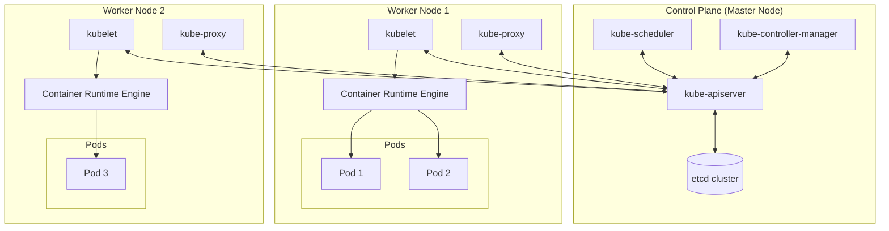

# Module 0-2-1: Control Plane Core Architecture & Daemon Mechanics

**Breadcrumbs:** [[0-Index - Kubernetes|🏠 Kubernetes Reference MOC]] > **Module 0-2-1**

---

## 1. Macro View: Control Plane vs. Worker Nodes

A Kubernetes cluster is a distributed system consisting of two primary roles: the **Control Plane** (the brain) and **Worker Nodes** (the muscle). Below is a structural diagram showing how these components interact:



### Conceptual Intuition: The Ship Analogy
To build an intuitive understanding of the Kubernetes architecture, think of a shipping port containing cargo and control ships:

| Kubernetes Component | Ship Analogy Role | Description |
| :--- | :--- | :--- |
| **Worker Nodes** | **Cargo Ships** | The physical or virtual machines that do the actual work of carrying and running the containers. |
| **Control Plane (Master Node)** | **Control Ship** | The command ship responsible for managing and monitoring the cargo ships, planning operations, and coordinating loading processes. |
| **`etcd`** | **Ship Logbook / Registry** | A highly available database that stores information in a key-value format about all ships, which containers are on which ship, loading times, and configurations. |
| **`kube-scheduler`** | **Loading Crane** | The scheduler that plans and places containers on specific cargo ships based on size, capacity, available resources, and constraints (like container destinations, taints, tolerations, and affinity rules). |
| **`kube-controller-manager`** | **Port Offices / Departments** | Specialized departments that handle specific control operations: <br>• *Operations Team (Node Controller)*: Handles ship onboarding, traffic control, and deals with damaged/destroyed ships.<br>• *Cargo Team (Replication Controller)*: Ensures the desired number of containers are active and undamaged in a replication group. |
| **`kube-apiserver`** | **Port Authority / Coordinator** | The primary management component that orchestrates all actions. It exposes the API used by external users and internal offices to query state and make changes. |
| **`kubelet`** | **Ship Captain** | An agent running on each worker node (cargo ship) that listens for instructions from the `kube-apiserver`, deploys or destroys containers, and sends periodic status reports back. |
| **`kube-proxy`** | **Port Services / Communications** | The service that installs communication rules so containers on different cargo ships can talk to each other (e.g., routing traffic from a web server on one ship to a database server on another). |
| **Container Runtime Engine** | **Container Compatibility Engine** | The underlying software (e.g., `containerd`, Docker) required on all nodes to support running containers. If control plane components are run as containers, it is also required on control plane nodes. |

### A. Core Architectural Foundations

Before container orchestration, deploying multi-tier applications (e.g., UI, backend, database) in **standalone containers** posed major reliability challenges:
* **Host Failures:** If a container crashed, the host system restarted it. However, if the entire host machine crashed, all containers went offline.
* **Network Resolution:** Manually resolving container network locations across different hosts required custom, fragile routing layers.
* **Orchestration Need:** An Orchestrator acts as a control agent to handle container runtime states, configure virtual networks, scale containers, and automate recovery.
  * **Docker Swarm:** A lightweight, simple Orchestrator suitable for small teams but hard to scale for massive configurations.
  * **Kubernetes:** A mature, open-source Orchestrator developed by Google (derived from their internal project **Borg**).

Kubernetes operates as both an **Orchestrator** (managing container life-cycle, networks, and configurations) and a **Cluster** (pooling compute, memory, and storage from multiple physical or virtual nodes into a single unified resource pool).
* **Node Redundancy:** If a node crashes, other nodes complement the resource deficiency and take over the workloads.
* **Horizontal Scaling (Scale Out/In):** Dynamically adding or removing nodes to adjust cluster compute capacity.
* **Vertical Scaling:** Increasing or decreasing the CPU/Memory resources allocated to a node or a container.

### B. The Control Plane (The Brains / Master Nodes)
* **Purpose:** Manages overall cluster state, schedules workloads, makes global decisions (e.g., detecting node failures), and exposes the API.
* **Linux Domain:** Runs on one or more Linux-based nodes, referred to as **Master Node(s)**.
* **Cluster Decoupling:** Kubernetes completely decouples the master control plane from the worker data plane. This ensures that control plane resources are not overloaded by high-resource user application loads, protecting cluster management performance. In small-scale or development environments, both control plane and worker components may run on a single node.
* **Production Sizing:** In production, master nodes must be deployed in **odd numbers** (e.g., 3, 5) to achieve consensus quorum (majority) and avoid split-brain issues.
* **Core Components:**
  * **`kube-apiserver`**: The front gate; receives and validates API requests, writing state directly to etcd.
  * **`etcd`**: Key-value data store representing the source of truth for all cluster configurations.
  * **`kube-scheduler`**: Matches unassigned Pods to nodes based on resource capacity, constraints, and affinity rules.
  * **`kube-controller-manager`**: Runs controller loops to compare actual cluster state with desired state.

### C. Worker Nodes (The Muscle / Data Plane)
* **Purpose:** Runs your containerized applications (Pods).
* **OS Support:** One or more nodes running Linux or Windows (Linux remains the dominant, primary platform for containers; Windows support exists but is specialized).
* **Core Components:**
  * **`kubelet`**: The node captain service; ensures containers are running inside Pods according to the PodSpecs.
  * **`kube-proxy`**: The network manager; maintains host network routing rules to implement Services.
  * **`Container Runtime`**: The container execution engine (e.g., `containerd` or `cri-o`) that pulls images and runs containers.
* **Operation:** Receives instructions from the control plane, pulls images, launches containers, and continuously feeds health telemetry back to the API server. For details on node registration, resources, and leases, see [Module 03: Node Mechanics & Resource Limits](0-3_node_mechanics_and_resource_limits.md). For Pod lifecycle and probing details, see [Module 04: Workload Lifecycle & Self-Healing](0-4_workload_lifecycle_and_healing.md).

---

## 2. Control Plane & Core Components (Deep Dive)

### A. `kube-apiserver` (The Front Gate)
* **Central Management:** Serves as the primary entry point for all control operations. Without it, the control plane cannot receive commands.
* **HTTP & JSON Protocol:** Receives incoming requests using standard HTTP protocol (REST API Web Server) but **always responds in JSON format**, which is parsed by tools (like `kubectl`) and applications to communicate.
* **Security Checks:** Authenticates the caller, validates their authorization permissions (e.g., checking if the user is allowed to create nodes or pods), applies admission plug-ins (e.g., `NodeRestriction`, `LimitRanger`), and persists state.
* **Configurations & Flags:**
  * `--advertise-address`: IP address to advertise to cluster members.
  * `--etcd-servers`: List of backend `etcd` URLs (e.g. `https://127.0.0.1:2379`). This is how the API server connects to the etcd cluster.
  * `--authorization-mode`: Decides auth chain order (e.g., `Node,RBAC`).
  * `--enable-admission-plugins`: Sequence of admission controllers (e.g., `NamespaceLifecycle`, `LimitRanger`, `ServiceAccount`).
* **Client and Component Certificate Configurations:**
  * To secure connectivity, several certificates are specified as CLI flags:
    * `--client-ca-file`: CA certificate bundle used to authenticate client certificates (e.g., `/etc/kubernetes/pki/ca.crt`).
    * `--tls-cert-file` and `--tls-private-key-file`: The server certificate and key enabling HTTPS on the API server.
    * `--etcd-cafile`, `--etcd-certfile`, `--etcd-keyfile`: Client certificates used by the API server to authenticate itself to the `etcd` cluster securely.
    * `--kubelet-client-certificate` and `--kubelet-client-key`: Credentials used by the API server to connect and authenticate to worker node `kubelet` API endpoints.
* **Verification Paths:**
  * **kubeadm Clusters:** Configured as a Static Pod. Manifest path: `/etc/kubernetes/manifests/kube-apiserver.yaml`.
  * **Manual Setup:** Configured as a systemd service. Service file path: `/etc/systemd/system/kube-apiserver.service`.
  * For runtime process inspection, execute: `ps -aux | grep kube-apiserver`.

### B. `etcd` (The Source of Truth)
* **Storage Model Comparison (SQL vs. Document vs. Key-Value):**
  * **Relational / SQL Databases:** Tabular format using rigid schemas with rows and columns. Adding new columns (e.g. salary, grades) affects the entire table structure, resulting in null/empty cells for rows that do not require those attributes. Best for structured data and complex SQL queries, but rigid.
  * **Document Stores:** Stores independent documents (usually in JSON format) per entry. Changes to one document do not affect others, meaning no strict schema is required. Flexible and best for semi-structured data, but limits complex queries (such as joins).
  * **Key-Value Stores:** Stores values against unique keys (e.g. `name: John`, or hierarchical key strings like `user:john_doe` pointing to a JSON document). No schema constraints, extremely fast lookup performance, and highly flexible since any payload structure can be stored. `etcd` is a distributed, reliable key-value store optimized for simple, high-speed lookups and writes.
* **Independence:** It runs as an independent daemon/service outside the API server (it is a standalone cluster/process).
* **Consensus & Ports:** Uses the **Raft consensus algorithm** to prevent split-brain. Client communication (e.g., API Server queries) listens on port **`2379`** by default. Peer-to-peer cluster node communication (e.g., leader election and replication) listens on port **`2380`**.
* **Raft Consensus Evolution & Quorum:**
  * **Evolution:** etcd version 2.0 (released in February 2015) redesigned the Raft consensus algorithm, enabling it to support more than 1,000 writes per second.
  * **HA Quorum:** In high-availability configurations, an odd number of `etcd` members (e.g., 3, 5) form a cluster to maintain consensus. Quorum is the majority of members needed to agree on writes and elect a leader:
    $$\text{Quorum} = \left\lfloor \frac{N}{2} \right\rfloor + 1$$
* **Configurations & Flags:**
  * `--listen-client-urls` and `--advertise-client-urls`: Specifies the addresses on which etcd listens for client API requests (port `2379`). Kube API server configuration dials this advertised client URL.
  * `--initial-cluster`: Lists cluster peer instances (`controller-0=https://...:2380,controller-1=https://...:2380`) for Raft consensus group formation.
  * `--data-dir`: Node-level directory path where keys are persisted (`/var/lib/etcd`).
* **API v2 vs v3 (CKA Essential CLI Tricks):**
  * Default behavior of `etcdctl` can vary; you must target API v3 by exporting `export ETCDCTL_API=3` (or prepending `ETCDCTL_API=3` to commands).
  * **API Changes:** Version 2.0 (2015) redesigned Raft; version 3.0 (2017) changed commands and added transaction support. API v2 used `set`, `get`, `rm` commands, while API v3 uses `put`, `get`, `del` (or `delete`) commands and supports transactions. CNCF incubation began in Nov 2018 and graduated in Nov 2020. Version 3.5 (2021) introduced `etcdutl`.
* **Kubernetes Registry Key Layout:**
  * All cluster state objects (nodes/minions, pods, replica sets, deployments, secrets, roles) are organized under a physical tree/directory hierarchy starting with `/registry` as the root.
  * *Example Path:* Pod specs are written under `/registry/pods/<namespace>/<pod-name>`.
  * Every change applied via `kubectl` is only considered complete once successfully written to the `etcd` registry database.
* **Querying Registry Keys Command:**
  To list all objects registered by the API Server in etcd, target the static pod using certificate flags (required for TLS client authorization):
  ```bash
  kubectl exec -n kube-system etcd-control-plane -- etcdctl \
    --cacert=/etc/kubernetes/pki/etcd/ca.crt \
    --cert=/etc/kubernetes/pki/etcd/server.crt \
    --key=/etc/kubernetes/pki/etcd/server.key \
    get / --prefix --keys-only
  ```

### C. `kube-scheduler` (The Matchmaker)
* **Role:** Watches the API server for unassigned Pods (`spec.nodeName` is blank) and assigns them to nodes.
* **Resource Utilization & Metrics:** Evaluates nodes using algorithms that assess node health, available vs. utilized resources (percentage of free memory/CPU), and checks if the pod has any node affinity/anti-affinity bindings to verify if the placement can occur.
* **Scheduling Pipeline Phases:**
  1. **Filtering (Predicates):** Evaluates nodes and filters out those unable to accommodate the Pod (e.g., checks CPU/Memory requests, node selectors, taints).
  2. **Ranking (Priorities):** Scores the remaining candidate nodes on a scale of `0` to `10` using priority functions (e.g., resource balance, image locality). The node with the highest score is selected.
  3. **Binding:** Submits a binding object to the API server, which writes the selected node name to `spec.nodeName`. Kubelet then detects and executes this binding.
* **Configurations & Customization:** Schedulers are highly customizable. You can configure multiple custom schedulers in the same cluster and reference them via `spec.schedulerName` in your Pod manifests.
* **Config Files & Binary Run:** In manual installations, the scheduler runs as a service pointing to a scheduler configuration file via `--config=<path-to-config-file>`.
* **Verification & Static Pod Paths:**
  * **kubeadm:** Manifest at `/etc/kubernetes/manifests/kube-scheduler.yaml`.
  * **Manual Setup:** Service file at `/etc/systemd/system/kube-scheduler.service`.
  * Process check: `ps -aux | grep kube-scheduler`.

### D. `kube-controller-manager` (The Enforcer)
The **`kube-controller-manager`** is the core Control Plane component responsible for running the **reconciliation loops** that maintain the cluster's state. It is compiled as a single binary daemon but runs many independent controllers concurrently.

```text
 ┌────────────────────────────────────────────────────────┐
 │            The Reconciliation Loop                     │
 │                                                        │
 │      ┌──────────────┐          Desired State (etcd)    │
 │      │   Observe    │◄─────────┐                       │
 │      └──────┬───────┘          │                       │
 │             │                  │                       │
 │             ▼                  │                       │
 │      ┌──────────────┐          │                       │
 │      │   Analyze    │──────────┼──► [ Diff ? ]         │
 │      └──────┬───────┘          │        │              │
 │             │                  │        ▼              │
 │             ▼                  │    Yes: Act           │
 │      ┌──────────────┐          │    No: Loop           │
 │      │     Act      │──────────┘                       │
 │      └──────────────┘                                  │
 └────────────────────────────────────────────────────────┘
```

#### 1. What is the Reconciliation Loop?
The Reconciliation Loop is a continuous, infinite control loop that monitors the cluster and drives it toward the **desired state** defined in your YAML manifests. It performs three core steps repeatedly:
1.  **Observe (Current State):** Queries the actual state of the cluster (e.g., checking how many containers are running, or if a node is healthy).
2.  **Analyze (Diff):** Compares the *observed actual state* against the *desired state* retrieved from `etcd` (e.g. "Desired replicas: 3, Actual running: 2. Diff: +1 Pod needed").
3.  **Act (Remediate):** Executes the necessary operations to eliminate the difference (e.g. telling the API Server to create a new Pod).

#### 2. The Role of the Controller Manager
The `kube-controller-manager` hosts these reconciliation loops. Inside it, a dedicated controller exists for every Kubernetes resource type:
*   **ReplicaSet Controller:** Reconciles Pod counts. If a Pod is deleted manually, it spins up a replacement.
*   **Node Controller:** Audits node health. Rather than scanning heavy Node objects, it watches lightweight **Lease Objects** (heartbeats) updated by each node's `kubelet` every 10 seconds in the `kube-node-lease` namespace. If a lease is not updated within the node monitor grace period (default 40s), the controller marks the node `Unreachable` and coordinates workload evictions. This Lease model reduces `etcd` write load dramatically.
*   **Namespace Controller:** Cleans up all nested resources when a namespace is deleted.
*   **Deployment Controller:** Orchestrates rolling updates by shifting traffic between old and new ReplicaSets.

#### 3. How Controllers Watch the API Server (Informers vs. Polling)
To prevent crushing the API server with constant query requests (polling), controllers use **Informers** and HTTP **Watch** connections:
*   **HTTP Watch:** A controller establishes a persistent HTTP connection to the `kube-apiserver`.
*   **Push Notifications:** When a resource changes (e.g., a Pod is added or deleted), the API Server pushes an event notification directly to the controller.
*   **Shared Informers:** The controller caches the state locally using a `SharedInformer` to read resource status instantly without hitting the API server database repeatedly.

#### 4. Configuration Directories & Static Pod Manifests
*   **kubeadm:** Manifest at `/etc/kubernetes/manifests/kube-controller-manager.yaml`.
*   **Manual Setup:** Service file at `/etc/systemd/system/kube-controller-manager.service`.
*   You can select which controllers to run using the `--controllers` flag (e.g. `--controllers=*` to enable all, or prefixing with a minus `-` to disable specific ones).

#### 5. Deep-Dive: Watch Connections, Concurrency & Data Consistency

To implement a highly reliable distributed control plane, Kubernetes coordinates updates, monitors node heartbeats, and handles write concurrency using specific protocols:

##### A. The Watch Connection (HTTP Chunked Streaming)
*   **The Polling Problem:** If controllers constantly polled the API Server (e.g., asking *"Has this lease changed?"* every 1s), the API Server and `etcd` would run out of resources and crash.
*   **The Watch Solution:** Instead of polling, a controller initiates an HTTP `GET` request appending the query parameter `?watch=true`.
*   **Chunked Transfer Encoding:** The API Server returns an HTTP `200 OK` response but keeps the TCP connection open indefinitely (`Transfer-Encoding: chunked`).
*   **Push Notifications:** Whenever a resource changes, the API Server instantly pushes a tiny JSON chunk containing the change details down that pre-established pipe (the Pub/Sub pattern). 
*   **Decoupled Action:** The controller reads the stream, updates its local `SharedInformer` memory cache, runs its business logic, and initiates a **new, separate connection** (like a `POST` or `PUT`) to request updates.

##### B. Kubelet to API-Server Network Paths
*   **Worker-to-Master (Outbound HTTPS):** The `kubelet` is an HTTPS client. It does **not** have an ongoing persistent bidirectional connection to the API Server. It makes standard outbound HTTPS requests (e.g., PUT/PATCH updates to its Lease object every 10s) and closes them or returns them to a standard reuse pool.
*   **Master-to-Worker (The Persistent Proxy Tunnel):** When you run `kubectl logs` or `kubectl exec`, the API Server must act as the client and initiate a connection *down* to the Kubelet on port `10250`. 
    *   *The Firewall Issue:* Master nodes are often isolated and blocked by firewalls from initiating inbound traffic to worker subnets.
    *   *The Konnectivity Solution:* An agent (`konnectivity-agent`) on the worker node establishes a **persistent outbound TCP connection** to the `konnectivity-server` on the master. When the API Server needs to talk to the Kubelet, it routes the traffic down this pre-established tunnel.

##### C. Optimistic Concurrency Control (OCC) vs. Pessimistic Locking
When thousands of controllers send write requests, Kubernetes must prevent them from overwriting each other's changes.
*   **Pessimistic Locking (PCC):** Locks a database record when Client A reads it, blocking Client B from even reading it until Client A finishes. This creates massive performance bottlenecks and is **not** used by Kubernetes.
*   **Optimistic Concurrency Control (OCC):** Assumes conflicts are rare. It allows concurrent reads and writes, but verifies that no other client has modified the object since it was read, using `metadata.resourceVersion`.

###### The Race Condition Scenario: SRE vs. HPA Scale Conflict
*   **Setup:** A Deployment `web-server` has `replicas: 10` and `resourceVersion: "500"`.
*   **Action 1:** SRE reads version `"500"` and prepares a scale-down to `5` replicas.
*   **Action 2:** HPA reads version `"500"` and prepares a scale-up to `12` replicas.
*   **The Execution:**
    1.  **HPA's request arrives first:** The API Server checks the DB (which is currently `"500"`). It matches the request version `"500"`. The write succeeds, setting replicas to `12` and bumping the database version to `"501"`.
    2.  **SRE's request arrives a millisecond later:** SRE sends a request to scale to `5` with base version `"500"`. The API Server checks the DB (which is now `"501"`).
    3.  **The Mismatch:** The versions do not match (`"500"` != `"501"`). The API Server rejects the SRE's write and returns an **HTTP 409 Conflict** error.
*   **The Resolution:** The SRE's CLI tool catches the 409 error, fetches the fresh copy of the Deployment (which has version `"501"` and `replicas: 12`), and prompts or retries the scale request with base version `"501"`.

> [!NOTE] **Q&A: If the SRE retries and sets it to 5, isn't the 12 still overwritten?**
> **Yes.** The database value is logically overwritten to 5. However, OCC changes **how** this happens to prevent bugs:
> *   **Without OCC (Silent/Accidental Erasure):** The SRE's command would overwrite the HPA's scale-up *blindly and silently*. The SRE has no idea the HPA had scaled it to 12 (thinking they scaled from 10 to 5). The 12 replicas are lost by accident.
> *   **With OCC (Intentional/Aware Override):** The SRE's command is blocked by the 409 Conflict. The SRE is forced to pull the new version, revealing that the HPA had scaled it to 12. The SRE now makes an **informed decision**:
>     *   *Option A (Retreat):* Cancel the scale-down because they see the app is under high load (the 12 replicas are saved).
>     *   *Option B (Manual Override):* Intentionally override the HPA and scale to 5 anyway (e.g. for emergency maintenance).
> OCC does not stop you from overriding data; it stops you from modifying data **based on stale information**.

##### D. Declarative Merging (PATCH vs. PUT) & The Tug-of-War
To avoid conflicts and prevent actors from fighting over fields:
*   **PATCH (Declarative / `kubectl apply`):** Instead of sending the full object, clients send only the specific fields they wish to modify (e.g. SRE patches a label, HPA patches replica count). The API Server merges these changes seamlessly without triggering version conflicts.
*   **Tug-of-War:** If two components *do* patch the same field (e.g. SRE manually edits `replicas: 5` while HPA sets `replicas: 12`), the SRE's change will initially succeed, but on the next HPA loop cycle (usually 15 seconds), the HPA will see the high CPU and patch it back to 12.
*   **Best Practice:** Never manually edit the `replicas` field of a Deployment managed by an HPA. Instead, modify the HPA configuration (e.g., changing its `minReplicas` or `maxReplicas` settings) to keep human and machine state goals aligned.


> [!NOTE] Object vs. Resource Terminologies
> * A **Kubernetes object** is a persistent *record of intent* in the cluster. It represents a specific instance of something you want to exist. When created, you tell Kubernetes your desired state (spec) and Kubernetes ensures the actual state (status) is reconciled to match it ("make it so and keep it that way"). Objects have a `spec`, `status`, and `metadata`.
> * A **resource** is a category or API class of objects.
> * *Example:* **Pod** is a resource type, while **my-app-pod** is an instance object of that Pod resource type.

### E. Pod Creation Lifecycle Flow
When a user applies a manifest (e.g., `kubectl apply -f pod.yaml`):
1. The `kube-apiserver` receives the HTTP POST request containing the manifest data.
2. The API server performs authentication, authorization, and validation checks.
3. Upon approval, the API server saves the Pod specification as a record of intent in `etcd`.
4. The API server **publishes** a "Pod Created" event.  # Important note
5. The `kube-scheduler` (which is subscribed/watching the API server event stream) detects the new unscheduled Pod (where `spec.nodeName` is empty).
6. The scheduler runs its filter/rank algorithms, chooses a worker node, and writes the selected host back to the API server (`binding` operation).
7. The API server updates `etcd` and **publishes** a binding event. .  # Important note
8. The `kubelet` running on the selected worker node (also watching the API server) detects that a Pod has been assigned to its node.
9. The `kubelet` interfaces with the local Container Runtime (CRI) to pull the image and run the containers, writing the status back to the API server.

### F. Worker Node Status Telemetry & Eviction Timings
Worker nodes through their `kubelet` actively update the control plane with health telemetry:
* **Kubelet Status Heartbeat:** The `kubelet` updates the node status every **5 seconds**.
* **Lease Timeout (40s):** If the API server does not receive a heartbeat for **40 seconds** (the node lease expiry window), the Node Controller flags the node as unreachable and stops routing new traffic/requests to it.
* **Eviction Timeout (5m):** To the user, everything might still appear ready or pending, but once **5 minutes** (default eviction grace period) passes, the node status is fully updated to `NotReady` and the **node controller initiates cascading deletions** to evict the Pods and reschedule them to healthy nodes.

### G. `kube-proxy` (The Network Router)
* **Role:** A network agent running on every node that enables cluster-wide network routing for Services.
* **Service Virtual Entity:** Services are *virtual entities in the cluster's memory*  — they do not correspond to any container, network card, or physical interface.
* **Routing Mechanism (iptables vs IPVS):**
  * Kube-proxy watches the API Server for new Services and Endpoints and implements host-level routing:
    * **`iptables` Mode (Default):** Configures sequential netfilter rules inside the kernel. Lookup complexity is $O(N)$, causing high CPU overhead in large clusters. Uses random selection load balancing.
    * **`IPVS` Mode:** Configures hash tables in the kernel's IP Virtual Server module. Lookup complexity is $O(1)$, which is highly scalable for large clusters. Supports advanced algorithms like Round Robin (`rr`) or Least Connections (`lc`).
* **Important Distinction:** `kube-proxy` is for **Service networking** (handling client-to-service routing), not for API server-to-node ---> control plane communications to worker nodes (is handled directly by the `kubelet` to api-server).
* **Verification & Deployment:**
  * **kubeadm:** Deployed as a `DaemonSet` in the `kube-system` namespace.
  * Retrieve DaemonSet configuration: `kubectl get daemonset -n kube-system kube-proxy`.
  * List instances and check logs: `kubectl get pods -n kube-system -l k8s-app=kube-proxy` and `kubectl logs -n kube-system <pod-name>`.
  * Verify programmed iptables rules on worker nodes: `iptables -t nat -L KUBE-SERVICES -n -v`.

---

## 2.1 Component Configuration Paths Quick Reference

| Component              | Installation Mode    | Config File / Path                                       | Check Status Command                                                 |
| :--------------------- | :------------------- | :------------------------------------------------------- | :------------------------------------------------------------------- |
| **Kube API Server**    | kubeadm (Static Pod) | `/etc/kubernetes/manifests/kube-apiserver.yaml`          | `kubectl get po -n kube-system -l component=kube-apiserver`          |
|                        | Manual (systemd)     | `/etc/systemd/system/kube-apiserver.service`             | `systemctl status kube-apiserver`                                    |
| **etcd**               | kubeadm (Static Pod) | `/etc/kubernetes/manifests/etcd.yaml`                    | `kubectl get po -n kube-system -l component=etcd`                    |
|                        | Manual (systemd)     | `/etc/systemd/system/kube-apiserver.service`             | `systemctl status etcd`                                              |
| **Kube Scheduler**     | kubeadm (Static Pod) | `/etc/kubernetes/manifests/kube-scheduler.yaml`          | `kubectl get po -n kube-system -l component=kube-scheduler`          |
|                        | Manual (systemd)     | `/etc/systemd/system/kube-scheduler.service`             | `systemctl status kube-scheduler`                                    |
| **Controller Manager** | kubeadm (Static Pod) | `/etc/kubernetes/manifests/kube-controller-manager.yaml` | `kubectl get po -n kube-system -l component=kube-controller-manager` |
|                        | Manual (systemd)     | `/etc/systemd/system/kube-controller-manager.service`    | `systemctl status kube-controller-manager`                           |
| **Kube Proxy**         | kubeadm (DaemonSet)  | `kubectl edit ds/kube-proxy -n kube-system`              | `kubectl get ds -n kube-system -l k8s-app=kube-proxy`                |
|                        | Manual (systemd)     | `/etc/systemd/system/kube-proxy.service`                 | `systemctl status kube-proxy`                                        |

---
