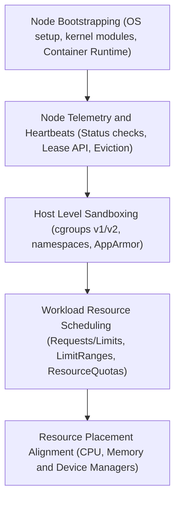

# Module 0-3: Node Mechanics & Resource Limits

This module covers node lifecycles, health monitoring, resource allocation math, Quality of Service (QoS) classes, Linux kernel resource limits (`cgroups`), and node-to-control-plane communication.

---

## 🗺️ Cognitive Map: How to Think About the Flow of Knowledge

To build a strong intuition for this module, think of the topics as progressing from the physical OS configuration up to logical resource management and hardware-aware tuning:



1. **Step 1: Node Bootstrapping (Section 1):** We start at the host operating system layer. We load kernel modules (`overlay`, `br_netfilter`), set sysctl networking variables, and align the Container Runtime (containerd) with the Kubelet on systemd cgroups.
2. **Step 2: Node Telemetry & Heartbeats (Sections 2, 3, 4, 5 & 6):** Once the node is registered, we monitor its health. We read Node Conditions (`Ready`, `MemoryPressure`), use the Lease API to send lightweight heartbeats, manage controller eviction thresholds during failures, and sort node performance via `kubectl`.
3. **Step 3: Host Level Sandboxing (Section 7):** We inspect how the Kubelet isolates workloads on the host, using cgroups v1/v2 for resource throttling, the pause container for shared namespaces, and AppArmor/Seccomp profiles for kernel-level security.
4. **Step 4: Workload Resource Scheduling (Section 8):** With host-level isolation established, we declare compute constraints for our workloads. We set CPU/Memory requests/limits, enforce constraints via LimitRanges, and cap aggregate resource consumption with ResourceQuotas.
5. **Step 5: Resource Placement Alignment (Section 9):** Finally, we look at hardware optimizations. We explore CPU, Memory, Device, and Topology managers to guarantee hardware alignment (NUMA nodes, CPU pinning) for high-performance workloads.

By following this flow, you progress from **OS Prerequisites (Bootstrapping) → Cluster Telemetry (Heartbeats) → Host Security (Sandboxing) → Logical Scheduling Limits (Requests/Limits) → Advanced Hardware Optimization (Resource Managers)**.

---


## 1. Node Registration & Kubelet Mechanics

The **`kubelet`** is the node-level agent responsible for managing workloads. It acts as the "captain of the ship" on each worker node, registering the host machine, launching containers, monitoring their health, and feeding telemetry back to the control plane.

Unlike other Kubernetes components (API Server, Scheduler, etc.) which can run inside containers, the `kubelet` must run as a native service directly on the host operating system. This is because **it requires root privileges to modify host directories**, **configure network interfaces**, and **interact** with the **kernel namespaces/cgroups.**

### A. Node Registration Pathways
Nodes are registered as objects in `etcd` in two ways:
* **Self-Registration (Default):** The `kubelet` service starts on the node, contacts the `kube-apiserver`, and registers itself by reporting its physical capacity, IP addresses, and versions.
* **Manual Administration:** An administrator creates a Node manifest (YAML) and applies it to the cluster manually, disabling self-registration in the `kubelet` configuration.

> [!WARNING]
> **Physical Entity Inconsistencies:** Node objects in the API represent physical hosts. If a host is re-created (e.g. re-provisioned or replaced) under the same name without first deleting the old Node object from the API server, Kubernetes will treat the new host as the old one. This can cause severe state inconsistencies, resource allocation skew, and authentication failures.

### B. Node Kernel & Container Runtime Prerequisites
Before bootstrapping a Kubernetes node (control plane or worker), you must configure host networking, load kernel modules, and set up a compatible container runtime (e.g., `containerd` using the `systemd` cgroup driver).

#### 1. Kernel Module Configuration
Kubernetes networking relies on the kernel's ability to see and route bridged traffic. Add the `overlay` and `br_netfilter` modules to load at boot:
```bash
cat <<EOF | sudo tee /etc/modules-load.d/k8s.conf
overlay
br_netfilter
EOF

# Activate modules immediately without reboot
sudo modprobe overlay
sudo modprobe br_netfilter
```
* **`overlay`**: The storage driver that allows container runtimes to overlay a writable filesystem layer on top of a read-only base layer, ensuring fast container startup and disk efficiency.
* **`br_netfilter`**: A module that enables the Linux kernel to filter packets traversing network bridges. Without this, the host cannot pass bridge traffic to the iptables chains.

#### 2. Sysctl Network Configuration
Ensure that IPv4 packet forwarding is enabled and that iptables can inspect bridge traffic (critical for kube-proxy and CNI functionality):
```bash
cat <<EOF | sudo tee /etc/sysctl.d/k8s.conf
net.bridge.bridge-nf-call-iptables  = 1
net.bridge.bridge-nf-call-ip6tables = 1
net.ipv4.ip_forward                 = 1
EOF

# Apply sysctl parameters immediately
sudo sysctl --system
```
* **`net.bridge.bridge-nf-call-iptables = 1`**: Forces bridged packets to pass through the host's iptables rules, enabling CNI firewalling and kube-proxy load balancing.
* **`net.ipv4.ip_forward = 1`**: Enables the kernel to forward packets between interfaces, allowing pods to send outbound internet traffic or talk across hosts.

#### 3. Containerd Configuration & Cgroup Driver Alignment
After installing `containerd` (e.g., `sudo apt-get install containerd`), you must generate its default configuration and configure the cgroup driver to use systemd:
```bash
sudo mkdir -p /etc/containerd
containerd config default | sudo tee /etc/containerd/config.toml
```
Within `/etc/containerd/config.toml`, locate the `containerd.runtimes.runc.options` section and configure it:
```toml
[plugins."io.containerd.grpc.v1.cri".containerd.runtimes.runc.options]
  SystemdCgroup = true
```
* **`SystemdCgroup = true`**: Dictates that containerd interfaces directly with systemd's cgroup management API instead of the legacy `cgroupfs` driver. The kubelet and container runtime must align on this driver to prevent node instability and process tracking crashes.

After updating the config, restart containerd:
```bash
sudo systemctl restart containerd
```

### C. Installing and Configuring Kubelet as a Service
When bootstrapping a node manually:
1. **Download the Kubelet Binary:**
   ```bash
   wget https://storage.googleapis.com/kubernetes-release/release/v1.28.0/bin/linux/amd64/kubelet
   chmod +x kubelet
   mv kubelet /usr/local/bin/
   ```
2. **Configure the systemd Service:**
   Create the systemd unit file at `/etc/systemd/system/kubelet.service`:
   ```ini
   [Unit]
   Description=Kubernetes Kubelet
   Documentation=https://github.com/kubernetes/kubernetes
   After=containerd.service
   Requires=containerd.service

   [Service]
   ExecStart=/usr/local/bin/kubelet \
     --config=/var/lib/kubelet/kubelet-config.yaml \
     --container-runtime-endpoint=unix:///run/containerd/containerd.sock \
     --kubeconfig=/var/lib/kubelet/kubeconfig \
     --register-node=true \
     --v=2

   [Install]
   WantedBy=multi-user.target
   ```
   * **Key Parameters Explained:**
     * `--config`: Path to the YAML file holding node configurations (such as Cgroup driver, eviction thresholds).
     * `--container-runtime-endpoint`: Path to the CRI UNIX socket (tells Kubelet how to communicate with containerd).
     * `--kubeconfig`: Path to certificate file authorizing Kubelet to talk to the API Server.
     * `--register-node`: When set to `true`, Kubelet self-registers the host with the API server.

#### 4. Kubelet TLS Bootstrapping
To securely connect new worker nodes to the control plane, Kubernetes utilizes a TLS bootstrapping mechanism to distribute client certificates:
1. **Initial Bootstrap token:** The `kubelet` is started with a bootstrap-kubeconfig file (e.g. `/etc/kubernetes/bootstrap-kubelet.conf`) that contains a short-lived token allowing access only to submit Certificate Signing Requests (CSRs).
2. **CSR Submission:** The `kubelet` contacts the API server using the bootstrap token, generates a local key pair, and submits a client certificate signing request (CSR).
3. **Approval & Issuance:** A cluster administrator or controller-manager auto-approves the CSR. The API server signs the client certificate and returns it to the node.
4. **Final Kubeconfig:** The `kubelet` writes the signed certificate into `/var/lib/kubelet/pki/` and generates the final configuration (`/etc/kubernetes/kubelet.conf`), disabling the bootstrap token configuration for subsequent runs.

### C. Verifying Kubelet Health & Status
When troubleshooting a node that shows `NotReady`, verify the Kubelet process:
* **Check Service Status:**
  ```bash
  systemctl status kubelet
  ```
* **Verify running process parameters:**
  Use `ps` to check which parameters were used at launch:
  ```bash
  ps -aux | grep kubelet
  ```
  *(Example output showing active cgroup driver and configs)*
  ```plaintext
  root  2095  /usr/bin/kubelet --kubeconfig=/etc/kubernetes/kubelet.conf --config=/var/lib/kubelet/config.yaml --cgroup-driver=systemd --container-runtime-endpoint=unix:///run/containerd/containerd.sock
  ```
* **Inspect logs for failures:**
  ```bash
  journalctl -u kubelet -n 100 --no-pager
  ```

---

## 2. Reading Node Status (`kubectl describe node`)

Checking node status is a core CKA troubleshooting skill. The output contains:

### A. Addresses
* **HostName:** The OS hostname of the node.
* **InternalIP:** The primary IP routable within the cluster network.
* **ExternalIP:** The public-facing IP (if applicable).

### B. Conditions
The `kubelet` continuously evaluates these health checks:
* **`Ready`:** `True` if the node is healthy and ready to accept Pods. `False` if unhealthy. `Unknown` if heartbeats have stopped.
* **`DiskPressure`:** `True` if free disk space is critically low.
* **`MemoryPressure`:** `True` if system RAM is critically low.
* **`PIDPressure`:** `True` if the node has run out of Process IDs (PIDs).
* **`NetworkUnavailable`:** `True` if the CNI plugin/network routing is misconfigured.

### C. Capacity vs. Allocatable (Resource Math)
* **Capacity:** The absolute physical hardware of the host (CPU cores, RAM, Disk).
* **Allocatable:** The actual resource pool available for user Pods.
$$\text{Allocatable} = \text{Capacity} - \text{OS Reserved} - \text{Kubelet Reserved} - \text{Eviction Thresholds}$$

---

## 3. Node Heartbeats & The Lease API

To keep the control plane informed of node health without overloading the database, Kubernetes uses the **Lease API** (`coordination.k8s.io`). (For the role of the Node Controller inside the `kube-controller-manager` which monitors these lease objects, see [Module 02: Cluster Architecture & Control Plane Components](0-2_cluster_architecture_and_components.md#2-control-plane-core-components-deep-dive)).

### A. Heartbeat Mechanism
* **Lease Objects:** Every node gets a lightweight `Lease` object in the `kube-node-lease` namespace. The `kubelet` pings (renews) this lease every **10 seconds**.
* **NodeStatus Updates:** The `kubelet` only sends a full, heavy `NodeStatus` object (containing large lists of images, hardware capacities, and conditions) when a status change occurs, or every **5 minutes** by default.

### B. Failure Detection & Eviction (Timer A vs. Timer B)
1. **Timer A (Node Lease Expiry):**
   * **Interval:** 40 seconds.
   * **Action:** If the `kubelet` fails to renew its Lease for 40s, the Control Plane's Node Controller flips the node's condition to `Ready: Unknown` or `Ready: False`.
2. **Timer B (Pod Eviction Timeout):**
   * **Interval:** 5 minutes (default, controlled by `--pod-eviction-timeout`).
   * **Action:** If the node remains unresponsive after 5 minutes, the Node Controller deletes the Pod objects assigned to that node, triggering the scheduler to recreate them on healthy nodes.

---

## 4. Resource Enforcement: Linux `cgroups` & Drivers

Kubernetes does not isolate container resources. It commands the container runtime (e.g., `containerd`) to use Linux kernel features:
* **Namespaces:** Provide boundary walls (isolating process lists, networks, mount points).
* **Control Groups (`cgroups`):** Provide resource ceilings (throttling CPU, capping Memory).

### A. Cgroup Drivers (A Critical CKA Trap)
To interface with the kernel's cgroups, the container runtime and `kubelet` must use a driver.
* **`cgroupfs`:** The driver writes directly to `/sys/fs/cgroup`.
* **`systemd`:** The driver uses systemd's cgroup management API.
> [!IMPORTANT]
> **The Golden Rule:** The `kubelet` and the container runtime MUST use the exact same Cgroup driver (modern default is `systemd`). If there is a mismatch, the `kubelet` will crash or behave erratically under load, and the node will drop to `NotReady`.

### B. Cgroups v1 vs. Cgroups v2
* **Cgroups v1:** Legacy. Uses a multi-hierarchy system (separate trees for memory, CPU, disk I/O). Makes resource correlation difficult.
* **Cgroups v2:** Unified hierarchy (single tree managing all resource types together). Offers finer-grained resource monitoring and better memory-pressure tracking (PSI), fully supported since Kubernetes `v1.25`.

---

## 5. Kubelet Evictions & Quality of Service (QoS)

If a node runs out of physical resources (crossing hard eviction thresholds like memory < 100MiB), the `kubelet` sets `MemoryPressure: True` (stopping new schedules) and starts killing existing Pods to save the operating system from crashing. It prioritizes which Pod to kill based on its **QoS Class**. For how these eviction actions trigger container lifecycle restarts and workload replacement, see [Module 04: Workload Lifecycle & Self-Healing](0-4_workload_lifecycle_and_healing.md).

```plaintext
Eviction Priority:
[ HIGH RISK ]   BestEffort  --> No resource requests or limits specified.
     |          Burstable   --> Requests are set, but limits are higher/unset.
[ LOW RISK  ]   Guaranteed  --> Requests and limits are set to identical values.
```

### A. `BestEffort` (First to Die)
* **Definition:** No `requests` or `limits` are configured on any container.
* **Eviction Policy:** Reclaims resources here first.

### B. `Burstable` (Second to Die)
* **Definition:** `requests` are set, but `limits` are higher or not specified.
* **Eviction Policy:** Evicted next if no `BestEffort` pods remain.

### C. `Guaranteed` (Last Resort)
* **Definition:** Every container has matching `requests` and `limits` for both CPU and Memory.
* **Eviction Policy:** Only terminated as a last resort to protect the system.

---

## 6. Control Plane to Node Communication

Cluster network traffic follows distinct secure pathways:

### A. Node to Control Plane (Hub-and-Spoke)
* **Initiator:** The worker node components (`kubelet`, `kube-proxy`) open outbound connections to the `kube-apiserver` port (`6443`).
* **Security:** Secured using mutual TLS (mTLS) with client certificates.

### B. Control Plane to Node (Reaching Out)
* **Initiator:** The `kube-apiserver` acts as the client, connecting outbound to the `kubelet` API server (port `10250`) on the worker node.
* **Triggers:** Interactive administrative tasks:
  * `kubectl logs`: Streams logs from the container.
  * `kubectl exec`: Runs commands inside the container.
  * `kubectl port-forward`: Binds a local port to a container port.
* **Konnectivity Tunnel:** In highly secure firewalled networks, direct control-plane-to-node routing is blocked. The cluster uses **Konnectivity** (an SSH reverse-tunnel manager) where nodes maintain long-lived outbound connections, and the api-server routes interactive traffic backward through these tunnels.

---

## 🛠️ Practical Proof of Concept (PoC)

### Target Scenario
We will spin up a local cluster, explore Lease heartbeat objects, deploy 3 Pods corresponding to the 3 different QoS classes, inspect their fields, and query the node resource specifications.

### Step-by-Step Guided Steps

1. **Verify or Re-create Cluster:**
   If you do not have a cluster, provision a quick single-node cluster:
   ```bash
   kind create cluster --name cka-node-poc
   ```

2. **Inspect Node Lease Objects:**
   Query the lightweight lease objects that represent the 10-second heartbeats:
   ```bash
   kubectl get leases -n kube-node-lease
   ```
   Describe the lease of your master/worker node:
   ```bash
   kubectl describe lease cka-node-poc-control-plane -n kube-node-lease
   ```
   Note the `RenewTime` and `Duration` fields. Try running this multiple times and watch the `RenewTime` update every 10 seconds.

3. **Check Capacity vs. Allocatable Resource Math:**
   Inspect the resource allocations on the node:
   ```bash
   kubectl describe node cka-node-poc-control-plane | grep -A 8 -E "Capacity|Allocatable"
   ```

4. **Create Manifests for the 3 QoS Classes:**
   Generate a single file with three pods:
   * `qos-guaranteed`: Requests and limits match.
   * `qos-burstable`: Request is lower than limit.
   * `qos-besteffort`: No limits/requests.

   ```yaml
   cat <<EOF > qos-pods.yaml
   apiVersion: v1
   kind: Pod
   metadata:
     name: qos-guaranteed
   spec:
     containers:
     - name: web
       image: nginx
       resources:
         limits:
           memory: "128Mi"
           cpu: "500m"
         requests:
           memory: "128Mi"
           cpu: "500m"
   ---
   apiVersion: v1
   kind: Pod
   metadata:
     name: qos-burstable
   spec:
     containers:
     - name: web
       image: nginx
       resources:
         limits:
           memory: "256Mi"
         requests:
           memory: "128Mi"
   ---
   apiVersion: v1
   kind: Pod
   metadata:
     name: qos-besteffort
   spec:
     containers:
     - name: web
       image: nginx
   EOF
   ```

5. **Apply and Verify QoS Classes:**
   Deploy the pods:
   ```bash
   kubectl apply -f qos-pods.yaml
   ```
   Query the auto-calculated QoS classes:
   ```bash
   kubectl get pods qos-guaranteed qos-burstable qos-besteffort -o custom-columns=NAME:.metadata.name,QOS:.status.qosClass
   ```
   Verify the output matches:
   ```plaintext
   NAME             QOS
   qos-guaranteed   Guaranteed
   qos-burstable    Burstable
   qos-besteffort   BestEffort
   ```

6. **Clean up Resources:**
   Delete the pods and cluster:
   ```bash
   kubectl delete -f qos-pods.yaml
   rm qos-pods.yaml
   kind delete cluster --name cka-node-poc
   ```

---

## 7. Deep-Dive Audited Context: Linux Kernel & Host Mechanics

To properly troubleshoot worker nodes and secure container workloads, administrators must bridge Kubernetes abstractions with the underlying Linux kernel and systemd mechanics.

### A. Linux Kernel Control Groups (cgroups)
* **cgroupfs Mount:** The cgroups hierarchy is exposed by the Linux kernel as a virtual filesystem, typically mounted at `/sys/fs/cgroup/`.
* **cgroups v1 vs v2 structure:**
  * In **cgroups v1**, controllers (e.g., `memory`, `cpu`, `blkio`, `pids`) run as independent, separate trees. A process could be under a specific cgroup for memory but a completely different one for CPU, leading to high management overhead and sync issues.
  * In **cgroups v2**, all controllers are organized under a single unified hierarchy tree. Resource tracking (like memory-pressure stall info, PSI) is unified, allowing the container runtime and `kubelet` to more accurately manage allocations and avoid kernel deadlocks.
* **Inspecting cgroups on host:** To view the cgroup slices managed by systemd for Kubernetes:
  ```bash
  ls -la /sys/fs/cgroup/kubepods.slice/
  ```

### B. Linux Namespace Sharing in Pods
Containers are isolated using Linux namespaces. A standard Pod consists of multiple containers that share specific namespaces:
* **Network Namespace:** All containers in a Pod share the same network namespace (`netns`). This is initialized by a special **pause container** (`pause` image) that holds the network namespace open. As a result, containers inside the same Pod can communicate via `localhost` and share the same IP address and port space.
* **IPC Namespace:** Allows processes inside containers to communicate via standard System V IPC or POSIX message queues.
* **UTS Namespace:** Shares the same hostname (which is set to the Pod's name).
* **PID Namespace Sharing (Optional):** By default, containers do not share PID namespaces, meaning a container cannot see processes running in other containers. You can enable sharing by setting `shareProcessNamespace: true` in the Pod's spec:
  ```yaml
  spec:
    shareProcessNamespace: true
  ```
  This allows sidecar containers to inspect and troubleshoot primary container processes (e.g., sending signals or reading logs via `/proc/{pid}/`).

### C. Host-Level Security Profiles: AppArmor & Seccomp
To restrict container capabilities beyond what standard Linux permissions offer, the kernel enforces security profiles:
* **AppArmor:** A Linux kernel security module that restricts program capabilities using path-based profiles.
  * Profiles are loaded into the host kernel at `/etc/apparmor.d/`.
  * In Kubernetes, you can enforce AppArmor profiles in the container's `securityContext`:
    ```yaml
    securityContext:
      apparmorProfile:
        type: Localhost
        localhostProfile: k8s-app-profile
    ```
* **Seccomp (Secure Computing Mode):** Filters system calls (syscalls) made by containers, blocking dangerous syscalls (like `reboot` or `ptrace`).
  * Default profiles live in the kubelet directory: `/var/lib/kubelet/seccomp/`.
  * To enforce seccomp:
    ```yaml
    securityContext:
      seccompProfile:
        type: RuntimeDefault
    ```
    This uses the container runtime's default seccomp profile, which blocks around 40+ dangerous syscalls.

### D. Systemd Service Logs for Kubelet Troubleshooting
When a node transitions to `NotReady`, the primary diagnostic path starts with host systemd logs:
* **Systemd Unit File:** Located at `/etc/systemd/system/kubelet.service` or `/usr/lib/systemd/system/kubelet.service`.
* **Journald Query Commands:**
  ```bash
  # View recent Kubelet logs
  journalctl -u kubelet -n 100 --no-pager
  
  # Stream live logs
  journalctl -u kubelet -f
  
  # Filter Kubelet logs for errors specifically
  journalctl -u kubelet -p err --no-pager
  ```

---

## 8. Resource Management, ResourceQuotas, and LimitRanges

Kubernetes enables cluster resource isolation and partitioning using declarative limits.

### A. Resource Measurement Units
To configure resource boundaries, containers declare CPU and memory values in the following units:
* **CPU Units:** Measured in cores. Fractional values are specified in millicores (denoted with `m`).
  * `1000m` is equivalent to 1 CPU core.
  * `500m` is equivalent to 0.5 CPU cores.
  * `1m` is the minimum allowable CPU increment.
* **Memory Units:** Measured in bytes. It is best practice to use **binary prefixes** (power-of-2: `Ki`, `Mi`, `Gi`) rather than **decimal prefixes** (power-of-10: `K`, `M`, `G`) because host operating systems evaluate RAM in binary bytes.
  * `128Mi` (Mebibytes) = $128 \times 1024 \times 1024 = 134,217,728$ bytes.
  * `128M` (Megabytes) = $128 \times 1000 \times 1000 = 128,000,000$ bytes.
  * `1Gi` (Gibibyte) = $1 \times 1024^3$ bytes.
  * `1G` (Gigabyte) = $1 \times 1000^3$ bytes.

### B. Resource Requests & Limits
Containers in a Pod specify CPU and memory resources using `requests` and `limits`:
* **Requests:** Used by `kube-scheduler` during scheduling to decide which node has enough unallocated capacity to fit the Pod.
  * CPU requests map to relative weights (`cpu.shares` in cgroups v1 / `cpu.weight` in cgroups v2).
  * Memory requests represent the memory that the container is guaranteed.
* **Limits:** Enforces hard boundaries on resource usage.
  * CPU limits are enforced using CFS (Completely Fair Scheduler) quotas.
  * Memory limits are enforced as hard limits.

### C. Pod-Level Scheduling Calculations
The `kube-scheduler` treats a Pod as a single resource reservation unit.
* **Calculation:** The scheduler sums the resource requests of all containers inside the Pod.
  * *Container A:* Requests `100m` CPU, `200Mi` Memory.
  * *Container B:* Requests `100m` CPU, `200Mi` Memory.
  * *Total Pod Request:* `200m` CPU, `400Mi` Memory.
* **Placement:** The scheduler will only place the Pod on a node that has at least `200m` CPU and `400Mi` Memory of unallocated capacity (i.e. Allocatable capacity minus sum of existing Pod requests). If no such node exists, the Pod remains in a **Pending** state.

### D. Runtime Resource Enforcement
Kubernetes enforces resource usage differently based on whether resources are compressible or non-compressible:

#### 1. CPU (Compressible Resource)
* If a Pod exceeds its CPU request but remains below its CPU limit, the kernel allows the Pod to consume idle CPU cycles if they are available.
* If multiple Pods surge and compete for CPU, the kernel allocates CPU shares proportionally based on their configured requests.
* If a Pod exceeds its CPU **limit**, the kernel throttles the container's CPU shares using CFS bandwidth quotas, reducing application performance without terminating the process.

#### 2. Memory (Non-Compressible Resource)
* If a Pod attempts to allocate more memory than its configured request, the host kernel allows it as long as there is free physical memory on the host.
* If the host experiences memory pressure, the kernel selectively terminates processes using the **Out of Memory (OOM) Killer**, assigning OOM scores based on the Pod's Quality of Service (QoS) tier.
* If a container attempts to allocate memory beyond its configured **limit**, the host kernel immediately terminates it with an `OOMKilled` (Exit Code 137) error. The container is then restarted according to the Pod's restart policy.

### B. LimitRange (`LimitRange`)
LimitRanges enforce resource constraints (min, max, and defaults) at the namespace level.
* **Mechanism:** Validated by the `LimitRanger` admission controller when a Pod is created.
* **Functionality:**
  * Defines minimum and maximum CPU and memory requirements per container or Pod.
  * Sets **default requests** and **default limits** automatically if a user submits a Pod manifest without specifying resources.
  * Validates that resource requests do not exceed resource limits.
* **Manifest Example:**
  ```yaml
  apiVersion: v1
  kind: LimitRange
  metadata:
    name: cpu-min-max-demo-lr
    namespace: dev
  spec:
    limits:
    - default: # Default limits
        cpu: 500m
        memory: 512Mi
      defaultRequest: # Default requests
        cpu: 200m
        memory: 256Mi
      max:
        cpu: "1"
        memory: 1Gi
      min:
        cpu: 100m
        memory: 128Mi
      type: Container
  ```

### C. ResourceQuotas (`ResourceQuota`)
ResourceQuotas restrict the aggregate resource consumption across all objects in a single namespace.
* **Mechanism:** Validated by the `ResourceQuota` admission controller. Requests that exceed the remaining namespace quota are rejected.
* **Functionality:**
  * Caps total CPU and memory requests/limits across the namespace.
  * Restricts storage allocation requests (e.g. total volume storage).
  * Restricts object counts (e.g. maximum of 10 Pods, 5 Services, or 10 ConfigMaps in the namespace).
* **Manifest Example:**
  ```yaml
  apiVersion: v1
  kind: ResourceQuota
  metadata:
    name: compute-resources
    namespace: dev
  spec:
    hard:
      pods: "10"
      requests.cpu: "4"
      requests.memory: 8Gi
      limits.cpu: "8"
      limits.memory: 16Gi
  ```

---

## 9. PID Limiting & Node Resource Managers

Beyond memory and CPU, Kubernetes manages process allocation and alignment constraints on worker hosts.

### A. PID Limiting
A process that executes a fork bomb can consume all available Process IDs (PIDs) on a Linux host, preventing other system processes (like the Kubelet) from running and causing the node to crash.
* **Kubelet PID Limits:** Kubelet can restrict the number of PIDs running inside a Pod or node.
* **Configuration:** Configured in `kubelet-config.yaml` using:
  * `podPidsLimit`: The maximum number of PIDs a single Pod is allowed to spawn (default is -1, meaning unlimited).
  * `systemReserved` / `kubeReserved`: Reserves a pool of PIDs for host system services and Kubernetes daemons.
* **PIDPressure Condition:** If the node's total PID usage exceeds the host capacity, the Kubelet sets the node condition `PIDPressure: True`, and `kube-scheduler` stops routing new Pods to it.

### B. Node Resource Managers
For latency-sensitive or high-throughput workloads, modern hardware demands optimal CPU and memory mapping.
* **CPU Manager:** Configures CPU affinity policies.
  * `none` Policy (Default): Container processes share host CPU cores dynamically using CFS scheduling.
  * `static` Policy: Grants exclusive, isolated CPU cores to containers belonging to **Guaranteed** Pods that request an integer value of CPUs (e.g., `cpu: "2"` but not `cpu: "2.5"`). Processes are pinned to these cores via `cpuset`.
* **Memory Manager:** Optimizes NUMA (Non-Uniform Memory Access) affinity. Pins container memory allocations to specific physical NUMA nodes to minimize RAM latency.
* **Device Manager:** Allocates host hardware accelerators (e.g., GPUs) to container requests.
* **Topology Manager:** Coordinates decisions between CPU Manager, Memory Manager, and Device Manager to ensure that CPU, memory, and devices are aligned on the **same NUMA node** for maximum performance.
  * Policies:
    * `none`: Default. No topology alignment.
    * `best-effort`: Attempts to align resources, but allows the Pod to start even if alignment is suboptimal.
    * `restricted`: Aligns resources, failing the Pod if resources cannot be aligned, but allows execution if resource types are mismatched.
    * `single-numa-node`: Rejects the Pod completely if CPU, memory, and devices cannot be provisioned from a single NUMA node.

---
Resources Measurement units in Kubernetes  :
- **Mebibytes / Megabytes (e.g., `256Mi`, `512M`)**: `********Mi********` stands for mebibyte (1024 × 1024 bytes), while `M` stands for megabyte (1000 × 1000 bytes).
- **Gibibytes / Gigabytes (e.g., `2Gi`, `4G`)**: `Gi` stands for gibibyte (1024³ bytes), while `G` stands for gigabyte (1000³ bytes).
---

## 🔗 Related Modules
- [Module 02: Cluster Architecture & Control Plane Components](0-2_cluster_architecture_and_components.md) - Outlines the role of the control plane (scheduler, controller-manager, API server) in coordinating with Kubelets.
- [Module 04: Workload Lifecycle & Self-Healing](0-4_workload_lifecycle_and_healing.md) - Details how eviction triggers restarts and replication controller healing.
- [Module 05: Containers, Runtimes, and Lifecycle Management](0-5_containers_runtimes_and_lifecycle.md) - Covers container image pull mechanics, the Container Runtime Interface (CRI), lifecycle hooks, init containers, sidecars, and ephemeral containers.

### 📖 Sources & Ingested Transcripts
- CKA Course Transcript Segment: `inflow/cka_split/06_scheduling_and_placements.txt`

