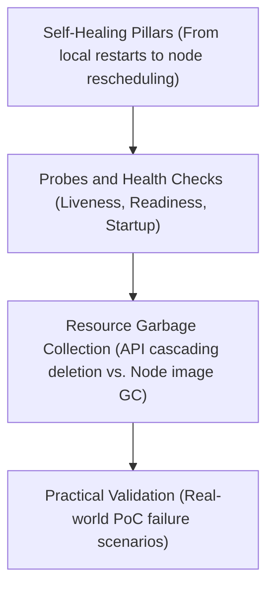

# Module 0-4: Workload Lifecycle & Self-Healing

This module covers the core self-healing algorithms in Kubernetes, automated application health checks (Probes), API object relationships, and the garbage collection mechanisms running on both the control plane and individual nodes.

---

## 🗺️ Cognitive Map: How to Think About the Flow of Knowledge

To build a strong intuition for this module, think of the topics as moving from self-healing concepts, to active configuration (probes), background cleanup (garbage collection), and hands-on validation:



1. **Step 1: Self-Healing Pillars (Section 1):** We start by understanding the architecture of recovery. We trace the four levels of self-healing: local container restarts (`kubelet`), pod replacements (controllers), replica scaling (ReplicaSet), and infrastructure rescheduling (scheduler).
2. **Step 2: Probes & Health Checks (Section 2):** To automate these healing mechanisms, we configure active checks. We specify HTTP/TCP parameters, contrast Readiness (traffic routing) vs. Liveness (restarts), and use Startup probes to protect slow-booting applications.
3. **Step 3: Resource Garbage Collection (Section 3):** To prevent resource exhaustion, we study cleanup daemons. We explore the Control Plane garbage collector (foreground, background, and orphan cascading deletions) and Kubelet-driven node garbage collection (image and container purging).
4. **Step 4: Practical Validation (Section 4):** Finally, we verify this behavior in a live sandbox. We deploy pods with failing liveness and readiness probes, trace the restart counts, watch endpoint lists, and verify cascading parent-child deletions.

By following this flow, you progress from **Theoretical Recovery Loops (Self-Healing) → Active Monitoring (Probes) → Automatic Cleanup (Garbage Collection) → Live Verification (PoC Execution)**.

---


## 1. The Four Pillars of Self-Healing

Kubernetes is built to react to failures at different structural levels. Failures are handled through one of four mechanisms:

### A. Restart (Local Container Healing)
* **Component:** `kubelet`.
* **Action:** If a container process exits or crashes, the local `kubelet` restarts the container inside the existing Pod. (See [Module 03: Node Mechanics & Resource Limits](0-3_node_mechanics_and_resource_limits.md#4-resource-enforcement-linux-cgroups-drivers) for how Kubelet manages local container runtimes and cgroups).
* **Mechanism:** Checks the Pod's `restartPolicy` (`Always`, `OnFailure`, `Never`). Uses an exponential backoff delay (from 10s up to 5 minutes) to avoid thrashing, entering the `CrashLoopBackOff` state.
* **Result:** Pod name, IP address, and node assignment stay identical. Only the `RESTARTS` count increments.

### B. Replace (Workload Recovery)
* **Component:** Controllers (`kube-controller-manager`). (For Control Plane details, see [Module 02: Cluster Architecture & Control Plane Components](0-2_cluster_architecture_and_components.md#2-control-plane-core-components-deep-dive)).
* **Action:** Pods are completely immutable. If a Pod becomes corrupted or fails its startup sequence, the system terminates the bad Pod and builds a clean replacement from the original manifest.

### C. Replicate (Scale Enforcement)
* **Component:** `kube-controller-manager` (specifically the ReplicaSet/Deployment controller loops).
* **Action:** Constantly checks if the number of running Pods matches the desired replica count. If a user deletes a Pod, the controller detects the mismatch and immediately creates a new Pod.

### D. Reschedule (Infrastructure Failure Recovery)
* **Component:** `kube-controller-manager` (Node Controller) & `kube-scheduler`. (For scheduler algorithms, see [Module 02: Cluster Architecture & Control Plane Components](0-2_cluster_architecture_and_components.md#2-control-plane-core-components-deep-dive)).
* **Action:** If a physical server dies, the Node Controller waits out the 5-minute eviction grace period, flags the node as dead, deletes the Pods on it, and the `kube-scheduler` places replacement Pods onto healthy nodes. (For node Lease objects and eviction timers, see [Module 03: Node Mechanics & Resource Limits](0-3_node_mechanics_and_resource_limits.md#3-node-heartbeats-the-lease-api)).

---

## 2. Automated Health Checks: Probes

Probes are health checks executed periodically by the local `kubelet` to monitor container health and manage traffic flow.

```yaml
apiVersion: v1
kind: Pod
metadata:
  name: probe-demo-pod
spec:
  containers:
  - name: app-container
    image: nginx:1.25.0
    ports:
    - containerPort: 80
      name: http-port
    - containerPort: 3306
      name: db-port
    
    # 1. Readiness Probe (HTTP GET)
    readinessProbe:
      httpGet:
        path: /
        port: http-port
      initialDelaySeconds: 5
      periodSeconds: 10
      timeoutSeconds: 2
      successThreshold: 1
      failureThreshold: 3
      
    # 2. Liveness Probe (TCP Socket)
    livenessProbe:
      tcpSocket:
        port: db-port
      initialDelaySeconds: 15
      periodSeconds: 20
      timeoutSeconds: 5
      successThreshold: 1
      failureThreshold: 3
```

### A. Mechanical Breakdown: Configuration Fields
* **`readinessProbe`**: Declares a check that determines if a container is ready to receive network traffic from Services.
* **`livenessProbe`**: Declares a check that determines if a container is alive. If this fails, the kubelet kills the container and triggers its restart sequence.
* **`httpGet` / `tcpSocket`**: Specifies the mechanism of the probe:
  * **`httpGet`**: Performs an HTTP GET request on the specified path and port. A status code $\ge 200$ and $< 400$ indicates success.
  * **`tcpSocket`**: Attempts to establish a TCP handshake on the specified port. Success is achieved if the connection opens.
* **`path: /`**: The path to fetch for HTTP probes.
* **`port: http-port`**: The port to probe (can be a port number e.g. `80` or a named port declared in `ports`).
* **`initialDelaySeconds`**: The number of seconds the kubelet waits after a container has started before running the first probe. Prevents early boot failures.
* **`periodSeconds`**: How frequently (in seconds) the kubelet performs the check.
* **`timeoutSeconds`**: The maximum amount of time (in seconds) the probe is allowed to take before being flagged as a timeout failure.
* **`successThreshold`**: The consecutive number of successful checks required after a failure to transition back to a healthy state. (Must be `1` for liveness probes).
* **`failureThreshold`**: The consecutive number of failures required to transition the container's status:
  * For **Readiness**: The container is marked unready and its IP is evicted from Service Endpoint lists.
  * For **Liveness**: The container is terminated and restarted.

### B. Startup Probe
* **Purpose:** Protects slow-starting, complex, or legacy applications that require long initialization times.
* **Mechanism:** When a startup probe is configured, all liveness and readiness checks are disabled until the startup probe successfully passes.
* **Action on Failure:** If the startup probe does not succeed within its configured `failureThreshold` $\times$ `periodSeconds` timeline, the kubelet kills the container and initiates a standard restart sequence.

---

## 3. Garbage Collection (GC)

Garbage collection runs at two levels: the Control Plane (database cleanup) and the Worker Nodes (disk cleanup).

### A. API Object Cleanup (Control Plane)
Kubernetes tracks parent-child relationships using `metadata.ownerReferences` (e.g., a ReplicaSet owns Pods). When a parent is deleted, the garbage collector handles the children using **Cascading Deletion**:
1. **Background (Default):** The parent is deleted instantly. The GC then cleans up the children in the background.
2. **Foreground:** The parent enters a "deletion in progress" state. The GC deletes all children first. Once the children are gone, the parent is deleted.
   ```bash
   kubectl delete deployment <name> --cascade=foreground
   ```
3. **Orphan:** The parent is deleted, but the children are spared. They become "orphans" and keep running with their owner references removed.
   ```bash
   kubectl delete deployment <name> --cascade=orphan
   ```

### B. Node Cleanup (Kubelet GC)
The `kubelet` garbage collector runs locally to keep the worker node's disk from filling up:
1. **Container GC:** Automatically purges dead containers and their logs once they are no longer needed for troubleshooting.
2. **Image GC:** Monitors node disk usage. Triggers cleanups based on thresholds:
   * **`HighThresholdPercent` (Default: 85%):** If disk usage hits this mark, image GC starts deleting the oldest, unused container images.
   * **`LowThresholdPercent` (Default: 80%):** Image GC continues deleting until disk usage drops below this mark.
> [!WARNING]
> If the disk usage increases faster than image GC can delete, the node condition flips to `DiskPressure: True` (see Node Conditions in [Module 03: Node Mechanics & Resource Limits](0-3_node_mechanics_and_resource_limits.md#b-conditions)), and scheduling halts.

---

## 🛠️ Practical Proof of Concept (PoC)

### Target Scenario
We will deploy a Pod with a failing livenessProbe to witness local healing, a Pod with a failing readinessProbe to observe traffic routing isolation, and perform cascading deletions to verify background vs. orphan garbage collection.

### Step-by-Step Guided Steps

1. **Verify or Provision Cluster:**
   ```bash
   kind create cluster --name cka-healing-poc
   ```

2. **Test Liveness Probe (Local Restart Healing):**
   Create a Pod that fails its liveness probe. The app container creates a `/tmp/healthy` file and deletes it after 30 seconds. The liveness probe checks this file.
   ```yaml
   cat <<EOF > liveness-poc.yaml
   apiVersion: v1
   kind: Pod
   metadata:
     name: liveness-pod
   spec:
     containers:
     - name: app
       image: busybox
       args:
       - /bin/sh
       - -c
       - touch /tmp/healthy; sleep 30; rm -rf /tmp/healthy; sleep 600
       livenessProbe:
         exec:
           command:
           - cat
           - /tmp/healthy
         initialDelaySeconds: 5
         periodSeconds: 5
   EOF
   ```
   Apply the Pod:
   ```bash
   kubectl apply -f liveness-poc.yaml
   ```
   Monitor the Pod's lifecycle in real-time. Notice the restarts increase after 30-40 seconds:
   ```bash
   kubectl get pod liveness-pod -w
   ```
   Inspect the events to see the liveness probe failure:
   ```bash
   kubectl describe pod liveness-pod | grep -E "Liveness|Restart"
   ```

3. **Test Readiness Probe (Traffic Routing Isolation):**
   Create a Pod with a readiness probe checking for a `/tmp/ready` file, which does not exist:
   ```yaml
   cat <<EOF > readiness-poc.yaml
   apiVersion: v1
   kind: Pod
   metadata:
     name: readiness-pod
     labels:
       app: web
   ---
   apiVersion: v1
   kind: Service
   metadata:
     name: web-service
   spec:
     selector:
       app: web
     ports:
     - port: 80
       targetPort: 80
   EOF
   ```
   Apply the configuration:
   ```bash
   kubectl apply -f readiness-poc.yaml
   ```
   Now update the Pod definition to include a readiness probe looking for `/tmp/ready`:
   ```yaml
   cat <<EOF > readiness-pod-probe.yaml
   apiVersion: v1
   kind: Pod
   metadata:
     name: readiness-pod
     labels:
       app: web
   spec:
     containers:
     - name: app
       image: nginx
       readinessProbe:
         exec:
           command:
           - cat
           - /tmp/ready
         initialDelaySeconds: 3
         periodSeconds: 3
   EOF
   ```
   Apply the probe update (requires recreating or replacing the pod):
   ```bash
   kubectl replace --force -f readiness-pod-probe.yaml
   ```
   Check the Pod readiness status:
   ```bash
   kubectl get pod readiness-pod
   ```
   It will show `0/1 READY` because the `/tmp/ready` file is missing.
   Now, check if the Service has registered the Pod's IP as an Endpoint:
   ```bash
   kubectl get endpoints web-service
   ```
   Notice that `ENDPOINTS` is blank (or `<none>`). The readiness probe isolated the traffic.
   Create the file inside the container:
   ```bash
   kubectl exec readiness-pod -- touch /tmp/ready
   ```
   Wait 3 seconds and check the status again:
   ```bash
   kubectl get pod readiness-pod
   kubectl get endpoints web-service
   ```
   It now shows `1/1 READY` and the Endpoint contains the Pod's IP!

4. **Test Cascading Garbage Collection (Orphan Mode):**
   Create a small Deployment:
   ```bash
   kubectl create deployment gc-poc --image=nginx --replicas=2
   ```
   Verify the ReplicaSet and Pods are running:
   ```bash
   kubectl get rs,po -l app=gc-poc
   ```
   Now, delete the Deployment but orphan the children:
   ```bash
   kubectl delete deployment gc-poc --cascade=orphan
   ```
   Query the ReplicaSet and Pods again:
   ```bash
   kubectl get rs,po -l app=gc-poc
   ```
   Notice the Deployment is gone, but the ReplicaSet and Pods are still running in the cluster.
   Clean up the orphans:
   ```bash
   kubectl delete rs -l app=gc-poc
   ```

5. **Clean up Resources:**
   ```bash
   kubectl delete -f liveness-poc.yaml
   kubectl delete -f readiness-poc.yaml
   rm liveness-poc.yaml readiness-poc.yaml readiness-pod-probe.yaml
   kind delete cluster --name cka-healing-poc
   ```

---

## 🔗 Related Modules
- [Module 02: Cluster Architecture & Control Plane Components](0-2_cluster_architecture_and_components.md) - Deep dive into controller reconciliation loops and high availability topologies.
- [Module 03: Node Mechanics & Resource Limits](0-3_node_mechanics_and_resource_limits.md) - Describes node conditions (`DiskPressure`, etc.), heartbeats via the Lease API, and Kubelet resource eviction policies.
- [Module 05: Containers, Runtimes, and Lifecycle Management](0-5_containers_runtimes_and_lifecycle.md) - Covers container image pull mechanics, the Container Runtime Interface (CRI), lifecycle hooks, init containers, sidecars, and ephemeral containers.
