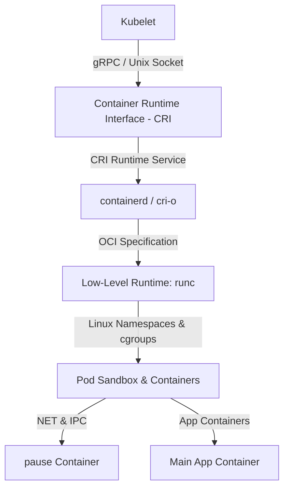
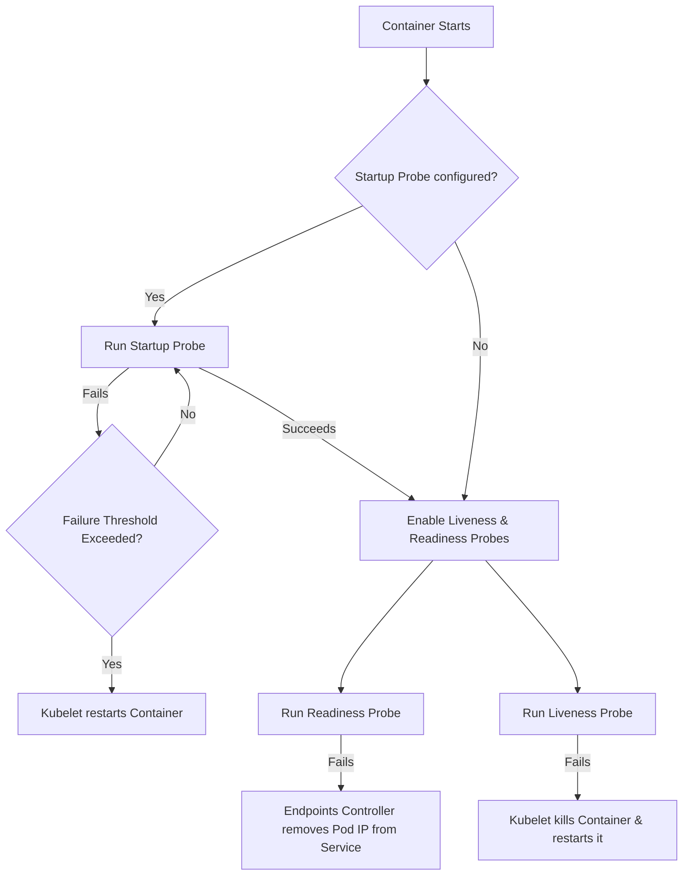

# Module 0-6-1: Pod Mechanics, Container Runtimes & Probes

**Breadcrumbs:** [[0-Index - Kubernetes|🏠 Kubernetes Reference MOC]] > **Module 0-6-1**

---

## 1. Architectural Foundations & Container Engine Mechanics

Kubernetes organizes workloads around the **Pod**, the smallest schedulable unit in the API. Understanding how the Kubelet interfaces with the container runtime is crucial for troubleshooting node-level execution issues.



### 1.1 Kubelet, CRI, and OCI Interfaces
*   **The Control Loop:** The Kubelet watches the API server (or a local directory for Static Pods) for Pod manifests assigned to its node.
*   **CRI Communication:** The Kubelet communicates with the Container Runtime Interface (CRI) daemon (e.g., `containerd`, `cri-o`) over a local Unix domain socket using gRPC.
*   **OCI Invocation:** The CRI runtime translates gRPC requests into Open Container Initiative (OCI) calls, invoking a low-level runtime (typically `runc`) to spin up the container processes.
*   **Namespaces & Control Groups (cgroups):** The low-level runtime handles the low-level Linux kernel system calls to create namespaces (UTS, IPC, PID, NET, Mount, User) and set resource bounds using cgroups (v1 or v2).

### 1.2 The Pod Sandbox and the `pause` Container
When a Pod is scheduled, the container engine does not immediately boot the application containers.
1.  **Sandbox Creation:** The CRI runtime first spins up a special infrastructure container known as the **`pause` container** (or Sandbox container).
2.  **Namespace Reservation:** The `pause` container's sole job is to hold the Linux namespaces (primarily the Network and IPC namespaces) open.
3.  **Namespace Join:** When the application containers boot, they join the namespaces held by the `pause` container.
    *   *Network Sharing:* This namespace sharing allows all containers inside the same Pod to communicate via `localhost` and share a single IP address and port space.
    *   *IPC Sharing:* Containers can share IPC mechanisms (like POSIX shared memory or System V IPC semaphores) to run high-performance local inter-process communication.

### 1.3 Namespace Sharing Architecture (`shareProcessNamespace`)
By default, the Process ID (PID) namespace remains isolated between containers inside the same Pod (Container A cannot see the processes running in Container B).
*   **Enabling Sharing:** You can override this behavior by setting `spec.shareProcessNamespace: true` in the Pod specification.
*   **Under the Hood:** When enabled, the containers share a unified PID namespace. Processes in other containers become visible:
    *   They are visible under `/proc` inside each container.
    *   PID 1 is no longer your container's entrypoint process; instead, the container runtime's helper or the `pause` container becomes PID 1, and your application processes run as auxiliary PIDs.
    *   This is highly useful for troubleshooting sidecars (e.g., attaching a debugger to inspect a Java process in a neighboring container).

### 1.4 Image Pull Mechanics and Policies
Before starting a container, the Kubelet instructs the CRI runtime to pull the container image from the designated registry.
*   **`imagePullPolicy` Behaviors:**
    *   `Always`: Kubelet queries the registry on every Pod boot/restart to resolve the digest. If the digest has changed, it pulls the new image. If the registry is unreachable, the container boot fails (even if the image is cached locally).
    *   `IfNotPresent`: Kubelet checks if the image exists in the local node cache. If it does, it skips the registry check and uses the cached version. If it does not, it pulls it. (Default policy if a specific tag like `:latest` is NOT used).
    *   `Never`: Kubelet assumes the image is pre-loaded on the node's local filesystem. It makes no attempt to contact the registry. If the image is missing, the Pod immediately enters `ErrImagePull`/`ImagePullBackOff`.
*   **Private Registry Authentication (`imagePullSecrets`):**
    *   Authentication requires a Secret of type `kubernetes.io/dockerconfigjson` in the same namespace as the Pod.
    *   The Secret contains the base64-encoded credentials for registry access, referenced in the Pod spec via `spec.imagePullSecrets[*].name`.

### 1.5 Linux Namespaces & Cgroups (CRI/OCI Level)

When a container runtime (like `containerd` via `runc`) creates a container within a Pod, it utilizes Linux kernel namespaces and control groups (cgroups) to enforce isolation and resource boundaries.

#### 1.5.1 Linux Kernel Namespaces in Pods
A Kubernetes Pod represents a group of containers sharing namespaces. The OCI-compliant runtime (`runc`) configures the following namespaces:
*   **`net` (Network Namespace):** Isolates network interfaces, IP routing tables, port bindings, and firewall rules. Under the hood, containerd creates a single network namespace for the `pause` container. All application containers in the Pod join this namespace, sharing a loopback (`127.0.0.1`) interface and a single Pod IP address.
*   **`ipc` (System V & POSIX IPC Namespace):** Isolates Inter-Process Communication resources, such as System V message queues, semaphores, and POSIX shared memory segments (`/dev/shm`). Containers within a Pod share the same IPC namespace, enabling fast, low-overhead communication via shared memory without using TCP/UDP sockets.
*   **`pid` (Process ID Namespace):** Isolates the process ID space. By default, containers maintain independent PID namespaces, meaning Container A cannot view or send signals to processes in Container B. When `spec.shareProcessNamespace: true` is configured, all containers join a shared PID namespace where the `pause` container (or CRI helper) runs as PID 1, and application processes run as auxiliary PIDs, visible across containers via `/proc`.
*   **`mnt` (Mount Namespace):** Isolates filesystem mount points. Every container runs in its own mount namespace. During container startup, the runtime uses the `pivot_root` system call to switch the root filesystem to the container's image layers. Persistent volumes and `emptyDir` mounts are projected into this namespace at designated paths.
*   **`uts` (UNIX Timesharing System Namespace):** Isolates hostnames and NIS domain names. This allows each container to have its own hostname, though in Kubernetes, the hostname defaults to the Pod name (or the configured `spec.hostname`).
*   **`user` (User Namespace):** Maps user and group IDs (UIDs/GIDs) inside the container to different UIDs/GIDs on the host system. This ensures that a process running as `root` (UID 0) inside a container is mapped to an unprivileged user (e.g., UID 100000) on the host, preventing container escape attacks from acquiring host-level administrative access.

#### 1.5.2 Control Groups (cgroups): v1 vs v2
Linux cgroups restrict, account for, and isolate the resource usage (CPU, Memory, I/O, PIDs) of a collection of processes.
*   **cgroups v1 (Multi-Hierarchy):**
    *   **Architecture:** Each resource controller (CPU, memory, blkio, pids) resides in an independent directory tree under `/sys/fs/cgroup/` (e.g., `/sys/fs/cgroup/cpu` and `/sys/fs/cgroup/memory`).
    *   **Limitations:** A process can belong to different nodes in different controller trees. This multi-hierarchy model makes resource accounting complex and inefficient. For instance, page cache writeback memory usage cannot be easily tied back to a container's write I/O limits, leading to poor I/O throttling.
*   **cgroups v2 (Unified Hierarchy):**
    *   **Architecture:** Implements a single unified hierarchy tree under `/sys/fs/cgroup/`. A process can only reside in a single cgroup node. Resource controllers are enabled or disabled on a per-node basis using `/sys/fs/cgroup/cgroup.controllers`.
    *   **Advantages:** Resolves resource charging synchronization issues (e.g., unified memory and I/O tracking for buffered writes). It also supports **Pressure Stall Information (PSI)**, providing kernel-level metrics on resource starvation (CPU, Memory, I/O delays) which helps detect node-level resource contention before failures occur.

#### 1.5.3 Resource Mapping to CFS Bandwidth Control Limits
Kubernetes resource definitions are translated by the CRI/OCI runtime into cgroups parameters:
*   **CPU Requests:** Maps to `cpu.shares` (cgroups v1) or `cpu.weight` (cgroups v2). These values determine a container's relative priority to CPU cycles. CPU requests are *proportional* and *non-blocking*; if the node's CPU is idle, a container can exceed its CPU request up to its limit (or 100% of the host).
*   **CPU Limits:** Maps to Linux Completely Fair Scheduler (CFS) Bandwidth Control:
    *   *cgroups v1:* `/sys/fs/cgroup/cpu/cpu.cfs_period_us` (default: `100000` microseconds or 100ms) and `/sys/fs/cgroup/cpu/cpu.cfs_quota_us`.
    *   *cgroups v2:* `/sys/fs/cgroup/cpu.max` containing both `max` and `period` values.
    *   *CFS Math:* If a container's CPU limit is set to `500m` (0.5 cores), the runtime calculates the quota as:
        $$\text{Quota} = \text{Period} \times \text{Limit} = 100,000\,\mu\text{s} \times 0.5 = 50,000\,\mu\text{s}$$
        If the container's processes exhaust $50,000\,\mu\text{s}$ of CPU execution time within a $100\,\text{ms}$ window, the kernel throttles the container's processes until the next period begins.
*   **Memory Requests:**
    *   *cgroups v1:* Not mapped to a cgroup memory controller parameter; requests are only used by the Kubernetes Scheduler to place the Pod.
    *   *cgroups v2:* Maps to `memory.low` or `memory.min`. This acts as a protection barrier; the kernel will actively avoid reclaiming memory from this cgroup if it is below this threshold, protecting the container from premature page-cache reclamation.
*   **Memory Limits:**
    *   *cgroups v1:* Maps to `/sys/fs/cgroup/memory/memory.limit_in_bytes`.
    *   *cgroups v2:* Maps to `/sys/fs/cgroup/memory.max` (the hard limit that triggers the Out-Of-Memory killer if exceeded) and `/sys/fs/cgroup/memory.high` (a soft limit that triggers proactive page-cache reclamation throttling when crossed, trying to keep usage below `.max`).

#### 1.5.4 QoS Memory Bounds & Linux OOM Killer Scoring
When the node runs out of physical memory, the Linux kernel Out-Of-Memory (OOM) Killer terminates processes to free memory. It selects targets based on their OOM score (`/proc/<pid>/oom_score`), which ranges from 0 (never kill) to 1000 (always kill first).

The Kubelet adjusts this score using the `oom_score_adj` setting (`/proc/<pid>/oom_score_adj`) based on the Pod's QoS class:
1.  **Guaranteed QoS (`oom_score_adj = -997`):**
    *   Almost immune to OOM. These processes are only terminated as an absolute last resort if system-critical or control plane processes are starving.
2.  **BestEffort QoS (`oom_score_adj = 1000`):**
    *   Assigned the maximum possible adjustment. These are the absolute first candidates targeted by the OOM killer when memory pressure occurs.
3.  **Burstable QoS (`oom_score_adj` is dynamically computed):**
    *   The adjustment is inversely proportional to the amount of memory requested relative to the node's total capacity:
        $$\text{oom\_score\_adj} = 1000 - \max\left(\left( \frac{\text{memory request}}{\text{node memory capacity}} \right) \times 1000, 2\right)$$
    *   *Security / Protection:* This math ensures that a Burstable Pod that requests a larger percentage of node memory has a *lower* OOM score adjustment, protecting it over Pods that request very little memory but consume a lot.
    *   *Bounds:* The adjustment is capped between a minimum of `2` (so it is always killed before Guaranteed) and a maximum of `999` (so it is always killed after BestEffort).

### 1.6 Practical Guide: Shared Pod IPC, Localhost Loopback, & Unix Sockets

Within a single Pod sandbox, containers can communicate with very low latency using either the shared network namespace (`localhost` interface) or a shared mount namespace (`emptyDir` volume for Unix sockets).

#### 1.6.1 Container-to-Container Loopback Communication
Since all containers in a Pod share the `net` namespace, they share the loopback interface. A server process in Container A listening on `127.0.0.1:8080` can be accessed directly by a client process in Container B via `http://localhost:8080`.

Here is a complete, runable YAML manifest demonstrating this:

```yaml
apiVersion: v1
kind: Pod
metadata:
  name: pod-localhost-communication
  namespace: default
spec:
  containers:
  - name: backend-server
    image: python:3.11-alpine
    command: ["python", "-m", "http.server", "8080"]
    ports:
    - containerPort: 8080
      name: http-api
  - name: client-sidecar
    image: alpine:latest
    command: ["/bin/sh", "-c"]
    args:
    - |
      apk add --no-cache curl
      # Allow the backend server time to boot
      sleep 3
      while true; do
        echo "=== Querying server via localhost ==="
        curl -sS http://localhost:8080/
        sleep 10
      done
```

#### 1.6.2 Container-to-Container Unix Domain Socket Communication
For high-performance local IPC that bypasses the TCP/IP network stack entirely, containers can communicate using a UNIX domain socket. This requires mounting a shared `emptyDir` volume into both containers, providing a shared filesystem directory where the socket file can be created and bound.

Here is a complete, runable YAML manifest demonstrating this:

```yaml
apiVersion: v1
kind: Pod
metadata:
  name: pod-unix-socket-communication
  namespace: default
spec:
  volumes:
  - name: shared-ipc-volume
    emptyDir: {}
  containers:
  - name: socket-server
    image: alpine:latest
    command: ["/bin/sh", "-c"]
    args:
    - |
      apk add --no-cache socat
      SOCKET_PATH="/var/run/shared-socket/ipc.socket"
      # Ensure stale socket files from previous runs are removed
      rm -f "$SOCKET_PATH"
      echo "Starting Unix Domain Socket Server on $SOCKET_PATH..."
      # Accept connections and respond with a timestamp and hostname
      socat UNIX-LISTEN:"$SOCKET_PATH",fork,mode=0666 EXEC:"echo 'Hello from socket-server running on '$(hostname)"
    volumeMounts:
    - name: shared-ipc-volume
      mountPath: /var/run/shared-socket
  - name: socket-client-sidecar
    image: alpine:latest
    command: ["/bin/sh", "-c"]
    args:
    - |
      apk add --no-cache socat
      SOCKET_PATH="/var/run/shared-socket/ipc.socket"
      # Wait until the server creates the socket file
      until [ -S "$SOCKET_PATH" ]; do
        echo "Waiting for Unix socket file to be created by server..."
        sleep 1
      done
      while true; do
        echo "=== Communicating via Unix Domain Socket ==="
        socat - UNIX-CONNECT:"$SOCKET_PATH"
        sleep 10
      done
    volumeMounts:
    - name: shared-ipc-volume
      mountPath: /var/run/shared-socket
```

---

## 2. Pod Deep Dive & Resource Specification

A Pod represents a single instance of a running process in your cluster. It is defined as a `v1.Pod` API resource.

### 2.1 Complete E2E Pod Specification (Lifecycle, DNS, Hostnames, QoS)
```yaml
apiVersion: v1
kind: Pod
metadata:
  name: production-workload-pod
  namespace: default
  labels:
    app: secure-webapp
    tier: frontend
spec:
  # Process Namespace Sharing for troubleshooting
  shareProcessNamespace: true

  # Hostname & DNS Configuration
  hostname: web-instance-01
  subdomain: web-service-sub
  setHostnameAsFQDN: true
  
  # HostAliases directly overrides /etc/hosts inside the containers
  hostAliases:
  - ip: "10.240.0.10"
    hostnames:
    - "database.internal.secure"
    - "cache.internal.secure"

  containers:
  - name: application-container
    image: nginx:1.25.3
    imagePullPolicy: IfNotPresent
    
    ports:
    - containerPort: 80
      name: http-port

    # Resource requests and limits (Configured for Guaranteed QoS class)
    resources:
      requests:
        cpu: "500m"
        memory: "512Mi"
      limits:
        cpu: "500m"
        memory: "512Mi"

    lifecycle:
      postStart:
        exec:
          command: ["sh", "-c", "echo 'Container Initialized' > /usr/share/nginx/html/init_status.txt"]
      preStop:
        exec:
          command: ["/usr/sbin/nginx", "-s", "quit"]

  # Registry authentication credentials
  imagePullSecrets:
  - name: registry-credentials-secret

  # Global termination grace period (Default is 30s)
  terminationGracePeriodSeconds: 30
```

### 2.2 Quality of Service (QoS) Classes
Kubernetes assigns a QoS class to every Pod based on the resource requests and limits configured for its containers. The Kubelet uses these classes to prioritize Pods during resource starvation evictions.

| QoS Class | Resource Definition Criteria | Node Eviction Priority |
| :--- | :--- | :--- |
| **Guaranteed** | Every container in the Pod must have requests and limits defined for both CPU and memory, and **Requests must exactly equal Limits** (`request == limit`). | Lowest priority (Evicted last) |
| **Burstable** | The Pod does not meet Guaranteed criteria, but **at least one container** has a CPU or Memory request or limit configured. | Medium priority (Evicted based on usage relative to request) |
| **BestEffort** | **Zero containers** have any CPU or Memory requests or limits defined. | Highest priority (Evicted first) |

> [!IMPORTANT]
> **QoS Eviction Mechanics:** Under disk, memory, or PID pressure, the Kubelet starts reclaiming resources by evicting Pods.
> 1. `BestEffort` Pods are killed first.
> 2. `Burstable` Pods are targeted next, prioritized by how much their actual resource usage exceeds their requested allocation.
> 3. `Guaranteed` Pods are only evicted if the node runs out of memory/disk for system critical processes. Their Out-Of-Memory (OOM) score is adjusted (`oom_score_adj`) to ensure they are the last processes targeted by the Linux kernel's OOM Killer.

### 2.3 Labels, Selectors, and Annotations Metadata

Kubernetes uses metadata fields to identify, organize, and query resources:

#### 1. Object Naming Restrictions (RFC 1123 / RFC 1035)
Every object must have a unique name within its namespace:
* **DNS Subdomain Names (RFC 1123):** Most resources (like namespaces, pods, and deployments) must have names that conform to RFC 1123 subdomain rules:
  * Maximum 253 characters.
  * Lowercase alphanumeric characters, `-` or `.`.
  * Start and end with an alphanumeric character.
* **RFC 1123 Label Names:** Pod names must be valid RFC 1123 labels:
  * Maximum 63 characters.
  * Lowercase alphanumeric characters or `-`.
  * Start and end with an alphanumeric character.
* **RFC 1035 Label Names:** Services must follow RFC 1035 label rules:
  * Maximum 63 characters.
  * Lowercase alphanumeric characters or `-`.
  * Must start with an alphabetic character and end with an alphanumeric character (digit start is allowed in modern versions via `RelaxedServiceNameValidation`).

#### 2. Labels & Selection Logic
Labels are key-value pairs attached to resources (like Pods) to group and organize them (e.g. `env: production`, `tier: frontend`, `app: web`). Labels do not guarantee uniqueness. Controllers use **Selectors** to dynamically bind to Pods:
* **Equality-Based Selectors:** Filter by exact match using `matchLabels`:
  ```yaml
  selector:
    matchLabels:
      app: web-server
      env: production
  ```
  This applies an **AND** logic operation; target Pods must carry all listed labels.
* **Set-Based Selectors:** Filter using operators inside `matchExpressions`:
  ```yaml
  selector:
    matchExpressions:
      - {key: app, operator: In, values: [web-server, api-server]}
      - {key: env, operator: NotIn, values: [development, staging]}
      - {key: partition, operator: Exists}
      - {key: deprecated, operator: DoesNotExist}
  ```
  * `In`: Label key must match one of the values.
  * `NotIn`: Label key must not match any of the values.
  * `Exists`: The label key must be present (values list must be empty).
  * `DoesNotExist`: The label key must not be present (values list must be empty).

#### 3. Annotations
Annotations are key-value maps used to attach arbitrary non-identifying metadata:
* **Key Difference from Labels:** Annotations cannot be used to select or query objects. They are not indexed.
* **Usage:** Store tool configurations, build IDs, or audit info (e.g. instructing Prometheus to scrape metrics):
  ```yaml
  metadata:
    name: web-app
    annotations:
      prometheus.io/scrape: "true"
      prometheus.io/port: "8080"
      prometheus.io/path: "/metrics"
  ```
* **Anti-Pattern:** Do not use annotations as a general-purpose datastore for your app, as all API data is persisted in etcd. Keep high-write data in external caches like Redis.

---

### 2.4 Pod Operations & CLI Diagnostics

#### 1. Creation Approaches
* **Imperative Approach:** Direct CLI commands for quick tests:
  ```bash
  kubectl run web --image=nginx --port=80
  ```
* **Declarative Approach:** YAML manifests representing desired state:
  ```bash
  kubectl apply -f pod.yaml
  ```

#### 2. Troubleshooting Pending Pods
If a Pod remains in a **Pending** status, the scheduler cannot assign it to a node. Check these common causes:
* **Resource Exhaustion:** Nodes have insufficient unallocated CPU or Memory requests.
* **Taints and Tolerations:** Worker nodes carry taints (e.g. `node-role.kubernetes.io/control-plane:NoSchedule`) and the Pod lacks corresponding tolerations.
* **Node Selectors & Affinity:** The Pod spec declares selectors (`nodeSelector`) or affinity rules that do not match labels on any online node.

#### 3. Operational Command Run Sheet
* **Inspection & Filtering:**
  ```bash
  # List pods with extended detail (IP, Node)
  kubectl get pods -o wide

  # Watch pod status changes in real-time
  kubectl get pods -w

  # List all API resources supported by the API server
  kubectl api-resources

  # Describe configurations and retrieve scheduling events
  kubectl describe pod web
  ```
* **Diagnostics & Interactivity:**
  ```bash
  # Fetch standard streams logs
  kubectl logs web

  # Stream live log outputs
  kubectl logs -f web

  # Query logs from a specific container in a multi-container Pod
  kubectl logs web -c application-container

  # Execute date command inside container
  kubectl exec -it web -- date

  # Open interactive terminal session
  kubectl exec -it web -- /bin/sh
  ```
* **Deletion:**
  ```bash
  kubectl delete pod web
  ```

### 2.4 Commands and Arguments (Docker vs. Kubernetes)
When configuring Pod specifications, understanding how Kubernetes handles the container startup process compared to Docker is essential.

#### 1. Conceptual Mapping & Overriding Logic
At the OS level, launching a process requires passing an executable and its argument list (the `argv` array in a UNIX `execve` call). Docker split this into `ENTRYPOINT` and `CMD`, while Kubernetes uses `command` and `args`:
* **`ENTRYPOINT` $\rightarrow$ `command`:** Specifies the executable binary.
* **`CMD` $\rightarrow$ `args`:** Specifies the default arguments passed to the executable.

The overriding behavior behaves as follows:
* **Neither defined:** Uses the Dockerfile's `ENTRYPOINT` and `CMD`.
* **Only `command` defined:** Overrides the image's `ENTRYPOINT` and **completely discards** the image's `CMD` (no arguments are passed).
* **Only `args` defined:** Overrides the image's `CMD` and passes the new arguments to the image's `ENTRYPOINT`.
* **Both defined:** Overrides both the image's `ENTRYPOINT` and `CMD`.

```
                  ┌───────────────────────┐
                  │   K8s Container Spec  │
                  └───────────┬───────────┘
                              │
               ┌──────────────┴──────────────┐
               ▼                             ▼
       [ command: [...] ]             [ args: [...] ]
               │                             │
               ▼                             ▼
      (Overrides Docker)            (Overrides Docker)
         ENTRYPOINT                         CMD
```

#### 2. Technical Pitfalls & YAML Type Constraints
* **The String Unmarshalling Gotcha:** The Kubernetes API server parses container fields as strict Go structs. The `command` and `args` fields must be arrays of strings.
  * *Failure Mode:* If a numeric command or argument (e.g., sleeping for `5000` seconds) is written as an unquoted number (`command: ["sleep", 5000]`), the API server will reject the request:
    `Cannot unmarshal number into Go struct field containers.spec.containers.command of type string`
  * *Mitigation:* Always wrap numeric parameters in quotes: `command: ["sleep", "5000"]`.
* **Imperative CLI Double-Dash (`--`) Separator:** When creating a pod imperatively, you must isolate the options meant for the `kubectl` tool from the arguments passed directly to the container's entrypoint.
  * E.g., `kubectl run webapp-green --image=webapp -- --color green`
  * The `--` separates `kubectl` flags from container arguments (which map to `args: ["--color", "green"]`).

---


## 3. Pod Lifecycle, Conditions, and Hooks

A Pod is a transient entity with a strictly defined lifecycle. 

### 3.1 Pod Phases (`status.phase`)
The Control Plane tracks the Pod's lifecycle through five high-level, immutable phases:
1.  **Pending:** The API Server accepted the Pod manifest, but it has not been scheduled, or the container runtime is actively downloading images or setting up the network sandbox.
2.  **Running:** The Pod has been scheduled to a node, all containers have been created by the CRI, and at least one container is currently running, starting, or restarting.
3.  **Succeeded:** All containers in the Pod have successfully run to completion and exited with status code `0`. Kubelet will not attempt to restart them.
4.  **Failed:** All containers in the Pod have terminated, and at least one container terminated in failure (non-zero exit code).
5.  **Unknown:** The Control Plane cannot communicate with the Kubelet on the node (typically due to a network partition or node failure).

### 3.2 Container States
The Kubelet monitors the state of each container individually via the CRI socket:
*   **Waiting:** The container is blocked from running (e.g., `ContainerCreating`, `ErrImagePull`, or `CrashLoopBackOff`).
*   **Running:** The process has started successfully. Kubelet records the exact start timestamp (`startedAt`).
*   **Terminated:** The container process finished execution. Kubelet records the `exitCode` and logs the reason (e.g., `OOMKilled`, `Completed`, `Error`).

#### The CrashLoopBackOff Backoff Algorithm
If a container fails (exits non-zero), the Kubelet attempts restarts using an exponential backoff formula:
$$\text{Delay} = 10 \times 2^n \text{ seconds}$$
*   The delay progression is: 10s, 20s, 40s, 80s, 160s, capping at a maximum delay of **300 seconds (5 minutes)**.
*   The Kubelet will continue retrying every 5 minutes indefinitely.
*   **Reset Condition:** If the container starts and runs continuously for **10 minutes** without crashing, the Kubelet resets the backoff counter back to the initial 10-second delay.

### 3.3 Pod Conditions
Pod Conditions represent granular boolean status checks of the Pod. The key conditions in `status.conditions` include:
*   `PodScheduled`: The Scheduler successfully bound the Pod to a node.
*   `Initialized`: All `initContainers` have executed and exited with `0`.
*   `ContainersReady`: All containers inside the Pod have passed their readiness check.
*   `Ready`: The Pod is capable of receiving network traffic.

> [!IMPORTANT]
> **Network Routing and the Endpoints Controller:**
> The Kubernetes Endpoints (and EndpointSlice) Controller watches the `Ready` condition of Pods. When a Pod enters `Ready: False` (due to a failing readiness probe, startup failure, or active termination), the controller immediately removes the Pod's IP address from the backend pool of any associated Service. Traffic routing to the Pod is severed instantly.

### 3.4 Readiness Gates
For external systems (such as hardware load balancers or external ingress controllers) that need to run independent checks before routing traffic to a new Pod, you can configure a **Readiness Gate**.
*   **Specification:** Add a `readinessGates` list containing the `conditionType`.
*   **Mechanic:** Kubelet evaluates container probes normally, transitioning `ContainersReady` to `True`. However, the overall Pod `Ready` condition remains `False` until the external controller patches the Pod's status directly, setting the custom condition to `True`.

### 3.5 Container Lifecycle Hooks: `PostStart` and `PreStop`
Lifecycle hooks execute code at specific points in the container's execution:
*   **`PostStart`:** Runs immediately after the container is created.
    *   *Warning:* It is asynchronous. There is no guarantee that the `PostStart` hook completes before the container's `ENTRYPOINT` script starts executing.
    *   *Failure:* If the hook fails or exits non-zero, Kubelet kills the container and restarts it based on the `restartPolicy`.
*   **`PreStop`:** Runs immediately before a container is terminated (e.g., when a Pod is deleted or scaled down).
    *   *Behavior:* The hook is blocking and synchronous. Kubelet sends the SIGTERM signal to the container *only after* the `PreStop` hook completes.
    *   *The Grace Period Math:* If the `PreStop` hook is still executing when the `terminationGracePeriodSeconds` expires, the Kubelet will send a SIGKILL immediately. If the grace period is set to 30 seconds, and the `PreStop` hook takes 29 seconds, the container only has 1 second to gracefully terminate its main processes.
    *   *Extension:* If the `PreStop` hook requires more time, you *must* increase the `spec.terminationGracePeriodSeconds` in the Pod spec. If a Pod is being deleted and the grace period expires while the hook is running, Kubelet grants a brief 2-second extension before issuing the final SIGKILL.

---

## 4. Initialization and Multi-Container Patterns (Init & Sidecar Containers)

Kubernetes supports running helper containers alongside your application container inside the same Pod sandbox.

### 4.1 Standard Init Containers (Sequential, Blocking)
Init containers execute configuration or setup tasks that must complete before the main application starts.
*   **Sequential Model:** Init containers are executed one at a time, strictly in the order they are defined in the `spec.initContainers` array.
*   **Blocking Rule:** An init container must exit with code `0` (Success) before the Kubelet will invoke the next init container in the list. The main application containers do not start until all init containers have successfully completed.
*   **Shared Resources:** Because they share the same network namespace and volume mounts, an init container can download configurations or run migrations, writing the results to a shared `emptyDir` volume for the main container to read.

#### Resource Scheduling Math (The "Max" Rule)
Because standard init containers execute sequentially and exit before the application container starts, they do not consume resources concurrently with the application.
The Kubernetes Scheduler calculates the Pod's total resource requests/limits as follows:
$$\text{Effective Request} = \max\left(\max_{i} (\text{Init}_i), \sum_{j} (\text{App}_j)\right)$$
*   **Example Scenario:**
    *   Init 1: Requests 1 CPU, 512Mi Memory
    *   Init 2: Requests 2 CPU, 4Gi Memory
    *   App 1: Requests 500m CPU, 1Gi Memory
    *   App 2: Requests 500m CPU, 1Gi Memory
*   **Math:**
    *   $\text{Sum of App Requests} = 1 \text{ CPU}, 2\text{Gi Memory}$
    *   $\text{Max of Init Requests} = 2 \text{ CPU}, 4\text{Gi Memory}$
    *   $\text{Pod Scheduling Requirement} = \max(2 \text{ CPU}, 1 \text{ CPU}) \text{ and } \max(4\text{Gi}, 2\text{Gi}) = \mathbf{2 \text{ CPU}, 4\text{Gi Memory}}$
    *   *Implication:* The node must have 2 CPU and 4Gi memory free to schedule the Pod, even though once running, it will only consume 1 CPU and 2Gi.

### 4.2 Native Sidecar Containers (Kubernetes v1.29+)
Historically, running sidecar services (like Fluentd log forwarders or Envoy proxies) was implemented by putting them in the `spec.containers` array, leading to startup race conditions. Native Sidecars are now first-class entities.
*   **Definition:** Define the container in the `spec.initContainers` array, but explicitly configure:
    ```yaml
    restartPolicy: Always
    ```
*   **Startup Sequence:** Kubelet starts the sidecar first. Instead of waiting for it to exit, Kubelet waits for the sidecar's **Startup or Readiness Probe to pass**. Once marked healthy, Kubelet immediately starts the next container in the sequence.
*   **Teardown Sequence:** Native sidecars solve the shutdown race condition by reversing the termination sequence:
    1.  **Phase 1:** Kubelet sends `SIGTERM` exclusively to the main application containers. The sidecars remain fully online to route traffic or process logs.
    2.  **Phase 2:** Once all main application containers have completely terminated, Kubelet sends `SIGTERM` to the sidecars in reverse order of their declaration in `spec.initContainers`.

#### Resource Scheduling Math (Adjusted Formula)
Because native sidecars run concurrently with the main application, the scheduling math is modified:
$$\text{Effective Request} = \sum (\text{Apps}) + \sum (\text{Sidecars}) + \max(\text{Standard Inits})$$
*   Using the previous scenario and adding a Fluentd sidecar requesting 100m CPU, 200Mi Memory:
    *   $\text{App + Sidecar Sum} = 1.1 \text{ CPU}, 2.2\text{Gi Memory}$
    *   $\text{Max Standard Init} = 2 \text{ CPU}, 4\text{Gi Memory}$ (but the sidecar is running *during* this init step, so the scheduling math compares the concurrent total with the init phase total).
    *   $\text{Standard Init + Sidecar} = 2.1 \text{ CPU}, 4.2\text{Gi Memory}$.
    *   $\text{Pod Scheduling Requirement} = \mathbf{2.1 \text{ CPU}, 4.2\text{Gi Memory}}$.

---

## 5. Ephemeral Containers for Advanced Debugging

Modern security standards mandate minimal or "distroless" images. These images contain only the compiled binary and lack diagnostic tools, shells (`sh`, `bash`), or network tools (`ip`, `netstat`), making traditional execution (`kubectl exec`) impossible.

### 5.1 The `/ephemeralcontainers` API Subresource
*   **API Bypassing Immutability:** Once a Pod is created, its `spec.containers` array is immutable. However, the Kubernetes API exposes a special subresource endpoint: `/api/v1/namespaces/<ns>/pods/<name>/ephemeralcontainers`.
*   **Dynamic Patching:** Calling this subresource allows users to dynamically inject diagnostic containers into a running Pod sandbox without restarting, rescheduling, or interrupting current traffic.
*   **API Limitations:** Ephemeral containers have no resource guarantees (no requests/limits), cannot configure probes, and will never be restarted by the Kubelet if they crash or exit.

### 5.2 Namespace Sharing Architecture
When injected, the ephemeral container runs in the exact same Network and IPC namespace as the application container.
*   **Process Debugging:** By default, PID namespaces are isolated. To debug processes directly (e.g., run `strace` or `lsof` against the application), you must target a specific application container's namespace.
*   **CRI Target Integration:** When configuring the ephemeral container, specify the `targetContainerName` property. This instructs the CRI runtime to mount the target container's PID namespace into the ephemeral container's namespace.

---

## 6. Self-Healing & Health Probes

Probes are executed by the Kubelet to verify the health of your application inside a container.



### 6.1 The Three Probe Types

#### Startup Probe ("Am I done booting?")
*   **Purpose:** Protects slow-starting applications (e.g., Java monoliths) from being killed prematurely by liveness probes.
*   **Behavior:** If configured, all other probes (liveness/readiness) are completely disabled until the startup probe succeeds.
*   **Failure:** If it fails to succeed within the configured threshold, the Kubelet kills the container and initiates a restart.

#### Liveness Probe ("Am I dead?")
*   **Purpose:** Identifies deadlocks, infinite loops, or frozen processes where the container process is "Running" but unable to do work.
*   **Behavior:** If it fails, Kubelet terminates the container and restarts it.
*   **Anti-Pattern:** Never configure a liveness probe to check an external dependency (like a database). If the database goes down, all frontend pods will be killed by their liveness probes, escalating a database outage into a total application outage.

#### Readiness Probe ("Am I busy?")
*   **Purpose:** Determines if the container is ready to accept incoming network traffic.
*   **Behavior:** If it fails, Kubelet does not restart the container. Instead, the Endpoints Controller removes the Pod's IP address from all matching Service Endpoint configurations.
*   **Production Requirement:** Essential for zero-downtime rolling updates. New Pods must pass readiness probes before the deployment controller proceeds to terminate old Pods.

### 6.2 Probe Handlers
*   **`httpGet`:** Kubelet sends an HTTP GET request to the container's IP on a specified port/path.
    *   *Success:* Returns a status code $\ge 200$ and $< 400$.
*   **`tcpSocket`:** Kubelet attempts to establish a TCP 3-way handshake on the specified port.
    *   *Success:* Connection established.
*   **`exec`:** Kubelet forks a process inside the container namespaces, running the specified command.
    *   *Success:* Exits with code `0`.
    *   *Warning:* Spawning processes repeatedly consumes CPU cycles and can exhaust process IDs (PIDs) under high container density.
*   **`grpc`:** Kubelet sends a gRPC query using the standard gRPC Health Checking Protocol.
    *   *Success:* Service status returned is `SERVING`.

### 6.3 gRPC Health Probe Protocol Specification

Kubernetes native gRPC health probes (introduced in v1.24 and GA in v1.27) allow the Kubelet to probe gRPC applications directly without needing to bundle custom command-line utilities (like `grpc-health-probe`) or expose HTTP endpoints.

#### 6.3.1 Service Protobuf Definition
To support native gRPC probes, the application inside the container must implement the standard health checking service defined by the gRPC community. The protobuf service signature (`grpc.health.v1.Health`) is defined as follows:

```protobuf
syntax = "proto3";

package grpc.health.v1;

message HealthCheckRequest {
  string service = 1;
}

message HealthCheckResponse {
  enum ServingStatus {
    UNKNOWN = 0;
    SERVING = 1;
    NOT_SERVING = 2;
    SERVICE_UNKNOWN = 3;
  }
  ServingStatus status = 1;
}

service Health {
  rpc Check(HealthCheckRequest) returns (HealthCheckResponse);
  rpc Watch(HealthCheckRequest) returns (stream HealthCheckResponse);
}
```

#### 6.3.2 Kubelet-to-Container Interaction Mechanics
*   **gRPC Client Connection:** The Kubelet acts as a gRPC client and opens a connection to the container's IP address and the specified probe port.
*   **RPC Invocation:** The Kubelet calls the `Check` unary method of the `grpc.health.v1.Health` service.
*   **Service Parameter:**
    *   If `spec.containers[*].livenessProbe.grpc.service` is configured, the Kubelet passes this string in the `HealthCheckRequest.service` field to check the status of a specific sub-service.
    *   If no service is specified, Kubelet passes an empty string (`""`), indicating a general health check for the entire server.
*   **Success Criteria:**
    *   The RPC call completes with a gRPC status code of `OK` (value `0`).
    *   The returned `HealthCheckResponse.status` matches `SERVING` (enum value `1`).
*   **Failure Criteria:**
    *   The connection fails or times out.
    *   The RPC returns a non-OK status (e.g., `UNIMPLEMENTED`, `UNAVAILABLE`, `DEADLINE_EXCEEDED`).
    *   The returned `HealthCheckResponse.status` is anything other than `SERVING` (such as `NOT_SERVING` or `UNKNOWN`).

### 6.4 E2E Probe Configuration YAML
```yaml
apiVersion: v1
kind: Pod
metadata:
  name: probe-heavy-pod
spec:
  containers:
  - name: web-app
    image: python:3.11-slim
    command: ["python", "-m", "http.server", "8080"]
    ports:
    - containerPort: 8080

    # Startup Probe: Grants 5 minutes (30 * 10s) boot window
    startupProbe:
      httpGet:
        path: /healthz
        port: 8080
      initialDelaySeconds: 5
      periodSeconds: 10
      timeoutSeconds: 2
      failureThreshold: 30

    # Liveness Probe: Checks for runtime freeze
    livenessProbe:
      httpGet:
        path: /healthz
        port: 8080
      periodSeconds: 10
      timeoutSeconds: 2
      failureThreshold: 3

    # Readiness Probe: Checks if app is ready to serve
    readinessProbe:
      httpGet:
        path: /ready
        port: 8080
      periodSeconds: 5
      timeoutSeconds: 2
      successThreshold: 1
      failureThreshold: 2

  - name: grpc-service
    image: registry.k8s.io/grpchealthserver:v2.6.2
    ports:
    - containerPort: 9000
      name: grpc-port
    livenessProbe:
      grpc:
        port: 9000
        service: ""  # Queries general server health
      periodSeconds: 10
      timeoutSeconds: 2
    readinessProbe:
      grpc:
        port: 9000
        service: "search-service"  # Queries specific service health
      periodSeconds: 5
```

---

## 7. Static Pods

Static Pods are managed directly by the Kubelet on a specific node, bypassing the Kubernetes API Server Control Plane and scheduler.

### 7.1 Architecture & Control Loop
*   **Direct Management:** The Kubelet daemon periodically scans a designated local host directory or queries a URL for Pod definition files (`.yaml` or `.json`).
*   **Independence:** The Kubelet creates, monitors, and restarts these Pods locally. If the Control Plane components (apiserver, scheduler, controller-manager, etcd) go offline, Static Pods continue running undisturbed.
*   **Scheduling Bypass:** The scheduler has no input. The Pod is bound directly to the node running the Kubelet.

### 7.2 Configuration Methods
You can define the static pod manifest path using two methods:
1.  **Kubelet CLI Flag:** Start the Kubelet with the `--pod-manifest-path=<directory_path>` flag.
2.  **Configuration File:** Set the `staticPodPath: <directory_path>` field inside the Kubelet configuration file (usually `/var/lib/kubelet/config.yaml`). The default path used by `kubeadm` is `/etc/kubernetes/manifests`.

### 7.3 Mirror Pods
*   **Read-Only API View:** To make Static Pods visible to cluster administrators running `kubectl`, the Kubelet automatically contacts the API Server and creates a **Mirror Pod** for each static pod.
*   **Naming Convention:** Mirror Pods are named with the node's hostname appended: `<pod-name>-<node-hostname>`.
*   **Immutability:** Deleting a Mirror Pod via `kubectl delete pod` will place the Pod in a `Terminating` state, but the Kubelet will instantly recreate it. To delete a Static Pod, you **must remove the YAML manifest file** from the node's local static pod directory.

---
