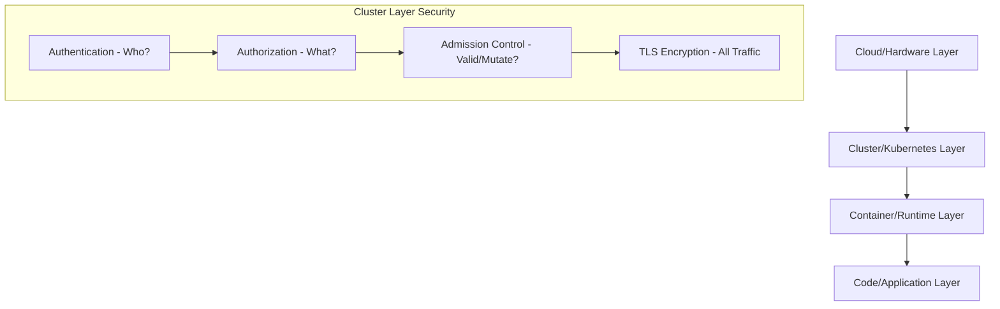
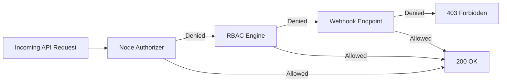

# Module 0-7-1: RBAC, ServiceAccounts & Certificate Authentication

**Breadcrumbs:** [[0-Index - Kubernetes|🏠 Kubernetes Reference MOC]] > **Module 0-7-1**

---

## 1. Kubernetes Security Primitives and Authentication

Kubernetes security is structured around the **4Cs of Cloud Native Security**: Cloud, Cluster, Container, and Code. Security controls at each layer guard against specific threat vectors.



### 1.1 Cluster Access Control Flow
Every request to the `kube-apiserver` passes through three distinct phases:
1. **Authentication (AuthN):** Validates *who* is making the request (identity).
2. **Authorization (AuthZ):** Determines *what* the authenticated identity can do.
3. **Admission Control:** Inspects and optionally modifies or rejects the request payload based on cluster policies (e.g., resource quotas, security constraints).

### 1.2 User Categories
Kubernetes distinguishes between two main classes of users:
- **Human Users (Admins & Developers):** Managed externally. Kubernetes does not have database records representing human users. It relies on trusted certificate authorities, external OIDC providers, or webhooks.
- **ServiceAccounts (Robots/Applications):** Managed natively by Kubernetes. Used by processes running inside Pods (e.g., monitoring agents, CI/CD tools) to authenticate to the API.

### 1.3 Authentication Methods
Kubernetes supports multiple authentication mechanisms, configured via flags on the `kube-apiserver`:

| Method | Flag / Configuration | Description | Production Suitability |
| :--- | :--- | :--- | :--- |
| **X.509 Client Certificates** | `--client-ca-file=ca.crt` | Client presents a certificate signed by a trusted cluster CA. CN is user, O is group. | **High** (used for internal control plane components) |
| **OpenID Connect (OIDC)** | `--oidc-issuer-url`, `--oidc-client-id` | Delegates authentication to external OAuth2 providers (Azure AD, Okta, Keycloak). | **High** (recommended for human users) |
| **Webhook Token** | `--token-auth-file` (legacy webhook) | Delegates token verification to an external REST service. | **High** (used for cloud provider auth integration) |
| **Static Token File** | `--token-auth-file=tokens.csv` | Hardcoded tokens file: `token,user,uid,"group1,group2"`. | **Zero (Removed/Deprecated)**. Insecure, requires API restarts to change. |
| **Static Password File** | `--basic-auth-file=users.csv` | Basic auth: `password,user,uid,"group1,group2"`. | **Zero (Removed/Deprecated)**. Transmits raw credentials, completely insecure. |

> [!WARNING]
> Basic authentication (`--basic-auth-file`) and static token authentication (`--token-auth-file`) were deprecated and have been completely removed in modern Kubernetes versions (removed in v1.22+). Do not use them in production or when building new clusters.

> [!NOTE]
> **Static File Ingestion in Kubeadm Control Planes:** If you must test static file-based authentication methods on older Kubernetes clusters (pre-v1.22) managed by `kubeadm`, remember that the `kube-apiserver` runs inside a container. Simply referencing a local host path like `--token-auth-file=/etc/kubernetes/tokens.csv` will fail because the container cannot access the host filesystem. You must define a host path volume and volume mount in `/etc/kubernetes/manifests/kube-apiserver.yaml` to project `/etc/kubernetes/tokens.csv` from the host into the container's namespace.

---

## 2. TLS Basics & TLS in Kubernetes

Kubernetes requires TLS for all internal control plane communications. Symmetric encryption (same key for encrypting and decrypting) is used for data in transit after a secure exchange. Asymmetric encryption (public/private key pair) is used for the initial handshake and authentication.

### 2.1 Kubernetes PKI Architecture
Kubernetes uses separate Certificate Authorities (CAs) to isolate trust domains. A typical deployment has:
1. **Cluster CA:** Used for components (apiserver, kubelet, controller-manager, scheduler).
2. **ETCD CA:** Restricts ETCD membership and access to the API server.
3. **Front Proxy CA:** Used for API aggregation layers (extension API servers).

```
+-------------------------------------------------------------------------------------------------+
|                                          CLUSTER CA                                             |
|                                         (ca.crt/key)                                            |
+------------------------------------+----------------------------------+-------------------------+
                                     |                                  |
                                     v                                  v
                       +---------------------------+      +---------------------------+
                       |    Server Certificates    |      |    Client Certificates    |
                       +---------------------------+      +---------------------------+
                       | - kube-apiserver          |      | - kube-admin              |
                       | - kubelet serving         |      | - kube-controller-manager |
                       |                           |      | - kube-scheduler          |
                       |                           |      | - kube-proxy              |
                       |                           |      | - apiserver-to-kubelet    |
                       +---------------------------+      +---------------------------+
```

### 2.2 Manual Certificate Generation (OpenSSL & CFSSL)
Below are the step-by-step commands to generate keys and sign certificates for a cluster.

#### A. Generate Certificate Authority (CA)
The CA certificate and key act as the root of trust.
```bash
# Generate root private key
openssl genrsa -out ca.key 2048

# Generate Self-Signed Root CA Certificate
openssl req -x509 -new -nodes -key ca.key -subj "/CN=KUBERNETES-CA" -days 3650 -out ca.crt
```

#### B. Generate Admin Client Certificate
The admin certificate is a client certificate. Its Common Name (`CN`) acts as the username, and the Organization (`O`) represents the group. To obtain administrator privileges, the Organization must be `system:masters`.
```bash
# Generate private key
openssl genrsa -out admin.key 2048

# Create Certificate Signing Request (CSR)
openssl req -new -key admin.key -subj "/CN=kube-admin/O=system:masters" -out admin.csr

# Sign the certificate using Cluster CA
openssl x509 -req -in admin.csr -CA ca.crt -CAkey ca.key -CAcreateserial -out admin.crt -days 365
```

#### C. Generate Kube-APIServer Server Certificate
The API Server certificate must contain Subject Alternative Names (SANs) because it is accessed by nodes, pods, and users under multiple names (local host IP, cluster IP, DNS names).

1. Create an openssl configuration file `openssl.cnf`:
```ini
[req]
req_extensions = v3_req
distinguished_name = req_distinguished_name
[req_distinguished_name]
[ v3_req ]
basicConstraints = CA:FALSE
keyUsage = nonRepudiation, digitalSignature, keyEncipherment
subjectAltName = @alt_names
[alt_names]
DNS.1 = kubernetes
DNS.2 = kubernetes.default
DNS.3 = kubernetes.default.svc
DNS.4 = kubernetes.default.svc.cluster.local
DNS.5 = master-node.example.com
IP.1 = 10.96.0.1
IP.2 = 192.168.1.10
IP.3 = 127.0.0.1
```

2. Run the generation commands:
```bash
# Generate private key
openssl genrsa -out apiserver.key 2048

# Generate CSR using the configuration file
openssl req -new -key apiserver.key -subj "/CN=kube-apiserver" -config openssl.cnf -out apiserver.csr

# Sign using Cluster CA and the SAN configuration
openssl x509 -req -in apiserver.csr -CA ca.crt -CAkey ca.key -CAcreateserial -out apiserver.crt -extensions v3_req -extfile openssl.cnf -days 365
```

#### D. Generate Kubelet Client/Server Certificate
Kubelet certificates must have the CN format `system:node:<node-name>` and the Organization `system:nodes`. This matches the requirements of the Node Authorizer.
```bash
# Generate private key for worker node 'node01'
openssl genrsa -out node01.key 2048

# Generate CSR
openssl req -new -key node01.key -subj "/CN=system:node:node01/O=system:nodes" -out node01.csr

# Sign using Cluster CA
openssl x509 -req -in node01.csr -CA ca.crt -CAkey ca.key -CAcreateserial -out node01.crt -days 365
```

#### E. Alternative: Generating Certificates using CFSSL
CFSSL (Cloudflare's PKI toolkit) uses JSON configurations, which reduces syntax errors.

1. **CA Configuration (`ca-config.json`):**
```json
{
  "signing": {
    "default": {
      "expiry": "87600h"
    },
    "profiles": {
      "kubernetes": {
        "usages": ["signing", "key encipherment", "server auth", "client auth"],
        "expiry": "87600h"
      }
    }
  }
}
```

2. **CA CSR (`ca-csr.json`):**
```json
{
  "CN": "Kubernetes-CA",
  "key": {
    "algo": "rsa",
    "size": 2048
  }
}
```

3. **Generate CA:**
```bash
cfssl gencert -initca ca-csr.json | cfssljson -bare ca
# Outputs: ca.pem (ca.crt) and ca-key.pem (ca.key)
```

4. **API Server Certificate Configuration (`apiserver-csr.json`):**
```json
{
  "CN": "kube-apiserver",
  "hosts": [
    "127.0.0.1",
    "192.168.1.10",
    "10.96.0.1",
    "kubernetes",
    "kubernetes.default",
    "kubernetes.default.svc",
    "kubernetes.default.svc.cluster.local"
  ],
  "key": {
    "algo": "rsa",
    "size": 2048
  }
}
```

5. **Generate and Sign API Server Certificate:**
```bash
cfssl gencert \
  -ca=ca.pem \
  -ca-key=ca-key.pem \
  -config=ca-config.json \
  -profile=kubernetes \
  apiserver-csr.json | cfssljson -bare apiserver
```

### 2.3 Auditing Certificate Details
When troubleshooting TLS handshake errors, use the following commands to check certificate attributes:

```bash
# Audit certificate validity, issuer, and subject
openssl x509 -in /etc/kubernetes/pki/apiserver.crt -text -noout

# Verify specifically the expiration dates
openssl x509 -in /etc/kubernetes/pki/apiserver.crt -enddate -noout

# Audit SANs (Subject Alternative Names) specifically
openssl x509 -in /etc/kubernetes/pki/apiserver.crt -text -noout | grep -A 1 "Subject Alternative Name"

# Verify if a certificate matches a private key (modulus hashes must be identical)
openssl x509 -noout -modulus -in apiserver.crt | openssl md5
openssl rsa -noout -modulus -in apiserver.key | openssl md5
```

### 2.4 Control Plane TLS Flags
Kubeadm deploys control plane components as static pods. Audit certificates in `/etc/kubernetes/manifests/`:

#### Kube-APIServer Config Highlights (`/etc/kubernetes/manifests/kube-apiserver.yaml`):
```yaml
spec:
  containers:
  - command:
    - kube-apiserver
    - --tls-cert-file=/etc/kubernetes/pki/apiserver.crt
    - --tls-private-key-file=/etc/kubernetes/pki/apiserver.key
    - --client-ca-file=/etc/kubernetes/pki/ca.crt
    # API Server to Kubelet Client Credentials
    - --kubelet-client-certificate=/etc/kubernetes/pki/apiserver-kubelet-client.crt
    - --kubelet-client-key=/etc/kubernetes/pki/apiserver-kubelet-client.key
    # API Server to ETCD Client Credentials
    - --etcd-cafile=/etc/kubernetes/pki/etcd/ca.crt
    - --etcd-certfile=/etc/kubernetes/pki/apiserver-etcd-client.crt
    - --etcd-keyfile=/etc/kubernetes/pki/apiserver-etcd-client.key
```

> [!NOTE]
> **Dual-CA Architecture & Blast Radius Isolation (The "Dual-Citizen" API Server):**
> * **The Isolation (Why):** ETCD holds the cluster's state and secrets. The primary Kubernetes CA (`/etc/kubernetes/pki/ca.crt`) signs credentials for scheduler, controller manager, kubelets, and admin users. If a worker node is compromised, we prevent the attacker from querying ETCD directly by giving ETCD its own completely isolated Private Root CA (`/etc/kubernetes/pki/etcd/ca.crt`). Even if the main K8s CA is compromised, ETCD remains secured because it only trusts client certificates signed by its own CA.
> * **The Bridge (How):** The `kube-apiserver` acts as the exclusive entry point and "dual-citizen" bridging the two isolated certificate authorities:
>   1. **Server Identity (Cluster-Facing):** Signed by the main Kubernetes CA (`apiserver.crt`). This is served to `kubectl` and worker node `kubelet` processes.
>   2. **Client Identity (ETCD-Facing):** Signed by the ETCD CA (`apiserver-etcd-client.crt`). The API server presents this specific certificate to ETCD on port `2379` to query or write data. No other component in the cluster is given this client certificate.

#### ETCD Config Highlights (`/etc/kubernetes/manifests/etcd.yaml`):
```yaml
spec:
  containers:
  - command:
    - etcd
    - --cert-file=/etc/kubernetes/pki/etcd/server.crt
    - --key-file=/etc/kubernetes/pki/etcd/server.key
    - --trusted-ca-file=/etc/kubernetes/pki/etcd/ca.crt
    - --client-cert-auth=true
    - --peer-cert-file=/etc/kubernetes/pki/etcd/peer.crt
    - --peer-key-file=/etc/kubernetes/pki/etcd/peer.key
    - --peer-trusted-ca-file=/etc/kubernetes/pki/etcd/ca.crt
```

### 2.5 Practical TLS/Certificate Troubleshooting Scenarios

In production and on the CKA exam, static pod configurations for core components like the API Server and ETCD can be modified incorrectly, causing the cluster to go down. Since `kubectl` will not function when the control plane is offline, you must debug at the container runtime level.

#### Scenario 1: ETCD Static Pod CrashLoop (Path/Name Mismatch)
* **The Symptom:** `kubectl` commands fail with `connection refused` or `handshake timeout`.
* **Investigation:** 
  1. Inspect the running containers on the host using the container runtime CLI (e.g. `crictl ps -a` or `docker ps -a`).
  2. Locate the stopped ETCD container and fetch its logs: `crictl logs <container-id>` (or `docker logs <container-id>`).
  3. If you see an error like `etcdmain: cannot find /etc/kubernetes/pki/etcd/server-certificate.crt: no such file or directory`, it indicates a certificate configuration mismatch.
* **The Root Cause:** The static pod manifest `/etc/kubernetes/manifests/etcd.yaml` has an incorrect file path for `--cert-file` or other certificate files.
* **The Fix:** Edit `/etc/kubernetes/manifests/etcd.yaml` to specify the correct filename (e.g. `server.crt` instead of `server-certificate.crt`). The Kubelet will automatically reload the manifest and restart the ETCD static pod container.

#### Scenario 2: API Server Fail-to-Start (Unknown Authority / Wrong CA Binds)
* **The Symptom:** Kube-APIServer container is constantly exiting and restarting.
* **Investigation:**
  1. Check the logs of the failing API Server container: `crictl logs <kube-apiserver-container-id>`.
  2. Look for errors like `authentication handshake failed: certificate signed by unknown authority` or `failed to connect to 127.0.0.1:2379: remote error: bad certificate`.
  3. Check the client log on the ETCD container: `rejected connection from 127.0.0.1:xxxxx (bad certificate)`.
* **The Root Cause:** The Kube-APIServer connects as a client to ETCD, but its client configuration references the wrong Certificate Authority. In a standard Kubeadm setup, the Cluster CA (`/etc/kubernetes/pki/ca.crt`) is used for Kubernetes clients, but the ETCD server uses its own dedicated ETCD CA (`/etc/kubernetes/pki/etcd/ca.crt`) to verify clients. 
  * If the API server's `--etcd-cafile` flag in `/etc/kubernetes/manifests/kube-apiserver.yaml` is set to `/etc/kubernetes/pki/ca.crt` (Kubernetes CA), it will fail to validate the ETCD certificate.
* **The Fix:** Edit `/etc/kubernetes/manifests/kube-apiserver.yaml` and set the `--etcd-cafile` flag to `/etc/kubernetes/pki/etcd/ca.crt`. Kubelet will reload the manifest and restart the Kube-APIServer.

#### Scenario 3: mTLS Handshake Rejections & External SAN Mismatches (Load Balancers / Public IPs)
* **The Symptom:** When accessing the cluster externally via a Load Balancer DNS name or Public IP, the `kubectl` command instantly fails with:
  `Unable to connect to the server: x509: certificate is valid for 10.96.0.1, 192.168.1.10... not 203.0.113.50`
* **The Root Cause (Phase 1 vs Phase 2 mTLS Verification):**
  * **Phase 1: Client Rejects Server (SAN Mismatch):** In Mutual TLS (mTLS), the client (`kubectl`) must authenticate the server before sending credentials. It compares the target IP or DNS it is connecting to against the **Subject Alternative Names (SANs)** list inside the API server's certificate (`apiserver.crt`). If the IP is not in the SANs, `kubectl` terminates the connection. The server did not reject you; the client rejected the server.
  * **Phase 2: Server Rejects Client (Unauthorized/Forbidden):** If Phase 1 passes, the secure tunnel is built and the server verifies your client credentials (usually from `~/.kube/config`). If they are expired, signed by the wrong CA, or lack RBAC permissions, the server rejects the client with `Unauthorized` or `Forbidden`.
  * **Default SAN Constraints:** By default, `kubeadm` only stamps `apiserver.crt` with internal cluster IPs (e.g., `10.96.0.1`), local host IPs, and local domain suffixes (`.default.svc.cluster.local`). External Load Balancers or public IPs are not automatically included.
* **The Fix (Bootstrap extra SANs):** If provisioning a new cluster, pass the external IP/DNS during init:
  ```bash
  kubeadm init --apiserver-cert-extra-sans="my-loadbalancer.company.com,203.0.113.50"
  ```
* **The Fix (Regenerate SANs on Running Cluster):**
  1. Edit the cluster config in the `kube-system` namespace to add the external values to the `certSANs` block:
     ```bash
     kubectl edit cm -n kube-system kubeadm-config
     # Under apiServer -> certSANs, append:
     # apiServer:
     #   certSANs:
     #   - "203.0.113.50"
     #   - "my-loadbalancer.company.com"
     ```
  2. SSH onto the control plane node, elevate to root, and delete the existing API Server certificates:
     ```bash
     sudo rm /etc/kubernetes/pki/apiserver.crt /etc/kubernetes/pki/apiserver.key
     ```
  3. Regenerate the certificates using `kubeadm`:
     ```bash
     sudo kubeadm init phase certs apiserver
     ```
  4. Force a reload of the API server container by temporarily moving the static manifest and putting it back:
     ```bash
     mv /etc/kubernetes/manifests/kube-apiserver.yaml /tmp/
     # Wait 5 seconds for Kubelet to kill the container
     mv /tmp/kube-apiserver.yaml /etc/kubernetes/manifests/
     ```

---

## 3. Certificates API

The Kubernetes Certificates API allows users to request certificates by submitting a `CertificateSigningRequest` (CSR) object to the API server. This removes the need to log into the master node to sign certificates.

### 3.1 CSR Flow
```
[Client] -(Generates Key & CSR file)-> [Admin] -(Creates YAML with Base64)-> [K8s API]
                                                                                |
[Client] <--(Downloads Certificate file)--- [Admin] <--(Approves CSR)-----------+
```

### 3.2 Submitting a Certificate Signing Request
1. User generates private key and CSR file:
```bash
openssl genrsa -out jane.key 2048
openssl req -new -key jane.key -subj "/CN=jane" -out jane.csr
```

2. Base64-encode the CSR file (without newlines):
```bash
cat jane.csr | base64 | tr -d '\n'
```

3. Create the `CertificateSigningRequest` manifest (`jane-csr.yaml`):
```yaml
apiVersion: certificates.k8s.io/v1
kind: CertificateSigningRequest
metadata:
  name: jane-csr
spec:
  # Base64 encoded contents of jane.csr
  request: MIICTAIBADAbMRkwFwYDVQQDDBBqYW5lMIIBIjANBgkqhkiG9w0BAQEFAAOC...
  signerName: kubernetes.io/kube-apiserver-client
  usages:
  - client auth
```

> [!NOTE]
> **Key CSR Parameters and Validation Logic:**
> * **`signerName` (Signing Pipelines):** Directs the signing request to the correct internal cluster Certificate Authority (CA) handler:
>   * `kubernetes.io/kube-apiserver-client`: For human users, admins, or CLI clients logging into the API server.
>   * `kubernetes.io/kubelet-serving`: For node Kubelets hosting secure endpoints (required by API server to stream logs or execute commands).
>   * `kubernetes.io/kube-apiserver-client-kubelet`: For worker node Kubelet daemons logging in to report node statuses.
> * **`usages` (Extended Key Usages):** Cryptographically defines the permitted actions for the certificate holder by encoding specific TLS Web Object Identifiers (OIDs) into the cert:
>   * `client auth`: Inserts the Web Client Authentication OID. Necessary for clients running `kubectl` or API operations. If missing, connections are terminated immediately.
>   * `server auth`: Inserts the Web Server Authentication OID. Used by server processes (like the API server itself).
>   * **Validation Guard:** The API server validation engine checks that the `usages` match the `signerName` (e.g., `client auth` for a client signer). Mismatches trigger API submission rejections.
> * **Submitter Metadata Injection:** At submission (`kubectl apply`), the API server automatically intercepts the manifest to record the submitter's `username` and `groups` in the CSR status block (e.g. `system:authenticated`, `system:masters`).
> * **Group Mapping to RBAC:** Kubernetes does not save users or groups as entities in `etcd`. Instead, group names are compiled as Organization (`O=`) fields in the Subject line of the client certificate. The API server decrypts this metadata upon handshake and resolves permissions by matching these string names against the `kind: Group` subjects defined in active `RoleBindings`/`ClusterRoleBindings`.


### 3.3 CSR Management CLI
```bash
# Create the CSR resource
kubectl apply -f jane-csr.yaml

# List pending CSRs
kubectl get csr

# Approve the CSR
kubectl certificate approve jane-csr

# Deny the CSR
kubectl certificate deny jane-csr

# Export the signed certificate from the CSR object
kubectl get csr jane-csr -o jsonpath='{.status.certificate}' | base64 --decode > jane.crt

# Delete the CSR resource
kubectl delete csr jane-csr
```

### 3.4 Kubelet TLS Bootstrapping
Kubelet TLS bootstrapping allows new worker nodes to join the cluster and obtain valid TLS certificates automatically:
1. When a new node boots, it uses a temporary **Bootstrap Token** to authenticate to the API.
2. The Kubelet submits a CSR requesting a client certificate (`kubernetes.io/kube-apiserver-client-kubelet`).
3. The `kube-controller-manager` approves the CSR if the node's token matches.
4. Kubelet downloads its signed client certificate and uses it for subsequent communication.
5. Kubelet automatically requests a certificate renewal before expiration.

---

## 4. Kubeconfig and API Connection Profiles

Kubeconfig files manage cluster access information, client credentials, and contexts. `kubectl` uses these configuration profiles to locate, authenticate, and route commands to target Kubernetes clusters.

### 4.1 KUBECONFIG Components
A KUBECONFIG file organizes connection information using three collections:
* **Clusters:** Defines cluster API server endpoints and their associated Certificate Authority (CA) data:
  * `server`: The target API server URL.
  * `certificate-authority` or `certificate-authority-data`: The file path or base64-encoded CA certificate used to verify the server's certificate.
* **Users:** Stores the credentials used to authenticate against the clusters (e.g., client certificates, tokens, or cloud provider SSO details).
* **Contexts:** Binds a specific `user` to a specific `cluster` and default `namespace` (e.g., `context: user-admin + prod-cluster`).

```yaml
apiVersion: v1
kind: Config
preferences: {}

clusters:
- name: prod-cluster
  cluster:
    server: https://192.168.1.10:6443
    certificate-authority: /etc/kubernetes/pki/ca.crt # Or certificate-authority-data (base64)

users:
- name: admin-user
  user:
    client-certificate: /etc/kubernetes/pki/users/admin.crt # Or client-certificate-data (base64)
    client-key: /etc/kubernetes/pki/users/admin.key # Or client-key-data (base64)

contexts:
- name: prod-admin-context
  context:
    cluster: prod-cluster
    user: admin-user
    namespace: default

current-context: prod-admin-context
```

### 4.2 Config Management & CLI Selection
* **Default Path:** `kubectl` searches for a config file at `${HOME}/.kube/config` unless overridden.
* **Environment Variable Merging:** You can specify multiple configuration paths using the `KUBECONFIG` environment variable (separated by colons on Linux/macOS). `kubectl` merges these configurations at runtime.
* **Command Override:** You can target a specific config file directly using the `--kubeconfig` flag:
  ```bash
  kubectl --kubeconfig=/path/to/custom/config get pods
  ```
* **Context Management & Switching:**
  ```bash
  # View the merged active kubeconfig configuration details
  kubectl config view
  
  # Switch the current-context
  kubectl config use-context prod-admin-context
  
  # Set the default namespace for the current context
  kubectl config set-context --current --namespace=finance
  
  # Create a new cluster entry
  kubectl config set-cluster staging-cluster \
    --server=https://192.168.1.20:6443 \
    --certificate-authority=/etc/kubernetes/pki/ca.crt \
    --embed-certs=true
  
  # Create a new user entry
  kubectl config set-credentials dev-user \
    --client-certificate=/etc/kubernetes/pki/users/dev-user.crt \
    --client-key=/etc/kubernetes/pki/users/dev-user.key \
    --embed-certs=true
  
  # Create a new context entry binding user and cluster
  kubectl config set-context dev-context \
    --cluster=staging-cluster \
    --user=dev-user \
    --namespace=dev
  ```

### 4.3 TLS Trust and Certificate Validation
* **TLS Handshake:** During the initial connection, the API server sends its certificate. `kubectl` uses the configured `certificate-authority` data to verify that the certificate was signed by a trusted authority.
* **Bypass Verification:** For test environments, you can disable TLS verification, though this exposes the connection to man-in-the-middle attacks:
  ```yaml
  insecure-skip-tls-verify: true
  ```
* **KinD Clusters:** KinD generates a KUBECONFIG file during cluster bootstrap using `kubeadm` commands executed inside control-plane containers, storing the TLS certs automatically.

### 4.4 Merging Kubeconfigs manually
If you have multiple separate Kubeconfig files and need to consolidate them:
```bash
# Concatenate files in the KUBECONFIG environment variable, then flatten and save
KUBECONFIG=~/.kube/config:/path/to/second-config:/path/to/third-config \
  kubectl config view --flatten > ~/.kube/config.merged

# Overwrite the original config with the merged version
mv ~/.kube/config.merged ~/.kube/config
```

---

## 5. Authorization Modes

Authorization occurs after successful authentication. If multiple modes are configured, Kubernetes processes them in the order specified. A request is allowed as soon as one mode approves it.

### 5.1 Mode Configuration
Configure authorization modes on the `kube-apiserver` command line:
```yaml
- --authorization-mode=Node,RBAC,Webhook
```

### 5.2 Key Authorization Modes



- **Node Authorization:** A specialized authorizer that grants permissions to Kubelets based on the pods assigned to their nodes. This ensures a compromised node cannot access secrets or modify resources outside its scope.
- **RBAC (Role-Based Access Control):** Uses the Kubernetes API to manage authorization dynamically. It groups permissions into Roles and binds them to users/groups.
- **Webhook Authorization:** Delegates authorization decisions to an external HTTP server. Commonly used for policy engines like OPA Gatekeeper or Kyverno.
- **ABAC (Attribute-Based Access Control):** Uses local JSON policies. Not recommended because changes require restarting the API server.
- **AlwaysAllow / AlwaysDeny:** Bypasses authorization checks (Allows all or Denies all). Used for local testing and debugging.

---

## 6. Role-Based Access Control (RBAC)

RBAC controls API access using Roles and RoleBindings. 

### 6.1 Authentication vs. Authorization
* **Authentication (AuthN):** Verifies the identity of the client sending the request (e.g., verifying TLS certificates, tokens, or Single Sign-On credentials).
* **Authorization (AuthZ):** Determines what actions the authenticated client is permitted to perform.
* **Zero-Trust Default Policy:** Kubernetes operates on a zero-trust model. By default, authenticated users have zero authorizations and cannot access any cluster resources until explicitly configured.

### 6.2 Namespaced vs. Cluster-Scoped Resources
Resources in Kubernetes are either Namespaced or Cluster-scoped:
- **Namespaced:** Pods, Services, Deployments, ConfigMaps, Secrets, PVCs.
- **Cluster-scoped:** Nodes, Namespaces, PersistentVolumes, ClusterRoles, ClusterRoleBindings, CustomResourceDefinitions (CRDs).

```bash
# List namespaced resources
kubectl api-resources --namespaced=true

# List cluster-scoped resources
kubectl api-resources --namespaced=false
```

### 6.3 RBAC Primitives
- **Role:** Defines rules (apiGroups, resources, verbs) *within a single namespace*. Confined to a single namespace and cannot authorize access to cluster-scoped resources (such as Nodes or PVs).
- **RoleBinding:** Assigns a Role to subjects (Users, Groups, ServiceAccounts) *within that namespace*.
- **ClusterRole:** Defines rules *cluster-wide* (applies to non-namespaced resources, or all namespaces). Used to manage cluster-scoped resources or namespaced resources across all namespaces.
- **ClusterRoleBinding:** Assigns a ClusterRole to subjects *cluster-wide*.
- **RoleBinding to ClusterRole:** If you bind a ClusterRole using a namespaced `RoleBinding`, the permissions defined in the ClusterRole are restricted to the namespace of that RoleBinding.

```
NAMESPACE SCOPE:
[Role: developer] <=====(RoleBinding)=====> [User: jane] (Applies only to 'dev' namespace)

CLUSTER SCOPE:
[ClusterRole: node-admin] <=====(ClusterRoleBinding)=====> [User: michelle] (Applies to all namespaces and cluster-wide resources)
```

### 6.4 Complete YAML Templates

#### Role (Namespaced)
```yaml
apiVersion: rbac.authorization.k8s.io/v1
kind: Role
metadata:
  name: developer-role
  namespace: dev
rules:
- apiGroups: [""] # Core api group (pods, configmaps, secrets, services)
  resources: ["pods", "pods/log", "services"]
  verbs: ["get", "list", "watch", "create", "update", "delete"]
- apiGroups: ["apps"] # Apps group (deployments, replicasets, daemonsets)
  resources: ["deployments"]
  verbs: ["get", "list", "update", "patch"]
```

#### RoleBinding (Namespaced)
```yaml
apiVersion: rbac.authorization.k8s.io/v1
kind: RoleBinding
metadata:
  name: dev-user-binding
  namespace: dev
subjects:
- kind: User
  name: dev-user
  apiGroup: rbac.authorization.k8s.io
- kind: ServiceAccount
  name: build-agent-sa
  namespace: dev
roleRef:
  kind: Role
  name: developer-role
  apiGroup: rbac.authorization.k8s.io
```

#### ClusterRole (Cluster-scoped)
```yaml
apiVersion: rbac.authorization.k8s.io/v1
kind: ClusterRole
metadata:
  name: cluster-storage-manager
rules:
- apiGroups: [""]
  resources: ["persistentvolumes"] # PVs are cluster-scoped
  verbs: ["get", "list", "watch", "create", "delete"]
- apiGroups: ["storage.k8s.io"]
  resources: ["storageclasses"] # StorageClasses are cluster-scoped
  verbs: ["get", "list", "watch"]
```

#### ClusterRoleBinding (Cluster-scoped)
```yaml
apiVersion: rbac.authorization.k8s.io/v1
kind: ClusterRoleBinding
metadata:
  name: storage-admin-binding
subjects:
- kind: User
  name: storage-admin
  apiGroup: rbac.authorization.k8s.io
roleRef:
  kind: ClusterRole
  name: cluster-storage-manager
  apiGroup: rbac.authorization.k8s.io
```

### 6.5 Restricting Access by Resource Names
You can limit access to specific resource instances using `resourceNames`:
```yaml
apiVersion: rbac.authorization.k8s.io/v1
kind: Role
metadata:
  name: configmap-manager
  namespace: dev
rules:
- apiGroups: [""]
  resources: ["configmaps"]
  resourceNames: ["app-config", "db-config"] # Can only interact with these two
  verbs: ["get", "update"]
```

### 6.6 ClusterRole bound with RoleBinding (Best Practice)
> [!TIP]
> You can bind a `ClusterRole` using a `RoleBinding` in a specific namespace. This grants the permissions of the ClusterRole *only within that namespace*. This allows you to define a single common policy (e.g., `view-only-clusterrole`) and reuse it across multiple namespaces without duplicating Role objects.

### 6.7 Testing and Verifying Permissions (`kubectl auth can-i`)
Verify RBAC configurations using the `can-i` command-line utility. This allows administrators to test and debug API access policies without logging in as the target user:

```bash
# Check if you can perform an action
kubectl auth can-i create deployments

# Check if a specific user can perform an action in a namespace
kubectl auth can-i list secrets --as dev-user --namespace dev

# Verify if a user can create pods (impersonation test)
kubectl auth can-i create pods --as=developer-user

# Check if a ServiceAccount can perform an action
kubectl auth can-i get pods --as system:serviceaccount:dev:build-agent-sa --namespace dev

# Check permissions for a group
kubectl auth can-i delete pv --as-group system:masters
```

* **Interactive Lab HTML Logs:** Refer to the hands-on verification logs: [../Attachments/rbac.html](../Attachments/rbac.html) (embed: `![[../Attachments/rbac.html]]`)

### 6.8 Step-by-Step Walkthrough: Restricting ServiceAccount Access
Following the principle of least privilege, we will create a service account representing an application workspace, grant it read-only access to pods in a specific namespace, and verify the isolation.

#### Step 1: Create an Isolated Namespace
Create a dedicated namespace for testing:
```bash
kubectl create namespace rbac-test
```

#### Step 2: Create a ServiceAccount (Dev User)
Create the `dev-user` service account inside the namespace:
```bash
kubectl create serviceaccount dev-user --namespace rbac-test
```

#### Step 3: Define Permissions with a Role
Create a Role manifest (`role.yaml`) specifying read-only permissions on pods:
```yaml
apiVersion: rbac.authorization.k8s.io/v1
kind: Role
metadata:
  name: pod-reader
  namespace: rbac-test
rules:
- apiGroups: [""] # Core API Group
  resources: ["pods"]
  verbs: ["get", "list", "watch"] # Read-only, no create/delete/update
```
Apply the Role to the cluster:
```bash
kubectl apply -f role.yaml
```

#### Step 4: Connect the ServiceAccount and Role with a RoleBinding
Create a RoleBinding manifest (`rolebinding.yaml`) to bind the `dev-user` to the `pod-reader` role:
```yaml
apiVersion: rbac.authorization.k8s.io/v1
kind: RoleBinding
metadata:
  name: read-pods-binding
  namespace: rbac-test
subjects:
- kind: ServiceAccount
  name: dev-user
  namespace: rbac-test
roleRef:
  kind: Role
  name: pod-reader
  apiGroup: rbac.authorization.k8s.io
```
Apply the RoleBinding to the cluster:
```bash
kubectl apply -f rolebinding.yaml
```

#### Step 5: Verify Permissions with `kubectl auth can-i`
Impersonate the `dev-user` service account using `kubectl auth can-i` to verify that our policy is correctly enforced:
1. **Verify positive case (can list pods):**
   ```bash
   kubectl auth can-i list pods --as system:serviceaccount:rbac-test:dev-user --namespace rbac-test
   ```
   *Expected Output:* `yes`
   
2. **Verify negative case (cannot delete pods):**
   ```bash
   kubectl auth can-i delete pods --as system:serviceaccount:rbac-test:dev-user --namespace rbac-test
   ```
   *Expected Output:* `no`

---

## 7. ServiceAccounts

ServiceAccounts provide identities for containerized processes running inside Pods to authenticate against the Kubernetes API Server.

### 7.1 Identity Scoping and Mounting Rules
*   **Identity Creation Only:** Running `kubectl create serviceaccount dev-user --namespace rbac-test` only registers a credentials identity. It remains idle and performs no actions until explicitly mounted.
*   **Pod Exclusivity:** ServiceAccounts are exclusively consumed by **Pods**. They do not mount to or authenticate other resource types (e.g. Services, ConfigMaps, or Ingresses).
*   **The Default Auto-mount:** Every namespace automatically features a `default` ServiceAccount. Unless overridden, Kubernetes automatically mounts the `default` ServiceAccount token into all newly created Pods at `/var/run/secrets/kubernetes.io/serviceaccount/token`.

To mount a custom ServiceAccount, declare the `serviceAccountName` in the Pod's specification:
```yaml
apiVersion: v1
kind: Pod
metadata:
  name: dev-app-pod
  namespace: rbac-test
spec:
  serviceAccountName: dev-user  # Explicitly associates the Pod with the custom identity
  containers:
  - name: app
    image: nginx
```

### 7.2 Disabling Token Automounting
To prevent credential leakage and minimize exposure (highly recommended for Pods that do not need to interact with the API Server):

#### Option A: Disable at the ServiceAccount level
```yaml
apiVersion: v1
kind: ServiceAccount
metadata:
  name: non-api-sa
automountServiceAccountToken: false
```

#### Option B: Disable at the Pod level
```yaml
apiVersion: v1
kind: Pod
metadata:
  name: web-app
spec:
  automountServiceAccountToken: false
  containers:
  - name: web
    image: nginx
```

### 7.2 ServiceAccount Tokens in v1.22+ and v1.24+
Modern Kubernetes versions include security enhancements for ServiceAccount tokens:

- **v1.22+ Projected Volumes:** Tokens are no longer static. They are mounted as projected volumes, bound to the Pod lifetime, audience-restricted, and auto-rotated (default lifetime is 1 hour).
- **v1.24+ Token Reduction (KEP-2799):** The API server no longer automatically creates secret objects for new ServiceAccounts. If a long-lived, static token is required, you must create a secret manually.

```bash
# Generate a temporary token via TokenRequest API (valid for 1 hour)
kubectl create token my-service-account
```

#### Manually creating a long-lived token secret:
```yaml
apiVersion: v1
kind: Secret
metadata:
  name: my-sa-token-secret
  annotations:
    kubernetes.io/service-account.name: my-service-account # Binds to the SA
type: kubernetes.io/service-account-token
```

---
