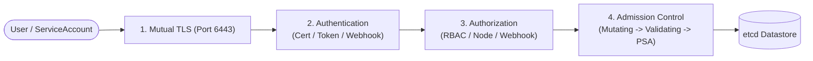
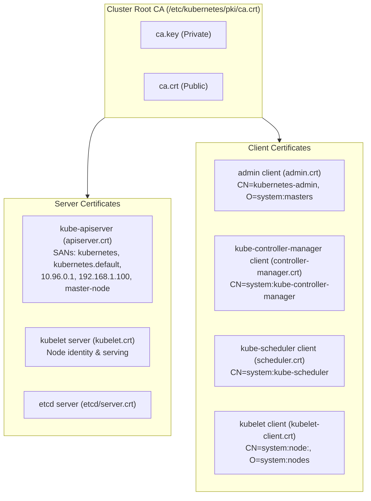
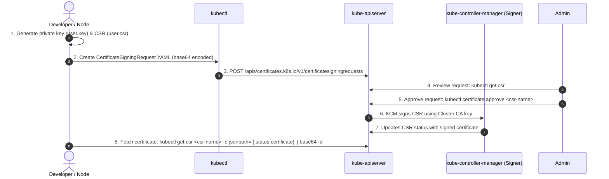
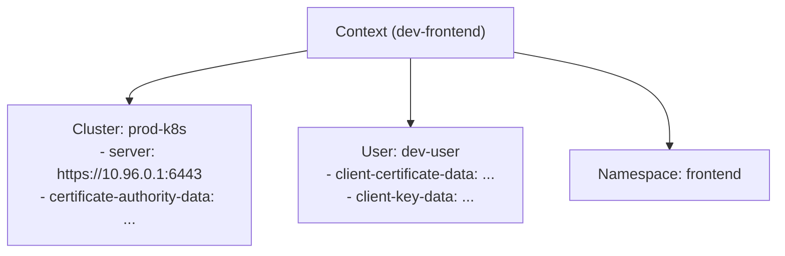
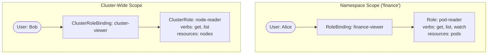
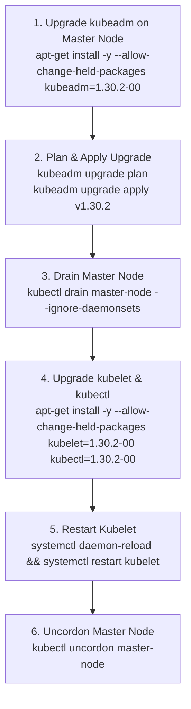
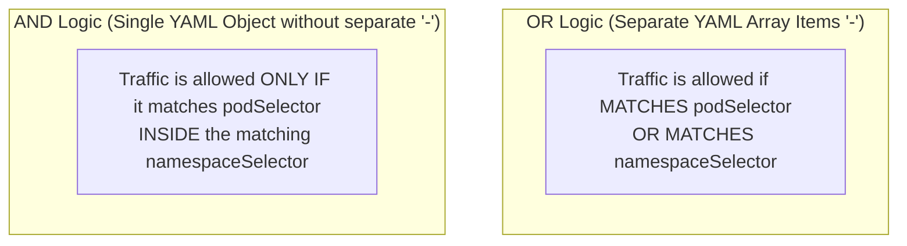

# Module 0-7-2: Cluster Setup & Hardening Masterclass

**Breadcrumbs:** [[0-Index - Kubernetes|🏠 Kubernetes Reference MOC]] > [[0-Index - CKS|🛡️ CKS Reference MOC]] > **Module 0-7-2**

> [!ABSTRACT] 📚 Course Alignment & Module Scope
> **Course:** KodeKloud Certified Kubernetes Security Specialist (CKS)
> **Section:** Cluster Setup and Hardening
> **Source Files:** `inflow/cks_split/02_cluster_setup_and_hardening.md`
> **Topics Covered:** Kubernetes Security Primitives, TLS & PKI Architecture, Certificates API, KubeConfig, API Groups, Authentication, RBAC & ClusterRoles, Bound ServiceAccount Tokens, Kubelet Hardening, CIS Benchmarks & `kube-bench`, Binary Verification, IMDSv2 Metadata Protection, Cluster Upgrades, NetworkPolicies, Ingress TLS, and API Server Auditing.

---

## 🧭 Table of Contents
1. [Kubernetes Security Primitives & PKI / TLS Architecture](#1--kubernetes-security-primitives--pki--tls-architecture)
2. [Certificates API & KubeConfig Management](#2--certificates-api--kubeconfig-management)
3. [API Groups, Access Endpoints & Proxy Mechanics](#3--api-groups-access-endpoints--proxy-mechanics)
4. [Authentication & ServiceAccount Identity Hardening](#4--authentication--serviceaccount-identity-hardening)
5. [Authorization & Role-Based Access Control (RBAC)](#5--authorization--role-based-access-control-rbac)
6. [Kubelet Security & Node Control Plane Hardening](#6--kubelet-security--node-control-plane-hardening)
7. [CIS Benchmarks, `kube-bench` Auditing & Binary Integrity](#7--cis-benchmarks-kube-bench-auditing--binary-integrity)
8. [Cloud Node Metadata Security & IMDSv2 Protection](#8--cloud-node-metadata-security--imdsv2-protection)
9. [Safe, Production Cluster Upgrade Workflow](#9--safe-production-cluster-upgrade-workflow)
10. [NetworkPolicies & Microsegmentation](#10--networkpolicies--microsegmentation)
11. [Ingress Controllers & TLS Termination](#11--ingress-controllers--tls-termination)
12. [Kubernetes API Auditing & Audit Policies](#12--kubernetes-api-auditing--audit-policies)
13. [Deep-Intuition Diagnostic Analyses (AARF)](#13--deep-intuition-diagnostic-analyses-aarf)
14. [CKS Exam Speed Hacks & Command Cheatsheet](#14--cks-exam-speed-hacks--command-cheatsheet)
15. [Course Walkthrough Navigation](#15--course-walkthrough-navigation)

---

## 1. 🔑 Kubernetes Security Primitives & PKI / TLS Architecture

Securing access to the Kubernetes control plane requires navigating three distinct enforcement gateways: **Authentication (AuthN)**, **Authorization (AuthZ)**, and **Admission Control**.



### 1.1 The Kubernetes PKI Hierarchy
Kubernetes relies on mutual TLS (mTLS) for every internal communication channel. A standard cluster requires multiple distinct Certificate Authorities (CAs):
1. **Cluster CA:** Signs certificates for API server, Kubelets, Controller Manager, Scheduler, and Admin clients.
2. **ETCD CA:** Signs certificates for etcd peer communication and API-to-etcd client connections.
3. **Front-Proxy CA:** Signs certificates for extension API servers (Aggregation Layer).



### 1.2 Certificate Inspection & Auditing
In production and on the CKS exam, diagnosing cluster failure often requires verifying X.509 certificate parameters:

```bash
# 1. Inspect certificate expiration dates with kubeadm:
kubeadm certs check-expiration

# 2. Inspect a specific certificate using OpenSSL:
openssl x509 -in /etc/kubernetes/pki/apiserver.crt -text -noout

# 3. Check Subject (CN) and Organization (O):
openssl x509 -in /etc/kubernetes/pki/apiserver.crt -text -noout | grep -E "Subject:|Issuer:"

# 4. Check Subject Alternative Names (SANs):
openssl x509 -in /etc/kubernetes/pki/apiserver.crt -text -noout | grep -A 1 "Subject Alternative Name"

# 5. Verify whether a private key matches a certificate (Modulus hashes must match):
openssl x509 -noout -modulus -in /etc/kubernetes/pki/apiserver.crt | openssl md5
openssl rsa -noout -modulus -in /etc/kubernetes/pki/apiserver.key | openssl md5
```

### 1.3 Renewing Certificates
If certificates expire or are compromised:
```bash
# Renew all control plane certificates managed by kubeadm:
kubeadm certs renew all

# Note: Static pods must be restarted for renewed certificates to take effect!
# Either move the manifests out and back in, or kill the static pod containers:
kill -s SIGHUP $(pgrep kube-apiserver)
```

---

## 2. 📜 Certificates API & KubeConfig Management

### 2.1 The Certificates API (CSR Workflow)
Rather than manually distributing CA keys to nodes, Kubernetes provides a native `certificates.k8s.io` API to automate certificate signing requests (CSRs).



#### CertificateSigningRequest Manifest Template:
```yaml
apiVersion: certificates.k8s.io/v1
kind: CertificateSigningRequest
metadata:
  name: dev-user-csr
spec:
  request: <BASE64_ENCODED_CSR_STRING>
  signerName: kubernetes.io/kube-apiserver-client
  expirationSeconds: 86400 # 24 hours
  usages:
    - client auth
```

#### CSR Management Commands:
```bash
# Approve a pending CSR:
kubectl certificate approve dev-user-csr

# Deny a malicious or invalid CSR:
kubectl certificate deny suspicious-csr

# Extract the signed certificate to disk:
kubectl get csr dev-user-csr -o jsonpath='{.status.certificate}' | base64 -d > dev-user.crt
```

### 2.2 KubeConfig Architecture
A `kubeconfig` file organizes access to multiple clusters, users, and contexts:



```bash
# View active kubeconfig:
kubectl config view

# Switch active context:
kubectl config use-context dev-frontend

# Set namespace default for the current context:
kubectl config set-context --current --namespace=finance
```

---

## 3. 🌐 API Groups, Access Endpoints & Proxy Mechanics

The Kubernetes API exposes resources organized into distinct API groups, paths, and verbs.

### 3.1 API Group Taxonomy
1. **Core API Group (`/api/v1`):** Foundational legacy resources (`pods`, `services`, `namespaces`, `nodes`, `persistentvolumes`, `secrets`, `configmaps`).
2. **Named API Groups (`/apis/<group>/<version>`):** Modular extensions and modern primitives:
   - `apps/v1`: `deployments`, `daemonsets`, `statefulsets`, `replicasets`.
   - `rbac.authorization.k8s.io/v1`: `roles`, `clusterroles`, `rolebindings`.
   - `networking.k8s.io/v1`: `networkpolicies`, `ingresses`.
   - `policy/v1`: `poddisruptionbudgets`.
   - `admissionregistration.k8s.io/v1`: `validatingwebhookconfigurations`.

### 3.2 Direct API Access vs. `kubectl proxy` vs. `kube-proxy`

| Mechanism | Purpose | Authentication Handling | Security Scope |
| :--- | :--- | :--- | :--- |
| **Direct `curl` to Port 6443** | Direct external communication with API Server. | Must manually pass client certificates (`--cert`, `--key`) or bearer token header (`Authorization: Bearer <token>`). | Strict TLS verification required (`--cacert`). |
| **`kubectl proxy`** | Local HTTP reverse proxy created by user CLI on localhost (typically port 8001). | Automatically injects the user's `kubeconfig` client credentials into forwarded requests. | Intended solely for local development and debugging; binds to `127.0.0.1`. |
| **`kube-proxy`** | Core Kubernetes daemon running on every node. | Not an HTTP API proxy; programs iptables or IPVS rules to forward TCP/UDP traffic destined for ClusterIPs to Pod endpoints. | Data plane packet routing only. |

```bash
# Test direct curl with client certs:
curl https://master-node:6443/api/v1/pods \
  --cacert /etc/kubernetes/pki/ca.crt \
  --cert /etc/kubernetes/pki/admin.crt \
  --key /etc/kubernetes/pki/admin.key

# Launch local kubectl proxy:
kubectl proxy --port=8001 &
curl http://localhost:8001/version
```

---

## 4. 👤 Authentication & ServiceAccount Identity Hardening

Kubernetes distinguishes between **Human Users** and **Workload Identities (ServiceAccounts)**:
* **Human Users:** Do not exist as Kubernetes API objects. They are authenticated via external X.509 client certificates (CN = username, O = group), OIDC tokens (e.g. Google, Okta), or Webhook tokens.
* **ServiceAccounts:** Are native Kubernetes API objects (`kind: ServiceAccount`) scoped to a namespace, used by pods to communicate with the API Server.

### 4.1 Modern Bound ServiceAccount Token Projection
In Kubernetes v1.22+ and default in v1.24+, legacy auto-generated Secret tokens have been deprecated in favor of **Bound ServiceAccount Tokens**:
* **Time-Bound:** Automatically expire (default 1 hour) and are continuously refreshed by the Kubelet.
* **Audience-Bound:** Scoped strictly to designated API audiences (`aud: ["https://kubernetes.default.svc.cluster.local"]`).
* **Object-Bound:** Cryptographically tied to the lifetime of the specific Pod requesting the token. If the pod is deleted, the token is instantly invalidated.

```bash
# Imperatively request a temporary token for testing (valid 15 minutes):
kubectl create token dev-sa --duration=15m
```

### 4.2 Disabling Token Automounting (Principle of Least Privilege)
Most application pods do not need to query the Kubernetes API. Automounting tokens into every pod creates an unnecessary lateral movement attack vector.

#### Disable at ServiceAccount Level:
```yaml
apiVersion: v1
kind: ServiceAccount
metadata:
  name: restricted-sa
  namespace: production
automountServiceAccountToken: false
```

#### Disable at Pod Level:
```yaml
apiVersion: v1
kind: Pod
metadata:
  name: web-frontend
  namespace: production
spec:
  automountServiceAccountToken: false
  containers:
    - name: nginx
      image: nginx:alpine
```

### 4.3 NodeRestriction Admission Controller
The `NodeRestriction` admission controller limits what a Kubelet can modify:
* A Kubelet authenticated with a certificate in `system:nodes` and username `system:node:<node-name>` **can only modify its own Node resource** and its own Pod status.
* It cannot add labels to nodes or modify pods on other nodes.
* Enforced on `kube-apiserver`:
  ```yaml
  # /etc/kubernetes/manifests/kube-apiserver.yaml
  - --enable-admission-plugins=NodeRestriction,PodSecurity
  ```

---

## 5. 🛡️ Authorization & Role-Based Access Control (RBAC)

### 5.1 RBAC Primitives
* **Role:** Grants permissions within a single namespace.
* **RoleBinding:** Binds a Role (or ClusterRole) to users, groups, or ServiceAccounts within a single namespace.
* **ClusterRole:** Grants permissions across all namespaces or over cluster-scoped resources (`nodes`, `persistentvolumes`, `/healthz`).
* **ClusterRoleBinding:** Binds a ClusterRole to subjects cluster-wide across all namespaces.



### 5.2 Best Practice: Binding ClusterRoles with RoleBindings
A powerful Kubernetes pattern is defining a generic `ClusterRole` (e.g. `pod-editor`) and binding it using a namespace-scoped `RoleBinding`. This prevents duplicating Role definitions across dozens of namespaces.

```yaml
# 1. Cluster-scoped template:
apiVersion: rbac.authorization.k8s.io/v1
kind: ClusterRole
metadata:
  name: workload-reader
rules:
  - apiGroups: [""]
    resources: ["pods", "services", "configmaps"]
    verbs: ["get", "list", "watch"]
---
# 2. Namespace-scoped binding:
apiVersion: rbac.authorization.k8s.io/v1
kind: RoleBinding
metadata:
  name: read-workloads-dev
  namespace: development
subjects:
  - kind: ServiceAccount
    name: dev-developer
    namespace: development
roleRef:
  kind: ClusterRole
  name: workload-reader
  apiGroup: rbac.authorization.k8s.io
```

### 5.3 Restricting Access by `resourceNames`
To restrict modifications to a specific named resource (e.g., preventing modification of critical secrets):
```yaml
apiVersion: rbac.authorization.k8s.io/v1
kind: Role
metadata:
  name: config-updater
  namespace: default
rules:
  - apiGroups: [""]
    resources: ["configmaps"]
    resourceNames: ["app-config"] # Can ONLY modify this specific ConfigMap!
    verbs: ["get", "update", "patch"]
```

### 5.4 Permission Auditing with `kubectl auth can-i`
```bash
# Check if current user can delete pods:
kubectl auth can-i delete pods

# Impersonate another user:
kubectl auth can-i create deployments --as=developer

# Impersonate a ServiceAccount in a namespace:
kubectl auth can-i list secrets --as=system:serviceaccount:production:dev-sa -n production
```

### 5.5 The Architectural Limitation of RBAC: The "Envelope vs. Content" Dilemma
A vital concept in Kubernetes security engineering is understanding the strict architectural boundary between **Authorization (RBAC)** and **Admission Control (PSA / OPA)**:

* **What RBAC Controls (The Envelope):** RBAC operates strictly at the HTTP request header and metadata level. It evaluates:
  1. **Subject:** Who is making the request? (`User`, `Group`, `ServiceAccount`).
  2. **Verb:** What HTTP action is requested? (`get`, `list`, `create`, `update`, `delete`, `watch`).
  3. **Resource:** What resource URI is targeted? (`pods`, `services`, `secrets`).
  4. **Namespace:** In which namespace? (`production`, `default`).
* **What RBAC CANNOT Control (The Content):** **RBAC never inspects the YAML/JSON manifest body.** If user `developer` is granted permission to `create pods` in namespace `finance`, RBAC evaluates:
  `POST /api/v1/namespaces/finance/pods` $\rightarrow$ **ALLOW**.

> [!WARNING] The Dangerous Consequence
> Under pure RBAC, the API server cannot differentiate between an innocent NGINX pod and a malicious pod that specifies `securityContext.privileged: true`, `hostNetwork: true`, `hostPID: true`, and mounts the host root disk `/` via `hostPath`. Both are fundamentally `create pods`.
> 
> This is why **Admission Control** is a mandatory separate phase:
> 1. **AuthN:** Verifies *who* you are.
> 2. **AuthZ (RBAC):** Verifies *if* you can touch this resource type.
> 3. **Admission Control (PSA / OPA Gatekeeper):** Inspects *what* the resource manifest actually contains and enforces security constraints before persisting to `etcd`.
> 
> *For the complete evolutionary breakdown from RBAC blindspots to Pod Security Policies (PSP), Pod Security Standards (PSS/PSA), and dynamic Policy-as-Code (OPA Gatekeeper), see [[Reference Notes/0-7-4_microservice_vulnerabilities_and_isolation.md#3--the-evolutionary-bridge-from-rbac-blindspots-to-psp-psa--opa-policy-as-code|Module 0-7-4: Section 3]].*

---

## 6. ⚙️ Kubelet Security & Node Control Plane Hardening

The Kubelet runs as a node agent with an HTTPS server listening on port `10250`. If misconfigured, an attacker can execute commands inside any container on that node via the Kubelet API.

### 6.1 Kubelet Ports & Exposure

| Port | Protocol | Default Access | Hardened Configuration |
| :--- | :--- | :--- | :--- |
| **10250** | HTTPS | Full administrative access (exec, run, logs, attach). | Require authentication via Client CA; enforce Webhook authorization. |
| **10255** | HTTP | Unauthenticated read-only metrics and pod stats. | **Must be disabled** (`readOnlyPort: 0`). |

### 6.2 Hardening `/var/lib/kubelet/config.yaml`
To pass CIS benchmark audits and protect node processes:

```yaml
# /var/lib/kubelet/config.yaml
apiVersion: kubelet.config.k8s.io/v1beta1
kind: KubeletConfiguration

# 1. Disable anonymous authentication:
authentication:
  anonymous:
    enabled: false
  webhook:
    enabled: true
  x509:
    clientCAFile: /etc/kubernetes/pki/ca.crt

# 2. Enforce Webhook Authorization (Delegates checks to kube-apiserver RBAC):
authorization:
  mode: Webhook

# 3. Disable insecure read-only port:
readOnlyPort: 0

# 4. Protect kernel tunables:
protectKernelDefaults: true
```

```bash
# Restart Kubelet after editing configuration:
systemctl daemon-reload && systemctl restart kubelet
systemctl status kubelet
```

---

## 7. 🛡️ CIS Benchmarks, `kube-bench` Auditing & Binary Integrity

The **Center for Internet Security (CIS)** publishes authoritative benchmarks for hardening Kubernetes control plane and worker components.

### 7.1 Running `kube-bench`
Aqua Security's `kube-bench` is the standard tool used on the CKS exam to audit a node against CIS benchmarks:

```bash
# Run audit against the control plane:
kube-bench run --targets master

# Run audit against a worker node:
kube-bench run --targets node

# Run a specific CIS test:
kube-bench run --check 1.2.20

# Export audit findings in JSON for compliance pipelines:
kube-bench --json --output /tmp/cis-report.json
```

### 7.2 Remediating Common CIS Findings

```bash
# 1.1.1 Ensure API server pod spec file permissions are 600 or more restrictive:
chmod 600 /etc/kubernetes/manifests/kube-apiserver.yaml
chown root:root /etc/kubernetes/manifests/kube-apiserver.yaml

# 1.1.12 Ensure etcd data directory permissions are 700:
chmod 700 /var/lib/etcd
chown -R etcd:etcd /var/lib/etcd

# 4.1.1 Ensure kubelet service file permissions are 644:
chmod 644 /lib/systemd/system/kubelet.service
```

### 7.3 Platform Binary Verification (SHA512 Verification)
Before deploying Kubernetes binaries in air-gapped or high-security environments, verify their integrity against official Kubernetes hashes:

```bash
# 1. Download official release binary and SHA512 checksum:
curl -LO "https://dl.k8s.io/v1.30.0/bin/linux/amd64/kube-apiserver"
curl -LO "https://dl.k8s.io/v1.30.0/bin/linux/amd64/kube-apiserver.sha512"

# 2. Compute local binary SHA512 hash and verify:
echo "$(cat kube-apiserver.sha512) kube-apiserver" | sha512sum --check

# Expected secure output:
# kube-apiserver: OK
```

---

## 8. ☁️ Cloud Node Metadata Security & IMDSv2 Protection

### 8.1 The Instance Metadata Service (IMDS) SSRF Threat
On cloud providers (AWS, GCP, Azure), workloads can query `http://169.254.169.254/latest/meta-data/` to obtain instance identity credentials and attached IAM role temporary security tokens.

If a web application has a **Server-Side Request Forgery (SSRF)** vulnerability, an attacker can coerce the pod into querying the IMDS endpoint and exfiltrating node IAM credentials:
```bash
curl http://169.254.169.254/latest/meta-data/iam/security-credentials/<role-name>
```

### 8.2 Defenses Against IMDS Exfiltration
1. **Mandate IMDSv2:** IMDSv2 requires a `PUT` request with a special header to obtain a session token before accessing metadata. Most simple SSRF exploits cannot generate arbitrary `PUT` requests with headers:
   ```bash
   TOKEN=$(curl -X PUT "http://169.254.169.254/latest/api/token" -H "X-aws-ec2-metadata-token-ttl-seconds: 21600")
   curl -H "X-aws-ec2-metadata-token: $TOKEN" http://169.254.169.254/latest/meta-data/
   ```
2. **Set Hop Limit to 1:** Setting the IP packet hop limit (TTL) to `1` prevents packets originating inside container network namespaces from traversing the host veth pair to reach IMDS.
3. **Block via NetworkPolicy:**
   ```yaml
   apiVersion: networking.k8s.io/v1
   kind: NetworkPolicy
   metadata:
     name: block-cloud-metadata
     namespace: default
   spec:
     podSelector: {}
     policyTypes:
       - Egress
     egress:
       - to:
           - ipBlock:
               cidr: 0.0.0.0/0
               except:
                 - 169.254.169.254/32 # Block IMDS explicitly
   ```

---

## 9. 🚀 Safe, Production Cluster Upgrade Workflow

The CKS exam frequently tests cluster component upgrades using `kubeadm`.

### 9.1 Control Plane Upgrade Sequence



### 9.2 Worker Node Upgrade Sequence
```bash
# 1. Drain the worker node from the master/control plane:
kubectl drain node01 --ignore-daemonsets --delete-emptydir-data

# 2. SSH into the worker node:
ssh node01

# 3. Upgrade kubeadm:
apt-get update && apt-get install -y --allow-change-held-packages kubeadm=1.30.2-00

# 4. Upgrade node configuration:
kubeadm upgrade node

# 5. Upgrade kubelet and kubectl:
apt-get install -y --allow-change-held-packages kubelet=1.30.2-00 kubectl=1.30.2-00

# 6. Restart daemon:
systemctl daemon-reload && systemctl restart kubelet

# 7. Return to control plane and uncordon:
exit
kubectl uncordon node01
```

---

## 10. 🧱 NetworkPolicies & Microsegmentation

By default, Kubernetes networking is flat: **all pods can communicate with all other pods across all namespaces**. A `NetworkPolicy` introduces microsegmentation.

### 10.1 Key Evaluation Rule: AND vs. OR Logic



#### OR Logic Example (Separate dashes `-`):
```yaml
ingress:
  - from:
      - namespaceSelector:
          matchLabels:
            env: prod
      - podSelector:
          matchLabels:
            app: frontend
```
*(Matches any pod in a namespace labeled `env: prod` OR any pod in the current namespace labeled `app: frontend`).*

#### AND Logic Example (Single dash `-`):
```yaml
ingress:
  - from:
      - namespaceSelector:
          matchLabels:
            env: prod
        podSelector:
          matchLabels:
            app: frontend
```
*(Matches ONLY pods labeled `app: frontend` that reside inside namespaces labeled `env: prod`).*

### 10.2 Production Default-Deny Templates

#### Template 1: Default-Deny All Ingress & Egress (Total Lockdown)
```yaml
apiVersion: networking.k8s.io/v1
kind: NetworkPolicy
metadata:
  name: default-deny-all
  namespace: production
spec:
  podSelector: {} # Selects ALL pods in the namespace
  policyTypes:
    - Ingress
    - Egress
```

#### Template 2: Secure Database Ingress Policy
```yaml
apiVersion: networking.k8s.io/v1
kind: NetworkPolicy
metadata:
  name: db-allow-backend-only
  namespace: production
spec:
  podSelector:
    matchLabels:
      app: postgres-db
  policyTypes:
    - Ingress
  ingress:
    - from:
        - podSelector:
            matchLabels:
              role: api-backend
      ports:
        - protocol: TCP
          port: 5432
```

---

## 11. 🌐 Ingress Controllers & TLS Termination

An Ingress Controller (e.g. NGINX Ingress, Traefik, HAProxy) routes external HTTP/HTTPS traffic to internal Kubernetes Services.

```mermaid
flowchart LR
    Client([External Client]) -->|HTTPS:443| Ingress[Ingress Controller (TLS Termination)]
    Ingress -->|Secret: tls-secret\nCert + PrivKey| Decrypt[TLS Decryption]
    Decrypt -->|HTTP:80| Svc[ClusterIP Service]
    Svc --> Pod1[Pod 1]
    Svc --> Pod2[Pod 2]
```

### 11.1 Creating a TLS Secret for Ingress
```bash
# Create TLS secret from certificate and private key:
kubectl create secret tls webapp-tls-cert \
  --cert=/path/to/tls.crt \
  --key=/path/to/tls.key \
  -n production
```

### 11.2 Ingress Resource with TLS Termination
```yaml
apiVersion: networking.k8s.io/v1
kind: Ingress
metadata:
  name: secured-ingress
  namespace: production
  annotations:
    nginx.ingress.kubernetes.io/ssl-redirect: "true"
spec:
  ingressClassName: nginx
  tls:
    - hosts:
        - secure.mycompany.com
      secretName: webapp-tls-cert
  rules:
    - host: secure.mycompany.com
      http:
        paths:
          - path: /api
            pathType: Prefix
            backend:
              service:
                name: api-service
                port:
                  number: 8080
```

---

## 12. 📜 Kubernetes API Auditing & Audit Policies

Audit logging provides a chronological record of activities affecting the cluster.

### 12.1 Audit Stages
1. `RequestReceived`: Generated immediately when the handler receives the request.
2. `ResponseStarted`: Generated once response headers are sent, but before the body is streamed (long-running requests like `watch` or `exec`).
3. `ResponseComplete`: Generated after the response body is completed.
4. `Panic`: Generated if an unhandled panic occurs in the API server.

### 12.2 Audit Levels

| Level | Captured Information | Production Use Case |
| :--- | :--- | :--- |
| `None` | Do not log events matching this rule. | High-volume read endpoints (`/healthz`, `/metrics`, kube-proxy endpoints). |
| `Metadata` | Request metadata (user, timestamp, resource, verb, namespace). | High-traffic resources where logging request bodies would cause disk exhaustion. |
| `Request` | Metadata + request body. | State-changing modifications to critical workloads. |
| `RequestResponse` | Metadata + request body + response body. | Critical security changes (Secrets, ConfigMaps, RBAC Roles). |

### 12.3 Production Audit Policy Template (`/etc/kubernetes/audit-policy.yaml`)
```yaml
apiVersion: audit.k8s.io/v1
kind: Policy
rules:
  # 1. Ignore noisy health checks and metrics:
  - level: None
    nonResourceURLs:
      - /healthz*
      - /metrics*
      - /readyz*
      - /version

  # 2. Ignore read-only token queries from Kubelet:
  - level: None
    users: ["system:kube-proxy"]
    verbs: ["watch"]
    resources:
      - group: ""
        resources: ["endpoints", "services"]

  # 3. Log Secret and ConfigMap modifications at RequestResponse level:
  - level: RequestResponse
    resources:
      - group: ""
        resources: ["secrets", "configmaps"]
    verbs: ["create", "update", "patch", "delete"]

  # 4. Log RBAC changes at RequestResponse:
  - level: RequestResponse
    resources:
      - group: "rbac.authorization.k8s.io"
        resources: ["roles", "rolebindings", "clusterroles", "clusterrolebindings"]

  # 5. Log all other pod/deployment actions at Metadata level:
  - level: Metadata
    resources:
      - group: ""
        resources: ["pods"]
      - group: "apps"
        resources: ["deployments"]

  # 6. Catch-all fallback at Metadata level:
  - level: Metadata
    omitStages:
      - RequestReceived
```

### 12.4 Enabling Audit Logging on `kube-apiserver`
Update `/etc/kubernetes/manifests/kube-apiserver.yaml`:

```yaml
spec:
  containers:
    - name: kube-apiserver
      command:
        - kube-apiserver
        - --audit-policy-file=/etc/kubernetes/audit-policy.yaml
        - --audit-log-path=/var/log/kubernetes/audit/audit.log
        - --audit-log-maxage=30
        - --audit-log-maxbackup=10
        - --audit-log-maxsize=100
      volumeMounts:
        - mountPath: /etc/kubernetes/audit-policy.yaml
          name: audit-policy
          readOnly: true
        - mountPath: /var/log/kubernetes/audit
          name: audit-logs
          readOnly: false
  volumes:
    - hostPath:
        path: /etc/kubernetes/audit-policy.yaml
        type: File
      name: audit-policy
    - hostPath:
        path: /var/log/kubernetes/audit
        type: DirectoryOrCreate
      name: audit-logs
```

---

## 13. 🔍 Deep-Intuition Diagnostic Analyses (AARF)

### Scenario 1: API Server Static Pod CrashLoop After Enabling Auditing
* **The Answer:** Verify that both the `volumeMounts` and the host `volumes` blocks are defined in `/etc/kubernetes/manifests/kube-apiserver.yaml`, and that the host audit log directory exists with write permissions.
* **The Assumptions:** The API Server runs as a static pod managed by the local Kubelet.
* **The Rationale (Why):** Static pods run in container isolation. If `--audit-policy-file` or `--audit-log-path` points to a path that is not mounted from the host filesystem, the container engine fails during container initialization because the target path does not exist inside the container rootfs.
* **The Failure Loop (What if not):** The API server crashes instantly upon restart. `crictl ps -a` shows `kube-apiserver` in `Exited` status, and `crictl logs <container-id>` reports `open /etc/kubernetes/audit-policy.yaml: no such file or directory`.
* **The Alternative Case:** If audit logs are forwarded to a remote webhook (`--audit-webhook-config-file`), local log volume mounts are not required, but webhook endpoint failures will cause cluster API requests to block if the webhook batching strategy is set to blocking.

### Scenario 2: NetworkPolicy Default-Deny Causes Total Cluster DNS Failure
* **The Answer:** When applying default-deny egress policies to a namespace, you **must explicitly add an egress allow rule for CoreDNS** on UDP and TCP port 53 to either `kube-dns` in the `kube-system` namespace or the cluster DNS service IP.
* **The Assumptions:** Workloads in the locked-down namespace perform name resolution for internal services or external APIs.
* **The Rationale (Why):** A default-deny egress policy drops *all* outgoing packets, including DNS queries directed to `10.96.0.10:53`. Without DNS resolution, applications cannot resolve internal Service names, causing connection timeouts even if the target service is allowed.
* **The Failure Loop (What if not):** Pods experience `dial tcp: lookup my-service.production.svc.cluster.local: i/o timeout` or `curl: (6) Could not resolve host`.
* **The Alternative Case:** If pods communicate strictly using raw IP addresses (rare in microservices), DNS egress rules are not required.

### Scenario 3: Kubelet Communication Breakdown Due to IP/SAN Mismatch
* **The Answer:** Re-generate the Kubelet serving certificate or Kube-APIServer certificate with all required node IP addresses, hostnames, and internal DNS names listed under Subject Alternative Names (`subjectAltName`).
* **The Assumptions:** Node IP addresses changed after cluster reboot, or an external load balancer was placed in front of the API server.
* **The Rationale (Why):** TLS clients verify that the target IP or hostname matches one of the SAN entries in the server certificate. If an administrator connects via an unlisted IP, Go's TLS library terminates the connection with an `x509: certificate is valid for X, not Y` error.
* **The Failure Loop (What if not):** `kubectl logs` and `kubectl exec` fail with `Error from server: Get "https://node01:10250/containerLogs/...": x509: certificate is valid for 192.168.1.5, not 192.168.1.20`.
* **The Alternative Case:** If `--kubelet-insecure-tls=true` is passed to `kube-apiserver`, certificate hostname verification is bypassed, but this introduces vulnerability to man-in-the-middle (MITM) attacks on node traffic.

---

## 14. ⚡ CKS Exam Speed Hacks & Command Cheatsheet

```bash
# 1. Quick certificate expiry check:
kubeadm certs check-expiration

# 2. Check if Kubelet anonymous access is disabled on node:
grep 'anonymous' /var/lib/kubelet/config.yaml

# 3. Test RBAC permissions instantly:
kubectl auth can-i create secrets --as=system:serviceaccount:default:my-sa

# 4. Generate a temporary ServiceAccount token:
kubectl create token my-sa --duration=10m

# 5. Extract a signed certificate from an approved CSR:
kubectl get csr <csr-name> -o jsonpath='{.status.certificate}' | base64 -d > user.crt

# 6. Verify static pod logs when apiserver fails to start:
crictl ps -a | grep apiserver
crictl logs <container-id>

# 7. Check if NodePort services are exposing high-risk ports:
kubectl get svc -A --field-selector spec.type=NodePort

# 8. Quickly test NetworkPolicy isolation:
kubectl run test-pod --rm -it --image=busybox -- wget -O- --timeout=2 http://<target-service-ip>
```

---

## 15. 🔗 Course Walkthrough Navigation

* ⬅️ **Previous Module:** [[Reference Notes/0-7-1_overview_and_attack_surface.md|Module 0-7-1: Overview & Attack Surface]]
* ➡️ **Next Module:** [[Reference Notes/0-7-3_system_hardening.md|Module 0-7-3: System Hardening]]
  *(Covers Host OS Footprint, SUID/SGID, systemd masking, Docker socket breakout, AppArmor MAC, Seccomp BPF, and Linux Capabilities).*
* 🏠 **CKS Master Index:** [[Reference Notes/0-Index - CKS.md|🛡️ CKS Certification Reference MOC]]
* 🌐 **Official Kubernetes Documentation:** [Securing a Cluster](https://kubernetes.io/docs/tasks/administer-cluster/securing-a-cluster/)
