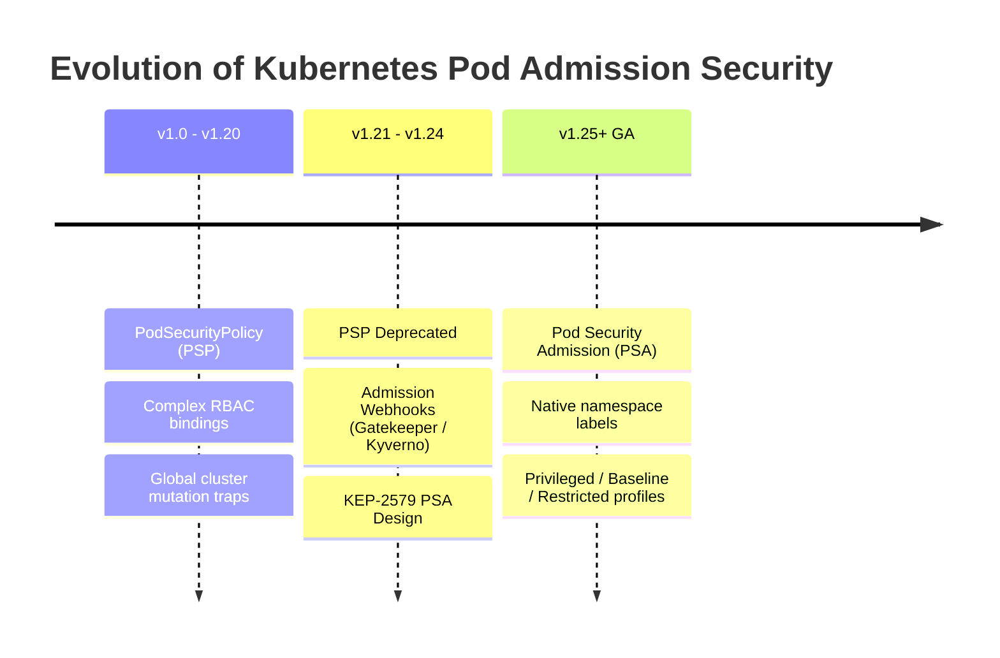
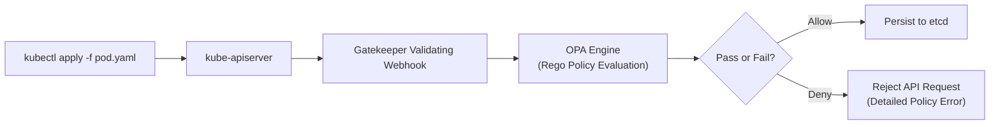

# Module 0-7-2: Pod Security Standards, SecurityContexts & Admission

**Breadcrumbs:** [[0-Index - Kubernetes|🏠 Kubernetes Reference MOC]] > **Module 0-7-2**

---

## 8. Image Security

To pull images from private registries (like Docker Hub, Quay, or Azure Container Registry), the cluster requires credentials.

### 8.1 Creating a Docker Registry Secret
Create a secret containing your private registry credentials:
```bash
kubectl create secret docker-registry private-registry-cred \
  --docker-server=myprivateregistry.com:5000 \
  --docker-username=registry-user \
  --docker-password=registry-password \
  --docker-email=user@org.com
```

### 8.2 Using ImagePullSecrets in a Pod
Reference the secret in the Pod's `spec.imagePullSecrets` block:
```yaml
apiVersion: v1
kind: Pod
metadata:
  name: private-app
  namespace: default
spec:
  imagePullSecrets:
  - name: private-registry-cred
  containers:
  - name: app-container
    image: myprivateregistry.com:5000/apps/secure-api:v1.2
    imagePullPolicy: IfNotPresent
```

### 8.3 Image Pull Policies
- `Always`: Always query the registry to check if the image has changed, and pull it if so. Default for tags like `:latest`.
- `IfNotPresent`: Only pull the image if it does not exist on the node's local disk.
- `Never`: Never pull the image from a registry. Use only local images.

---

## 9. SecurityContexts

SecurityContexts define privilege and access control settings for Pods and Containers. Pod-level settings apply to all containers in the Pod, while container-level settings override Pod-level settings.

### 9.1 Parameter Scope
- **Pod-level only:** `fsGroup` (volume ownership), `sysctls`.
- **Container-level only:** `capabilities`, `privileged`, `allowPrivilegeEscalation`, `readOnlyRootFilesystem`.
- **Shared (Pod or Container level):** `runAsUser`, `runAsGroup`, `runAsNonRoot`, `seLinuxOptions`.

### 9.2 Comprehensive Workload Template
```yaml
apiVersion: v1
kind: Pod
metadata:
  name: secure-web-pod
spec:
  # Pod-level security context
  securityContext:
    runAsUser: 2000
    runAsGroup: 3000
    runAsNonRoot: true # Enforces that container must run with a non-root UID
    fsGroup: 4000 # Volumes mounted will belong to GID 4000
  containers:
  - name: web-app
    image: nginx:alpine
    ports:
    - containerPort: 8080
    # Container-level security context (overrides pod level where conflicting)
    securityContext:
      runAsUser: 2001
      allowPrivilegeEscalation: false # Process cannot gain more privileges than parent
      readOnlyRootFilesystem: true # Mounts the container rootfs as read-only
      capabilities:
        add: ["NET_BIND_SERVICE"] # Allows binding to privileged ports (<1024)
        drop: ["ALL"] # Drops all default Linux capabilities
```


---

### 9.3 fsGroup Volume Mechanics & Storage Types
The `fsGroup` parameter dictates the Group ID (GID) associated with mounted storage volumes. When set:
1.  **Ownership Rewrite:** Kubernetes recursively alters the ownership (GID) of all directories and files inside the mounted volume to match the specified `fsGroup` ID.
2.  **Supplemental Groups:** It injects that GID as a supplemental group to all container processes running in the Pod.

#### GID Selection Criteria
*   **Arbitrary Selection:** For fresh persistent storage (`emptyDir` or dynamic PVs), you can assign any high non-root GID (e.g. `2000`). This ensures that containers running as non-root (e.g., UID `1000`) can write to the volume without requiring root privileges.
*   **Explicit Matching:** If you mount legacy or external backend storage (such as NFS, SAN, or custom directories) where files have pre-established GIDs, your `fsGroup` must be configured to match the exact GID required by the storage controller (e.g. `5000`).

#### Volume Type Behaviors
*   **`emptyDir`:** Works flawlessly. Because the directory is provisioned on the fly, Kubernetes has full control and applies the GID mapping instantly.
*   **Persistent Volumes (Network Storage):** Works, but recursive `chown` on mount can cause long startup delays if the volume contains millions of small files. (Mitigated using `fsGroupChangePolicy: OnRootMismatch`).
*   **`hostPath`:** **Ignores `fsGroup`.** Directories mounted from the host node filesystem maintain their host permissions. If a `hostPath` is owned by host root (`0700` or `0750`), a non-root container will hit a `Permission Denied` error, and `fsGroup` cannot override it.

---

### 9.4 Kernel Tuning via sysctls
The `sysctls` setting allows you to configure Linux kernel parameters at runtime on a per-Pod basis (e.g. tuning TCP parameters or IPC network settings).

#### Safe vs. Unsafe sysctls
*   **Safe sysctls:** (e.g., `net.ipv4.tcp_syncookies`). These parameters are fully isolated by Linux namespaces. Changing them inside a Pod network/IPC namespace does not affect the host node or other Pods.
*   **Unsafe sysctls:** (e.g., `net.core.somaxconn`). These parameters are global and lack namespace isolation. Changing them would modify the kernel behavior for the entire host node. Consequently, Kubernetes disables unsafe `sysctls` by default (enabling them requires administrator reconfiguration of the Kubelet).

#### Contrast: sysctls vs. Linux Capabilities
*   **Linux Capabilities:** Concern **permissions**. They partition root privileges into distinct operational rights (e.g., `CAP_NET_BIND_SERVICE` allows binding ports < 1024; `CAP_SYS_ADMIN` allows administrative mounting).
*   **sysctls:** Concern **kernel tuning**. They alter the actual operational thresholds, networks, or process rules of the Linux kernel itself.

---

### 9.5 Deep Dive: Bind Mounts, Symlinks, and Inode Permissions
Understanding how containers bridge node filesystems to namespaces requires analyzing classical Linux file link mechanisms:

#### 1. Linux Bind Mounts (How hostPath Works)
When a container runtime mounts a `hostPath` volume, it performs a **Linux bind mount**. Unlike a standard disk mount, a bind mount takes an existing directory tree on the host node and mounts it as an alias at a different path inside the container's private namespace.
*   **Shared Inode Mechanics:** Linux files are tracked by numeric **inodes** containing file metadata (owner UID, group GID, permissions). Paths are simply human-readable links pointing to these inodes. A bind mount shares the original directory's inodes.
*   **Instant Propagation:** Any permissions change (e.g., `chmod`, `chown`) or file creations performed at either the host path or the container mount path alter the underlying inode directly and propagate instantly to both locations.
*   **The Security Risk:** Because permission alterations write directly to the host's inodes, allowing a root-capable container to write to a `hostPath` represents a critical security risk. To secure this, always set `readOnly: true` in the container's `volumeMounts` specification.

#### 2. Bind Mounts vs. Soft Links (Symlinks)
While both allow accessing a file through multiple directories, their underlying mechanics are different:
*   **Soft Link (Symlink):** A physical shortcut file containing a text string pointing to another file's path. If a symlink pointing to a host path (e.g., `/secure/data/app`) is mounted into a container, **it breaks**. The container attempts to resolve the path inside its own isolated root namespace, failing to find the host file.
*   **Bind Mount:** Managed by the Linux Virtual File System (VFS) in kernel RAM. It projects the actual inodes directly into the container namespace, bypassing path isolation entirely.

#### 3. Linux Soft Link Permission Mechanics
*   **Fake Permissions:** Symlinks always display open permissions (`lrwxrwxrwx`). This metadata is ignored. The kernel evaluates access permissions strictly against the **target file's inode**.
*   **Directory Permissions Control Deletion:** Deleting or renaming a symlink does not check target file permissions. Because a symlink is simply an entry in its parent directory's file list, you only need `write` and `execute` permissions on the **parent directory containing the symlink** to delete it.

#### 4. Practical Symlink Deletion Examples
*   **Example A: Deleting a symlink pointing to a restricted file:**
    If a standard user (`dev-user`) has a symlink at `/home/dev-user/links/my-shortcut` pointing to a root-owned private file `/etc/secret.key` (with permissions `rw-------`), `dev-user` **can successfully delete** the symlink file itself using `rm`. This is because `dev-user` possesses write permissions on the directory `/home/dev-user/links/`. The target file `/etc/secret.key` is unaffected.
*   **Example B: Failing to delete a symlink pointing to your own file:**
    If a standard user (`dev-user`) owns a script at `/home/dev-user/script.sh` but a symlink pointing to it resides in `/opt/system-links/` (which is read-only for standard users), `dev-user` **cannot delete** the symlink. The kernel blocks the removal because `dev-user` lacks write permissions on `/opt/system-links/`, despite owning the target script itself.

---


## 12. Pod Security Admission (PSA) and Standards

Pod Security Admission (PSA) is the built-in admission controller that replaces the deprecated PodSecurityPolicy (PSP) to enforce the **Pod Security Standards (PSS)** at the namespace level.

### 12.1 Pod Security Standards (PSS) Levels
1. **`privileged`:** Unrestricted policy. Allows container processes to run as root, execute host-level sysctls, map host hostpaths, and bypass isolation boundaries.
2. **`baseline`:** Default/standard profile. Prevents known privilege escalations. Restricts host network/PID access, block hostpath volume mounts, but permits standard root execution.
3. **`restricted`:** Hardened profile. Enforces strict hardening guidelines:
   * Requires `runAsNonRoot: true`.
   * Requires dropping all capabilities and adding only `NET_BIND_SERVICE` if needed.
   * Restricts volume types (blocks hostpath, permits configmaps/secrets/projected).
   * Restricts ports (<1024 blocked without explicit capability).

### 12.2 PSA Modes of Admission Control
* **`enforce`:** Blocks Pod creation if it violates the target PSS level.
* **`warn`:** Permits Pod creation but returns a user-facing warning header to the client (e.g., during `kubectl apply`).
* **`audit`:** Permits Pod creation but records an audit event in the API audit log.

### 12.3 Applying PSA Namespace Labels
Configure PSA behavior by applying labels to a namespace:
```yaml
apiVersion: v1
kind: Namespace
metadata:
  name: secure-namespace
  labels:
    pod-security.kubernetes.io/enforce: restricted
    pod-security.kubernetes.io/enforce-version: v1.30
    pod-security.kubernetes.io/warn: baseline
    pod-security.kubernetes.io/warn-version: latest
```

> [!CAUTION]
> **Namespace Label Escalation Risk:** Any user with permission to `patch` or `update` Namespace resources (e.g. via a namespaced RoleBinding) can modify these labels. This creates a severe privilege escalation risk, as a user could downgrade a namespace's PSA level from `restricted` to `privileged` to deploy an insecure root Pod. Restrict Namespace label permissions strictly.

---

## 13. Hardening Guide: Dynamic Resource Allocation (DRA) Security

Dynamic Resource Allocation (DRA) (Beta in v1.36) provides advanced scheduling and allocation mechanisms for hardware accelerators (GPUs, ASICs). Because DRA drivers write resource allocation metadata back to the API, secure authorization is required.

### 13.1 Synthetic Subresources
DRA status updates do not modify the main claim object directly; instead, they target synthetic subresources to enforce least-privilege:
1. **`resourceclaims/binding`:** Required to modify `status.allocation` and `status.reservedFor`. Usually granted strictly to the `kube-scheduler` and custom allocation controllers.
2. **`resourceclaims/driver`:** Required to modify `status.devices`. Restricts drivers from tampering with claims managed by other drivers.

### 13.2 Node-Aware Verbs
When configuring RBAC for DRA drivers, use node-aware verbs:
* **`associated-node:<verb>`:** Used for node-local drivers (e.g. GPU agent running on a worker node). The API server verifies node association before validating the request.
* **`arbitrary-node:<verb>`:** Granted only to control-plane or cluster-wide multi-node controllers.

---

## 14. Kubernetes Security Checklist

Ensure a basic security baseline for control planes, hosts, and applications:

### A. Authentication & Authorization
* [ ] Disable basic auth (`--basic-auth-file`) and static tokens (`--token-auth-file`).
* [ ] Enforce mTLS for all control plane communication (APIServer, ETCD).
* [ ] Restrict `system:masters` group assignment (acts as superuser, bypassing RBAC).
* [ ] Periodically audit cluster-level RoleBindings and ClusterRoleBindings.

### B. Host & Network Security
* [ ] Apply a default-deny-all Ingress and Egress `NetworkPolicy` to namespaces.
* [ ] Restrict direct host network access to `kube-apiserver` (port 6443) and `etcd` (ports 2379/2380).
* [ ] Configure worker hosts to use the `systemd` cgroup driver for resource tracking.

### C. Pod & Container hardening
* [ ] Apply `readOnlyRootFilesystem: true` to prevent containers from writing to host directories.
* [ ] Set `runAsNonRoot: true` and define non-root `runAsUser` values.
* [ ] Drop `ALL` Linux capabilities, explicitly adding only what's required.
* [ ] Scan container images for vulnerabilities, pin specific image digests, and pull only from verified registries.
* [ ] Run untrusted workloads inside isolated environments using sandboxed runtimes (e.g. gVisor, Kata Containers) via `RuntimeClass`.

---

## 🛠️ Practical Proof of Concept (PoC): Network Security & RBAC Hardening Lab

### Target Scenario
We will build a secure multi-tenant namespace, deploy database and web frontend workloads, apply a default-deny-ingress network policy, configure custom ingress rules to permit traffic only from the web tier, and verify access. Additionally, we will construct a least-privilege RBAC role for testing namespace access.

### Step-by-Step Guided Steps

1. **Verify or Provision Cluster**:
   Ensure you have a running cluster (e.g., using `kind`):
   ```bash
   kind create cluster --name cka-security-poc
   ```

2. **Setup Isolated Namespaces and Workloads**:
   - Create a dedicated namespace:
     ```bash
     kubectl create namespace secure-apps
     ```
   - Deploy Nginx representational workloads representing the Web tier and Database tier:
     ```bash
     # Web Tier Pod
     kubectl run web-tier -n secure-apps --labels="role=web" --image=nginx:alpine --port=80
     # Database Tier Pod (running an Nginx server listening on port 80 to verify connectivity)
     kubectl run db-tier -n secure-apps --labels="role=db" --image=nginx:alpine --port=80
     # Untrusted External Pod
     kubectl run external-tier -n secure-apps --labels="role=external" --image=nginx:alpine --port=80
     ```

3. **Establish Default-Deny-Ingress Policy**:
   - Apply a default-deny-ingress network policy to isolate the database:
     ```yaml
     cat <<EOF > db-default-deny.yaml
     apiVersion: networking.k8s.io/v1
     kind: NetworkPolicy
     metadata:
       name: db-default-deny
       namespace: secure-apps
     spec:
       podSelector:
         matchLabels:
           role: db
       policyTypes:
       - Ingress
     EOF
     kubectl apply -f db-default-deny.yaml
     ```
   - Verify network isolation. Execute a connection check from both the Web pod and the External pod:
     ```bash
     # Check from external-tier (expected to time out / fail)
     kubectl exec -n secure-apps external-tier -- curl --connect-timeout 3 http://db-tier
     
     # Check from web-tier (expected to time out / fail)
     kubectl exec -n secure-apps web-tier -- curl --connect-timeout 3 http://db-tier
     ```
     Observe that both connection attempts fail, confirming the database pod is successfully isolated.

4. **Allow Specific Ingress from Web Tier**:
   - Apply an ingress allowance policy targeting the database pod:
     ```yaml
     cat <<EOF > db-allow-web.yaml
     apiVersion: networking.k8s.io/v1
     kind: NetworkPolicy
     metadata:
       name: db-allow-web
       namespace: secure-apps
     spec:
       podSelector:
         matchLabels:
           role: db
       policyTypes:
       - Ingress
       ingress:
       - from:
         - podSelector:
             matchLabels:
               role: web
         ports:
         - protocol: TCP
           port: 80
     EOF
     kubectl apply -f db-allow-web.yaml
     ```
   - Verify network connectivity:
     ```bash
     # Check from web-tier (expected to SUCCEED and return Nginx index HTML)
     kubectl exec -n secure-apps web-tier -- curl --connect-timeout 3 http://db-tier
     
     # Check from external-tier (expected to FAIL and time out)
     kubectl exec -n secure-apps external-tier -- curl --connect-timeout 3 http://db-tier
     ```
     Confirm that the Web pod can connect to the Database pod while the External pod is still blocked.

5. **Deploy and Audit Least-Privilege RBAC Controls**:
   - Create a ServiceAccount inside the namespace:
     ```bash
     kubectl create serviceaccount web-auditor -n secure-apps
     ```
   - Create a Role allowing read-only access to Pods only:
     ```yaml
     cat <<EOF > auditor-role.yaml
     apiVersion: rbac.authorization.k8s.io/v1
     kind: Role
     metadata:
       name: pod-auditor
       namespace: secure-apps
     rules:
     - apiGroups: [""]
       resources: ["pods"]
       verbs: ["get", "list"]
     EOF
     kubectl apply -f auditor-role.yaml
     ```
   - Bind the ServiceAccount to the Role:
     ```yaml
     cat <<EOF > auditor-binding.yaml
     apiVersion: rbac.authorization.k8s.io/v1
     kind: RoleBinding
     metadata:
       name: audit-pods
       namespace: secure-apps
     subjects:
     - kind: ServiceAccount
       name: web-auditor
       namespace: secure-apps
     roleRef:
       kind: Role
       name: pod-auditor
       apiGroup: rbac.authorization.k8s.io
     EOF
     kubectl apply -f auditor-binding.yaml
     ```
   - Validate permissions as the ServiceAccount using `can-i`:
     ```bash
     # Can the auditor list pods? (Expected: yes)
     kubectl auth can-i list pods --as=system:serviceaccount:secure-apps:web-auditor -n secure-apps
     
     # Can the auditor delete pods? (Expected: no)
     kubectl auth can-i delete pods --as=system:serviceaccount:secure-apps:web-auditor -n secure-apps
     
     # Can the auditor read services? (Expected: no)
     kubectl auth can-i get services --as=system:serviceaccount:secure-apps:web-auditor -n secure-apps
     ```

6. **Clean Up**:
   ```bash
   kubectl delete namespace secure-apps
   rm -f db-default-deny.yaml db-allow-web.yaml auditor-role.yaml auditor-binding.yaml
   ```
```

---

## 5. 🌉 Evolutionary Conceptual Bridging: PSP to PSA Migration



### 5.1 The Architectural Failures of Legacy PodSecurityPolicy (PSP)
* **Coupling to RBAC:** In legacy clusters, PSPs were bound to Users or ServiceAccounts via ClusterRoleBindings. Because admission mutation occurred during pod creation, determining *which* PSP applied to an indirectly deployed pod (via a Deployment or ReplicaSet controller) was notoriously difficult to trace and predict.
* **Lack of Dry-Run / Audit:** PSP operated strictly in fail-close mode; administrators could not easily test policies against live workloads without risking breaking existing deployments.
* **Mutation Traps:** PSPs silently mutated pod specifications behind the scenes, creating drift between committed Git manifests and runtime state.

### 5.2 The Modern Pod Security Admission (PSA) Architecture
* **Decoupled from RBAC:** Enforced via declarative namespace labels (`pod-security.kubernetes.io/<mode>=<profile>`).
* **Tri-Mode Operational Enforcement:**
  * `enforce`: Blocks offending pods from being scheduled.
  * `audit`: Allows the pod but records a violation in the audit logs.
  * `warn`: Allows the pod but returns an interactive warning string to `kubectl`.
* **Standard Profiles:** Fixed, vendor-neutral specifications maintained by the CNCF:
  * `privileged`: Completely unconstrained; open for CNI daemons, storage drivers.
  * `baseline`: Prevents known privilege escalations with minimal friction.
  * `restricted`: Hardened enterprise standard (requires non-root, read-only rootfs, dropped capabilities, and seccomp default).

### 5.3 Open Policy Agent (OPA) & Gatekeeper Architecture
While PSA enforces fixed, standardized pod security profiles, complex business policies (e.g., enforcing image registry whitelists, mandating billing labels, or capping replica counts) require programmable admission engines like **OPA Gatekeeper**:



* **ConstraintTemplate:** Defines the parameterized declarative schema and the underlying **Rego** evaluation logic:
  ```yaml
  apiVersion: templates.gatekeeper.sh/v1
  kind: ConstraintTemplate
  metadata:
    name: k8srequiredlabels
  spec:
    crd:
      spec:
        names:
          kind: K8sRequiredLabels
        validation:
          openAPIV3Schema:
            properties:
              labels:
                type: array
                items:
                  type: string
    targets:
      - target: admission.k8s.gatekeeper.sh
        rego: |
          package k8srequiredlabels
          violation[{"msg": msg}] {
            provided := {label | input.review.object.metadata.labels[label]}
            required := {label | label := input.parameters.labels[_]}
            missing := required - provided
            count(missing) > 0
            msg := sprintf("Resource is missing required labels: %v", [missing])
          }
  ```
* **Constraint:** Instantiates the template, binding target namespaces or resource kinds:
  ```yaml
  apiVersion: constraints.gatekeeper.sh/v1beta1
  kind: K8sRequiredLabels
  metadata:
    name: require-team-label
  spec:
    match:
      kinds:
        - apiGroups: [""]
          kinds: ["Namespace"]
    parameters:
      labels: ["team", "environment"]
  ```

### 5.4 Multi-Tenancy & Isolation Models
Kubernetes provides primitives to implement both **Soft Multi-Tenancy** (internal trusted teams) and **Hard Multi-Tenancy** (untrusted third-party workloads):

* **Namespace-Level Isolation:** Combines RBAC RoleBindings, NetworkPolicies (default deny ingress/egress), ResourceQuotas (CPU/memory limits), and LimitRanges.
* **Node-Level Isolation via Dedicated Node Pools:**
  * Prevent general pods from scheduling on tenant nodes using **Taints**:
    ```bash
    kubectl taint nodes node-tenant-a dedicated=tenant-a:NoSchedule
    ```
  * Force tenant pods onto dedicated nodes using **Tolerations** and **NodeAffinity**:
    ```yaml
    tolerations:
      - key: "dedicated"
        operator: "Equal"
        value: "tenant-a"
        effect: "NoSchedule"
    affinity:
      nodeAffinity:
        requiredDuringSchedulingIgnoredDuringExecution:
          nodeSelectorTerms:
            - matchExpressions:
                - key: dedicated
                  operator: In
                  values: ["tenant-a"]
    ```

---

<!-- Documentation References -->
[Kubernetes Pod Security Standards](https://kubernetes.io/docs/concepts/security/pod-security-standards/)
[Kubernetes Pod Security Policy](https://kubernetes.io/docs/concepts/policy/pod-security-policy/)
[Kubernetes Security Overview](https://kubernetes.io/docs/concepts/security/overview/)
[What is Kubernetes](https://kubernetes.io/docs/concepts/overview/what-is-kubernetes/)
[Storage Concepts](https://kubernetes.io/docs/concepts/storage/_print)
[Open Policy Agent Gatekeeper](https://open-policy-agent.github.io/gatekeeper/website/docs/)
[KodeKloud CKS: OPA in Kubernetes](https://notes.kodekloud.com/docs/Certified-Kubernetes-Security-Specialist-CKS/Minimize-Microservice-Vulnerabilities/OPA-in-Kubernetes/page)
[KodeKloud CKS: Multi Tenancy in Kubernetes](https://notes.kodekloud.com/docs/Certified-Kubernetes-Security-Specialist-CKS/Minimize-Microservice-Vulnerabilities/Overview-of-Multi-Tenancy-in-Kubernetes/page)


