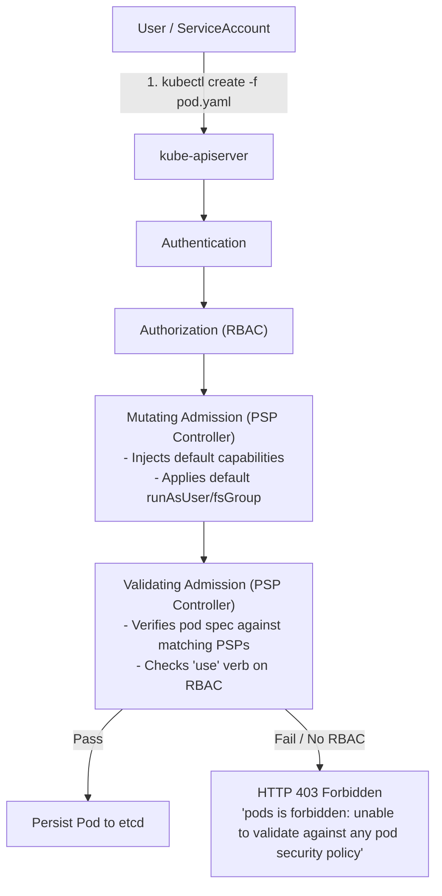
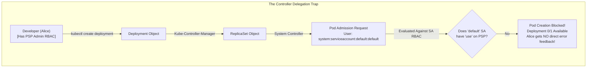
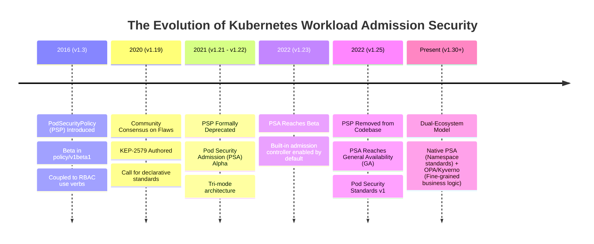
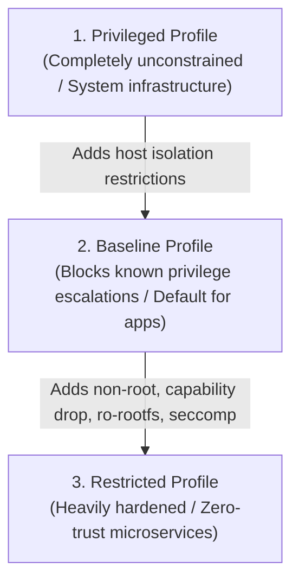
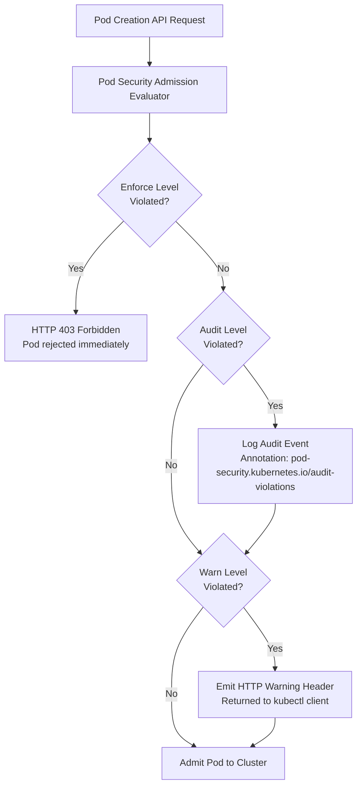
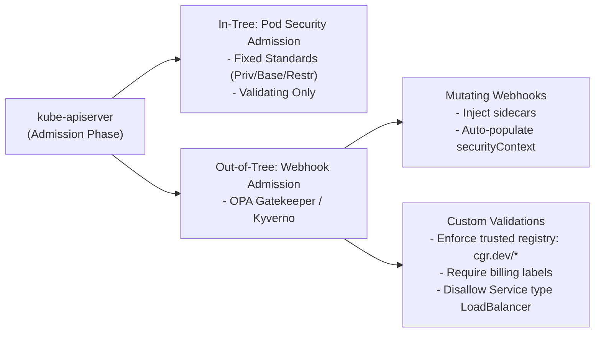

# Module 0-7-2: Pod Security Standards, Pod Security Policies (PSP) & Admission (PSA)

**Breadcrumbs:** [[0-Index - Kubernetes|🏠 Kubernetes Reference MOC]] > [[0-Index - CKS|🛡️ CKS Reference MOC]] > **Module 0-7-2**

---

## 1. 🛡️ Foundations of Workload Security & SecurityContexts

In containerized environments, a container process runs as a standard Linux process isolated by kernel namespaces (`pid`, `net`, `mnt`, `ipc`, `uts`, `user`) and constrained by `cgroups`. By default, unless configured otherwise, a container process executing as root (UID 0) inside the container matches root privileges (UID 0) on the underlying host node if it escapes container containment.

### 1.1 Parameter Scope: Pod-Level vs. Container-Level
SecurityContexts define privilege, capability, and access control settings for Pods and Containers:

| Scope | Parameters Supported | Behavior / Override Rule |
| :--- | :--- | :--- |
| **Pod-Level Only** | `fsGroup`, `fsGroupChangePolicy`, `sysctls`, `supplementalGroups` | Applies across all containers, init containers, and ephemeral containers in the Pod. |
| **Container-Level Only** | `capabilities` (`add`/`drop`), `privileged`, `allowPrivilegeEscalation`, `readOnlyRootFilesystem`, `procMount` | Specific to the individual container process. Overrides Pod-level defaults where applicable. |
| **Shared (Pod or Container)** | `runAsUser`, `runAsGroup`, `runAsNonRoot`, `seLinuxOptions`, `seccompProfile`, `windowsOptions` | If defined at both levels, the **Container-level configuration takes precedence**. |

### 1.2 Comprehensive Hardened Workload Template
```yaml
apiVersion: v1
kind: Pod
metadata:
  name: hardened-microservice
  namespace: secure-workloads
spec:
  # Pod-level security context (inherited by all containers)
  securityContext:
    runAsUser: 10001
    runAsGroup: 10001
    runAsNonRoot: true          # Enforces that container runtime verifies UID != 0
    fsGroup: 20001             # Volumes mounted will be recursively owned by GID 20001
    fsGroupChangePolicy: "OnRootMismatch" # Avoids recursive chown lag on large volumes
    seccompProfile:
      type: RuntimeDefault     # Enforces the container runtime's default seccomp profile
  containers:
  - name: api-service
    image: cgr.dev/chainguard/nginx:latest
    ports:
    - containerPort: 8080
    # Container-level security context (overrides pod level where conflicting)
    securityContext:
      allowPrivilegeEscalation: false # Sets PR_SET_NO_NEW_PRIVS; child cannot gain more privileges
      readOnlyRootFilesystem: true    # Container rootfs is mounted read-only (prevents binary tampering)
      privileged: false               # Disallows container from bypassing kernel isolation
      capabilities:
        drop:
        - "ALL"                       # Drops all 38+ default Linux capabilities
        add:
        - "NET_BIND_SERVICE"          # Allows binding to privileged network ports (< 1024) if needed
    volumeMounts:
    - name: cache-volume
      mountPath: /tmp
  volumes:
  - name: cache-volume
    emptyDir: {}
```

> [!NOTE]
> **Precedence & Container-Level Overrides:**
> If a Pod defines `runAsUser: 1000` at the `spec.securityContext` level, but a container specifies `runAsUser: 2000` under `spec.containers[i].securityContext`, the container process runs with UID `2000`. Container-level configurations always take precedence over Pod-level defaults for shared fields.

### 1.3 `fsGroup` Volume Mechanics & Storage Types
The `fsGroup` parameter dictates the supplemental Group ID (GID) associated with mounted storage volumes:
1. **Ownership Rewrite:** When the volume is mounted, the Kubelet recursively alters the ownership (GID) of all directories and files inside the volume to match the specified `fsGroup`.
2. **Supplemental Groups:** The Kubelet injects that GID as a supplemental group to the container process. This ensures that non-root containers (e.g. UID 10001) can read and write to the volume without requiring root permissions.
   * **GID Selection Criteria:**
     * *Arbitrary Selection:* For fresh dynamic storage (`emptyDir` or newly provisioned CSI block PVs), you can select an arbitrary unused GID (e.g., `20001` or `10000`).
     * *Existing Shared Storage:* For pre-existing network storage (e.g., NFS shares or multi-tenant SAN exports) with pre-allocated file permissions, the `fsGroup` GID must strictly match the pre-configured group ID on the storage server to maintain access.
3. **Volume Type Behaviors:**
   - `emptyDir`: Handled dynamically by the Kubelet in RAM/disk; GID ownership is applied instantly.
   - **Persistent Volumes (NFS / SAN / Cloud Block):** Recursive `chown` during Pod mount can cause significant startup delays if the volume contains millions of files. Mitigated using:
     ```yaml
     securityContext:
       fsGroup: 20001
       fsGroupChangePolicy: "OnRootMismatch" # Only chowns if permissions at volume root differ
     ```
   - **`hostPath` Volumes:** **`fsGroup` is ignored.** Host directories mounted into a container retain their host-level permissions. If a host directory is owned by `root:root` with `0700`, a container running as non-root will encounter `EACCES: Permission Denied`, and `fsGroup` cannot resolve this.

### 1.4 Kernel Tuning via `sysctls`
Linux kernel tuning can be applied on a per-pod basis:
* **Safe `sysctls`:** Fully namespaced by the Linux kernel (e.g., `net.ipv4.tcp_syncookies`, `net.ipv4.ip_local_port_range`). Changing them inside a Pod network/IPC namespace does not affect the host node or peer Pods.
* **Unsafe `sysctls`:** Global to the host node (e.g., `net.core.somaxconn`, `fs.file-max`). Modifying them impacts all workloads on the node. Kubernetes disables unsafe sysctls by default; enabling them requires passing `--allowed-unsafe-sysctls` to the worker node Kubelet.

#### Contrast: `sysctls` vs. Linux Capabilities
* **`sysctls`:** Modify live kernel configuration variables and network stack parameters (e.g. `/proc/sys/net/ipv4/*`) at runtime.
* **Linux Capabilities:** Partition monolithic `root` privilege into granular permission units (e.g. `CAP_NET_BIND_SERVICE`, `CAP_SYS_ADMIN`), controlling which system calls a thread or binary can execute.

### 1.5 Deep Dive: Linux Bind Mounts, Symlinks, and Inode Permissions (`hostPath` Security Mechanics)
Understanding how containers bridge node filesystems to private namespaces requires analyzing classical Linux file link mechanisms:

#### 1. Linux Bind Mounts (How `hostPath` Works)
When a container runtime mounts a `hostPath` volume, it performs a **Linux bind mount**. Unlike a standard disk mount, a bind mount takes an existing directory tree on the host node and mounts it as an alias at a different path inside the container's private mount namespace (`mnt`).
* **Shared Inode Mechanics:** Linux files are tracked by numeric **inodes** containing file metadata (owner UID, group GID, permissions mode). Directory entries and paths are simply human-readable links pointing to these inodes. A bind mount shares the original directory's underlying inodes directly.
* **Instant Permission Propagation:** Any permissions change (e.g., `chmod`, `chown`) or file creation performed at either the host path or the container mount path alters the underlying inode directly and propagates instantly to both environments.
* **The Security Risk:** Because permission alterations write directly to the host's inodes, allowing a root-capable container to write to a `hostPath` represents a critical node compromise risk. To mitigate this, always enforce `readOnly: true` in the container's `volumeMounts` specification.

#### 2. Bind Mounts vs. Soft Links (Symlinks)
While both allow accessing a file through multiple directories, their underlying kernel mechanics differ fundamentally:
* **Soft Link (Symlink):** A physical shortcut file containing a text string pointing to another file's path. If a symlink pointing to a host path (e.g., `/secure/data/app`) is mounted into a container, **it breaks**. The container attempts to resolve the path inside its own isolated root filesystem, failing to find the host file.
* **Bind Mount:** Managed by the Linux Virtual File System (VFS) in kernel RAM. It projects the actual inodes directly into the container namespace, bypassing container root path isolation entirely.

#### 3. Linux Soft Link Permission Mechanics
* **Fake Permissions:** Symlinks always display open permissions (`lrwxrwxrwx`). This metadata is ignored by the kernel. Access permissions are evaluated strictly against the **target file's inode**.
* **Directory Permissions Control Deletion:** Deleting or renaming a symlink does not check target file permissions. Because a symlink is simply a text entry in its parent directory's file list, you only need `write` and `execute` (`wx`) permissions on the **parent directory containing the symlink** to delete it.

#### 4. Practical Symlink Deletion Scenarios
* **Scenario A: Deleting a symlink pointing to a restricted file:**
  If a standard user (`dev-user`) has a symlink at `/home/dev-user/links/my-shortcut` pointing to a root-owned private file `/etc/secret.key` (with permissions `rw-------`), `dev-user` **can successfully delete** the symlink file itself using `rm`. This is because `dev-user` possesses write permissions on the directory `/home/dev-user/links/`. The target file `/etc/secret.key` remains intact.
* **Scenario B: Failing to delete a symlink pointing to your own file:**
  If a standard user (`dev-user`) owns a script at `/home/dev-user/script.sh` but a symlink pointing to it resides in `/opt/system-links/` (which is read-only for standard users), `dev-user` **cannot delete** the symlink. The kernel blocks the removal because `dev-user` lacks write permissions on `/opt/system-links/`, despite owning the target script itself.

---

## 2. 🏛️ Historical Architecture: Pod Security Policy (PSP) (v1.3 – v1.25)

Before Kubernetes 1.21, **Pod Security Policy (PSP)** was the primary native mechanism used to enforce cluster-wide pod security. While deprecated in v1.21 and completely removed in v1.25, mastering PSP architecture is fundamental for legacy cluster migrations, CKS architectural questions, and understanding why modern Pod Security Standards evolved.



### 2.1 Enabling the PSP Admission Plugin on `kube-apiserver`
PSP was not enabled by default. It functioned as an in-tree admission controller plugin that had to be explicitly declared in the static pod manifest `/etc/kubernetes/manifests/kube-apiserver.yaml`:

```yaml
spec:
  containers:
  - command:
    - kube-apiserver
    - --authorization-mode=Node,RBAC
    - --enable-admission-plugins=NodeRestriction,PodSecurityPolicy
```

> [!CAUTION]
> ### 💥 The Catastrophic PSP Lockout Trap
> If an administrator enabled `--enable-admission-plugins=PodSecurityPolicy` without **first** defining baseline PSP objects and binding them to system service accounts, **EVERY SINGLE POD CREATION REQUEST IN THE CLUSTER IMMEDIATELY FAILED**.
> This included CoreDNS pods, CNI networking daemons (Calico/Cilium), and critical control plane controllers. Once the API server restarted with the flag enabled, no new pods could be scheduled anywhere in the cluster until valid PSPs and RBAC bindings were created!

### 2.2 PodSecurityPolicy Resource Specification (`policy/v1beta1`)
A PSP is a cluster-scoped resource that defines what a Pod must or cannot do:

```yaml
apiVersion: policy/v1beta1
kind: PodSecurityPolicy
metadata:
  name: restricted-psp
spec:
  privileged: false                       # Disallow privileged containers
  allowPrivilegeEscalation: false         # Prevent no_new_privs escalation
  requiredDropCapabilities:
    - ALL                                 # Mandate dropping all capabilities
  defaultAddCapabilities:
    - NET_BIND_SERVICE                    # Auto-inject capability if omitted (MUTATION)
  volumes:
    - 'configMap'
    - 'emptyDir'
    - 'projected'
    - 'secret'
    - 'downwardAPI'
    - 'persistentVolumeClaim'             # Explicitly disallows hostPath
  hostNetwork: false                      # Block host network namespace
  hostIPC: false                          # Block host IPC namespace
  hostPID: false                          # Block host PID namespace
  runAsUser:
    rule: 'MustRunAsNonRoot'              # Container must specify non-zero UID
  seLinux:
    rule: 'RunAsAny'
  supplementalGroups:
    rule: 'MustRunAs'
    ranges:
      - min: 1000
        max: 65535
  fsGroup:
    rule: 'MustRunAs'
    ranges:
      - min: 1000
        max: 65535
  readOnlyRootFilesystem: true
```

### 2.3 How PSP RBAC Authorization Worked (The `use` Verb)
Unlike standard resources, accessing a PSP required RBAC permission on the `use` verb under the `policy` API group:

1. **Define a ClusterRole or Role:**
   ```yaml
   apiVersion: rbac.authorization.k8s.io/v1
   kind: ClusterRole
   metadata:
     name: psp-restricted-role
   rules:
   - apiGroups: ['policy']
     resources: ['podsecuritypolicies']
     resourceNames: ['restricted-psp']
     verbs: ['use']
   ```

2. **Bind the Role to the Workload's ServiceAccount:**
   ```yaml
   apiVersion: rbac.authorization.k8s.io/v1
   kind: RoleBinding
   metadata:
     name: psp-restricted-binding
     namespace: default
   subjects:
   - kind: ServiceAccount
     name: default
     namespace: default
   roleRef:
     kind: ClusterRole
     name: psp-restricted-role
     apiGroup: rbac.authorization.k8s.io
   ```

---

## 3. 🌉 The Evolutionary Bridge: Why PSP Failed & KEP-2579

### 3.1 The 4 Fatal Flaws of Legacy PodSecurityPolicy



1. **The Controller Manager Delegation Trap (The "Indirect Creation" Problem):**
   When a developer creates a Deployment, the developer does not directly create the Pod. Instead, the `kube-controller-manager` creates a ReplicaSet, which generates the Pod creation API request. The request arrives at the API server with the identity of the **Pod's ServiceAccount**, not the developer! If the ServiceAccount lacked RBAC `use` permission on the PSP, pod creation silently failed inside the ReplicaSet status, confusing operators.
2. **Non-Deterministic Mutation & Ordering Traps:**
   PSPs had both *mutating* and *validating* capabilities (e.g. injecting default capabilities or securityContexts). If a user or ServiceAccount had access to multiple matching PSPs, the API server sorted the PSPs **alphabetically by name** and applied the first one that mutated successfully. This meant renaming a policy (e.g., `01-permissive` vs `99-restricted`) would completely change cluster admission behavior!
3. **Mutation-in-Flight & GitOps Drift:**
   Because PSP silently injected values into Pod specs during admission, the actual manifest running in `etcd` no longer matched the declarative YAML checked into Git, breaking GitOps pipelines.
4. **No Dry-Run or Warning Modes:**
   PSP operated strictly as an all-or-nothing gating mechanism. Administrators could not deploy a policy in "warn" or "audit" mode to measure workload impact before enforcing it.

### 3.2 Evolutionary Timeline: From PSP to PSA & Gatekeeper



### 3.3 Architectural Comparison Matrix

| Architectural Dimension | Legacy PodSecurityPolicy (PSP) | Pod Security Standards / Admission (PSA) | OPA Gatekeeper / Kyverno |
| :--- | :--- | :--- | :--- |
| **Status** | Removed in v1.25 | **GA & Native Default (v1.25+)** | Cloud-Native Ecosystem Standard |
| **Configuration Model** | Cluster-scoped custom manifests (`policy/v1beta1`) | **Native Namespace Labels** + Cluster Config File | Custom Resource Definitions (CRDs) |
| **Identity Coupling** | Heavily coupled to RBAC (`use` verb on ServiceAccounts) | **Decoupled from RBAC** (scoped per Namespace) | Independent (evaluates raw JSON request context) |
| **Evaluation Modes** | Block or Mutate only (Fail-close) | **`enforce`, `audit`, `warn`** | Enforce (deny) or Warn / Dry-run |
| **Mutation Capabilities** | Yes (silent mutations causing drift) | **Strictly Non-Mutating (Validating Only)** | Yes (declarative mutation rules in Kyverno/Gatekeeper) |
| **Custom Policy Logic** | Limited to built-in PSP schema | Fixed to 3 standard tiers (`privileged`, `baseline`, `restricted`) | **Turing-complete / Programmable** (Rego or YAML) |
| **Operational Overhead** | Extremely High (risk of total cluster lockout) | **Zero (Built-in, pre-compiled into kube-apiserver)** | Moderate (requires running webhook controllers) |

---

## 4. 📋 Pod Security Standards (PSS) Comprehensive Specification

The Kubernetes project established the **Pod Security Standards (PSS)** as a universal, vendor-neutral specification defining three distinct security tiers:



### 4.1 The Three Security Profiles

1. **`privileged` Profile:**
   - **Scope:** Unrestricted. Workloads have absolute host-level power.
   - **Use Cases:** Control plane components, CNI daemons (Calico, Cilium), CSI storage node plugins, `kube-proxy`.
2. **`baseline` Profile:**
   - **Scope:** Minimally restrictive. Prevents known privilege escalations with minimal developer friction.
   - **Allowed:** Running as root UID (0), standard volumes.
   - **Forbidden:** Host networking, host PID/IPC, privileged containers, dangerous Linux capabilities (`CAP_SYS_ADMIN`), hostPath volume mounts.
3. **`restricted` Profile:**
   - **Scope:** Heavily hardened. Follows modern container hardening best practices.
   - **Mandates:** Must run as non-root, must drop `ALL` capabilities (only `NET_BIND_SERVICE` allowed), must use `RuntimeDefault` seccomp, must set `allowPrivilegeEscalation: false`, strictly restricts volume types.

### 4.2 Comprehensive Profile Field Control Matrix

| Pod Specification Field | `privileged` | `baseline` | `restricted` |
| :--- | :--- | :--- | :--- |
| `spec.hostNetwork` | Allowed | **Forbidden** (`false` or omitted) | **Forbidden** (`false` or omitted) |
| `spec.hostPID` | Allowed | **Forbidden** (`false` or omitted) | **Forbidden** (`false` or omitted) |
| `spec.hostIPC` | Allowed | **Forbidden** (`false` or omitted) | **Forbidden** (`false` or omitted) |
| `spec.hostPorts` | Allowed | **Forbidden** (must be 0 or omitted) | **Forbidden** (must be 0 or omitted) |
| `securityContext.privileged` | Allowed | **Forbidden** (must be `false` or omitted) | **Forbidden** (must be `false` or omitted) |
| `securityContext.allowPrivilegeEscalation` | Allowed | Allowed (`true` or `false`) | **Must be `false`** |
| `securityContext.runAsNonRoot` | Allowed | Allowed (`true` or `false`) | **Must be `true`** |
| `securityContext.runAsUser` | Any UID allowed | Any UID allowed | **Must NOT be 0** (non-root UID) |
| `securityContext.capabilities.drop` | Not required | Not required | **Must include `ALL`** |
| `securityContext.capabilities.add` | Any capability | Restricted to safe set (e.g. `NET_BIND_SERVICE`) | **Only `NET_BIND_SERVICE` permitted** |
| `securityContext.seccompProfile.type` | Any | Any | **Must be `RuntimeDefault` or `Localhost`** |
| `spec.volumes[*].hostPath` | Allowed | **Forbidden** | **Forbidden** |
| `spec.volumes[*]` allowed types | All types | All except `hostPath` | Only: `configMap`, `csi`, `downwardAPI`, `emptyDir`, `ephemeral`, `persistentVolumeClaim`, `projected`, `secret` |
| `securityContext.procMount` | Allowed | **Must be `Default` or omitted** | **Must be `Default` or omitted** |

---

## 5. ⚙️ Pod Security Admission (PSA) Controller Architecture

Pod Security Admission (PSA) is the built-in Kubernetes admission controller that enforces the Pod Security Standards at the namespace level.

### 5.1 Verifying PSA on the Control Plane
PSA is compiled directly into `kube-apiserver` and enabled by default in Kubernetes 1.25+:

```bash
# Check enabled admission plugins on kube-apiserver:
kubectl exec -n kube-system kube-apiserver-controlplane -it -- kube-apiserver -h | grep enable-admission-plugins
```
Because PSA is an in-tree default plugin, no `--enable-admission-plugins=PodSecurity` flag is required.

### 5.2 The Three Operational Modes
PSA evaluates pod creation and update requests across three independent modes:



1. **`enforce` Mode:**
   - **Behavior:** Rejection. Any pod creation request violating the standard is blocked immediately with an HTTP 403 Forbidden response.
2. **`audit` Mode:**
   - **Behavior:** Logging. The pod is admitted, but an audit event is recorded in the Kubernetes API audit logs with the annotation:
     `pod-security.kubernetes.io/audit-violations: ...`
3. **`warn` Mode:**
   - **Behavior:** Client Alert. The pod is admitted, but an HTTP warning header is returned to the client issuing the request (visible directly in the terminal during `kubectl apply`).

### 5.3 Namespace Labeling Syntax & Version Pinning
PSA is configured per namespace using standard Kubernetes labels:

```bash
# General Label Formula:
pod-security.kubernetes.io/<mode>: <profile>
pod-security.kubernetes.io/<mode>-version: <version>
```

#### Production Namespace Manifest Example
```yaml
apiVersion: v1
kind: Namespace
metadata:
  name: financial-services
  labels:
    # 1. Enforce baseline profile based on v1.30 rules
    pod-security.kubernetes.io/enforce: baseline
    pod-security.kubernetes.io/enforce-version: v1.30
    
    # 2. Return client warnings if workloads do not meet the stricter restricted profile
    pod-security.kubernetes.io/warn: restricted
    pod-security.kubernetes.io/warn-version: latest
    
    # 3. Write audit log entries for any workload failing restricted profile
    pod-security.kubernetes.io/audit: restricted
    pod-security.kubernetes.io/audit-version: latest
```

> [!TIP]
> ### 📌 The Critical Value of Version Pinning (`enforce-version`)
> The Pod Security Standards evolve across Kubernetes releases. For example, adding new capability restrictions or seccomp requirements in a newer version could cause previously valid Pods to fail admission.
> By pinning `pod-security.kubernetes.io/enforce-version: v1.30` instead of `latest`, you guarantee that **upgrading the control plane to v1.31 or v1.32 will not break existing production deployments**.

### 5.4 Imperative CLI Labeling Commands (CKS Speed Hacks)
```bash
# Enforce restricted profile on payroll namespace
kubectl label --overwrite ns payroll pod-security.kubernetes.io/enforce=restricted

# Set baseline enforce with restricted warnings on dev namespace
kubectl label --overwrite ns dev \
  pod-security.kubernetes.io/enforce=baseline \
  pod-security.kubernetes.io/warn=restricted

# Remove PSA enforcement from a namespace
kubectl label ns dev pod-security.kubernetes.io/enforce-
```

### 5.5 Cluster-Wide Admission Configuration (`AdmissionConfiguration`)
To establish global default policies or grant exemptions across the cluster, configure an admission configuration file on `kube-apiserver`:

1. **Create the Configuration File (`/etc/kubernetes/admission/pod-security-config.yaml`):**
   ```yaml
   apiVersion: apiserver.config.k8s.io/v1
   kind: AdmissionConfiguration
   plugins:
   - name: PodSecurity
     configuration:
       apiVersion: pod-security.admission.config.k8s.io/v1
       kind: PodSecurityConfiguration
       defaults:
         enforce: "baseline"
         enforce-version: "v1.30"
         audit: "restricted"
         audit-version: "latest"
         warn: "restricted"
         warn-version: "latest"
       exemptions:
         # Exempt cluster administrators and system daemons
         usernames:
           - "system:serviceaccount:kube-system:daemon-set-controller"
           - "admin-user"
         # Exempt system namespaces
         namespaces:
           - "kube-system"
           - "kube-public"
         # Exempt sandboxed runtime classes
         runtimeClasses:
           - "gvisor"
           - "kata"
   ```

2. **Mount and Pass the File to `kube-apiserver`:**
   In `/etc/kubernetes/manifests/kube-apiserver.yaml`:
   ```yaml
   spec:
     containers:
     - command:
       - kube-apiserver
       - --admission-control-config-file=/etc/kubernetes/admission/pod-security-config.yaml
       volumeMounts:
       - name: admission-config
         mountPath: /etc/kubernetes/admission/pod-security-config.yaml
         readOnly: true
     volumes:
     - name: admission-config
       hostPath:
         path: /etc/kubernetes/admission/pod-security-config.yaml
         type: File
   ```

### 5.6 🚨 The Namespace Label Escalation Vulnerability & Prevention
Because PSA evaluates policies from Namespace labels, **any user with `patch` or `update` permissions on `namespaces` can downgrade the namespace security profile**:

```bash
# An attacker with namespace edit access executes:
kubectl label --overwrite ns secure-apps pod-security.kubernetes.io/enforce=privileged
```
Once downgraded, the attacker can deploy privileged pods, mount `/` from the host node, and take over the cluster.

#### Remediation Strategies:
1. **Strict RBAC:** Never grant standard developers `update` or `patch` permissions on `namespaces`.
2. **Admission Webhook Protection:** Deploy an OPA Gatekeeper or Kyverno rule that forbids modifying labels prefixed with `pod-security.kubernetes.io/` unless requested by `system:masters`.

---

## 6. 🌐 Dynamic Policy Engines: OPA Gatekeeper & Kyverno

While PSA provides standardized, zero-overhead pod security validation, it cannot perform custom organizational enforcement or mutation. Dynamic webhook policy engines fill this gap:



### 6.1 OPA Gatekeeper Architecture
OPA Gatekeeper decouples policy logic from Kubernetes using the **Rego** query language:
* **ConstraintTemplate:** Defines the parameterized schema and Rego validation rule.
* **Constraint:** Instantiates the template, binding it to target resources or namespaces.

```yaml
apiVersion: templates.gatekeeper.sh/v1
kind: ConstraintTemplate
metadata:
  name: k8sdisallowprivileged
spec:
  crd:
    spec:
      names:
        kind: K8sDisallowPrivileged
  targets:
    - target: admission.k8s.gatekeeper.sh
      rego: |
        package k8sdisallowprivileged
        violation[{"msg": msg}] {
          container := input.review.object.spec.containers[_]
          container.securityContext.privileged == true
          msg := sprintf("Privileged container '%v' is prohibited!", [container.name])
        }
---
apiVersion: constraints.gatekeeper.sh/v1beta1
kind: K8sDisallowPrivileged
metadata:
  name: block-privileged-containers
spec:
  match:
    kinds:
      - apiGroups: [""]
        kinds: ["Pod"]
    namespaces:
      - "dev"
      - "staging"
```

---

## 7. 🏢 Multi-Tenancy & Isolation Models

Kubernetes multi-tenancy partitions shared infrastructure across distinct teams or untrusted workloads:

### 7.1 Soft vs. Hard Multi-Tenancy
* **Soft Multi-Tenancy (Internal Teams):** Assumes benevolent tenants. Enforced via Namespaces, RBAC, NetworkPolicies, LimitRanges, ResourceQuotas, and PSA `baseline`/`restricted`.
* **Hard Multi-Tenancy (Untrusted / Multiple Customers):** Assumes zero trust. Containers share the host Linux kernel; a kernel zero-day privilege escalation compromises peer tenants. Requires:
  1. Dedicated Node Pools via Taints, Tolerations, and NodeAffinity.
  2. Sandboxed Container Runtimes (gVisor / Kata Containers via `RuntimeClass`).
  3. Virtualized Control Planes (vcluster / Capsule).

### 7.2 Dedicated Node Pool Implementation
```bash
# 1. Taint tenant worker nodes to reject standard workloads:
kubectl taint nodes node-tenant-alpha dedicated=tenant-alpha:NoSchedule
kubectl label nodes node-tenant-alpha tenant=alpha
```

Workloads targeted for Tenant Alpha must declare matching tolerations and nodeAffinity:
```yaml
apiVersion: v1
kind: Pod
metadata:
  name: tenant-alpha-app
  namespace: tenant-alpha
spec:
  tolerations:
  - key: "dedicated"
    operator: "Equal"
    value: "tenant-alpha"
    effect: "NoSchedule"
  affinity:
    nodeAffinity:
      requiredDuringSchedulingIgnoredDuringExecution:
        nodeSelectorTerms:
        - matchExpressions:
          - key: tenant
            operator: In
            values:
            - alpha
  containers:
  - name: app
    image: nginx:alpine
```

---

## 8. 🔍 Deep-Intuition Diagnostic Analyses (AARF)

### Scenario 1: Zero-Downtime Migration from Baseline to Restricted with PSA
* **The Answer:** Label the target namespace with `warn: restricted` and `audit: restricted` while keeping `enforce: baseline`. Run CI/CD deployments, review CLI warnings and audit logs for violations, remediate pod securityContexts, and finally elevate `enforce: restricted`.
* **The Assumptions:** The cluster is running Kubernetes v1.25+. Workloads are deployed via Deployments or Helm charts.
* **The Rationale (Why):** If you immediately apply `enforce: restricted` to a live namespace, existing running pods continue to run, but any subsequent rolling update, replica scaling, or node drain triggers pod recreation. The ReplicaSet controller will fail to create new pods, causing an unexpected production outage.
* **The Failure Loop (What if not):** Applying `enforce: restricted` immediately causes the ReplicaSet to emit: `FailedCreate: pods "web-7b9c9f45-x" is forbidden: violates PodSecurity "restricted:latest"`.
* **The Alternative Case:** If spinning up a brand-new greenfield namespace, set `enforce: restricted` from day one.

### Scenario 2: Emergency Recovery from PSP Lockout on Legacy Clusters
* **The Answer:** Remove `PodSecurityPolicy` from `--enable-admission-plugins` in `/etc/kubernetes/manifests/kube-apiserver.yaml` and wait for Kubelet to restart the static pod.
* **The Assumptions:** Access to the control plane master node with root/sudo privileges.
* **The Rationale (Why):** PSP evaluates pod creation at the API server admission phase. When no matching PSP or RBAC `use` binding exists, the admission plugin rejects all pods. Disabling the plugin bypasses the admission gate, allowing cluster workloads to recover while valid PSPs are authored.
* **The Failure Loop (What if not):** The cluster remains completely frozen; no pods can restart or scale.

---

## 9. 🛠️ Practical Proof of Concept (PoC): PSA Multi-Mode Enforcement Lab

### 9.1 Step 1: Provision Isolated Test Namespaces
```bash
# Create two test namespaces:
kubectl create namespace psa-enforce-lab
kubectl create namespace psa-warn-lab

# Configure psa-enforce-lab to ENFORCE restricted standard:
kubectl label ns psa-enforce-lab pod-security.kubernetes.io/enforce=restricted

# Configure psa-warn-lab to ENFORCE baseline but WARN on restricted:
kubectl label ns psa-warn-lab \
  pod-security.kubernetes.io/enforce=baseline \
  pod-security.kubernetes.io/warn=restricted
```

### 9.2 Step 2: Test Non-Compliant Pod Rejection in `enforce` Namespace
Attempt to deploy a non-compliant pod (runs as root, lacks dropped capabilities):

```bash
cat <<EOF | kubectl apply -f -
apiVersion: v1
kind: Pod
metadata:
  name: non-compliant-pod
  namespace: psa-enforce-lab
spec:
  containers:
  - name: nginx
    image: nginx:alpine
EOF
```

**Observed API Server Output (Expected Failure):**
```text
Error from server (Forbidden): error when creating "STDIN": pods "non-compliant-pod" is forbidden: 
violates PodSecurity "restricted:latest": 
allowPrivilegeEscalation != false (container "nginx" must set securityContext.allowPrivilegeEscalation=false), 
unrestricted capabilities (container "nginx" must set securityContext.capabilities.drop=["ALL"]), 
runAsNonRoot != true (pod or container "nginx" must set securityContext.runAsNonRoot=true), 
seccompProfile (pod or container "nginx" must set securityContext.seccompProfile.type to "RuntimeDefault" or "Localhost")
```

### 9.3 Step 3: Test Warning Output in `warn` Namespace
Deploy the same non-compliant pod to `psa-warn-lab`:

```bash
cat <<EOF | kubectl apply -f -
apiVersion: v1
kind: Pod
metadata:
  name: non-compliant-pod
  namespace: psa-warn-lab
spec:
  containers:
  - name: nginx
    image: nginx:alpine
EOF
```

**Observed Terminal Output (Admitted with Warnings):**
```text
Warning: would violate PodSecurity "restricted:latest": allowPrivilegeEscalation != false (...), unrestricted capabilities (...)
pod/non-compliant-pod created
```
The pod is successfully admitted and running, while clearly notifying the operator of required hardening.

### 9.4 Step 4: Deploy Fully Compliant Restricted Workload
Deploy a pod configured to satisfy all `restricted` profile criteria:

```bash
cat <<EOF | kubectl apply -f -
apiVersion: v1
kind: Pod
metadata:
  name: compliant-restricted-pod
  namespace: psa-enforce-lab
spec:
  securityContext:
    runAsNonRoot: true
    runAsUser: 10001
    seccompProfile:
      type: RuntimeDefault
  containers:
  - name: secure-app
    image: nginx:alpine
    securityContext:
      allowPrivilegeEscalation: false
      readOnlyRootFilesystem: true
      capabilities:
        drop: ["ALL"]
    volumeMounts:
    - name: tmp
      mountPath: /tmp
    - name: cache
      mountPath: /var/cache/nginx
    - name: pid
      mountPath: /var/run
  volumes:
  - name: tmp
    emptyDir: {}
  - name: cache
    emptyDir: {}
  - name: pid
    emptyDir: {}
EOF
```

**Observed Output:**
```text
pod/compliant-restricted-pod created
```
The pod satisfies all restrictions and runs successfully in the enforced namespace.

---

## 10. ⚡ CKS Exam Speed Hacks & Rapid Troubleshooting Table

| Problem / Objective | Fastest CLI Formula / Manifest Shortcut | Diagnostic Check |
| :--- | :--- | :--- |
| **Verify PSA violation before creating pod** | `kubectl apply -f pod.yaml --dry-run=server` | Server dry-run invokes admission plugins and reports exact PSS violations without creating the pod. |
| **Enforce restricted profile on namespace** | `kubectl label --overwrite ns <name> pod-security.kubernetes.io/enforce=restricted` | `kubectl get ns <name> --show-labels` |
| **Audit restricted violations across existing namespace** | `kubectl label --overwrite ns <name> pod-security.kubernetes.io/warn=restricted` then trigger dry-run apply | Inspect terminal output for returned warning headers. |
| **Satisfy `restricted` profile minimum securityContext** | Add: `securityContext.runAsNonRoot: true`, `securityContext.seccompProfile.type: RuntimeDefault`, `containers[*].securityContext.allowPrivilegeEscalation: false`, `capabilities.drop: ["ALL"]` | Validate with `--dry-run=server`. |
| **Inspect why Deployment fails to create Pods under PSA** | `kubectl describe rs <replicaset-name>` | The ReplicaSet controller records PSA rejection errors in its `.status.conditions` and events list. |

---

## 🔗 Related & Deeper References
* Core Landing Concept: [[Main Notes/pod-security-admission|Pod Security Admission Landing Note]]
* Deeper Concept: [[Main Notes/pod-security-admission - Standards and Modes|PSA Standards and Modes]]
* Legacy Foundation: [[Main Notes/pod-security-policy|Pod Security Policy (Legacy PSP)]]
* Hands-on Exam Scenario: [[Projects/CKS/Practice Playbook - CKS Exam Hardening and Speed Hacks#Scenario 10: Pod Security Admission (PSA), Standards Hardening & Legacy PSP|CKS Exam Playbook - Scenario 10]]
* Upstream Reference: [Official Kubernetes Pod Security Standards](https://kubernetes.io/docs/concepts/security/pod-security-standards/)
* Upstream Reference: [Official Kubernetes Pod Security Admission](https://kubernetes.io/docs/concepts/security/pod-security-admission/)
* Upstream Reference: [Official Kubernetes Pod Security Policy](https://kubernetes.io/docs/concepts/policy/pod-security-policy/)
* Upstream Reference: [What is Kubernetes](https://kubernetes.io/docs/concepts/overview/what-is-kubernetes/)
* Upstream Reference: [Storage Concepts](https://kubernetes.io/docs/concepts/storage/_print)
