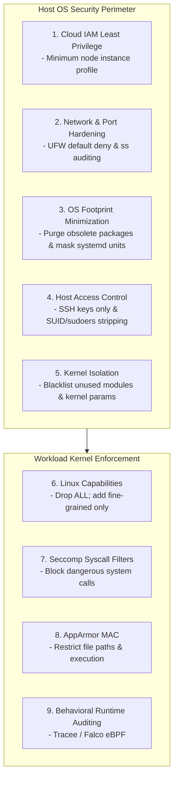
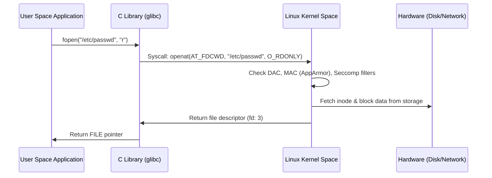

# Module 0-7-3: System Hardening Masterclass

**Breadcrumbs:** [[0-Index - Kubernetes|🏠 Kubernetes Reference MOC]] > [[0-Index - CKS|🛡️ CKS Reference MOC]] > **Module 0-7-3**

> [!ABSTRACT] 📚 Course Alignment & Module Scope
> **Course:** KodeKloud Certified Kubernetes Security Specialist (CKS)
> **Section:** System Hardening
> **Source Files:** `inflow/cks_split/03_system_hardening.md`
> **Topics Covered:** Least Privilege Principle, Minimizing Cloud IAM Roles, UFW Firewall & Network Minimization, Auditing Open Ports (`ss`), Removing Obsolete Packages/Services, Linux Privilege Escalation (SUID/SGID & Sudoers), SSH Daemon Hardening, Restricting Kernel Modules, Linux Syscalls & AquaSec Tracee, Restricting Syscalls with Seccomp, Linux Capabilities Deconstruction, and AppArmor Mandatory Access Control (MAC).

---

## 🧭 Table of Contents
1. [System Hardening Overview & Least Privilege Philosophy](#1--system-hardening-overview--least-privilege-philosophy)
2. [Minimizing Cloud IAM Roles & Node Permissions](#2--minimizing-cloud-iam-roles--node-permissions)
3. [Network Minimization & UFW Firewall Hardening](#3--network-minimization--ufw-firewall-hardening)
4. [Auditing & Disabling Open Ports (`ss`)](#4--auditing--disabling-open-ports-ss)
5. [Removing Obsolete Packages, Services & Systemd Units](#5--removing-obsolete-packages-services--systemd-units)
6. [Linux Privilege Escalation Defense: SUID/SGID & Sudoers](#6--linux-privilege-escalation-defense-suidsgid--sudoers)
7. [SSH Daemon Hardening Architecture](#7--ssh-daemon-hardening-architecture)
8. [Restricting Linux Kernel Modules (`modprobe`)](#8--restricting-linux-kernel-modules-modprobe)
9. [Linux System Calls, `strace` & AquaSec Tracee (eBPF)](#9--linux-system-calls-strace--aquasec-tracee-ebpf)
10. [Restricting Syscalls with Seccomp](#10--restricting-syscalls-with-seccomp)
11. [Linux Capabilities: Deconstructing God-Mode "Root"](#11--linux-capabilities-deconstructing-god-mode-root)
12. [AppArmor Mandatory Access Control (MAC)](#12--apparmor-mandatory-access-control-mac)
13. [Deep-Intuition Diagnostic Analyses (AARF)](#13--deep-intuition-diagnostic-analyses-aarf)
14. [CKS Exam Speed Hacks & System Hardening Cheatsheet](#14--cks-exam-speed-hacks--system-hardening-cheatsheet)
15. [Course Walkthrough Navigation](#15--course-walkthrough-navigation)

---

## 1. 🛡️ System Hardening Overview & Least Privilege Philosophy

In the **4Cs of Cloud-Native Security**, the Host Operating System forms the physical foundation upon which containers and orchestrators execute. If an attacker breaches container isolation or accesses a worker node, host-level misconfigurations allow immediate privilege escalation to cluster compromise.



### 1.1 The Principle of Least Privilege
Across the entire system hierarchy:
* **Users & Nodes:** Granted only the minimum system groups and cloud permissions required.
* **Daemons & Services:** Run as unprivileged dedicated service users (e.g. `etcd`, `systemd-resolve`), never root.
* **Containers:** Denied access to host namespaces, host devices, unneeded Linux capabilities, and sensitive syscalls.

---

## 2. ☁️ Minimizing Cloud IAM Roles & Node Permissions

When Kubernetes runs on cloud infrastructure (AWS EC2, GCP Compute Engine, Azure VMs), instances inherit permissions via **Instance Profiles / Managed Identities**.

### 2.1 The Danger of Overly Permissive Node Roles
* **The Anti-Pattern:** Granting worker nodes `AdministratorAccess` or broad S3/DynamoDB/EC2 access for developer convenience.
* **The Attack Path:** Any pod compromised on that node with access to the host network or cloud metadata service (`169.254.169.254`) can harvest instance IAM credentials and take over the entire cloud account.

### 2.2 Best Practices for Node IAM
1. **Worker Nodes:** Need only minimal permissions to interact with container registries (ECR/GCR) and report status to the cloud provider.
2. **Control Plane Nodes:** Need permissions only for load balancer provisioning and cloud storage volume attachments.
3. **Workload Identity (IRSA / Workload Identity Federation):** Never grant cloud permissions to the worker node itself. Use **IAM Roles for Service Accounts (IRSA)** to bind temporary, short-lived AWS IAM roles directly to individual Kubernetes ServiceAccounts.

---

## 3. 🧱 Network Minimization & UFW Firewall Hardening

All ingress traffic to host nodes should be denied by default, opening only strictly documented Kubernetes and SSH ports.

### 3.1 Standard Kubernetes Host Ports

| Port | Protocol | Component | Role | Security Target |
| :--- | :--- | :--- | :--- | :--- |
| **6443** | TCP | Kube-APIServer | Control Plane | Whitelist master nodes and admin VPN only. |
| **2379-2380** | TCP | etcd server & peer | Control Plane | Private interface only; master nodes only. |
| **10250** | TCP | Kubelet HTTPS API | All Nodes | Control plane nodes only; disable anonymous access. |
| **10255** | TCP | Kubelet read-only | All Nodes | **Disabled** (`readOnlyPort: 0`). |
| **10257** | TCP | Kube-Controller-Manager | Control Plane | Localhost / Master node only. |
| **10259** | TCP | Kube-Scheduler | Control Plane | Localhost / Master node only. |
| **30000-32767** | TCP | NodePort Services | Worker Nodes | Exposed if public services; restrict via SG/UFW. |

### 3.2 Hardening with UFW (Uncomplicated Firewall)
```bash
# 1. Enable UFW with default-deny inbound:
ufw default deny incoming
ufw default allow outgoing

# 2. Allow SSH on administrative interface:
ufw allow from 192.168.1.0/24 to any port 22 proto tcp

# 3. Allow Kube-APIServer port from authorized admin subnet:
ufw allow from 192.168.1.0/24 to any port 6443 proto tcp

# 4. Allow flannel/calico overlay network traffic:
ufw allow 8472/udp # Flannel VXLAN
ufw allow 179/tcp  # Calico BGP

# 5. Enable and check firewall status:
ufw enable
ufw status verbose
```

---

## 4. 🔍 Auditing & Disabling Open Ports (`ss`)

A core CKS task is hunting for unauthenticated or rogue network daemons listening on cluster nodes using `ss` (Socket Statistics).

```bash
# Display all listening TCP (-t) and UDP (-u) sockets with process names (-p) and numeric ports (-n):
ss -tulpn

# Filter for external non-localhost listeners:
ss -tulpn | grep -v '127.0.0.1' | grep -v '\[::1\]'

# Identify the process and binary associated with a suspicious listening port (e.g. port 8080):
lsof -i :8080
# or:
fuser 8080/tcp
```

---

## 5. 📦 Removing Obsolete Packages, Services & Systemd Units

Reducing the attack surface requires eliminating unneeded compilers, network clients, and background services from node operating systems.

### 5.1 Auditing & Pruning Installed Packages
```bash
# Query installed packages matching obsolete or dangerous utilities (Debian/Ubuntu):
dpkg -l | grep -E 'telnet|rsh|talk|tftp|apache2|nginx|gcc|g\+\+'

# Purge packages and remove unused configuration files:
apt-get purge --auto-remove -y telnetd tftp-hpa inetutils-inetd

# Clean up apt caches:
apt-get clean && apt-get autoremove -y
```

### 5.2 Systemd Unit Hardening: Disabling vs. Masking
System administrators often disable a service using `systemctl disable <service>`, but disabled services can still be triggered via **socket activation** or invoked as dependencies by other services.
* **Disabling:** Removes symlinks from `/etc/systemd/system/`. The service will not start automatically at boot.
* **Masking:** Creates a symlink pointing the service unit file directly to `/dev/null`. The service cannot be started manually or by any other process or socket.

```bash
# Check installed unit file states:
systemctl list-unit-files --type=service | grep -E 'telnet|bluetooth|cups|avahi'

# Stop, disable, and permanently mask insecure services:
systemctl stop avahi-daemon.service avahi-daemon.socket
systemctl disable avahi-daemon.service avahi-daemon.socket
systemctl mask avahi-daemon.service avahi-daemon.socket

# Verify that the service is masked:
systemctl status avahi-daemon.service
# Expected output: Loaded: masked (Reason: Unit avahi-daemon.service is masked.)
```

---

## 6. 🔓 Linux Privilege Escalation Defense: SUID/SGID & Sudoers

### 6.1 SUID (Set User ID) & SGID (Set Group ID) Mechanics
When a binary has the SUID bit enabled (octal `4000`), it executes with the privileges of the **file owner** (typically `root`), regardless of which user invoked it.
* Attackers seek SUID binaries (`vim`, `find`, `nmap`, `bash`, `python`) to spawn root shells from unprivileged accounts.

```mermaid
flowchart LR
    User([Standard User (UID 1000)]) --> Exec["Executes /usr/bin/passwd (SUID Root)"]
    Exec --> Kernel["Kernel inspects SUID bit (4755)"]
    Kernel --> Switch["Effective UID temporarily switches to 0 (root)"]
    Switch --> FileMod["Updates /etc/shadow"]
    FileMod --> Return["Returns to UID 1000"]
```

### 6.2 Hunting & Stripping SUID Binaries
```bash
# 1. Discover all SUID binaries on the filesystem:
find / -xdev -type f -perm -4000 -exec ls -l {} + 2>/dev/null

# 2. Discover all SGID binaries (octal 2000):
find / -xdev -type f -perm -2000 -exec ls -l {} + 2>/dev/null

# 3. Strip SUID bit from unnecessary binaries (e.g. pkexec, chfn, chsh, traceroute):
chmod u-s /usr/bin/traceroute6.iputils
chmod u-s /usr/bin/chfn
chmod u-s /usr/bin/chsh

# 4. Verify that the SUID bit has been removed (rwxr-xr-x instead of rwsr-xr-x):
ls -l /usr/bin/chsh
```

### 6.3 Sudoers Policy Hardening (`/etc/sudoers`)
* Never grant blanket `ALL=(ALL:ALL) ALL` permissions to non-admin accounts.
* Restrict execution of interactive utilities (`vim`, `less`, `more`) with sudo, as they allow shell breakouts (`!/bin/bash`).
* Enforce `NOEXEC` attribute to prevent spawned sub-shells:
  ```text
  # /etc/sudoers.d/developers
  developer ALL=(ALL) NOEXEC: /usr/bin/systemctl restart my-service
  ```

---

## 7. 🔑 SSH Daemon Hardening Architecture

The SSH daemon (`sshd`) is the primary remote access mechanism. Hardening `/etc/ssh/sshd_config` prevents brute-force attacks and credential theft:

```ini
# /etc/ssh/sshd_config

# 1. Prevent direct root login:
PermitRootLogin no

# 2. Enforce cryptographic public key authentication only:
PubkeyAuthentication yes
PasswordAuthentication no
PermitEmptyPasswords no

# 3. Limit authentication attempts and session timeouts:
MaxAuthTries 3
ClientAliveInterval 300
ClientAliveCountMax 2

# 4. Disable insecure legacy forwarding features:
X11Forwarding no
AllowTcpForwarding no

# 5. Restrict allowed users:
AllowUsers sysadmin devops
```

```bash
# Test SSH configuration syntax before restarting:
sshd -t

# Restart SSH service safely:
systemctl restart sshd
```

---

## 8. 🛑 Restricting Linux Kernel Modules (`modprobe`)

The Linux kernel supports dynamic loading of kernel modules. Attackers exploit outdated, vulnerable, or esoteric filesystem and protocol modules (e.g. `dccp`, `sctp`, `cramfs`, `firewire-core`) to trigger kernel privilege escalations.

### 8.1 Blacklisting Kernel Modules
To prevent a module from loading automatically:

```bash
# 1. Inspect currently loaded kernel modules:
lsmod | grep -E 'dccp|sctp|cramfs|floppy'

# 2. Add module blacklist to /etc/modprobe.d/:
cat <<EOF > /etc/modprobe.d/cks-blacklist.conf
blacklist dccp
install dccp /bin/true

blacklist sctp
install sctp /bin/true

blacklist cramfs
install cramfs /bin/true
EOF

# 3. Unload the module if currently active in kernel memory:
modprobe -r dccp 2>/dev/null || true

# 4. Verify module cannot be loaded:
modprobe dccp
# Output: /bin/true executes; module is not loaded.
```

---

## 9. ⚡ Linux System Calls, `strace` & AquaSec Tracee (eBPF)

### 9.1 The Syscall Boundary
Applications running in **User Space** cannot directly access hardware, write to disk, or send network packets. They must issue a **System Call (Syscall)** to request services from the **Kernel Space**.



### 9.2 Tracing Syscalls with `strace`
`strace` intercepts and logs the system calls made by a process:

```bash
# 1. Run a command and observe every syscall made:
strace touch /tmp/testfile

# 2. Count and summarize syscall statistics (-c):
strace -c ls -l /var/log

# 3. Attach strace to a live running process by PID (-p):
strace -p 1234 -e trace=open,openat,read,write,connect
```

### 9.3 Runtime Syscall Auditing with AquaSec Tracee (eBPF)
AquaSec's **Tracee** uses modern Linux **eBPF (Extended Berkeley Packet Filter)** probes attached to kernel tracepoints to audit syscalls with negligible performance overhead:

```bash
# Run Tracee container to monitor suspicious syscall events in real time:
docker run --name tracee --rm -it \
  --privileged \
  -v /lib/modules:/lib/modules:ro \
  -v /usr/src:/usr/src:ro \
  -v /tmp/tracee:/tmp/tracee \
  aquasec/tracee:latest \
  --trace event=execve,security_file_open
```

---

## 10. 🚪 Restricting Syscalls with Seccomp (Secure Computing Mode)

A standard Linux kernel provides over 300+ system calls. Most containerized microservices need only 40–50. **Seccomp** acts as a sandboxing firewall, restricting the system calls a container can execute.

### 10.1 Seccomp Action Codes
* `SCMP_ACT_KILL` / `SCMP_ACT_KILL_PROCESS`: Instantly terminates the process if a forbidden syscall is invoked.
* `SCMP_ACT_ERRNO`: Denies the syscall and returns an error code (e.g. `EPERM` - Operation not permitted) without killing the container.
* `SCMP_ACT_LOG`: Permits the syscall but writes an audit warning event to `/var/log/syslog` or `journalctl`.
* `SCMP_ACT_ALLOW`: Permits the syscall without restriction.

### 10.2 Seccomp Profile Structure (`/var/lib/kubelet/seccomp/`)
Custom Seccomp profiles are stored as JSON files on worker nodes under the Kubelet Seccomp root directory: `/var/lib/kubelet/seccomp/`.

```json
{
  "defaultAction": "SCMP_ACT_ERRNO",
  "architectures": [
    "SCMP_ARCH_X86_64",
    "SCMP_ARCH_X86",
    "SCMP_ARCH_X32"
  ],
  "syscalls": [
    {
      "names": [
        "accept4",
        "epoll_create1",
        "epoll_ctl",
        "epoll_wait",
        "exit",
        "exit_group",
        "futex",
        "nanosleep",
        "read",
        "write",
        "close",
        "fstat",
        "mmap",
        "brk"
      ],
      "action": "SCMP_ACT_ALLOW"
    }
  ]
}
```

### 10.3 Enforcing Seccomp in Kubernetes Pods
Seccomp profiles are configured via `securityContext.seccompProfile`:

```yaml
apiVersion: v1
kind: Pod
metadata:
  name: secured-seccomp-pod
  namespace: default
spec:
  securityContext:
    # Option 1: Use Kubernetes container runtime default profile:
    seccompProfile:
      type: RuntimeDefault

    # Option 2: Use custom profile stored on node:
    # Profile location: /var/lib/kubelet/seccomp/profiles/fine-grained.json
    # seccompProfile:
    #   type: Localhost
    #   localhostProfile: profiles/fine-grained.json
  containers:
    - name: app
      image: nginx:alpine
```

---

## 11. 🛡️ Linux Capabilities: Deconstructing God-Mode "Root"

In classic UNIX, privileges were binary: a process was either unprivileged (UID > 0) or all-powerful root (UID = 0). Linux decomposes traditional root privileges into **~41 fine-grained Capabilities** (`CAP_*`).

### 11.1 The CKS Core Capabilities Matrix

| Linux Capability | Granted Privilege | Security Threat If Left Enabled |
| :--- | :--- | :--- |
| `CAP_SYS_ADMIN` | "God mode" equivalent; device mounting, namespaces, cgroups, eBPF. | Complete container breakout to host node. |
| `CAP_NET_ADMIN` | Modify network interfaces, iptables, IP routing tables. | Network interception, ARP spoofing, CNI disruption. |
| `CAP_NET_RAW` | Open raw sockets (e.g. `ping`, packet sniffing). | Packet forgery, internal subnet eavesdropping. |
| `CAP_SYS_TIME` | Set system real-time clock and hardware clock. | Clock tampering disrupting TLS token validation and auditing. |
| `CAP_DAC_OVERRIDE`| Bypass file read, write, and execute permission checks. | Overwrite any file in the filesystem regardless of permissions. |
| `CAP_CHOWN` | Change arbitrary file ownership (UID/GID). | Privilege escalation via owned binary modification. |

### 11.2 Auditing Capabilities on Linux
```bash
# Check capabilities of a binary:
getcap /usr/bin/ping
# Output: /usr/bin/ping cap_net_raw=ep

# Check capabilities of a running process by PID:
getpcaps <PID>

# Inspect process capability bitmask from /proc:
cat /proc/<PID>/status | grep Cap

# Decode capability hex bitmask to names:
capsh --decode=00000000a80425fb
```

### 11.3 Kubernetes Hardening: Drop ALL, Add Only Required
The fundamental CKS best practice is **dropping all capabilities** and adding back only the specific capability required:

```yaml
apiVersion: v1
kind: Pod
metadata:
  name: hardened-capabilities-pod
spec:
  containers:
    - name: web
      image: nginx:alpine
      securityContext:
        capabilities:
          drop:
            - ALL # Drop every single capability
          add:
            - NET_BIND_SERVICE # Allow binding to port 80/443 as non-root
```

---

## 12. 📁 AppArmor Mandatory Access Control (MAC)

While Discretionary Access Control (DAC) relies on file owner permissions (`chmod`), **AppArmor** enforces **Mandatory Access Control (MAC)** by binding security profiles directly to executables or container runtimes, restricting file paths, capabilities, and network calls regardless of user UID.

### 12.1 The Three AppArmor Operational Modes
1. **Enforce (`enforce`):** Applications are prevented from performing restricted actions and violation events are logged to syslog.
2. **Complain (`complain`):** Applications can perform restricted actions without interruption, but violations are logged (used for profiling).
3. **Disabled / Unconfined:** No profile is applied; standard DAC rules apply.

```bash
# Check status of loaded AppArmor profiles on a node:
aa-status

# Check if AppArmor kernel module is enabled:
cat /sys/module/apparmor/parameters/enabled
# Expected output: Y
```

### 12.2 AppArmor Profile Anatomy (`/etc/apparmor.d/`)
Profiles are text files defining path permissions (`r`=read, `w`=write, `x`=execute, `k`=lock):

```ini
# /etc/apparmor.d/k8s-deny-write
#include <tunables/global>

profile k8s-deny-write flags=(attach_disconnected) {
  #include <abstractions/base>

  # Allow read access to entire filesystem:
  /** r,

  # Deny write access to all files:
  deny /** w,

  # Deny executing any shells:
  deny /bin/sh mrpx,
  deny /bin/bash mrpx,
}
```

```bash
# Parse and load profile into kernel:
apparmor_parser -q /etc/apparmor.d/k8s-deny-write

# Reload updated profile:
apparmor_parser -r /etc/apparmor.d/k8s-deny-write

# Disable / unload profile:
apparmor_parser -R /etc/apparmor.d/k8s-deny-write
```

### 12.3 Enforcing AppArmor in Kubernetes Pods

#### Modern GA Syntax (Kubernetes v1.30+):
```yaml
apiVersion: v1
kind: Pod
metadata:
  name: secured-apparmor-pod
spec:
  securityContext:
    appArmorProfile:
      type: Localhost
      localhostProfile: k8s-deny-write # Profile name loaded in node kernel
  containers:
    - name: app
      image: busybox
      command: ["sh", "-c", "echo 'Testing write' > /tmp/test && sleep 3600"]
```

#### Legacy Annotation Syntax (Kubernetes v1.29 and earlier):
```yaml
apiVersion: v1
kind: Pod
metadata:
  name: legacy-apparmor-pod
  annotations:
    container.apparmor.security.beta.kubernetes.io/app: localhost/k8s-deny-write
spec:
  containers:
    - name: app
      image: busybox
```

---

## 13. 🔍 Deep-Intuition Diagnostic Analyses (AARF)

### Scenario 1: Pod Fails with `CreateContainerError` Due to Missing AppArmor Profile
* **The Answer:** Verify that the AppArmor profile is loaded into kernel memory **on every worker node** where the pod can be scheduled using `apparmor_parser -q /etc/apparmor.d/<profile>`.
* **The Assumptions:** The cluster has multiple worker nodes, and the profile was loaded on `node01` but omitted on `node02`.
* **The Rationale (Why):** AppArmor is a node-local Linux kernel feature. When Kubelet starts the container via containerd, it instructs the runtime to attach the requested profile name. If the node kernel does not have that profile registered, container creation aborts immediately.
* **The Failure Loop (What if not):** Pod status shows `CreateContainerError` or `CrashLoopBackOff`. `kubectl describe pod` reports `Error: failed to generate container spec: AppArmor profile "k8s-deny-write" is not loaded`.
* **The Alternative Case:** In multi-node clusters, use a DaemonSet or Ansible/Puppet to ensure custom AppArmor profile files are distributed and loaded into `/etc/apparmor.d/` across all worker nodes.

### Scenario 2: Seccomp Profile Drops Syscall Causing Pod Exit Code 159 (`SIGSYS`)
* **The Answer:** Switch the Seccomp profile default action from `SCMP_ACT_KILL` to `SCMP_ACT_LOG` during development, capture the missing syscalls in `journalctl -k` or `/var/log/audit/audit.log`, and whitelist them in the profile.
* **The Assumptions:** A new microservice binary was deployed using an aggressive custom Seccomp profile.
* **The Rationale (Why):** When a thread invokes a system call prohibited by a Seccomp filter set to `SCMP_ACT_KILL`, the Linux kernel immediately sends a `SIGSYS` signal (Signal 31) to the process, causing it to terminate without clean shutdown.
* **The Failure Loop (What if not):** Pod crashes repeatedly with exit code `159` (`128 + 31`). Container logs are empty because the process was killed at the kernel level before printing application errors.
* **The Alternative Case:** Standard workloads should use `seccompProfile.type: RuntimeDefault`, which whitelists all common POSIX syscalls while blocking dangerous ones (e.g. `reboot`, `kexec_load`, `ptrace`).

### Scenario 3: Container Root Cannot Change System Date (`date -s`)
* **The Answer:** Changing the system clock requires `CAP_SYS_TIME`. In Docker and Kubernetes, `CAP_SYS_TIME` is dropped from the default capability bounding set.
* **The Assumptions:** A developer runs a container as `root` (UID 0) and assumes root has all permissions.
* **The Rationale (Why):** Linux capabilities decompose root into granular sets. Even if a user has UID 0, if the specific capability (`CAP_SYS_TIME`) is absent from the container bounding set, the kernel returns `EPERM` (Operation not permitted) when the `settimeofday` or `clock_settime` syscall is issued.
* **The Failure Loop (What if not):** Workloads requiring time synchronization fail with `date: cannot set date: Operation not permitted`.
* **The Alternative Case:** Host time should be synchronized via host-level NTP daemons (e.g. `chrony`), never by individual application pods.

---

## 14. ⚡ CKS Exam Speed Hacks & System Hardening Cheatsheet

```bash
# 1. Audit open listening ports without DNS delay:
ss -tulpn

# 2. Check AppArmor loaded profiles:
aa-status | grep -E 'profiles|enforce'

# 3. Load an AppArmor profile immediately:
apparmor_parser -r /etc/apparmor.d/<profile-name>

# 4. Check if a Seccomp profile exists on node:
ls -l /var/lib/kubelet/seccomp/

# 5. Quick SUID binary scan:
find / -xdev -perm -4000 -type f 2>/dev/null

# 6. Check loaded kernel modules:
lsmod | grep <module-name>

# 7. Unload and blacklist kernel module:
modprobe -r <module-name> && echo "blacklist <module-name>" >> /etc/modprobe.d/blacklist.conf

# 8. Check process capabilities:
getpcaps $(pgrep <process-name>)
```

---

## 15. 🔗 Course Walkthrough Navigation

* ⬅️ **Previous Module:** [[Reference Notes/0-7-2_cluster_setup_and_hardening.md|Module 0-7-2: Cluster Setup & Hardening]]
* ➡️ **Next Module:** [[Reference Notes/0-7-4_microservice_vulnerabilities_and_isolation.md|Module 0-7-4: Microservice Vulnerabilities & Isolation]]
  *(Covers Pod Security Standards, PSA, Legacy PSP & KEP-2579, Secret Encryption at Rest, and Sandboxed Runtimes).*
* 🏠 **CKS Master Index:** [[Reference Notes/0-Index - CKS.md|🛡️ CKS Certification Reference MOC]]
* 🌐 **Official Kubernetes Documentation:** [Pod Security Standards](https://kubernetes.io/docs/concepts/security/pod-security-standards/)
