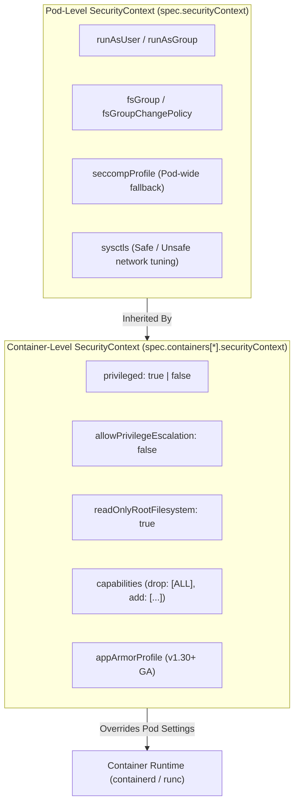
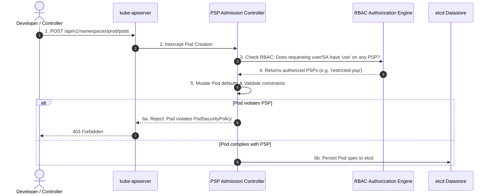
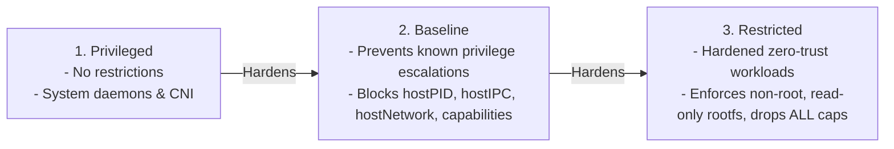
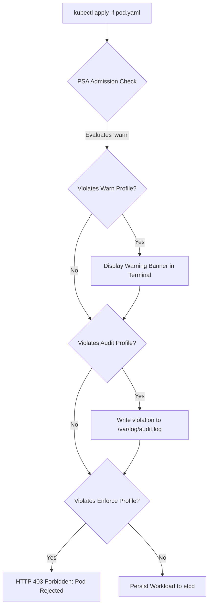
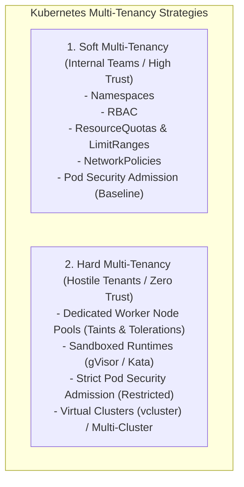

# Module 0-7-4: Microservice Vulnerabilities & Isolation Masterclass

**Breadcrumbs:** [[0-Index - Kubernetes|🏠 Kubernetes Reference MOC]] > [[0-Index - CKS|🛡️ CKS Reference MOC]] > **Module 0-7-4**

> [!ABSTRACT] 📚 Course Alignment & Module Scope
> **Course:** KodeKloud Certified Kubernetes Security Specialist (CKS)
> **Section:** Minimize Microservice Vulnerabilities
> **Source Files:** `inflow/cks_split/04_microservice_vulnerabilities_and_isolation.md`
> **Topics Covered:** Workload Security Contexts, Legacy PodSecurityPolicies (PSP), Pod Security Standards (PSS), Pod Security Admission (PSA), KEP-2579 Evolutionary Bridge, Dynamic Admission Control (OPA Gatekeeper & Kyverno), Secrets Management & Encryption at Rest (`EncryptionConfiguration`), Secrets Store CSI Driver, Container Sandboxing (gVisor & Kata Containers), Pod-to-Pod mTLS Encryption, and Multi-Tenancy Isolation Patterns.

---

## 🧭 Table of Contents
1. [Workload Security Contexts (First Principles)](#1--workload-security-contexts-first-principles)
2. [Legacy PodSecurityPolicies (PSP) Architecture](#2--legacy-podsecuritypolicies-psp-architecture)
3. [The Evolutionary Bridge: Why PSP Died & PSS/PSA Was Born](#3--the-evolutionary-bridge-why-psp-died--psspsa-was-born)
4. [Pod Security Standards (PSS) Specification](#4--pod-security-standards-pss-specification)
5. [Pod Security Admission (PSA) In-Depth Architecture](#5--pod-security-admission-psa-in-depth-architecture)
6. [Dynamic Policy Engines: OPA Gatekeeper & Kyverno](#6--dynamic-policy-engines-opa-gatekeeper--kyverno)
7. [Secrets Management & Encryption at Rest (`EncryptionConfiguration`)](#7--secrets-management--encryption-at-rest-encryptionconfiguration)
8. [Secrets Store CSI Driver & External KMS Integration](#8--secrets-store-csi-driver--external-kms-integration)
9. [Container Sandboxing: gVisor & Kata Containers](#9--container-sandboxing-gvisor--kata-containers)
10. [Pod-to-Pod Mutual TLS (mTLS) Encryption](#10--pod-to-pod-mutual-tls-mtls-encryption)
11. [Multi-Tenancy Architecture & Isolation Levels](#11--multi-tenancy-architecture--isolation-levels)
12. [Deep-Intuition Diagnostic Analyses (AARF)](#12--deep-intuition-diagnostic-analyses-aarf)
13. [CKS Exam Speed Hacks & Command Cheatsheet](#13--cks-exam-speed-hacks--command-cheatsheet)
14. [Course Walkthrough Navigation](#14--course-walkthrough-navigation)

---

## 1. ⚙️ Workload Security Contexts (First Principles)

In Kubernetes, a container is simply an isolated Linux process running inside dedicated namespaces (`mnt`, `pid`, `net`, `ipc`, `uts`, `user`) governed by cgroups. By default, unless restricted, container processes run as `root` (UID 0) and share the underlying host Linux kernel.

A `securityContext` defines privilege and access control settings for a Pod or Container.



### 1.1 Pod-Level vs. Container-Level Scope

| Field | Scope | Purpose & Enforcement |
| :--- | :--- | :--- |
| `runAsUser` | Pod & Container | Sets the POSIX User ID (UID) under which the process entrypoint executes. |
| `runAsGroup` | Pod & Container | Sets the Primary Group ID (GID) for the executing process. |
| `runAsNonRoot` | Pod & Container | Validates during startup that UID is NOT 0. If image defaults to root, container fails immediately with `CreateContainerConfigError`. |
| `fsGroup` | Pod Only | Supplemental group ID applied to volume mounts, performing a recursive ownership change (`chown/chmod`). |
| `allowPrivilegeEscalation`| Container Only | Controls whether child processes can gain more privileges than their parent via SUID bits (sets `PR_SET_NO_NEW_PRIVS`). |
| `privileged` | Container Only | Disables all kernel isolation; container receives all capabilities and access to all `/dev` host devices. |
| `readOnlyRootFilesystem` | Container Only | Mounts the container root filesystem as read-only (`EROFS`), blocking attackers from compiling exploit payloads. |
| `capabilities` | Container Only | Fine-grained addition or removal of POSIX capabilities (`drop: [ALL]`, `add: [NET_BIND_SERVICE]`). |

### 1.2 The `fsGroup` Mechanics & Performance Traps
When `spec.securityContext.fsGroup: 2000` is defined:
1. Kubernetes recursively traverses all files and directories on mounted volumes and updates their group ownership to GID 2000.
2. It sets the `setgid` bit (`chmod g+s`) on directories so new files inherit GID 2000.
> [!WARNING] Large Volume Startup Timeout
> If a volume contains millions of small files, recursive `fsGroup` chowning during pod initialization can take 15+ minutes, causing Kubelet probe timeouts. Solve this with `fsGroupChangePolicy: "OnRootMismatch"`.

---

## 2. 🏛️ Legacy PodSecurityPolicies (PSP) Architecture

Prior to Kubernetes v1.21 (deprecated) and v1.25 (removed), workload security was governed by **PodSecurityPolicy (PSP)**. Understanding PSP remains crucial for enterprise migrations, legacy cluster maintenance, and CKS historical context.

### 2.1 The PSP Admission Flow
PSP operated as a built-in Admission Controller:


### 2.2 Enabling PSP on Kube-APIServer
```yaml
# /etc/kubernetes/manifests/kube-apiserver.yaml
spec:
  containers:
    - name: kube-apiserver
      command:
        - kube-apiserver
        - --enable-admission-plugins=NodeRestriction,PodSecurityPolicy
```

### 2.3 Authorizing PSP via RBAC
A PSP had no effect until bound via RBAC using the **`use`** verb on `policy/v1beta1`:
```yaml
apiVersion: rbac.authorization.k8s.io/v1
kind: ClusterRole
metadata:
  name: use-restricted-psp
rules:
  - apiGroups: ["policy"]
    resources: ["podsecuritypolicies"]
    resourceNames: ["restricted"]
    verbs: ["use"]
```

---

## 3. 🌉 The Evolutionary Bridge: Why PSP Died & PSS/PSA Was Born

While conceptually sound, PSP possessed fatal design flaws that culminated in **KEP-2579** and its replacement by **Pod Security Standards (PSS)** and **Pod Security Admission (PSA)**.

### 3.1 The 4 Fatal Flaws of PSP
1. **The Controller Manager Delegation Trap:** When a developer creates a Deployment, the developer talks to the API server, but the actual Pods are spawned asynchronously by the **Kube-Controller-Manager** using the Deployment's `ServiceAccount`. If the ServiceAccount lacked the RBAC `use` permission on the PSP, the Deployment was created successfully, but the underlying ReplicaSet silently failed to create any pods.
2. **Global Blackout Risk:** If an administrator enabled `--enable-admission-plugins=PodSecurityPolicy` before authoring baseline policies and RBAC bindings, **all subsequent pod creations across the entire cluster instantly failed**, including CoreDNS, CNI plugins, and monitoring agents.
3. **Unpredictable Mutation Order:** If multiple PSPs matched a user, the admission controller applied the first matching PSP sorted alphabetically by name. Minor naming changes could completely alter which security defaults mutated a pod.
4. **No Dry-Run or Warning Capability:** PSP was binary: allow or block. Organizations could not safely audit whether existing production workloads complied with a security policy before enforcing it.

### 3.2 Master Comparison: PSP vs. PSA vs. OPA/Kyverno

| Architectural Dimension | Legacy PSP (`policy/v1beta1`) | Modern PSA (`pod-security.admission.config.k8s.io`) | OPA Gatekeeper / Kyverno |
| :--- | :--- | :--- | :--- |
| **Status in Kubernetes** | Deprecated v1.21; Removed v1.25. | **GA since v1.25+ (Current Standard).** | CNCF Graduated / Incubating projects. |
| **Enforcement Mechanism** | Static in-tree admission plugin. | Built-in admission plugin enabled by default. | Dynamic Validating/Mutating Webhooks. |
| **Evaluation Scope** | Per-user / ServiceAccount via RBAC `use`. | **Per-namespace labels** + cluster exemptions. | Granular rule selectors (labels, kinds, namespaces). |
| **Mutation Support** | Yes (often unpredictable). | **No (Zero mutation, purely validating).** | Yes (declarative mutation rules). |
| **Audit / Staged Rollout**| None (Fail-hard binary denial). | **Native Tri-Mode (`enforce`, `audit`, `warn`).** | Audit mode via Constraint status/reports. |
| **Operational Overhead** | Complex RBAC matrix & controller traps. | **Zero maintenance; native namespace labels.** | Requires maintaining webhook infrastructure & CRDs. |

---

## 4. 📜 Pod Security Standards (PSS) Specification

Kubernetes categorizes pod security posture into three cumulative tiers defined by the CNCF security working group.



### 4.1 PSS 3-Tier Profile Specification Matrix

| Security Parameter | 🟢 Privileged Profile | 🟡 Baseline Profile | 🔴 Restricted Profile |
| :--- | :--- | :--- | :--- |
| `privileged` | Allowed | **Disallowed (`false`)** | **Disallowed (`false`)** |
| `hostNetwork` / `hostIPC` / `hostPID` | Allowed | **Disallowed (`false`)** | **Disallowed (`false`)** |
| `hostPorts` | Allowed | **Disallowed (`0` or none)** | **Disallowed** |
| `capabilities` | Unrestricted | Can only add default safe caps | **Must drop `ALL`**; may add only `NET_BIND_SERVICE` |
| `runAsNonRoot` | Unrestricted | Unrestricted | **Must be `true`** |
| `runAsUser` | Unrestricted | Unrestricted | **Must be non-zero (non-root)** |
| `readOnlyRootFilesystem` | Unrestricted | Unrestricted | **Recommended / Enforced (`true`)** |
| `seccompProfile` | Unrestricted | Unrestricted | **Must be `RuntimeDefault` or `Localhost`** |
| `allowPrivilegeEscalation` | Unrestricted | Unrestricted | **Must be `false`** |
| `volumes` | All volume types | HostPath blocked; standard PVCs allowed | Only emptyDir, configMap, secret, projected, PVC |

---

## 5. 🛡️ Pod Security Admission (PSA) In-Depth Architecture

**Pod Security Admission (PSA)** is the native admission controller that enforces Pod Security Standards without requiring external webhooks or complex RBAC.

### 5.1 The Tri-Mode Evaluation Engine
PSA allows configuring three distinct modes independently per namespace:
1. **`enforce`:** Violating pods are rejected immediately upon admission.
2. **`audit`:** Violations are allowed, but an audit event is appended to the API Server audit log with an audit annotation (`pod-security.kubernetes.io/audit-violations`).
3. **`warn`:** Violations are allowed, but an immediate warning banner is returned to the user's terminal CLI.



### 5.2 Namespace Labeling Syntax & Version Pinning
Labels follow the pattern: `pod-security.kubernetes.io/<mode>: <profile>` and `pod-security.kubernetes.io/<mode>-version: <version>`.

> [!IMPORTANT] Always Pin the Version!
> If `enforce-version: latest` is used, upgrading the Kubernetes cluster from v1.28 to v1.30 may introduce stricter PSS checks that suddenly break existing production deployments. **Always pin to your current minor version (e.g. `v1.30`).**

```bash
# Imperatively label a namespace for strict zero-trust enforcement:
kubectl label namespace production \
  pod-security.kubernetes.io/enforce=restricted \
  pod-security.kubernetes.io/enforce-version=v1.30 \
  pod-security.kubernetes.io/warn=restricted \
  pod-security.kubernetes.io/warn-version=v1.30 \
  pod-security.kubernetes.io/audit=restricted \
  pod-security.kubernetes.io/audit-version=v1.30
```

### 5.3 Cluster-Wide Admission Configuration
Rather than labeling every namespace individually, administrators can configure cluster-wide defaults and exemptions via `/etc/kubernetes/admission/pod-security-config.yaml`:

```yaml
apiVersion: pod-security.admission.config.k8s.io/v1
kind: PodSecurityConfiguration
defaults:
  enforce: "baseline"
  enforce-version: "v1.30"
  warn: "restricted"
  warn-version: "v1.30"
  audit: "restricted"
  audit-version: "v1.30"
exemptions:
  # Exempt system administrators and cluster daemons:
  usernames:
    - "system:kube-scheduler"
    - "system:kube-controller-manager"
  namespaces:
    - "kube-system"
    - "calico-system"
  runtimeClasses:
    - "kata"
    - "gvisor"
```

To activate this configuration on `kube-apiserver`:
```yaml
# /etc/kubernetes/manifests/kube-apiserver.yaml
spec:
  containers:
    - name: kube-apiserver
      command:
        - kube-apiserver
        - --admission-control-config-file=/etc/kubernetes/admission/pod-security-config.yaml
```

---

## 6. 🧬 Dynamic Policy Engines: OPA Gatekeeper & Kyverno

When security requirements exceed the three fixed PSS tiers (e.g., enforcing that all images come from `myregistry.azurecr.io`, disallowing `latest` image tags, or mandating specific resource limits), dynamic webhook engines are employed.

### 6.1 Open Policy Agent (OPA) Gatekeeper
Gatekeeper uses the declarative **Rego** language to enforce constraints:
1. **`ConstraintTemplate`:** Defines the Rego logic and parameters schema.
2. **`Constraint`:** Instantiates the template, binding it to specific Kubernetes resource kinds and namespaces.

```yaml
# 1. ConstraintTemplate enforcing non-empty resource requests:
apiVersion: templates.gatekeeper.sh/v1
kind: ConstraintTemplate
metadata:
  name: k8srequiredresources
spec:
  crd:
    spec:
      names:
        kind: K8sRequiredResources
  targets:
    - target: admission.k8s.gatekeeper.sh
      rego: |
        package k8srequiredresources
        violation[{"msg": msg}] {
          container := input.review.object.spec.containers[_]
          not container.resources.requests.cpu
          msg := sprintf("Container <%v> must specify CPU requests", [container.name])
        }
---
# 2. Constraint binding template to production workloads:
apiVersion: constraints.gatekeeper.sh/v1beta1
kind: K8sRequiredResources
metadata:
  name: require-cpu-requests
spec:
  match:
    kinds:
      - apiGroups: [""]
        kinds: ["Pod"]
    namespaces:
      - "production"
```

---

## 7. 🔐 Secrets Management & Encryption at Rest (`EncryptionConfiguration`)

By default, Kubernetes Secrets are **not encrypted**; they are merely Base64-encoded strings stored in plaintext within the underlying `etcd` key-value datastore. Anyone with access to the etcd storage volume, etcd backups, or master node root filesystem can inspect all cluster secrets.

```bash
# Verify how secrets are stored in raw etcd without encryption:
ETCDCTL_API=3 etcdctl \
  --endpoints=https://127.0.0.1:2379 \
  --cacert=/etc/kubernetes/pki/etcd/ca.crt \
  --cert=/etc/kubernetes/pki/etcd/server.crt \
  --key=/etc/kubernetes/pki/etcd/server.key \
  get /registry/secrets/default/my-secret
# Output clearly shows plaintext passwords and token values!
```

### 7.1 The `EncryptionConfiguration` Architecture
Kubernetes encrypts secrets before writing to etcd using the `EncryptionConfiguration` API.

```mermaid
flowchart LR
    API[kube-apiserver] -->|Write Secret| Encryptor{Encryption Provider}
    Encryptor -->|1. aescbc (Secret Key)| Cipher[Ciphertext: k8s:enc:aescbc:v1:...]
    Cipher -->|Persist| ETCD[(etcd Datastore)]

    ETCD -->|Read Ciphertext| Encryptor
    Encryptor -->|Decrypt via matching key| API
    API -->|Deliver to Authorized Client| Pod[Mounted Pod Volume]
```

### 7.2 Encryption Providers Ranking

| Provider | Encryption Strength | Performance | Key Storage | Recommendation |
| :--- | :--- | :--- | :--- | :--- |
| **`kms`** | **Highest (Envelope Encryption)** | High (Local DEK cached) | External HSM / AWS KMS / Vault | **Production Recommended** |
| **`aescbc`** | High (AES-CBC with 32-byte key) | High | Static base64 key in configuration file | **CKS Exam Standard** |
| **`secretbox`**| High (XSalsa20 and Poly1305) | High | Static base64 key in configuration file | Alternative |
| **`identity`** | **Zero (Plaintext Passthrough)** | Maximum | None | Fallback during key rotation |

### 7.3 Production EncryptionConfiguration Template (`/etc/kubernetes/enc/enc-config.yaml`)

```bash
# Generate a cryptographically secure 32-byte base64-encoded AES key:
head -c 32 /dev/urandom | base64
# Example output: c2VjcmV0LWtleS0xMjM0NTY3ODkwMTIzNDU2Nzg=
```

```yaml
apiVersion: apiserver.config.k8s.io/v1
kind: EncryptionConfiguration
resources:
  - resources:
      - secrets
      # Can also encrypt configmaps if needed:
      # - configmaps
    providers:
      # 1. Primary provider used for all NEW writes:
      - aescbc:
          keys:
            - name: key1
              secret: c2VjcmV0LWtleS0xMjM0NTY3ODkwMTIzNDU2Nzg=
      # 2. Fallback provider allowing reading unencrypted legacy secrets:
      - identity: {}
```

### 7.4 Activating Encryption on `kube-apiserver`
Update `/etc/kubernetes/manifests/kube-apiserver.yaml`:

```yaml
spec:
  containers:
    - name: kube-apiserver
      command:
        - kube-apiserver
        - --encryption-provider-config=/etc/kubernetes/enc/enc-config.yaml
      volumeMounts:
        - mountPath: /etc/kubernetes/enc
          name: encryption-config
          readOnly: true
  volumes:
    - hostPath:
        path: /etc/kubernetes/enc
        type: DirectoryOrCreate
      name: encryption-config
```

### 7.5 Re-Encrypting Existing Secrets (Zero-Downtime Protocol)
Enabling encryption does **not** retroactively encrypt existing secrets stored in etcd. You must re-encrypt them in place:

```bash
# Force a write on all existing secrets across all namespaces to encrypt them with key1:
kubectl get secrets -A -o json | kubectl replace -f -

# Verify in etcd that the secret is now encrypted:
ETCDCTL_API=3 etcdctl ... get /registry/secrets/default/my-secret | hexdump -C
# Output prefix shows: k8s:enc:aescbc:v1:key1
```

---

## 8. 🔌 Secrets Store CSI Driver & External KMS Integration

Rather than storing secrets in etcd at all, enterprise production environments use the **Secrets Store CSI Driver** to mount secrets directly from cloud secret vaults (AWS Secrets Manager, HashiCorp Vault, Azure Key Vault, Google Secret Manager) into container memory volumes (`tmpfs`).

```mermaid
flowchart TD
    Pod[Application Pod] -->|Mounts Volume| CSI[Secrets Store CSI Driver Node Daemon]
    CSI -->|Queries with Node Identity| Provider[Cloud Provider Plugin (AWS/Vault)]
    Provider -->|Fetches Secret Value| Vault[(External Cloud KMS / Vault)]
    Provider -->|Returns Decrypted Data| CSI
    CSI -->|Writes in-memory tmpfs file| Pod
```

```yaml
apiVersion: secrets-store.csi.x-k8s.io/v1
kind: SecretProviderClass
metadata:
  name: aws-secrets-provider
  namespace: production
spec:
  provider: aws
  parameters:
    objects: |
      - objectName: "prod/db/password"
        objectType: "secretsmanager"
```

---

## 9. 📦 Container Sandboxing: gVisor & Kata Containers

Standard containers share the host Linux kernel. A kernel vulnerability (such as a privilege escalation or memory corruption bug) allows a malicious container to compromise the entire physical node. **Container Sandboxing** provides strong kernel isolation for untrusted, multi-tenant workloads.

```mermaid
flowchart TD
    subgraph StandardRunc ["Standard Container (runc)"]
        App1[Application] -->|Direct Syscalls| HostKernel1[Host Linux Kernel (Shared!)]
    end

    subgraph SandboxedGVisor ["gVisor Sandbox (runsc)"]
        App2[Application] -->|Syscalls| Sentry[Sentry: User Space Kernel Emulator]
        Sentry -->|Filtered Host Syscalls| Gofer[Gofer: File I/O Proxy]
        Gofer --> HostKernel2[Host Linux Kernel]
    end

    subgraph SandboxedKata ["Kata Containers (MicroVM)"]
        App3[Application] --> GuestKernel[Dedicated Guest Linux Kernel]
        GuestKernel --> Hypervisor[QEMU / Cloud-Hypervisor MicroVM]
        Hypervisor --> HostKernel3[Host Linux Kernel]
    end
```

### 9.1 gVisor (`runsc`) Architecture
* Intercepts application system calls in user space using **Sentry** (a kernel emulator written in memory-safe Go).
* Only passes a minimal, heavily sanitized subset of system calls to the host kernel.
* Drastically reduces host kernel attack surface.

### 9.2 Kata Containers Architecture
* Executes each Pod inside an ultra-lightweight, dedicated **hardware-isolated Virtual Machine (MicroVM)**.
* Each pod runs its own isolated guest kernel; a kernel panic or exploit inside the container cannot affect the host node kernel.

### 9.3 Configuring `RuntimeClass` in Kubernetes
To route untrusted workloads to a sandboxed runtime:

```yaml
# 1. Register the RuntimeClass:
apiVersion: node.k8s.io/v1
kind: RuntimeClass
metadata:
  name: gvisor
handler: runsc # Defined in containerd config.toml
---
# 2. Deploy untrusted workload using the RuntimeClass:
apiVersion: v1
kind: Pod
metadata:
  name: untrusted-user-code
spec:
  runtimeClassName: gvisor
  containers:
    - name: runner
      image: python:3.11-slim
```

---

## 10. 🔒 Pod-to-Pod Mutual TLS (mTLS) Encryption

While NetworkPolicies govern *which* pods can establish connections, they do not encrypt the payload traversing the overlay network. Without encryption, anyone tapping node network interfaces (`tcpdump`) can inspect sensitive internal HTTP traffic.

### 10.1 One-Way TLS vs. Mutual TLS (mTLS)
* **One-Way TLS (Standard HTTPS):** Client verifies the identity of the server via server certificate. Traffic is encrypted, but server has no cryptographic proof of the client's identity.
* **Mutual TLS (mTLS):** Both client and server present X.509 certificates to each other. Both parties verify identity, establishing both **cryptographic authentication** and **wire encryption in transit**.

### 10.2 Implementing Pod-to-Pod Encryption
1. **Service Mesh Sidecars (Istio / Linkerd):** Sidecar proxies (`envoy`) transparently intercept all inbound and outbound pod traffic, terminating and initiating mTLS connections automatically with rotating short-lived certificates.
2. **eBPF-Based WireGuard (Cilium CNI):** Cilium can transparently encrypt all pod-to-pod network traffic at the kernel level using WireGuard or IPsec without requiring sidecar injection:
   ```bash
   cilium config set encryption-type wireguard
   ```

---

## 11. 🏢 Multi-Tenancy Architecture & Isolation Levels

Multi-tenancy allows sharing a Kubernetes cluster across multiple teams, departments, or customers.



### 11.1 Dedicated Node Pools with Taints and Tolerations
To ensure sensitive tenant workloads do not execute on shared physical hardware:

```bash
# 1. Taint dedicated worker node:
kubectl taint nodes node-secure tenant=finance:NoSchedule

# 2. Label the node:
kubectl label nodes node-secure tenant=finance
```

```yaml
# 3. Workload manifest targeting the dedicated tenant node:
apiVersion: v1
kind: Pod
metadata:
  name: finance-backend
spec:
  tolerations:
    - key: "tenant"
      operator: "Equal"
      value: "finance"
      effect: "NoSchedule"
  nodeSelector:
    tenant: "finance"
  containers:
    - name: app
      image: myapp:v1
```

---

## 12. 🔍 Deep-Intuition Diagnostic Analyses (AARF)

### Scenario 1: Zero-Downtime Migration from Baseline to Restricted with PSA
* **The Answer:** Follow the 3-phase staging workflow:
  1. Set `audit=restricted` and `warn=restricted`, keeping `enforce=baseline`.
  2. Inspect terminal warning banners and API server audit logs to identify which workloads fail restricted standards.
  3. Patch workload specifications with non-root settings, read-only root filesystems, and dropped capabilities.
  4. Only after all warnings disappear, set `enforce=restricted` with a pinned version.
* **The Assumptions:** A live production namespace currently running under baseline standards must be hardened to restricted without causing service downtime.
* **The Rationale (Why):** Switching directly to `enforce=restricted` instantly rejects any rolling update, autoscaling event, or crashed pod recreation that lacks restricted fields.
* **The Failure Loop (What if not):** Deployments cannot roll out new replicas; ReplicaSets report `FailedCreate: pods "my-app-..." is forbidden: violates PodSecurity "restricted:v1.30": runAsNonRoot != true`.
* **The Alternative Case:** If a specific workload legitimately requires privileged capabilities (e.g., CNI agent, logging daemon), place it in an exempted namespace or use a custom mutating webhook.

### Scenario 2: API Server Fails to Start After Configuring Secret Encryption
* **The Answer:** Verify that `/etc/kubernetes/enc/enc-config.yaml` exists, is formatted correctly, has permissions readable by the API server container, and is correctly mounted via `volumeMounts` and `volumes` in `/etc/kubernetes/manifests/kube-apiserver.yaml`.
* **The Assumptions:** The administrator enabled `--encryption-provider-config` on a static pod API server.
* **The Rationale (Why):** The API server reads the encryption provider configuration during bootstrap before opening port 6443. If the configuration file is missing, syntactically malformed, or the 32-byte secret key is not valid base64, initialization terminates immediately.
* **The Failure Loop (What if not):** `kube-apiserver` exits with status 1. `crictl logs <container-id>` reports `error opening encryption provider configuration file: no such file or directory` or `error decoding encryption key: illegal base64 data`.
* **The Alternative Case:** If the primary encryption key is lost or corrupted without an `identity: {}` fallback provider, all previously encrypted secrets in etcd become permanently unreadable and unrecoverable.

### Scenario 3: `fsGroup` Non-Root Volume Permission Denied Loop
* **The Answer:** Ensure that the application runs as a member of the group specified in `fsGroup`, or configure the container's `runAsGroup` to match the `fsGroup` GID.
* **The Assumptions:** Workload specifies `runAsNonRoot: true` and `runAsUser: 1000`, mounting a persistent volume.
* **The Rationale (Why):** If the volume mount is owned by root (`0:0`) with permissions `755`, a non-root user cannot create or modify files inside the mount point. Defining `fsGroup: 2000` instructs Kubelet to add GID 2000 to the container's supplemental groups and change the volume group ownership to GID 2000 with permissions `g+rwx`.
* **The Failure Loop (What if not):** Pod crashes repeatedly with application log error `EACCES: permission denied, open '/data/app.log'`.
* **The Alternative Case:** For volumes that do not support POSIX permissions (e.g. some NFS shares), ownership cannot be changed via `fsGroup`; permissions must be configured via storage share mount options.

---

## 13. ⚡ CKS Exam Speed Hacks & Command Cheatsheet

```bash
# 1. Label a namespace for PSA enforcement with version pinning:
kubectl label --overwrite ns <namespace> \
  pod-security.kubernetes.io/enforce=restricted \
  pod-security.kubernetes.io/enforce-version=v1.30

# 2. Dry-run test a pod manifest against PSA namespace policies:
kubectl apply -f pod.yaml --dry-run=server

# 3. Generate a 32-byte base64 key for EncryptionConfiguration:
head -c 32 /dev/urandom | base64

# 4. Re-encrypt all secrets after enabling encryption:
kubectl get secrets -A -o json | kubectl replace -f -

# 5. Verify secret encryption directly in etcd:
ETCDCTL_API=3 etcdctl \
  --cacert=/etc/kubernetes/pki/etcd/ca.crt \
  --cert=/etc/kubernetes/pki/etcd/server.crt \
  --key=/etc/kubernetes/pki/etcd/server.key \
  get /registry/secrets/<namespace>/<secret-name> | hexdump -C

# 6. Check which RuntimeClasses exist:
kubectl get runtimeclass

# 7. Check if a pod uses a sandboxed runtime:
kubectl get pod <pod-name> -o jsonpath='{.spec.runtimeClassName}'
```

---

## 14. 🔗 Course Walkthrough Navigation

* ⬅️ **Previous Module:** [[Reference Notes/0-7-3_system_hardening.md|Module 0-7-3: System Hardening]]
* ➡️ **Next Module:** [[Reference Notes/0-7-5_supply_chain_security.md|Module 0-7-5: Supply Chain Security]]
  *(Covers Image Vulnerability Scanning with Trivy, ImagePolicyWebhook, KubeLinter, SBOM, and Cosign).*
* 🏠 **CKS Master Index:** [[Reference Notes/0-Index - CKS.md|🛡️ CKS Certification Reference MOC]]
* 🌐 **Official Kubernetes Documentation:** [Encrypting Confidential Data at Rest](https://kubernetes.io/docs/tasks/administer-cluster/encrypt-data/)
