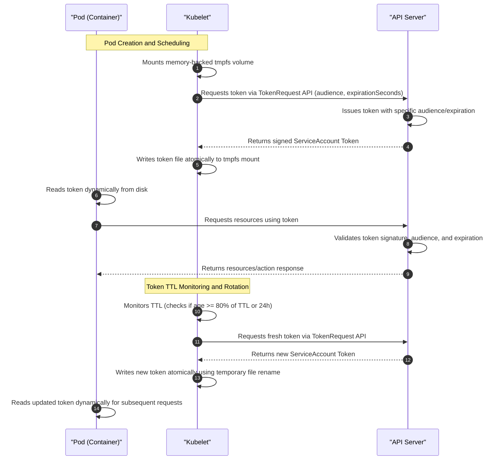
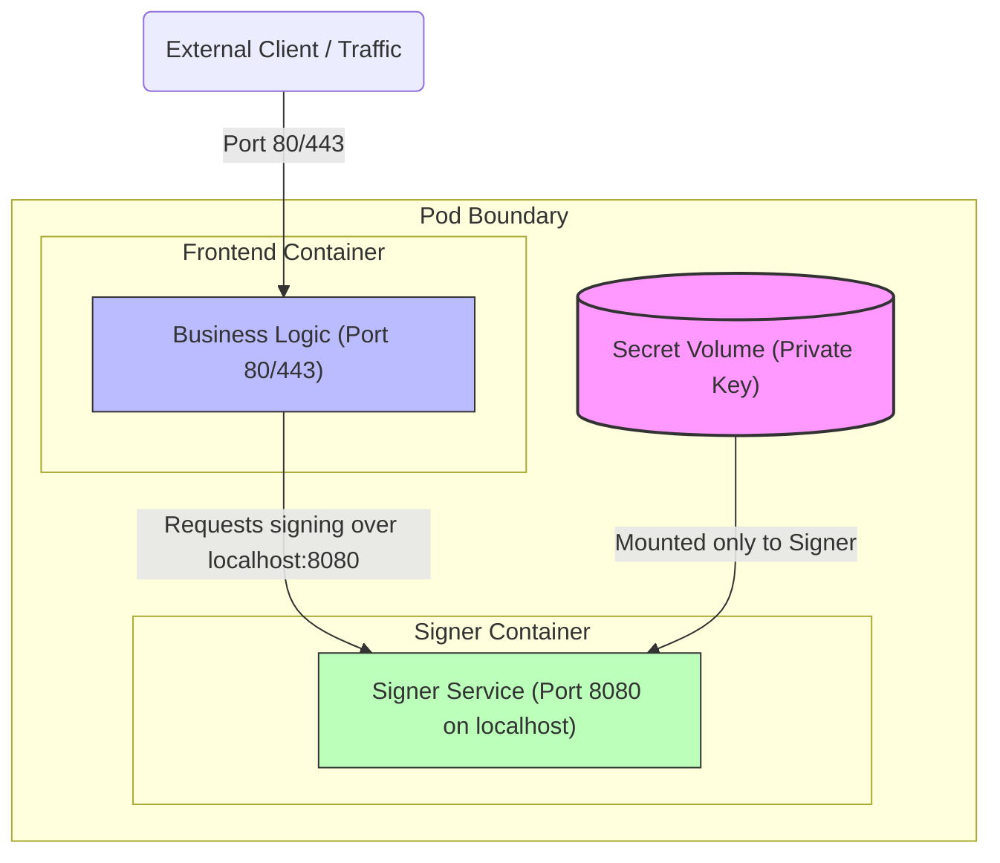

# Module 0-7-4: Secret Management & Encryption at Rest

**Breadcrumbs:** [[0-Index - Kubernetes|🏠 Kubernetes Reference MOC]] > **Module 0-7-4**

---

## 11. ConfigMap & Secret Security Management

Decoupling configuration parameters and credentials from container images allows application containers to remain environment-agnostic, running unchanged across development, test, and production stages.

### 11.1 ConfigMaps vs. Secrets
* **ConfigMaps:** Store non-sensitive configuration data (e.g., environment variables, settings, config files) in plaintext.
* **Secrets:** Store sensitive data (e.g., passwords, API keys, certificates) in Base64-encoded format.
  * **Important:** Base64 is NOT encryption. It is merely transport encoding. Anyone who has permission to read the Secret object can easily decode it:
    ```bash
    echo "base64-encoded-string" | base64 --decode
    ```

### 11.2 Cryptographic Transport Encoding vs. Encryption
A common security misconception is that Base64-encoding a Secret provides security or confidentiality. **It does not.** Base64 is a simple transport encoding scheme, whereas cryptography/encryption is a mathematical process of securing data using a secret key.

| Attribute | Base64 Encoding | Cryptography / Encryption |
| :--- | :--- | :--- |
| **Primary Purpose** | Translate binary data into ASCII characters for text-based transport protocols (HTML, JSON, YAML). | Enforce data confidentiality and restrict access only to authorized key holders. |
| **Algorithm Type** | Non-cryptographic, public standard lookup table (RFC 4648). | Cryptographic ciphers (e.g., AES-GCM, ChaCha20) relying on mathematical complexity. |
| **Secret Key Requirement** | None. No password or key is required to encode or decode. | Mandatory. Requires a strong cryptographic key (and optional Initialization Vectors). |
| **Security Level** | **Zero Security.** Anyone who can view the encoded string can immediately reverse it to plaintext. | **High Security.** Without the key, decrypting the ciphertext is mathematically infeasible. |
| **Integrity Check** | None. Tampering with the bytes will corrupt the decoded output but won't be caught by the encoding. | Built-in (e.g., AEAD ciphers generate authentication tags to detect data tampering). |

#### Mathematical Mapping & Character Set Mechanics:
Base64 works by converting 3 bytes (24 bits) of raw binary input data into 4 ASCII characters (each representing 6 bits, since $2^6 = 64$).
1. **Alphabet Index:** The encoding maps each 6-bit value to a specific index in a fixed 64-character public alphabet: `A-Z` (indices 0-25), `a-z` (26-51), `0-9` (52-61), `+` (62), and `/` (63).
2. **Step-by-Step Translation:**
   * Take the string `ABC` $\rightarrow$ ASCII values: `65`, `66`, `67` $\rightarrow$ Binary: `01000001 01000010 01000011`.
   * Re-group these 24 bits into four 6-bit segments: `010000` (16), `010100` (20), `001001` (9), `000011` (3).
   * Map indices to the alphabet: `16` $\rightarrow$ `Q`, `20` $\rightarrow$ `U`, `9` $\rightarrow$ `J`, `3` $\rightarrow$ `D`. Resulting string is `QUJD`.
1. **Padding (=):** If the input size is not a multiple of 3 bytes, padding characters (=) are appended to complete the 4-character blocks.

Because this mapping is entirely deterministic and does not involve any variable keys, **Base64 provides exactly the same level of security as plaintext**.

### 11.3 Core Secret Types & Manifest Examples
Kubernetes classifies secrets by their intended usage patterns to validate their structures.
*See complete implementation manifest examples and CLI creation commands in [[Project - Secrets Management and Encryption#step-by-step-implementation--configuration|Project - Secrets Management and Encryption.md > Secrets Implementation]].*

* **Opaque Secrets (`Opaque`):** The default type for general-purpose configuration secrets (such as databases or API keys). Keys and values are arbitrary base64-encoded strings.
* **TLS Secrets (`kubernetes.io/tls`):** Designed specifically for storing TLS certificates and private keys. Must contain two keys: `tls.crt` and `tls.key`. Applications (such as Ingress Controllers) rely on these exact keys to load certificates.
* **Docker Registry Secrets (`kubernetes.io/dockerconfigjson`):** Stores credentials for pulling images from private container registries. Configured inside the Pod spec using `imagePullSecrets`.
* **Service Account Secrets (`kubernetes.io/service-account-token`):** Used by Pods to authenticate requests to the Kubernetes API server. The API server generates the token secret automatically when a ServiceAccount is created, and mounts it into the Pod at `/var/run/secrets/kubernetes.io/serviceaccount`.
* **Basic Authentication Secrets (`kubernetes.io/basic-auth`):** Designed for basic HTTP authentication, requiring two keys: `username` and `password`.
* **SSH Authentication Secrets (`kubernetes.io/ssh-auth`):** Used for SSH key credential authentication. The private key is mounted into the container as a read-only volume to prevent modifications.

### 11.4 Linux `tmpfs` Volatile Memory Mechanics
To prevent sensitive data from leaking into non-volatile storage, the Kubelet mounts Secret volumes using a Linux `tmpfs` (Temporary Filesystem) mount.

#### How `tmpfs` Works at the Operating System Level:
* **Virtual Memory File System:** Unlike physical disk-backed filesystems (e.g., ext4, xfs) which format block devices and write data blocks to disk spindles or flash cells, `tmpfs` is a dynamic, memory-based filesystem. It writes files directly into the Linux kernel's **page cache**.
* **RAM and Swap Backing:** Pages allocated for `tmpfs` reside in volatile system RAM. However, if the node runs low on physical memory (memory pressure), the Linux kernel's virtual memory manager (VMM) can page out inactive `tmpfs` data blocks to the node's **swap space** (if swap is enabled on the host).
* **Dynamic Resource Allocation:** A `tmpfs` mount is dynamic. It does not pre-allocate memory. A 1GB `tmpfs` mount holding a 10KB Secret file only consumes 10KB of host memory, growing and shrinking dynamically based on file size.
* **Bypassing Physical Disk Write Queues:** Because writes to `tmpfs` do not hit physical disk block queues, journaling engines, or flash-translation layers, they are executed at RAM speeds and never write dirty pages to block storage.

#### Why Kubernetes Uses `tmpfs` for Secrets:
* **Anti-Forensics & Leak Prevention:** Standard file deletions on mechanical disks or SSDs only delete pointers (inodes) in metadata, leaving the actual file contents intact in physical storage blocks until overwritten. If worker nodes write secrets to disk, anyone who steals the node, gets read access to raw block storage, or recovers deleted files could extract plain-text credentials. `tmpfs` ensures the secrets reside only in volatile memory.
* **Host-to-Container Mount Path:**
  1. When a Pod with a Secret volume is scheduled, the Kubelet creates a volume directory on the host: `/var/lib/kubelet/pods/<pod-uid>/volumes/kubernetes.io~secret/<volume-name>`.
  2. The Kubelet mounts a `tmpfs` instance onto that directory: `mount -t tmpfs -o size=<limit> tmpfs /var/lib/kubelet/pods/<pod-uid>/volumes/kubernetes.io~secret/<volume-name>`.
  3. The Kubelet writes the decrypted Secret values into files inside this mount.
  4. The container runtime (e.g. containerd) bind-mounts this host `tmpfs` directory into the container's mount namespace (`mountPath`).
  5. When the Pod terminates, the Kubelet unmounts the volume (`umount`). The kernel immediately frees the corresponding page cache pages, flushing the secret from RAM. The data never touched the node's physical storage blocks.

### 11.5 Modern TokenRequest API & ServiceAccount Token Projection
The mechanism by which workloads authenticate to the Kubernetes API server has evolved to improve the cluster's security posture:

| Characteristic | Legacy ServiceAccount Token Secrets (`kubernetes.io/service-account-token`) | Modern TokenRequest API & ServiceAccount Token Projection |
| :--- | :--- | :--- |
| **Lifecycle** | Stored in the API server as a persistent `Secret` object. Valid indefinitely until explicitly deleted. | Generated dynamically by the API server. Ephemeral and not stored as a `Secret` resource. |
| **Expiration** | None (non-expiring, long-lived credentials). | Short-lived (typically 1 hour, customizable via `expirationSeconds`). |
| **Rotation** | Manual rotation required if leaked. | Automatic rotation handled by the kubelet prior to expiration. |
| **Audience Binding** | No audience restriction. Token can be used to authenticate to any endpoint/service. | Cryptographically bound to a specific audience (e.g. standard `api` or third-party service). |
| **Workload Binding** | Independent of Pod lifecycle. If the Pod is deleted, the Secret token remains valid. | Cryptographically bound to the running Pod instance. If the Pod is terminated, the token is invalidated. |
| **Kubernetes Version** | Standard until v1.21. Deprecated starting in v1.22+. | Recommended standard for v1.22 and later. |

##### ServiceAccount Token Projection Manifest Example:
```yaml
apiVersion: v1
kind: Pod
metadata:
  name: projected-token-pod
spec:
  containers:
  - name: app-container
    image: alpine
    volumeMounts:
    - name: sa-token-vol
      mountPath: /var/run/secrets/projected/serviceaccount
      readOnly: true
  serviceAccountName: my-serviceaccount
  volumes:
  - name: sa-token-vol
    projected:
      sources:
      - serviceAccountToken:
          audience: api
          expirationSeconds: 3600
          path: token
```

##### ServiceAccount Token Projection & Auto-Rotation Mechanics



When a Pod projects a ServiceAccount token, it uses the `TokenRequest` API instead of reading a static, long-lived Secret. The end-to-end lifecycle operates as follows:

1. **The `TokenRequest` Flow:**
   * During Pod creation, the `kube-apiserver` processes the Pod spec. Seeing the `projected.sources.serviceAccountToken` definition, it initializes the Pod but does not immediately generate the token.
   * When the Pod is scheduled onto a node, the local **Kubelet** handles volume preparation.
   * The Kubelet calls the API server's `TokenRequest` endpoint (a subresource of the ServiceAccount: `POST /api/v1/namespaces/{namespace}/serviceaccounts/{name}/token`).
   * In this API call, the Kubelet specifies the requested **Audience** (`audience`) and **Time-to-Live** (`expirationSeconds`).
   * The API server generates a JSON Web Token (JWT), signs it using the cluster's private service account key (defined by `--service-account-key-file` on the API server), and returns the signed token. The token contains claims that cryptographically bind it to the specific Pod (`kubernetes.io/pod.name` and `kubernetes.io/pod.uid`).
   * The Kubelet receives the token and writes it as a file to a node-local memory-backed (`tmpfs`) volume mount, making it accessible to the container at the configured path (e.g., `/var/run/secrets/projected/serviceaccount/token`).

2. **Automatic Token Rotation:**
   * Because these projected tokens are short-lived (usually expiring in 1 hour), they must be refreshed periodically without interrupting the running container.
   * The Kubelet runs a background manager that tracks the lifetime of all projected tokens on the node.
   * **The Rotation Threshold:** The Kubelet automatically triggers a refresh when either of the following conditions is met:
     * The token's age reaches **80% of its total Time-To-Live (TTL)** (e.g., 48 minutes for a 1-hour token).
     * The token has been active on the node for **24 hours** (for long-lived tokens).
   * **Atomic File Swap:** To write the new token without causing race conditions or corruption (where an application might read a partially-written or empty file), the Kubelet performs an atomic write sequence:
     1. It writes the newly fetched token to a temporary file in the same directory (e.g., `.token.tmp`).
     2. It executes an atomic `rename()` system call (renaming `.token.tmp` to `token`). In Linux, `rename` is atomic at the VFS (Virtual File System) level, ensuring that any read operations on `token` either return the old file completely or the new file completely, with no intermediate state.
   * **Application Hot-Reload:** Most official Kubernetes client libraries (like `client-go`) do not load the token into memory once at startup. Instead, they read the token file dynamically from disk for every new API connection or re-read it periodically. Therefore, when the Kubelet atomically replaces the file, the application automatically uses the rotated token on its next API call without needing a restart.
   * *See complete conceptual guide in [[Main Notes/Secret - ServiceAccount Token Projection.md|Secret - ServiceAccount Token Projection.md]].*

### 11.6 Advanced Workload Isolation: Signer Container Partitioning
To protect highly sensitive secrets (such as private cryptographic keys or signing certificates) from remote code execution (RCE) exploits, the application logic can be split across two containers running inside the same Pod:
1. **Frontend Container:** Handles the public-facing, complex application logic (e.g., HTTP APIs, HTML parsing). It has no access to the Secret key volume.
2. **Signer Container:** An isolated, low-privilege sidecar container that mounts the Secret volume containing the private signing key. It exposes a simple endpoint over localhost (or a shared Unix domain socket) that accepts payload signing requests and returns the signature.



###### Manifest Design:
```yaml
apiVersion: v1
kind: Secret
metadata:
  name: private-signing-key
type: Opaque
stringData:
  hmac-key: "super-secret-signing-key-value"
---
apiVersion: v1
kind: Pod
metadata:
  name: partitioned-signer-pod
spec:
  volumes:
    - name: signing-key-volume
      secret:
        secretName: private-signing-key
    - name: shared-ipc-volume
      emptyDir: {}
  containers:
    # 1. Frontend Container: Handles user requests, no access to the secret key
    - name: app-frontend
      image: nginx:alpine
      volumeMounts:
        - name: shared-ipc-volume
          mountPath: /var/run/signer
    # 2. Signer Container: Accesses the secret key, runs on loopback
    - name: hmac-signer
      image: python:alpine
      command:
        - python
        - -c
        - |
          import socket, hmac, hashlib
          # Read private signing key from mounted volume
          with open('/etc/keys/hmac-key', 'r') as f:
              key = f.read().strip().encode()
          # Set up loopback TCP socket to process signing requests
          server = socket.socket(socket.AF_INET, socket.SOCK_STREAM)
          server.bind(('127.0.0.1', 8080))
          server.listen(5)
          print("Signer service active on 127.0.0.1:8080")
          while True:
              conn, addr = server.accept()
              data = conn.recv(1024)
              if not data: break
              # Compute HMAC-SHA256 signature
              signature = hmac.new(key, data, hashlib.sha256).hexdigest()
              conn.sendall(signature.encode())
              conn.close()
      volumeMounts:
        - name: signing-key-volume
          readOnly: true
          mountPath: "/etc/keys"
        - name: shared-ipc-volume
          mountPath: /var/run/signer
```
*See complete architectural pattern in [[Digital Garden/Pattern - Cryptographic Secret Partitioning and Volatile Memory Mounts.md|Pattern - Cryptographic Secret Partitioning and Volatile Memory Mounts.md]].*

### 11.7 Alternatives to Native Secrets
Instead of creating native Kubernetes Secret objects to manage secrets, you can utilize the following structural alternatives:
* **Projected ServiceAccount Tokens:** For inter-component authentication within the cluster. Workloads authenticate to other apps using auto-rotating, short-lived ServiceAccount tokens projected via volume mounts.
* **External Secret Store Providers:** Use centralized external secret management tools (e.g., HashiCorp Vault, AWS Secrets Manager, Google Secret Manager, Azure Key Vault). Workloads can query these stores directly via HTTPS.
  * **Secrets Store CSI Driver:** Mounts secrets directly from the external vault into Pod volumes, bypassing the creation of persistent API objects.
* **CertificateSigningRequests (CSR):** For workload identity and X.509 certificate issuance. Workloads generate a private key locally on the node, submit a CSR to the Kubernetes API, and receive a signed certificate. This keeps the private key local and prevents it from ever being transmitted across the network or stored in API objects.
* **Device Plugins for Node-Local Encryption Hardware:** Utilize hardware security modules (HSMs) or Trusted Platform Modules (TPM) on worker nodes. Workloads are scheduled on these nodes and interact with the hardware via device plugins, ensuring keys are cryptographically bound to physical hardware.
* **Operator Pattern for Session Token Rotation:** Deploy a custom Kubernetes Operator that fetches short-lived session tokens from an external identity provider (IdP) and dynamically generates/rotates local Kubernetes Secrets.

### 11.8 Immutable ConfigMaps and Secrets
* You can mark ConfigMaps and Secrets as immutable by setting `immutable: true` in their spec:
  ```yaml
  apiVersion: v1
  kind: Secret
  metadata:
    name: mysecret
  immutable: true
  data:
    key: dmFsdWUK
  ```
* **Benefits:**
  * Protects against accidental updates that could cause application outages.
  * Improves cluster performance. For clusters with tens of thousands of Secret to Pod mounts, marking them immutable reduces load on `kube-apiserver` because the kubelet does not need to maintain a watch on them.
* **Caveat:** Once marked immutable, you cannot change the `data` or revert the setting. You must delete and recreate the object.

### 11.9 ETCD Encryption at Rest & Envelope Encryption
By default, secrets are stored in etcd as unencrypted base64 strings. Any user with root access to the master host or etcd can read them. Enable **etcd Encryption at Rest** to encrypt secret resources.

Kubernetes supports several encryption providers to secure secrets in the backing `etcd` store. These are categorized into **Static Providers** and **KMS Envelope Encryption**.

#### 1. Available Encryption Providers Comparison

| Provider Name | Encryption Algorithm | Strength | Speed | Key Length | Key Management & Security Characteristics |
| :--- | :--- | :--- | :--- | :--- | :--- |
| **`identity`** | None | N/A | N/A | N/A | Default provider. Resources written as plaintext JSON/Protobuf. If set as the first provider, resources are decrypted upon write. Does not provide any confidentiality. |
| **`aescbc`** | AES-CBC (PKCS#7 padding) | Moderate/Weak | Fast | 16, 24, 32-byte | Not recommended for high-security environments due to CBC's susceptibility to padding oracle attacks. Raw keys are stored in a plaintext configuration file on the control plane disk. |
| **`aesgcm`** | AES-GCM (Random Nonce) | Strong | Fastest | 16, 24, 32-byte | Extremely fast. Recommended only if an automated key rotation scheme is implemented. GCM nonce reuse becomes unsafe if keys are not rotated every 200,000 writes. Keys are stored locally on the control plane. |
| **`secretbox`** | XSalsa20 + Poly1305 | Strong | Faster | 32-byte | Uses relatively newer cryptographic constructions. May not meet strict corporate compliance standards that mandate standard NIST-approved ciphers. Keys are stored locally on the control plane node. |
| **`kms` v1** | Envelope Encryption (AES-GCM DEK) | Strongest | Slow | 32-byte DEK | delegates key management to external KMS via local gRPC plugin. Kube-apiserver calls KMS to encrypt a unique Data Encryption Key (DEK) generated for each secret write using the KMS Master Key Encryption Key (KEK). Deprecated in v1.28. |
| **`kms` v2** | Envelope Encryption (AES-GCM DEK) | Strongest | Fast | 32-byte DEK | Generates a new DEK per API server instance from a secret seed. KEK rotation occurs externally and is controlled by the user. Recommended for production. Stable from v1.29+. |

#### 2. Wildcard Matching & Resource Exemption Precedence
`EncryptionConfiguration` supports wildcarding to specify which resources should be encrypted.
* **Wildcards:** Use `*.<group>` to match all resources in a group (e.g., `*.apps`), `*.` to match all resources in the core API group, or `*.*` to match all resources (including custom resources added after server startup).
* **Overlap Limitation:** You cannot define overlapping wildcard rules within the same resource list or across multiple entries since part of the configuration would be ineffective.
* **Precedence Rule:** Processing is executed sequentially according to the order listed in the `resources` config array.
* **Exempting Resources:** To exempt specific resources (like Events or ConfigMaps) from a wildcard encryption configuration, you must place a specific resource entry with the `identity` provider **earlier** in the resources list than the wildcard entry.
  ```yaml
  resources:
    - resources:
        - events
        - configmaps
      providers:
        - identity: {} # Exempt: Write plaintext
    - resources:
        - '*.*'
      providers:
        - aescbc:
            keys:
              - name: key1
                secret: <BASE64_KEY>
  ```

#### 3. Zero-Downtime Key Rotation Protocol
Changing or rotating keys without API server downtime requires a precise multi-step roll:
1. **Prepare New Key:** Generate a new 32-byte key (`head -c 32 /dev/urandom | base64`). Add it as the **second** key in the keys array under the active provider on all control plane nodes.
   ```yaml
   providers:
     - aescbc:
         keys:
           - name: key1          # Active key used for encryption
             secret: <OLD_SECRET>
           - name: key2          # New key added for decryption only
             secret: <NEW_SECRET>
   ```
2. **Reload / Restart API Servers (Phase 1):** Restart or reload all `kube-apiserver` processes to ensure every instance is capable of decrypting secrets encrypted with the new key.
3. **Promote New Key (Active):** Modify the config file across all nodes, making the new key (`key2`) the **first** entry in the keys array.
   ```yaml
   providers:
     - aescbc:
         keys:
           - name: key2          # Promoted: Now used for new encryption writes
             secret: <NEW_SECRET>
           - name: key1          # Kept for decrypting old secrets
             secret: <OLD_SECRET>
   ```
4. **Reload / Restart API Servers (Phase 2):** Restart/reload all `kube-apiserver` processes to ensure the promoted key is now used for all new writes.
5. **Re-encrypt Backing Store:** Execute a global update command to rewrite all existing secrets using the new active key:
   ```bash
   kubectl get secrets --all-namespaces -o json | kubectl replace -f -
   ```
6. **Retire Old Key:** Remove the old key (`key1`) from the configuration array and restart/reload all API servers. Any accidental raw plaintext reads will now be rejected.

#### 4. Automatic Configuration Reloading
Instead of manually restarting the `kube-apiserver` pods during key rotation, configure the API server with:
```yaml
--encryption-provider-config-automatic-reload=true
```
When enabled, the API server polls the configuration file every minute. The rotation controller automatically updates the decryption ciphers in memory without process restarts. Monitor reloading status using the `apiserver_encryption_config_controller_automatic_reload_last_timestamp_seconds` metrics.

*See complete implementation steps and the step-by-step etcdctl diagnostic run sheet in [[Project - Secrets Management and Encryption#step-by-step-implementation--configuration|Project - Secrets Management and Encryption.md > ETCD Encryption Setup & Verification]].*

### 11.10 ConfigMap & Secret Injection Methods (Application Runtimes)
ConfigMaps and Secrets can be injected into container runtimes in three ways:

#### A. Environment Variables
Injects keys as environment variables directly available to the application process.
* **YAML Syntax (Individual Keys via `valueFrom`):**
  ```yaml
  spec:
    containers:
      - name: app
        image: my-app
        env:
          - name: LOG_LEVEL
            valueFrom:
              configMapKeyRef:
                name: app-config
                key: LOG_LEVEL
          - name: DB_PASS
            valueFrom:
              secretKeyRef:
                name: app-secret
                key: DB_PASSWORD
  ```
* **YAML Syntax (Bulk Ingestion via `envFrom`):**
  Loads all keys in the ConfigMap or Secret as environment variables, where the key names automatically map to the environment variable names.
  ```yaml
  spec:
    containers:
      - name: app
        image: my-app
        envFrom:
          - configMapRef:
              name: app-config
          - secretRef:
              name: app-secret
  ```
* **Pitfall:** If values are updated in the ConfigMap/Secret, env variables are **NOT** updated inside the running container until the container is restarted.


#### B. Command-Line Arguments
Injects ConfigMap or Secret values as start arguments for the container entrypoint.
```yaml
spec:
  containers:
    - name: app
      image: my-app
      command: ["/bin/sh", "-c"]
      args: ["echo $(MY_CONFIG_VAR)"]
      env:
        - name: MY_CONFIG_VAR
          valueFrom:
            configMapKeyRef:
              name: app-config
              key: MY_CONFIG_VAR
```

#### C. Volume Mounts
You can mount an entire ConfigMap or Secret as a volume, exposing keys as configuration files inside the container filesystem:
* **subPath Usage:** When mounting a configuration file into an existing directory (such as `/etc/nginx/`), configure `subPath` to prevent the volume mount from overwriting other files in that directory.
```yaml
spec:
  containers:
    - name: web
      image: nginx
      volumeMounts:
        - name: nginx-config-vol
          mountPath: /etc/nginx/nginx.conf
          subPath: nginx.conf
  volumes:
    - name: nginx-config-vol
      configMap:
        name: nginx-config
```
* **Advantage:** Kubelet periodically syncs updates. Modifications to the ConfigMap/Secret will automatically propagate as file updates inside the container within a few minutes (without restarting the container). Note that subPath mounts do not receive automatic updates.

### 11.11 Imperative Workflows & Version Control Export
To build configurations quickly, use imperative commands and export them for version control:

#### A. Imperative CLI Creation
* **ConfigMap:**
  ```bash
  kubectl create configmap app-config \
    --from-literal=LOG_LEVEL="INFO" \
    --from-literal=DATABASE_URL="mysql://db:3306"
  ```
* **Generic Secret (Opaque):**
  ```bash
  kubectl create secret generic app-secret \
    --from-literal=DB_PASSWORD="super-secret-password"
  ```
* **Docker Registry Secret:**
  ```bash
  kubectl create secret docker-registry my-registry-secret \
    --docker-server=<registry-server> \
    --docker-username=<username> \
    --docker-password=<password> \
    --docker-email=<email>
  ```

#### B. Exporting to Version Control
To store configurations in git, export the live settings as a clean template YAML:
```bash
kubectl get configmap app-config -o yaml > app-config.yaml
```

### 11.12 Secrets Store CSI Driver Integration
While native secrets (unencrypted Base64) or etcd encryption configurations (static keys stored locally) improve data safety, they do not resolve the problem of keeping credentials out of version control and managing them in a unified system. For production environments, the **Secrets Store CSI Driver** is recommended.

#### 1. How the CSI Secrets Store Driver Works
Rather than synchronizing external secrets (e.g. AWS Secrets Manager, HashiCorp Vault) into Kubernetes `Secret` API objects, the CSI driver pulls credentials at runtime and mounts them directly as files inside a volatile memory-backed `tmpfs` volume in the Pod container. This pattern completely bypasses etcd persistent storage, reducing the cluster attack surface.
* **ServiceAccount IRSA Integration:** On cloud providers (like EKS), the Pod uses a specific ServiceAccount annotated with an IAM Role (AWS IAM Roles for Service Accounts - IRSA). This role authorizes the CSI driver to fetch specific secrets.
* **SecretProviderClass CRD:** Configures the external provider (AWS, Vault, Azure, GCP) and lists the target secret key-value paths to map.
* **CSI Volume Mount:** The Pod spec declares a volume targeting the `secrets-store.csi.k8s.io` driver and links it to the `SecretProviderClass`.
* **Auto-rotation:** The CSI driver can poll the external Secret store periodically (e.g. every 2 minutes) to automatically update the mounted files.

*See the isolated lecture digest in [[Reference Notes/12-2_secrets_store_csi_driver_integration.md|Module 12-2: Secrets Store CSI Driver Integration (KodeKloud Talk)]] and the complete implementation guides in [[Project - Secrets Store CSI Driver|Project - Secrets Store CSI Driver.md]].*

---
