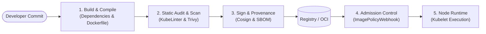
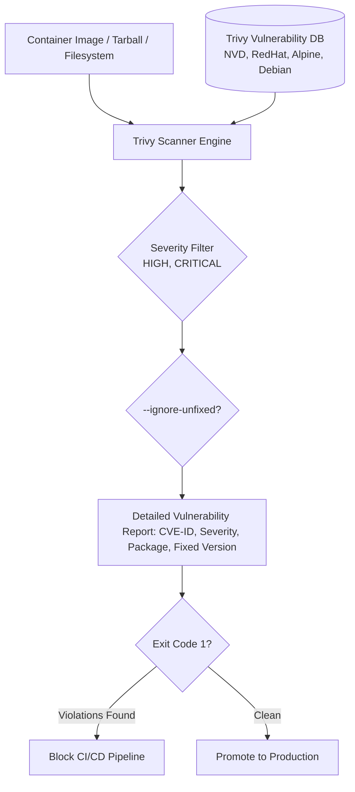
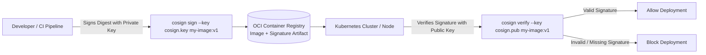
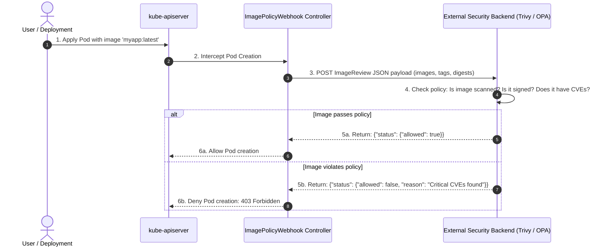

# Module 0-7-5: Supply Chain Security Masterclass

**Breadcrumbs:** [[0-Index - Kubernetes|🏠 Kubernetes Reference MOC]] > [[0-Index - CKS|🛡️ CKS Reference MOC]] > **Module 0-7-5**

> [!ABSTRACT] 📚 Course Alignment & Module Scope
> **Course:** KodeKloud Certified Kubernetes Security Specialist (CKS)
> **Section:** Supply Chain Security
> **Source Files:** `inflow/cks_split/05_supply_chain_security.md`
> **Topics Covered:** Software Supply Chain Threat Modeling, Minimizing Base Image Footprints (Distroless & Multi-Stage Builds), Static Manifest Analysis with KubeLinter, Vulnerability Scanning with Trivy, Software Bill of Materials (SBOM via SPDX & CycloneDX), Cryptographic Signing with Sigstore Cosign, Admission Control with `ImagePolicyWebhook`, and Whitelisting Trusted Registries.

---

## 🧭 Table of Contents
1. [Supply Chain Security Overview & Threat Landscape](#1--supply-chain-security-overview--threat-landscape)
2. [Minimizing Base Image Footprint (Multi-Stage & Distroless)](#2--minimizing-base-image-footprint-multi-stage--distroless)
3. [Static Security Analysis with KubeLinter](#3--static-security-analysis-with-kubelinter)
4. [Container Image Vulnerability Scanning with Trivy](#4--container-image-vulnerability-scanning-with-trivy)
5. [Software Bill of Materials (SBOM) Deep-Dive](#5--software-bill-of-materials-sbom-deep-dive)
6. [Cryptographic Signing & Verification with Sigstore Cosign](#6--cryptographic-signing--verification-with-sigstore-cosign)
7. [Admission Control: `ImagePolicyWebhook` Architecture](#7--admission-control-imagepolicywebhook-architecture)
8. [Whitelisting Allowed Container Registries](#8--whitelisting-allowed-container-registries)
9. [Evolutionary Conceptual Bridging: Image Governance](#9--evolutionary-conceptual-bridging-image-governance)
10. [Deep-Intuition Diagnostic Analyses (AARF)](#10--deep-intuition-diagnostic-analyses-aarf)
11. [CKS Exam Speed Hacks & Command Cheatsheet](#11--cks-exam-speed-hacks--command-cheatsheet)
12. [Course Walkthrough Navigation](#12--course-walkthrough-navigation)

---

## 1. 🧬 Supply Chain Security Overview & Threat Landscape

In cloud-native computing, the **Software Supply Chain** encompasses every component, tool, dependency, pipeline, and container base image involved from source code commit to production runtime.



### 1.1 Critical Supply Chain Attack Vectors
1. **Dependency Confusion & Malicious Packages:** Attackers publish public packages with names identical to internal corporate packages (e.g. npm, pip, go modules) to execute arbitrary code during builds.
2. **Compromised Base Images:** Using unverified public images from Docker Hub that contain pre-installed cryptominers, backdoors, or outdated OpenSSL libraries.
3. **Mutable Image Tag Hijacking (`:latest`):** Attackers overwrite mutable tags in container registries. A pod restarting or scaling pulls a compromised image with the identical tag.
4. **CI/CD Pipeline Tampering:** Modifying build scripts to inject malware into compiled binaries before pushing to production registries.

---

## 2. 📦 Minimizing Base Image Footprint (Multi-Stage & Distroless)

Traditional container images inherit full operating system distributions (Ubuntu, Debian, CentOS), packing hundreds of non-essential binaries (`curl`, `wget`, `apt`, `sh`, `python`, compilers). If an attacker achieves remote code execution (RCE), these binaries provide immediate reconnaissance and lateral movement tooling.

### 2.1 Attack Surface Comparison

| Image Base Type | Typical Size | Included Utilities | Attack Surface & Vulnerability Count |
| :--- | :--- | :--- | :--- |
| **Full OS (Ubuntu/Debian)** | ~80–200 MB | Full package managers (`apt`), shells (`bash`, `sh`), network tools (`curl`, `tar`). | **High** (Dozens of CVEs, easy exploit staging). |
| **Minimal OS (Alpine)** | ~5–10 MB | Lightweight `apk` package manager, BusyBox shell (`ash`), `musl` libc. | **Low-Medium** (Occasional musl libc bugs, shell present). |
| **Distroless (`gcr.io/distroless`)** | ~20–30 MB | **No shell**, **no package manager**, **no coreutils**. Only application binary and glibc. | **Ultra-Low** (Extremely difficult for attackers to execute payloads). |
| **Scratch (`FROM scratch`)** | ~0 MB | Completely empty. Zero OS files; requires statically linked Go/Rust binary. | **Absolute Minimum** (Zero CVEs). |

### 2.2 Hardened Multi-Stage Dockerfile Pattern
Multi-stage builds separate the build environment (compilers, SDKs) from the runtime environment (minimal runtime files only).

```dockerfile
# ==========================================
# Stage 1: Compilation Environment (Builder)
# ==========================================
FROM golang:1.22-alpine AS builder

WORKDIR /src
COPY go.mod go.sum ./
RUN go mod download

COPY . .
# Compile statically linked binary with stripped debug symbols:
RUN CGO_ENABLED=0 GOOS=linux go build -ldflags="-s -w" -o /bin/app .

# ==========================================
# Stage 2: Production Distroless Runtime
# ==========================================
FROM gcr.io/distroless/static:nonroot

WORKDIR /app
# Copy strictly the compiled binary from builder:
COPY --from=builder /bin/app /app/app

# Enforce non-root execution (UID 65532 is standard nonroot in distroless):
USER 65532:65532

ENTRYPOINT ["/app/app"]
```

---

## 3. 🔍 Static Security Analysis with KubeLinter

**KubeLinter** is an open-source static analysis tool that audits Kubernetes YAML manifests and Helm charts before deployment, identifying security misconfigurations against best practices.

### 3.1 Common Checks Performed by KubeLinter
* Container running as root (`runAsNonRoot: true` missing).
* Privileged container execution (`privileged: true`).
* Writable root filesystem (`readOnlyRootFilesystem: true` missing).
* Missing CPU/Memory resource limits.
* Mounting sensitive host paths (`/var/run/docker.sock`, `/`).
* Using the `default` ServiceAccount.

```bash
# 1. Install KubeLinter:
go install golang.stackrox.io/kube-linter/cmd/kube-linter@latest

# 2. Lint a single Kubernetes manifest:
kube-linter lint deployment.yaml

# 3. Lint an entire directory of manifests or Helm chart:
kube-linter lint ./k8s-manifests/

# 4. Integrate into CI/CD pipelines (returns exit code 1 if errors found):
kube-linter lint --fail-on-errors ./deploy/
```

---

## 4. 🛡️ Container Image Vulnerability Scanning with Trivy

Aqua Security's **Trivy** is the standard comprehensive vulnerability scanner used in enterprise DevSecOps and the CKS exam. It scans container images, file systems, Git repositories, and SBOMs for known CVEs.



### 4.1 Trivy CLI Formulas & Exam Shortcuts

```bash
# 1. Basic image scan:
trivy image nginx:1.18

# 2. Filter strictly for HIGH and CRITICAL vulnerabilities:
trivy image --severity HIGH,CRITICAL nginx:1.18

# 3. Filter out CVEs that have NO available vendor patch:
trivy image --severity HIGH,CRITICAL --ignore-unfixed nginx:1.18

# 4. Fail CI/CD build if any CRITICAL vulnerabilities are detected:
trivy image --exit-code 1 --severity CRITICAL nginx:1.18

# 5. Scan a local archived image tarball (common on CKS exam!):
trivy image --input /root/image.tar

# 6. Scan a local host filesystem directory:
trivy fs /etc/kubernetes/

# 7. Output findings in JSON format for automated ingestion:
trivy image -f json -o /tmp/scan-report.json nginx:1.18
```

---

## 5. 📋 Software Bill of Materials (SBOM) Deep-Dive

A **Software Bill of Materials (SBOM)** is a machine-readable, formally structured inventory of every software component, library, dependency, version, and license included in a software artifact.

### 5.1 Why SBOM Matters
When critical zero-day vulnerabilities emerge (such as **Log4Shell - CVE-2021-44228** or **XZ Utils backdoor - CVE-2024-3094**), teams cannot afford to re-scan thousands of source code repositories. An SBOM allows querying a centralized database to identify within seconds which running production containers contain the affected library.

### 5.2 Industry Standard SBOM Formats
1. **SPDX (Software Package Data Exchange):** Linux Foundation open standard (ISO/IEC 5962:2021), widely adopted in enterprise and government procurement.
2. **CycloneDX:** OWASP-backed standard designed specifically for application security, vulnerability management, and dependency tracking.

### 5.3 Generating and Auditing SBOMs with Syft & Grype
```bash
# 1. Generate an SPDX JSON SBOM for a container image using Syft:
syft packages nginx:alpine -o spdx-json=nginx-sbom.json

# 2. Generate a CycloneDX JSON SBOM:
syft packages nginx:alpine -o cyclonedx-json=nginx-cyclonedx.json

# 3. Scan the generated SBOM directly for vulnerabilities using Grype:
grype sbom:nginx-sbom.json
```

---

## 6. 🔏 Cryptographic Signing & Verification with Sigstore Cosign

Scanning images for vulnerabilities is useless if an attacker can swap the container image in the registry before deployment. **Cosign** (part of CNCF Sigstore) allows developers to sign container images and verify signatures inside Kubernetes admission webhooks.



### 6.1 Generating Keys & Signing Images
```bash
# 1. Generate a public/private key pair:
cosign generate-key-pair
# Generates cosign.key (private) and cosign.pub (public)

# 2. Sign a container image by its immutable SHA256 digest:
cosign sign --key cosign.key myregistry.io/apps/web@sha256:45b23d...

# 3. Attach an SBOM directly to the container image in the registry:
cosign attach sbom --sbom nginx-sbom.json myregistry.io/apps/web:v1

# 4. Verify the container image signature against the public key:
cosign verify --key cosign.pub myregistry.io/apps/web:v1
```

---

## 7. 🚪 Admission Control: `ImagePolicyWebhook` Architecture

The `ImagePolicyWebhook` is a built-in Kubernetes admission controller that evaluates container images prior to pod creation, querying an external backend webhook to approve or deny the deployment based on vulnerability scan results and signature validity.



### 7.1 Configuration Pipeline (4-Step Deployment)

#### Step 1: Webhook Kubeconfig (`/etc/kubernetes/admission/webhook-kubeconfig.yaml`)
Tells the API server how to reach and authenticate with the external webhook service:

```yaml
apiVersion: v1
kind: Config
clusters:
  - cluster:
      certificate-authority: /etc/kubernetes/admission/webhook.crt
      server: https://image-validator.security.svc:443/image-policy
    name: webhook-server
contexts:
  - context:
      cluster: webhook-server
      user: apiserver-client
    name: webhook-context
current-context: webhook-context
users:
  - name: apiserver-client
    user:
      client-certificate: /etc/kubernetes/admission/apiserver-client.crt
      client-key: /etc/kubernetes/admission/apiserver-client.key
```

#### Step 2: Admission Configuration File (`/etc/kubernetes/admission/admission-config.yaml`)
Configures the `ImagePolicyWebhook` plugin parameters:

```yaml
apiVersion: apiserver.config.k8s.io/v1
kind: AdmissionConfiguration
plugins:
  - name: ImagePolicyWebhook
    configuration:
      imagePolicy:
        kubeConfigFile: /etc/kubernetes/admission/webhook-kubeconfig.yaml
        allowTTL: 50 # Cache allowed decisions for 50 seconds
        denyTTL: 50  # Cache denied decisions for 50 seconds
        retryBackOff: 500
        # CRITICAL FAIL-SAFE:
        # defaultAllow: false -> Denies all workloads if webhook server is unreachable!
        defaultAllow: false
```

#### Step 3: Enabling on `kube-apiserver`
Update `/etc/kubernetes/manifests/kube-apiserver.yaml`:

```yaml
spec:
  containers:
    - name: kube-apiserver
      command:
        - kube-apiserver
        - --enable-admission-plugins=NodeRestriction,ImagePolicyWebhook
        - --admission-control-config-file=/etc/kubernetes/admission/admission-config.yaml
      volumeMounts:
        - mountPath: /etc/kubernetes/admission
          name: admission-config
          readOnly: true
  volumes:
    - hostPath:
        path: /etc/kubernetes/admission
        type: DirectoryOrCreate
      name: admission-config
```

#### Step 4: Webhook Payload JSON Schema (`image-policy.k8s.io/v1alpha1`)
The webhook server receives:
```json
{
  "apiVersion": "imagepolicy.k8s.io/v1alpha1",
  "kind": "ImageReview",
  "spec": {
    "containers": [
      {
        "image": "nginx:1.18"
      }
    ],
    "namespace": "production"
  }
}
```
And returns:
```json
{
  "apiVersion": "imagepolicy.k8s.io/v1alpha1",
  "kind": "ImageReview",
  "status": {
    "allowed": false,
    "reason": "Image contains 2 Critical CVEs and is unsigned by corporate key."
  }
}
```

---

## 8. 🌐 Whitelisting Allowed Container Registries

Permitting nodes to pull images from arbitrary public registries (Docker Hub, Quay, unknown registries) allows developers to deploy unvetted, vulnerable software. Enforcing registry whitelists ensures workloads originate strictly from private, scanned registries.

### 8.1 Registry Whitelisting with OPA Gatekeeper
```yaml
apiVersion: constraints.gatekeeper.sh/v1beta1
kind: K8sAllowedRepos
metadata:
  name: whitelist-registries
spec:
  match:
    kinds:
      - apiGroups: [""]
        kinds: ["Pod"]
  parameters:
    repos:
      - "mycompany.azurecr.io/"
      - "123456789.dkr.ecr.us-east-1.amazonaws.com/"
```

---

## 9. 🌉 Evolutionary Conceptual Bridging: Image Governance

| Paradigm | Historical / Legacy Model | Modern Cloud-Native Standard |
| :--- | :--- | :--- |
| **Registry Trust** | Implicit trust: any image on Docker Hub can be pulled into production. | **Zero-trust:** Private OCI registries, strict image pull secrets, registry whitelisting. |
| **Image Tagging** | Mutable tags (`:latest`, `:v1`). Subject to tag hijacking and drift. | **Immutable digests:** Referencing images strictly by cryptographic hash (`@sha256:...`). |
| **Vulnerability Gates** | Manual, ad-hoc terminal scans by developers before release. | **Automated CI/CD gates:** Automated Trivy/Grype scans blocking builds on CRITICAL CVEs. |
| **Artifact Provenance** | None; developers pushed directly to registries. | **Cryptographic provenance:** Sigstore Cosign signatures and signed SPDX/CycloneDX SBOMs. |
| **Cluster Ingestion** | In-tree plugins (`ImagePolicyWebhook`) with complex JSON servers. | **Modern Webhook Engines:** Kyverno and OPA Gatekeeper enforcing policies declaratively. |

---

## 10. 🔍 Deep-Intuition Diagnostic Analyses (AARF)

### Scenario 1: `ImagePolicyWebhook` Outage Causes Total Workload Lockout
* **The Answer:** If the external webhook server is offline and `defaultAllow: false` is configured, the admission controller fails closed, rejecting all pod creation requests across the entire cluster. To restore emergency operations, either fix the webhook server or temporarily set `defaultAllow: true` in `/etc/kubernetes/admission/admission-config.yaml`.
* **The Assumptions:** The cluster enforces strict image policy checking via `ImagePolicyWebhook`.
* **The Rationale (Why):** Security-conscious architectures fail closed (`defaultAllow: false`) to prevent malicious images from slipping into the cluster during an admission server outage.
* **The Failure Loop (What if not):** All pod creation, deployment rollouts, and autoscaling fail with `Internal error occurred: failed calling webhook "image-policy": connection refused`.
* **The Alternative Case:** In non-critical development clusters, setting `defaultAllow: true` prevents outages when external security scanners experience downtime.

### Scenario 2: Trivy Scanning Blocks CI/CD on Unfixable CVEs
* **The Answer:** Pass the `--ignore-unfixed` flag to Trivy in the CI/CD pipeline script: `trivy image --severity HIGH,CRITICAL --ignore-unfixed --exit-code 1 <image>`.
* **The Assumptions:** The base image contains an open vulnerability for which the upstream distribution (e.g. Debian security team) has not yet authored or published a patch.
* **The Rationale (Why):** If a CVE has no available fix, failing the CI/CD pipeline blocks critical business features and security hotfixes without providing developers with an actionable remediation path.
* **The Failure Loop (What if not):** Pipelines fail permanently on issues developers cannot solve, leading engineering teams to disable security scanners entirely.
* **The Alternative Case:** If the unpatched vulnerability is actively exploited in the wild (CISA KEV catalog), the build must remain blocked and the team must migrate to a distroless or scratch base image.

### Scenario 3: Container Entrypoint Crashes with `Permission Denied` Under Distroless
* **The Answer:** Ensure that all files, directories, and application logs required by the executable are owned by non-root UID 65532 during the Dockerfile build stage: `RUN chown -R 65532:65532 /app`.
* **The Assumptions:** The application was refactored to use `gcr.io/distroless/static:nonroot`.
* **The Rationale (Why):** Distroless non-root images execute with UID 65532. If the application attempts to write temporary files or logs to `/app/` and the directory is owned by root (`0:0`), the kernel returns `EACCES` (Permission denied).
* **The Failure Loop (What if not):** Container exits immediately upon startup with exit code 1; pod status displays `CrashLoopBackOff`.
* **The Alternative Case:** Mount an in-memory `emptyDir` volume to the writable path (e.g. `/tmp`) in the Pod specification.

---

## 11. ⚡ CKS Exam Speed Hacks & Command Cheatsheet

```bash
# 1. Scan image and output only CRITICAL vulnerabilities:
trivy image --severity CRITICAL <image-name>

# 2. Scan image ignoring unpatched vulnerabilities:
trivy image --severity HIGH,CRITICAL --ignore-unfixed <image-name>

# 3. Scan a local archived image tarball:
trivy image --input /path/to/image.tar

# 4. Check if ImagePolicyWebhook is enabled in apiserver:
grep 'ImagePolicyWebhook' /etc/kubernetes/manifests/kube-apiserver.yaml

# 5. Quick syntax check on admission-control-config-file:
cat /etc/kubernetes/admission/admission-config.yaml

# 6. Verify image digest usage in pod manifests:
kubectl get pods -A -o jsonpath='{range .items[*]}{.metadata.name}{": "}{range .spec.containers[*]}{.image}{"\n"}{end}{end}' | grep -v '@sha256:'
```

---

## 12. 🔗 Course Walkthrough Navigation

* ⬅️ **Previous Module:** [[Reference Notes/0-7-4_microservice_vulnerabilities_and_isolation.md|Module 0-7-4: Microservice Vulnerabilities & Isolation]]
* ➡️ **Next Module:** [[Reference Notes/0-7-6_monitoring_logging_runtime_security.md|Module 0-7-6: Monitoring, Logging & Runtime Security]]
  *(Covers Syscall Runtime Threat Detection with Falco, API Server Auditing, and Container Immutability).*
* 🏠 **CKS Master Index:** [[Reference Notes/0-Index - CKS.md|🛡️ CKS Certification Reference MOC]]
* 🌐 **Official Kubernetes Documentation:** [ImagePolicyWebhook](https://kubernetes.io/docs/reference/access-authn-authz/admission-controllers/#imagepolicywebhook)
