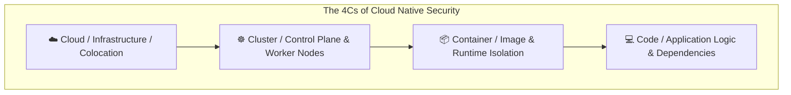
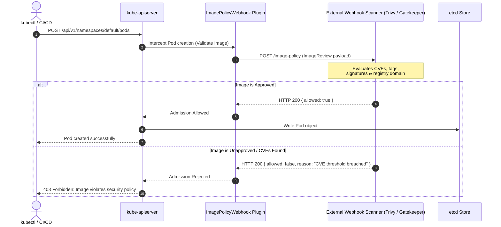
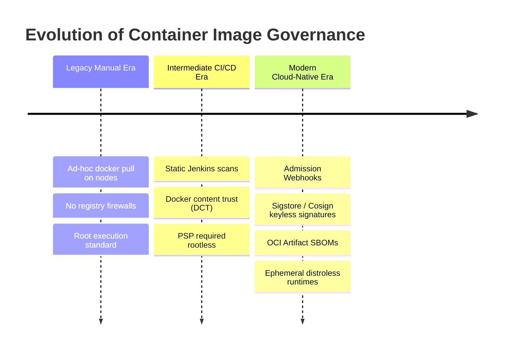

# Module 0-7-5: Supply Chain Security, Image Vulnerabilities & ImagePolicyWebhook

**Breadcrumbs:** [[0-Index - Kubernetes|🏠 Kubernetes Reference MOC]] > [[0-Index - CKS|🛡️ CKS Reference MOC]] > **Module 0-7-5**

---

## 1. The 4Cs of Cloud-Native Security

Cloud-native security follows a defense-in-depth model structured into four concentric layers known as the **4Cs**: **Cloud**, **Cluster**, **Container**, and **Code**. Each layer relies upon the security guarantees of the layer enclosing it; a vulnerability in an outer layer compromises all inner layers regardless of inner controls.



| Layer | Primary Threat Vectors | Core Security Controls |
| :--- | :--- | :--- |
| **Cloud** | Misconfigured IAM roles, exposed VPC ports, insecure metadata endpoints (`169.254.169.254`). | Least-privilege IAM, VPC subnets, Security Groups, IMDSv2, KMS encryption at rest. |
| **Cluster** | Unauthenticated Kubelet, exposed API server, open etcd, weak RBAC. | TLS bootstrapping, RBAC, NodeRestriction, NetworkPolicies, API Auditing. |
| **Container** | Vulnerable base images, root execution, unconstrained Linux capabilities, malicious registries. | Distroless images, non-root users, Trivy vulnerability scans, `ImagePolicyWebhook`. |
| **Code** | SQL injection, SSRF, vulnerable third-party dependencies, insecure secrets handling. | Static Application Security Testing (SAST), SBOM analysis, dependency pinning, mTLS. |

---

## 2. Minimizing the Container Base Image Footprint

Container images must follow the principle of least privilege: include only the application binary and its direct runtime dependencies. Excess utilities (such as `curl`, `wget`, `netcat`, `sh`, `bash`, and package managers like `apt` or `apk`) provide attackers with off-the-shelf tooling for post-exploitation lateral movement.

### 2.1 Multi-Stage Dockerfile Hardening
Multi-stage builds separate the build environment (compilers, SDKs, build caches) from the final minimal production runtime:

```dockerfile
# Stage 1: Build & Compilation Environment
FROM golang:1.22-alpine AS builder
WORKDIR /workspace
COPY go.mod go.sum ./
RUN go mod download
COPY main.go ./
RUN CGO_ENABLED=0 GOOS=linux GOARCH=amd64 go build -ldflags="-w -s" -o secure-app main.go

# Stage 2: Production Distroless / Scratch Runtime
FROM gcr.io/distroless/static-debian12:nonroot
WORKDIR /
COPY --from=builder /workspace/secure-app /secure-app
# Enforce non-root execution (UID 65532 is standard nonroot in distroless)
USER 65532:65532
ENTRYPOINT ["/secure-app"]
```

### 2.2 Attack Surface Comparison Matrix

| Image Type | Typical Size | Included Binaries | Attack Surface |
| :--- | :--- | :--- | :--- |
| `ubuntu:latest` | ~78 MB | Full OS userland, package manager (`apt`), shells (`bash`, `sh`), coreutils. | **High** (Hundreds of CVEs over time; attackers have full shell access). |
| `alpine:latest` | ~7 MB | Musl libc, BusyBox utilities, package manager (`apk`). | **Medium** (Small footprint, but contains a shell and package installer). |
| `distroless` | ~2 to 20 MB | Application runtime dependencies and CA certificates only; no shell, no package manager. | **Low** (Extremely limited attack vectors; cannot spawn an interactive shell). |
| `scratch` | 0 MB | Empty filesystem base; only statically linked binaries can execute. | **Minimal** (Zero extraneous files or attack vectors). |

---

## 3. Software Bill of Materials (SBOM) & Image Signing

An **SBOM (Software Bill of Materials)** is a nested machine-readable inventory of all software components, operating system packages, third-party libraries, and dependencies bundled within a container image.

### 3.1 Standard Formats
* **SPDX (Software Package Data Exchange):** An ISO/IEC standard (ISO/IEC 5962:2021) focusing on licensing, provenance, and security compliance.
* **CycloneDX:** An OWASP-backed standard purpose-built for application security context, vulnerability tracking, and dependency graph resolution.

### 3.2 Generating and Signing an SBOM
Using `syft` and `cosign`:

```bash
# 1. Generate an SPDX JSON SBOM for an image
syft packages docker.io/myorg/api:v1.0.0 -o spdx-json > api-v1.0.0.spdx.json

# 2. Generate a CycloneDX JSON SBOM
syft packages docker.io/myorg/api:v1.0.0 -o cyclonedx-json > api-v1.0.0.cdx.json

# 3. Sign the container image using Cosign
cosign sign --key cosign.key docker.io/myorg/api:v1.0.0

# 4. Attach and sign the SBOM directly to the OCI registry
cosign attach sbom --sbom api-v1.0.0.spdx.json docker.io/myorg/api:v1.0.0
cosign sign --key cosign.key --attachment sbom docker.io/myorg/api:v1.0.0

# 5. Verify the signature against the public key
cosign verify --key cosign.pub docker.io/myorg/api:v1.0.0
```

---

## 4. Vulnerability Scanning with Trivy

**Trivy** is a comprehensive, open-source vulnerability and misconfiguration scanner capable of auditing container images, filesystems, Git repositories, and Kubernetes configurations.

### 4.1 CLI Mechanics and Exam Shortcuts

```bash
# Basic image scan
trivy image nginx:1.24

# Filter by severity (HIGH and CRITICAL only)
trivy image --severity HIGH,CRITICAL nginx:1.24

# Ignore unpatched/unfixed CVEs (avoids blocking pipelines on issues with no fix)
trivy image --ignore-unfixed --severity HIGH,CRITICAL nginx:1.24

# CI/CD Automated Gate: Fail the build (exit code 1) if CRITICAL vulnerabilities exist
trivy image --exit-code 1 --severity CRITICAL nginx:1.24

# Output as JSON or Save to Report File
trivy image --format json --output scan-report.json nginx:1.24

# Scan a local rootfs or directory directly (useful for auditing node host paths)
trivy fs --severity HIGH,CRITICAL /var/lib/containerd/
```

### 4.2 Trivy Output Interpretation
* **Vulnerability ID:** Standard CVE identifier (e.g., `CVE-2023-44487`).
* **Package:** The vulnerable library or OS binary (e.g., `libssl3`, `golang.org/x/net`).
* **Installed Version vs Fixed Version:** Exact boundary versions required for remediation.

---

## 5. Admission Control: ImagePolicyWebhook

The **ImagePolicyWebhook** admission controller intercepts pod creation requests at the kube-apiserver admission phase and queries an external webhook service (such as an enterprise image scanner or signature verification service) to approve or reject image deployment based on security policies.



### 5.1 Architecture & Configuration Pipeline
Configuring `ImagePolicyWebhook` requires three distinct files on the master control plane node:
1. **Admission Configuration File:** Configures the behavior of the admission plugin.
2. **Webhook Kubeconfig File:** Specifies TLS credentials and network endpoints for the external webhook backend.
3. **Kube-apiserver Static Pod Manifest:** Mounts the files and enables the plugin flags.

---

### 5.2 Step 1: Webhook Kubeconfig (`/etc/kubernetes/admission/webhook-kubeconfig.yaml`)

This kubeconfig tells kube-apiserver how to reach and authenticate with the external webhook endpoint:

```yaml
apiVersion: v1
kind: Config
clusters:
- cluster:
    certificate-authority: /etc/kubernetes/admission/external-scanner-ca.crt
    server: https://image-validator.internal.domain:8443/image-policy
  name: image-checker-backend
contexts:
- context:
    cluster: image-checker-backend
    user: apiserver-client
  name: image-checker-context
current-context: image-checker-context
preferences: {}
users:
- name: apiserver-client
  user:
    client-certificate: /etc/kubernetes/admission/apiserver-client.crt
    client-key: /etc/kubernetes/admission/apiserver-client.key
```

---

### 5.3 Step 2: Admission Configuration File (`/etc/kubernetes/admission/admission-config.yaml`)

Defines rules, timeouts, and fail-open/fail-closed behaviors:

```yaml
apiVersion: apiserver.config.k8s.io/v1
kind: AdmissionConfiguration
plugins:
- name: ImagePolicyWebhook
  configuration:
    imagePolicy:
      kubeConfigFile: /etc/kubernetes/admission/webhook-kubeconfig.yaml
      # Time in seconds to cache an allow decision
      allowTTL: 50
      # Time in seconds to cache a deny decision
      denyTTL: 50
      # Maximum time in milliseconds to wait for external response
      retryBackOff: 500
      # Fail-closed vs Fail-open policy:
      # If defaultAllow: false, apiserver REJECTS pod creation if the webhook is unreachable.
      defaultAllow: false
```

> [!CAUTION]
> In production and on the CKS exam, `defaultAllow: false` enforces a **fail-closed** security posture. If the external webhook server is down, all pod deployments attempting to use unapproved or unchecked images will be blocked.

---

### 5.4 Step 3: Enabling in `kube-apiserver.yaml`

Modify `/etc/kubernetes/manifests/kube-apiserver.yaml` on the control plane node:

```yaml
spec:
  containers:
  - name: kube-apiserver
    command:
    - kube-apiserver
    # Enable the admission plugin alongside default plugins
    - --enable-admission-plugins=NodeRestriction,ImagePolicyWebhook
    # Pass the path to the admission control configuration file
    - --admission-control-config-file=/etc/kubernetes/admission/admission-config.yaml
    volumeMounts:
    - mountPath: /etc/kubernetes/admission
      name: admission-config
      readOnly: true
  volumes:
  - hostPath:
      path: /etc/kubernetes/admission
      type: DirectoryOrCreate
    name: admission-config
```

---

### 5.5 Step 4: Webhook Payload Contract (`image-policy.k8s.io/v1alpha1`)

The kube-apiserver transmits an `ImageReview` JSON object to the external service:

**Request Payload:**
```json
{
  "apiVersion": "image-policy.k8s.io/v1alpha1",
  "kind": "ImageReview",
  "spec": {
    "containers": [
      {
        "image": "docker.io/library/nginx:latest"
      }
    ],
    "annotations": {
      "deployment.kubernetes.io/revision": "1"
    },
    "namespace": "production"
  }
}
```

**Response Payload Expected by API Server:**
```json
{
  "apiVersion": "image-policy.k8s.io/v1alpha1",
  "kind": "ImageReview",
  "status": {
    "allowed": false,
    "reason": "Image tag 'latest' is forbidden in namespace 'production'. Only sha256 digests and scanned tags are permitted."
  }
}
```

---

## 6. 🌉 Evolutionary Conceptual Bridging: Image Governance



1. **Classic Traditional Era (Manual & Permissive):**
   * Early Kubernetes deployments allowed arbitrary images pulled from any public registry (`docker.io`, `quay.io`, untrusted registries).
   * Images were built with full Ubuntu or Debian bases containing build compilers, root sshd daemons, and bash interpreters.
2. **Intermediate CI/CD Gate Era:**
   * Vulnerability scanning was introduced exclusively at the continuous integration pipeline level.
   * **Failure Mode:** Any operator with cluster admin privileges could bypass CI/CD by directly deploying `kubectl run --image=untested-image`, completely evading pipeline gating.
3. **Modern Admission & Cryptographic Era:**
   * **In-Cluster Enforcement:** Tools like `ImagePolicyWebhook`, Kyverno, and OPA/Gatekeeper enforce image policies directly at the API server entry point, making pipeline bypassing impossible.
   * **Immutable Cryptographic Proof:** Instead of relying on mutable image tags (`:latest`), modern clusters require explicit cryptographic digests (`image@sha256:...`) and verify Cosign signatures against OCI-compliant transparency logs (Rekor).

---

## 7. Operational Troubleshooting & Verification

### Verification Checklist:
1. **Check kube-apiserver status:**
   ```bash
   crictl ps --name kube-apiserver
   # If pod crashes, inspect static pod logs:
   cat /var/log/pods/kube-system_kube-apiserver-*/kube-apiserver/*.log | grep -i "imagepolicy"
   ```
2. **Verify Admission Configuration Parsing:**
   If the admission configuration file has YAML syntax errors, kube-apiserver will fail to start. Always validate before saving:
   ```bash
   yamllint /etc/kubernetes/admission/admission-config.yaml
   ```
3. **Test Admission Blocking:**
   Attempt to create a pod with an unauthorized image:
   ```bash
   kubectl run test-unauthorized --image=untrusted-repo/bad-image:v1
   # Expected Output:
   # Error from server (Forbidden): pods "test-unauthorized" is forbidden: image policy webhook backend denied one or more images: CVE threshold breached
   ```

<!-- Documentation References -->
[Kubernetes Admission Controllers Reference](https://kubernetes.io/docs/reference/access-authn-authz/admission-controllers/)
[Kubernetes Security Overview](https://kubernetes.io/docs/concepts/security/overview/)
