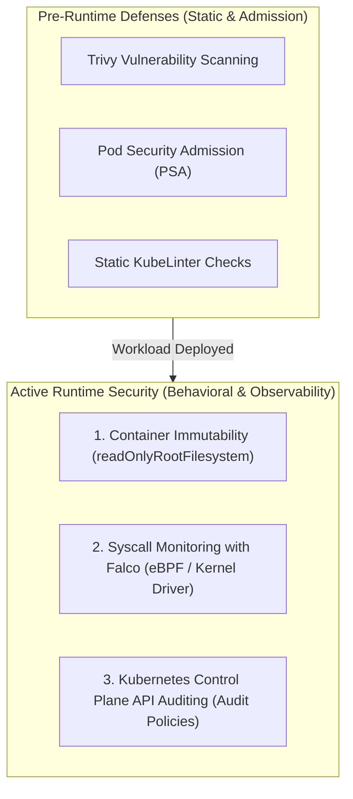
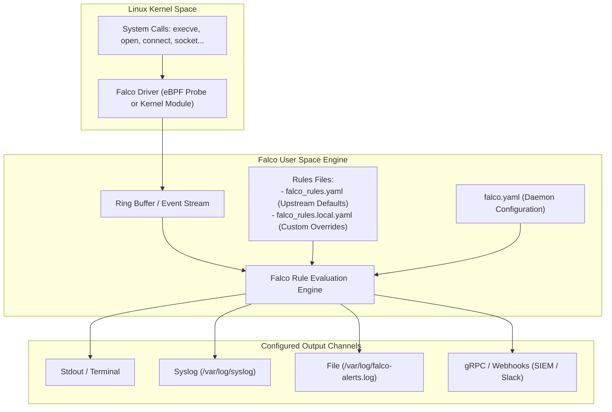

# Module 0-7-6: Monitoring, Logging & Runtime Security Masterclass

**Breadcrumbs:** [[0-Index - Kubernetes|🏠 Kubernetes Reference MOC]] > [[0-Index - CKS|🛡️ CKS Reference MOC]] > **Module 0-7-6**

> [!ABSTRACT] 📚 Course Alignment & Module Scope
> **Course:** KodeKloud Certified Kubernetes Security Specialist (CKS)
> **Section:** Monitoring, Logging and Runtime Security
> **Source Files:** `inflow/cks_split/06_monitoring_logging_runtime_security.md`
> **Topics Covered:** Runtime Threat Detection Philosophy, Mutable vs. Immutable Infrastructure, Ensuring Container Immutability at Runtime, Behavioral Analytics of Syscalls, Falco Architecture & Installation (eBPF vs Kernel Module), Falco Configuration Hierarchy, Writing Custom Falco Detection Rules, Kubernetes API Server Auditing & Audit Policies, and Log Forensics with `jq`.

---

## 🧭 Table of Contents
1. [Runtime Security Overview & Defense-in-Depth Philosophy](#1--runtime-security-overview--defense-in-depth-philosophy)
2. [Mutable vs. Immutable Infrastructure: Enforcing Container Immutability](#2--mutable-vs-immutable-infrastructure-enforcing-container-immutability)
3. [Behavioral Analytics of Linux System Calls (Syscalls)](#3--behavioral-analytics-of-linux-system-calls-syscalls)
4. [Falco Architecture, Drivers & Installation](#4--falco-architecture-drivers--installation)
5. [Falco Configuration Files & Hierarchy](#5--falco-configuration-files--hierarchy)
6. [Writing Custom Falco Detection Rules (Step-by-Step)](#6--writing-custom-falco-detection-rules-step-by-step)
7. [Validating, Reloading & Testing Falco Alerts](#7--validating-reloading--testing-falco-alerts)
8. [Kubernetes API Server Auditing & Policy Forensics](#8--kubernetes-api-server-auditing--policy-forensics)
9. [Runtime Tool Comparison: Falco vs. AquaSec Tracee vs. Tetragon](#9--runtime-tool-comparison-falco-vs-aquasec-tracee-vs-tetragon)
10. [Deep-Intuition Diagnostic Analyses (AARF)](#10--deep-intuition-diagnostic-analyses-aarf)
11. [CKS Exam Speed Hacks & Runtime Security Cheatsheet](#11--cks-exam-speed-hacks--runtime-security-cheatsheet)
12. [Course Walkthrough Navigation](#12--course-walkthrough-navigation)

---

## 1. 🔍 Runtime Security Overview & Defense-in-Depth Philosophy

In the **4Cs of Cloud Native Security**, static defenses (image scanning, KubeLinter, Pod Security Standards, NetworkPolicies) secure the perimeter *before* containers start. However, static defenses cannot protect against:
* Zero-day application vulnerabilities (e.g. unauthenticated Remote Code Execution).
* Malicious insider activity or compromised credentials.
* Fileless memory exploits and unauthorized background shells.

**Runtime Security** monitors active container processes and kernel events in real time to detect, alert, and neutralize threats the moment malicious behavior occurs.



---

## 2. 🧊 Mutable vs. Immutable Infrastructure: Enforcing Container Immutability

### 2.1 The Philosophy of Immutability
* **Mutable Infrastructure (Anti-Pattern):** Containers modified in-place by operators or automated scripts (e.g. running `apt-get update`, installing debugging tools, editing configuration files directly inside running containers). This leads to **configuration drift**, untracked changes, and makes forensic investigation impossible.
* **Immutable Infrastructure (CKS Best Practice):** Once a container image is compiled and deployed, it is **never modified**. If a patch, bug fix, or configuration change is required, a new container image is built, scanned, tested, and redeployed.

### 2.2 Enforcing Immutability at Runtime
To prevent attackers from downloading recon tools, compiling exploits, or modifying configuration files, lock down the container filesystem:

```yaml
apiVersion: v1
kind: Pod
metadata:
  name: immutable-workload
spec:
  containers:
    - name: web
      image: nginx:alpine
      securityContext:
        # 1. Mount container root filesystem as strictly read-only:
        readOnlyRootFilesystem: true
        # 2. Prevent binary privilege escalation:
        allowPrivilegeEscalation: false
        # 3. Enforce non-root execution:
        runAsNonRoot: true
        runAsUser: 101
      # 4. Provide isolated in-memory storage strictly for necessary temporary files:
      volumeMounts:
        - mountPath: /tmp
          name: temp-volume
        - mountPath: /var/cache/nginx
          name: cache-volume
        - mountPath: /var/run
          name: run-volume
  volumes:
    - name: temp-volume
      emptyDir: {}
    - name: cache-volume
      emptyDir: {}
    - name: run-volume
      emptyDir: {}
```

---

## 3. ⚡ Behavioral Analytics of Linux System Calls (Syscalls)

Every operation performed by a container process—opening files, spawning sub-processes, establishing network connections—must invoke a **System Call (Syscall)** to the underlying Linux kernel.

### 3.1 Syscall Target Profiles in Common Attacks

| System Call | Legitimate Operation | Malicious Behavioral Indicator |
| :--- | :--- | :--- |
| `execve` | Starting application entrypoint (`/app/server`). | Spawning an interactive shell (`/bin/sh`, `/bin/bash`, `nc`, `nmap`) inside a production web server. |
| `open` / `openat` | Reading application templates or static assets. | Opening sensitive host credentials (`/etc/shadow`, `/var/run/secrets/kubernetes.io/serviceaccount`). |
| `connect` / `socket`| Querying backend database or DNS server. | Outbound connection to unknown external IP, IRC port, or cryptocurrency mining pool. |
| `ptrace` | Developer debugging (rare in production). | Code injection, memory scraping, or process inspection of sibling processes. |
| `setns` / `unshare`| Container runtime setting up namespaces. | Container breakout attempting to attach to the host PID or mount namespace. |

---

## 4. 🦅 Falco Architecture, Drivers & Installation

**Falco** (a CNCF Graduated project originally created by Sysdig) is the de-facto cloud-native runtime security engine.



### 4.1 Driver Modes: Kernel Module vs. Modern eBPF
* **Kernel Module (`falco-kmod`):** High performance, but requires compiling a kernel module matching the exact host kernel headers. Can potentially cause node instability if a kernel panic occurs.
* **eBPF Probe (`falco-bpf` / Modern BPF):** Safe, verified by the in-kernel eBPF verifier, cannot crash the kernel, and works seamlessly on immutable Linux hosts (GKE COS, Bottlerocket).

### 4.2 Installing and Verifying Falco on Debian/Ubuntu
```bash
# 1. Add Falco repository:
curl -fsSL https://falco.org/repo/falcosecurity-packages.asc | sudo gpg --dearmor -o /usr/share/keyrings/falco-archive-keyring.gpg
echo "deb [signed-by=/usr/share/keyrings/falco-archive-keyring.gpg] https://download.falco.org/packages/deb stable main" | sudo tee /etc/apt/sources.list.d/falcosecurity.list

# 2. Install Falco:
apt-get update && apt-get install -y falco

# 3. Check service status:
systemctl status falco
```

---

## 5. 📁 Falco Configuration Files & Hierarchy

Understanding the file structure is vital on the CKS exam to avoid accidentally overwriting upstream rules:

```text
/etc/falco/
├── falco.yaml                # Main daemon configuration (outputs, log levels, rule file paths)
├── falco_rules.yaml          # Default community rules (DO NOT EDIT DIRECTLY; updated on package upgrade)
├── falco_rules.local.yaml    # Custom user-defined rules and overrides (CKS EXAM TARGET!)
└── rules.d/                  # Modular directory for supplemental custom rule files
```

### 5.1 Main Daemon Configuration (`/etc/falco/falco.yaml`)
Controls where Falco reads rules and where it sends alert messages:

```yaml
# /etc/falco/falco.yaml
rules_files:
  - /etc/falco/falco_rules.yaml
  - /etc/falco/falco_rules.local.yaml
  - /etc/falco/rules.d

# Output configurations:
stdout_output:
  enabled: true

syslog_output:
  enabled: true

file_output:
  enabled: true
  keep_alive: false
  filename: /var/log/falco-events.log

# Minimum priority level to emit (e.g. notice, warning, error, critical):
priority: notice
```

---

## 6. ✍️ Writing Custom Falco Detection Rules (Step-by-Step)

### 6.1 The Anatomy of a Falco Rule
Every Falco rule is written in YAML and contains six essential keys:

```yaml
- rule: Rule Name
  desc: Human-readable description of the security threat
  condition: <Boolean expression using Falco event fields, macros, and lists>
  output: "Alert message formatting string with %fields (user=%user.name pod=%k8s.pod.name)"
  priority: <CRITICAL | ERROR | WARNING | NOTICE | INFO | DEBUG>
  tags: [security, cks, container]
```

### 6.2 Falco Priority Levels (Syslog RFC 5424)

| Priority | Severity Level | Exam & Production Use Case |
| :--- | :--- | :--- |
| **`EMERGENCY`** | System unusable | Kernel corruption, hardware failure. |
| **`ALERT`** | Immediate action required | Host root compromise, privilege escalation to host. |
| **`CRITICAL`** | Critical conditions | Unauthorized shell spawned in sensitive production container. |
| **`ERROR`** | Error conditions | Failed privilege escalation attempts, access denied. |
| **`WARNING`** | Warning conditions | Unexpected network scanner invoked (`nmap`, `netcat`). |
| **`NOTICE`** | Normal but significant | Standard non-root file modifications in `/etc`. |
| **`INFO`** | Informational | Routine package installation. |
| **`DEBUG`** | Diagnostic trace | Detailed syscall debugging. |

### 6.3 Essential Falco Field Selectors

| Field Name | Description & Example Output |
| :--- | :--- |
| `container.id` | The unique hex container ID (e.g. `174e320b98f9`). |
| `container.name` | The name of the container (e.g. `nginx`, `web-backend`). |
| `container.image.repository` | The image repository (e.g. `docker.io/library/nginx`). |
| `k8s.pod.name` | The Kubernetes Pod name (e.g. `web-backend-789df-xk29v`). |
| `k8s.ns.name` | The Kubernetes Namespace (e.g. `production`, `finance`). |
| `proc.name` | The binary name executing the syscall (e.g. `bash`, `cat`, `curl`). |
| `proc.pname` | The parent process name that spawned the current process (e.g. `systemd`, `nginx`). |
| `proc.cmdline` | The full command-line with arguments (e.g. `cat /etc/shadow`). |
| `fd.name` | The file descriptor or target file path accessed (e.g. `/etc/shadow`, `/tmp/exploit.sh`). |
| `user.name` | The username associated with the process UID (e.g. `root`, `www-data`). |

### 6.4 Real-World Rule Implementations (`/etc/falco/falco_rules.local.yaml`)

#### Rule 1: Detect Terminal Shell Spawned Inside a Container (CKS Classic)
```yaml
- rule: Shell Spawned in Container
  desc: Detects when a shell process is launched inside an active container
  condition: >
    container.id != host and
    evt.type = execve and
    evt.dir = < and
    proc.name in (bash, sh, zsh, ksh, csh)
  output: "WARNING: Shell spawned in container (user=%user.name container=%container.name pod=%k8s.pod.name cmd=%proc.cmdline)"
  priority: WARNING
  tags: [container, shell, cks]
```

#### Rule 2: Detect Unauthorized Read of Sensitive Files (`/etc/shadow`)
```yaml
- rule: Sensitive File Read Attempt
  desc: Detects opening /etc/shadow or /etc/sudoers for reading
  condition: >
    open_read and
    fd.name in (/etc/shadow, /etc/sudoers) and
    not proc.name in (passwd, sudo, chage)
  output: "CRITICAL: Sensitive file read attempt (user=%user.name file=%fd.name cmd=%proc.cmdline container=%container.name)"
  priority: CRITICAL
  tags: [filesystem, credentials, cks]
```

#### Rule 3: Detect Network Scanner Tools Executed in Pods
```yaml
- rule: Network Scanner Execution
  desc: Detects network reconnaissance utilities launched inside containers
  condition: >
    spawned_process and
    container.id != host and
    proc.name in (nmap, nc, netcat, tcpdump, tshark, ncat)
  output: "ALERT: Network scanner executed in pod (pod=%k8s.pod.name ns=%k8s.ns.name user=%user.name binary=%proc.name cmd=%proc.cmdline)"
  priority: ALERT
  tags: [network, reconnaissance, cks]
```

---

## 7. 🧪 Validating, Reloading & Testing Falco Alerts

### 7.1 Validating Rule Syntax
Before restarting the service, **always validate your custom rules file**. A syntax error in Falco rules will prevent the daemon from starting:

```bash
# Test Falco syntax on configuration and rules:
falco --validate /etc/falco/falco_rules.local.yaml
# Expected success output:
# [INFO] Rules file /etc/falco/falco_rules.local.yaml: Ok
```

### 7.2 Reloading Falco Without Downtime
```bash
# Option A: Send SIGHUP to hot-reload rules:
kill -1 $(pgrep falco)

# Option B: Restart systemd service:
systemctl restart falco
systemctl status falco
```

### 7.3 Triggering and Observing Real-Time Alerts
```bash
# 1. Stream Falco alerts from syslog in the foreground:
journalctl -u falco -f
# or:
tail -f /var/log/syslog | grep falco

# 2. In another terminal, trigger the rule (e.g. spawn a shell in a pod):
kubectl exec -it <pod-name> -- /bin/sh

# 3. Observe the generated alert in syslog:
# Jul 15 11:22:30 node01 falco: WARNING: Shell spawned in container (user=root container=nginx pod=web-app cmd=sh)
```

---

## 8. 📜 Kubernetes API Server Auditing & Policy Forensics

While Falco monitors syscalls in the Linux kernel, **Kubernetes API Server Auditing** provides a chronological record of all administrative operations performed against the cluster control plane.

```mermaid
flowchart TD
    User([User / ServiceAccount / Attacker]) -->|REST Call: DELETE /api/v1/namespaces/prod/secrets| API[Kube-APIServer]
    API --> AuditEngine[Audit Policy Filter (/etc/kubernetes/audit-policy.yaml)]
    AuditEngine -->|Matches Rule| LogEntry[Audit Log (/var/log/kubernetes/audit/audit.log)]
    LogEntry --> Analyst[Security Forensics with jq]
```

### 8.1 Production Audit Policy (`/etc/kubernetes/audit-policy.yaml`)
```yaml
apiVersion: audit.k8s.io/v1
kind: Policy
rules:
  # 1. Do not log read-only health checks:
  - level: None
    nonResourceURLs:
      - /healthz*
      - /metrics*
      - /version

  # 2. Log Secrets and ConfigMaps at RequestResponse level:
  - level: RequestResponse
    resources:
      - group: ""
        resources: ["secrets", "configmaps"]

  # 3. Log RBAC modifications at RequestResponse level:
  - level: RequestResponse
    resources:
      - group: "rbac.authorization.k8s.io"
        resources: ["roles", "rolebindings", "clusterroles", "clusterrolebindings"]

  # 4. Log all other pod lifecycle actions at Metadata level:
  - level: Metadata
    resources:
      - group: ""
        resources: ["pods"]
```

### 8.2 Forensics Log Analysis with `jq`

```bash
# 1. Find all attempts to read or delete Secrets in production:
cat /var/log/kubernetes/audit/audit.log | jq -r 'select(.objectRef.resource=="secrets" and .objectRef.namespace=="production") | "\(.requestReceivedTimestamp) [\(.verb)] User: \(.user.username) Secret: \(.objectRef.name)"'

# 2. Audit who executed `kubectl exec` into pods:
cat /var/log/kubernetes/audit/audit.log | jq -r 'select(.verb=="create" and .objectRef.subresource=="exec") | "\(.requestReceivedTimestamp) User: \(.user.username) Pod: \(.objectRef.name) NS: \(.objectRef.namespace)"'

# 3. Find all 403 Forbidden authorization rejections:
cat /var/log/kubernetes/audit/audit.log | jq -r 'select(.responseStatus.code==403) | "\(.requestReceivedTimestamp) User: \(.user.username) Verb: \(.verb) Resource: \(.objectRef.resource)"'
```

---

## 9. ⚖️ Runtime Tool Comparison: Falco vs. AquaSec Tracee vs. Tetragon

| Capability | Falco (Sysdig / CNCF) | AquaSec Tracee | Isovalent Tetragon (eBPF) |
| :--- | :--- | :--- | :--- |
| **Primary Mechanism** | eBPF probe / Kernel Module | Modern eBPF probes | In-kernel eBPF kernel hooks |
| **Detection Scope** | Syscall anomaly detection via rule engine. | Low-level syscall events & behavioral signatures. | Syscall & network packet tracing with in-kernel enforcement. |
| **Rule Language** | Falco YAML + Boolean macro expressions. | Go / Rego signatures. | Kubernetes CRDs (`TracingPolicy`). |
| **In-Kernel Kill** | Passive (Alerts only; needs FalcoSidekick). | Passive (Alerts only). | **Active in-kernel SIGKILL enforcement.** |
| **CKS Exam Focus** | **Primary CKS Testing Target.** | Supplemental context. | Modern enterprise production. |

---

## 10. 🔍 Deep-Intuition Diagnostic Analyses (AARF)

### Scenario 1: Falco Service Fails to Start Due to YAML Formatting or Macro Syntax Error
* **The Answer:** Run `falco --validate /etc/falco/falco_rules.local.yaml` to identify the line number and syntax error. Fix indentation or missing parenthesis in the `condition` field, then restart.
* **The Assumptions:** The administrator authored a custom rule in `/etc/falco/falco_rules.local.yaml` and executed `systemctl restart falco`.
* **The Rationale (Why):** Falco parses all YAML rule files during initialization. If a rule condition has mismatched quotes, invalid operators, or misspelled field names (`proc_name` instead of `proc.name`), the parser terminates with a fatal configuration error.
* **The Failure Loop (What if not):** `systemctl status falco` reports `Active: failed (Result: exit-code)`. `journalctl -u falco` outputs `Falco rules compilation failed: unknown field 'proc_name' at line 45`.
* **The Alternative Case:** If custom rules must be deployed dynamically across clusters, use the Falco Helm chart with automated CI linting stages before pushing rule updates to nodes.

### Scenario 2: High Syscall Volume Causes Falco Event Drops
* **The Answer:** Tune the ring buffer size in `/etc/falco/falco.yaml` (`buffer_packing: true`), increase kernel buffer memory, or filter out noisy, high-frequency processes in custom macros (`not proc.name in (datadog-agent, prometheus)`).
* **The Assumptions:** High-throughput production nodes processing thousands of web requests per second.
* **The Rationale (Why):** System calls pass from the kernel probe to user space via a ring buffer. If user space Falco cannot process events fast enough, the kernel drops events to prevent starving CPU cycles.
* **The Failure Loop (What if not):** Falco outputs `Notice: Events was dropped by the driver: 4523 events lost`. Critical security intrusions that occurred during the burst are never detected.
* **The Alternative Case:** In ultra-high-throughput environments, use Tetragon which evaluates and filters events directly inside the Linux kernel using eBPF, eliminating user-space ring buffer copying entirely.

### Scenario 3: Container Immutability Breaks Web Application Cache
* **The Answer:** Mount an `emptyDir` volume specifically at the application's required writable directory (e.g. `/var/cache/nginx` or `/tmp`), keeping the root filesystem read-only.
* **The Assumptions:** An engineer added `securityContext.readOnlyRootFilesystem: true` to an NGINX pod manifest.
* **The Rationale (Why):** NGINX writes client request bodies and fastcgi cache files to `/var/cache/nginx` and its PID file to `/var/run/nginx.pid`. If the entire rootfs is read-only without targeted writable mounts, NGINX crashes immediately.
* **The Failure Loop (What if not):** The pod enters `CrashLoopBackOff`. Logs report `nginx: [emerg] open() "/var/run/nginx.pid" failed (30: Read-only file system)`.
* **The Alternative Case:** If the application requires saving persistent data across container restarts, mount a PersistentVolumeClaim (PVC) rather than an ephemeral `emptyDir`.

---

## 11. ⚡ CKS Exam Speed Hacks & Runtime Security Cheatsheet

```bash
# 1. Quick Falco rule syntax validation:
falco --validate /etc/falco/falco_rules.local.yaml

# 2. Hot-reload Falco after editing rules:
kill -1 $(pgrep falco)

# 3. Stream Falco alerts live:
journalctl -u falco -f -n 50

# 4. Check if container root filesystem is read-only:
kubectl get pod <pod-name> -o jsonpath='{.spec.containers[*].securityContext.readOnlyRootFilesystem}'

# 5. Quick test for container immutability:
kubectl exec -it <pod-name> -- touch /root/test.txt

# 6. Check if API server audit logging is enabled:
grep 'audit-policy-file' /etc/kubernetes/manifests/kube-apiserver.yaml

# 7. Quick audit log query for secret modifications:
tail -n 100 /var/log/kubernetes/audit/audit.log | jq -r 'select(.objectRef.resource=="secrets") | .user.username'
```

---

## 12. 🔗 Course Walkthrough Navigation

* ⬅️ **Previous Module:** [[Reference Notes/0-7-5_supply_chain_security.md|Module 0-7-5: Supply Chain Security]]
* 🎓 **Curriculum Complete:** You have completed all 6 modules of the CKS Course Reference Walkthrough!
* 🚀 **Next Step - Hands-On Exam Hardening:** [[Projects/CKS/Practice Playbook - CKS Exam Hardening and Speed Hacks.md|🛡️ CKS Exam Practice Playbook (19 Hardening Scenarios & Speed Hacks)]]
* 🏠 **CKS Master Index:** [[Reference Notes/0-Index - CKS.md|🛡️ CKS Certification Reference MOC]]
* 🌐 **Official Falco Documentation:** [Falco Rules Documentation](https://falco.org/docs/rules/)
