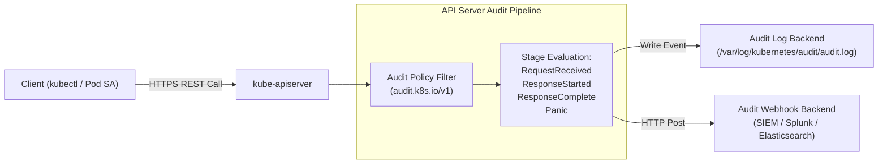
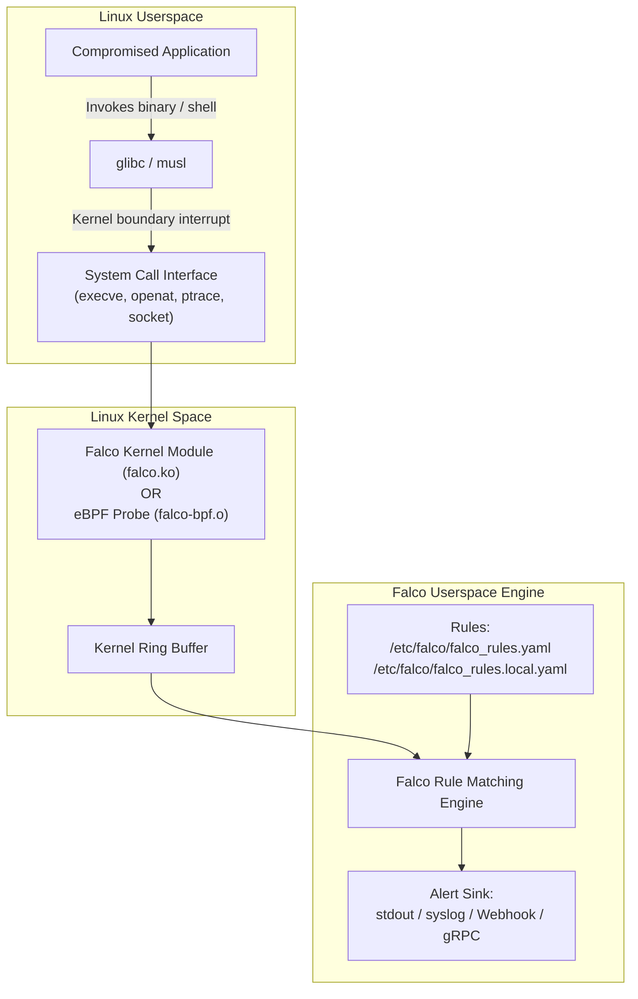
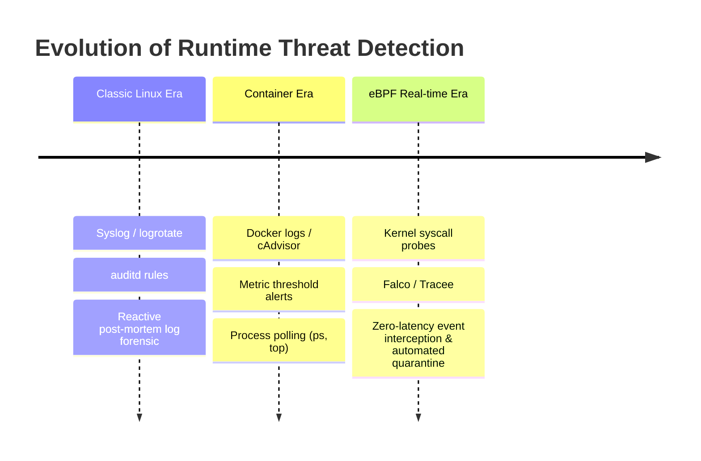

# Module 0-7-6: Runtime Security, Syscall Threat Detection (Falco) & Kubernetes API Auditing

**Breadcrumbs:** [[0-Index - Kubernetes|🏠 Kubernetes Reference MOC]] > [[0-Index - CKS|🛡️ CKS Reference MOC]] > **Module 0-7-6**

---

## 1. Kubernetes API Auditing Architecture

Kubernetes API Auditing provides a chronological, tamper-evident record of all operations, mutations, and queries submitted to the `kube-apiserver`. It records *who* executed *what*, *when*, and from *where*.



### 1.1 Audit Stages
Each incoming API request traverses four distinct stages:
1. `RequestReceived`: Generated when the request header is first received by the API handler, prior to authentication, authorization, or admission.
2. `ResponseStarted`: Generated once the HTTP response headers are sent, but before the response body is streamed (relevant for long-running `watch` requests).
3. `ResponseComplete`: Generated when the response body has completed streaming and the request is finalized.
4. `Panic`: Generated if an internal unhandled panic occurs while processing the request.

---

### 1.2 Audit Levels

| Level | Data Recorded | Typical Use Case |
| :--- | :--- | :--- |
| `None` | Do not log events matching this rule. | High-frequency endpoints (e.g., `kube-proxy` polling endpoints, health checks `/healthz`, `/livez`). |
| `Metadata` | Request user, timestamp, HTTP verb, resource, namespace, API group, and response status code. Does **NOT** record request/response body payloads. | Standard workload operations, Secret metadata audits. |
| `Request` | Records `Metadata` plus the full request body payload. Does not log response body. | Auditing resource creation/mutation specs without storing large returned outputs. |
| `RequestResponse` | Records `Metadata`, request body, and response body payloads. | Critical control plane objects (Roles, RoleBindings, ClusterRoles, PodSecurity changes). |

> [!CAUTION]
> **Strict Secret Security Rule:** Never audit `Secrets` or `ConfigMaps` at the `Request` or `RequestResponse` levels. Doing so will dump raw, sensitive credentials (tokens, private keys) directly into plaintext log files on the host disk! Always audit Secrets at the `Metadata` level.

---

### 1.3 Step-by-Step API Audit Policy Configuration

#### Step 1: Define the Audit Policy (`/etc/kubernetes/audit-policy.yaml`)

Rules are evaluated in top-to-bottom order; the **first matching rule** dictates the audit level for that request:

```yaml
apiVersion: audit.k8s.io/v1
kind: Policy
# Drop RequestReceived stage events for all rules to reduce log volume
omitStages:
  - "RequestReceived"
rules:
  # 1. Do not log read-only requests for system components and health endpoints
  - level: None
    users: ["system:kube-proxy"]
    verbs: ["watch"]
    resources:
      - group: "" # Core API group
        resources: ["endpoints", "services", "services/status"]

  - level: None
    nonResourceURLs:
      - "/healthz*"
      - "/version"
      - "/swagger*"
      - "/livez*"
      - "/readyz*"

  # 2. Audit Secret and ConfigMap mutations at Metadata level only (Prevents credential leakage)
  - level: Metadata
    resources:
      - group: ""
        resources: ["secrets", "configmaps"]

  # 3. Log high-risk authorization mutations at full RequestResponse level
  - level: RequestResponse
    resources:
      - group: "rbac.authorization.k8s.io"
        resources: ["roles", "rolebindings", "clusterroles", "clusterrolebindings"]

  # 4. Log core workload lifecycle events at Request level
  - level: Request
    resources:
      - group: ""
        resources: ["pods", "pods/exec", "pods/portforward"]
      - group: "apps"
        resources: ["deployments", "statefulsets", "daemonsets"]

  # 5. Catch-all: Log everything else at Metadata level
  - level: Metadata
    omitStages:
      - "RequestReceived"
```

#### Step 2: Configure `kube-apiserver.yaml`
Add audit flags and host volume mounts to `/etc/kubernetes/manifests/kube-apiserver.yaml`:

```yaml
spec:
  containers:
  - name: kube-apiserver
    command:
    - kube-apiserver
    # Audit logging flags
    - --audit-policy-file=/etc/kubernetes/audit-policy.yaml
    - --audit-log-path=/var/log/kubernetes/audit/audit.log
    - --audit-log-maxage=30
    - --audit-log-maxbackup=10
    - --audit-log-maxsize=100
    volumeMounts:
    - mountPath: /etc/kubernetes/audit-policy.yaml
      name: audit-policy
      readOnly: true
    - mountPath: /var/log/kubernetes/audit
      name: audit-logs
      readOnly: false
  volumes:
  - hostPath:
      path: /etc/kubernetes/audit-policy.yaml
      type: File
    name: audit-policy
  - hostPath:
      path: /var/log/kubernetes/audit
      type: DirectoryOrCreate
    name: audit-logs
```

---

### 1.4 Analyzing Audit Logs with `jq`

```bash
# Filter all Secret modification attempts by unauthorized users
cat /var/log/kubernetes/audit/audit.log | jq -r '
  select(.objectRef.resource=="secrets" and (.verb=="create" or .verb=="delete" or .verb=="patch")) | 
  "\(.stageTimestamp) User: \(.user.username) Verb: \(.verb) Resource: \(.objectRef.name) NS: \(.objectRef.namespace) Status: \(.responseStatus.code)"
'

# Inspect who executed `kubectl exec` inside a pod
cat /var/log/kubernetes/audit/audit.log | jq -r '
  select(.verb=="create" and .objectRef.subresource=="exec") |
  "\(.stageTimestamp) User: \(.user.username) TargetPod: \(.objectRef.name) Namespace: \(.objectRef.namespace)"
'
```

---

## 2. Linux Kernel System Calls & Behavioral Threat Modeling

Container runtimes share the underlying host Linux kernel. When an attacker breaks through an application container, their malicious payload must execute **system calls (syscalls)** against the kernel to interact with files, processes, memory, and sockets.



### Critical Syscalls Targeted in Container Attacks:
* `execve` / `execveat`: Spawning new processes, shells (`/bin/sh`, `/bin/bash`), or unauthorized binaries.
* `open` / `openat`: Opening sensitive system files (`/etc/shadow`, `/etc/kubernetes/pki/...`, `/proc/kcore`).
* `connect` / `bind`: Initiating unauthorized outbound C2 (Command & Control) or lateral movement sockets.
* `setuid` / `setgid`: Escalating process execution privileges.
* `ptrace`: Attaching to foreign processes for memory dumping or code injection.

---

## 3. Falco Runtime Threat Detection

**Falco** is the de facto CNCF runtime security monitoring engine. It intercepts system calls directly at the kernel boundary using either a kernel module or an extended Berkeley Packet Filter (eBPF) driver, and evaluates them in real-time against customizable security rules.

### 3.1 Falco File Layout & Hierarchy
* **Main Daemon Configuration:** `/etc/falco/falco.yaml` (Defines engine settings, output sinks, log format, gRPC services).
* **Default Upstream Rules:** `/etc/falco/falco_rules.yaml` (Maintained by Falco; do not edit directly, as package upgrades will overwrite changes).
* **Local Custom Rules:** `/etc/falco/falco_rules.local.yaml` (Overrides and custom enterprise rules; preserved across upgrades).

### 3.2 Falco Priority Levels (Syslog Standard)
1. `EMERGENCY`: System is unusable.
2. `ALERT`: Action must be taken immediately.
3. `CRITICAL`: Critical system condition.
4. `ERROR`: Error conditions.
5. `WARNING`: Warning conditions.
6. `NOTICE`: Normal but significant condition.
7. `INFO`: Informational messages.
8. `DEBUG`: Debug-level messages.

---

### 3.3 Anatomy of a Falco Rule

A standard rule block consists of five fundamental fields:

```yaml
- rule: Terminal Shell Spawned in Container
  desc: Detect attempts to spawn an interactive shell inside a running pod container
  condition: >
    spawned_process and 
    container and 
    shell_procs and 
    not user_expected_terminal_shell_executions
  output: >
    Shell spawned in container (user=%user.name user_loginuid=%user.loginuid 
    process=%proc.name parent=%proc.pname cmdline=%proc.cmdline 
    container_id=%container.id container_name=%container.name image=%container.image.repository)
  priority: WARNING
  tags: [container, shell, mitre_execution]
```

### 3.4 Key Condition Fields and Operators
* `evt.type`: Syscall event name (`execve`, `open`, `read`, `write`, `setuid`).
* `evt.dir`: Event direction: `<` (return from syscall), `>` (invocation of syscall).
* `proc.name`: The executable binary name executing the event (e.g. `bash`, `python`, `nmap`).
* `proc.pname`: The parent process name (e.g. `dockerd`, `containerd-shim`, `systemd`).
* `container.id`: Unique container ID string (`host` indicates the event occurred on the host node directly).
* `container.name`: The name assigned to the container inside Kubernetes.
* `k8s.ns.name`: The Kubernetes namespace where the pod is located.
* `fd.name`: The targeted file descriptor name or path (e.g. `/etc/shadow`, `/etc/hosts`).

---

### 3.5 Writing Real-World Custom Rules (`/etc/falco/falco_rules.local.yaml`)

#### Scenario 1: Detect Container Process Writing to `/etc`
```yaml
- rule: Unauthorized Write Under /etc in Container
  desc: Detect any process modifying files under /etc inside a Kubernetes container
  condition: >
    open_write and 
    container and 
    fd.name startswith /etc and 
    not package_mgmt_procs
  output: >
    Unauthorized file write under /etc (file=%fd.name proc=%proc.name 
    cmdline=%proc.cmdline container=%container.name ns=%k8s.ns.name)
  priority: CRITICAL
  tags: [filesystem, container, persistence]
```

#### Scenario 2: Detect Unauthorized Network Scanner Executed
```yaml
- list: network_scanners
  items: [nmap, masscan, zmap, netcat, nc]

- rule: Network Scanning Tool Executed in Pod
  desc: Detect execution of offensive reconnaissance network tools inside a pod
  condition: >
    spawned_process and 
    container and 
    proc.name in (network_scanners)
  output: >
    Recon tool detected (user=%user.name tool=%proc.name cmdline=%proc.cmdline 
    container=%container.name pod=%k8s.pod.name ns=%k8s.ns.name)
  priority: ALERT
  tags: [reconnaissance, container]
```

---

### 3.6 Managing and Verifying Falco Services

```bash
# 1. Validate Falco rule syntax before restarting service
falco --validate /etc/falco/falco_rules.local.yaml

# 2. Restart and enable Falco service
systemctl restart falco
systemctl status falco

# 3. Stream real-time alerts
journalctl -u falco -f -n 50

# 4. Trigger a test alert:
kubectl run test-shell --image=busybox --rm -it -- /bin/sh
# Inside the container, run:
cat /etc/shadow

# Check Falco output:
# Output: Alert Unauthorized access to sensitive file /etc/shadow ...
```

---

## 4. 🌉 Evolutionary Conceptual Bridging: Runtime Security



1. **Classic UNIX Era (Batch Auditing):**
   * Relied on `auditd` and standard POSIX syslog facilities.
   * Logs were rotated and shipped asynchronously to remote servers. Attackers routinely disabled `auditd` or truncated log files before defenders could react.
2. **First-Generation Container Era:**
   * Security solutions polled process lists (`ps aux` inside containers or through cgroups) every 30 to 60 seconds.
   * **Failure Mode:** Ephemeral attacks—where a malicious shell executes a payload and self-terminates in under 5 seconds—completely bypassed periodic polling monitors.
3. **Modern Cloud-Native Era (eBPF Kernel Probing):**
   * Falco and Aqua Tracee hook directly into the kernel's tracepoints via eBPF bytecode.
   * Every single system call is evaluated at microsecond latency without patching application source code or requiring sidecar containers.
   * Alerts trigger immediate automated remediation (e.g., Kubernetes admission webhooks, network isolation via Cilium, or instantaneous pod termination).

---

## 5. Summary & Verification Matrix

| Mechanism | Scope | Primary Configuration | Target Exam Skill |
| :--- | :--- | :--- | :--- |
| **API Auditing** | Control plane REST calls (`kube-apiserver`). | `/etc/kubernetes/audit-policy.yaml` + API server static pod manifest. | Creating staged policies, protecting secret payloads, debugging audit logs. |
| **Falco Syscall Rules** | Host & container kernel boundaries. | `/etc/falco/falco_rules.local.yaml` + `systemctl restart falco`. | Rule conditions, macros, outputs, detecting shells/file mutations. |
| **Audit Log Filtering** | Post-incident forensics. | `jq` command-line filtering over `/var/log/kubernetes/audit/audit.log`. | Extracting user, verb, response code, and request payloads. |

<!-- Documentation References -->
[Kubernetes Security Overview](https://kubernetes.io/docs/concepts/security/overview/)
[Kubernetes Admission Controllers Reference](https://kubernetes.io/docs/reference/access-authn-authz/admission-controllers/)
