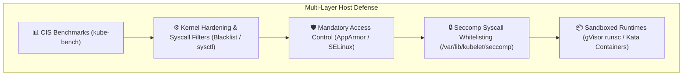

# Module 0-7-7: Host Operating System & Node Hardening

**Breadcrumbs:** [[0-Index - Kubernetes|🏠 Kubernetes Reference MOC]] > [[0-Index - CKS|🛡️ CKS Reference MOC]] > **Module 0-7-7**

> [!NOTE] Companion Module
> Workload-level kernel containment, AppArmor Mandatory Access Control, Linux Capabilities decomposition, system call tracing with strace, Seccomp-BPF filters, and sandboxed runtimes (gVisor/Kata) are codified in **[[Reference Notes/0-7-9_workload_kernel_isolation_seccomp_apparmor_and_capabilities.md|Module 0-7-9: Workload Kernel Isolation, Seccomp, AppArmor & Linux Capabilities]]**.

---

## 1. Host Operating System Hardening & CIS Benchmarks

Securing the host operating systems of both control plane and worker nodes is essential to protecting the Kubernetes cluster. Even perfectly configured RBAC and NetworkPolicies are ineffective if an attacker gains shell access or privilege escalation on the underlying Linux host.



---

## 2. CIS Kubernetes Benchmarks & `kube-bench`

The **Center for Internet Security (CIS)** maintains rigorous, consensus-based configuration guidelines for hardening Kubernetes clusters against modern attack vectors.

### 2.1 The Four Assessment Targets
1. **Master Node Configuration:** File permissions and command-line flags for `kube-apiserver`, `kube-controller-manager`, `kube-scheduler`, and static pod manifests.
2. **etcd Node Configuration:** File permissions, data directory security, TLS client/peer certificates, and authentication.
3. **Control Plane Configuration:** Authentication, authorization modes, admission plugins, and Secret encryption.
4. **Worker Node Configuration:** Kubelet configuration file (`/var/lib/kubelet/config.yaml`), kube-proxy parameters, and container runtime settings.

### 2.2 Running and Remediating with `kube-bench`

`kube-bench` is an automated Go tool that runs the CIS Kubernetes Benchmark tests and provides pass/fail/warn statuses alongside explicit remediation commands:

```bash
# 1. Run kube-bench targeting master control plane components
kube-bench run --targets master

# 2. Run kube-bench targeting worker node kubelet configurations
kube-bench run --targets node

# 3. Output results as JSON for compliance reporting
kube-bench run --outputfile cis-audit-report.json --json
```

### 2.3 Common CIS Remediations on Master Nodes

| Test ID | CIS Requirement | Remediation Command / Configuration |
| :--- | :--- | :--- |
| **1.1.1** | Ensure API server pod manifest permissions are `600` or more restrictive. | `chmod 600 /etc/kubernetes/manifests/kube-apiserver.yaml` |
| **1.1.11** | Ensure etcd data directory ownership is `etcd:etcd`. | `chown -R etcd:etcd /var/lib/etcd` |
| **1.2.1** | Ensure `--anonymous-auth=false` on `kube-apiserver`. | Add `- --anonymous-auth=false` to `kube-apiserver.yaml`. |
| **1.2.18** | Ensure `--insecure-bind-address` is not set. | Remove any insecure port or bind address flags from the manifest. |
| **4.2.1** | Ensure `--anonymous-auth` is false in Kubelet config. | In `/var/lib/kubelet/config.yaml`, set `authentication.anonymous.enabled: false`. |
| **4.2.2** | Ensure Kubelet authorization mode is Webhook. | In `/var/lib/kubelet/config.yaml`, set `authorization.mode: Webhook`. |

---

## 3. Host Network, Service & Process Hardening

### 3.1 Auditing Open Ports, Listening Sockets & Connection Queues

Attackers routinely exploit unmonitored or unauthenticated background daemons listening on node network interfaces. Auditing sockets requires understanding socket states, connection counts, and the kernel queue architecture.

#### 3.1.1 Discovery of Active Listening Sockets (`ss` vs `lsof`)
```bash
# Inspect all listening TCP and UDP sockets with process names and PIDs
ss -tulpn

# Alternative discovery using lsof
lsof -i -P -n | grep LISTEN
```
* **`ss` flags decomposition:**
  * `-t`: TCP sockets only.
  * `-u`: UDP sockets only.
  * `-l`: Sockets in `LISTEN` state (filters out active data-carrying connections).
  * `-p`: Displays process name and PID owning the file descriptor (requires `sudo`/root).
  * `-n`: Numeric representation (prevents slow DNS reverse lookups and port name translations).

---

#### 3.1.2 The Dual Meaning of `Recv-Q` and `Send-Q` (`LISTEN` vs `ESTABLISHED`)

A critical nuance in Linux networking tools (`ss` and `netstat`) is that the exact same table columns—`Recv-Q` and `Send-Q`—represent **completely different metrics** depending on the socket's operational state:

```mermaid
flowchart TD
    subgraph ListenSocket ["1. The Front Door (State: LISTEN)"]
        Door["Listening Socket\n(e.g. 0.0.0.0:6443)"]
        Queue["The Accept Backlog Queue\nSend-Q = Queue capacity limit (listen backlog)\nRecv-Q = Completed handshakes waiting for accept()"]
    end

    subgraph EstablishedSocket ["2. The Active Channel (State: ESTABLISHED)"]
        Table["Data Channel Socket\n(192.168.1.10:6443 ➔ 192.168.1.50:48922)"]
        Buffer["Data Flow Buffers\nRecv-Q = Bytes in buffer waiting to be read()\nSend-Q = Bytes sent, awaiting TCP ACK"]
    end

    Door --> Queue
    Queue -->|Application calls accept()| Table
    Table --> Buffer
```

##### 1. When Socket State is `ESTABLISHED` (Active Data Exchange)
The metrics represent **BYTES of payload data in memory buffers**:
* **`Recv-Q` (Receive Queue):** Bytes of data received by the network interface and buffered by the kernel that the user-space process has **not yet read** (via `read()` or `recv()`).
* **`Send-Q` (Send Queue):** Bytes of data queued for transmission that have **not yet been acknowledged (ACKed)** by the remote peer.

##### 2. When Socket State is `LISTEN` (Passive Connection Reception)
A listening socket never transfers data payloads; its exclusive role is awaiting the completion of the TCP 3-way handshake. The metrics represent **CONNECTION COUNTS**:
* **`Send-Q` (Queue Capacity Limit):** The **maximum size of the Listen Backlog Queue**. This is the maximum number of completed 3-way handshakes permitted to wait simultaneously. It is configured in the application code via the `listen(fd, backlog)` system call and bounded at the kernel level by `net.core.somaxconn` (typically defaulting to 128 or 4096).
* **`Recv-Q` (Pending Connection Depth):** The **current number of fully completed TCP 3-way handshakes** waiting in the kernel's Accept Queue for the application process to call `accept()`.

---

#### 3.1.3 Measuring & Counting Active Established Connections on a Port

To determine the exact number of active established client connections on a specific service socket (e.g., Kubernetes API server on port `6443` or etcd on `2379`):

```bash
# Count active established connections on port 6443
ss -Htn state established '( sport = :6443 or dport = :6443 )' | wc -l
```
* **`-H` (No Header):** Suppresses the table header row (`State Recv-Q Send-Q...`), ensuring `wc -l` produces an exact numeric count without counting the title row.
* **`state established`:** Restricts matches strictly to active connections, ignoring half-open sockets (`SYN-RECV`), listening sockets (`LISTEN`), or closing sockets (`TIME-WAIT`, `CLOSE-WAIT`).
* **`'( sport = :6443 or dport = :6443 )'`:** Filter expression matching local source or destination port `6443`.

---

#### 3.1.4 Grouping & Auditing Connections by Client IP

During incident response, DDoS mitigation, or thread pool exhaustion investigations, audit which client IP addresses hold the largest volume of open sockets:

```bash
# Group and sort client connections by remote IP address
ss -Htn state established '( sport = :6443 )' | awk '{print $4}' | cut -d: -f1 | sort | uniq -c | sort -nr
```
* **Example Diagnostic Output:**
  ```text
      42  192.168.1.50   # Worker node 01 kubelet daemon
      38  192.168.1.51   # Worker node 02 kubelet daemon
       6  10.244.0.12    # CoreDNS controller pod
       1  192.168.1.100  # Admin bastion session
  ```
  This immediately identifies socket leaks, runaway loops, or rogue nodes flooding the control plane.

---

#### 3.1.5 Global Host Socket Statistics (`ss -s`)
To obtain an instant summary of socket consumption across the entire Linux kernel without scanning individual sockets:
```bash
ss -s
```
* **Output Breakdown:**
  ```text
  Total: 412
  TCP:   38 (estab 14, closed 12, orphaned 0, timewait 8)
  ```
  Reports aggregate counts for established, closing, orphaned, and time-wait TCP sockets directly from the kernel network stack.

---

#### 3.1.6 Kernel Diagnostic: The Overwhelmed Backlog Queue Trap

```text
State      Recv-Q  Send-Q   Local Address:Port
LISTEN     128     128      0.0.0.0:6443
```
* **Diagnostic Interpretation:**
  When `Recv-Q` equals `Send-Q` on a `LISTEN` socket (e.g., `128 128`), the kernel's accept queue is **100% saturated**.
* **Root Cause:** The application (`kube-apiserver`, `etcd`, or ingress controller) is CPU-starved, deadlocked, or thread-blocked, and has stopped invoking `accept()`.
* **System Impact:** All subsequent incoming client connections will be dropped silently (causing client timeouts) or reset with TCP `RST` packets (`Connection refused`).

---

#### 3.1.7 Performance Architecture: `ss` vs. Legacy `netstat`
* **Legacy `netstat` (`/proc/net/tcp`):** Reads and parses `/proc/net/tcp` line by line. On heavily loaded nodes with 50,000+ active connections, reading `/proc/net/tcp` triggers significant kernel context-switching and high CPU overhead, frequently locking terminal sessions.
* **Modern `ss` (`sock_diag` Netlink):** Directly queries the Linux kernel via the **`sock_diag` Netlink subsystem**, transferring binary data structures straight from kernel memory. It processes tens of thousands of sockets in milliseconds.

---

#### 3.1.8 Neutralizing Unnecessary Legacy Daemons
Once an unneeded listening socket is identified:
```bash
# Stop, disable, and mask obsolete legacy services
systemctl stop rpcbind inetd telnet
systemctl disable rpcbind inetd telnet
systemctl mask rpcbind # Symlinks to /dev/null to permanently prevent activation
```

### 3.2 UFW (Uncomplicated Firewall) Architecture & Rule Syntax

UFW operates as a high-level frontend for `iptables` / Netfilter packet filtering. In CKS exams and CIS host hardening scenarios, administrators must enforce least-privilege host firewall policies, restricting control plane ports (`6443`, `2379:2380`, `10250`) and telemetry ports (e.g. `9090`) strictly to authorized subnets or specific nodes.

#### 3.2.1 Firewall Lifecycle & Safe Baseline
```bash
# 1. Enforce default deny incoming, default allow outgoing
ufw default deny incoming
ufw default allow outgoing

# 2. CRITICAL: Always allow SSH prior to activation to prevent administrative lockout
ufw allow 22/tcp

# 3. Enable firewall daemon and inspect verbose status
ufw enable
ufw status verbose
```

#### 3.2.2 Rule Anatomy & The Directional Syntax Model
UFW directional rules follow a strict pattern:
`ufw [allow|deny|reject] [proto <protocol>] from <source> [port <source-port>] to <destination> [port <destination-port>]`

Alternatively:
`ufw [allow|deny] from <source> to <destination> port <port> proto <protocol>`

##### Anatomy of `to any` in Host Rules:
Consider the standard hardening rule:
```bash
ufw allow from 135.22.65.0/24 to any port 9090 proto tcp
```

* **`from 135.22.65.0/24` (Source IP/Subnet):** Matches ingress packets originating strictly from within the `135.22.65.0/24` CIDR block.
* **`to any` (Destination IP Wildcard):** 
  * In UFW syntax, destination port (`port 9090`) is an attribute of the target host. Because the grammar expects `to <destination>`, a target destination placeholder is syntactically required before specifying the port.
  * Specifying **`any`** sets a wildcard destination (`0.0.0.0/0`). It instructs Netfilter to accept the packet regardless of which local network interface (`eth0`, `ens3`, `cni0`, or loopback) or local IP address on this host receives the packet.
* **`port 9090` (Destination Port):** The local listening service port (e.g., Prometheus server / Node Exporter).
* **`proto tcp` (Protocol Enforcement):** Enforces TCP packet validation (dropping UDP and ICMP traffic targeting that port).

##### Multi-Homed Nodes: `to any` vs. Strict Interface Binding
Kubernetes nodes in production typically operate with multiple network interfaces:
* `eth0` / `ens3`: Private cluster overlay / management network (`10.240.0.11`)
* `eth1`: Public WAN / internet-facing interface (`198.51.100.25`)
* `cni0` / `flannel.1`: Container networking bridge

* **With `to any`:** Packets from `135.22.65.0/24` arriving on **either** the public or private interface are permitted.
* **With Strict Host IP Binding (Stricter Hardening):** To prevent port exposure on public or untrusted interfaces, replace `any` with the exact private IP of the node:
  ```bash
  ufw allow from 135.22.65.0/24 to 10.240.0.11 port 9090 proto tcp
  ```

#### 3.2.3 Netfilter & `iptables` Translation Under the Hood
UFW compiles high-level CLI commands into native `iptables` chains (`ufw-user-input`):
```text
-A ufw-user-input -p tcp -s 135.22.65.0/24 -d 0.0.0.0/0 --dport 9090 -j ACCEPT
```
Notice that **`to any`** translates directly to **`-d 0.0.0.0/0`** (destination address wildcard).

#### 3.2.4 Control Plane Service Hardening & Rule Deletion
```bash
# Allow API server access strictly from worker node subnet
ufw allow from 192.168.1.0/24 to any port 6443 proto tcp comment "Kubernetes API Server"

# Allow etcd client/peer traffic strictly from fellow control plane nodes
ufw allow from 192.168.1.10 to any port 2379:2380 proto tcp comment "etcd cluster traffic"

# Allow Kubelet API access strictly from the API server IP
ufw allow from 192.168.1.10 to any port 10250 proto tcp comment "Kubelet API"

# Numbered rules listing (essential for targeted deletion)
ufw status numbered

# Delete rule by its exact index number
ufw delete 3

# Reload firewall state without terminating active connections
ufw reload
```

### 3.3 Linux Kernel Module Blacklisting
Unused kernel network protocols (such as DCCP, SCTP, RDS, TIPC) have historically contained privilege escalation and remote code execution vulnerabilities. Blacklist them to prevent on-demand module loading:

```bash
# Append blacklist configuration to /etc/modprobe.d/blacklist.conf
cat <<EOF >> /etc/modprobe.d/blacklist.conf
blacklist dccp
blacklist sctp
blacklist rds
blacklist tipc
install dccp /bin/true
install sctp /bin/true
EOF

# Unload currently active modules
modprobe -r dccp sctp 2>/dev/null || true
```

### 3.4 Docker Daemon & Container Runtime Socket Security (CKS Core)

The container engine daemon (`dockerd` or `containerd`) operates with elevated privileges on the host node. In traditional Docker environments and hybrid clusters, improper socket exposure or unauthenticated TCP daemon endpoints represent critical security vulnerabilities.

#### 3.4.1 Docker Daemon IPC: Unix Domain Sockets vs. TCP Listeners
* **Local Unix Domain Socket:** By default, Docker listens on `/var/run/docker.sock` (POSIX IPC socket). Permissions are restricted to `root:docker` (`mode 0660`).
* **Root Equivalence of the `docker` Group:** Adding non-root users to the `docker` system group (`usermod -aG docker <user>`) grants effective passwordless root on the host machine. Any user with write access to `/var/run/docker.sock` can issue Docker API calls to run containers with `-v /:/host-root --privileged`, chrooting into the host root filesystem.
* **The Insecure TCP Port 2375 Vulnerability:** When configured to accept remote management traffic, administrators often bind `dockerd` to `tcp://0.0.0.0:2375` or `tcp://<IP>:2375` without TLS. Port `2375` is unencrypted and unauthenticated. Any attacker on the network can immediately control the daemon, pull and run cryptominers, exfiltrate secrets, or wipe containers and volumes.

#### 3.4.2 The Unix Socket Escape Attack Loop
* **The Dangerous Bind-Mount Anti-Pattern:** In CI/CD pipelines (e.g., Docker-in-Docker or Jenkins/GitHub Actions runners), developers often mount the host socket into a container: `-v /var/run/docker.sock:/var/run/docker.sock`.
* **Breakout Mechanism:** A compromised container process with socket access uses the Docker CLI or raw HTTP requests over the socket to create a sibling container with host namespace shares:
  ```bash
  # Executed from inside the compromised container:
  docker -H unix:///var/run/docker.sock run -v /:/host-fs --privileged -it alpine chroot /host-fs
  ```
  This immediately yields an interactive root shell on the physical node, bypassing all container isolation boundaries.
* **Audit Detection:** Security scanners such as `amicontained` inspect container environments and report `"Looking for Docker.sock"` to identify whether this breakout vector is exposed.
* **Kubernetes Hardening:** Never allow Pods to mount `/var/run/docker.sock` or CRI sockets (`/run/containerd/containerd.sock`, `/run/crio/crio.sock`) via `hostPath`. Enforce this through Pod Security Admission (`restricted` profile) or admission webhooks.

#### 3.4.3 Securing Docker Daemon with TLS & Mutual TLS (mTLS) on Port 2376
When remote TCP access to the Docker API is mandatory, it must be protected using TLS encryption and client certificate authentication (Mutual TLS) on port `2376`:

1. **PKI Infrastructure:**
   * **CA Certificate:** `cacert.pem` (verifies both server and client identity).
   * **Server Certificate & Key:** `server.pem`, `serverkey.pem` (authenticates the daemon and encrypts traffic).
   * **Client Certificate & Key:** `client.pem`, `client-key.pem` (authenticates authorized operators or orchestrators).
2. **Enforce `tlsverify: true`:** Enabling TLS alone encrypts traffic but does not authenticate clients. You MUST enable `tlsverify` to force the daemon to validate client certificates against the CA.
3. **Declarative Daemon Configuration (`/etc/docker/daemon.json`):**
   ```json
   {
     "hosts": [
       "unix:///var/run/docker.sock",
       "tcp://192.168.1.10:2376"
     ],
     "tls": true,
     "tlscert": "/var/docker/server.pem",
     "tlskey": "/var/docker/serverkey.pem",
     "tlsverify": true,
     "tlscacert": "/var/docker/cacert.pem"
   }
   ```

#### 3.4.4 Systemd Service Management, Troubleshooting & Startup Conflict Traps
* **Systemd Service Operations:**
  ```bash
  # Check daemon status and active listeners
  systemctl status docker

  # Restart daemon after updating daemon.json
  systemctl restart docker

  # Stop and disable if replacing with standalone containerd
  systemctl stop docker && systemctl disable docker
  ```
* **Foreground Debugging:** To diagnose socket binding, gRPC containerd handshakes, or storage driver initialization errors, run `dockerd` directly in the console:
  ```bash
  dockerd --debug
  ```
* **Critical Configuration Conflict Trap:**
  > [!WARNING]
  > If an option (such as `-H` / `--host` or `--debug`) is specified in both the systemd service file (e.g. `/lib/systemd/system/docker.service` passing `-H fd://`) AND in `/etc/docker/daemon.json` (`"hosts": [...]`), the Docker daemon will crash on startup with:
  > `unable to configure the Docker daemon with file /etc/docker/daemon.json: the following flags are at conflict with the daemon configuration: hosts: ...`
  > **Fix:** Remove the `-H` flags from the systemd `ExecStart` line (using a systemd drop-in override: `systemctl edit docker`) or remove `"hosts"` from `daemon.json`.

#### 3.4.5 Secure Remote Client Execution
To securely query the hardened Docker daemon from an authorized client workstation:

```bash
# Option A: Environment variables
export DOCKER_HOST="tcp://192.168.1.10:2376"
export DOCKER_TLS_VERIFY=true
docker --tlscert=/path/to/client.pem --tlskey=/path/to/client-key.pem --tlscacert=/path/to/cacert.pem ps

# Option B: Automatic discovery via ~/.docker
mkdir -p ~/.docker
cp cacert.pem ~/.docker/ca.pem
cp client.pem ~/.docker/cert.pem
cp client-key.pem ~/.docker/key.pem
export DOCKER_HOST="tcp://192.168.1.10:2376"
export DOCKER_TLS_VERIFY=1
docker ps
```

#### 3.4.6 AARF Deep-Intuition Analysis: Docker API & Unix Socket Security
1. **The Answer (Core Pattern):** Bind Docker to the local Unix domain socket `/var/run/docker.sock` with restrictive `0660` permissions. If remote access is strictly required, expose on private IP port `2376` with mandatory mutual TLS (`tlsverify: true`). Never mount container runtime sockets into untrusted pods.
2. **The Assumptions (Context):** The host OS is hardened (root SSH disabled, firewall active). In modern Kubernetes (v1.24+), `dockershim` is removed; however, worker nodes may still run Docker for legacy workloads or use `cri-dockerd`, and the identical threat model applies to `/run/containerd/containerd.sock` and `/run/crio/crio.sock`.
3. **The Rationale (Why):** The container runtime daemon executes with root privileges (`UID 0`). The API gives unrestricted access to the Linux kernel via container creation primitives (`hostPID`, `hostNetwork`, `privileged`, `capabilities`, `volumes`). Unauthenticated API access or socket exposure directly bypasses all operating system access controls.
4. **The Failure Loop (What If Not):** Exposing port `2375` leads to automated remote code execution and cryptomining botnet compromise. Bind-mounting `/var/run/docker.sock` inside a container allows any process in that container to spawn a privileged container that chroots into the host node's filesystem, seizing complete root control.
5. **The Alternative Case (When to Use Remote TCP / Sockets):** Use remote TCP on port 2376 only for dedicated CI/CD build agents with signed PKI client certificates. For in-cluster container image builds, abandon Docker socket bind-mounts completely in favor of daemonless, unprivileged tools like **Kaniko**, **Buildah**, or **Podman**.
6. **The Evolutionary Bridge:**
   * **Legacy Systems:** Monolithic Docker daemon managing both the developer API and runtime container execution over `/var/run/docker.sock`. Exposing port 2375 was common in early dev environments.
   * **Kubernetes CRI Transition:** Kubernetes deprecated and removed `dockershim` in v1.24, adopting standard Container Runtime Interface (CRI) runtimes like `containerd` and `CRI-O`.
   * **Universal Threat Equivalence:** Even though `dockerd` was replaced by `containerd`, the security boundary remains the same: mounting `/run/containerd/containerd.sock` into a pod grants equal root-level control over the node via `crictl` or direct gRPC calls. Defense-in-depth requires blocking all runtime socket mounts and adopting **Rootless Containers** (running containerd/podman entirely in user namespaces without host UID 0).

---

### 3.5 Linux Privilege Escalation Defense: SUID/SGID Auditing & Sudoers Security

Host compromise frequently stems from local users or container breakout processes leveraging misconfigured SetUID binaries or permissive `sudo` rights.

#### 3.5.1 Auditing & Stripping SUID/SGID Binaries

##### 1. The Kernel Execution Model: SUID & SGID
In standard Linux, when a user executes a program, the child process runs with the privileges of the **calling user**. However, special permission bits alter this behaviour:
* **SetUID (`4000` / `u+s`):** When executed, the process runs with the privileges of the **file owner** (typically `root`), rather than the user executing it. For example, `/usr/bin/passwd` requires SUID root to write new password hashes into `/etc/shadow` (`rw------- root:root`).
* **SetGID (`2000` / `g+s`):** The process executes with the privileges of the **file group** (e.g. accessing special device nodes like `/dev/pts/*` or system logs).

##### 2. The 4th Octal Permission Digit Anatomy
Linux file permissions possess a leading 4th octal digit preceding `User`, `Group`, and `Others`:

| Special Bit       | Octal Value |  Binary Bitmask   | Effect on Executable File                            | `ls -la` Indicator                          |
| :---------------- | :---------: | :---------------: | :--------------------------------------------------- | :------------------------------------------ |
| **SUID** (SetUID) | **`4000`**  | `100 000 000 000` | Process runs as file **Owner** (`root`).             | User execute shows **`s`** (`-rwsr-xr-x`)   |
| **SGID** (SetGID) | **`2000`**  | `010 000 000 000` | Process runs as file **Group**.                      | Group execute shows **`s`** (`-rwxr-sr-x`)  |
| **Sticky Bit**    | **`1000`**  | `001 000 000 000` | Only file owner or root can delete within directory. | Others execute shows **`t`** (`drwxrwxrwt`) |

*(Note: An uppercase **`S`** in `ls -la` indicates the SUID/SGID bit is set, but the underlying execution bit `x` was omitted, signifying a broken or incomplete configuration).*

##### 3. Discovery Commands & Syntax Decomposition
```bash
# Discover all SUID binaries on the filesystem
find / -perm -4000 -type f -exec ls -la {} + 2>/dev/null

# Discover all SGID binaries
find / -perm -2000 -type f -exec ls -la {} + 2>/dev/null
```
* **`find /`**: Initiates a recursive scan from the root directory across all mounted filesystems.
* **`-perm -4000`**: Uses bitwise matching. The minus (`-`) prefix specifies that **at least** the `4000` bit must be set (matching `4755`, `4750`, `4711`), unlike `-perm 4000` which strictly requires an exact match of `4000` with no other permissions.
* **`-type f`**: Restricts matches strictly to regular files, excluding directories, named pipes, sockets, and character devices.
* **`-exec ls -la {} +`**: Replaces `{}` with the discovered file paths. Using the `+` terminator batches all found file paths into a single process execution (similar to `xargs`), avoiding the performance overhead of spawning a new `ls` subshell per file (which occurs with `\;`).
* **`2>/dev/null`**: Redirects `stderr` (file descriptor 2) to the bit bucket, suppressing `"Permission denied"` noise when scanning kernel pseudo-filesystems (`/proc`, `/sys`) or root-protected directories.

##### 4. Stripping SUID from Non-Essential Binaries
```bash
# Strip SUID permission from non-essential utilities
chmod u-s /usr/bin/chsh /usr/bin/chfn
chmod g-s /usr/bin/wall
```
* **`chmod u-s`**: Removes (`-`) the SUID bit (`s`) from the User (`u`) permission set.
* **Why Target These Specific Binaries?**
  * `chsh` (Change Shell): Allows interactive users to change their login shell in `/etc/passwd`. Unnecessary on Kubernetes nodes; historically vulnerable to buffer overflow privilege escalation.
  * `chfn` (Change Finger): Obsolete utility to modify user office/phone information in `/etc/passwd`.
  * `wall` (Write to All): Broadcasts messages across all open terminals; historical SGID exploit target.

##### 5. The Kubernetes Enforcement Link: `PR_SET_NO_NEW_PRIVS`
In Kubernetes pod definitions, SUID attacks are systematically neutralized using:
```yaml
securityContext:
  allowPrivilegeEscalation: false
```
Under the hood, the container runtime invokes the Linux kernel system call:
```c
prctl(PR_SET_NO_NEW_PRIVS, 1, 0, 0, 0);
```
Once `PR_SET_NO_NEW_PRIVS` is set, the kernel permanently ignores SUID and SGID bits for that process and all spawned children. Even if an attacker drops a root-owned `4755` binary into the container filesystem, the kernel executes it strictly as the calling unprivileged UID.

---

#### 3.5.2 Sudoers Policy Hardening (`/etc/sudoers`)
* **Strict Principle of Least Privilege:** Never grant `ALL=(ALL) NOPASSWD: ALL` to non-administrative service accounts. 
* **Command Arguments Lockdown:** If a service account requires `sudo` for a specific utility, specify the exact binary and arguments. Never permit wildcards on binaries that support shell escapes (e.g., `vim`, `less`, `find`, `awk`, `python` allow instant root shell breakouts via `:!/bin/sh` or `-exec`).
* **Enforce `secure_path` and `env_reset`:** Prevent attackers from hijacking execution paths via manipulated `$PATH` or `$LD_PRELOAD` environment variables:
  ```text
  Defaults        env_reset
  Defaults        secure_path="/usr/local/sbin:/usr/local/bin:/usr/sbin:/usr/bin:/sbin:/bin"
  ```
* **Always Edit with `visudo`:** Never edit `/etc/sudoers` directly with `vim` or `nano`. `visudo` performs lock verification and syntax checking before saving, preventing accidental administrative lockouts.

---

### 3.6 Host Service Footprint Reduction: Systemd Unit Architecture, Masking vs Disabling & Package Pruning

Every unneeded package, background daemon, or active listening socket represents an expanded attack surface, potential privilege escalation vulnerability, and maintenance burden.

#### 3.6.1 The Systemd Unit Architecture: The 11 Unit Types
In `systemd`, a **unit** is the fundamental configuration object representing any system resource that systemd supervises, activates, or monitors. A `.service` is merely **one of 11 distinct unit types**:

| Unit Extension | Name | Core Functionality | Real-World Example | Security & Hardening Relevance |
| :--- | :--- | :--- | :--- | :--- |
| **`.service`** | Service | Manages a background daemon or executable process. | `kubelet.service`, `sshd.service`, `docker.service` | Standard daemon being started, stopped, supervised, or restarted. |
| **`.socket`** | Socket | Encapsulates an IPC socket or network port (TCP/UDP/Unix socket). | `docker.socket`, `sshd.socket`, `systemd-journald.socket` | **The Socket-Activation Trap:** Disabling a `.service` does NOT stop it if its companion `.socket` is listening! |
| **`.timer`** | Timer | Monotonic or calendar-based scheduling (systemd's replacement for `cron`). | `logrotate.timer`, `fstrim.timer` | Attackers routinely establish persistence via `.timer` units instead of `/etc/crontab` to evade detection. |
| **`.path`** | Path | Monitors files and directories for changes via kernel `inotify`. | `cups.path` | Can trigger a `.service` whenever a file is dropped or modified (used for automated file-drop exploits). |
| **`.target`** | Target | Logical grouping of other units (equivalent to SysV runlevels). | `multi-user.target`, `network-online.target` | Dictates system boot state and service dependency trees. |
| **`.mount`** | Mount | Controls filesystem mount points (translated from `/etc/fstab` or manual). | `sys-kernel-debug.mount`, `mnt-data.mount` | Can enforce filesystem security mount options (e.g. `noexec`, `nosuid`, `nodev`). |
| **`.automount`** | Automount | Filesystem mount point mounted *on-demand* upon first access. | `proc-sys-fs-binfmt_misc.automount` | Auto-mounts paths only when a process touches them. |
| **`.slice`** | Slice | Hierarchical **cgroup** management units for CPU/Memory allocation. | `system.slice`, `user.slice`, `kubepods.slice` | **Core Kubernetes primitive:** Kubelet places pods inside `kubepods.slice` to enforce CPU/RAM resource limits. |
| **`.scope`** | Scope | Manages a group of externally created processes (not spawned by systemd). | `session-1.scope` | Container runtimes wrap container processes inside scopes for cgroup tracking. |
| **`.device`** | Device | Exposes kernel hardware devices recognized by `udev`. | `dev-sda1.device` | Allows other units to wait until a specific disk or network card is initialized. |
| **`.swap`** | Swap | Manages memory swap partitions or swap files. | `dev-nvme0n1p2.swap` | Used to verify swap status (Kubernetes nodes mandate swap be disabled). |

---

#### 3.6.2 Service Disabling vs. Masking & The Socket-Activation Trap

##### 1. The Socket-Activation Trap (`.socket` vs `.service`)
Systemd implements socket-based on-demand activation:
1. Systemd can open and listen on a network port (e.g., port 23 for Telnet, or `/var/run/docker.sock`) **without running the actual service daemon**.
2. When an incoming network packet or IPC connection arrives, systemd intercepts it, buffers the request, and **dynamically starts the corresponding `.service` on the fly**, passing the established socket file descriptor to it.

> [!WARNING]
> **The Hardening Blunder:**
> If an administrator only runs:
> ```bash
> systemctl stop telnet
> systemctl disable telnet
> ```
> But `telnet.socket` remains active, **the moment any network traffic hits port 23, systemd will automatically resurrect `telnet.service`!**
> Always stop and disable **both** the `.service` and `.socket`, or use `mask`.

##### 2. The Mechanics of Disabling vs. Masking
* **`systemctl disable <service>`:** Removes symbolic links in `/etc/systemd/system/multi-user.target.wants/`. The service will not start automatically during the boot sequence, **but can still be started** manually, via D-Bus, by another service dependency (`Requires=`), or via socket activation.
* **`systemctl mask <service>`:** Symlinks the unit configuration file directly to `/dev/null`:
  `/etc/systemd/system/<service>.service -> /dev/null`
  It is **physically impossible** for systemd to load or start the service under any circumstances, even if called as an explicit dependency or triggered by socket activation.

```bash
# Stop, disable, and permanently mask obsolete or insecure network services and their sockets
systemctl stop rsh rexec rlogin ypbind tftp telnet telnet.socket
systemctl disable rsh rexec rlogin ypbind tftp telnet telnet.socket
systemctl mask rsh rexec rlogin ypbind tftp telnet telnet.socket
```

---

#### 3.6.3 Auditing Systemd Units & Timers (Commands & Syntax)

##### 1. Inspect Loaded Units (In Active RAM)
```bash
# Inspect all loaded units of ANY type
systemctl list-units

# Filter strictly by unit type
systemctl list-units --type=service --state=running
systemctl list-units --type=socket
systemctl list-units --type=timer
systemctl list-units --type=slice
```

##### 2. Inspect Installed Unit Files (On Disk: Enabled, Disabled, Masked)
`systemctl list-units` only shows units currently resident in memory. To audit all unit files installed on the storage drive (including unstarted backdoors or masked services):
```bash
# Inspect installed unit file states
systemctl list-unit-files --type=service
systemctl list-unit-files --type=socket

# Audit all active scheduled timers (hunting persistence)
systemctl list-timers --all
```

---

#### 3.6.4 Pruning Obsolete Packages
Masking prevents execution, but leaving obsolete binaries on disk preserves potential SUID or local exploit vectors. Completely purge unused legacy packages:
```bash
# Ubuntu / Debian package inventory and purging
dpkg -l | grep -E 'telnet|rsh|talk|tftp|nis'
apt-get purge --auto-remove -y telnet rsh-client talk tftp nis
```

---

### 3.7 SSH Daemon Hardening Architecture (`/etc/ssh/sshd_config`)

SSH is the primary entry point for host node administration. Securing `sshd` is a mandatory requirement under CIS benchmarks.

#### Key Hardening Directives:
```text
# Disable password authentication; enforce cryptographic public key auth only
PasswordAuthentication no
PubkeyAuthentication yes

# Prevent direct root logins over SSH
PermitRootLogin no

# Disable legacy, insecure protocols and X11 forwarding
X11Forwarding no
PermitEmptyPasswords no
MaxAuthTries 3
ClientAliveInterval 300
ClientAliveCountMax 2

# Restrict allowed users and groups
AllowGroups sudo sysadmin
```
After editing, validate and reload:
```bash
sshd -t  # Test configuration syntax before reloading
systemctl restart sshd
```

---


<!-- Documentation References -->
[CIS Kubernetes Benchmark](https://www.cisecurity.org/benchmark/kubernetes)
[Center for Internet Security: Linux Benchmarks](https://www.cisecurity.org/cis-benchmarks)
[KodeKloud CKS: Docker Securing the Daemon](https://notes.kodekloud.com/docs/Certified-Kubernetes-Security-Specialist-CKS/Cluster-Setup-and-Hardening/Docker-Securing-the-Daemon/page)
[KodeKloud CKS: Docker Service Configuration](https://notes.kodekloud.com/docs/Certified-Kubernetes-Security-Specialist-CKS/Cluster-Setup-and-Hardening/Docker-Service-Configuration/page)
