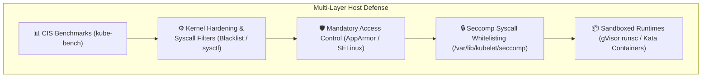
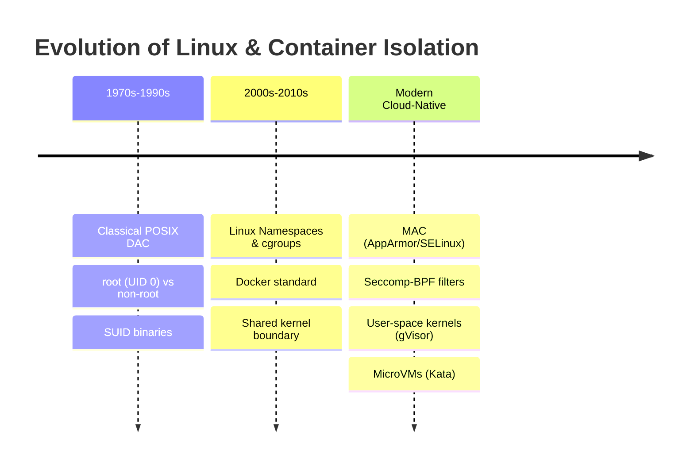

# Module 0-7-7: Host System Hardening, CIS Benchmarks, AppArmor & Seccomp

**Breadcrumbs:** [[0-Index - Kubernetes|🏠 Kubernetes Reference MOC]] > [[0-Index - CKS|🛡️ CKS Reference MOC]] > **Module 0-7-7**

---

## 1. Host Operating System Hardening & CIS Benchmarks

Securing the host operating systems of both control plane and worker nodes is essential to protecting the Kubernetes cluster. Even perfectly configured RBAC and NetworkPolicies are ineffective if an attacker gains shell access or privilege escalation on the underlying Linux host.



---

## 2. CIS Kubernetes Benchmarks & `kube-bench`

The **Center for Internet Security (CIS)** maintains rigorous, consensus-based configuration guidelines for hardening Kubernetes clusters against modern attack vectors.

### 2.1 The Four Assessment Targets
1. **Master Node Configuration:** File permissions and command-line flags for `kube-apiserver`, `kube-controller-manager`, `kube-scheduler`, and static pod manifests.
2. **etcd Node Configuration:** File permissions, data directory security, TLS client/peer certificates, and authentication.
3. **Control Plane Configuration:** Authentication, authorization modes, admission plugins, and Secret encryption.
4. **Worker Node Configuration:** Kubelet configuration file (`/var/lib/kubelet/config.yaml`), kube-proxy parameters, and container runtime settings.

### 2.2 Running and Remediating with `kube-bench`

`kube-bench` is an automated Go tool that runs the CIS Kubernetes Benchmark tests and provides pass/fail/warn statuses alongside explicit remediation commands:

```bash
# 1. Run kube-bench targeting master control plane components
kube-bench run --targets master

# 2. Run kube-bench targeting worker node kubelet configurations
kube-bench run --targets node

# 3. Output results as JSON for compliance reporting
kube-bench run --outputfile cis-audit-report.json --json
```

### 2.3 Common CIS Remediations on Master Nodes

| Test ID | CIS Requirement | Remediation Command / Configuration |
| :--- | :--- | :--- |
| **1.1.1** | Ensure API server pod manifest permissions are `600` or more restrictive. | `chmod 600 /etc/kubernetes/manifests/kube-apiserver.yaml` |
| **1.1.11** | Ensure etcd data directory ownership is `etcd:etcd`. | `chown -R etcd:etcd /var/lib/etcd` |
| **1.2.1** | Ensure `--anonymous-auth=false` on `kube-apiserver`. | Add `- --anonymous-auth=false` to `kube-apiserver.yaml`. |
| **1.2.18** | Ensure `--insecure-bind-address` is not set. | Remove any insecure port or bind address flags from the manifest. |
| **4.2.1** | Ensure `--anonymous-auth` is false in Kubelet config. | In `/var/lib/kubelet/config.yaml`, set `authentication.anonymous.enabled: false`. |
| **4.2.2** | Ensure Kubelet authorization mode is Webhook. | In `/var/lib/kubelet/config.yaml`, set `authorization.mode: Webhook`. |

---

## 3. Host Network, Service & Process Hardening

### 3.1 Auditing Open Ports & Listening Daemons
Attackers routinely exploit forgotten or unauthenticated daemons running on node interfaces. Identify and close unnecessary listening sockets:

```bash
# Inspect all listening TCP and UDP sockets with owning process names
ss -tulpn
# Alternatively using lsof
lsof -i -P -n | grep LISTEN

# Disable and stop obsolete or vulnerable legacy services
systemctl stop rpcbind inetd telnet
systemctl disable rpcbind inetd telnet
systemctl mask rpcbind # Prevents any service or package from reactivating it
```

### 3.2 UFW (Uncomplicated Firewall) Rules
```bash
# Enable firewall with default deny incoming
ufw default deny incoming
ufw default allow outgoing

# Allow standard SSH management port
ufw allow 22/tcp

# On Control Plane Nodes: Allow API server and Kubelet communication
ufw allow 6443/tcp comment "Kubernetes API Server"
ufw allow 2379:2380/tcp comment "etcd server client/peer API"
ufw allow 10250/tcp comment "Kubelet API"

# Enable firewall
ufw enable
ufw status verbose
```

### 3.3 Linux Kernel Module Blacklisting
Unused kernel network protocols (such as DCCP, SCTP, RDS, TIPC) have historically contained privilege escalation and remote code execution vulnerabilities. Blacklist them to prevent on-demand module loading:

```bash
# Append blacklist configuration to /etc/modprobe.d/blacklist.conf
cat <<EOF >> /etc/modprobe.d/blacklist.conf
blacklist dccp
blacklist sctp
blacklist rds
blacklist tipc
install dccp /bin/true
install sctp /bin/true
EOF

# Unload currently active modules
modprobe -r dccp sctp 2>/dev/null || true
```

### 3.4 Docker Daemon & Container Runtime Socket Security (CKS Core)

The container engine daemon (`dockerd` or `containerd`) operates with elevated privileges on the host node. In traditional Docker environments and hybrid clusters, improper socket exposure or unauthenticated TCP daemon endpoints represent critical security vulnerabilities.

#### 3.4.1 Docker Daemon IPC: Unix Domain Sockets vs. TCP Listeners
* **Local Unix Domain Socket:** By default, Docker listens on `/var/run/docker.sock` (POSIX IPC socket). Permissions are restricted to `root:docker` (`mode 0660`).
* **Root Equivalence of the `docker` Group:** Adding non-root users to the `docker` system group (`usermod -aG docker <user>`) grants effective passwordless root on the host machine. Any user with write access to `/var/run/docker.sock` can issue Docker API calls to run containers with `-v /:/host-root --privileged`, chrooting into the host root filesystem.
* **The Insecure TCP Port 2375 Vulnerability:** When configured to accept remote management traffic, administrators often bind `dockerd` to `tcp://0.0.0.0:2375` or `tcp://<IP>:2375` without TLS. Port `2375` is unencrypted and unauthenticated. Any attacker on the network can immediately control the daemon, pull and run cryptominers, exfiltrate secrets, or wipe containers and volumes.

#### 3.4.2 The Unix Socket Escape Attack Loop
* **The Dangerous Bind-Mount Anti-Pattern:** In CI/CD pipelines (e.g., Docker-in-Docker or Jenkins/GitHub Actions runners), developers often mount the host socket into a container: `-v /var/run/docker.sock:/var/run/docker.sock`.
* **Breakout Mechanism:** A compromised container process with socket access uses the Docker CLI or raw HTTP requests over the socket to create a sibling container with host namespace shares:
  ```bash
  # Executed from inside the compromised container:
  docker -H unix:///var/run/docker.sock run -v /:/host-fs --privileged -it alpine chroot /host-fs
  ```
  This immediately yields an interactive root shell on the physical node, bypassing all container isolation boundaries.
* **Audit Detection:** Security scanners such as `amicontained` inspect container environments and report `"Looking for Docker.sock"` to identify whether this breakout vector is exposed.
* **Kubernetes Hardening:** Never allow Pods to mount `/var/run/docker.sock` or CRI sockets (`/run/containerd/containerd.sock`, `/run/crio/crio.sock`) via `hostPath`. Enforce this through Pod Security Admission (`restricted` profile) or admission webhooks.

#### 3.4.3 Securing Docker Daemon with TLS & Mutual TLS (mTLS) on Port 2376
When remote TCP access to the Docker API is mandatory, it must be protected using TLS encryption and client certificate authentication (Mutual TLS) on port `2376`:

1. **PKI Infrastructure:**
   * **CA Certificate:** `cacert.pem` (verifies both server and client identity).
   * **Server Certificate & Key:** `server.pem`, `serverkey.pem` (authenticates the daemon and encrypts traffic).
   * **Client Certificate & Key:** `client.pem`, `client-key.pem` (authenticates authorized operators or orchestrators).
2. **Enforce `tlsverify: true`:** Enabling TLS alone encrypts traffic but does not authenticate clients. You MUST enable `tlsverify` to force the daemon to validate client certificates against the CA.
3. **Declarative Daemon Configuration (`/etc/docker/daemon.json`):**
   ```json
   {
     "hosts": [
       "unix:///var/run/docker.sock",
       "tcp://192.168.1.10:2376"
     ],
     "tls": true,
     "tlscert": "/var/docker/server.pem",
     "tlskey": "/var/docker/serverkey.pem",
     "tlsverify": true,
     "tlscacert": "/var/docker/cacert.pem"
   }
   ```

#### 3.4.4 Systemd Service Management, Troubleshooting & Startup Conflict Traps
* **Systemd Service Operations:**
  ```bash
  # Check daemon status and active listeners
  systemctl status docker

  # Restart daemon after updating daemon.json
  systemctl restart docker

  # Stop and disable if replacing with standalone containerd
  systemctl stop docker && systemctl disable docker
  ```
* **Foreground Debugging:** To diagnose socket binding, gRPC containerd handshakes, or storage driver initialization errors, run `dockerd` directly in the console:
  ```bash
  dockerd --debug
  ```
* **Critical Configuration Conflict Trap:**
  > [!WARNING]
  > If an option (such as `-H` / `--host` or `--debug`) is specified in both the systemd service file (e.g. `/lib/systemd/system/docker.service` passing `-H fd://`) AND in `/etc/docker/daemon.json` (`"hosts": [...]`), the Docker daemon will crash on startup with:
  > `unable to configure the Docker daemon with file /etc/docker/daemon.json: the following flags are at conflict with the daemon configuration: hosts: ...`
  > **Fix:** Remove the `-H` flags from the systemd `ExecStart` line (using a systemd drop-in override: `systemctl edit docker`) or remove `"hosts"` from `daemon.json`.

#### 3.4.5 Secure Remote Client Execution
To securely query the hardened Docker daemon from an authorized client workstation:

```bash
# Option A: Environment variables
export DOCKER_HOST="tcp://192.168.1.10:2376"
export DOCKER_TLS_VERIFY=true
docker --tlscert=/path/to/client.pem --tlskey=/path/to/client-key.pem --tlscacert=/path/to/cacert.pem ps

# Option B: Automatic discovery via ~/.docker
mkdir -p ~/.docker
cp cacert.pem ~/.docker/ca.pem
cp client.pem ~/.docker/cert.pem
cp client-key.pem ~/.docker/key.pem
export DOCKER_HOST="tcp://192.168.1.10:2376"
export DOCKER_TLS_VERIFY=1
docker ps
```

#### 3.4.6 AARF Deep-Intuition Analysis: Docker API & Unix Socket Security
1. **The Answer (Core Pattern):** Bind Docker to the local Unix domain socket `/var/run/docker.sock` with restrictive `0660` permissions. If remote access is strictly required, expose on private IP port `2376` with mandatory mutual TLS (`tlsverify: true`). Never mount container runtime sockets into untrusted pods.
2. **The Assumptions (Context):** The host OS is hardened (root SSH disabled, firewall active). In modern Kubernetes (v1.24+), `dockershim` is removed; however, worker nodes may still run Docker for legacy workloads or use `cri-dockerd`, and the identical threat model applies to `/run/containerd/containerd.sock` and `/run/crio/crio.sock`.
3. **The Rationale (Why):** The container runtime daemon executes with root privileges (`UID 0`). The API gives unrestricted access to the Linux kernel via container creation primitives (`hostPID`, `hostNetwork`, `privileged`, `capabilities`, `volumes`). Unauthenticated API access or socket exposure directly bypasses all operating system access controls.
4. **The Failure Loop (What If Not):** Exposing port `2375` leads to automated remote code execution and cryptomining botnet compromise. Bind-mounting `/var/run/docker.sock` inside a container allows any process in that container to spawn a privileged container that chroots into the host node's filesystem, seizing complete root control.
5. **The Alternative Case (When to Use Remote TCP / Sockets):** Use remote TCP on port 2376 only for dedicated CI/CD build agents with signed PKI client certificates. For in-cluster container image builds, abandon Docker socket bind-mounts completely in favor of daemonless, unprivileged tools like **Kaniko**, **Buildah**, or **Podman**.
6. **The Evolutionary Bridge:**
   * **Legacy Systems:** Monolithic Docker daemon managing both the developer API and runtime container execution over `/var/run/docker.sock`. Exposing port 2375 was common in early dev environments.
   * **Kubernetes CRI Transition:** Kubernetes deprecated and removed `dockershim` in v1.24, adopting standard Container Runtime Interface (CRI) runtimes like `containerd` and `CRI-O`.
   * **Universal Threat Equivalence:** Even though `dockerd` was replaced by `containerd`, the security boundary remains the same: mounting `/run/containerd/containerd.sock` into a pod grants equal root-level control over the node via `crictl` or direct gRPC calls. Defense-in-depth requires blocking all runtime socket mounts and adopting **Rootless Containers** (running containerd/podman entirely in user namespaces without host UID 0).

---

## 4. Mandatory Access Control: AppArmor

**AppArmor** is an effective Linux Security Module (LSM) that enforces path-based Mandatory Access Control (MAC). It restricts what files, capabilities, and network calls a specific binary or container process can access, overriding standard Linux root permissions.

### 4.1 AppArmor Modes
* **Enforce Mode (`enforce`):** Applications are prevented from taking restricted actions; violations are logged to syslog (`/var/log/syslog` or `/var/log/audit/audit.log`).
* **Complain Mode (`complain`):** Policy violations are not blocked, but warning events are logged. Used during profiling and development.

### 4.2 Writing and Loading an AppArmor Profile

Create a custom profile file on the worker node at `/etc/apparmor.d/k8s-deny-write`:

```
#include <tunables/global>

profile k8s-deny-write flags=(attach_disconnected,mediate_deleted) {
  #include <abstractions/base>

  # Allow all reads across the filesystem
  file,
  /** r,

  # Deny all file write operations explicitly
  deny /** w,

  # Deny execution of shells and binaries
  deny /bin/** x,
  deny /usr/bin/** x,
}
```

Load and verify the profile using Linux CLI tools:

```bash
# 1. Parse and load the profile into the Linux kernel
apparmor_parser -q /etc/apparmor.d/k8s-deny-write

# 2. Replace or update an existing loaded profile
apparmor_parser -r /etc/apparmor.d/k8s-deny-write

# 3. Check loaded profiles and current enforcement mode
aa-status | grep k8s-deny-write
```

### 4.3 Enforcing AppArmor in Kubernetes

#### Modern Kubernetes (v1.30+ GA Native Field):
Starting in Kubernetes v1.30, AppArmor is configured natively in the container's `securityContext`:

```yaml
apiVersion: v1
kind: Pod
metadata:
  name: secure-apparmor-pod
spec:
  containers:
  - name: web-app
    image: nginx:alpine
    securityContext:
      appArmorProfile:
        type: Localhost
        localhostProfile: k8s-deny-write
```

#### Legacy Annotation Syntax (Kubernetes v1.29 and earlier):
```yaml
metadata:
  annotations:
    container.apparmor.security.beta.kubernetes.io/web-app: "localhost/k8s-deny-write"
```

---

## 5. Linux Seccomp (Secure Computing Mode)

**Seccomp** restricts the system calls that a process can issue to the Linux kernel. If an application never needs to format disks or create network sockets, those syscalls can be dropped. Any attempt to invoke a forbidden syscall causes the kernel to immediately terminate the process or return an error code.

### 5.1 Seccomp Profiles in Kubernetes
Seccomp profiles are stored on every worker node under the Kubelet directory:
`/var/lib/kubelet/seccomp/`

Create `/var/lib/kubelet/seccomp/profiles/audit-only.json`:

```json
{
  "defaultAction": "SCMP_ACT_LOG"
}
```

Create a strict production profile at `/var/lib/kubelet/seccomp/profiles/fine-grained.json`:

```json
{
  "defaultAction": "SCMP_ACT_ERRNO",
  "architectures": [
    "SCMP_ARCH_X86_64",
    "SCMP_ARCH_X86",
    "SCMP_ARCH_X32"
  ],
  "syscalls": [
    {
      "names": [
        "accept4",
        "epoll_create1",
        "epoll_ctl",
        "epoll_pwait",
        "epoll_wait",
        "exit",
        "exit_group",
        "futex",
        "nanosleep",
        "read",
        "write",
        "close",
        "brk",
        "mmap",
        "munmap"
      ],
      "action": "SCMP_ACT_ALLOW"
    }
  ]
}
```

### 5.2 Applying Seccomp in Pod Specs

```yaml
apiVersion: v1
kind: Pod
metadata:
  name: seccomp-enforced-pod
spec:
  securityContext:
    seccompProfile:
      # Option A: Built-in container runtime default profile (Blocks ~50 dangerous syscalls)
      type: RuntimeDefault

      # Option B: Custom local profile stored on the node
      # type: Localhost
      # localhostProfile: profiles/fine-grained.json
  containers:
  - name: app
    image: nginx:alpine
```

> [!TIP]
> Setting `seccompProfile.type: RuntimeDefault` satisfies the **Restricted** tier of Kubernetes Pod Security Standards without requiring custom JSON files distributed to worker nodes.

---

## 6. Sandboxed Container Runtimes: gVisor & Kata Containers

Standard containers share the host Linux kernel directly. If a zero-day kernel exploit is discovered, an escape from a container can compromise the host node. **Sandboxed runtimes** provide hard isolation barriers between workloads and the host kernel.

```mermaid
flowchart TD
    subgraph Standard ["Standard Container (runc)"]
        App1["App Process"] -->|"Direct Syscalls"| HostKernel1["Shared Host Linux Kernel"]
    end

    subgraph gVisor ["gVisor (runsc)"]
        App2["App Process"] -->|"Syscalls"| Sentry["Sentry (Go Userspace Kernel)"]
        Sentry -->|"Filtered Minimal Syscalls"| Gofer["Gofer (File Proxy)"]
        Gofer --> HostKernel2["Host Linux Kernel"]
    end

    subgraph Kata ["Kata Containers"]
        App3["App Process"] --> GuestKernel["Dedicated Guest Kernel"]
        GuestKernel --> QEMU["MicroVM Hypervisor (QEMU / Cloud-Hypervisor)"]
        QEMU --> HostKernel3["Host Linux Kernel"]
    end
```



### 6.1 gVisor (`runsc`)
* Developed by Google; intercepts application syscalls in userspace using an application kernel written in memory-safe Go ("Sentry").
* Implements over 300 Linux syscalls without passing them to the host kernel.

### 6.2 Kata Containers
* Spawns a dedicated, lightweight hardware-assisted virtual machine (microVM) for every pod.
* Uses independent guest kernels per pod, achieving virtual machine-grade isolation with near-container speed.

### 6.3 Configuring `RuntimeClass` in Kubernetes

1. **Register the RuntimeClass:**
   ```yaml
   apiVersion: node.k8s.io/v1
   kind: RuntimeClass
   metadata:
     name: gvisor
   handler: runsc
   ```

2. **Select the RuntimeClass in Pods:**
   ```yaml
   apiVersion: v1
   kind: Pod
   metadata:
     name: untrusted-workload
   spec:
     runtimeClassName: gvisor
     containers:
     - name: worker
       image: python:3.11-slim
       command: ["python", "-c", "import os; print(os.uname())"]
   ```

---

## 7. 🌉 Evolutionary Conceptual Bridging: Workload Isolation



1. **Classical POSIX DAC (Discretionary Access Control):**
   * Relied purely on user/group permissions (`rwxr-xr-x`) and SUID bits. Once a process attained UID 0 (`root`), it had unfettered access to all system calls, physical devices, and memory spaces.
2. **First-Generation Linux Containers:**
   * Container engines like Docker wrapped Linux namespaces (PID, NET, MNT, IPC, UTS, USER) and control groups (`cgroups`).
   * **Failure Mode:** Containers still made direct system calls to the shared host kernel. Any kernel bug (e.g. `Dirty COW`, `cgroupfs` race conditions) allowed instantaneous breakout to the host root shell.
3. **Modern Multi-Tenant Defense-in-Depth:**
   * Modern Kubernetes enforces a multi-layered boundary:
     * **Seccomp** drops non-essential syscalls.
     * **AppArmor** restricts file paths and execution permissions.
     * **gVisor / Kata** interposes an entire virtualization or userspace barrier, rendering shared-kernel vulnerabilities harmless.

<!-- Documentation References -->
[Kubernetes Seccomp Profiles](https://kubernetes.io/docs/concepts/containers/seccomp-profiles/)
[Kubernetes Pod Security Standards](https://kubernetes.io/docs/concepts/security/pod-security-standards/)
[Kubernetes Security Overview](https://kubernetes.io/docs/concepts/security/overview/)
[KodeKloud CKS: Docker Securing the Daemon](https://notes.kodekloud.com/docs/Certified-Kubernetes-Security-Specialist-CKS/Cluster-Setup-and-Hardening/Docker-Securing-the-Daemon/page)
[KodeKloud CKS: Docker Service Configuration](https://notes.kodekloud.com/docs/Certified-Kubernetes-Security-Specialist-CKS/Cluster-Setup-and-Hardening/Docker-Service-Configuration/page)

