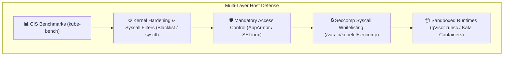
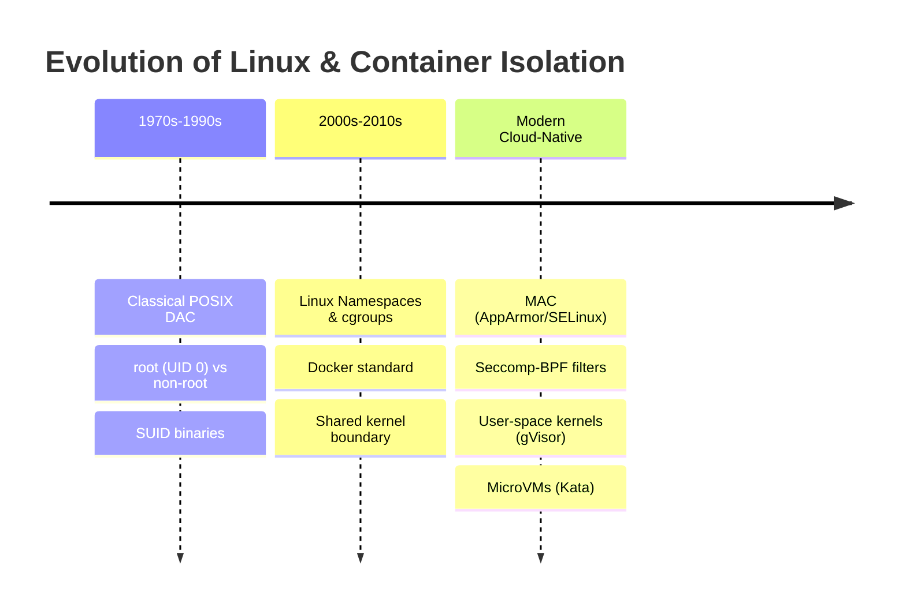

# Module 0-7-7: Host System Hardening, CIS Benchmarks, AppArmor & Seccomp

**Breadcrumbs:** [[0-Index - Kubernetes|🏠 Kubernetes Reference MOC]] > [[0-Index - CKS|🛡️ CKS Reference MOC]] > **Module 0-7-7**

---

## 1. Host Operating System Hardening & CIS Benchmarks

Securing the host operating systems of both control plane and worker nodes is essential to protecting the Kubernetes cluster. Even perfectly configured RBAC and NetworkPolicies are ineffective if an attacker gains shell access or privilege escalation on the underlying Linux host.



---

## 2. CIS Kubernetes Benchmarks & `kube-bench`

The **Center for Internet Security (CIS)** maintains rigorous, consensus-based configuration guidelines for hardening Kubernetes clusters against modern attack vectors.

### 2.1 The Four Assessment Targets
1. **Master Node Configuration:** File permissions and command-line flags for `kube-apiserver`, `kube-controller-manager`, `kube-scheduler`, and static pod manifests.
2. **etcd Node Configuration:** File permissions, data directory security, TLS client/peer certificates, and authentication.
3. **Control Plane Configuration:** Authentication, authorization modes, admission plugins, and Secret encryption.
4. **Worker Node Configuration:** Kubelet configuration file (`/var/lib/kubelet/config.yaml`), kube-proxy parameters, and container runtime settings.

### 2.2 Running and Remediating with `kube-bench`

`kube-bench` is an automated Go tool that runs the CIS Kubernetes Benchmark tests and provides pass/fail/warn statuses alongside explicit remediation commands:

```bash
# 1. Run kube-bench targeting master control plane components
kube-bench run --targets master

# 2. Run kube-bench targeting worker node kubelet configurations
kube-bench run --targets node

# 3. Output results as JSON for compliance reporting
kube-bench run --outputfile cis-audit-report.json --json
```

### 2.3 Common CIS Remediations on Master Nodes

| Test ID | CIS Requirement | Remediation Command / Configuration |
| :--- | :--- | :--- |
| **1.1.1** | Ensure API server pod manifest permissions are `600` or more restrictive. | `chmod 600 /etc/kubernetes/manifests/kube-apiserver.yaml` |
| **1.1.11** | Ensure etcd data directory ownership is `etcd:etcd`. | `chown -R etcd:etcd /var/lib/etcd` |
| **1.2.1** | Ensure `--anonymous-auth=false` on `kube-apiserver`. | Add `- --anonymous-auth=false` to `kube-apiserver.yaml`. |
| **1.2.18** | Ensure `--insecure-bind-address` is not set. | Remove any insecure port or bind address flags from the manifest. |
| **4.2.1** | Ensure `--anonymous-auth` is false in Kubelet config. | In `/var/lib/kubelet/config.yaml`, set `authentication.anonymous.enabled: false`. |
| **4.2.2** | Ensure Kubelet authorization mode is Webhook. | In `/var/lib/kubelet/config.yaml`, set `authorization.mode: Webhook`. |

---

## 3. Host Network, Service & Process Hardening

### 3.1 Auditing Open Ports & Listening Daemons
Attackers routinely exploit forgotten or unauthenticated daemons running on node interfaces. Identify and close unnecessary listening sockets:

```bash
# Inspect all listening TCP and UDP sockets with owning process names
ss -tulpn
# Alternatively using lsof
lsof -i -P -n | grep LISTEN

# Disable and stop obsolete or vulnerable legacy services
systemctl stop rpcbind inetd telnet
systemctl disable rpcbind inetd telnet
systemctl mask rpcbind # Prevents any service or package from reactivating it
```

### 3.2 UFW (Uncomplicated Firewall) Rules
```bash
# Enable firewall with default deny incoming
ufw default deny incoming
ufw default allow outgoing

# Allow standard SSH management port
ufw allow 22/tcp

# On Control Plane Nodes: Allow API server and Kubelet communication
ufw allow 6443/tcp comment "Kubernetes API Server"
ufw allow 2379:2380/tcp comment "etcd server client/peer API"
ufw allow 10250/tcp comment "Kubelet API"

# Enable firewall
ufw enable
ufw status verbose
```

### 3.3 Linux Kernel Module Blacklisting
Unused kernel network protocols (such as DCCP, SCTP, RDS, TIPC) have historically contained privilege escalation and remote code execution vulnerabilities. Blacklist them to prevent on-demand module loading:

```bash
# Append blacklist configuration to /etc/modprobe.d/blacklist.conf
cat <<EOF >> /etc/modprobe.d/blacklist.conf
blacklist dccp
blacklist sctp
blacklist rds
blacklist tipc
install dccp /bin/true
install sctp /bin/true
EOF

# Unload currently active modules
modprobe -r dccp sctp 2>/dev/null || true
```

---

## 4. Mandatory Access Control: AppArmor

**AppArmor** is an effective Linux Security Module (LSM) that enforces path-based Mandatory Access Control (MAC). It restricts what files, capabilities, and network calls a specific binary or container process can access, overriding standard Linux root permissions.

### 4.1 AppArmor Modes
* **Enforce Mode (`enforce`):** Applications are prevented from taking restricted actions; violations are logged to syslog (`/var/log/syslog` or `/var/log/audit/audit.log`).
* **Complain Mode (`complain`):** Policy violations are not blocked, but warning events are logged. Used during profiling and development.

### 4.2 Writing and Loading an AppArmor Profile

Create a custom profile file on the worker node at `/etc/apparmor.d/k8s-deny-write`:

```
#include <tunables/global>

profile k8s-deny-write flags=(attach_disconnected,mediate_deleted) {
  #include <abstractions/base>

  # Allow all reads across the filesystem
  file,
  /** r,

  # Deny all file write operations explicitly
  deny /** w,

  # Deny execution of shells and binaries
  deny /bin/** x,
  deny /usr/bin/** x,
}
```

Load and verify the profile using Linux CLI tools:

```bash
# 1. Parse and load the profile into the Linux kernel
apparmor_parser -q /etc/apparmor.d/k8s-deny-write

# 2. Replace or update an existing loaded profile
apparmor_parser -r /etc/apparmor.d/k8s-deny-write

# 3. Check loaded profiles and current enforcement mode
aa-status | grep k8s-deny-write
```

### 4.3 Enforcing AppArmor in Kubernetes

#### Modern Kubernetes (v1.30+ GA Native Field):
Starting in Kubernetes v1.30, AppArmor is configured natively in the container's `securityContext`:

```yaml
apiVersion: v1
kind: Pod
metadata:
  name: secure-apparmor-pod
spec:
  containers:
  - name: web-app
    image: nginx:alpine
    securityContext:
      appArmorProfile:
        type: Localhost
        localhostProfile: k8s-deny-write
```

#### Legacy Annotation Syntax (Kubernetes v1.29 and earlier):
```yaml
metadata:
  annotations:
    container.apparmor.security.beta.kubernetes.io/web-app: "localhost/k8s-deny-write"
```

---

## 5. Linux Seccomp (Secure Computing Mode)

**Seccomp** restricts the system calls that a process can issue to the Linux kernel. If an application never needs to format disks or create network sockets, those syscalls can be dropped. Any attempt to invoke a forbidden syscall causes the kernel to immediately terminate the process or return an error code.

### 5.1 Seccomp Profiles in Kubernetes
Seccomp profiles are stored on every worker node under the Kubelet directory:
`/var/lib/kubelet/seccomp/`

Create `/var/lib/kubelet/seccomp/profiles/audit-only.json`:

```json
{
  "defaultAction": "SCMP_ACT_LOG"
}
```

Create a strict production profile at `/var/lib/kubelet/seccomp/profiles/fine-grained.json`:

```json
{
  "defaultAction": "SCMP_ACT_ERRNO",
  "architectures": [
    "SCMP_ARCH_X86_64",
    "SCMP_ARCH_X86",
    "SCMP_ARCH_X32"
  ],
  "syscalls": [
    {
      "names": [
        "accept4",
        "epoll_create1",
        "epoll_ctl",
        "epoll_pwait",
        "epoll_wait",
        "exit",
        "exit_group",
        "futex",
        "nanosleep",
        "read",
        "write",
        "close",
        "brk",
        "mmap",
        "munmap"
      ],
      "action": "SCMP_ACT_ALLOW"
    }
  ]
}
```

### 5.2 Applying Seccomp in Pod Specs

```yaml
apiVersion: v1
kind: Pod
metadata:
  name: seccomp-enforced-pod
spec:
  securityContext:
    seccompProfile:
      # Option A: Built-in container runtime default profile (Blocks ~50 dangerous syscalls)
      type: RuntimeDefault

      # Option B: Custom local profile stored on the node
      # type: Localhost
      # localhostProfile: profiles/fine-grained.json
  containers:
  - name: app
    image: nginx:alpine
```

> [!TIP]
> Setting `seccompProfile.type: RuntimeDefault` satisfies the **Restricted** tier of Kubernetes Pod Security Standards without requiring custom JSON files distributed to worker nodes.

---

## 6. Sandboxed Container Runtimes: gVisor & Kata Containers

Standard containers share the host Linux kernel directly. If a zero-day kernel exploit is discovered, an escape from a container can compromise the host node. **Sandboxed runtimes** provide hard isolation barriers between workloads and the host kernel.

```mermaid
flowchart TD
    subgraph Standard ["Standard Container (runc)"]
        App1["App Process"] -->|"Direct Syscalls"| HostKernel1["Shared Host Linux Kernel"]
    end

    subgraph gVisor ["gVisor (runsc)"]
        App2["App Process"] -->|"Syscalls"| Sentry["Sentry (Go Userspace Kernel)"]
        Sentry -->|"Filtered Minimal Syscalls"| Gofer["Gofer (File Proxy)"]
        Gofer --> HostKernel2["Host Linux Kernel"]
    end

    subgraph Kata ["Kata Containers"]
        App3["App Process"] --> GuestKernel["Dedicated Guest Kernel"]
        GuestKernel --> QEMU["MicroVM Hypervisor (QEMU / Cloud-Hypervisor)"]
        QEMU --> HostKernel3["Host Linux Kernel"]
    end
```



### 6.1 gVisor (`runsc`)
* Developed by Google; intercepts application syscalls in userspace using an application kernel written in memory-safe Go ("Sentry").
* Implements over 300 Linux syscalls without passing them to the host kernel.

### 6.2 Kata Containers
* Spawns a dedicated, lightweight hardware-assisted virtual machine (microVM) for every pod.
* Uses independent guest kernels per pod, achieving virtual machine-grade isolation with near-container speed.

### 6.3 Configuring `RuntimeClass` in Kubernetes

1. **Register the RuntimeClass:**
   ```yaml
   apiVersion: node.k8s.io/v1
   kind: RuntimeClass
   metadata:
     name: gvisor
   handler: runsc
   ```

2. **Select the RuntimeClass in Pods:**
   ```yaml
   apiVersion: v1
   kind: Pod
   metadata:
     name: untrusted-workload
   spec:
     runtimeClassName: gvisor
     containers:
     - name: worker
       image: python:3.11-slim
       command: ["python", "-c", "import os; print(os.uname())"]
   ```

---

## 7. 🌉 Evolutionary Conceptual Bridging: Workload Isolation



1. **Classical POSIX DAC (Discretionary Access Control):**
   * Relied purely on user/group permissions (`rwxr-xr-x`) and SUID bits. Once a process attained UID 0 (`root`), it had unfettered access to all system calls, physical devices, and memory spaces.
2. **First-Generation Linux Containers:**
   * Container engines like Docker wrapped Linux namespaces (PID, NET, MNT, IPC, UTS, USER) and control groups (`cgroups`).
   * **Failure Mode:** Containers still made direct system calls to the shared host kernel. Any kernel bug (e.g. `Dirty COW`, `cgroupfs` race conditions) allowed instantaneous breakout to the host root shell.
3. **Modern Multi-Tenant Defense-in-Depth:**
   * Modern Kubernetes enforces a multi-layered boundary:
     * **Seccomp** drops non-essential syscalls.
     * **AppArmor** restricts file paths and execution permissions.
     * **gVisor / Kata** interposes an entire virtualization or userspace barrier, rendering shared-kernel vulnerabilities harmless.

<!-- Documentation References -->
[Kubernetes Seccomp Profiles](https://kubernetes.io/docs/concepts/containers/seccomp-profiles/)
[Kubernetes Pod Security Standards](https://kubernetes.io/docs/concepts/security/pod-security-standards/)
[Kubernetes Security Overview](https://kubernetes.io/docs/concepts/security/overview/)
