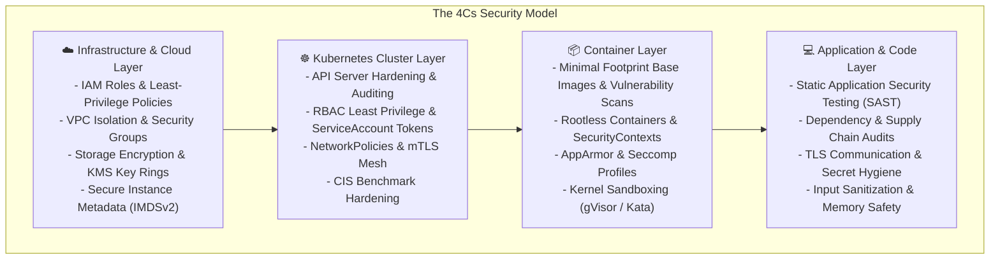
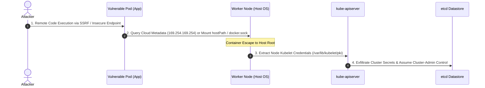
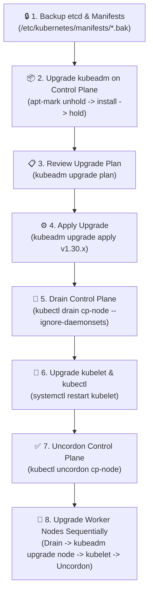

# Module 0-7-8: Cluster Hardening, CIS Benchmarks, Platform Security & Upgrades

**Breadcrumbs:** [[0-Index - Kubernetes|🏠 Kubernetes Reference MOC]] > [[0-Index - CKS|🛡️ CKS Reference MOC]] > **Module 0-7-8**

---

## 1. The 4Cs of Cloud-Native Security

Security in modern cloud-native architectures is structured around the **4Cs of Cloud Native Security**: **Cloud**, **Cluster**, **Container**, and **Code**. Each tier establishes an independent security perimeter, enforcing defense-in-depth:



* **Cloud Layer:** The foundational hosting infrastructure (AWS, GCP, Azure, bare metal). A compromise at the cloud layer (e.g. exposed IAM credentials or unrestricted security groups) renders all overlying cluster protections futile.
* **Cluster Layer:** The Kubernetes Control Plane and Worker Node ecosystem. Hardened by terminating insecure API flags, enforcing mutual TLS on etcd and Kubelet, restricting API verbs via RBAC, and applying admission controllers.
* **Container Layer:** The runtime container process boundary. Prevents container-to-host breakouts using non-root UIDs, dropping Linux capabilities, enforcing read-only root filesystems, and syscall filtering.
* **Code Layer:** The application business logic. Protects against OWASP Top 10 vulnerabilities (SSRF, SQL injection, insecure deserialization) that allow attackers to gain arbitrary code execution inside workloads.

---

## 2. Understanding the Kubernetes Attack Surface

An attacker attempting to compromise a Kubernetes cluster typically exploits a multi-stage intrusion chain across distinct threat vectors:



1. **External Exposure Vector:**
   * Unauthenticated or misconfigured public ports: Kubelet read-only port (`10255`), legacy insecure API server port (`8080`), or unencrypted Docker daemon (`tcp://0.0.0.0:2375`).
   * Vulnerable public ingress points without WAF or rate limiting.
2. **Workload Infiltration Vector:**
   * Compromised application pods pivoting to steal auto-mounted ServiceAccount tokens from `/var/run/secrets/kubernetes.io/serviceaccount/token`.
   * Invoking the cloud instance metadata service (`http://169.254.169.254/latest/meta-data/`) to exfiltrate IAM role credentials.
3. **Host Node Breakout Vector:**
   * Exploiting shared Linux kernel vulnerabilities from unconfined containers (`privileged: true`, `CAP_SYS_ADMIN`).
   * Accessing host filesystem paths via misconfigured `hostPath` volumes or mounted container runtime sockets (`/var/run/docker.sock`, `/run/containerd/containerd.sock`).

---

## 3. CIS Benchmarks & `kube-bench` Auditing

The **Center for Internet Security (CIS)** maintains the authoritative, consensus-based security benchmark for Kubernetes. The benchmark defines prescriptive hardening rules categorized into five sections:

| CIS Section | Target Component | Core Security Standards & Enforcements |
| :--- | :--- | :--- |
| **1. Control Plane Components** | Master Node | API server, Controller Manager, Scheduler manifest permissions (`600`, `root:root`) and secure flags. |
| **2. etcd** | Datastore | Data directory ownership (`etcd:etcd`), TLS client/peer verification, dedicated CA isolation. |
| **3. Control Plane Config** | System Files | Permissions on `/etc/kubernetes/admin.conf`, PKI directories (`700`), and static manifests (`600`). |
| **4. Worker Nodes** | Kubelet & Proxy | Kubelet config permissions (`600`), anonymous auth disabled, authorization mode `Webhook`, read-only port `0`. |
| **5. Kubernetes Policies** | Cluster-wide | RBAC least privilege, Pod Security Standards (`restricted`), NetworkPolicy defaults, secret encryption. |

### 3.1 Running `kube-bench`
`kube-bench` is an automated open-source audit tool from Aqua Security that checks whether a live Kubernetes cluster conforms to CIS benchmark recommendations:

```bash
# Run audit against control plane node:
kube-bench run --targets master

# Run audit against worker node:
kube-bench run --targets node

# Run audit for a specific Kubernetes CIS benchmark version:
kube-bench run --targets master --version 1.28

# Export audit findings in JSON for compliance pipelines:
kube-bench run --targets master --json --outputfile /tmp/cis-report.json
```

### 3.2 Remediating `kube-bench` Findings
When `kube-bench` reports `[FAIL]`, each item provides the exact test identifier and remediation steps:

```bash
# Test 1.1.1: Ensure that the API server pod specification file permissions are set to 600
chmod 600 /etc/kubernetes/manifests/kube-apiserver.yaml
chown root:root /etc/kubernetes/manifests/kube-apiserver.yaml

# Test 4.2.1: Ensure that the --anonymous-auth argument is set to false
# Update /var/lib/kubelet/config.yaml:
# authentication:
#   anonymous:
#     enabled: false
systemctl restart kubelet
```

---

## 4. Platform Binary Checksum Verification

Deploying tampered, unverified binaries into production introduces catastrophic supply-chain risk. Control plane components (`kube-apiserver`, `kubelet`, `kubectl`, `etcd`) must be verified against their cryptographic SHA512 hashes before execution:

```bash
# 1. Download official release binary and SHA512 checksum file
curl -LO "https://dl.k8s.io/release/v1.30.0/bin/linux/amd64/kube-apiserver"
curl -LO "https://dl.k8s.io/release/v1.30.0/bin/linux/amd64/kube-apiserver.sha512"

# 2. Compute local binary hash:
sha512sum kube-apiserver

# 3. Verify against official release checksum:
echo "$(cat kube-apiserver.sha512)  kube-apiserver" | sha512sum --check

# Expected verification output:
# kube-apiserver: OK
```

If validation fails (`kube-apiserver: FAILED`), the binary must be quarantined and investigated immediately.

---

## 5. Safe, Security-Conscious Cluster Upgrades

Upgrading a production Kubernetes cluster requires rigorous operational sequencing to prevent control plane desynchronization, version skew conflicts, and security parameter loss:



### 5.1 Upgrade Protocol
1. **Control Plane Kubeadm Upgrade:**
   ```bash
   apt-mark unhold kubeadm
   apt-get update && apt-get install -y kubeadm=1.30.2-1.1
   apt-mark hold kubeadm
   
   # Plan and execute upgrade:
   kubeadm upgrade plan
   kubeadm upgrade apply v1.30.2 -y
   ```
2. **Control Plane Kubelet & Kubectl Upgrade:**
   ```bash
   kubectl drain controlplane --ignore-daemonsets
   apt-mark unhold kubelet kubectl
   apt-get install -y kubelet=1.30.2-1.1 kubectl=1.30.2-1.1
   apt-mark hold kubelet kubectl
   systemctl daemon-reload && systemctl restart kubelet
   kubectl uncordon controlplane
   ```
3. **Worker Node Upgrade:**
   ```bash
   # From control plane:
   kubectl drain node01 --ignore-daemonsets --delete-emptydir-data
   
   # On worker node:
   apt-mark unhold kubeadm
   apt-get install -y kubeadm=1.30.2-1.1
   apt-mark hold kubeadm
   kubeadm upgrade node
   
   apt-mark unhold kubelet kubectl
   apt-get install -y kubelet=1.30.2-1.1 kubectl=1.30.2-1.1
   apt-mark hold kubelet kubectl
   systemctl daemon-reload && systemctl restart kubelet
   
   # From control plane:
   kubectl uncordon node01
   ```

> [!IMPORTANT]
> **Post-Upgrade Security Verification:** Following cluster upgrades, verify that custom security flags (such as `--audit-policy-file`, `--encryption-provider-config`, and Kubelet authorization modes) were not reset to defaults during static pod re-generation. Re-run `kube-bench run --targets master,node` immediately.

---

## 6. Securing Cloud Node Metadata & IMDSv2

Worker nodes hosted on cloud providers (AWS, GCP, Azure) access cloud APIs using temporary credentials retrieved from the link-local metadata address (`http://169.254.169.254`).

### 6.1 The SSRF Attack Vector
If an application running in a pod suffers from Server-Side Request Forgery (SSRF), an external attacker can induce the server to request `http://169.254.169.254/latest/meta-data/iam/security-credentials/<role-name>` and steal the instance profile's cloud access keys.

### 6.2 IMDSv1 vs. IMDSv2
* **IMDSv1 (Insecure):** Relies on simple HTTP `GET` requests. Any blind SSRF vulnerability can extract IAM credentials directly.
* **IMDSv2 (Secure Session-Oriented):** Enforces session token creation via an HTTP `PUT` request with custom headers:
  ```bash
  # Step 1: Request session token with TTL
  TOKEN=$(curl -s -X PUT "http://169.254.169.254/latest/api/token" -H "X-aws-ec2-metadata-token-ttl-seconds: 21600")
  
  # Step 2: Query metadata using session token
  curl -s -H "X-aws-ec2-metadata-token: $TOKEN" http://169.254.169.254/latest/meta-data/
  ```

### 6.3 Hardening Defenses
1. **Require IMDSv2 & Restrict Hop Limit to 1:** Setting the IP packet hop limit to `1` prevents packets from traversing container network namespaces or the bridge (`cni0`), preventing pods from completing the token handshake:
   ```bash
   aws ec2 modify-instance-metadata-options \
       --instance-id i-0123456789abcdef0 \
       --http-tokens required \
       --http-put-response-hop-limit 1
   ```
2. **Cluster-Wide NetworkPolicy Egress Blocking:** Prohibit all pods from transmitting egress traffic to `169.254.169.254/32`:
   ```yaml
   apiVersion: networking.k8s.io/v1
   kind: NetworkPolicy
   metadata:
     name: block-cloud-metadata
     namespace: default
   spec:
     podSelector: {}
     policyTypes:
       - Egress
     egress:
       - to:
           - ipBlock:
               cidr: 0.0.0.0/0
               except:
                 - 169.254.169.254/32
   ```

---

## 7. 💡 AARF Deep-Intuition Analysis: Cluster Hardening & Upgrades

1. **The Answer (Core Pattern):** Audit nodes continuously against CIS benchmarks using `kube-bench`, enforce IMDSv2 with hop limit 1 and metadata NetworkPolicy egress blocks, verify binary SHA512 checksums prior to installation, and execute cluster upgrades in strict sequence (`kubeadm` -> `kubelet` -> `kubectl`) while verifying post-upgrade security parameters.
2. **The Assumptions (Context):** The cluster is provisioned via `kubeadm` on Linux with systemd, running Kubernetes v1.28+. Cloud instances use IAM roles attached via instance profiles.
3. **The Rationale (Why):** Default Kubernetes installations prioritize connectivity over zero-trust security. Unauthenticated ports, permissive file ownerships, and accessible cloud metadata allow an attacker with limited container access to compromise the underlying infrastructure.
4. **The Failure Loop (What If Not):** Unrestricted metadata endpoints enable application SSRF bugs to yield cloud account administrator access. Skipping CIS auditing leaves static pod manifests world-writable (`0666`), enabling local users to inject malicious containers directly into the control plane.
5. **The Alternative Case (When to Use Cloud-Managed Control Planes):** In managed environments (EKS, GKE, AKS), control plane CIS hardening and API server upgrades are fully automated by the cloud provider. Security efforts shift to node AMI hardening, IMDSv2 hop limit enforcement, and workload admission controls.
6. **The Evolutionary Bridge:**
   * **Early Kubernetes (v1.10–v1.18):** Relied on insecure ports (`--insecure-port=8080`), static token files, and unencrypted metadata queries (IMDSv1).
   * **Modern Kubernetes (v1.24+):** Completely removed insecure ports, deprecated dockershim, enforces TokenRequest projected service accounts, and integrates CIS benchmark checks into automated GitOps compliance pipelines.

---

## 🌐 Documentation References & Inflow Sources
* [Kubernetes Security Overview](https://kubernetes.io/docs/concepts/security/overview/)
* [Upgrading kubeadm clusters](https://kubernetes.io/docs/tasks/administer-cluster/kubeadm/kubeadm-upgrade/)
* [CIS Kubernetes Benchmark Guidance (Aqua Security)](https://github.com/aquasecurity/kube-bench)
* [AWS IMDSv2 Documentation](https://docs.aws.amazon.com/AWSEC2/latest/UserGuide/configuring-instance-metadata-service.html)
* [KodeKloud CKS: CIS benchmark for Kubernetes](https://notes.kodekloud.com/docs/Certified-Kubernetes-Security-Specialist-CKS/Cluster-Setup-and-Hardening/CIS-benchmark-for-Kubernetes/page)
* [KodeKloud CKS: Cluster Upgrade Process](https://notes.kodekloud.com/docs/Certified-Kubernetes-Security-Specialist-CKS/Cluster-Setup-and-Hardening/Cluster-Upgrade-Process/page)
* [KodeKloud CKS: Securing Node Metadata in Kubernetes](https://notes.kodekloud.com/docs/Certified-Kubernetes-Security-Specialist-CKS/Cluster-Setup-and-Hardening/Securing-Node-Metadata-in-Kubernetes/page)
* [KodeKloud CKS: Verify Platform Binaries Before Deploying](https://notes.kodekloud.com/docs/Certified-Kubernetes-Security-Specialist-CKS/Cluster-Setup-and-Hardening/Verify-Platform-Binaries-Before-Deploying/page)
