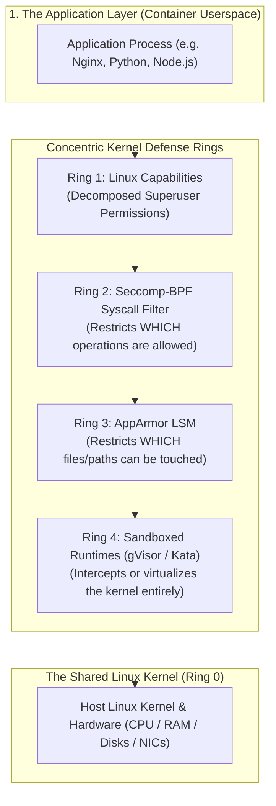
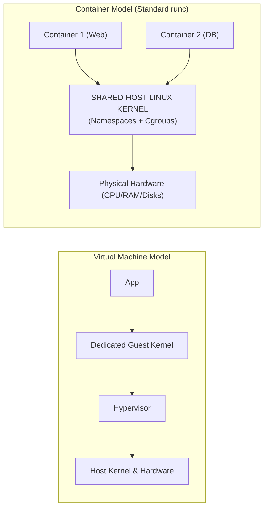
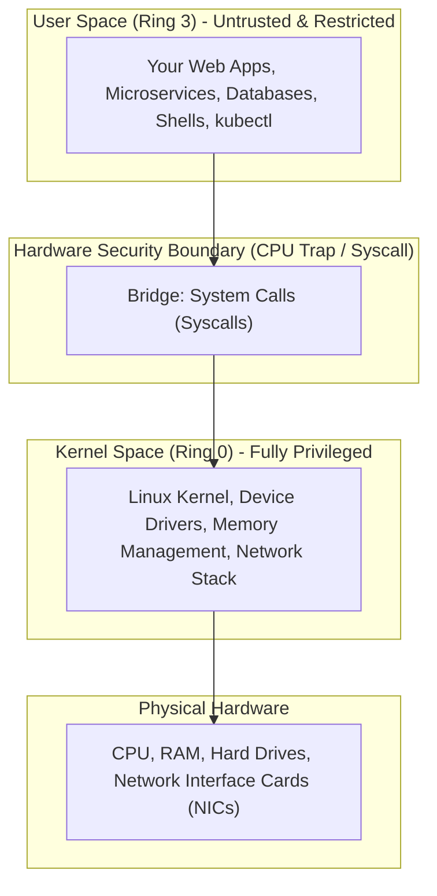
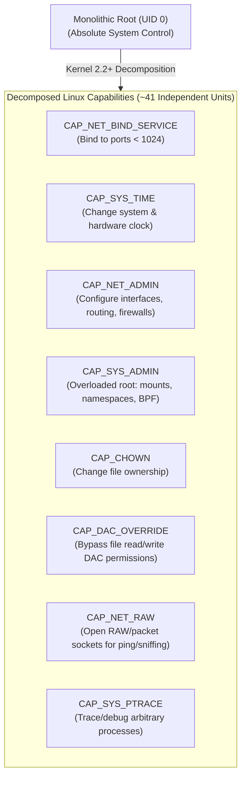
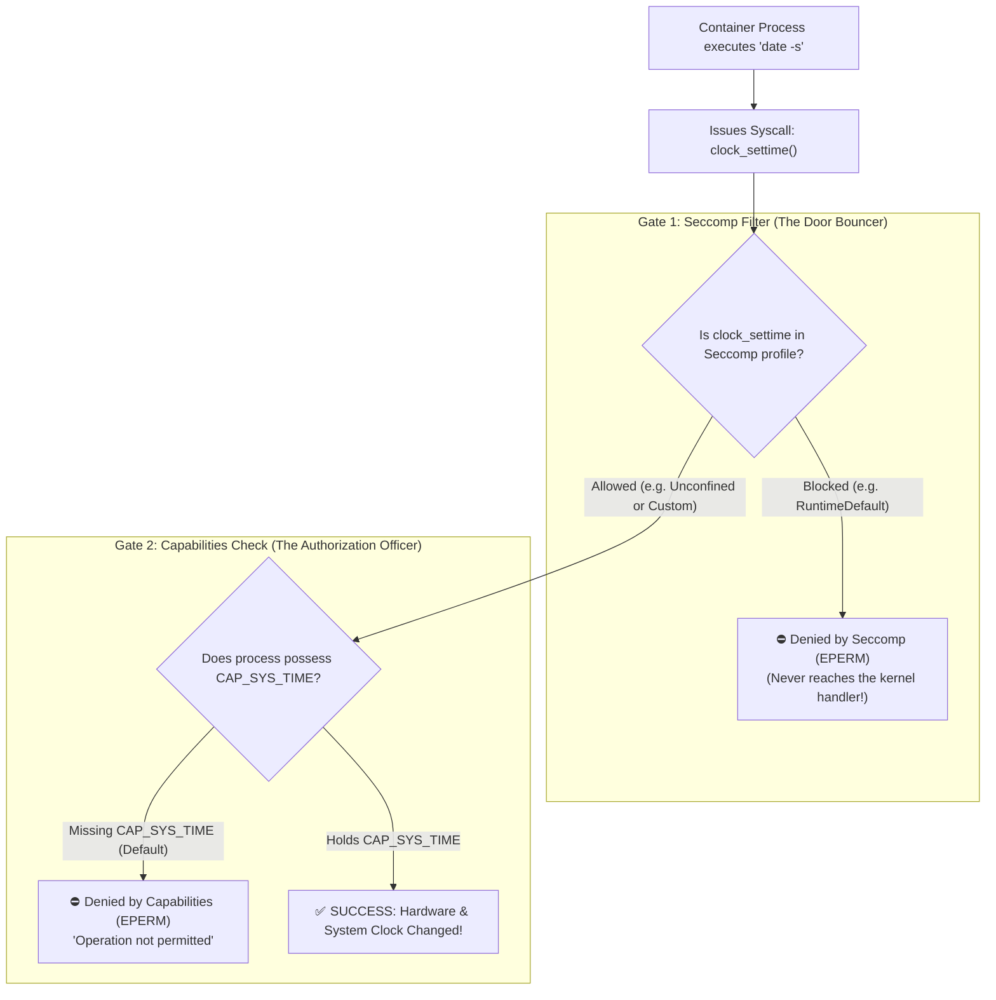
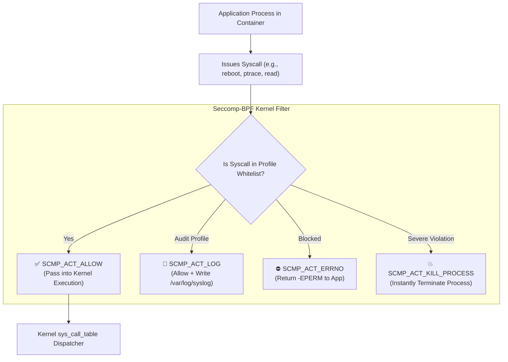
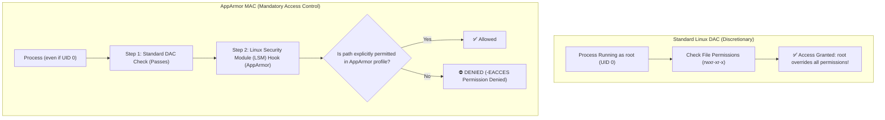
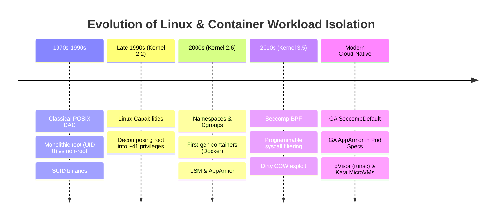

# Module 0-7-9: Workload Kernel Isolation, Seccomp, AppArmor & Linux Capabilities

**Breadcrumbs:** [[0-Index - Kubernetes|🏠 Kubernetes Reference MOC]] > [[0-Index - CKS|🛡️ CKS Reference MOC]] > **Module 0-7-9**

> [!NOTE] Companion Host Hardening Module
> Host-level operating system hardening, socket connection queues (`ss`), UFW firewall architecture, systemd unit management, kernel module blacklisting, SUID/SGID auditing, SSH hardening, and CIS node benchmarks are codified in **[[Reference Notes/0-7-7_host_operating_system_and_node_hardening.md|Module 0-7-7: Host Operating System & Node Hardening]]**.

---

## 🧭 Executive Overview: The Defense-in-Depth Journey

If you are new to container internals, the intersection of the Linux kernel, system calls, capabilities, Seccomp, and AppArmor can feel overwhelming. These technologies are not disconnected tools—they are **successive, concentric security rings** built around the Linux operating system kernel.



### The Plain-English Security Question Each Tool Answers:
1. **The System Call (Syscall):** *"How does a program ask the kernel to do anything at all?"*
2. **Linux Capabilities:** *"Is this process allowed to execute superuser-level administrative actions (like binding port 80 or changing clocks) without being granted God-mode root?"*
3. **Seccomp (Secure Computing):** *"Which specific system call functions is this container allowed to invoke out of the 450+ available in the Linux kernel?"*
4. **AppArmor (Mandatory Access Control):** *"Even if a syscall like `open` or `write` is permitted, WHICH specific file paths, directories, or network sockets is this program allowed to touch?"*
5. **Sandboxed Runtimes (gVisor & Kata):** *"What if we don't trust the kernel boundary at all and want an isolated mini-kernel or microVM for every pod?"*

---

## 1. 🧱 Foundation 0: Ground Zero — Operating System & Kernel Architecture

To understand container security, you must first dismantle a widespread misconception: **Containers are NOT Virtual Machines.** 

In a Virtual Machine (VM), hypervisors allocate dedicated virtual hardware, and each VM runs its own independent operating system kernel. In contrast, **containers are simply isolated Linux processes running directly on the host, sharing the single, underlying Linux kernel.**



### 1.1 The Great Divide: User Space vs. Kernel Space
Modern CPUs (like x86_64 and ARM64) enforce hardware protection levels known as **Privilege Rings**:



#### 🏦 The Bank Analogy:
* **User Space (Ring 3) = The Bank Customer Lobby:**  
  You (the application) stand in the public lobby. You are not allowed to walk behind the counter, open the safe vault, or re-wire the building's electrical breakers. If you need money deposited or retrieved, you must fill out a specific slip and hand it to the teller.
* **Kernel Space (Ring 0) = The Bank Vault & Tellers:**  
  The tellers (the Linux kernel) hold the keys to the vault (memory, disks, CPU, network hardware). They inspect your request, verify your identity and permissions, perform the physical action, and hand you back the result.
* **The Shared Kernel Hazard:**  
  Because every container on a Kubernetes worker node shares the same "bank tellers", any security vulnerability or bug in the kernel allows a malicious customer to hop over the counter, seize the vault keys, and take over the entire bank (the physical host node).

---

## 2. ⚡ Foundation 1: Linux System Calls (Syscalls) & `strace` Discovery

### 2.1 What Exactly is a System Call?
A **system call (syscall)** is the fundamental programmatic interface through which a user-space program requests a service from the operating system kernel.

An application **cannot** write directly to a hard drive, cannot read physical RAM addresses directly, and cannot transmit raw electrical pulses out of a network card. Every time your code wants to:
* Open, read, or write a file (`openat`, `read`, `write`, `close`)
* Allocate new heap memory (`brk`, `mmap`)
* Create a new process or thread (`fork`, `clone`, `execve`)
* Send or receive network packets (`socket`, `bind`, `connect`, `sendto`, `recvfrom`)
* Check or set the time (`clock_gettime`, `settimeofday`)

...it **must** make a system call into Ring 0.

### 2.2 The Anatomy of a Syscall (The 6-Step Execution Flow)

```mermaid
sequenceDiagram
    autonumber
    participant App as Userspace App (Ring 3)
    participant Libc as Standard Library (glibc/musl)
    participant CPU as CPU Registers (RAX, RDI, RSI...)
    participant Kernel as Linux Kernel (Ring 0)
    participant Dispatcher as sys_call_table Dispatcher
    participant HW as Hardware / Filesystem

    App->>Libc: fopen("/tmp/error.log", "w")
    Note over Libc: Libc translates function to syscall name & number
    Libc->>CPU: Put syscall ID (257 = sys_openat) in RAX register
    Libc->>CPU: Put arguments (filename, flags, mode) in RDI, RSI, RDX
    Libc->>CPU: Execute CPU Trap instruction (`syscall`)
    Note over CPU: CPU halts Ring 3; switches hardware to Ring 0
    CPU->>Kernel: Jump to Kernel Syscall Handler
    Kernel->>Dispatcher: Look up entry #257 in sys_call_table
    Dispatcher->>HW: Invoke sys_openat() filesystem driver
    HW-->>Kernel: File descriptor created (e.g., fd = 3)
    Kernel-->>CPU: Switch CPU back from Ring 0 to Ring 3
    CPU-->>App: Return integer file descriptor (fd = 3)
```

The Linux kernel maintains a central lookup array called `sys_call_table`. On x86_64, there are **over 450 distinct system calls**. Each system call has an index number:
* `0` = `read`
* `1` = `write`
* `2` = `open` (legacy)
* `3` = `close`
* `59` = `execve` (execute a program)
* `257` = `openat` (modern file open relative to directory fd)

### 2.3 Seeing Syscalls in Action with `strace` (KodeKloud Hands-on)

`strace` is the diagnostic utility that intercepts and displays every system call invoked by a process. 

#### Experiment 1: The Hidden Complexity of a Simple Command
When you execute `touch /tmp/error.log`, you might assume it only performs one action. Let's trace it:

```bash
strace touch /tmp/error.log
```

*Truncated output excerpt:*
```text
execve("/usr/bin/touch", ["touch", "/tmp/error.log"], 0x7ffce8f874f8 /* 23 vars */) = 0
brk(NULL)                               = 0x55d2826a3000
access("/etc/ld.so.preload", R_OK)      = -1 ENOENT (No such file or directory)
openat(AT_FDCWD, "/etc/ld.so.cache", O_RDONLY|O_CLOEXEC) = 3
fstat(3, {st_mode=S_IFREG|0644, st_size=31966, ...}) = 0
mmap(NULL, 31966, PROT_READ, MAP_PRIVATE, 3, 0) = 0x7f4f6b5b5000
close(3)                                = 0
openat(AT_FDCWD, "/tmp/error.log", O_WRONLY|O_CREAT|O_NOCTTY|O_NONBLOCK, 0666) = 3
utimensat(3, NULL, NULL, 0)             = 0
close(3)                                = 0
exit_group(0)                           = ?
```

**Deconstruction of What Happened:**
1. `execve(...)`: The shell requests the kernel to execute the `/usr/bin/touch` binary with arguments. Notice `/* 23 vars */`—this reflects the 23 environment variables inherited from your shell (verify with `env | wc -l`).
2. `brk` & `mmap`: The memory management syscalls allocate virtual address space and load dynamic shared libraries (`libc.so`).
3. `openat(...)`: The actual file creation call. It requests write access (`O_WRONLY`), creation if missing (`O_CREAT`), and returns file descriptor `3`.
4. `utimensat(...)`: Updates file access and modification timestamps.
5. `close(3)`: Releases the file descriptor.
6. `exit_group(0)`: Terminates the process cleanly.

#### Experiment 2: Statistical Syscall Summary (`strace -c`)
To view an aggregated performance and frequency breakdown of syscalls:

```bash
strace -c touch /tmp/error.log
```

```text
% time     seconds  usecs/call     calls    errors  syscall
------ ----------- ----------- --------- --------- ----------------
  0.00    0.000000           0         1           read
  0.00    0.000000           0         6           close
  0.00    0.000000           0         2           fstat
  0.00    0.000000           0         5           mmap
  0.00    0.000000           0         4           mprotect
  0.00    0.000000           0         3           brk
  0.00    0.000000           0         3         3 access
  0.00    0.000000           0         1           execve
  0.00    0.000000           0         3           openat
  0.00    0.000000           0         1           utimensat
------ ----------- ----------- --------- --------- ----------------
100.00    0.000000                    32         3 total
```
*Key Takeaway:* Even a trivial utility that writes zero bytes issues **32 separate system calls**! Complex applications (like the Kubernetes API server, etcd, or Java/Node.js web servers) issue thousands of syscalls per second.

#### Experiment 3: Attaching `strace` to a Live Running Process (`-p`)
In CKS troubleshooting, you often need to audit background daemons (like `etcd` or `kubelet`):

```bash
# 1. Identify the process PID
pidof etcd
# Suppose PID = 3596

# 2. Attach strace to the live process
strace -p 3596
```

Output:
```text
strace: Process 3596 attached
futex(0x1ac6be8, FUTEX_WAIT_PRIVATE, 0, NULL) = 0
futex(0xc000540bc8, FUTEX_WAKE_PRIVATE, 1) = 1
epoll_pwait(5, [], 128, 0, NULL, 0)     = 0
```
*(Press `Ctrl+C` to detach without stopping the process).*

### 2.4 Why Unrestricted Syscalls are a Critical Security Hazard
Because the Linux kernel supports legacy protocols and diverse hardware, it contains over 450 system calls. However, **standard web applications and microservices only ever need 40 to 70 of them.**

The remaining 380+ syscalls (such as `reboot`, `kexec_load`, `bpf`, `sys_chroot`, `ptrace`, `mount`, `clock_settime`) represent **unused attack surface**.

#### 💣 Real-World Exploit Case: Dirty COW (CVE-2016-5195)
The notorious **Dirty COW** vulnerability exploited a race condition in the Linux kernel's Copy-on-Write (COW) memory management subsystem using the **`ptrace`** system call. An unprivileged attacker inside a Docker container invoked `ptrace` to write directly to a read-only root file mapped into memory, escaping the container and seizing complete root control of the physical host machine!
* **The Lesson:** If the container had been blocked from invoking the `ptrace` system call, the exploit would have failed completely, regardless of the kernel vulnerability!

---

## 3. 🛡️ Foundation 2: Linux Capabilities — Decomposing God-Mode "Root"

Now that you understand system calls, let's look at authorization.

### 3.1 The Binary World of Traditional Unix (Before Linux 2.2)
Historically, Linux and UNIX divided all processes into two rigid, absolute categories:

| Process Category | User ID (UID) | Privileges | Analogy |
| :--- | :---: | :--- | :--- |
| **Privileged** | `UID 0` (`root`) | **God Mode:** Bypasses all kernel permission checks. Can read/write any file, reboot the machine, wipe disks, sniff all packets. | Emperor with absolute immunity. |
| **Unprivileged** | Any non-zero UID | **Peasant Mode:** Heavily restricted by standard file permissions (`rwxr-xr-x`). Cannot touch hardware. | Common citizen. |

#### The Architectural Disaster of Binary Root:
What happened if a software utility only needed to perform **one single administrative task**?
* **Problem 1 (The Web Server):** On Linux, network ports below `1024` are "privileged". To listen on port `80` (HTTP) or `443` (HTTPS), Nginx or Apache historically had to run with full `root` (`UID 0`) privileges. If a remote attacker found a buffer overflow in Nginx, they immediately gained root access to the entire operating system!
* **Problem 2 (The `ping` Utility):** Sending ICMP echo packets requires creating a raw network socket (`socket(AF_INET, SOCK_RAW, ...)`). Traditional users could not do this. The workaround was setting the SetUID bit (`chmod u+s /bin/ping`), forcing `ping` to execute as root for every ordinary user!
* **Problem 3 (System Clock):** An application needing to synchronize time via NTP required full root authority.

### 3.2 The Solution: Breaking Root into ~41 Capabilities
Starting in Linux Kernel 2.2, Linux adopted the POSIX 1003.1e draft specification. The monolithic power of `root` was sliced into approximately **41 distinct, granular units called Capabilities**.

Now, instead of asking *"Is this process running as UID 0?"*, the Linux kernel inspects the process and asks:  
👉 **"Does this process hold the specific capability required for this operation?"**



### 3.3 The CKS Core Capabilities Matrix
Here are the essential capabilities you must know for container security:

| Linux Capability | Privileges Granted | Threat / Risk Level in Containers |
| :--- | :--- | :--- |
| **`CAP_NET_BIND_SERVICE`** | Allows binding a socket to privileged system ports (< 1024, e.g. 80, 443, 53). | 🟢 **Benign / Standard:** Safe and required for web servers (Nginx, Envoy, Traefik). |
| **`CAP_SYS_TIME`** | Allows modifying the system hardware and software clocks (`date -s`, `settimeofday`). | 🟡 **High:** Containers share the host clock! Changing time inside a container alters the host node's clock, invalidating TLS certificates cluster-wide and breaking Raft/etcd consensus. |
| **`CAP_CHOWN`** | Allows changing file ownership arbitrarily (`chown`). | 🟢 **Operational:** Common in database init-containers to fix directory ownership. |
| **`CAP_DAC_OVERRIDE`** | Bypasses all Discretionary Access Control (`rwx`) file permission checks. | 🟡 **High:** Allows reading or modifying any file on the filesystem regardless of permissions. |
| **`CAP_NET_RAW`** | Permits opening RAW and PACKET sockets (e.g. `ping`, `tcpdump`). | 🔴 **High:** Allows an attacker to spoof ARP/IP packets or sniff traffic within the container network. |
| **`CAP_NET_ADMIN`** | Allows modifying network interfaces, IP routing tables, ARP caches, and iptables rules. | 🔴 **Critical:** Permits bypassing NetworkPolicies and hijacking node network routing. |
| **`CAP_SYS_PTRACE`** | Allows tracing and debugging arbitrary processes using `ptrace`. | 🔴 **Critical:** Enables dumping process memory (extracting secrets/keys) and injecting malicious shellcode. |
| **`CAP_SYS_ADMIN`** | The "kitchen sink" capability: mount/unmount filesystems, create new namespaces, load eBPF, configure cgroups. | 🔴 **Extreme (Root Equivalence):** Grants ~90% of traditional root power. Enables instant container escapes. |

### 3.4 The KodeKloud Mystery: Why Does `date -s` Fail in a Root Container?
In KodeKloud labs, a classic demonstration proves that container `root` is not full host `root`:

```bash
# Start a container as root (UID 0)
docker run -it --rm ubuntu /bin/bash

# Check identity
root@container:/# id
uid=0(root) gid=0(root) groups=0(root)

# Attempt to change system date
root@container:/# date -s '19 APR 2030 12:00:00'
date: cannot set date: Operation not permitted
```

#### Why Did This Fail If You Are `root`?
Because **Docker and containerd do NOT start containers with full root capabilities!**  
By default, the container runtime strips out dangerous capabilities, retaining only a baseline set of **14 default capabilities**.

Here is how default capabilities are defined inside the container runtime source code:

```go
// DefaultCapabilities returns the baseline capabilities granted to unprivileged containers
func DefaultCapabilities() []string {
    return []string{
        "CAP_CHOWN",
        "CAP_DAC_OVERRIDE",
        "CAP_FOWNER",
        "CAP_MKNOD",
        "CAP_NET_RAW",
        "CAP_SETGID",
        "CAP_SETUID",
        "CAP_SETFCAP",
        "CAP_SETPCAP",
        "CAP_NET_BIND_SERVICE",
        "CAP_SYS_CHROOT",
        "CAP_KILL",
        "CAP_AUDIT_WRITE",
    }
}
```

Notice what is **missing** from this list: **`CAP_SYS_TIME`** is absent!  
Even though the process has `UID 0`, when `date -s` issues the `settimeofday()` system call, the Linux kernel checks if the calling process possesses `CAP_SYS_TIME`. Because it does not, the kernel rejects the call with `-EPERM` (`Operation not permitted`).

### 3.5 ❓ Deep Diagnostic Question: The System Time Paradox (Syscalls vs. Capabilities)

> [!QUESTION] **The Question That Confuses Most Engineers:**
> *"In CKS lectures, it is taught that system calls (like `clock_settime` or `settimeofday`) change the system time, and Seccomp can block them. But we also just learned that `CAP_SYS_TIME` controls changing the time! Do BOTH have to be enabled, or does each control a different scope—e.g., is one for 'container-specific time' and the other for the 'host node time'?"*

#### 1. Do Both Have to Be Enabled?
**YES.** They are **consecutive, sequential security checkpoints in the kernel pipeline**. For a process to alter the clock, **both gates must open**:
* **Gate 1: Seccomp Filter (The Door Bouncer):** Checks if the process is permitted to invoke the system call function index (`clock_settime` / `settimeofday`). If Seccomp blocks the syscall, execution halts immediately with `-EPERM`. The kernel never even checks who you are or what capabilities you hold.
* **Gate 2: Capabilities Check (The Authorization Officer):** If Seccomp allows the syscall through, the kernel's execution handler for `clock_settime` checks credentials:
  ```c
  if (!capable(CAP_SYS_TIME))
      return -EPERM;
  ```
  If the process lacks `CAP_SYS_TIME`, the kernel denies the request with `Operation not permitted` (`-EPERM`).



#### 2. Is One for "Container Time" and the Other for "Host Node Time"?
**NO. There is no separate 'container system time' in standard Linux containers.**

Containers achieve isolation using Linux **Namespaces**:
* PID Namespace $\rightarrow$ Process tree isolation
* NET Namespace $\rightarrow$ IP addresses, interfaces, routing tables
* MNT Namespace $\rightarrow$ Filesystem mount points
* IPC Namespace $\rightarrow$ Shared memory segments
* UTS Namespace $\rightarrow$ Hostname and domain name

Notice: **Historically, there was NO Time Namespace in Linux.**  
The system clock (`CLOCK_REALTIME` / wall-clock time) is tied directly to the **host hardware Real-Time Clock (RTC)** managed by the host kernel. All containers on a node read and share that exact same hardware clock!

> [!CAUTION]
> **The Cluster-Wide Disaster of Modifying Time:**  
> If an attacker or misconfigured pod runs with **both** gates opened:
> ```yaml
> securityContext:
>   capabilities:
>     add: ["SYS_TIME"]
>   seccompProfile:
>     type: Unconfined
> ```
> Changing the time (`date -s "2030-01-01"`) modifies the **physical host node's hardware clock**, which immediately triggers three catastrophic failure loops:
> 1. **TLS Certificate Expiration:** Kubernetes API certificates, Kubelet client certs, and etcd peer certificates become invalid or expired, locking out all `kubectl` operations.
> 2. **Raft Consensus Collapse:** `etcd` heartbeat lease timers expire prematurely, triggering infinite leader election cycles and taking down the control plane.
> 3. **Observability Blindness:** Prometheus, Datadog, and Loki drop all incoming metrics and logs because timestamps are recorded in the far future.

#### 3. Resolving the KodeKloud Demonstration
This explains the exact behavior observed in the CKS course video:
1. **Running with Seccomp Unconfined:**
   ```bash
   docker run -it --rm --security-opt seccomp=unconfined docker/whalesay /bin/sh
   # date -s '19 APR 2012 22:00:00'
   date: cannot set date: Operation not permitted
   ```
   *Why it failed:* Setting `--security-opt seccomp=unconfined` opened **Gate 1**, but **Gate 2 (`CAP_SYS_TIME`) was still closed** because Docker strips `CAP_SYS_TIME` by default!
2. **Opening Both Gates (Lab Demonstration Only):**
   ```bash
   docker run -it --rm --security-opt seccomp=unconfined --cap-add=SYS_TIME docker/whalesay /bin/sh
   ```
   Only when both Gate 1 and Gate 2 are opened does the call reach the hardware clock.

### 3.6 Auditing Capabilities with Linux CLI Tools
You can inspect capabilities on binaries and running processes using standard tools:

```bash
# 1. Audit file capabilities on a binary (e.g. ping)
getcap /usr/bin/ping
# Output: /usr/bin/ping cap_net_raw=ep
# Explanation: 'ep' means Effective and Permitted. ping can open raw sockets without SUID root!

# 2. Grant a binary the ability to bind port 80 without being root
setcap 'cap_net_bind_service=+ep' /usr/local/bin/custom-webserver

# 3. Inspect capabilities of a running process by its PID
getpcaps $(pidof sshd | awk '{print $1}')
# Output: 779: cap_chown,cap_dac_override,cap_net_bind_service,cap_sys_chroot=ep

# 4. View capability bitmasks from /proc
grep Cap /proc/$$/status
# Output:
# CapInh: 0000000000000000 (Inherited)
# CapPrm: 00000000a80425fb (Permitted)
# CapEff: 00000000a80425fb (Effective)
# CapBnd: 00000000a80425fb (Bounding)
# CapAmb: 0000000000000000 (Ambient)

# 5. Decode the hexadecimal bitmask into human-readable names
capsh --decode=00000000a80425fb
```

### 3.7 Hardening Kubernetes Workloads: Least Privilege Capabilities

The Kubernetes CIS Benchmark and Pod Security Standards (PSS **Restricted** profile) mandate:
1. **Drop ALL default capabilities.**
2. **Add back ONLY what is strictly required** (e.g., `NET_BIND_SERVICE` for web servers).
3. **Disable privilege escalation** (`allowPrivilegeEscalation: false`).

```yaml
apiVersion: v1
kind: Pod
metadata:
  name: hardened-web-pod
spec:
  containers:
  - name: nginx
    image: nginx:1.25-alpine
    securityContext:
      # Step 1: Prevent child processes from acquiring new privileges via SUID binaries
      allowPrivilegeEscalation: false
      
      # Step 2: Enforce non-root execution
      runAsNonRoot: true
      runAsUser: 101
      
      # Step 3: Strip ALL default capabilities, add only port binding
      capabilities:
        drop:
        - ALL
        add:
        - NET_BIND_SERVICE
```

> [!IMPORTANT]
> **What is `allowPrivilegeEscalation: false`?**  
> Under the hood, setting this field instructs the container runtime to execute the kernel system call:  
> `prctl(PR_SET_NO_NEW_PRIVS, 1, 0, 0, 0);`  
> Once the `no_new_privs` bit is set on a process, the Linux kernel **permanently disables** SUID/SGID execution bits and file capability inheritance for that process and all child processes it ever forks. Even if an attacker drops a root-owned `4755` binary into the container filesystem, executing it will not grant root privileges!

---

## 4. 🚪 Foundation 3: Restricting Syscalls with Seccomp (Secure Computing Mode)

Now we reach the next concentric defense ring: **Seccomp**.

### 4.1 Why Capabilities Alone Are Not Enough
Linux Capabilities control *privilege-sensitive operations*. However, there are over 380 standard system calls that require **no special capabilities at all** (e.g., `madvise`, `sysfs`, `lookup_dcookie`, `unshare`, `perf_event_open`). 

If a memory corruption zero-day vulnerability exists inside the kernel's implementation of an obscure syscall, an unprivileged process with zero capabilities can still trigger it! 

👉 **Seccomp acts as a security bouncer stationed right at the entrance of the Linux syscall dispatcher, validating whether the syscall number is even allowed to execute.**



### 4.2 The Three Seccomp Modes
Seccomp operates in three distinct kernel modes:

| Mode | Name | Behavior | Usability |
| :---: | :--- | :--- | :--- |
| **Mode 0** | **DISABLED** | Seccomp is inactive. Process can invoke all 450+ syscalls. | High risk. |
| **Mode 1** | **STRICT** | Historical mode (Linux 2.6.12). Permits **only 4 system calls**: `read`, `write`, `exit`, and `sigreturn`. Invoking any other syscall instantly terminates the process with `SIGKILL`. | Too rigid for real applications. |
| **Mode 2** | **FILTER (Seccomp-BPF)** | Modern mode (Linux 3.5+). Uses Berkeley Packet Filter (BPF) programs to inspect syscall numbers and arguments against dynamic whitelist/blacklist rules with configurable actions. | **Production standard.** |

To verify if your worker node's kernel supports Seccomp filtering:
```bash
grep -i seccomp /boot/config-$(uname -r)
# Expected output:
# CONFIG_SECCOMP=y
# CONFIG_SECCOMP_FILTER=y
```

### 4.3 The `amicontained` Discovery: Docker vs. Kubernetes Default Behavior

In KodeKloud's CKS course, an eye-opening experiment is conducted using the container introspection tool **`amicontained`**:

#### Test 1: Running `amicontained` Directly in Docker
```bash
docker run --rm r.j3ss.co/amicontained amicontained
```
*Output:*
```text
Container Runtime: docker
Seccomp: filtering
Blocked Syscalls (64):
    PIVOT_ROOT ACCT SETTIMEOFDAY MOUNT UMOUNT2 SWAPON SWAPOFF REBOOT
    SETHOSTNAME SETDOMAINNAME INIT_MODULE DELETE_MODULE KEXEC_LOAD BPF ...
```
*Docker applies a default Seccomp filter out of the box, blocking 64 dangerous syscalls.*

#### Test 2: Running `amicontained` in Standard Kubernetes (Without Configuration)
```bash
kubectl run test-pod --image=r.j3ss.co/amicontained --restart=Never -- amicontained
kubectl logs test-pod
```
*Output:*
```text
Container Runtime: containerd
Seccomp: disabled
Blocked Syscalls (21):
    PIVOT_ROOT ACCT SETTIMEOFDAY UMOUNT2 SWAPON SWAPOFF REBOOT ...
```
*Key Revelation:* **In unhardened Kubernetes clusters, Seccomp is DISABLED by default!** Only 21 syscalls are blocked by baseline runtime constraints. This leaves over 400 syscalls completely open to container processes!

### 4.4 Seccomp Profile Structure & Action Codes
Seccomp profiles are formatted as JSON documents.

#### Whitelist vs. Blacklist Architecture:
* **Blacklist:** Sets `"defaultAction": "SCMP_ACT_ALLOW"` and lists specific syscalls to block. **Anti-pattern:** Easy to set up, but dangerously insecure because newly introduced kernel syscalls are automatically permitted.
* **Whitelist:** Sets `"defaultAction": "SCMP_ACT_ERRNO"` and lists only approved syscalls. **Best practice:** Any unrecognized or newly added syscall is blocked by default.

#### Core Action Codes:
* **`SCMP_ACT_ALLOW`**: Permits the syscall to execute normally.
* **`SCMP_ACT_LOG`**: Permits execution, but logs an audit message to the host syslog (`/var/log/syslog`). Ideal for profiling.
* **`SCMP_ACT_ERRNO`**: Blocks the syscall and returns an error code (`EPERM` by default) to the application without terminating it.
* **`SCMP_ACT_KILL_PROCESS`**: Immediately terminates the entire process upon violation.

### 4.5 Seccomp in Kubernetes: Profile Types
Kubernetes supports three Seccomp profile types in `securityContext.seccompProfile`:

```yaml
apiVersion: v1
kind: Pod
metadata:
  name: seccomp-demo
spec:
  securityContext:
    seccompProfile:
      # Option 1: RuntimeDefault (Recommended for 95% of workloads)
      type: RuntimeDefault

      # Option 2: Localhost (Loads a custom JSON file from node disk)
      # type: Localhost
      # localhostProfile: profiles/my-profile.json

      # Option 3: Unconfined (Completely disables Seccomp filtering - High Risk!)
      # type: Unconfined
```

| Type | How It Works | PSS Tier |
| :--- | :--- | :--- |
| **`RuntimeDefault`** | Uses the container runtime's built-in seccomp profile (`containerd`/`CRI-O`). Blocks ~60 dangerous syscalls (mount, reboot, bpf, sys_chroot) while keeping all normal application functionality intact. | **Restricted** |
| **`Localhost`** | Loads a custom JSON profile stored locally on each worker node. Path is resolved relative to `/var/lib/kubelet/seccomp/`. | **Restricted** |
| **`Unconfined`** | Disables all syscall filtering. The container can invoke all 450+ syscalls. | **Privileged** |

> [!WARNING]
> **The `privileged: true` Override Trap:**  
> If a container specifies `privileged: true` in its container `securityContext`, **all Seccomp profiles are completely overridden and disabled!** Privileged containers always execute as `Unconfined`.

### 4.6 The 4-Stage Syscall Profiling Workflow (From Discovery to Production)

How do security engineers build custom Seccomp whitelists for proprietary applications? They follow an iterative 4-stage lifecycle:

```mermaid
sequenceDiagram
    autonumber
    participant Eng as Security Engineer
    participant Node as Worker Node Disk (/var/lib/kubelet/seccomp/)
    participant Pod as Kubernetes Pod
    participant Syslog as Host Kernel Syslog (/var/log/syslog)

    Eng->>Node: 1. Deploy audit.json (defaultAction: SCMP_ACT_LOG)
    Eng->>Pod: 2. Launch Pod with localhostProfile: profiles/audit.json
    Pod->>Syslog: 3. Exercise app; Kernel logs audit type=1326 for all syscalls
    Eng->>Syslog: 4. Extract syscall numbers & convert to names
    Eng->>Node: 5. Deploy fine-grained.json (defaultAction: ERRNO + allowed names)
    Eng->>Pod: 6. Deploy production Pod with fine-grained profile
    Note over Pod: Pod runs with minimum necessary syscalls!
```

#### Stage 1: Deploy Non-Blocking Audit Profile
Create `/var/lib/kubelet/seccomp/profiles/audit.json` on worker nodes:
```json
{
  "defaultAction": "SCMP_ACT_LOG"
}
```
Deploy the test pod referencing `profiles/audit.json`:
```yaml
apiVersion: v1
kind: Pod
metadata:
  name: audit-pod
spec:
  securityContext:
    seccompProfile:
      type: Localhost
      localhostProfile: profiles/audit.json
  containers:
  - name: app
    image: hashicorp/http-echo:1.0
    args: ["-text=testing-syscalls"]
    securityContext:
      allowPrivilegeEscalation: false
```

#### Stage 2: Capture and Decode Audit Logs
Exercise the application, then inspect `/var/log/syslog` on the worker node:
```bash
grep syscall /var/log/syslog | grep 'http-echo'
```
*Sample Kernel Audit Output:*
```text
audit: type=1326 audit(1594067860.484:14536): auid=4294967295 uid=0 gid=0 ses=4294967295 pid=29064 comm="http-echo" exe="/http-echo" sig=0 arch=c000003e syscall=51 compat=0 ip=0x46fe1f code=0x7ffc0000
```
* **`type=1326`**: Standard Linux kernel audit identifier for `AUDIT_SECCOMP`.
* **`syscall=51`**: The numeric syscall index on x86_64 (`51` = `getsockname`, `54` = `setsockopt`, `202` = `futex`, `0` = `read`, `257` = `openat`).
* **`code=0x7ffc0000`**: Action result bitmask corresponding to `SECCOMP_RET_LOG`.

#### Stage 3: Observe Total Denial Failure (`violation.json`)
If you test a profile with zero allowed syscalls (`/var/lib/kubelet/seccomp/profiles/violation.json`):
```json
{
  "defaultAction": "SCMP_ACT_ERRNO"
}
```
The pod immediately crashes with status **`ContainerCannotRun`** or **`CrashLoopBackOff`** because even baseline startup syscalls (`execve`, `mmap`, `brk`) are blocked!

#### Stage 4: Enforce the Production Whitelist (`fine-grained.json`)
Combine the audited syscalls with standard runtime startup calls into `/var/lib/kubelet/seccomp/profiles/fine-grained.json`:
```json
{
  "defaultAction": "SCMP_ACT_ERRNO",
  "architectures": [
    "SCMP_ARCH_X86_64",
    "SCMP_ARCH_X86",
    "SCMP_ARCH_X32"
  ],
  "syscalls": [
    {
      "names": [
        "accept4",
        "arch_prctl",
        "bind",
        "brk",
        "clock_gettime",
        "clone",
        "close",
        "connect",
        "epoll_create1",
        "epoll_pwait",
        "execve",
        "exit_group",
        "fcntl",
        "futex",
        "getpid",
        "getsockname",
        "listen",
        "mmap",
        "mprotect",
        "munmap",
        "nanosleep",
        "openat",
        "read",
        "rt_sigaction",
        "rt_sigprocmask",
        "setsockopt",
        "socket",
        "write"
      ],
      "action": "SCMP_ACT_ALLOW"
    }
  ]
}
```
Now deploy your production pod referencing `profiles/fine-grained.json`. The pod runs in a state of least-privilege syscall containment.

### 4.7 Cluster-Wide Seccomp Defaulting (`seccompDefault`)
*Feature State: **Stable (GA) in Kubernetes v1.27+**.*

Rather than relying on developers to remember `type: RuntimeDefault` in every pod manifest, configure Kubelet to enforce `RuntimeDefault` automatically on all unconfigured pods.

In `/var/lib/kubelet/config.yaml`:
```yaml
apiVersion: kubelet.config.k8s.io/v1beta1
kind: KubeletConfiguration
seccompDefault: true
```
Restart Kubelet:
```bash
systemctl daemon-reload && systemctl restart kubelet
```
* **Zero API Mutation:** Enabling this does not alter YAML manifests in etcd. It is enforced transparently by Kubelet at container creation time.
* **Verification via CRI (`crictl`):**
  ```bash
  crictl inspect $(crictl ps --name=my-pod -q) | jq .info.runtimeSpec.linux.seccomp
  ```

---

## 5. 📁 Foundation 4: Path-Based Mandatory Access Control (AppArmor)

We now move to the next layer: **AppArmor**.

### 5.1 Why Seccomp is Still Not Enough: The Path Blindspot
Consider this scenario:
* Your web application needs to open and write files (`openat`, `write`).
* You configure Seccomp to allow `openat` and `write`.
* An attacker finds an Arbitrary File Write vulnerability in your web application.
* Because the `openat` and `write` syscalls are allowed, the attacker overwrites `/etc/shadow`, alters `/root/.ssh/authorized_keys`, or defaces web assets.

**Seccomp cannot prevent this because Seccomp only inspects the system call name and raw integer arguments—it does NOT inspect or enforce filesystem paths!**

👉 **AppArmor (Application Armor)** solves this problem. It is a **path-based Mandatory Access Control (MAC)** system. It restricts *which specific directories and files* a program is allowed to access, regardless of what user or UID executes the program.

### 5.2 Discretionary Access Control (DAC) vs. Mandatory Access Control (MAC)



* **DAC:** Authorization is based purely on ownership and permissions (`chmod`, `chown`). If a process runs as root (`UID 0`), it bypasses DAC restrictions.
* **MAC:** An overarching security policy defines what a program can do. **Even if a program runs as root (`UID 0`), AppArmor can block it from writing to `/opt` or reading `/etc/shadow`!**

### 5.3 The Three AppArmor Operational Modes
1. **`enforce` Mode:**  
   Rules are strictly enforced. Violations are blocked immediately with `Permission denied` (`-EACCES`) and logged to `/var/log/syslog` or `dmesg`.
2. **`complain` Mode:**  
   Rules are **not** enforced. The application is allowed to execute normally, but violations trigger security audit warnings. Used during development to generate profile baselines.
3. **`unconfined`:**  
   The process is exempt from AppArmor restrictions.

Verify AppArmor status on the host node:
```bash
# Check if service is active
systemctl status apparmor

# Check if kernel module is loaded
cat /sys/module/apparmor/parameters/enabled
# Expected output: Y

# Check detailed status of loaded profiles
aa-status
```

### 5.4 AppArmor Profile Anatomy & Rule Syntax

AppArmor profiles are plain text files placed in `/etc/apparmor.d/`.

```text
#include <tunables/global>

profile custom-app-profile flags=(attach_disconnected) {
  #include <abstractions/base>
  #include <abstractions/bash>

  # 1. File Access Rules (r = read, w = write, rw = read/write)
  /usr/bin/bash ix,
  /usr/bin/date mrix,
  /opt/app/data/ rw,
  /opt/app/data/** rw,

  # 2. Explicit Hard Denials (Deny rules ALWAYS take precedence!)
  deny /etc/shadow r,
  deny /** w,
}
```

#### File Permission Modifiers:
* `r`: Read data or list directory contents.
* `w`: Write, create, modify, or truncate files.
* `a`: Append data only (cannot overwrite existing bytes).
* `k`: Acquire POSIX file locks.
* `l`: Create hard links.

#### Process Execution Qualifiers:
* `ix` (Inherit): Spawns child binary under the **same** AppArmor profile.
* `px` (Profile transition): Spawns child binary under a dedicated profile.
* `ux` (Unconfined): Spawns child completely unconfined (**High hazard!** Never grant `ux` to shells like `/bin/bash`).

#### Path Globbing Syntax:
* `*`: Matches any characters within a single directory level (does not match `/`).
* `**`: Matches across multiple directory levels recursively (includes `/`).
* `?`: Matches exactly one character.

### 5.5 Generating Custom Profiles with `apparmor-utils` (KodeKloud Walkthrough)

In KodeKloud's CKS course, an application script `/root/add_data.sh` creates directories and logs:

```bash
#!/bin/bash
data_directory=/opt/app/data
mkdir -p "${data_directory}"
echo "=> File created at $(date)" | tee "${data_directory}/create.log"
```

To build a profile automatically without writing syntax manually:

```bash
# 1. Install utilities
apt-get install -y apparmor-utils

# 2. Run aa-genprof to profile the binary
aa-genprof /root/add_data.sh
```

**The Interactive Workflow:**
1. `aa-genprof` sets `/root/add_data.sh` to **complain mode**.
2. In a second terminal, execute the script: `./add_data.sh`.
3. Return to `aa-genprof` and press `(S)can`.
4. `aa-genprof` scans `/var/log/syslog` for complaint events:
   * Prompt: Execute `/usr/bin/mkdir`? $\to$ Press `(I)nherit`.
   * Prompt: Execute `/usr/bin/tee`? $\to$ Press `(I)nherit`.
   * Prompt: Path `/proc/filesystems`? $\to$ Press `(D)eny`.
5. Press `(S)ave` and `(F)inish`. The profile is automatically saved to `/etc/apparmor.d/root.add_data.sh` and locked into **enforce mode**!

### 5.6 Profile Management Commands (`apparmor_parser`)
```bash
# Parse and load a profile into the kernel
apparmor_parser -q /etc/apparmor.d/custom-profile

# Reload an updated profile (in-place replacement)
apparmor_parser -r /etc/apparmor.d/custom-profile

# Unload / remove a profile from the kernel
apparmor_parser -R /etc/apparmor.d/custom-profile

# Switch modes
aa-complain /etc/apparmor.d/custom-profile
aa-enforce /etc/apparmor.d/custom-profile
```

### 5.7 Enforcing AppArmor in Kubernetes Pods

> [!CAUTION]
> **The Golden Node Rule:**  
> The target AppArmor profile **MUST be loaded into the Linux kernel of EVERY worker node** where the pod may run. Kubernetes does NOT distribute profile files across nodes! If a pod requests a profile that is not loaded on the scheduled worker node, the pod fails with `CreateContainerError` or `FailedCreatePodSandBox`.

#### Modern Syntax (Kubernetes v1.30+ GA Native Field):
Starting in Kubernetes v1.30, AppArmor is configured directly in `securityContext.appArmorProfile`:

```yaml
apiVersion: v1
kind: Pod
metadata:
  name: ubuntu-sleeper
spec:
  securityContext:
    appArmorProfile:
      type: Localhost
      localhostProfile: apparmor-deny-write
  containers:
  - name: hello
    image: ubuntu
    command: ["sh", "-c", "echo 'Sleeping for an hour!' && sleep 1h"]
```

#### Legacy Syntax (Kubernetes v1.29 and earlier):
In older clusters, AppArmor was specified via beta pod annotations:
```yaml
metadata:
  annotations:
    container.apparmor.security.beta.kubernetes.io/hello: localhost/apparmor-deny-write
```

#### Testing and Verification:
Attempting to create a file inside the confined container:
```bash
kubectl exec -it ubuntu-sleeper -- touch /tmp/test
# Expected output:
# touch: cannot touch '/tmp/test': Permission denied
```

#### Decoding Kernel Audit Logs:
On the worker node hosting the pod, inspect the rejection in `dmesg`:
```bash
dmesg | grep -i apparmor
```
*Sample Log:*
```text
audit: type=1400 audit(1620000000.123:456): apparmor="DENIED" operation="open" profile="apparmor-deny-write" name="/tmp/test" pid=1234 comm="touch" requested_mask="w" denied_mask="w" fsuid=0 ouid=0
```
* `apparmor="DENIED"`: Confirms hard enforcement block.
* `operation="open"`: The system call operation.
* `name="/tmp/test"`: The exact target file path attempted.
* `denied_mask="w"`: Write access was denied by the profile.

---

## 6. 📦 Foundation 5: Sandboxed Container Runtimes (gVisor & Kata Containers)

Even with Capabilities dropped, Seccomp filtering active, and AppArmor profiles enforced, one fundamental risk remains:  
👉 **The container process still shares the host Linux kernel directly.**

If an application requires hundreds of syscalls, or if multiple untrusted tenants share the same node, a zero-day kernel exploit can compromise the physical host. **Sandboxed container runtimes** solve this by inserting a virtualization or userspace isolation layer.

```mermaid
flowchart TD
    subgraph StandardRuntime ["1. Standard Container (runc) - Shared Kernel"]
        App1["Container Process"] -->|"Direct Syscalls"| HostK1["Host Linux Kernel"]
    end

    subgraph gVisorRuntime ["2. gVisor (runsc) - Application Kernel in Go"]
        App2["Container Process"] -->|"Syscalls Intercepted"| Sentry["Sentry (Go Userspace Kernel)\nImplements 300+ Syscalls"]
        Sentry -->|"File Proxy"| Gofer["Gofer Process"]
        Gofer -->|"Safe Filtered Calls"| HostK2["Host Linux Kernel"]
    end

    subgraph KataRuntime ["3. Kata Containers - MicroVM Hardware Isolation"]
        App3["Container Process"] --> DedicatedK["Dedicated Guest Linux Kernel"]
        DedicatedK --> Qemu["MicroVM Hypervisor (QEMU / Cloud-Hypervisor)"]
        Qemu -->|"Hardware Virtualization"| HostK3["Host Linux Kernel"]
    end
```



### 6.1 gVisor (`runsc`)
Developed by Google, **gVisor** intercepts application system calls in user space using an application-level kernel written in memory-safe Go.

#### Core Components:
1. **Sentry:** An independent userspace kernel. When the container invokes a syscall, Sentry intercepts it and handles the logic internally in Go. Over 300 Linux syscalls are handled without ever touching the host Linux kernel!
2. **Gofer:** A dedicated file proxy process. When the container needs filesystem access, Sentry communicates with Gofer, which performs the file access on behalf of the container.
3. **Independent Network Stack:** gVisor includes its own network stack (`Netstack`), isolating the container from the host kernel's network code.

### 6.2 Kata Containers
**Kata Containers** takes a different approach: rather than emulating a kernel in software, it launches each Pod inside its own **dedicated, lightweight Virtual Machine (MicroVM)**.
* **Dedicated Guest Kernel:** Every pod runs its own independent Linux kernel inside a MicroVM.
* **Failure Containment:** If an attacker achieves a kernel panic or zero-day escape inside the container, they only compromise their own MicroVM; the host operating system is completely unaffected.
* **Hardware Requirement:** Kata requires hardware virtualization support (Intel VT-x / AMD-V). Running Kata inside cloud VMs requires **nested virtualization**, which may introduce performance overhead or be unsupported by certain cloud providers.

### 6.3 Kubernetes Integration: `RuntimeClass`
To use gVisor or Kata in Kubernetes, register a `RuntimeClass` and reference it in Pod specs:

```yaml
# 1. Register the RuntimeClass
apiVersion: node.k8s.io/v1
kind: RuntimeClass
metadata:
  name: gvisor
handler: runsc
---
# 2. Assign the RuntimeClass to an Untrusted Workload
apiVersion: v1
kind: Pod
metadata:
  name: untrusted-python-runner
spec:
  runtimeClassName: gvisor
  containers:
  - name: runner
    image: python:3.11-slim
    command: ["python", "-c", "import os; print(os.uname())"]
```

---

## 7. ⚖️ Master Comparison & Defense-in-Depth Decision Matrix

| Security Layer | Where It Operates | Core Question Answered | How It Blocks Unauthorized Actions | How It Is Configured in Kubernetes |
| :--- | :--- | :--- | :--- | :--- |
| **Linux Capabilities** | Process Credentials (`task_struct`) | *"Does this process have permission for superuser tasks (binding port 80, changing clocks)?"* | Kernel permission checks return `EPERM`. | `securityContext.capabilities.drop: [ALL]`, `add: [...]` |
| **Seccomp** | Syscall Dispatcher | *"Is this specific system call number allowed to be called by this container?"* | Seccomp-BPF filter returns `SCMP_ACT_ERRNO` or terminates with `KILL`. | `securityContext.seccompProfile.type: RuntimeDefault / Localhost` |
| **AppArmor** | Linux Security Module (LSM) Hooks | *"Is this program allowed to read, write, or execute this specific FILE PATH?"* | LSM hook evaluates path rules and returns `Permission denied` (`-EACCES`). | `securityContext.appArmorProfile.type: Localhost` (v1.30+) |
| **gVisor (`runsc`)** | User-Space Emulation | *"Can we prevent container syscalls from reaching the host Linux kernel entirely?"* | Sentry Go kernel intercepts and executes syscalls in userspace. | `RuntimeClass: gvisor` (`handler: runsc`) |
| **Kata Containers** | Hardware MicroVM | *"Can we give each pod its own dedicated hardware-isolated guest kernel?"* | Hypervisor runs container in dedicated MicroVM. | `RuntimeClass: kata` (`handler: kata`) |

---

## 8. 🔍 AARF Deep-Intuition Analyses

### 8.1 AARF Analysis: Linux Capabilities
1. **The Answer (Core Pattern):** Configure `securityContext.capabilities.drop: ["ALL"]` on all workloads, adding back only specific operational necessities (`NET_BIND_SERVICE`). Pair with `allowPrivilegeEscalation: false` and `runAsNonRoot: true`.
2. **The Assumptions (Context):** Applications run in standard container runtimes (containerd/CRI-O). Runtimes apply capability bounding filters prior to executing the container entrypoint.
3. **The Rationale (Why):** Containers share the host kernel. By default, runtimes grant ~14 baseline capabilities. If an attacker exploits an application vulnerability, retaining capabilities like `CAP_NET_RAW` allows packet spoofing or network sniffing. Dropping `ALL` eliminates these attack vectors.
4. **The Failure Loop (What If Not):** Granting `CAP_SYS_ADMIN` or running with `--privileged` gives containers near-complete kernel authority, enabling namespace escape attacks, raw block device writes, and host kernel module manipulation.
5. **The Alternative Case (When Additional Capabilities are Required):** Networking daemonsets (Calico, Cilium, kube-proxy) require `CAP_NET_ADMIN` and `CAP_NET_RAW` to program host routing tables and eBPF maps. Storage CSI plugins require `CAP_SYS_ADMIN` to execute block mounts. In these specialized scenarios, isolate pods to dedicated system namespaces.
6. **The Evolutionary Bridge:**
   * **Monolithic Root:** Historical UNIX had no concept of capability segmentation; software had to be granted complete root access.
   * **POSIX Capabilities:** Decomposed root into ~41 bits, allowing binaries to hold isolated powers via file attributes (`setcap`).
   * **Modern Kubernetes:** Pod Security Standards (`Restricted`) mandate dropping `ALL` capabilities by default.

### 8.2 AARF Analysis: Seccomp Syscall Filtering
1. **The Answer (Core Pattern):** Enforce `seccompProfile.type: RuntimeDefault` across all standard workloads, and configure `seccompDefault: true` on worker node Kubelets. For high-security environments, profile applications using `audit.json` (`SCMP_ACT_LOG`) and craft strict `Localhost` whitelists (`SCMP_ACT_ERRNO` + allowed names).
2. **The Assumptions (Context):** Applications run in unprivileged containers (`privileged: false`) with `allowPrivilegeEscalation: false`. Worker nodes run Linux kernels v3.5+ with `CONFIG_SECCOMP=y` and `CONFIG_SECCOMP_FILTER=y`.
3. **The Rationale (Why):** Linux containers share the host operating system kernel. Over 450 system calls exist, but modern microservices need only 40–70. Dropping the remaining 380+ syscalls neutralizes kernel exploit chains (privilege escalation, namespace breakouts, memory corruption) before they reach the dispatcher.
4. **The Failure Loop (What If Not):** Leaving containers `Unconfined` allows an attacker who achieves RCE inside a container to exploit kernel zero-days (e.g. `Dirty COW`, `Dirty Pipe`) to gain instant host `root` control.
5. **The Alternative Case (When to Use Sandboxing Instead):** If an application requires hundreds of obscure syscalls, or if multiple untrusted tenants share the same node, crafting seccomp whitelists becomes impractical. Deploy sandboxed userspace kernels (**gVisor `runsc`**) or microVMs (**Kata Containers**) via `RuntimeClass`.
6. **The Evolutionary Bridge:**
   * **Classical UNIX:** No syscall filtering existed; any process with UID 0 could invoke any kernel syscall.
   * **Linux 2.6.12 Seccomp (Strict Mode):** Allowed only 4 syscalls (`read`, `write`, `exit`, `sigreturn`). Any other call triggered `SIGKILL`. Impractical for real applications.
   * **Linux 3.5 Seccomp-BPF:** Berkeley Packet Filter programs evaluate syscall numbers and arguments, allowing dynamic whitelists and return actions (`SCMP_ACT_ERRNO`, `SCMP_ACT_LOG`).
   * **Modern Kubernetes (v1.27+):** Built-in `RuntimeDefault` adoption, native Pod Security Standards Restricted enforcement, and node-wide zero-mutation defaulting.

### 8.3 AARF Analysis: AppArmor Mandatory Access Control
1. **The Answer (Core Pattern):** Install profiles to `/etc/apparmor.d/`, load them with `apparmor_parser -r`, and reference them via `.spec.securityContext.appArmorProfile.type: Localhost` with `localhostProfile: <profile-name>`. For standard workloads, enforce `RuntimeDefault`.
2. **The Assumptions (Context):** The host kernel has AppArmor enabled (`CONFIG_SECURITY_APPARMOR=y`). The container runtime (`containerd`/`CRI-O`) is compiled with AppArmor support. The profile exists on all candidate nodes.
3. **The Rationale (Why):** Linux containers share the host kernel. Discretionary access controls (file modes and UID 0) fail once a process is running as root or exploits a local root vulnerability. AppArmor acts as an independent, non-bypassable kernel gatekeeper, confining root processes to only designated directories and system capabilities.
4. **The Failure Loop (What If Not):** Without AppArmor, a compromised container process running as root can access host devices, mount unconfined filesystems, modify sensitive configuration files, or overwrite container binaries. If an unconfined profile is specified (`type: Unconfined`), the container operates without any path confinement.
5. **The Alternative Case (When to Use SELinux Instead):** AppArmor is path-based and easier to write and audit manually. In Red Hat ecosystems (RHEL, OpenShift), **SELinux** is the standard LSM, relying on inode security labels (types/contexts) rather than filesystem paths.
6. **The Evolutionary Bridge:**
   * **Classical UNIX:** Relied exclusively on DAC (`rwxrwxrwx`) and root (`UID 0`). Root had total authority.
   * **LSM Framework (Linux 2.6):** Standardized hooks inside kernel system call paths. AppArmor was developed to provide an intuitive, path-based alternative to SELinux.
   * **Kubernetes Integration (v1.4 to v1.30+):** Existed as a beta annotation for nearly a decade; promoted to GA in v1.30 as a first-class citizen in `.spec.securityContext.appArmorProfile`.

---

## 9. 🌉 Evolutionary Conceptual Bridging: Workload Isolation



1. **Classical POSIX DAC (Discretionary Access Control):**
   * Relied purely on user/group permissions (`rwxr-xr-x`) and SUID bits. Once a process attained UID 0 (`root`), it had unfettered access to all system calls, physical devices, and memory spaces.
2. **First-Generation Linux Containers:**
   * Container engines like Docker wrapped Linux namespaces (PID, NET, MNT, IPC, UTS, USER) and control groups (`cgroups`).
   * **Failure Mode:** Containers still made direct system calls to the shared host kernel. Any kernel bug (e.g. `Dirty COW`, `cgroupfs` race conditions) allowed instantaneous breakout to the host root shell.
3. **Modern Multi-Tenant Defense-in-Depth:**
   * Modern Kubernetes enforces a multi-layered boundary:
     * **Capabilities** strip superuser administrative power.
     * **Seccomp** drops non-essential syscalls.
     * **AppArmor** restricts file paths and execution permissions.
     * **gVisor / Kata** interposes an entire virtualization or userspace barrier, rendering shared-kernel vulnerabilities harmless.

---

<!-- Documentation References -->
[Kubernetes Seccomp Profiles](https://kubernetes.io/docs/concepts/containers/seccomp-profiles/)
[Kubernetes Tutorial: Restrict a Container's Syscalls with seccomp](https://kubernetes.io/docs/tutorials/security/seccomp/)
[Kubernetes AppArmor Profiles Tutorial](https://kubernetes.io/docs/tutorials/security/apparmor/)
[Kubernetes Pod Security Standards](https://kubernetes.io/docs/concepts/security/pod-security-standards/)
[Kubernetes Security Overview](https://kubernetes.io/docs/concepts/security/overview/)
[Linux Capabilities Manual (capabilities 7)](https://man7.org/linux/man-pages/man7/capabilities.7.html)
[strace System Call Tracer Manual (strace 1)](https://man7.org/linux/man-pages/man1/strace.1.html)
[AppArmor Community Documentation](https://gitlab.com/apparmor/apparmor/-/wikis/Documentation)
[KodeKloud CKS: Linux Capabilities](https://notes.kodekloud.com/docs/Certified-Kubernetes-Security-Specialist-CKS/System-Hardening/Linux-Capabilities/page)
[KodeKloud CKS: Linux Syscalls](https://notes.kodekloud.com/docs/Certified-Kubernetes-Security-Specialist-CKS/System-Hardening/Linux-Syscalls/page)
[KodeKloud CKS: Restrict Syscalls Using Seccomp](https://notes.kodekloud.com/docs/Certified-Kubernetes-Security-Specialist-CKS/System-Hardening/Restrict-Syscalls-Using-Seccomp/page)
[KodeKloud CKS: Implement Seccomp in Kubernetes](https://notes.kodekloud.com/docs/Certified-Kubernetes-Security-Specialist-CKS/System-Hardening/Implement-Seccomp-in-Kubernetes/page)
[KodeKloud CKS: AppArmor in Kubernetes](https://notes.kodekloud.com/docs/Certified-Kubernetes-Security-Specialist-CKS/System-Hardening/AppArmor-in-Kubernetes/page)
[KodeKloud CKS: AppArmor](https://notes.kodekloud.com/docs/Certified-Kubernetes-Security-Specialist-CKS/System-Hardening/AppArmor/page)
[KodeKloud CKS: Creating AppArmor Profiles](https://notes.kodekloud.com/docs/Certified-Kubernetes-Security-Specialist-CKS/System-Hardening/Creating-AppArmor-Profiles/page)
[KodeKloud CKS: gVisor](https://notes.kodekloud.com/docs/Certified-Kubernetes-Security-Specialist-CKS/Minimize-Microservice-Vulnerabilities/gVisor/page)
[KodeKloud CKS: Kata Containers](https://notes.kodekloud.com/docs/Certified-Kubernetes-Security-Specialist-CKS/Minimize-Microservice-Vulnerabilities/Kata-Containers/page)
