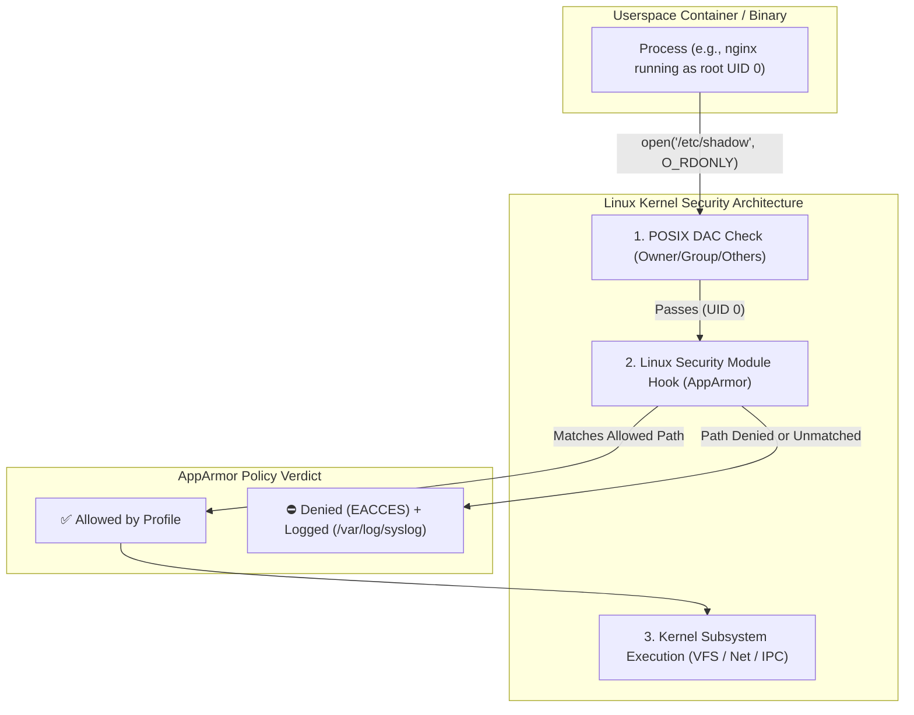
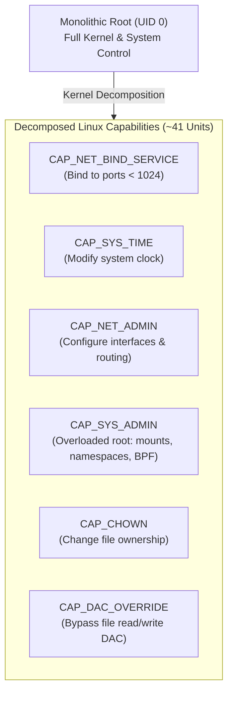
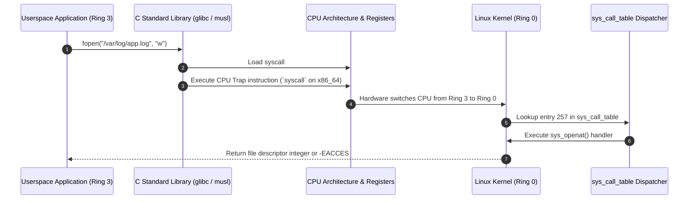
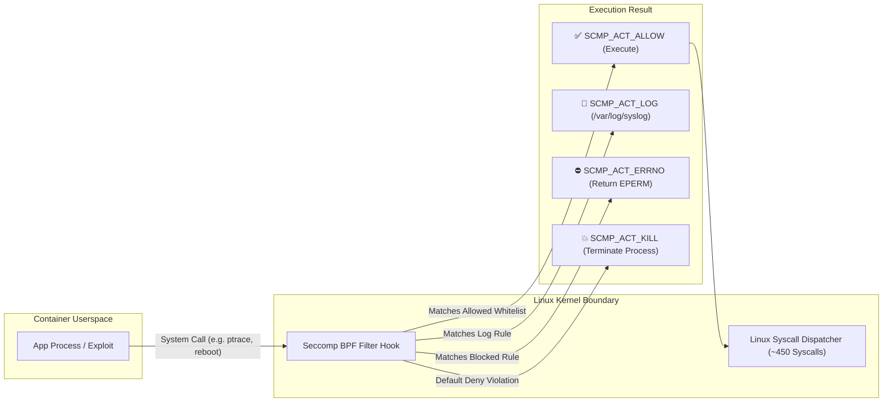
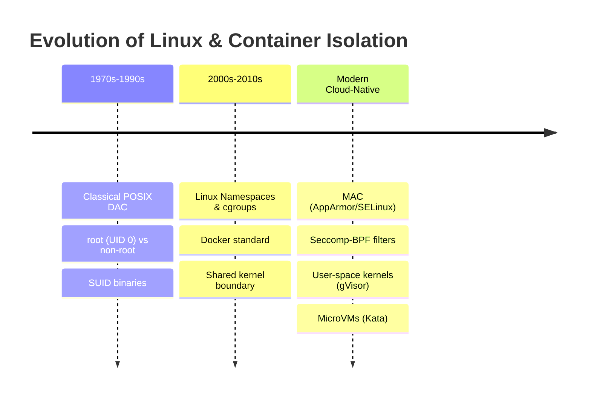

# Module 0-7-9: Workload Kernel Isolation, Seccomp, AppArmor & Linux Capabilities

**Breadcrumbs:** [[0-Index - Kubernetes|🏠 Kubernetes Reference MOC]] > [[0-Index - CKS|🛡️ CKS Reference MOC]] > **Module 0-7-9**

> [!NOTE] Companion Module
> Host-level operating system hardening, socket connection queues (ss), systemd unit architecture, kernel module blacklisting, SUID/SGID auditing, SSH hardening, and CIS node benchmarks are codified in **[[Reference Notes/0-7-7_host_operating_system_and_node_hardening.md|Module 0-7-7: Host Operating System & Node Hardening]]**.

---

## 1. Mandatory Access Control: AppArmor
**AppArmor** is a Linux Security Module (LSM) that enforces path-based Mandatory Access Control (MAC). While Discretionary Access Control (DAC) bases authorization strictly on file permissions (`rwxr-xr-x`) and user identity (`UID/GID`), AppArmor confines individual programs by restricting the system resources, file paths, and kernel capabilities they can access, **regardless of whether the program runs as `root` (`UID 0`)**.



---

### 4.1 AppArmor Kernel Architecture & Operational Modes

AppArmor operates within the Linux kernel via LSM hooks attached to system calls. Workloads are evaluated under one of three operational states:

1. **Enforce Mode (`enforce`):**
   * Policies are actively enforced.
   * Any violation (e.g. attempting to write to a denied path or access an undeclared socket) is blocked immediately with `Permission denied` (`-EACCES`).
   * Violation details are recorded to `/var/log/syslog` or `/var/log/audit/audit.log`.
2. **Complain Mode (`complain`):**
   * Violations are **not blocked**; the operation is permitted to execute normally.
   * A security warning audit log is generated.
   * Used for behavioral profiling, development, and policy baseline testing.
3. **Unconfined:**
   * The process operates with standard DAC permissions without any AppArmor restriction.

---

### 4.2 AppArmor Profile Anatomy & Rule Syntax

AppArmor profiles are plain-text configuration files structured with an optional include header, a profile identifier, flags, and permission rule bodies.

#### 4.2.1 Profile Skeleton:
```text
#include <tunables/global>

profile custom-nginx-profile flags=(attach_disconnected,mediate_deleted) {
  #include <abstractions/base>
  #include <abstractions/nameservice>

  # Network Directives
  network inet tcp,
  network inet udp,

  # Capability Directives
  capability net_bind_service,
  deny capability sys_admin,

  # File Path Access Rules
  /etc/nginx/** r,
  /var/log/nginx/* w,
  /var/run/nginx.pid rw,
  /usr/sbin/nginx rix,

  # Explicit Hard Denials
  deny /etc/shadow r,
  deny /** w,
}
```

#### 4.2.2 File Permission Modifiers:
| Mode Flag | Permission Type | Description |
| :--- | :--- | :--- |
| `r` | Read | Allows reading file content or listing directories. |
| `w` | Write | Allows writing, modifying, creating, or truncating files. |
| `a` | Append | Allows appending data to the end of a file (cannot overwrite). |
| `k` | Lock | Allows acquiring advisory POSIX file locks. |
| `l` | Link | Allows creating hard links to the target path. |

#### 4.2.3 File Execution Qualifiers:
Execution rules govern how child processes are spawned and confined:
- **`ix` (Inherit in-place):** The spawned binary executes under the **same** AppArmor profile as the parent process.
- **`px` / `Px` (Discrete Profile transition):** The binary must transition into its own specific profile. The capitalized `Px` scrubs environment variables (e.g., `LD_PRELOAD`, `LD_LIBRARY_PATH`) to prevent environment injection attacks.
- **`cx` / `Cx` (Transition to Child profile):** The binary transitions into a sub-profile defined inside the parent profile block.
- **`ux` / `Ux` (Unconfined execution):** The binary executes completely unconfined. **High security hazard:** never grant `ux` to shells (`/bin/sh`, `/bin/bash`) inside untrusted containers!

#### 4.2.4 Path Globbing Syntax:
- `*` : Matches any characters within a single directory level (does not match `/`).
- `**` : Matches characters across multiple directory levels recursively (including `/`).
- `?` : Matches exactly one single character.
- `[abc]` : Matches any single character from the specified set.

---

### 4.3 Profiling Toolchain & Management (`apparmor-utils`)

Managing AppArmor profiles on host nodes utilizes the Linux `apparmor-utils` suite:

```bash
# Install AppArmor management utilities
apt-get update && apt-get install -y apparmor-utils apparmor-profiles

# 1. Inspect loaded profiles, enforcement modes, and confined processes
aa-status

# 2. Parse and load a new profile into the kernel
apparmor_parser -q /etc/apparmor.d/custom-profile

# 3. Reload or update an existing profile (In-place kernel replacement)
apparmor_parser -r /etc/apparmor.d/custom-profile

# 4. Unload / remove a profile from the kernel
apparmor_parser -R /etc/apparmor.d/custom-profile

# 5. Switch an active profile between complain and enforce modes
aa-complain /etc/apparmor.d/custom-profile
aa-enforce /etc/apparmor.d/custom-profile
```

#### 4.3.1 Interactive Profile Generation Workflow (`aa-genprof` & `aa-logprof`):
1. **Initialize Profiling:** Run `aa-genprof <executable>`. This creates a basic profile stub in complain mode.
2. **Exercise Application:** Run the target application through standard workflows, test suites, or traffic flows.
3. **Analyze Audit Events:** Run `aa-logprof`. It parses `/var/log/syslog` for complaint events and interactively asks whether to `(A)llow`, `(D)eny`, or use standard abstractions.
4. **Lock Down into Enforce Mode:** Switch to enforce mode via `aa-enforce`.

---

### 4.4 Kubernetes Integration Architecture

To enforce AppArmor profiles in Kubernetes, the target profile **MUST be loaded into the Linux kernel of EVERY worker node** where the pod may be scheduled. Kubernetes does not distribute host AppArmor profile files; it only instructs the container runtime (`containerd`/`CRI-O`) to attach the profile when spawning the container.

#### 4.4.1 Modern Kubernetes (v1.30+ GA Native Field):
Starting in Kubernetes v1.30, AppArmor transitioned to GA and is configured directly in the Pod or container `securityContext`:

```yaml
apiVersion: v1
kind: Pod
metadata:
  name: secured-web-pod
spec:
  securityContext:
    # Pod-level AppArmor defaulting (applies to all containers)
    appArmorProfile:
      type: RuntimeDefault
  containers:
  - name: web-app
    image: nginx:1.25-alpine
    securityContext:
      # Container-level custom AppArmor profile override
      appArmorProfile:
        type: Localhost
        localhostProfile: custom-nginx-profile
```

Supported `appArmorProfile.type` values:
- **`RuntimeDefault`**: Uses the container runtime default profile (e.g. `docker-default` or containerd's default).
- **`Localhost`**: Uses a profile loaded in the worker node's kernel named by `localhostProfile`.
- **`Unconfined`**: Completely disables AppArmor confinement for the container.

#### 4.4.2 Legacy Annotation Syntax (Kubernetes v1.29 and earlier):
In older clusters, AppArmor was configured via beta pod annotations:
```yaml
apiVersion: v1
kind: Pod
metadata:
  name: secured-web-legacy
  annotations:
    container.apparmor.security.beta.kubernetes.io/web-app: "localhost/custom-nginx-profile"
spec:
  containers:
  - name: web-app
    image: nginx:1.25-alpine
```

> [!CAUTION]
> If a Pod specifies `type: Localhost` with `localhostProfile: custom-nginx-profile`, but that profile is **not loaded** on the scheduled node's kernel (`aa-status` does not list it), the container runtime will reject creation with:
> `CreateContainerError: Error response from daemon: AppArmor profile custom-nginx-profile does not exist` or `FailedCreatePodSandBox`.

---

### 4.5 AppArmor Audit Logging & Troubleshooting

When a container violates its AppArmor profile, the Linux kernel logs the rejection.

#### 4.5.1 Reading Kernel Denial Logs:
```bash
# On the worker node hosting the pod:
dmesg | grep -i apparmor
# Or via system logs:
tail -f /var/log/syslog | grep -i apparmor
```

#### 4.5.2 Decoding Audit Log Fields:
```text
audit: type=1400 audit(1620000000.123:456): apparmor="DENIED" operation="open" profile="k8s-deny-write" name="/etc/shadow" pid=1234 comm="cat" requested_mask="r" denied_mask="r" fsuid=0 ouid=0
```
- **`apparmor="DENIED"`**: Identifies a hard policy violation.
- **`operation="open"`**: The kernel system call operation attempted by the process.
- **`profile="k8s-deny-write"`**: The active AppArmor profile that blocked the action.
- **`name="/etc/shadow"`**: The exact filesystem target attempted to access.
- **`requested_mask="r"`**: Access mode requested by process (`r` = read).
- **`denied_mask="r"`**: Specific access mode denied by the kernel.
- **`comm="cat"`**: The command/binary that executed the call.

---

### 4.6 AARF Deep-Intuition Analysis: AppArmor Mandatory Access Control
1. **The Answer (Core Pattern):** Install profiles to `/etc/apparmor.d/`, load them with `apparmor_parser -r`, and reference them via `.spec.securityContext.appArmorProfile.type: Localhost` with `localhostProfile: <profile-name>`. For standard workloads, enforce `RuntimeDefault`.
2. **The Assumptions (Context):** The host kernel has AppArmor enabled (`CONFIG_SECURITY_APPARMOR=y`). The container runtime (`containerd`/`CRI-O`) is compiled with AppArmor support. The profile exists on all candidate nodes.
3. **The Rationale (Why):** Linux containers share the host kernel. Discretionary access controls (file modes and UID 0) fail once a process is running as root or exploits a local root vulnerability. AppArmor acts as an independent, non-bypassable kernel gatekeeper, confining root processes to only designated directories and system capabilities.
4. **The Failure Loop (What If Not):** Without AppArmor, a compromised container process running as root can access host devices, mount unconfined filesystems, modify sensitive configuration files, or overwrite container binaries. If an unconfined profile is specified (`type: Unconfined`), the container operates without any path confinement.
5. **The Alternative Case (When to Use SELinux Instead):** AppArmor is path-based and easier to write and audit manually. In Red Hat ecosystems (RHEL, OpenShift), **SELinux** is the standard LSM, relying on inode security labels (types/contexts) rather than filesystem paths.
6. **The Evolutionary Bridge:**
   * **Classical UNIX:** Relied exclusively on DAC (`rwxrwxrwx`) and root (`UID 0`). Root had total authority.
   * **LSM Framework (Linux 2.6):** Standardized hooks inside kernel system call paths. AppArmor was developed by Immunix and acquired by Novell/Canonical to provide an intuitive, path-based alternative to SELinux.
   * **Kubernetes Integration (v1.4 to v1.30+):** Existed as a beta annotation for nearly a decade; promoted to GA in v1.30 as a first-class citizen in `.spec.securityContext.appArmorProfile`.

---

## 2. Linux Capabilities & Principle of Least Privilege

In traditional UNIX systems, process authorization was binary: a process was either **privileged** (`UID 0` / `root`) with unrestricted access, or **unprivileged** (`non-root`) subject to DAC permission checks. This all-or-nothing model created massive security hazards, as small utilities requiring minimal privileged actions (e.g. `ping` requiring raw sockets, `ntp` setting system clocks) had to run with full root authority.

**Linux Capabilities** (introduced in POSIX 1003.1e and implemented in the Linux kernel) decompose the monolithic power of `root` into ~41 distinct, granular units of privilege.



---

### 5.1 The Five Kernel Capability Sets

Every Linux process maintains five separate capability sets tracked in its kernel `task_struct`:

1. **Permitted Set (`P`):** The limiting superset of capabilities that the process may enable or transition into its Effective set.
2. **Effective Set (`E`):** The capabilities currently **actively used** by the kernel to perform permission checks for syscalls.
3. **Inheritable Set (`I`):** Capabilities preserved across an `execve()` system call when executing non-privileged binaries.
4. **Bounding Set (`B`):** A kernel mechanism that restricts the maximum capabilities a process can ever acquire across subsequent `execve()` calls.
5. **Ambient Set (`A`):** Capabilities that are preserved across `execve()` calls even when executing non-SUID/non-privileged binaries without file capabilities.

---

### 5.2 Critical Capabilities Matrix in Container Environments

Container runtimes drop most Linux capabilities by default. However, specific capabilities represent critical host takeover risks:

| Capability | Privileges Granted | Security Risk Level |
| :--- | :--- | :--- |
| **`CAP_SYS_ADMIN`** | Overloaded administrative power: mount/unmount filesystems, create namespaces, load BPF programs, configure cgroups. | 🔴 **Extreme (Root Equivalence)** - Allows container breakouts and kernel exploitation. |
| **`CAP_NET_ADMIN`** | Modify network interfaces, iptables/nftables firewall rules, ARP tables, routing tables. | 🔴 **Critical** - Enables traffic interception, spoofing, and NetworkPolicy bypass. |
| **`CAP_SYS_TIME`** | Set the system hardware clock and real-time clock (`date -s`, `settimeofday`). | 🟡 **High** - Corrupts system time on the host and invalidates TLS certificates cluster-wide. |
| **`CAP_SYS_PTRACE`** | Trace arbitrary processes via `ptrace` system call. | 🔴 **Critical** - Allows memory inspection, code injection, and credential dumping from other processes. |
| **`CAP_DAC_OVERRIDE`** | Bypass all filesystem read, write, and execute permission checks. | 🟡 **High** - Allows reading or modifying any file on the system regardless of DAC permissions. |
| **`CAP_NET_BIND_SERVICE`**| Bind a socket to privileged system ports (< 1024). | 🟢 **Low / Benign** - Required for web servers (Nginx/Apache) listening on port 80/443. |
| **`CAP_CHOWN`** | Change file ownership arbitrarily. | 🟢 **Low / Operational** - Common in database or storage init containers. |

---

### 5.3 Auditing & Decoding Capabilities via CLI

Inspect process and binary capabilities using standard Linux diagnostic tools:

```bash
# 1. Inspect capabilities of a running process by PID
getpcaps 1234
# Example Output: 1234: cap_net_bind_service=ep

# 2. Inspect capability masks from /proc/<PID>/status
grep Cap /proc/$$/status
# CapInh: 0000000000000000
# CapPrm: 00000000a80425fb
# CapEff: 00000000a80425fb
# CapBnd: 00000000a80425fb
# CapAmb: 0000000000000000

# 3. Decode a hexadecimal capability bitmask into human-readable names
capsh --decode=00000000a80425fb

# 4. Audit file capabilities on binaries (replaces SUID)
getcap /usr/bin/ping
# Output: /usr/bin/ping cap_net_raw=ep

# 5. Assign file capabilities to a binary without giving it SUID root
setcap 'cap_net_bind_service=+ep' /usr/local/bin/custom-webserver
```

---

### 5.4 Hardening Workloads with Kubernetes SecurityContext

The gold standard in production container security is to **drop all capabilities** by default and explicitly add back only what is strictly required:

```yaml
apiVersion: v1
kind: Pod
metadata:
  name: hardened-capabilities-pod
spec:
  containers:
  - name: web-server
    image: nginx:1.25-alpine
    securityContext:
      # Enforce non-root execution
      runAsNonRoot: true
      runAsUser: 10001
      runAsGroup: 10001
      # Prevent gaining additional privileges via SUID binaries
      allowPrivilegeEscalation: false
      # Drop ALL default capabilities and add only port binding
      capabilities:
        drop:
        - ALL
        add:
        - NET_BIND_SERVICE
```

#### Verifying Capability Restrictions Inside Containers:
If a container with dropped `SYS_TIME` attempts to adjust the system clock:
```bash
kubectl exec -it hardened-capabilities-pod -- date -s "19 APR 2030 12:00:00"
# Result: date: cannot set date: Operation not permitted
```

---

### 5.5 AARF Deep-Intuition Analysis: Linux Capabilities & Least Privilege
1. **The Answer (Core Pattern):** In all workload Pods, configure `securityContext.capabilities.drop: ["ALL"]` and only add back minimal functional requirements (e.g. `NET_BIND_SERVICE` or `CHOWN`). Pair with `allowPrivilegeEscalation: false` and `runAsNonRoot: true`.
2. **The Assumptions (Context):** The underlying Linux kernel supports POSIX capabilities (standard in modern Linux kernels). Container runtimes (containerd/runc) apply the bounding set filter before executing the container entrypoint.
3. **The Rationale (Why):** By default, container runtimes grant ~14 baseline capabilities to containers (including `CHOWN`, `DAC_OVERRIDE`, `FOWNER`, `SETUID`, `SETGID`, `NET_RAW`). If an attacker exploits an application vulnerability, retaining these capabilities allows them to craft raw network packets (ARP spoofing) or modify local permissions. Dropping `ALL` removes these vectors entirely.
4. **The Failure Loop (What If Not):** Granting `CAP_SYS_ADMIN` or running with `--privileged` gives containers near-complete kernel authority, enabling namespace escape attacks, raw block device writes, and host kernel module manipulation.
5. **The Alternative Case (When Additional Capabilities are Required):** Networking daemonsets (e.g., Calico, Cilium, kube-proxy) require `CAP_NET_ADMIN` and `CAP_NET_RAW` to program host routing tables and eBPF maps. Storage CSI node plugins require `CAP_SYS_ADMIN` to execute block device mounts. In these specialized scenarios, isolate the pods to dedicated, secured control planes or system namespaces.
6. **The Evolutionary Bridge:**
   * **Monolithic Root:** Historical UNIX had no concept of capability segmentation; software had to be granted complete root access.
   * **POSIX Capabilities:** Decomposed root into ~41 bits, allowing binaries to hold isolated powers via file attributes (`setcap`).
   * **Container Security Profiles:** Container runtimes strip dangerous capabilities from the Bounding Set. Modern Pod Security Admission (`Restricted` standard) requires explicitly dropping `ALL` capabilities with only `NET_BIND_SERVICE` conditionally permitted.

---

## 6. Linux Syscall Mechanics & `strace` Diagnostic Profiling

Linux system calls (syscalls) form the fundamental, non-bypassable programmatic boundary between user-space applications and the operating system kernel. Whenever an application reads a file, binds a socket, forks a child process, or allocates memory, it must issue a syscall into Ring 0 kernel space.



---

### 6.1 Anatomy of a System Call
1. **Userspace Execution (Ring 3):** User code executes in restricted hardware protection rings without direct access to physical memory, hardware devices, or kernel structures.
2. **The `syscall` CPU Trap:** To request privileged hardware or OS services, the processor loads the system call index number into the `RAX` register and function arguments into `RDI`, `RSI`, `RDX`, `R10`, `R8`, `R9`. It executes the architecture-specific trap instruction (`syscall` on x86_64, `svc` on ARM64).
3. **Kernelspace Execution (Ring 0):** The CPU transitions to Ring 0. The kernel's system call dispatcher indexes into `sys_call_table`, runs the corresponding C function, and transitions back to userspace with the return code.

---

### 6.2 Behavioral Discovery & Profiling with `strace`

`strace` is a diagnostic, debugging, and instructional userspace utility for Linux that intercepts and records system calls made by a process and the signals received. It is the primary tool for discovering the exact syscall whitelist required to build Seccomp profiles.

```bash
# 1. Summarize syscall counts, errors, and execution time (-c flag)
strace -c /usr/sbin/nginx -g 'daemon off;'
# Output provides a statistical breakdown:
# % time     seconds  usecs/call     calls    errors syscall
# ------ ----------- ----------- --------- --------- ----------------
#  45.12    0.001250          12       104           epoll_wait
#  20.30    0.000562           5       112           read
#  15.10    0.000418           4       105           write
#   8.20    0.000227           7        32           openat

# 2. Filter specifically for file-related or network-related syscalls
strace -e trace=openat,read,write,close,connect ls -la

# 3. Trace a live running process by PID (-p) and follow child threads (-f)
strace -f -p $(pgrep -n nginx) -o /tmp/nginx-syscalls.log

# 4. Trace syscall timestamps with microsecond resolution (-tt)
strace -tt -p 1234
```

---

### 6.3 Connecting `strace` to Seccomp Whitelist Formulation

When developing custom Seccomp profiles for proprietary or third-party containers:
1. **Capture Syscalls with `strace`:** Execute the application binary under `strace -c` through all peak workloads, edge cases, and startup routines.
2. **Extract Syscall Names:** Take the resulting list of observed syscall names (e.g. `epoll_create1`, `epoll_pwait`, `accept4`, `writev`).
3. **Incorporate Runtime Requirements:** Add the baseline startup syscalls required by the container runtime entrypoint (`execve`, `brk`, `mmap`, `rt_sigaction`, `arch_prctl`, `futex`).
4. **Compile JSON Profile:** Place the allowed syscall names into `/var/lib/kubelet/seccomp/profiles/<app>.json` with `"defaultAction": "SCMP_ACT_ERRNO"`.

---

## 4. Linux Seccomp (Secure Computing Mode)

**Seccomp (Secure Computing Mode)** is a Linux kernel security feature (introduced in Linux 2.6.12 and expanded with seccomp-bpf in Linux 3.5) that restricts the system calls (syscalls) a process can issue from userspace into kernelspace. If an attacker compromises an application container, seccomp prevents them from invoking unauthorized kernel functionality—such as loading kernel modules, manipulating routing tables, rebooting the host, or escalating privileges.



---

### 7.1 Seccomp Profiles Anatomy & Action Codes

Seccomp profiles are defined in JSON format. A profile specifies a default action and an array of architectures and system call rules:

```json
{
  "defaultAction": "SCMP_ACT_ERRNO",
  "architectures": [
    "SCMP_ARCH_X86_64",
    "SCMP_ARCH_X86",
    "SCMP_ARCH_X32"
  ],
  "syscalls": [
    {
      "names": [
        "read",
        "write",
        "close",
        "exit_group"
      ],
      "action": "SCMP_ACT_ALLOW"
    }
  ]
}
```

#### Core Action Codes:
| Seccomp Action Code | Kernel Behavior | Primary Use Case |
| :--- | :--- | :--- |
| **`SCMP_ACT_ALLOW`** | Allows the syscall to proceed normally into the kernel. | Whitelisting required application operations. |
| **`SCMP_ACT_LOG`** | Allows the syscall to execute, but generates an audit record in the system log. | Development, behavioral profiling, and non-blocking discovery. |
| **`SCMP_ACT_ERRNO`** | Blocks the syscall immediately and returns an error code (`EPERM` by default) to the calling process without crashing it. | Graceful denial of optional or non-critical syscalls. |
| **`SCMP_ACT_KILL`** | Terminates the calling thread immediately. | Legacy hard containment. |
| **`SCMP_ACT_KILL_PROCESS`** | Terminates the entire process immediately upon invoking a forbidden syscall. | High-security zero-tolerance enforcement. |
| **`SCMP_ACT_TRACE`** | Notifies an attached `ptrace` tracer to inspect or emulate the call. | Debugging, sandboxes, and userspace instrumentation. |

---

### 7.2 Node Storage & Path Resolution (`/var/lib/kubelet/seccomp`)

In Kubernetes, custom seccomp profiles reside locally on each worker node under the Kubelet root directory:
```bash
/var/lib/kubelet/seccomp/
```

When referencing a profile via `type: Localhost` in a Pod manifest:
```yaml
securityContext:
  seccompProfile:
    type: Localhost
    localhostProfile: profiles/audit.json
```
The Kubelet resolves `localhostProfile` **relative** to `/var/lib/kubelet/seccomp/`. Thus, the actual path on the node's disk is:
```bash
/var/lib/kubelet/seccomp/profiles/audit.json
```

> [!CAUTION]
> If the JSON file does not exist on the node where the pod is scheduled, the pod fails to start with `CreateContainerError` or `FailedCreatePodSandBox`. Because pods can be scheduled onto any worker node, custom profiles must be distributed across all nodes (e.g. via a DaemonSet or node automation).

---

### 7.3 The Four-Stage Syscall Profiling & Whitelisting Workflow

Deriving the minimum set of syscalls required for a containerized application follows an iterative four-stage lifecycle:

```mermaid
sequenceDiagram
    autonumber
    participant Dev as Security Engineer / CI
    participant Node as Worker Node Disk
    participant Kube as Kubernetes Pod
    participant Log as /var/log/syslog (Audit)

    Dev->>Node: 1. Deploy audit.json (defaultAction: SCMP_ACT_LOG)
    Dev->>Kube: 2. Launch Pod with localhostProfile: profiles/audit.json
    Kube->>Log: 3. Exercise app; Kernel logs audit type=1326 syscall IDs
    Dev->>Dev: 4. Extract syscall IDs & convert to names
    Dev->>Node: 5. Deploy fine-grained.json (defaultAction: ERRNO + allowed names)
    Dev->>Kube: 6. Enforce fine-grained profile in production Pod
    Kube-->>Dev: 7. Pod runs normally with 0 audit violations
```

#### Stage 1: Deploy Non-Blocking Audit Profile (`audit.json`)
Create `/var/lib/kubelet/seccomp/profiles/audit.json`:
```json
{
  "defaultAction": "SCMP_ACT_LOG"
}
```
Apply the audit profile to the Pod:
```yaml
apiVersion: v1
kind: Pod
metadata:
  name: audit-pod
spec:
  securityContext:
    seccompProfile:
      type: Localhost
      localhostProfile: profiles/audit.json
  containers:
  - name: test-container
    image: hashicorp/http-echo:1.0
    args: ["-text=just made some syscalls!"]
    securityContext:
      allowPrivilegeEscalation: false
```

#### Stage 2: Capture and Inspect Kernel Audit Logs
Exercise the container workload by sending traffic, then monitor the host syslog (`/var/log/syslog` or `/var/log/audit/audit.log`):
```bash
# Filter for audit logs generated by the container process
tail -f /var/log/syslog | grep 'http-echo'
```
Example raw kernel audit output:
```text
audit: type=1326 audit(1594067860.484:14536): auid=4294967295 uid=0 gid=0 ses=4294967295 pid=29064 comm="http-echo" exe="/http-echo" sig=0 arch=c000003e syscall=51 compat=0 ip=0x46fe1f code=0x7ffc0000
audit: type=1326 audit(1594067860.484:14537): auid=4294967295 uid=0 gid=0 ses=4294967295 pid=29064 comm="http-echo" exe="/http-echo" sig=0 arch=c000003e syscall=54 compat=0 ip=0x46fdba code=0x7ffc0000
audit: type=1326 audit(1594067860.484:14538): auid=4294967295 uid=0 gid=0 ses=4294967295 pid=29064 comm="http-echo" exe="/http-echo" sig=0 arch=c000003e syscall=202 compat=0 ip=0x455e53 code=0x7ffc0000
audit: type=1326 audit(1594067860.484:14540): auid=4294967295 uid=0 gid=0 ses=4294967295 pid=29064 comm="http-echo" exe="/http-echo" sig=0 arch=c000003e syscall=0 compat=0 ip=0x46fd44 code=0x7ffc0000
```

##### Decoding Audit Fields:
- **`type=1326`**: Standard Linux kernel audit identifier `AUDIT_SECCOMP`.
- **`syscall=51`**: The numeric system call table index on x86_64 (`51` = `getsockname`, `54` = `setsockopt`, `202` = `futex`, `0` = `read`).
- **`arch=c000003e`**: Hexadecimal architecture identifier (`c000003e` corresponds to `AUDIT_ARCH_X86_64`).
- **`code=0x7ffc0000`**: Action result bitmask (`SECCOMP_RET_LOG`).
- **`comm="http-echo"`**: The executable command string executing the call.

#### Stage 3: Observe Total Denial Failure (`violation.json`)
To understand what occurs when required syscalls are denied, test `/var/lib/kubelet/seccomp/profiles/violation.json`:
```json
{
  "defaultAction": "SCMP_ACT_ERRNO"
}
```
When attached via `localhostProfile: profiles/violation.json`, the container immediately crashes with `CrashLoopBackOff`:
```bash
kubectl get pod violation-pod
# NAME            READY   STATUS             RESTARTS   AGE
# violation-pod   0/1     CrashLoopBackOff   1          6s
```
Because even basic startup calls (`execve`, `mmap`, `brk`, `rt_sigaction`) are blocked with `EPERM`, the process cannot initialize.

#### Stage 4: Craft and Enforce the Production Whitelist (`fine-grained.json`)
Compile the audited syscalls into a strict whitelist at `/var/lib/kubelet/seccomp/profiles/fine-grained.json`:
```json
{
  "defaultAction": "SCMP_ACT_ERRNO",
  "architectures": [
    "SCMP_ARCH_X86_64",
    "SCMP_ARCH_X86",
    "SCMP_ARCH_X32"
  ],
  "syscalls": [
    {
      "names": [
        "accept4",
        "arch_prctl",
        "bind",
        "brk",
        "clock_gettime",
        "clone",
        "close",
        "connect",
        "dup2",
        "epoll_create1",
        "epoll_ctl",
        "epoll_pwait",
        "epoll_wait",
        "execve",
        "exit",
        "exit_group",
        "fcntl",
        "fstatfs",
        "futex",
        "getdents64",
        "getpid",
        "getrlimit",
        "getsockname",
        "gettid",
        "getuid",
        "ioctl",
        "listen",
        "madvise",
        "mmap",
        "mprotect",
        "munmap",
        "nanosleep",
        "open",
        "openat",
        "pipe2",
        "poll",
        "pselect6",
        "read",
        "readlinkat",
        "recvfrom",
        "rt_sigaction",
        "rt_sigprocmask",
        "rt_sigreturn",
        "sched_getaffinity",
        "sched_yield",
        "sendto",
        "set_tid_address",
        "setitimer",
        "setsockopt",
        "sigaltstack",
        "socket",
        "vfork",
        "write",
        "writev"
      ],
      "action": "SCMP_ACT_ALLOW"
    }
  ]
}
```
Deploy the hardened Pod:
```yaml
apiVersion: v1
kind: Pod
metadata:
  name: fine-pod
spec:
  securityContext:
    seccompProfile:
      type: Localhost
      localhostProfile: profiles/fine-grained.json
  containers:
  - name: test-container
    image: hashicorp/http-echo:1.0
    args: ["-text=just made some syscalls!"]
    securityContext:
      allowPrivilegeEscalation: false
```
The pod transitions to `Running` without generating any error codes or `/var/log/syslog` audit entries.

---

### 7.4 Seccomp Profile Types in Pod Specs

Kubernetes supports three profile types in `.spec.securityContext.seccompProfile` (or per-container `.spec.containers[*].securityContext.seccompProfile`):

```yaml
apiVersion: v1
kind: Pod
metadata:
  name: seccomp-types-demo
spec:
  securityContext:
    seccompProfile:
      # Option 1: Built-in container runtime default profile (Recommended for 95% of workloads)
      type: RuntimeDefault

      # Option 2: Custom local file on node (/var/lib/kubelet/seccomp/<path>)
      # type: Localhost
      # localhostProfile: profiles/fine-grained.json

      # Option 3: Explicitly unconfined (Disables seccomp filtering)
      # type: Unconfined
```

| Profile Type | Description & Behavior | Pod Security Standard (PSS) Tier |
| :--- | :--- | :--- |
| **`RuntimeDefault`** | Uses the container runtime's built-in seccomp profile (containerd / CRI-O). Blocks ~50 dangerous/obsolete syscalls (e.g. `reboot`, `sys_chroot`, `kexec_load`, `bpf`, `mount`, `swapon`, `clock_settime`) while keeping all standard application operations functional. | **Restricted** |
| **`Localhost`** | Loads a custom JSON profile stored locally under `/var/lib/kubelet/seccomp/`. Must specify `localhostProfile`. | **Restricted** (if valid profile) |
| **`Unconfined`** | Disables seccomp filtering entirely for the container. | **Privileged / Baseline** |

> [!IMPORTANT]
> **The `privileged: true` Override Trap:** It is **impossible** to apply a seccomp profile to any container configured with `privileged: true` in its container `securityContext`. Privileged containers **always execute as Unconfined**, bypassing both `RuntimeDefault` and custom profiles!

> [!TIP]
> **Privilege Escalation Requirement:** Always pair seccomp with `allowPrivilegeEscalation: false`. Setting this flag enables the Linux kernel's `no_new_privs` bit, ensuring that child processes spawned via `execve` cannot bypass the seccomp filter by invoking setuid/setgid binaries.

---

### 7.5 Cluster-Wide Node Defaulting (`SeccompDefault`)

*Feature State: **Stable (GA) since Kubernetes v1.27**.*

Prior to v1.27, any Pod deployed without an explicit `.spec.securityContext.seccompProfile` fell back to **`Unconfined`** (no syscall filtering). Enabling cluster-wide seccomp defaulting ensures that any unconfigured pod automatically inherits **`RuntimeDefault`**.

#### Configuration Methods on Worker Nodes:
1. **Via Kubelet Command-Line Flag:**
   ```bash
   --seccomp-default=true
   ```
2. **Via Kubelet Configuration File (`/var/lib/kubelet/config.yaml`):**
   ```yaml
   apiVersion: kubelet.config.k8s.io/v1beta1
   kind: KubeletConfiguration
   seccompDefault: true
   ```
   Restart the Kubelet to apply:
   ```bash
   systemctl restart kubelet
   ```

#### Key Characteristics of Node Defaulting:
- **Zero API Mutation:** Enabling `seccompDefault: true` does **not** mutate the Pod manifest in `etcd` or inject API fields into `.spec.securityContext`. The defaulting is handled purely at the node level by Kubelet and CRI, providing transparent rollback without updating application manifests.
- **Verification via CRI (`crictl`):**
   Because the API server does not reflect the defaulted profile in `kubectl get pod -o yaml`, verify enforcement directly against the container runtime:
   ```bash
   crictl inspect $(crictl ps --name=my-app -q) | jq .info.runtimeSpec.linux.seccomp
   ```
   Expected output confirms `SCMP_ACT_ERRNO` default action with architecture filters.

#### Exception Handling for Workloads Broken by `RuntimeDefault`:
If a specialized workload (e.g. storage CSI plugins, network tracing tools) fails under `RuntimeDefault`:
1. Explicitly set `type: Unconfined` in that specific pod's `securityContext`.
2. Craft a custom `Localhost` profile permitting the required system calls.
3. Schedule the workload onto a dedicated node group where `seccompDefault` is set to `false`.

---

### 7.6 AARF Deep-Intuition Analysis: Seccomp Syscall Filtering
1. **The Answer (Core Pattern):** Apply `seccompProfile.type: RuntimeDefault` to all standard workloads and enable `seccompDefault: true` on all worker node Kubelets. For high-security environments, profile applications using `audit.json` (`SCMP_ACT_LOG`) and craft strict `Localhost` whitelists (`SCMP_ACT_ERRNO` + allowed names).
2. **The Assumptions (Context):** Applications run in standard unprivileged containers (`privileged: false`) with `allowPrivilegeEscalation: false`. Worker nodes run Linux kernels v3.5+ with `CONFIG_SECCOMP=y` and `CONFIG_SECCOMP_FILTER=y`.
3. **The Rationale (Why):** Linux containers share the host operating system kernel. Over 450 system calls exist in Linux, but modern microservices need only 40–70. Dropping the remaining 380+ syscalls neutralizes kernel exploit chains (privilege escalation, namespace breakouts, memory corruption) before they reach the dispatcher.
4. **The Failure Loop (What If Not):** Leaving containers `Unconfined` allows an attacker who achieves RCE inside a container to exploit kernel zero-days (e.g. `Dirty COW`, `Dirty Pipe`, `fs_context` bugs) to gain instant host `root` control.
5. **The Alternative Case (When to Use Sandboxing Instead):** If an application requires hundreds of obscure syscalls, or if multiple untrusted tenants share the same node, crafting seccomp whitelists becomes impractical. In such scenarios, deploy sandboxed userspace kernels (**gVisor `runsc`**) or microVMs (**Kata Containers**) via `RuntimeClass`.
6. **The Evolutionary Bridge:**
   * **Classical UNIX:** No syscall filtering existed; any process with UID 0 could invoke any kernel syscall.
   * **Linux 2.6.12 Seccomp (Strict Mode):** Allowed only 4 syscalls (`read`, `write`, `exit`, `sigreturn`). Any other call triggered `SIGKILL`. Impractical for real applications.
   * **Linux 3.5 Seccomp-BPF:** Berkeley Packet Filter programs evaluate syscall numbers and arguments, allowing dynamic whitelists and return actions (`SCMP_ACT_ERRNO`, `SCMP_ACT_LOG`).
   * **Modern Kubernetes (v1.27+):** Built-in `RuntimeDefault` adoption, native Pod Security Standards Restricted enforcement, and node-wide zero-mutation defaulting.

---

## 5. Sandboxed Container Runtimes: gVisor & Kata Containers

Standard containers share the host Linux kernel directly. If a zero-day kernel exploit is discovered, an escape from a container can compromise the host node. **Sandboxed runtimes** provide hard isolation barriers between workloads and the host kernel.

```mermaid
flowchart TD
    subgraph Standard ["Standard Container (runc)"]
        App1["App Process"] -->|"Direct Syscalls"| HostKernel1["Shared Host Linux Kernel"]
    end

    subgraph gVisor ["gVisor (runsc)"]
        App2["App Process"] -->|"Syscalls"| Sentry["Sentry (Go Userspace Kernel)"]
        Sentry -->|"Filtered Minimal Syscalls"| Gofer["Gofer (File Proxy)"]
        Gofer --> HostKernel2["Host Linux Kernel"]
    end

    subgraph Kata ["Kata Containers"]
        App3["App Process"] --> GuestKernel["Dedicated Guest Kernel"]
        GuestKernel --> QEMU["MicroVM Hypervisor (QEMU / Cloud-Hypervisor)"]
        QEMU --> HostKernel3["Host Linux Kernel"]
    end
```



### 8.1 gVisor (`runsc`)
* Developed by Google; intercepts application syscalls in userspace using an application kernel written in memory-safe Go ("Sentry").
* Implements over 300 Linux syscalls without passing them to the host kernel.

### 8.2 Kata Containers
* Spawns a dedicated, lightweight hardware-assisted virtual machine (microVM) for every pod.
* Uses independent guest kernels per pod, achieving virtual machine-grade isolation with near-container speed.

### 8.3 Configuring `RuntimeClass` in Kubernetes

1. **Register the RuntimeClass:**
   ```yaml
   apiVersion: node.k8s.io/v1
   kind: RuntimeClass
   metadata:
     name: gvisor
   handler: runsc
   ```

2. **Select the RuntimeClass in Pods:**
   ```yaml
   apiVersion: v1
   kind: Pod
   metadata:
     name: untrusted-workload
   spec:
     runtimeClassName: gvisor
     containers:
     - name: worker
       image: python:3.11-slim
       command: ["python", "-c", "import os; print(os.uname())"]
   ```

---

## 6. 🌉 Evolutionary Conceptual Bridging: Workload Isolation



1. **Classical POSIX DAC (Discretionary Access Control):**
   * Relied purely on user/group permissions (`rwxr-xr-x`) and SUID bits. Once a process attained UID 0 (`root`), it had unfettered access to all system calls, physical devices, and memory spaces.
2. **First-Generation Linux Containers:**
   * Container engines like Docker wrapped Linux namespaces (PID, NET, MNT, IPC, UTS, USER) and control groups (`cgroups`).
   * **Failure Mode:** Containers still made direct system calls to the shared host kernel. Any kernel bug (e.g. `Dirty COW`, `cgroupfs` race conditions) allowed instantaneous breakout to the host root shell.
3. **Modern Multi-Tenant Defense-in-Depth:**
   * Modern Kubernetes enforces a multi-layered boundary:
     * **Seccomp** drops non-essential syscalls.
     * **AppArmor** restricts file paths and execution permissions.
     * **gVisor / Kata** interposes an entire virtualization or userspace barrier, rendering shared-kernel vulnerabilities harmless.

<!-- Documentation References -->
[Kubernetes Seccomp Profiles](https://kubernetes.io/docs/concepts/containers/seccomp-profiles/)
[Kubernetes Tutorial: Restrict a Container's Syscalls with seccomp](https://kubernetes.io/docs/tutorials/security/seccomp/)
[Kubernetes AppArmor Profiles Tutorial](https://kubernetes.io/docs/tutorials/security/apparmor/)
[Kubernetes Pod Security Standards](https://kubernetes.io/docs/concepts/security/pod-security-standards/)
[Kubernetes Security Overview](https://kubernetes.io/docs/concepts/security/overview/)
[Linux Capabilities Manual (capabilities 7)](https://man7.org/linux/man-pages/man7/capabilities.7.html)
[strace System Call Tracer Manual (strace 1)](https://man7.org/linux/man-pages/man1/strace.1.html)
[AppArmor Community Documentation](https://gitlab.com/apparmor/apparmor/-/wikis/Documentation)
[KodeKloud CKS: AppArmor in Kubernetes](https://notes.kodekloud.com/docs/Certified-Kubernetes-Security-Specialist-CKS/System-Hardening/AppArmor-in-Kubernetes/page)
[KodeKloud CKS: Linux Capabilities](https://notes.kodekloud.com/docs/Certified-Kubernetes-Security-Specialist-CKS/System-Hardening/Linux-Capabilities/page)
[KodeKloud CKS: Linux Syscalls](https://notes.kodekloud.com/docs/Certified-Kubernetes-Security-Specialist-CKS/System-Hardening/Linux-Syscalls/page)
[KodeKloud CKS: Docker Securing the Daemon](https://notes.kodekloud.com/docs/Certified-Kubernetes-Security-Specialist-CKS/Cluster-Setup-and-Hardening/Docker-Securing-the-Daemon/page)
[KodeKloud CKS: Docker Service Configuration](https://notes.kodekloud.com/docs/Certified-Kubernetes-Security-Specialist-CKS/Cluster-Setup-and-Hardening/Docker-Service-Configuration/page)
